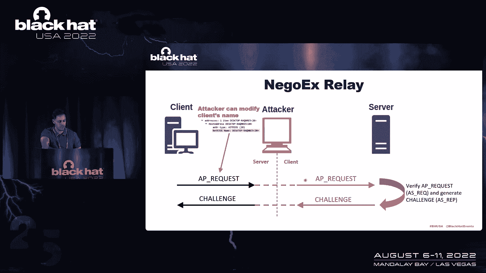

# 课程 P26：027 - Azure AD 加入设备中的新型横向移动技术 🔐

在本节课中，我们将学习一种涉及本地、云和网络的新型横向移动技术。我们将从关键术语和背景知识入手，深入理解用于 Azure AD 加入设备的新认证协议 NEGOEX，并探讨如何利用它进行攻击。最后，我们会了解如何检测这些攻击并总结关键要点。

## 技术背景介绍

在深入探讨攻击技术之前，我们需要先了解一些核心概念，以确保我们在同一认知基础上。

### Azure AD 加入设备

Azure AD 加入设备是直接连接到 Azure AD 并由其管理的设备。默认情况下，只有 Azure AD 账户可以登录此类设备，不存在本地用户。

与本地 Active Directory 域加入设备相比，Azure AD 加入设备主要有两个区别：
1.  **查询方式**：在 Active Directory 中，主要使用 LDAP 查询域控制器；而在 Azure AD 中，主要使用 Graph API 或 REST 调用。
2.  **认证协议**：Active Directory 使用 Kerberos 和 NTLM，而 Azure AD 使用基于 OpenID Connect 和 OAuth 的协议，这也是我们今天要讨论的重点。

> **注意**：本节课不专门讨论混合加入设备，但所展示的技术同样适用于它们。

### Azure AD 加入设备的认证连接

Azure AD 加入设备主要有两种认证场景：
1.  **认证到 SaaS 应用**：使用 **PRT** 交换访问令牌。
2.  **认证到另一台 Azure AD 加入设备**：使用 **P2P 证书**。

#### 主刷新令牌

PRT 是一个 JSON Web 令牌，它同时包含设备和用户的声明。它与本地环境中的 TGT 类似，用于证明身份而无需重新认证。PRT 可以交换为访问令牌以访问应用，或用于获取 P2P 证书。

#### P2P Azure AD 证书

P2P 证书是由 Azure AD 签发的特殊证书，有效期为 1 小时，用于访问网络中的其他 Azure AD 设备。设备加入 Azure AD 后，默认配置为在需要时自动请求新证书。

## 相关认证协议

上一节我们介绍了 Azure AD 设备认证的核心材料，本节中我们来看看支撑 NEGOEX 协议的基础认证协议。

以下是几个关键的认证协议：

*   **Kerberos**：传统的本地认证协议，使用票据进行认证，包含 AS_REQ、TGS_REQ 等步骤。
*   **Kerberos PKINIT**：Kerberos 的扩展，允许使用证书而非密码哈希进行预认证。其会话密钥可以由 KDC 生成，也可以由客户端和服务器通过 Diffie-Hellman 参数协商。
*   **PKU2U**：公钥用户到用户协议，允许在不经过 KDC 的情况下，直接在两个实体间使用 Kerberos 票据进行认证。
*   **GSS-API / SSPI**：安全支持提供程序接口，为其他协议（如 SMB）添加认证层。

## NEGOEX 协议详解

现在，让我们进入今天的主题——NEGOEX 协议。它是用于 Azure AD 加入设备认证的协议，构建在 GSS-API、Kerberos 和 PKU2U 之上。

NEGOEX 默认在所有 Azure AD 加入的 Windows 10（较新版本）和 Windows 11 设备上启用。由于默认没有本地账户，NTLM 无法工作，因此 NEGOEX 成为设备间认证的主要协议。

该协议包含三个阶段：
1.  **初始消息**
2.  **认证消息**
3.  **验证消息**

### 协议流程分析

以下是 NEGOEX 协议交互的核心步骤：

1.  **初始阶段**：
    *   **发起方 NEGO**：客户端发送，包含一个随机数，用于标识会话。
    *   **发起方元数据**：客户端发送，包含将要使用的认证材料信息（如证书）。
    *   服务器用类似的**接受方 NEGO**和**接受方元数据**进行响应。此阶段不进行实质认证。

2.  **认证阶段**：
    *   **AP 请求**：客户端发送一个特殊的 NEGOEX AP 请求，其 PKU2U 部分包含一个使用客户端 P2P 证书的 Kerberos PKINIT AS_REQ。此时会话密钥通过 Diffie-Hellman 参数协商。
    *   **质询消息**：服务器响应，其 PKU2U 部分包含 Kerberos PKINIT AS_REP，内含一张票据和 Diffie-Hellman 参数。
    *   **第二个 AP 请求**：客户端使用收到的票据，发送一个包含普通 Kerberos AP_REQ 的 AP 请求。
    *   **第二个质询消息**：服务器响应 Kerberos AP_REP。至此，Kerberos 认证部分完成。

3.  **验证阶段**：
    *   **验证消息**：客户端发送一个校验和，覆盖之前的所有消息序列。服务器验证此校验和。
    *   服务器响应自己的**验证消息**，包含对另一组消息的校验和。
    *   **校验和密钥**是关键，它隐藏在 Kerberos AP_REQ/AP_REP 消息中，无法直接从协议文档获知，需要通过调试才能发现。

## NEGOEX 中继攻击

理解了 NEGOEX 协议后，我们来看看如何利用它进行横向移动。第一种攻击是 **NEGOEX 中继攻击**，其原理与 NTLM 中继类似，利用了客户端和服务器不直接相互验证的弱点。

攻击者可以冒充服务器或客户端，将认证消息从一个会话中继到另一个会话。攻击中有两种策略：

1.  **直接中继**：不修改任何消息内容。虽然可行，但原始客户端名称会出现在票据中，容易被检测发现（客户端 IP 与名称不匹配）。
2.  **修改客户端名称后中继**：为了规避检测，攻击者修改初始 AP 请求中的客户端名称。但这会导致后续的验证消息校验和不匹配，认证失败。

**攻击者如何绕过验证？**
攻击者可以**强制客户端重新认证**。在第二次认证时，客户端已经拥有攻击者“服务器”的票据，会跳过初始的票据请求阶段，直接使用现有票据进行认证。由于此时攻击者没有修改任何受校验和保护的消息，因此可以成功中继并建立连接。

## 从 PRT 到 P2P 证书的攻击

上一节我们探讨了协议层面的中继攻击，本节中我们来看看另一种基于凭证窃取的攻击路径。

这种攻击的前提是获取了用户的 PRT。以下是攻击步骤：

1.  **生成证书签名请求**：为 PRT 绑定的用户生成一个 CSR。
2.  **构造并签名 JWT**：将 CSR 和 PRT 附加到一个 JWT 中，并使用绑定到该 PRT 的会话密钥对其进行签名。
3.  **请求证书**：将签名的 JWT 发送到 Azure AD。
4.  **接收证书**：从 Azure AD 的响应中获取 P2P 证书（位于 x5c 字段）。
5.  **传递证书**：利用获取的有效 P2P 证书，模拟 SMB 消息，通过 NEGOEX 认证到其他 Azure AD 设备。

一旦攻击者能够访问一台设备，就可以从本地证书存储中导出更多证书，或窃取更多 PRT，从而在网络中持续横向移动。

## 攻击检测与狩猎

了解了攻击方法后，我们必须知道如何防御和发现它们。以下是两种主要的狩猎方法：

*   **Windows 事件日志分析**：
    *   关注事件 ID **4648**（成功登录）和 **4625**（失败登录）。
    *   关键字段：`Domain` 为 Azure AD 域名，`Account Name` 为完整 UPN，`Authentication Package` 为 `NegoExtender`。
    *   特别检查 `Workstation Name` 和 `Source Network Address` 是否匹配。不匹配是明显的中继攻击迹象。
    *   查找来自非常用设备或用户的认证记录。

*   **网络流量分析**：
    *   使用能够解析 PKU2U over NEGOEX 流量的工具（如修改版的 Wireshark）。
    *   从流量中提取证书的**序列号**和**使用者**信息。
    *   狩猎核心在于：**发现同一证书序列号在短时间内从不同 IP 地址的设备使用**。这表明证书可能被窃取并在多台机器上使用。

## 缓解措施与工具

最后，我们来总结一下如何缓解这些威胁以及研究中使用的工具。

**缓解措施**：
1.  **启用 SMB 签名**：这是防御中继攻击最有效的手段。即使攻击者通过中继完成了认证，由于没有会话密钥对 SMB 消息进行签名，也无法执行任何操作，连接最终会失效。
2.  **保护凭证**：将 PRT 和 P2P 证书视为与密码同等重要。及时为系统打补丁，防止使用 Mimikatz 等工具提取 PRT，但需认识到这并非万全之策。

**相关工具**：
*   `NegoexRelay`：用于演示 NEGOEX 中继攻击的工具。
*   `AzureADP2PCertificateRequestTool`：用于将 PRT 转换为 P2P 证书的工具。
*   `PassTheCertAuth`：利用 P2P 证书进行认证的工具。
*   修改版 **Wireshark**：添加了对 NEGOEX 中 PKU2U 部分的解析支持。
*   修改版 **Zeek**：用于从 GSS-API NEGOEX 流量中提取 PKU2U 消息和证书信息。

## 总结与要点

本节课中，我们一起学习了针对 Azure AD 加入设备的新型横向移动技术。

**核心要点总结**：
1.  **新攻击面**：NEGOEX 是 Azure AD 设备间认证的默认协议，为攻击者提供了新的横向移动途径。
2.  **两种攻击路径**：
    *   **协议中继**：利用 NEGOEX 协议弱点，通过中继和会话重置绕过验证。
    *   **凭证窃取与滥用**：窃取 PRT 后可申请 P2P 证书，从而假冒用户访问其他设备。
3.  **防御关键**：**强制启用 SMB 签名**是缓解中继攻击的有效方法。
4.  **积极狩猎**：由于这是较新的攻击方式，主动在日志和流量中寻找**异常认证模式**和**证书复用**迹象至关重要。
5.  **持续威胁**：攻击者已经开始利用 Azure AD 加入设备，因此理解并防护这一攻击链对现代企业安全至关重要。

> 注：本课程内容基于研究，相关工具可用于安全测试和研究，请确保在合法授权范围内使用。