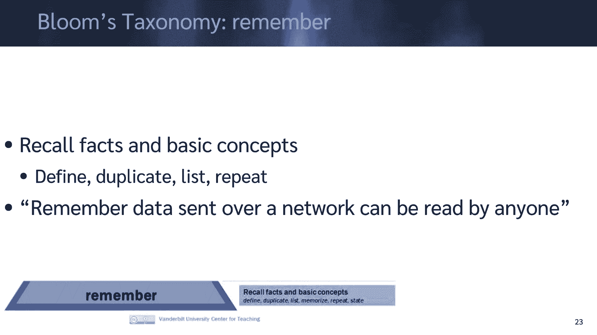
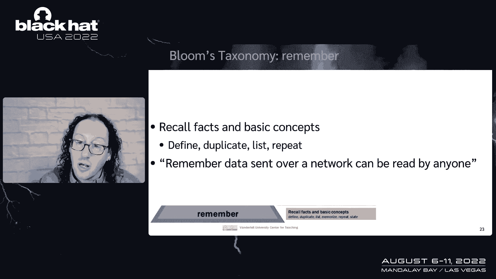
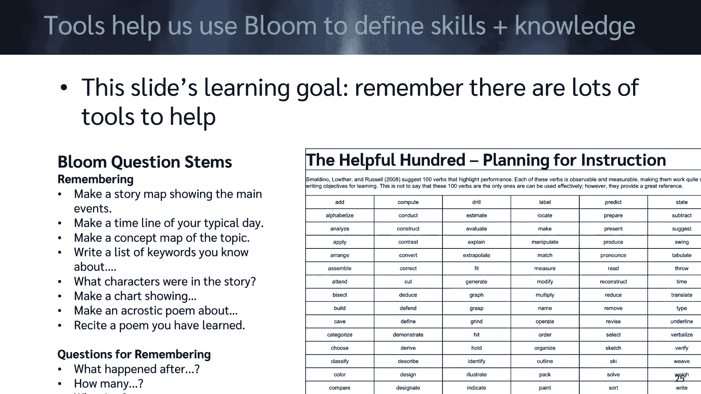
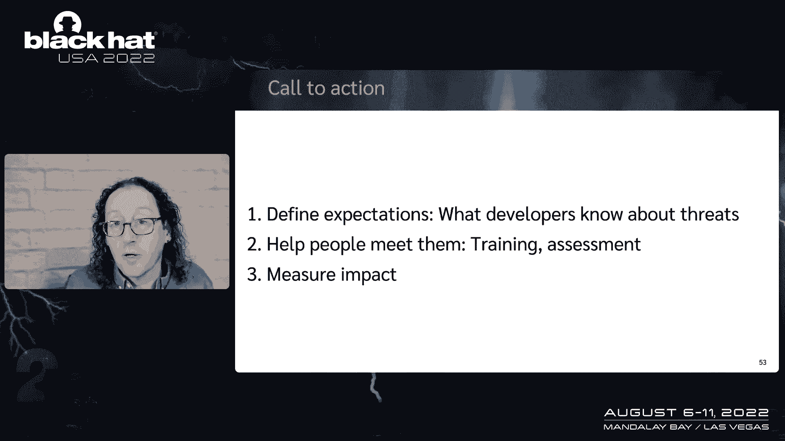

# 课程 P27：028 - 你并非训练有素的绝地武士 👨‍🚀

在本节课中，我们将探讨一个核心观点：并非团队中的每个人都需要成为网络安全领域的“绝地大师”。我们将分析当前安全培训的挑战，并提出一种更清晰、更易于开发者理解和执行的安全知识框架，以帮助构建更安全的系统。

## 从一张图片说起 🖼️

上一节我们提到了团队协作的重要性，本节中我们来看看一个具体的比喻。在这张图片中，我们看到了卢克·天行者，但他此时还不是一名绝地武士。这引出了我们的核心议题：一个成功的团队需要各种技能和背景的人，而非要求每个人都成为顶尖专家。

在网络安全领域，我们常常谈论需要“绝地武士”，但这可能是一个不切实际且会导致倦怠的目标。英雄主义的期望往往带来压力。本次课程旨在探讨，对于广大的软件开发者而言，什么是合理且必要的安全知识。

## 安全问题的根源 🐛

上一节我们讨论了团队构成的多样性，本节中我们来看看安全问题从何而来。所有程序都存在缺陷（Bug），大型程序的问题则更为复杂。这是软件开发的固有属性。

因此，安全问题如同软件的其他方面一样，主要来源于开发阶段。开发者在构建功能时，可能会无意中引入安全漏洞、设计缺陷，或是创建出难以使用的安全功能。

## 传统的安全模式：逆向工程与“右移” 🔄

在传统的软件开发和部署模型中，我们通常将活动分为“开发”和“生产”两个阶段。
*   **开发阶段**：我们编写代码，添加或修复缺陷。
*   **生产阶段**：系统运行，我们主要进行防护。

长期以来，安全工作的重心放在生产环境，这被称为“右移”。我们部署防火墙、安装杀毒软件、进行漏洞扫描。这些活动很大程度上基于一个假设：我们无法直接影响开发过程，只能对产出的“成品”进行逆向工程和加固。

## “安全左移”的理念与实践 ⬅️

然而，修复生产环境中问题的成本极其高昂。因此，“安全左移”的理念越来越受欢迎。这意味着将安全活动嵌入到开发、测试等更早期的阶段。

“安全左移”要求我们改变开发流程，这并非易事。它需要：
*   **明确的责任**：清晰定义谁在何时需要做什么。
*   **服务于开发者目标**：安全改进应帮助开发者更好地交付功能，而非成为障碍。
*   **降低改变难度**：让安全实践变得简单易行。

## 定义学习目标：布鲁姆分类法 🎯

为了有效地“左移”并培训开发者，我们需要清晰地定义他们需要“学会”什么。一个强大的工具是**布鲁姆分类法**。它将认知学习目标分为多个层次：

以下是布鲁姆分类法的几个关键层次：
1.  **记忆**：回忆事实和概念。例如：记住“通过网络发送的明文数据可能被窃听”。
2.  **理解**：解释观点或概念。例如：解释为何要使用HTTPS。
3.  **应用**：在新情境中使用信息。例如：在代码中正确实现一个加密函数。
4.  **分析**：建立各部分之间的联系。例如：对比两种身份验证方案的优劣。
5.  **评估**：基于标准做出判断。例如：论证某个架构设计是否安全。
6.  **创造**：将元素组合成新的模式。例如：设计一个新的安全协议。

对于大多数开发者，我们应聚焦于“记忆”、“理解”和“应用”这些基础层次，而非要求他们达到“创造”专家级水平。

## 为开发者减负：分块与模式识别 🧠

人类大脑擅长处理“信息块”和模式识别，而非零散的数据点。例如，记忆数列“1,1,2,3,5,8,13”很困难，但如果知道这是“斐波那契数列”，就能将其作为一个整体来记忆。

当前，我们常给开发者灌输海量、零散的安全知识，这容易导致“不知所措”。我们需要做的是，将必要的安全知识整合成易于理解和记忆的“块”。

## 每个开发者应该知道什么？ 🤔

那么，什么是开发者需要掌握的、合理的“知识块”呢？关键在于转变提问方式：从“如何利用漏洞”转向“什么可能出错？”。

“什么可能出错？”是一个强大的元问题，它能涵盖各种威胁。基于此，我们可以提炼出一些核心的、通用的安全知识块。以下是建议每个开发者都应了解的四个关键领域：

1.  **STRIDE威胁模型**：这是一个分类法，帮助思考威胁。
    *   **S**poofing（假冒）
    *   **T**ampering（篡改）
    *   **R**epudiation（抵赖）
    *   **I**nformation Disclosure（信息泄露）
    *   **D**enial of Service（拒绝服务）
    *   **E**levation of Privilege（权限提升）

2.  **危险信号**：了解哪些代码模式或设计决策通常是危险的。例如：未经验证的用户输入、硬编码的密钥、复杂的解析逻辑等。

3.  **杀伤链**：理解攻击是如何分步骤进行的（侦察、武器化、投递、利用、安装、命令与控制、行动）。这有助于在早期阶段阻断攻击。

4.  **特定平台的安全基础**：了解所开发平台（如Web、移动端、云）最基本的安全实践和配置。例如，在Web开发中理解同源策略和CORS。

## 总结与行动呼吁 🚀

本节课中我们一起学习了重新思考开发者安全培训的必要性。我们不是要培养所有开发者都成为安全专家（绝地武士），而是要为他们提供清晰、实用、可执行的安全知识框架。

“安全左移”的成功，取决于我们能否明确界定对开发者的合理期望。我们需要：
*   **定义知识**：作为安全社区，共同明确开发者必须知道的核心内容。
*   **设计有效培训**：基于布鲁姆分类法和分块原理，创建易于吸收的培训材料。
*   **衡量改进**：关注可预测的交付、紧急安全审查需求的减少等指标。

通过降低安全实践的认知负荷，并将其与开发者的核心目标（交付有价值的功能）对齐，我们才能更有效地构建安全的系统，并减少团队的压力与倦怠。这是我们未来共同面临的挑战与机遇。