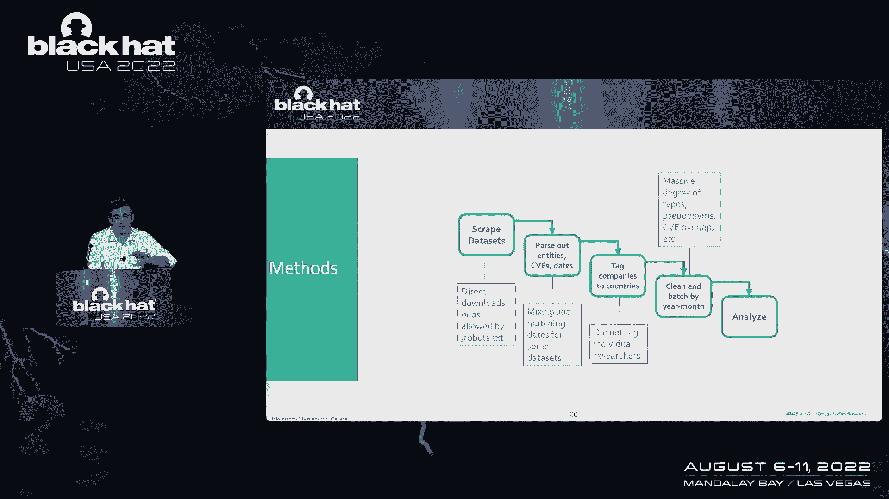
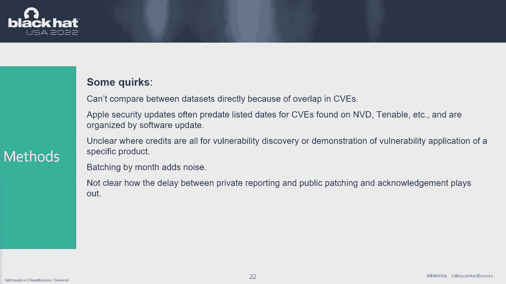

# P28：029 - (Long) Dragon Tails – Measuring Dependence on International Vulnerability - 坤坤武特 - BV1WK41167dt

嘿嘿，各位，哦哦，那就是爱，我是斯图尔特，斯科特，我们在网络安全和技术政策的交叉点工作，在过去的几年里，我们经历了很多很酷的交叉合作。

我们有幸参与了许多软件供应链的工作，安全主题，所以我们开始尝试在风险管理框架中思考，寻找风险源和安全源，最近引起我们注意的一个问题，一直是脆弱性研究的生态系统，向公司和图书馆提供披露。

所有这些来自项目之外的代码库，当然你们很多人都很熟悉，不断增长的市场份额，代表了越来越多的人接受，以及对这些专业框架的投资，这是多眼安全理论的一个相当直接的表现，对了，更多的人在看代码。

更好的机会发现它的问题，他们在这个过程中得到报酬，我们也看到了更多的政府举措发挥作用，为同类信息打开他们的入口，所有这些都由，通常所说的协调漏洞披露过程，它是不同组织所独有的，我们现在就去CBD。

但真正让我们感兴趣的是。

我们开始考虑的是，这些专业知识和研究储备在哪里本地化，它们是瓶颈，我们得出的一个大问题是，你知道的，糟糕的政策或缺乏好的政策，最终破坏了生态系统，从而中断并显著降低了安全性。

我们能在公开可用的数据中检测到这种情况吗，我们为此找到的完美案例研究，正在研究日志四J背后的披露过程，所以我相信你们中的许多人都熟悉卡内基梅隆，他们有一个相当全面的CBD指南。

这是他们所说的寻路的一个小出口，当你发现一个弱点时，立即告诉每个人，在任何时候都不告诉任何人任何事情，试图找到最佳路径是非常依赖于上下文的，但这是阿里巴巴云研究人员的一个很好的例子，找到了漏洞。

并很快直接私下向阿帕奇报告了这件事，他们开始修补，不久后，他跟进沟通，在12月8日或9日，他开始注意到弱点正在向它的方向发展，进入更多的公共论坛，这反过来刺激了他们的修补过程，这是一个很好的细分。

隐瞒信息的方式应该有效，你发现了你不想告诉所有人的弱点，只有那些能最好地修复它的人，直到它变得更加公开，然后抓住它的效用就降低了，你需要让人们至少，尽可能快地修补或减轻。

但真正引起我们注意的是在这一切开始发生后不久，有报道称阿里巴巴因，我相信，从与政府的信息共享，从公开的报道来看，还不太清楚，实际的机制是把他们从论坛上拉下来，要么在合同里要去那里，他们必须分享信息。

并且没有及时这样做或，于2021年7月通过，并于2021年9月生效，要求中国的网络提供商在发现漏洞时，除其他外，必须在几天内告诉麻省理工学院，所以我们已经看到声称这两个都是涉及的法律机制。

但抛开实际细节不谈，法律条文，安全漏洞管理条例，这是一个翻译，所以有一堆不同的措辞显然被违反了，对呀，阿里巴巴，网络产品提供商存在漏洞，两天内没有告诉麻省理工学院，这就是你知道的。

从CDD的一般角度来看，你应该如何处理这种信息，对吗，只告诉那些需要知道的人，直到信息更公开，然后告诉那些需要减轻的人，所以说，关于RMSV的大多数报告都非常集中在，早期传递给政府的漏洞会发生什么。

但我们的重点是把它作为一个非常方便的案例研究，看看这个供应方面的问题，对呀，在法律或其他方面会出现什么，这将扰乱漏洞流向那些可以修补漏洞的人，这很方便，因为，正如第二张幻灯片所示。

中国是这类研究和工作的巨大生产国，它也为我们提供了一个非常清晰的时间表，只有几个关键的日期我们要检查看看是否发生了什么，它提供了一个很好的对照组，对呀，该法律只适用于中国境内的实体，虽然周围有些模糊。

但它让我们看到了一个地方发生的事情，也不会发生在别人身上，这项研究的冷却机制的途径非常清楚，接受信息的公司都必须重新设计他们的内部流程，或者研究人员和研究实体必须协商，遵循正确的CVD有什么风险。

遵守法律的风险是什么，或者至少等到法律上有更多的澄清，而且要明确的是，这并不纯粹集中在中国，我们在世界各地都看到了同样的动态，例如，在德国，一名研究人员在选举中发现了一个漏洞，投票应用程序。

报告了这件事，并受到法律行动的威胁，密苏里州也是如此，一名研究人员在html中发现，他们可以从员工那里提取社会保障号码，他们没有那样做，但他们也因为基本上阅读网页而受到威胁，也有一些好的发展，诚信研究。

不管他们认为这是什么，在欧洲，正在推动成员国发展成为政府，他们自己的CVD过程，中情局本身也发布了一项具有约束力的指令，我认为在这一点上，遵守的最后期限已经到期，但是政府机构要建立自己的程序。

但这又让我们回到了问题上，我们想看看一些数据，试着回答，RSV是怎么做的，创造某种供应，抑制的冲击，参与脆弱性和脆弱性研究管道，如果是这样，它看起来像什么，我们能检测到它吗。

数据中是否有其他奇怪的事情发生，我们应该看看，还是系统中内置了一些弹性，你知道，一路上也是，我们可以看到一个很酷的洞察力，公司如何报告这些漏洞，以及记录制作和保存是如何做到的，来回答这个问题。

我们开始查看CBE中的确认数据，来自公司的日志和安全更新，我们专注于微软，苹果，f5，VMware和红帽，我们想让专有产品和开源产品有一个很好的呼吸，在面向消费者的产品之间真正跨越，非常在堆栈里。

在架子上，软件套件和介于两者之间的一切，这些公司在内部管理这些信息的方式有很多不同，所以获得这种多样性，对我们来说很有用，并设置事件的名义时间表来检查，我们从7月20日开始，这是最早的公开讨论。

确认登记册中的报告要求，1971年7月21日法律通过时，九月二十一日法律生效时，如果我们能得到足够近的数据，2001年12月，可能有执法事件的地方，我们也不知道发生了什么，但法律的文字似乎被打破了。

当然啦，这些事件并不存在于真空中，对呀，所以2020年和2021年的夏天也充满了来自你的制裁，s，政府反对可能对这种管道做了什么的中国公司，中国也有很多网络安全法规，同时，所以即使我们找到了一些东西。

它很好地排列在一起，很难说有什么因果机制，不和地面上的人说话，但这是我们的基本过程，我们要么直接在可用的地方下载东西，或者使用一些简单的刮擦脚本来提取这些数据集。

公开承认日期，经公开认证的实体，从那里，我们刚刚把实体标记到国家，作为他们经营法律环境的代表，也有很多关于个别研究人员的信息，但我们没有对这部分数据进行同样的分析，部分原因是获取位置数据要困难得多。

并部分，因为这条法律显然不适用于单个研究人员，而是不适用于大公司，但我们只是按月批量，并做了一些简单的测试看看在那些关键的日子里是否发生了什么，这些只是参与这一进程的国家，我无法告诉你数据集有多乱。

但很糟糕，很多这些东西都是手工输入的。

有很多错别字，很多不规则性，约会真的很有趣，所以有时安全更新会包括一个事后公开承认的cbe，但不知何故追溯性地添加了，但有时他们不会，所以有很多模糊，没有任何清晰，真正在实际过程中，您有私人报告日期。

公开确认日期，不管是什么回溯数据填充，也很难比较这五个不同的生态系统，我们已经设置好了，部分原因是他们如何组织数据，所以有些是由纯CB数字组织的，有些是按受影响的产品组织的，有些是由安全更新组织的。

这导致了许多重叠，即使在数据集中也是如此，所以说，比如说，苹果可能会更新两个独立的产品线来解决一个潜在的漏洞，这将导致重复计数和持续，当然啦，必须按月批量处理所有东西，以保持事情的顺利进行。

让它在后端有点模糊，但这些是我们得到的数据集，我们今天将通过微软和红帽，在这些地方我们有一些有趣的结果，苹果和VMware有一个空，发现，我们可以看到没有供应冲击。

F5的数据集中甚至没有任何带有中国标签的实体，尽管它比其他的小一个数量级，这是一个简单的图表，橙色是Chintag的贡献。

和蓝色是你，标记贡献作为基线，这在y轴上表示他们在当月捐款中的比例，所以随着时间的推移，你可以看到一个非常典型的故事，我们所有的数据集都是在美国的早期，它在生态系统中占主导地位。

然后随着其他IT部门的发展，随着接受实体对国际捐助变得更加开放，你看中国，但其他国家也做出了越来越多的贡献，很明显，在这里我们可以快速地看一下，一次悬崖跳水，似乎发生在我们7月的一个关键日期前后。

二千零二万，所以这些是一些基本的趋势线，我们看到中国越来越多地参与微软的生态系统，但那里有一个相当明显的急剧下降，所以我们不仅仅看比例，还包括原始计数，以获得更多的上下文，微软数据的有趣之处在于。

它真的是持续的，就像生态系统的生产力一样，尽管你可以认为是中国的贡献，回到某种均值，引发比例下降，所以这不是对我们的问题的否定，是否正在发生供应冲击，这让人有点放心，然后对于红帽数据。

您必须原谅早期的一些非常尖锐的图表，几乎只有你，He’他的参与，因为时间线比微软的数据要早得多，但我们又看到了，在中国和其他国家也有类似的增长，参与这种报告管道，然后我们又有一个下降，但在这里你看不到。

是在二千到十七年二月到四月之间，这是我们无法解释的日期，然后又是那种持续的下降，恢复上升趋势，但自始至终都很压抑，所以他只看了贡献计数，原始数字而不是比例，这个上下文也很有帮助，似乎下降持续得比。

比例数据会让你相信接下来的下降，对生态系统的总体贡献，这里值得注意的是，考虑到这是一组开源的数据点，对个别研究人员有更多的信任，我们没有标记到任何国家，所以捐款总额和按国家分列的捐款之间的差距更大。

最后是一点上下文，你认为我们会把苹果的数据也放进去，鉴于这是我们最大的数据集，也是最缺乏与RMSV相关的任何东西的一个，可能在早期再次发生，我们很多人都有同样的故事，He’他的参与。

我们怀疑你导致其他国家贡献更多的很大一部分原因，这条线，随着时间的推移，你可以看到，中国成为越来越大的参与者，以及其他国家，为了清晰起见，这里没有显示，以下是原始贡献计数。

你也可以看到苹果数据季节性的有趣之处，你知道，每隔一个月，然后每四个月，发出的CB数量激增，这可能反映了那里正在进行的某种安全修补计划，但这仍然是一个非常有趣的数据点，无受影响产品。

尤其是考虑到我们已经看到苹果产品在黑客竞赛中受到关注，就像天奴杯，但给出这个数据的另一个考虑是，因为我们捕捉到了几乎任何被视为漏洞的东西，潜在的模糊，那种高，更有可能针对攻击性使用而定制的影响漏洞。

所以我们的主要收获是，一方面，似乎没有我们期望找到的东西，这是一个明显的下降，在任何或所有这些生态系统中影响总贡献的，但我们确实在微软的数据中发现了一些非常清楚的东西，只是不太清楚，到底是什么引起的。

所以七月二十日，我提到过，一方面，这是我们最有力的理由，我们也不知道这些热门数据发生了什么，我真的很想知道，如果有人有什么见解，但这绝对是值得调查的事情，因为，我们的另一个关键要点是。

这个生态系统的可靠性不能想当然，你知道的，我想一般来说，它不被认为是一种供应，但我们发现这是一个非常有用的方法来框架，如何在其中建立复原力，你知道你几乎可以买到这种意义上的证券或类似的东西，最后。

我们为政府和公司如何，没有反映中国的法律类型，可以投资于那个生态系统，并保持其对任何本地化法律环境变化的弹性，所以这些线上的第一件事，在这种保护面前，协调而不是超级严格。

但至少在精神上是政府和私营部门实体之间的CBD进程，这样对于一个发现了一些东西的研究人员来说，就没有太多的模糊性了，不知道报道的规则是什么，在他们工作的生态系统中，我们还认为，尤其是在开源生态系统中。

投资于漏洞发现工具，可以减轻研究人员的大量工作量，仍然可以直接投资于证券，尤其是考虑到没有那么多官方建立的窃听器赏金系统，对于开源生态系统，虽然我认为有一些倡议刚刚开始，实际上就是这么做的。

我们想推荐的第三点是通过跟踪，披露和脆弱性研究的流向，你可以感觉到如果东西掉下来，在那里可能值得投资更多的研究。

所以说，比如说，如果一个生态系统开始干涸，在那里发现的漏洞没有那么多，在该产品或代码库中发现的每个漏洞都将更有价值，从安全角度来看，你知道的，确保围绕这一点建立的激励措施，在那里排队和漏斗研究人员。

在他们不得不担心他们会得到多少报酬之前，他们翻过来的东西，前面不一定清楚，你可以把它建在，不仅仅是对供应的弹性，而是研究社区如何与不同的公司互动，和不同的代码库，所以这是一个短篇小说。

尽管我们试图把脆弱性研究作为一种供应，一个必须投资的社区，给了一些法律的护栏和保护，想问，糟糕的政策有可能冲击这个系统吗，切断它与社区其他部分的很大一部分，我们并不真正知道的答案，但也许这绝对不是不。

肯定有几个令人担忧的下降，我们想进一步研究，你知道，鉴于这些滴水没有滴入更广泛的生态系统，似乎有一些与生俱来的韧性，我可以说更多的细节，有一些非常酷的数据点，关于同一时间框架内未归属捐款的增加，但最后。

也有积极的方法来投资于这一权利，我们不必等着别人模仿，RSV定律，然后开始担心生态系统的破裂，许多这样的倡议不仅仅是为了防止这些类型的法律，但他们建立了一个更强大的研究社区，我们真的希望能融入来自。

很多专家和技术领域，地面上有很多人，我也希望能和一些研究人员谈谈，所以请随时快速阅读并与我们联系，如果你有任何笔记或问题，我想我们还剩十分钟，在那里我们可以做一些问答，我们的朋友会很有帮助，但非常感谢。

