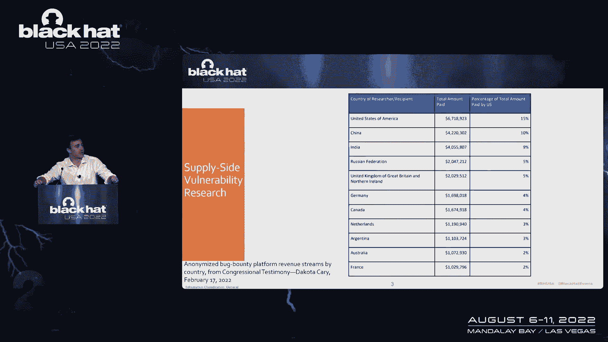
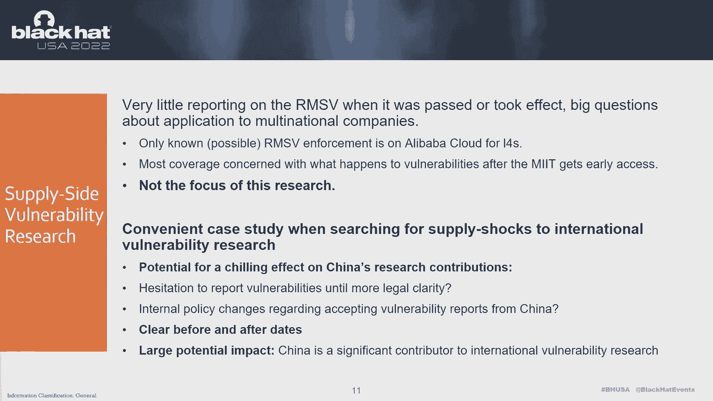
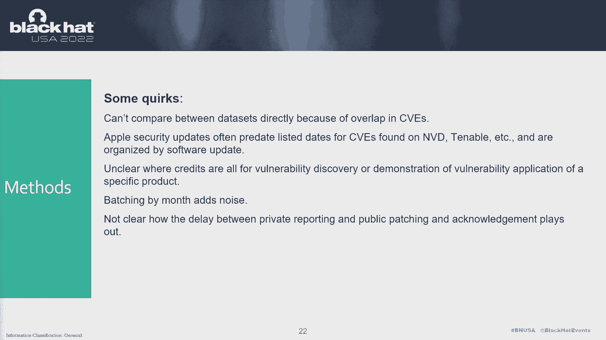
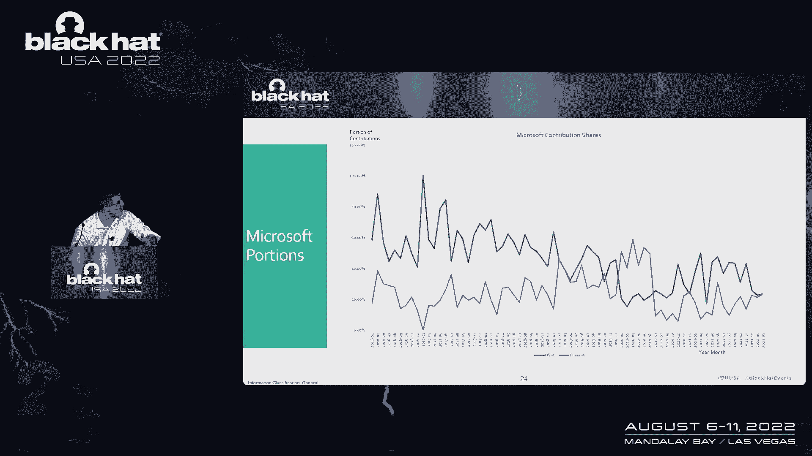
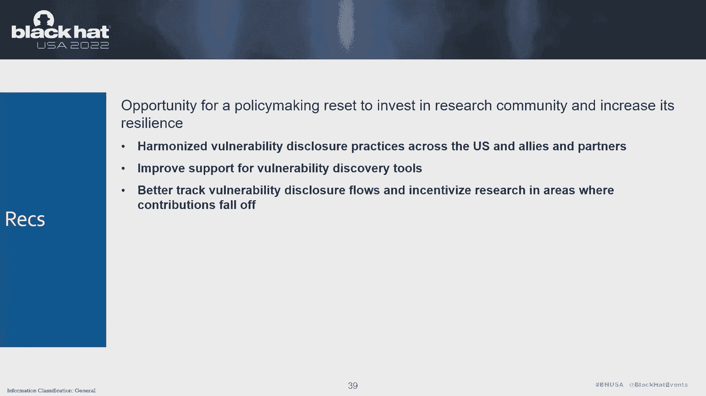
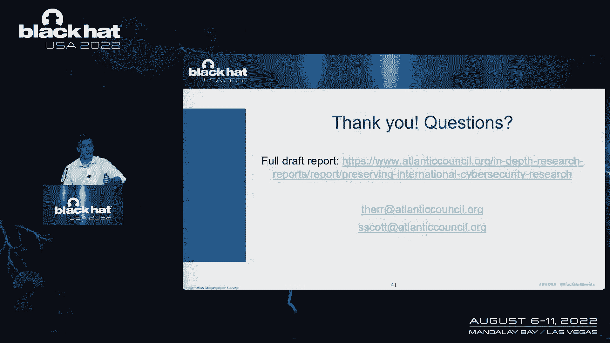

# 课程 P28：029 - 测量对国际漏洞研究的依赖 📊


## 概述


在本节课中，我们将学习如何通过数据分析，来测量和评估国际漏洞研究生态系统对特定国家或地区的依赖程度。我们将以中国的《网络产品安全漏洞管理规定》出台前后为案例，分析该政策是否对全球软件漏洞的披露与修复流程产生了“供应冲击”。

---



## 引言：漏洞研究生态系统的重要性

网络安全与技术政策领域存在许多交叉合作。近年来，软件供应链安全成为焦点。在风险管理框架中，识别风险源和安全源至关重要。

其中一个关键环节是漏洞研究的生态系统。这个生态系统负责向公司和开源库披露漏洞。大量代码来自项目外部，这体现了“多眼安全”理论：审查代码的人越多，发现问题的机会就越大。

如今，有更多人因此获得报酬，政府也更多地介入，建立了协调漏洞披露流程。然而，我们开始思考：这些专业知识和研究资源集中在何处？是否存在瓶颈？

一个核心问题是：不当的政策或政策缺失，是否会破坏整个生态系统，从而显著降低安全性？我们能否从公开数据中检测到这种影响？

---



## 案例研究：Log4j漏洞与阿里巴巴事件

为了探究上述问题，我们找到了一个完美的案例：研究Log4j漏洞背后的披露过程。

卡内基梅隆大学提供了全面的协调漏洞披露指南。这个过程被称为“寻路”，即在发现漏洞后，找到最佳报告路径，这高度依赖于具体情境。

阿里巴巴云安全研究员发现Log4j漏洞后，选择直接私下报告给Apache基金会，后者随即开始修复。随后，漏洞信息逐渐进入公共论坛，这反过来又加速了修复进程。

这是一个理想的漏洞披露流程：发现者只将信息告知最能修复它的人，待漏洞更公开化、利用价值降低后，再广泛通知以推动修补。

然而，事件发生后不久，有报道称阿里巴巴因未及时与政府共享漏洞信息而受到处罚。依据是2021年9月生效的《网络产品安全漏洞管理规定》。该规定要求中国的网络产品提供者在发现漏洞后，必须在规定时间内向工信部报告。

从协调漏洞披露的角度看，阿里巴巴遵循了“仅告知需要知道的人”的原则。但新规要求更早地向政府报告。这引发了我们的关注：当法律或政策扰乱漏洞流向修复者时，会发生什么？

---

## 研究设计与数据收集

我们将上述案例视为研究“供应方”问题的契机。中国是漏洞研究的巨大产出国，这为我们提供了清晰的时间线和天然的对照组（该法律仅适用于中国实体）。


我们通过查看各大科技公司的CVE确认数据和安全更新日志来展开研究。我们选择了微软、苹果、F5、VMware和红帽五家公司，以确保数据多样性，涵盖专有软件、开源软件、消费级产品和企业级套件。

我们设定了几个关键时间点进行观察：
*   **2021年7月20日**：关于新规的早期公开讨论。
*   **2021年7月21日**：法律正式通过。
*   **2021年9月21日**：法律生效。
*   **2021年12月**：可能的早期执法事件。



数据收集后，我们按“公开确认日期”和“报告实体所属国家”进行标记和整理。以下是数据处理的核心步骤：

```python
# 伪代码示例：数据整理流程
1. 从各公司安全公告页面爬取CVE数据。
2. 提取CVE编号、公开日期、报告者/实体名称。
3. 将报告实体映射到其所属国家/地区。
4. 按月份和国家/地区对CVE数量进行聚合统计。
5. 对比关键政策时间点前后的数据趋势。
```

需要说明的是，数据集非常杂乱，存在大量手工输入、拼写错误和日期格式不一致的问题，这给分析带来了挑战。

---



## 数据分析与发现

我们对数据进行了按月分批处理，并观察关键日期前后趋势的变化。以下是主要发现：

**微软数据**：显示中国实体对微软漏洞库的贡献比例在持续增长后，于2021年7月前后出现了一次明显的“悬崖式”下跌。虽然比例下降，但漏洞提交的绝对数量保持稳定，说明生态系统的总生产力未受严重影响，但中国的相对贡献度下降了。

**红帽数据**：作为开源生态代表，其数据也显示了中国参与度的增长趋势，但在2017年2-4月间有一个无法解释的下降，之后增长趋势受到抑制。开源数据中对个人研究者的依赖更强，而我们的分析主要基于实体，因此这里的差距更大。

**苹果与VMware数据**：在这两个数据集中，未发现与《漏洞管理规定》有明显关联的波动。苹果的数据显示出有趣的季节性规律。

**F5数据**：其数据集中未发现任何标记为中国的贡献实体，但该数据集本身规模较小。

---

## 核心结论与建议

我们的主要结论是：一方面，并未发现预期中那种导致**总贡献量**大幅下降的明显“供应冲击”。这在一定程度上令人安心，说明生态系统具备内在韧性。

另一方面，我们在微软的数据中观察到了清晰的、与中国新规时间点吻合的贡献度比例下降。这证实了政策变化可能对特定国家的研究者参与度产生冷却效应。

基于以上发现，我们为政府和公司提出以下建议，以增强漏洞研究生态系统的韧性：

以下是构建韧性生态系统的三个关键方向：



1.  **建立清晰的协调机制**：政府和私营部门应共同建立明确、协调的漏洞披露流程，减少研究者在报告规则上的模糊性和法律风险。
2.  **投资开源安全工具**：尤其是在开源领域，投资于自动化漏洞发现工具，可以减轻研究者负担，并直接提升安全性。应建立更多针对开源项目的官方漏洞赏金计划。
3.  **持续监测数据流**：通过跟踪漏洞披露和研究的流向，可以早期感知到特定生态系统的“干旱”迹象，从而有针对性地投入更多研究资源或调整激励政策。

---

## 总结

本节课中，我们一起学习了如何将漏洞研究视为一种“供应链”，并尝试通过数据分析来评估政策对其产生的潜在冲击。

尽管没有发现灾难性的中断，但数据中确实存在令人担忧的下降趋势，值得进一步探究。更重要的是，我们认识到不能想当然地认为该生态系统的可靠性。



积极投资于这个全球研究社区，建立更强大的协调机制和保护措施，是防范未来风险、提升整体网络安全的有效途径。这不仅仅是应对某一项法律，更是为了建设一个更具韧性的安全未来。