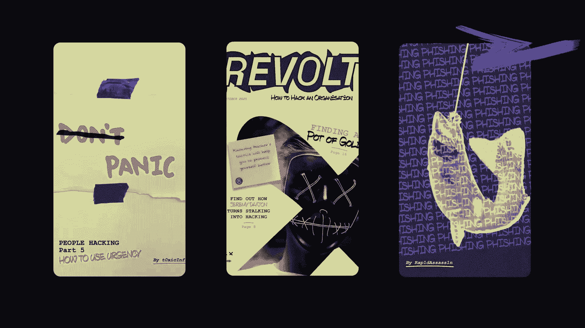

# 🛡️ 课程 P29-030：应对网络威胁的心理方法——从“旁观者效应”到“建设性挑战”

在本节课中，我们将学习如何运用心理学原理来管理网络安全中“未能挑战”的脆弱性。我们将从一个著名的心理学案例出发，探讨人们为何在紧急情况下不作为，并将这些洞察应用于网络安全行为改变的实际策略中。课程将涵盖游戏化、威胁化身、以及通过微练习培养挑战行为等核心概念。

---

## 📖 从凯蒂·吉诺维斯案到“旁观者效应”

1961年，纽约一名28岁的酒保下班回家。清晨天色很暗，她在路上看到一个人。当她回到家时，并未认出此人。她没有意识到自己被跟踪回家。当她将车停在光线充足的大楼前时，袭击者跟随了她。不幸的是，她被刺了两刀。她开始尖叫。

大楼里居民的反应令人深思。有些人听到了她的哭声，但将其视为无关紧要的事情而置之不理。一名男子探出窗外喊道：“放开那个女孩！”但仅此而已。有些人报了警，但在描述时，将其说成是家庭争吵或混战。还有人向他人询问，试图推卸责任。38名目击者都没有直接干预最明显的威胁，也没有人有效地传达情况以促使警方作出紧急反应。

任何上过心理学课程或对真实犯罪感兴趣的人，都可能听说过凯蒂·吉诺维斯的故事。虽然其中一些事实存在争议，但它已成为心理学上的一个寓言：人们有意识地身处一个本应促使其行动的情境中，却出于某种原因没有行动。这促使了数十年来对“旁观者”的心理学研究——研究那些在紧急情况下进行调解，或目睹甚至亲身经历社会不公时选择不作为的人。

---

## 🔍 网络安全中的“旁观者效应”

在网络安全领域，我们面临类似的现象，但背景截然不同。作为社会工程师，我通常不想被抓住。但如果我在执行任务时被人看到，人们会注意到我。我身高六英尺三英寸，有些突出，超出了他们的常规认知。当我们四处走动时，人们会抬头看，知道你在那里，感觉有些不对劲，然后继续回去工作。

我几乎可以用直接的眼神交流和最迷人的微笑来“制服”任何人。我们称之为“威胁感知”与“选择不作为”——未能挑战脆弱性。我们想知道为什么会发生这种情况，以及我们能做些什么。

---

## 👨‍💼 关于演讲者：行为科学与社会工程的结合

我的职业生涯有两个主要主题。首先，我是一名法医心理学家，我的学术研究专门分析恶意主动行为——坏人为何做他们所做的事，以及我们如何通过游戏化等不寻常而有趣的策略来缓解。其次，我是一名专业的社会工程师，领导团队在全球无数高度安全的地点进行社会技术调查、审计和评估。

目前，我是一名行为科学家，隶属于英国文化协会的网络意识行为与文化团队。我的目标是利用社会工程技能，帮助改变组织内部的行为。

我们的任务很简单：通过有针对性和可衡量的干预，显著降低网络安全风险，开发新的并加强现有的积极行为。我们的受众规模庞大，涵盖24万员工，并延伸至服务家庭、退伍军人、军校甚至国防工业基地，总计超过三百万人。

我们通过四个关键支柱开展工作：
1.  **数据**：通过社会行为问卷和深入分析，了解人类行为地形。
2.  **话语塑造与内容**：审视和塑造用于沟通安全思想的语言。
3.  **教练组**：确保人们知道如何执行安全任务。
4.  **行为干预小组**：负责发现、检测和观察特定群体中行为的具体变化。

---

## 🧠 超越“知识与教育”：关注行为动机

处理社会行为问题的普遍方法基于一个简单前提：如果员工了解网络安全，他们就会以安全的方式行事。这就是“认知”和“教育”这两个大词背后的潜在论点。

但如果知识是塑造行为的全部，那就没人会吸烟了。我们不能指望员工对安全抱有与我们同等的兴趣。对一项任务的兴趣程度，是应用于该任务的优先级的主要因素。在安全领域，我们常无意识地将自己的价值体系强加于人。例如，当发现有人将密码贴在屏幕上时，我们会想：“怎么会有人这么做？这太明显了，我们不应该那样做。” 但显然，那个人的决策过程与我们完全不同。

因此，我们需要从不同角度考虑社会行为景观。正如心理学研究所强调的，我们需要考虑支撑行动的**动机**。

我们需要简化问题。人们真正需要做的只有两件事：
1.  识别威胁。
2.  如果他们无法处理，则需将问题传达给更有能力的人。

我们需要人们**挑战**和**报告**。注意，这些是**行为**，而非知识点。知识是基础，但我们想要的是行为。

激励有两个系统。我们通常将安全建立在“人们应遵守规则”的期望上，但这将安全决策外部化为遵从状态。更好的方法是激发**内在动机**，让人们基于风险认知自主决策。

---

## 🎮 利用游戏化激发内在动机

根据瑞安和德西的**自决理论**，内在动机有三个要素：
1.  **自主权**：人们是否感觉有一定程度的自主权？
2.  **能力感**：我们是否在促进能力，让人们感觉在重要事情上变得更好？
3.  **关联性**：人们是否感到与周围人的联系，还是将责任推给IT团队？

游戏化是满足这些要素的强大工具。一个绝佳的例子是《Pokémon GO》。其核心任务是鼓励人们探索、锻炼和社交。发布一年后，用户累计步行了158亿公里。用户并非为了锻炼而下载游戏，他们只是在享受游戏。游戏的核心是**乐趣**，是一种自由且安全的行为。

好的游戏化应记住这一点。它不仅仅是提取游戏机制并生硬套用。要做好游戏化，我们需要考虑：
*   **难度刀刃**：一方面，我们不能剥夺玩家“搞砸”的自由；另一方面，难度曲线不能像一堵墙，阻挡了大多数玩家。
*   **游戏世界**：创造一个玩家可以沉浸其中的新现实层。它可以是《光环》那样的丰富体验，也可以是《龙与地下城》那样无需视觉细节的想象世界。关键是玩家意识到其行动和决定在游戏世界中运作。
*   **胜利的重要性**：胜利是建立积极情绪的最简单方法。我们需要让玩家感觉胜利并非保证，而是通过努力获得的。

---

## 🦹‍♂️ 引入“威胁化身”：安全地演练对抗

在我的研究中，一个核心主题是：我们可以通过理解“恶棍”的角色，并在心理安全的泡沫中体验其视角，来建立更安全的行为。

为了促进行为改变，我们需要两股力量的平衡：
1.  对“坏事”有意义的、具体的基础认知（但不能是来自公司内部的真实威胁）。
2.  一套管理该具体问题的相应工具。

过剩的、抽象的知识会导致回避（“我为什么要费心？”）或引发恐惧和瘫痪。典型的行为管理方法花了不成比例的时间要求人们执行行为，却没有为“威胁”创造一个真正的心理平台。

**威胁化身**的目的就在于此。我们使用一致的、相关的反派叙事。它既提供了一个真实威胁的模型，又处于我们的完全控制之下，以一种安全的方式呈现。完美的刻板印象是《火箭队》（来自《宝可梦》），他们有自己的主题曲，告诉你他们要干坏事。作为观众，我们知道每次他们出现都不怀好意，但也毫无疑问地知道他们绝对会失败。我们可以安全地探索他们的所有计划。

当我们让员工成为自己故事中的“英雄”时，就可以用两种方式表达对手：
1.  **经久不衰的故事**：可以反复借鉴的叙事。
2.  **鲜活的故事**：我们创造了“反抗部”（DeFence）这个黑客组织。在网络安全意识月期间，他们不断试图攻击防御。我们通过相互关联的故事、一个在全国巡演的物理逃生室（玩家需保护物联网设备逃离房间），甚至一本从反派视角编写的杂志《反抗》来塑造这个化身。这一切都以一种明显虚构、安全的方式呈现。

---

## 🎯 针对性行为干预：以“挑战行为”为例

我们如何知道这些新颖的想法会产生效果？在我们所做的每件事中，都遵循三个关键原则：
1.  **针对性**：针对我们深入了解的目标受众和特定行为。
2.  **证据基础**：确保所有干预都有证据支持，以证明其影响。
3.  **持续改进**：在部署前进行试验和测试，部署后进行审查和监控。

我们以“减少人们将个人电子设备带入信息保护区”的问题为例。核心问题在于：虽然每个人都知道这正在发生，但没有人愿意站出来说“你不能那样做”。

挑战和报告是非技术人员可以做的两个最重要的安全行为。然而，人们很少有机会在无真实社会压力的情况下练习挑战。想象一下，防火墙因为害怕被评判而不敢查询请求——这毫无用处。人类防火墙也是如此。

为了定义正确的挑战行为，我们开发了一个**挑战模型**，基于两个关键原则：后续社会影响和干预的实际质量。
*   **非建设性挑战**：可能过于激进，且未能消除风险。
*   **建设性挑战**：坚定但有礼貌，有效消除了风险。

我们需要影响人们的**感知-认知-行为**循环。人们吸收环境信息（感知），赋予其意义并形成认知，最终驱动行为。我们的干预就是提供正确的“刺激”，帮助人们建立感知，意识到风险，并采取行动。

---

## 🎭 实战演练：从“可疑请求”到“建设性挑战”

以下是一个角色扮演练习的示例，旨在帮助个体分离认知，并开发挑战脚本：
*   **场景**：一个忙碌的周四早晨，“我”正专注于工作。
*   **“坏人”接近**：一个陌生人以笔记本电脑坏了、手机没电、急需开会为由，请求借用“我”的笔记本电脑，甚至后来递上一个写着“黑客”字样的U盘。
*   **“我”的心理过程**：
    1.  **感知**：感觉请求很奇怪，开始收集所有可疑线索（陌生面孔、奇怪请求、可疑U盘、奇怪的T恤）。
    2.  **认知**：将情况与社会规范比较，意识到这不对劲，可能需要做点什么。
    3.  **行为**：从最初的犹豫（“也许你可以找IT部门”），到部分拒绝（不让碰电脑），最终到完整的建设性挑战（“对不起，这违反政策……没有网络威胁先生，我不会把它插进去的！”）。
*   **汇报与强化**：练习后，执行者会得到积极反馈和一张绿色卡片作为“免挑战”标识。这巩固了积极的挑战体验，并让周围人也意识到挑战的重要性。

这种简单的、重复的微练习，是改变行为的有效方式。我们已经直接对850人进行了此类练习，间接影响达两三千人。数据显示，77%的人认为练习有用，62%的人之后对挑战持积极态度，90.1%的人表示有信心在需要时提出挑战。

更重要的是，我们看到了行为的真实改变：安全顾问报告站点内挑战行为增加，甚至有人在公开场合喊出“没有网络威胁先生！”，将游戏世界的影响从一对一扩展到一对多。

---

## ⚠️ 确保练习安全与积极体验

我们必须承认这种直接接触的练习有风险。并非每个人都喜欢直接互动，可能会影响心理安全感或幸福感。因此，我们采取了多项控制措施：
*   **更新语言和物料**：避免触及敏感点，使用更醒目的T恤和3D打印的假U盘。
*   **结构保障**：每次练习有两名观察员通过秘密无线电持续监控，可随时干预。
*   **许可与沟通**：确保获得相关方许可并携带证明。
*   **强制汇报**：绝不让人独自困惑，总是解释原则、目标和肯定其表现。

---

## 📝 总结与关键要点

本节课我们一起学习了如何运用心理学方法应对网络安全中的“未能挑战”脆弱性。

**三个关键要点：**
1.  **游戏化可以简单、快速、低成本**：游戏世界可以在几秒钟内建立，成本可以很低。它利用了我们已有的社交设计技能，但用于积极目的。
2.  **培训可以“微剂量化”**：像30秒的角色扮演这样的“微练习”，比一年一次30分钟的培训可能更具影响力和记忆点。动机是核心。
3.  **在应用行为科学时，必须确保安全**：我们不能在改变行为的过程中伤害他人。必须建立正确的控制措施，防止弊大于利。

通过应用行为科学和心理学，我们可以帮助组织变得更有网络弹性，但前提是我们要以安全、可控的方式进行。

感谢你的学习。