# 课程 P3-003：Kubernetes 权限提升：容器逃逸等于集群管理员权限吗？ 🚀🔓

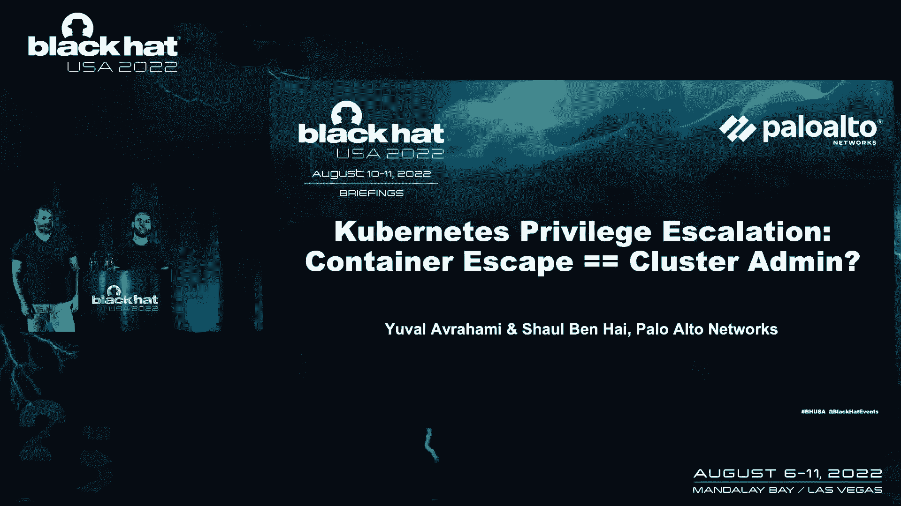

在本节课中，我们将探讨一个核心问题：单个容器的逃逸是否允许攻击者接管整个 Kubernetes 集群。通过回答这个问题，我们将分享在 Kubernetes 权限提升方面的一些见解。

关于我们自身背景：我们是 Palo Alto Networks 公司的 Unit 42 云安全研究人员。我们专注于云环境中的漏洞研究、威胁狩猎，并搜索云基础设施组件及云服务提供商中的漏洞。同时，我们也寻找专门针对云环境的攻击组织。

## 课程概述 📋

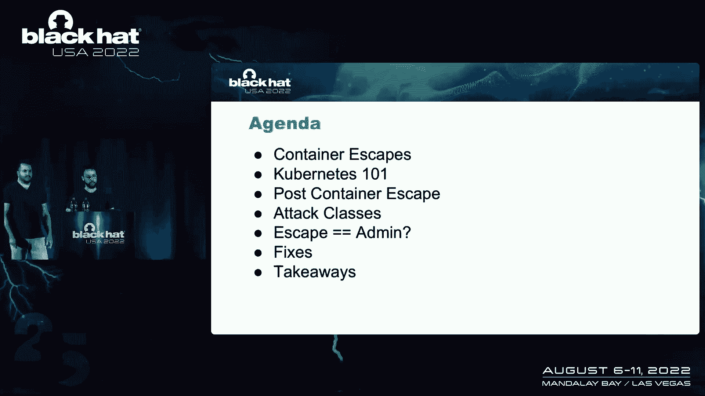

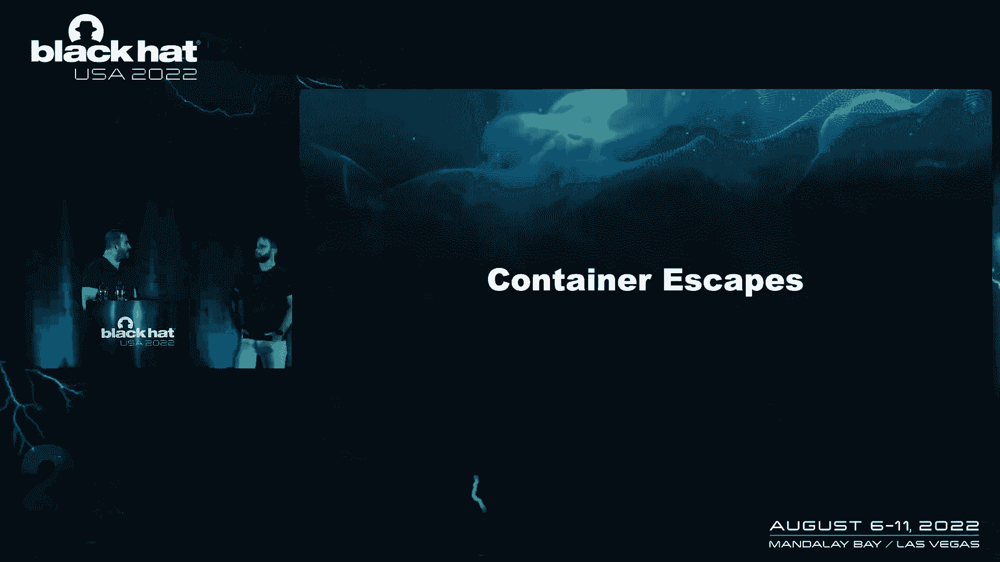

今天的议程如下：
1.  从容器逃逸这一常见威胁开始，并尝试理解其实际影响范围。
2.  进行 Kubernetes 基础知识回顾，确保大家理解一致。
3.  探讨容器逃逸后，攻击者必须在集群中传播并利用哪些资源。
4.  分析攻击者可用于权限提升的几类攻击方法。
5.  最终回答核心问题：容器逃逸是否等于整个集群沦陷？我们将给出一般性答案，并特别针对当今最流行的 Kubernetes 平台进行分析。
6.  讨论受影响平台发布的一些修复措施。
7.  总结从本次分享中可以获得的启示。

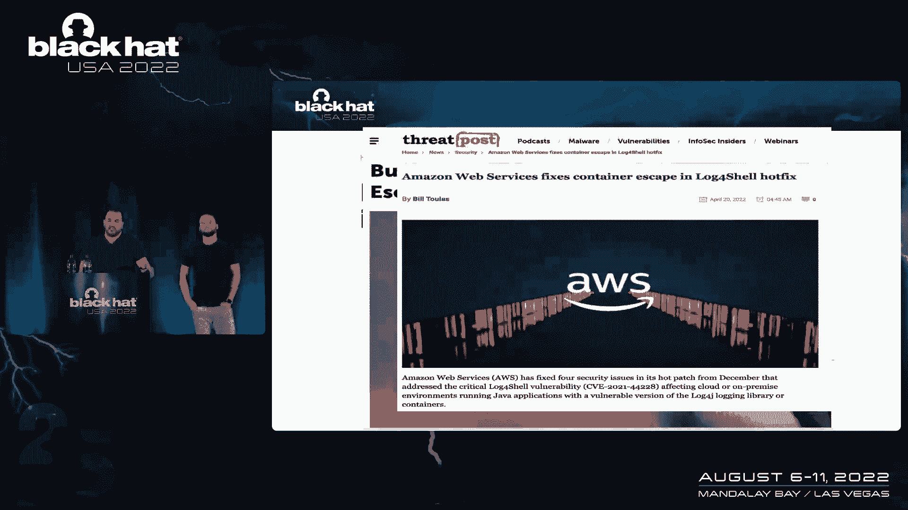

接下来，我们将首先讨论容器逃逸。

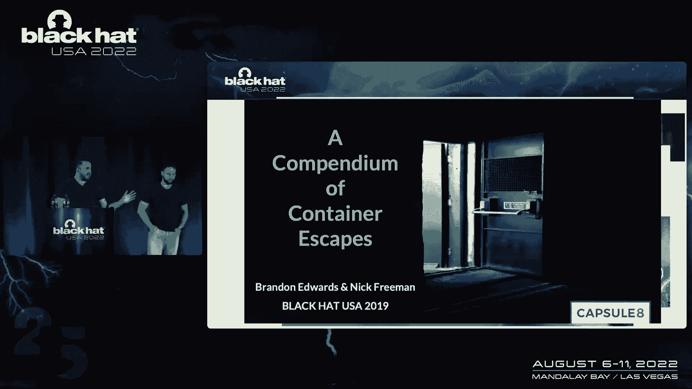

## 容器逃逸概述 🏃‍♂️💨

自从容器技术进入我们的生活，我们越来越多地听到关于容器逃逸的消息。这通常源于内核、Docker 和 Kubernetes 中的漏洞或配置错误。

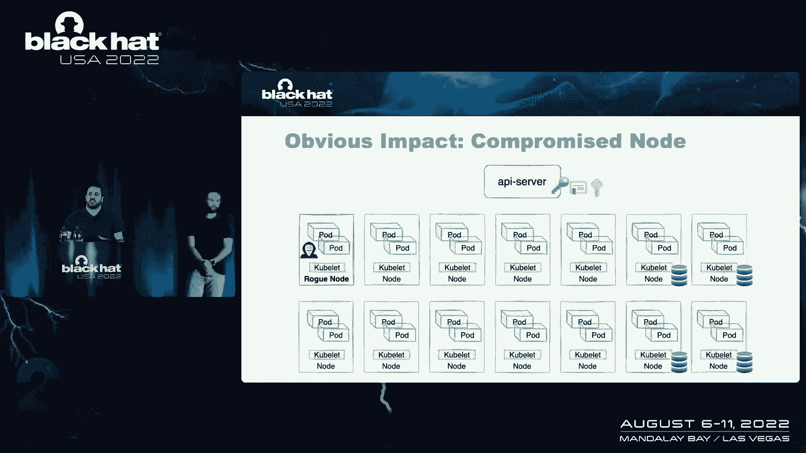

几年前，这里曾有过一次关于容器安全性的深入讨论。

一个显而易见的问题是：容器真的能“容纳”应用吗？毫无疑问，容器非常适合打包和部署软件，这也是我们广泛使用它们的原因。但它们是薄弱的安全边界，这主要是因为共享内核。那些允许非特权用户成为 root 的相同 Linux 内核漏洞，通常也可用于逃逸容器并接管底层主机。这是因为 Linux 内核的攻击面过于庞大，我们可能会继续看到越来越多的容器逃逸漏洞变体。

仅在 2022 年，我们就披露了至少十几个容器逃逸漏洞。

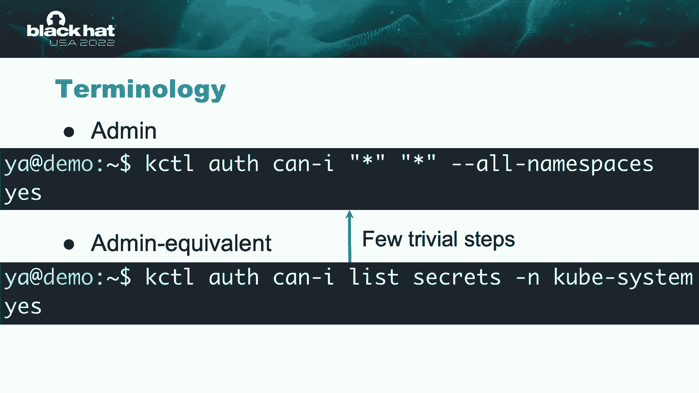

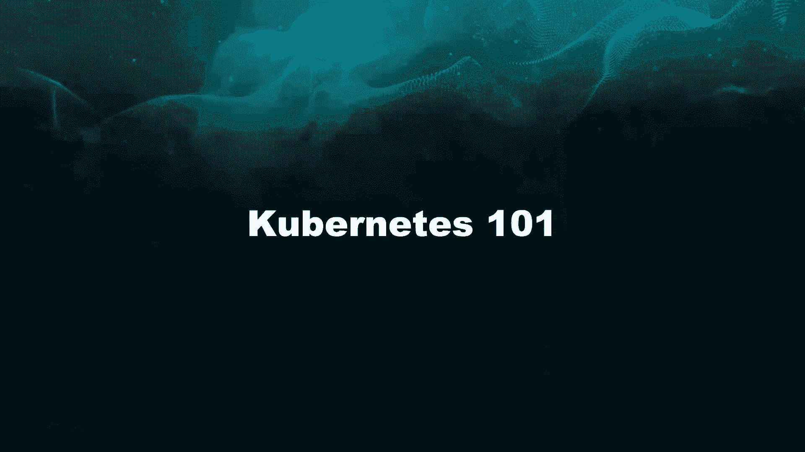

但是，容器逃逸也可能因配置错误而发生，最著名的例子就是访问主机资源的特权容器。我们还披露过一个利用容器逃逸在挖矿僵尸网络环境中传播的威胁行为者。

我们知道容器逃逸可能会持续发生，并将长期存在。因此，我们必须了解其影响。在 Kubernetes 中，最明显的影响至少是一个节点被攻陷。攻击者之前可能只危害了一个容器或一个 Pod，现在则可以控制整个节点，可能是为了获取更多业务逻辑或计算资源来进行挖矿等活动。

但是，想象一下，如果我们的攻击者野心勃勃，他可能不会满足于仅仅控制单个受损节点。也许他想接管整个集群。这就是我们今天要回答的问题：在单个容器逃逸的场景下，权限是否能提升到完整的集群管理员级别？你可能会问自己，攻击者的动机是什么？可能是想接管其他服务或数据库，甚至获取一些凭证密钥，试图在我们的集群之外传播，进入其他有趣的环境。

我们今天将使用两个快速术语：“管理员”和“管理员等价权限”。当我们说“管理员”时，意味着你可以执行任何类型或所有命名空间的操作。而“管理员等价权限”意味着你拥有足够的权限，只需一两个简单的步骤，就可以成为管理员。

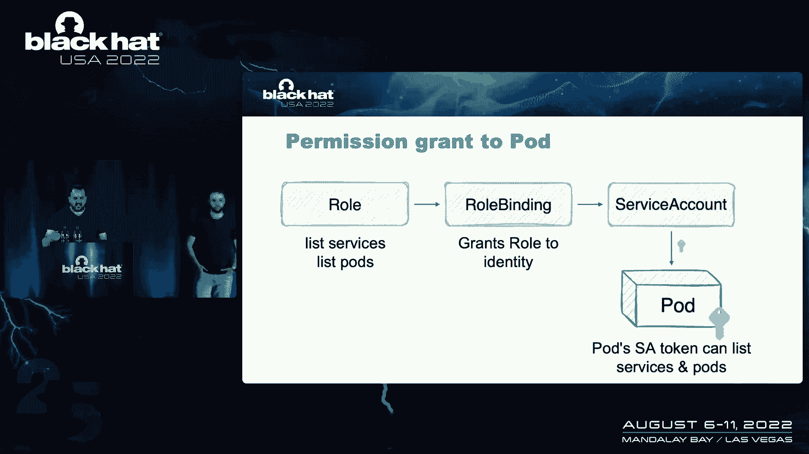

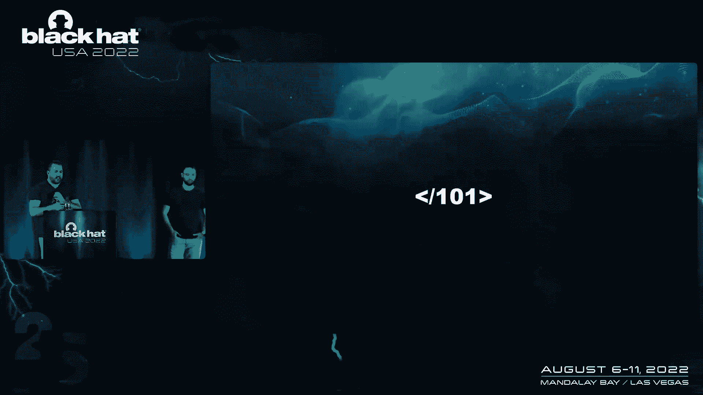

## Kubernetes 基础回顾 📚

在继续之前，我们先快速回顾一下 Kubernetes 基础知识，以确保我们在同一认知层面上。

简单来说，Kubernetes 在虚拟机或物理机上编排 Pod（容器组）。如今，它被广泛用于 Linux 工作负载，主要是在云端和本地环境中。对于攻击者来说，这是一个非常有趣的环境。

我们有 API 服务器，它是集群的网关或“大脑”。用户可以使用 `kubectl`（Kubernetes CLI 工具）与 API 服务器通信。然后，API 服务器将调度 Pod 并执行操作。关于身份验证，你可以使用证书（用户和节点通常这样验证），也可以使用服务账户令牌（Pod 通常这样验证）。

在 Kubernetes 中，权限表示为对资源（如 Secret）的动词操作，例如：创建 Pod、更新节点、删除服务等。这些权限组合成角色。当你想授予某个身份权限时，可以使用角色绑定来实现。

如果听起来有点复杂，让我们看一个简单的例子。假设我们有一个角色，允许在此命名空间中列出服务。我们想将这个权限授予我们的身份（一个 Pod）。因此，我们将此角色绑定到一个服务账户。当 Pod 运行时，它会使用这个令牌。在我们的例子中，该 Pod 就可以列出服务和列出 Pod。

以上就是对 Kubernetes 的快速回顾。

## 容器逃逸后的攻击面分析 🕵️‍♂️

现在，让我们尝试理解一旦攻击者能够逃离容器后会发生什么。在此之前，我们需要了解节点中存在哪些类型的凭据。

首先是 `kubelet` 的权限。`kubelet` 是节点代理，能够管理和促进所有 Pod 的运行。节点显然拥有一组允许它这样做的权限。幸运的是，Kubernetes 限制了 `kubelet` 的权限。如果我们讨论的是有意义的攻击（例如完整的集群管理），那么 `kubelet` 本身并不足以实现。攻击者确实可以执行一些有限的攻击，比如拒绝服务或读取某些原始数据，但如果我们谈论的是像完整集群管理这样的有意义的攻击，`kubelet` 权限是不够的。

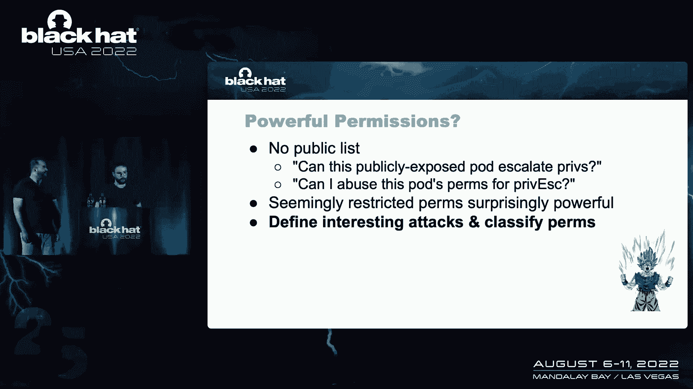

但是，节点上还有另一组凭据：相邻 Pod 的服务账户及其令牌。这取决于在节点上运行的应用程序，也取决于运行集群的平台。因此，攻击者可能没有强大的权限，但至少他有机会，因为每个节点上的 `kubelet` 权限都是相同的受限权限。

今天我们要讨论的场景是：我们有一个非常强大的 Pod，我们称之为“蹦床” Pod。它可以拥有足够的权限，让你在集群中四处“弹跳”，跳到其他节点以获取高特权，基本上让攻击者在你的集群中为所欲为。这些“蹦床” Pod 可能在哪里呢？

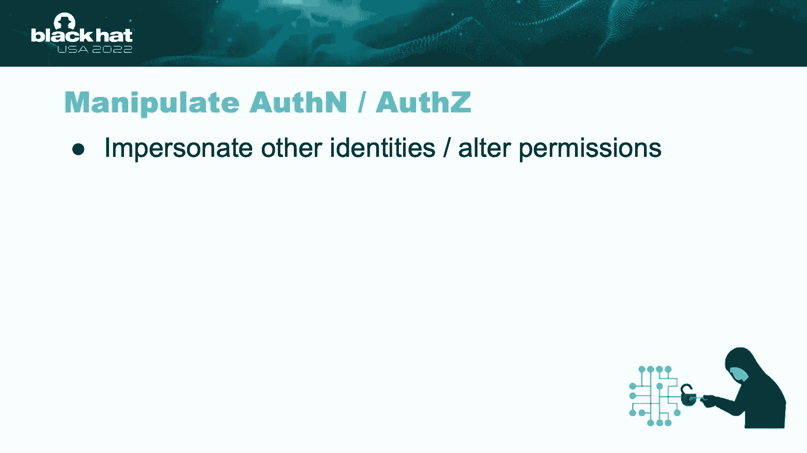

让我们看看在典型的普通节点中运行着哪些 Pod。通常在 Kubernetes 中，我们有像用于日志记录的 Fluentd、用于服务网格的 Istio、用于监控的 Prometheus、用于策略执行的 Gatekeeper 或 Kyverno 等附加服务。最后，还有系统 Pod，比如 `kube-proxy`、DNS 代理和容器操作系统（COS）组件。这些基础设施 Pod 在集群建立时就已经存在了。这基本上取决于你运行集群的平台。

系统 Pod，在某些情况下还包括通过包管理器（如 Helm）安装的附加组件 Pod，是一个相当大的盲点。因为我们没有管理它们的配置。附加组件的作者可能认为他们允许的权限是理所当然的，而对于系统 Pod，它们在集群创建时就已经存在了，我们同样没有控制或管理它们的权限。

关于系统 Pod 另一个有趣的事情是，在某些场景中，包括部署和安装的附加 Pod，它们是以 DaemonSet 形式运行的。这意味着它们运行在集群中的每个节点上。所以，如果“蹦床” Pod 没有安装为 DaemonSet，而只在集群中的一个节点上运行，那么攻击者从某个节点逃逸时，可能不会正好在承载“蹦床” Pod 的节点上。这个概率可能是 50%，也许更低，这取决于集群上运行的 Pod 数量。

如果“蹦床” Pod 作为 DaemonSet 部署和安装，那么攻击者就保证能“中头奖”，因为我们集群中的每个节点都将运行这些“蹦床” Pod。因此，我们今天主要问题的答案——单个容器逃逸是否能升级为完整集群沦陷——就在于那些“蹦床” DaemonSet 是否存在于集群的每个节点上。

所以，我会把话题转回给你。

## 寻找“蹦床” DaemonSet 🎯

在容器逃逸后，我们提升权限的“金票”依赖于“蹦床” DaemonSet。因此，我们开始尝试寻找“蹦床”可能在哪里。

我们调查了最流行的 Kubernetes 平台，并检查了它们的基础设施 Pod。这是一个实际的例子：我们看到了可以列出 Secret、删除 Pod、创建 ConfigMap 并更新节点状态的 Pod。我们查看了这些权限，并试图问自己：这个 Pod 强大吗？我们是在看一个“蹦床”吗？我们很快意识到，我们不知道。我们没有参考标准。

我们查阅了 Kubernetes 文档，尝试在谷歌上搜索，但很快意识到，Kubernetes 中实际上并没有一个公开的关于强大权限的列表。这实际上相当可怕，因为不知道哪些权限是强大的，你就无法真正回答关于权限提升的基本问题。好吧，如果我是防御者，我真的不知道我暴露的 Pod 是否真的能提升特权，如果我不知道它的权限是否强大。作为一个攻击者，一旦我得到一组被泄露的凭据，我也无法分辨它们是否有价值，如果我不知道哪些权限是强大的。

所以，我们开始着手尝试找出 Kubernetes 中哪些权限实际上是强大的。我们很快意识到，许多我们认为相当良性的权限，如果以创造性的方式使用，其实非常有趣。因此，我们采取了另一种方法：首先定义在 Kubernetes 中什么是有趣的攻击类别，在我们看来，这些类别可以让你获得有意义的权限提升。然后，我们对 Kubernetes 中的所有权限进行分类，并根据它们可以启用的攻击类别进行映射。

以下是我们想出的分类图：

我们提出了大约 20 多个权限，映射到四个攻击类别。我们不会深入探讨每个权限如何实现攻击，我们有一份随演讲发布的实际报告，你可以在其中看到每个权限是如何启用攻击的。

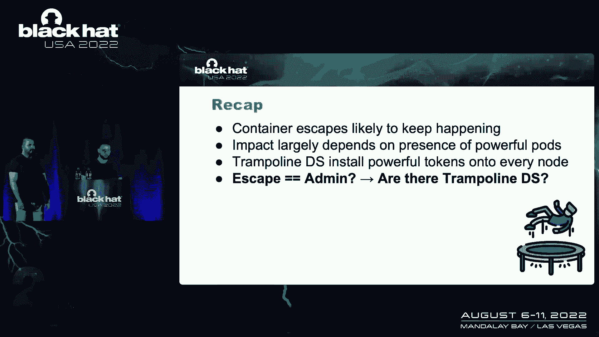

这些是我们识别的权限。为了让它们更具体，我们来看每个攻击类别的示例。

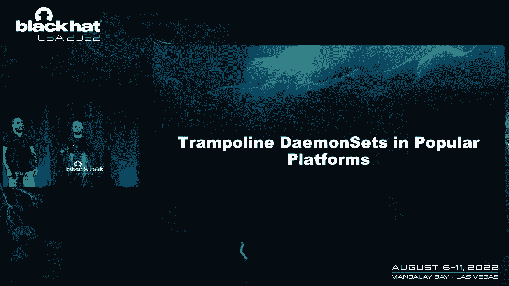

## 攻击类别与权限示例 ⚔️

### 1. 操纵认证或授权的权限

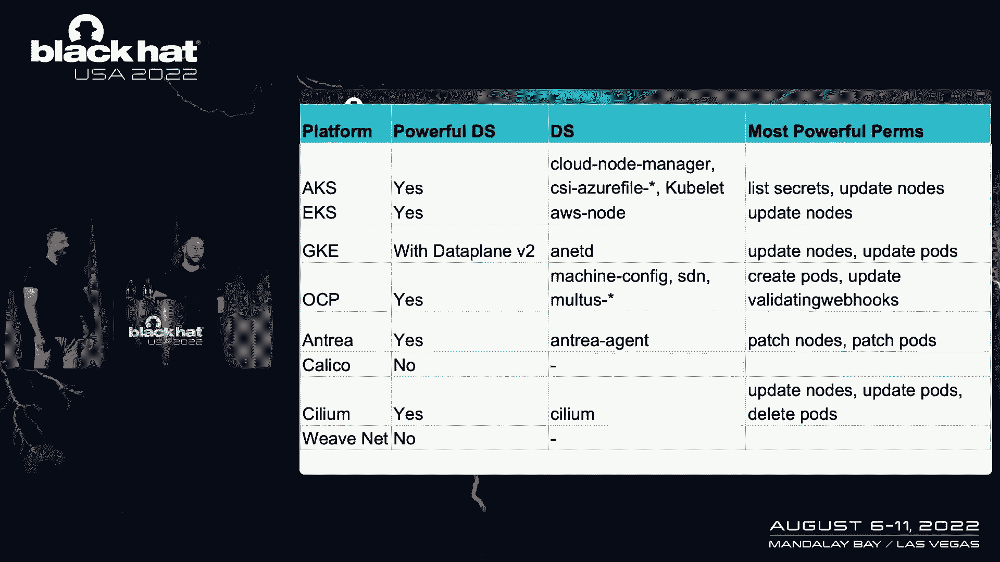

这些是非常强大的权限，实际上允许你模拟其他用户或更改你自己的权限，从而自由地操作集群的授权。

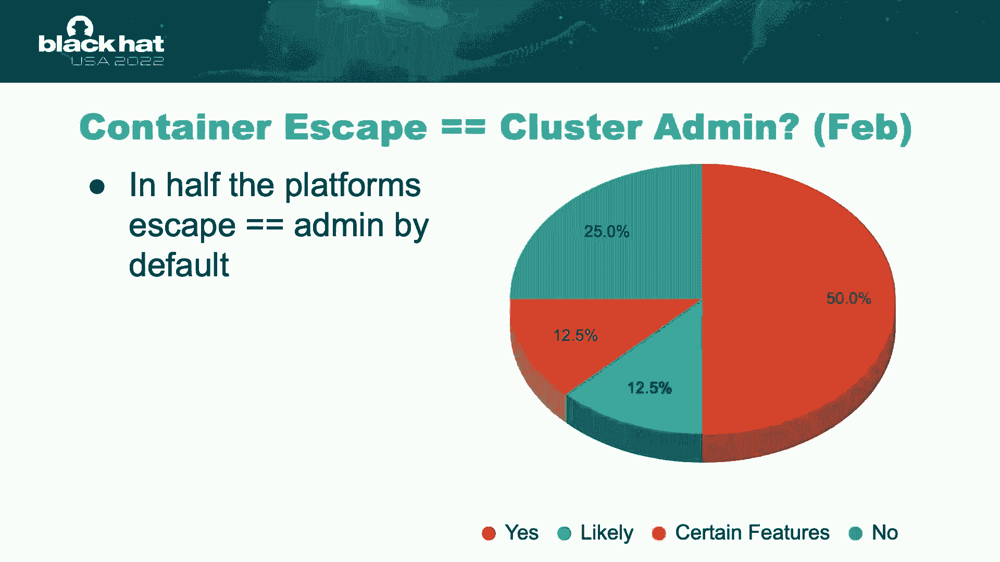

一个例子是 **`escalate` 角色**的权限。这是一个允许你向现有角色添加新权限的权限。所以，如果我是一个攻击者，我有一个可以升级角色的令牌，我可以简单地编辑我的服务账户的角色，并用通配符 `*` 添加集群中的所有权限。在我这样做之后，我的令牌就获得了所有权限。令牌变大的图示很好地说明了这一点。

### 2. 允许获取服务账户令牌的权限

这些权限允许你检索现有的服务账户令牌，或颁发新的服务账户令牌。这里的影响取决于你针对的是哪个服务账户。如果你可以为强大的服务账户颁发令牌，那么你就获得了有意义的权限提升。如果你只能检索弱服务账户的令牌，那就没那么有趣了。

Kubernetes 中一个非常臭名昭著的权限是 **`list` Secrets**。到目前为止，Kubernetes 中的服务账户令牌是作为 Secret 存储在 API 服务器中的。所以，如果你真的能列出 Secret，你就可以简单地检索服务账户令牌，然后使用它们对 API 服务器进行身份验证。正如我所说，如果你为自己获得了一个强大服务账户的令牌，你就刚刚提升了权限。

### 3. 允许在部分或所有节点上执行代码的权限

你可能对其他系统中的此类权限很熟悉。在这种情况下，你不一定要提升你的权限，这真的取决于你要接管的 Pod 的权限。但你可能会获得更多的计算资源，也许更多的业务逻辑，并且，正如我所说，可能会提升你的权限。

让我们看一个此类权限的有趣示例。它有一个很混乱的名字：**`create` nodes/proxy** 子资源。这个名字没有告诉我们太多信息，但它基本上意味着我们可以控制 `kubelet`。我们可以简单地告诉它们该做什么，比如“嘿，请在你的 Pod 上执行代码”。关于这个权限的一个有趣的事情是，你实际上不通过 API 服务器（它通常具有集群中的所有日志记录和审计机制），所以你现在可以绕过一些检测。

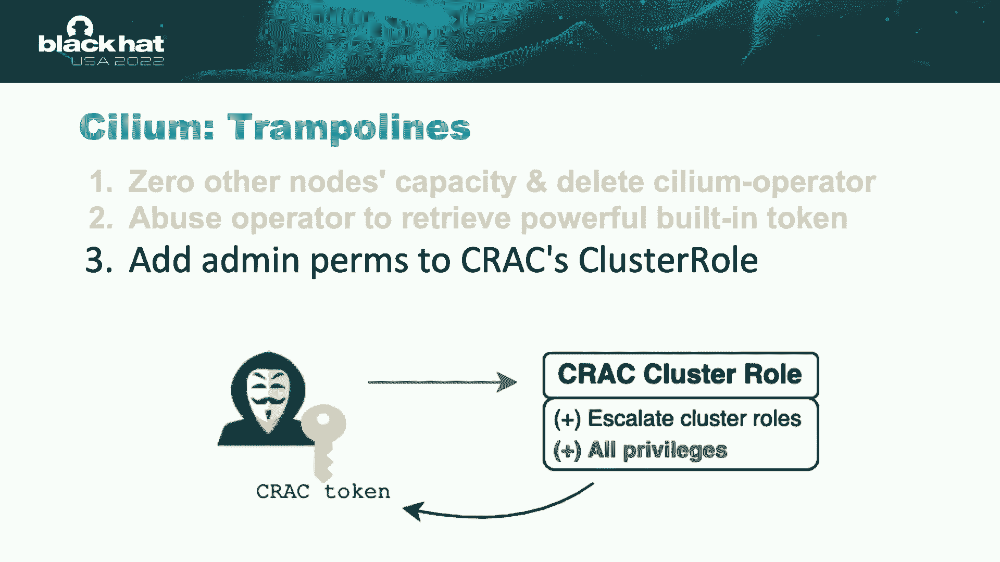

### 4. 允许窃取 Pod 的权限

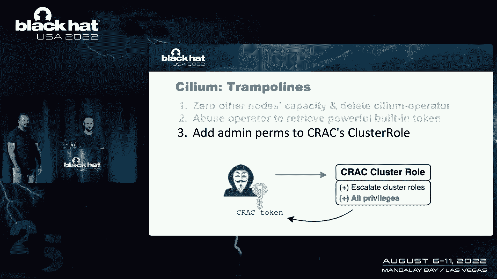

这是我个人最喜欢的类别。这些权限基本上是将现有的 Pod 从集群中的一个节点移动到另一个节点。为什么这很有趣？如果我们假设我们已经攻陷了集群中的一个节点，我们可能想把其他 Pod 带到我们的节点上。也许是因为它们承载着我们想要控制的有趣业务逻辑，或者，在这次讨论的背景下，可能是因为那些 Pod 拥有强大的服务账户。如果我们把它们带到我们的节点，它们将携带强大的服务账户令牌，然后我们可以用它来提升权限。

让我们从这里开始看一个例子。这是一个稍微复杂一点的例子，实施攻击需要两个权限：第一个是 **`update` nodes/status** 权限，第二个是 **`delete` pods** 权限。这实际上是一个很好的例子，说明了当你第一次查看这些权限时，可能看起来不太强大的权限实际上可能被滥用。删除 Pod 可能看起来像是拒绝服务，但它们实际上可以用来窃取 Pod。

让我们看看在这种情况下我们是如何假设的：我们已经逃离了容器，节点被攻陷。我们在集群中的另一个节点上有一个非常强大的 Pod（操作员 Pod），我们想把它带过来。我们要做的是：首先使用 `update nodes/status` 权限将集群中所有其他节点的 Pod 容量设置为零。我们基本上让它们无法调度。下一步是删除操作员 Pod。现在，Kubernetes 必须重建操作员 Pod，它将在我们的节点上创建它，因为它是集群中唯一可调度的节点。我们成功地把操作员 Pod 带了过来，它拥有强大的服务账户令牌。这就是你如何窃取 Pod。

如果你还记得我们开始谈论 Kubernetes 攻击类别是为了定义什么是“蹦床” Pod，什么是强大的 Pod。所以，“蹦床”是那些可以操纵认证或授权、获取强大的服务账户令牌、在 Pod 或节点上执行代码以及窃取集群中其他 Pod 的强大 Pod。因为这些权限集实际上让你获得了真正的集群管理权。

## 研究回顾与核心问题 🔄

沙尔和我谈了几个话题，让我们快速回顾一下。我们从容器逃逸开始，理解它们可能会持续发生。然后我们讨论了它们的影响在很大程度上是如何通过被攻陷节点上强大的“蹦床” Pod 的存在来决定的。我们定义了什么是强大的 Pod，也谈到了“蹦床” DaemonSet 是如何在每个节点上安装“蹦床” Pod 的。

所以，如果你真的想回答“单个容器逃逸是否实际上等于集群管理”，我们真正要问的是：集群中是否安装了“蹦床” DaemonSet？安装它们的人是否普遍等等。

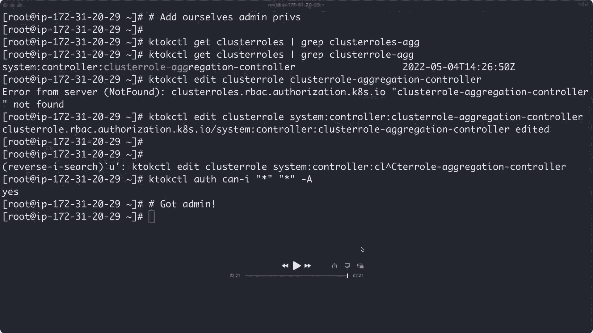

这就是我们在这项研究中试图做的。我们调查了最流行的 Kubernetes 平台，你们中的一些人可能是这些平台的用户。我们寻找“蹦床” DaemonSet。

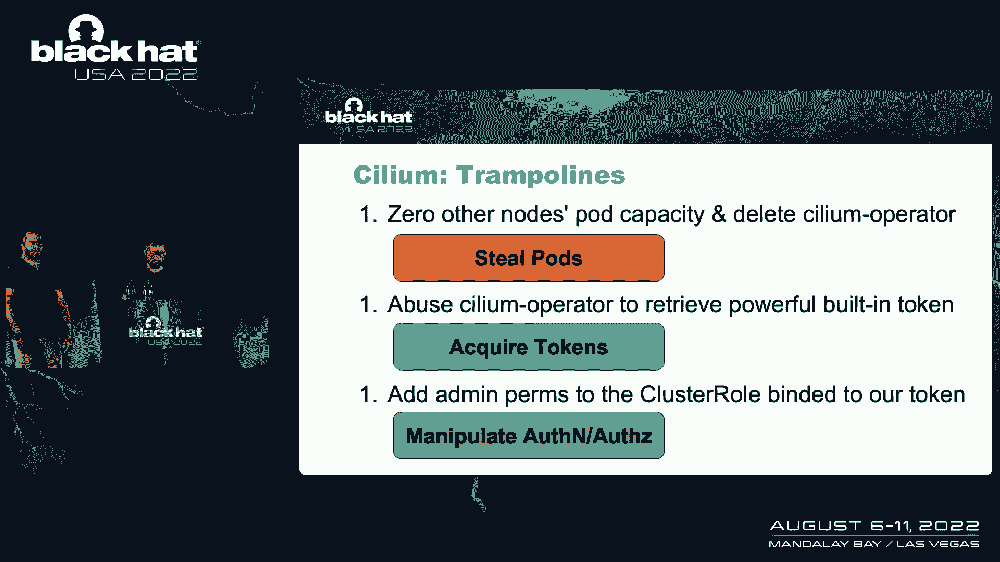

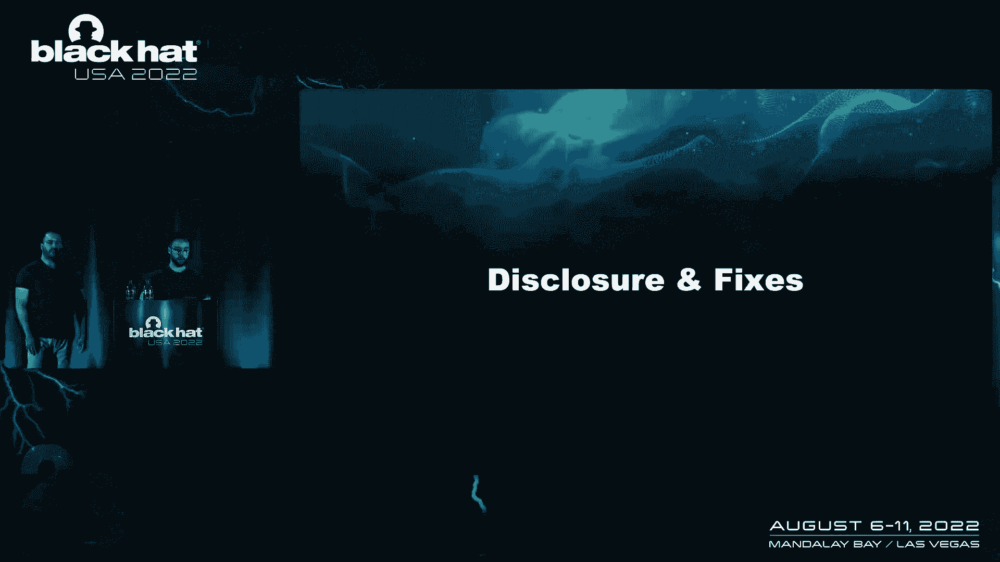

我们研究的平台大多是基础设施即服务（IaaS）或托管 Kubernetes 服务，如 GKE、AKS、OpenShift。我们还研究了容器网络接口（CNI），基本上是集群的网络基础设施，我们研究了像 Calico、Antrea、Cilium、Weave Net 这样受欢迎的项目。

当我们查看这些项目时，我们发现了什么？早在今年 2 月，他们中的大多数人实际上默认安装了“蹦床” DaemonSet。另外一些人则在启用某个流行功能时安装它们。这实际上是 2 月份这些平台中“蹦床” DaemonSet 的分布情况。

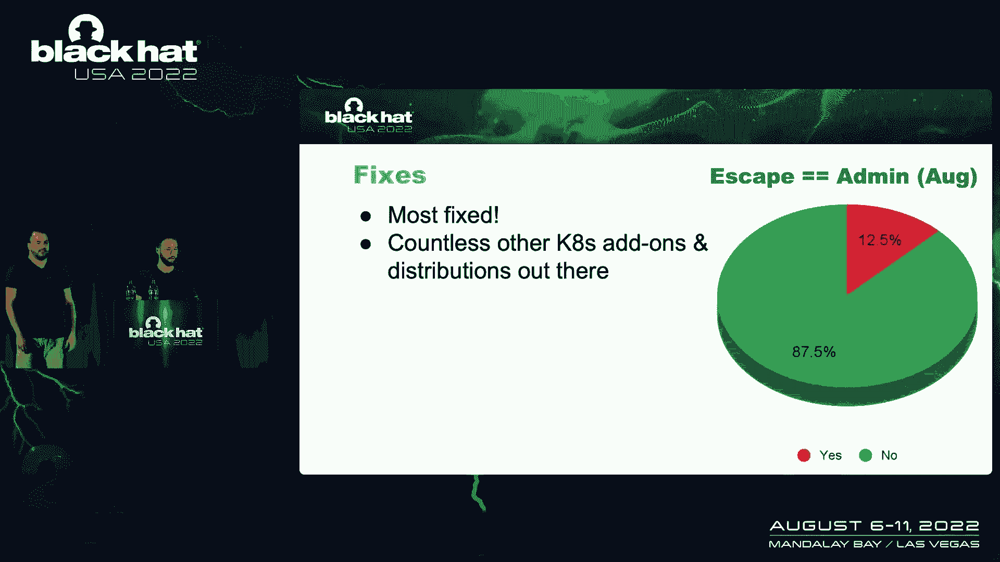

所以你可以看到哪个平台有强大的 DaemonSet，以及这些 DaemonSet 拥有哪些强大的权限。我们有一份关于所有细节的报告，所以你现在不需要拍照，除非你真的想。

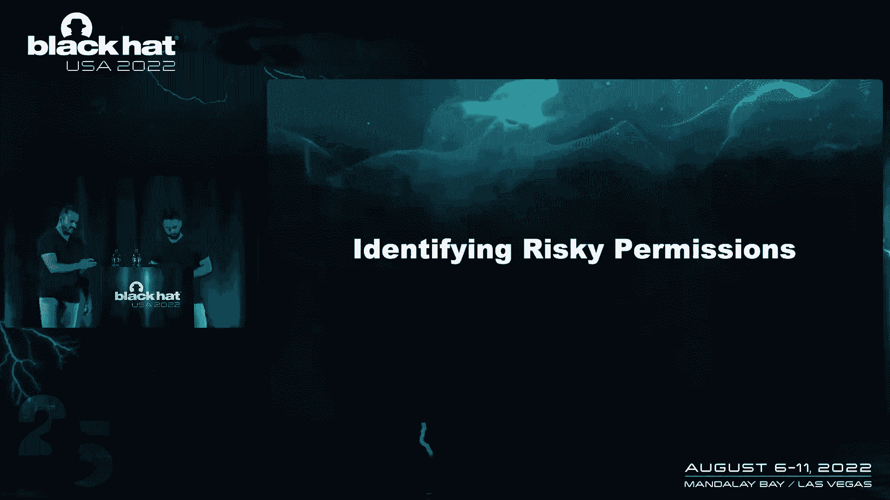

我们查看了那些 DaemonSet，试图了解它们有多强大。它们真的允许你在默认情况下获得完整的集群管理权吗？在一半的平台上，实际上是这样。

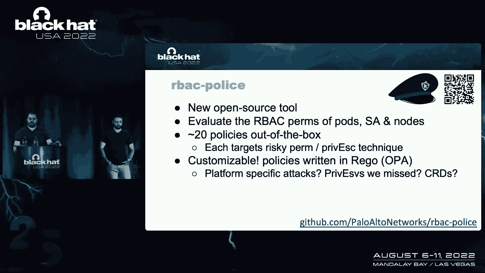

在我们调查的一半平台上，我们主要问题的答案是肯定的：单个容器逃逸允许你接管整个集群。在另外两个平台上，有一些先决条件，比如某些功能被启用。

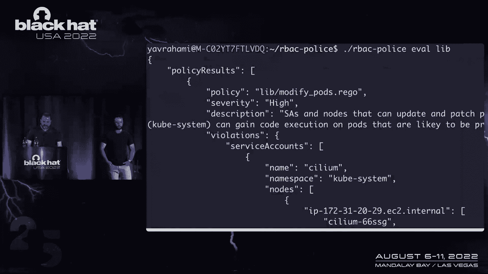

现在，我确实想说，如果你们中有人在运行这些平台，你不必惊慌或类似的事情。这不是一个未修补的漏洞。容器逃逸的发生有一个很大的先决条件。但为了将集群安全性提升到下一个级别，这也是需要注意的。

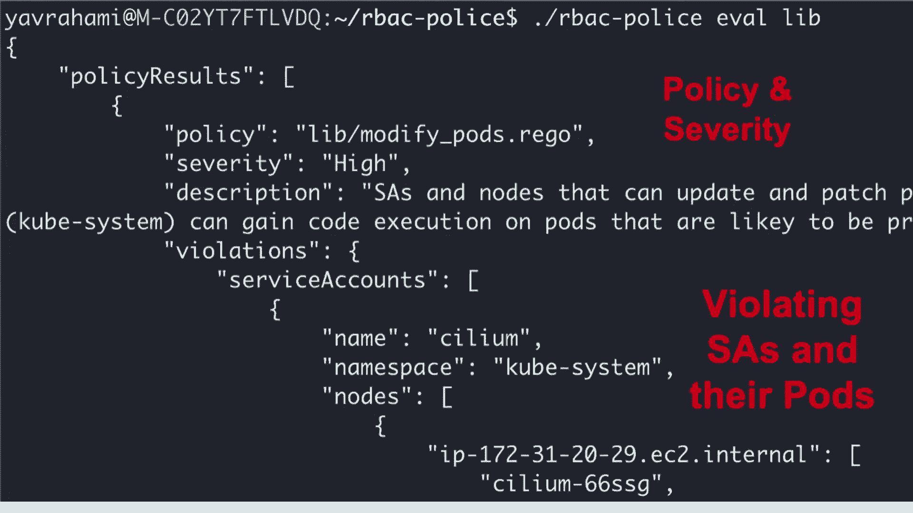

## 实战演示：以 Cilium 为例 🎬

我们显然不能演示所有的攻击。我们要看的是 Cilium。这是一个非常流行的容器网络接口，它是 Google Kubernetes Engine 中新数据平面的动力。我们选择 Cilium 的原因是，它展示了许多攻击类别，而且 Cilium 维护人员在修复方面做得很好。

我们今天要向你展示的每一件事，在 Cilium 中都已经修复。那么 Cilium 中的情况是什么呢？Cilium 在集群中安装了两个有趣的组件：一个是 Cilium DaemonSet（“蹦床” DaemonSet），它实际上可以删除 Pod 并更新节点的状态，这些权限，如果你记得，允许你窃取 Pod。Cilium 安装的第二件事是 Cilium Operator Pod，它实际上可以列出 Secret，正如我们前面提到的，这允许你获取令牌。

我们的攻击场景是：我们设法攻陷了一个 Pod 并实现了逃逸。所以我们控制了一个节点。我们的目标是获得集群管理权，以便控制集群中的所有节点。现在我们假设我们在最弱的节点上，即没有运行 Cilium Operator 的那个节点，因为这只是更可能的情况。如果集群中有十个节点，并且只运行一个 Cilium Operator，那么大多数节点都不会有 Cilium Operator。

我们获得集群管理权的方法是：首先在 DaemonSet 的权限内使用 Cilium 来窃取 Cilium Operator，然后使用 Cilium Operator 的权限来接管集群。

让我们看看攻击是如何进行的：
1.  我们首先使用 Cilium DaemonSet 权限，将集群中其他节点的 Pod 容量设置为零，使用我们前面描述的相同技术，使它们无法调度。
2.  我们删除 Cilium Operator Pod，迫使 Kubernetes 在我们的节点上重新创建它。
3.  现在，我们拥有了 Cilium Operator 服务账户。我们可以用它来列出 Secret，并检索集群中的服务账户令牌。
4.  我们要针对的服务账户叫做 `system:aggregate-to-edit`，它是集群聚合控制器的一部分。我们针对这个服务账户的原因是因为它可以操纵授权，它可以升级角色，这是我们前面讨论过的另一个权限。
5.  攻击的最后一步是使用 `system:aggregate-to-edit` 服务账户令牌，简单地将集群中的所有权限添加到绑定的角色中。

所以只有三步，但是当你将它们转换为 `kubectl` 命令时，会变得更多。所以我们要看一下这个演示。

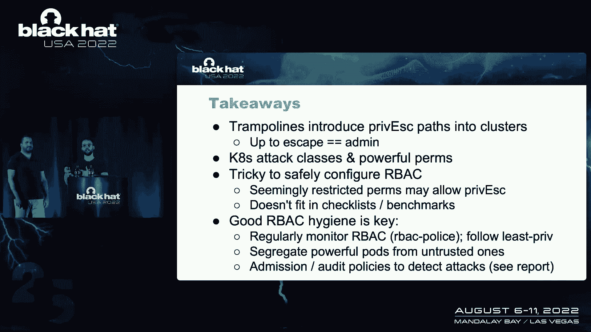

![](img/a3e34