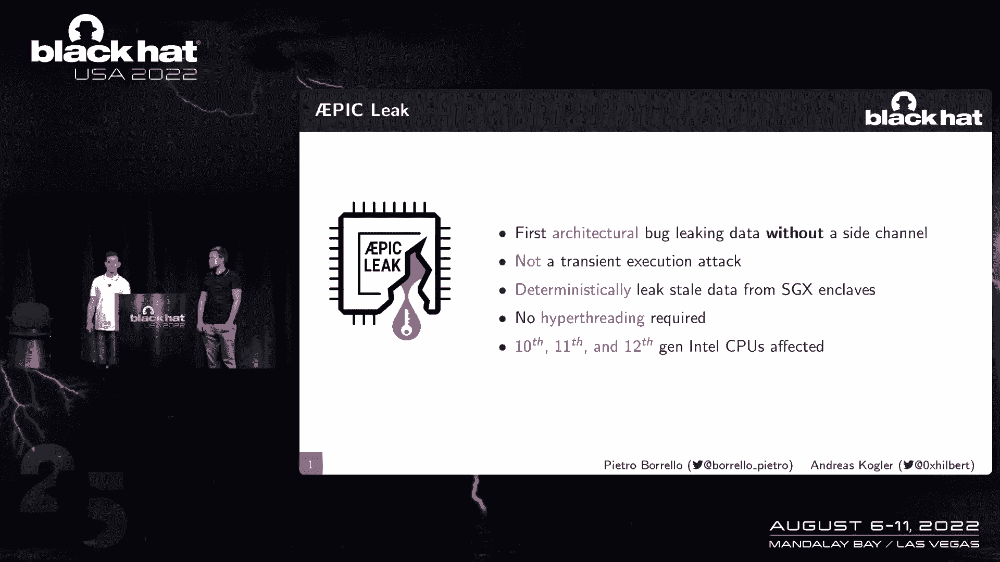
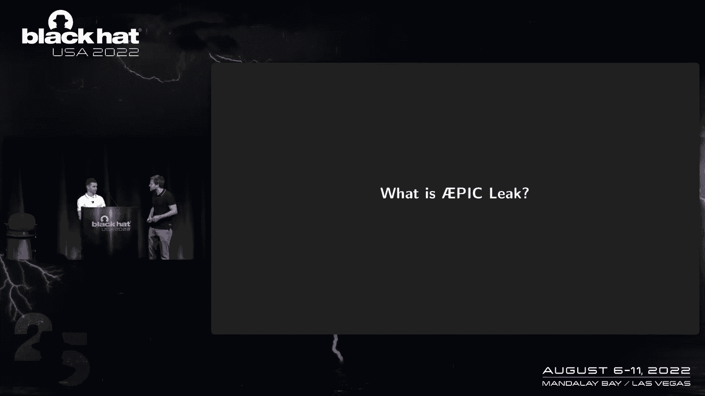
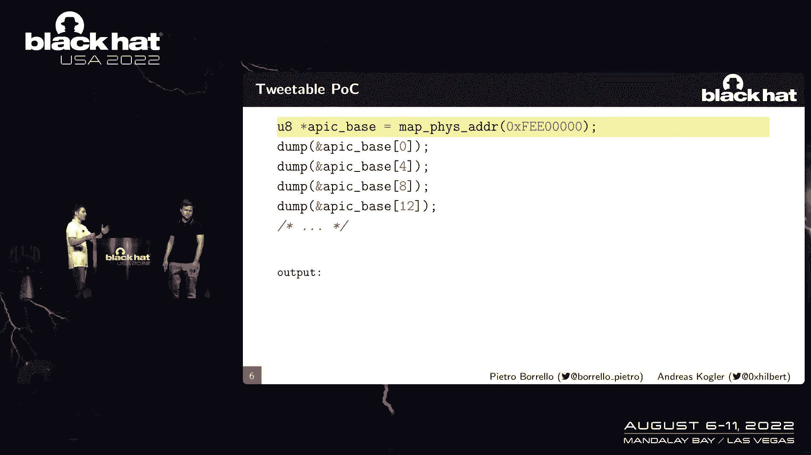
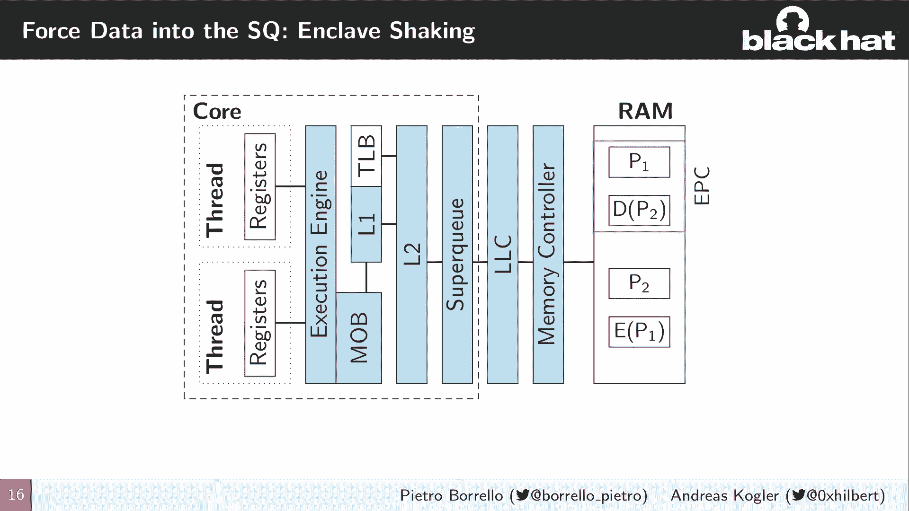
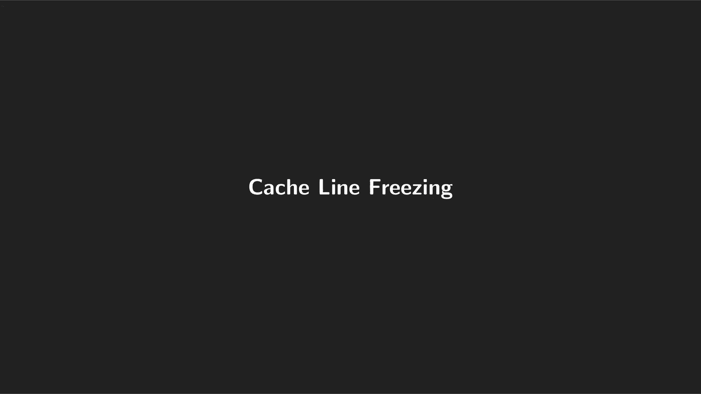
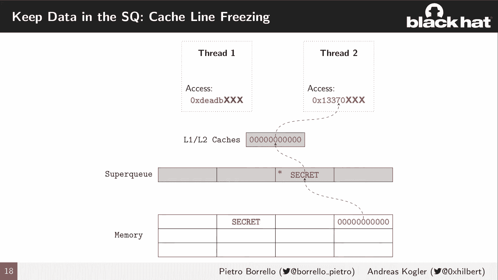
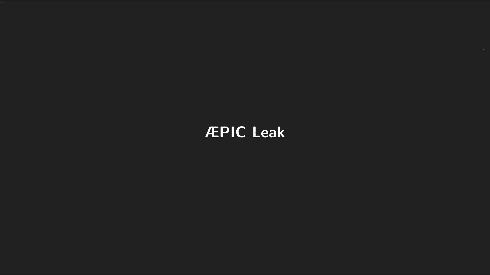
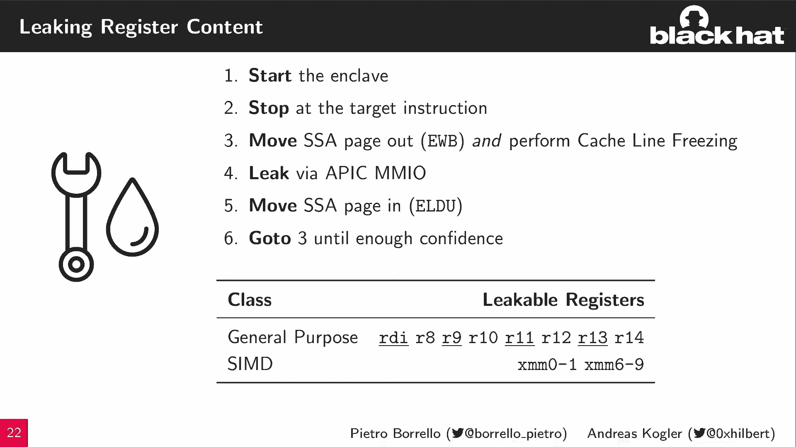
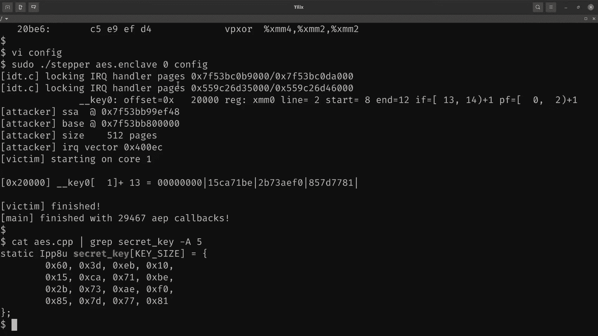
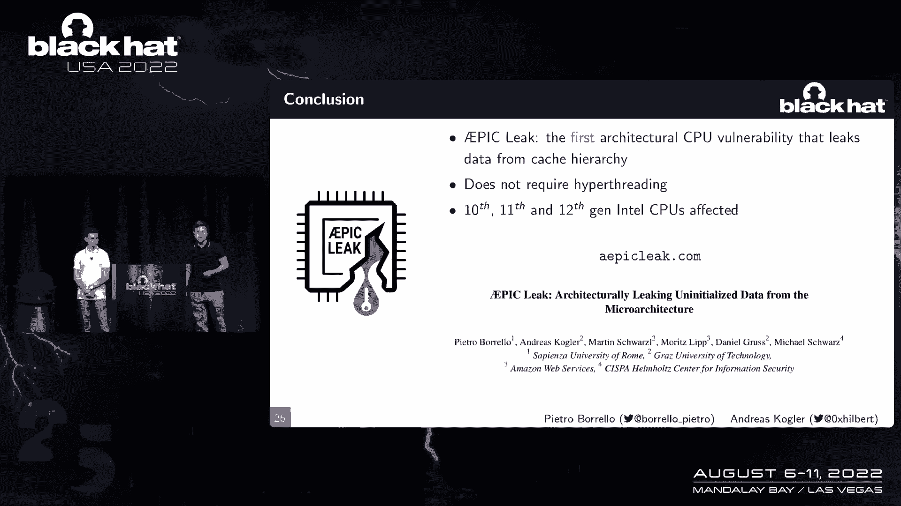

# 课程 P30：031 - AEPIC Leak：从微架构泄露未初始化数据 🚨

在本节课中，我们将学习一个名为 **AEPIC Leak** 的架构级安全漏洞。这个漏洞允许攻击者从现代英特尔CPU的特定组件中确定性地泄露陈旧数据，甚至无需依赖侧信道攻击。我们将深入探讨其原理、影响和利用方式。

---

## 什么是AEPIC Leak？🤔

上一节我们介绍了AEPIC Leak的基本概念，本节中我们来看看其核心组件“APIC”是什么。

**APIC**（高级可编程中断控制器）是现代CPU中负责生成、接收和管理所有中断的组件。每个CPU核心都有一个本地APIC。外部设备通过一组**内存映射寄存器**与APIC交互，这些寄存器由特定的MSR（模型特定寄存器）控制。

这些寄存器的大小为**4字节**，但总是**16字节对齐**。这意味着每个有效的APIC寄存器之间，存在**12字节（字节4到15）的未定义空间**。根据英特尔手册，访问这些未定义的字节会导致**未定义行为**或返回不正确的结果。

---

## 漏洞的发现与现象 🔍

上一节我们了解了APIC寄存器的结构，本节中我们来看看访问这些未定义区域会发生什么。

研究人员通过映射APIC所在的物理地址到虚拟地址空间，并尝试读取这些“未定义”的字节。以下是关键发现：

*   读取有效的APIC寄存器（前4字节）返回正常数据。
*   读取未定义的字节（字节4到15）时，**并未返回全零或发生崩溃**，而是返回了**残留的旧数据**。

这些残留数据可能是字符串，甚至是可以反汇编的**机器指令**。这表明，通过读取APIC未定义的偏移量，可以从CPU微架构层面**架构性地泄露状态值**。

---

## 数据从哪里泄露？📍

上一节我们看到数据被泄露了，本节中我们通过系统性的实验来定位泄露源头。

为了定位泄露源头，我们设计了以下实验：

以下是排查CPU各组件是否能成为泄露源的实验列表：
1.  **寄存器/执行引擎**：仅在寄存器中保存数据并进行操作，未观察到泄露。排除。
2.  **内存子系统（L1/L2缓存）**：访问能放入L1/L2缓存的小量内存，未观察到泄露。排除。
3.  **末级缓存（LLC）或内存**：从一个核心访问大量内存，观察到泄露；但从另一个核心访问，未观察到泄露。这表明泄露与核心间共享的组件有关。

实验表明，泄露并非来自核心私有的缓存或寄存器。泄露发生在**L2缓存和末级缓存（LLC）之间的互连缓冲区**，即 **Super Queue（超级队列）**。

---

## Super Queue 与 缓存行冻结 ❄️

上一节我们确定了泄露源是Super Queue，本节中我们探讨如何精确控制泄露的内容。

**Super Queue** 是L2和LLC之间传输数据的缓冲区。AEPIC Leak只能泄露通过此队列的、且位于**缓存行特定偏移**的数据。

由于APIC寄存器16字节对齐的特性，一次读取只能泄露一个缓存行中**四分之三**的数据（即12字节）。并且，实验表明只能泄露缓存行索引为偶数的行。

为了精确泄露目标数据（如SGX飞地中的特定密钥），我们需要一种方法将目标数据“固定”在Super Queue中。这通过 **“缓存行冻结”** 技术实现。

该技术利用了超线程共享Super Queue的特性，以及CPU微架构的一个优化：**全零的标签可能不会在队列中传播**。通过让一个线程（Thread 1）访问目标秘密数据，让另一个共享超线程的线程（Thread 2）访问一个地址不同但页内偏移相同的全零数据，可以“冻结”住包含秘密的Super Queue条目，防止其被覆盖。随后，通过读取APIC未定义区域即可泄露该秘密。

---

## 结合SGX飞地的完整攻击链 ⛓️

上一节我们掌握了泄露单个缓存行的技术，本节中我们看看如何将其用于攻击受SGX保护的飞地。

单纯的硬件泄露能力需要软件接口（如访问APIC）才能利用。**恶意操作系统**恰好具备此能力。**英特尔SGX**（软件保护扩展）的设计目标是保护飞地代码和数据，即使面对恶意操作系统。

攻击链结合了以下技术：
1.  **飞地页抖动**：恶意操作系统使用`EWB`和`ELDU`指令，将目标飞地页面在加密的EPC缓存和主存之间来回移动。这个过程必然使页面数据通过Super Queue。
2.  **缓存行冻结**：在数据通过Super Queue时，使用超线程和特定访问模式，冻结住包含目标秘密（如寄存器值）的缓存行。
3.  **AEPIC读取**：通过读取APIC未定义区域，从被冻结的Super Queue条目中确定性地泄露数据。

此攻击甚至可以在**飞地未运行**时进行，因为加密的页面数据在飞地被换出后仍可能残留在硬件缓冲区中。

---

## 攻击演示与影响 💥

上一节我们构建了完整的攻击理论，本节中我们通过一个实际演示来观察其威力。

研究人员针对一个使用**AES-NI指令集**进行加密的SGX飞地发起攻击。该飞地内部会调用`AESKEYGENASSIST`指令来生成轮密钥，此时一个XMM寄存器中会包含加密密钥。

攻击步骤如下：
1.  定位飞地中调用该指令的代码页和偏移。
2.  配置攻击，在指令执行前暂停飞地，迫使它将寄存器值保存到飞地的特殊状态保存区（SSA）页面。
3.  将SSA页面抖出EPC，通过Super Queue。
4.  冻结包含目标XMM寄存器值的缓存行。
5.  通过AEPIC Leak读取密钥。

演示表明，攻击能**快速、确定性地**恢复出部分密钥。由于存在泄露盲区（如XMM寄存器的前4字节），需要组合多次泄露才能获得完整密钥，但这在实践中是可行的。

---

## 缓解措施 🛡️

上一节我们看到了攻击的强大威力，本节中我们了解如何防御此类攻击。

英特尔已针对此漏洞发布了缓解措施：
1.  **禁用APIC的内存映射访问**：这是最直接的缓解，关闭了攻击面。系统可改用更快的x2APIC模式。
2.  **微代码更新**：在SGX相关操作（如`EWB`/`ELDU`）执行时，**刷新Super Queue**，清除残留数据。
3.  **安全实践建议**：在启用SGX的环境中，**考虑禁用超线程**。因为即使刷新了Super Queue，共享超线程的其他线程仍可能在时间窗口内泄露数据。

---

## 总结 📝

本节课中我们一起学习了AEPIC Leak漏洞。

我们了解到，通过读取APIC中未对齐的内存区域，可以从CPU的Super Queue组件中**架构性地泄露数据和代码**。结合**缓存行冻结**和**SGX飞地页抖动**技术，攻击者可以精确地瞄准并泄露飞地寄存器或数据页中的敏感信息。

总而言之，AEPIC Leak是**首个能够在不依赖瞬态执行的情况下，从微架构中确定性泄露陈旧数据的架构级漏洞**。它影响了多代英特尔CPU，并促使英特尔采取了包括微码更新在内的多层次缓解措施。