# 课程 P31：032 - 绕过幽灵硬件防御以泄露内核数据的肮脏小历史 🔓


## 概述


在本节课中，我们将学习一种名为“分支历史注入”的新攻击原语，它能够绕过现代CPU针对“幽灵”漏洞的硬件防御措施，从而从内核空间泄露敏感数据。我们将从“幽灵”漏洞的基本原理讲起，逐步分析现有硬件防御的弱点，并详细讲解如何利用我们的新发现来构建有效的攻击。

---

## 幽灵漏洞背景 🧠

上一节我们介绍了课程的主题。本节中，我们来看看什么是“幽灵”漏洞。

“幽灵”是影响大多数现代CPU的漏洞。它之所以从一开始就备受关注，其中一个原因是它可能被用来将数据从内核空间泄露到用户空间，这完全无视了特权域的概念。

该漏洞主要影响CPU上的特定组件：分支预测单元和推测执行单元。顾名思义，分支预测单元试图预测不同分支的执行路径。

以下是一个条件分支的示例，它试图进行数组边界检查：

```c
if (index < array_size) {
    value = array[index];
}
```

这里发生的情况是，基于数组索引的值，分支预测单元会开始建立“信心”，以判断该分支是否通常会被执行。如果索引值在边界内（例如 `index = 0`），分支预测单元会预测该分支将被执行。问题在于，如果你提供一个超出数组边界的值，并且分支预测单元已经建立了足够的“信心”认为该分支通常会被执行，它就会不在乎这实际上不应该发生，并**推测性地**执行越界读取。

显然，这在架构层面不是什么大问题，因为最终CPU会发现这个操作不应该发生，于是会“压扁”这个结果，就像这次读取从未发生过一样，然后继续执行后续操作。

但是，当把这种推测性执行与另一种微架构攻击（如缓存侧信道攻击）结合起来时，情况就不同了。以下是一个结合了越界读取和缓存攻击的示例：

```c
// 推测性越界读取
if (x < array1_size) {
    // 假设 array1[x] 包含一个秘密值，例如 3
    // 基于这个秘密值访问 array2
    temp = array2[array1[x] * 4096];
}
```

如果 `array1[x]` 的位置包含值 `3`，那么 `array2[3 * 4096]` 对应的缓存行将被加载到缓存中。之后，攻击者可以通过测量访问 `array2` 不同部分的时间，来推断出 `array1[x]` 的值（即泄露的秘密数据）。第一个访问时间明显更短的位置，就对应了被泄露的值。

这不仅适用于条件分支，也适用于间接分支。以下是一个利用多态性的间接分支预测示例：

```c
class Animal {
public:
    virtual void speak() = 0;
};
class Cat : public Animal {
public:
    void speak() override { meow(); }
};
class Dog : public Animal {
public:
    void speak() override { wolf(); }
};

Animal* obj = new Cat();
obj->speak(); // BPU 预测将跳转到 meow() 函数
```

这里发生的是，分支预测单元需要预测 `speak` 方法调用会跳转到哪里。它使用一个称为分支目标缓冲区的缓存来记录历史跳转目标。如果是从 `Cat` 对象调用，`meow` 将是正确的预测，从而加速执行。

问题在于，分支目标缓冲区是CPU上跨不同上下文（如不同进程、用户/内核模式）的共享资源。攻击者可以简单地用更有趣的目标（例如一个包含泄露代码的函数）覆盖BTB中的条目。这样，当再次从 `Cat` 类调用 `speak` 函数时，分支预测单元可能会错误地预测并推测性地执行攻击者的泄露函数，而不是 `meow` 函数。

正如我们所说，这可以用来构建跨越不同特权级别的攻击，因为CPU不知道存在不同的上下文。攻击者可以在同一内核上运行的不同应用程序之间、在用户模式和内核模式之间，甚至在虚拟机和宿主机之间发起攻击。

---

## 现有的硬件防御措施 🛡️

上一节我们介绍了幽灵漏洞的原理。本节中，我们来看看CPU供应商发现此漏洞后采取了哪些防御措施。

他们最初从软件防御开始，因为实现起来更快。第一个防御措施被称为 `retpoline`。它的作用是将所有间接调用转换为一大串指令。其总体思路是试图完全停止推测执行。在该示例中，你将把间接调用转换为此段代码，这将不允许你对此进行任何推测，因此你不能再利用幽灵漏洞。

在AMD上，一个非常相似的防御措施被称为 `MD CLEAR` 或 `Jump Barrier`。这基本上是相同的概念，只是针对不同微架构的非常不同的实现。

而ARM、Intel和AMD都采取了两种不同的硬件缓解措施，称为 `IBPB` 和 `BHI`。尽管它们在实现上非常不同，我们猜测它们在概念上实际非常相似。它们背后的想法是强制进行预测器模式隔离。

我们这么说是什么意思？一般的想法是，我们希望按安全域标记BTB条目。你可以想象，这可以简单地通过用额外的列扩展BTB来实现，其中你将条目标记为属于用户、内核、客户机或宿主机等上下文。之后，当你从内核上下文执行跳转时，该视图将只允许你推测属于内核上下文的目标。结果，你可以将此视为在推测领域的基本隔离方法。这样，你不能再实施任何跳回用户定义函数的攻击。

---

## 我们的研究问题：隔离真的完成了吗？❓

上一节我们介绍了现有的硬件防御。本节中，我们来看看我们研究的核心问题。

当我们考虑这个项目时，我们提出的问题是：隔离完成了吗？我们做的第一件事就是查看手册。这是 `BHI` 功能的手册描述，它表明攻击者只能“有限地控制推测性执行以确定方法”。显然，当我们开始研究这个问题时，我们有点困惑，因为这到底意味着什么？所以我们开始思考如何绕过这些缓解措施。

现在我将向你们解释我们是如何做到这一点的。我将从我们的猫和狗的例子开始，更多地解释间接分支预测在CPU上是如何工作的。

就像我们说的，这里我们期望 `Cat` 类执行 `meow` 函数，`Dog` 类执行 `wolf` 函数。但是从分支预测单元的角度来看，这两个函数调用来自相同的方法（即 `speak` 方法）。那么分支预测单元如何区分这两个不同的上下文呢？答案正是：预测需要依赖于函数调用的上下文。

我们所说的“上下文”是什么意思？我们只是指以前执行的函数的历史记录。例如，在这种情况下，如果你来自 `Cat` 类，你可以预期以前执行的函数或条件类似于 `Cat` 类构造函数，后面跟着 `new Cat()`。这基本上允许你区分此时你来自哪个类。你可以使用此上下文为BTB生成标记。

在这里你会看到，因为上下文与 `Cat` 非常相关，你会假设应该推测执行 `meow` 函数。这是如何按顺序工作的？为了实现这一点，可以用许多不同的方式，但过去讨论过的许多变体之一是同时使用分支地址和上下文来计算标记。他们建议将上下文中的所有不同跳转地址拼接到一个移位寄存器中，然后将这个值与 `speak` 函数的实际地址通过另一个哈希函数结合，来计算标记。

但是，当你执行模式切换（例如用户模式和内核模式之间的切换）时，它是如何工作的？我们的直觉是，准确的内核预测需要用户空间的历史记录。

我将用这个系统调用的例子来解释为什么。例如，在这种情况下，当你执行 `printf` 时，你要做的是一个系统调用 `write`。当执行 `write` 时，你会在BTB中为 `write` 恢复一个新条目。当你执行不同的功能时，例如 `read` 系统调用，这应该在BTB中存储另一个条目。一般的直觉是这样的：如果分支预测不依赖于用户空间上下文，就很难理解你需要跳转到哪个系统调用处理程序，因为内核入口点完全相同，你只需要一个调度程序来分派到不同的系统调用处理程序。

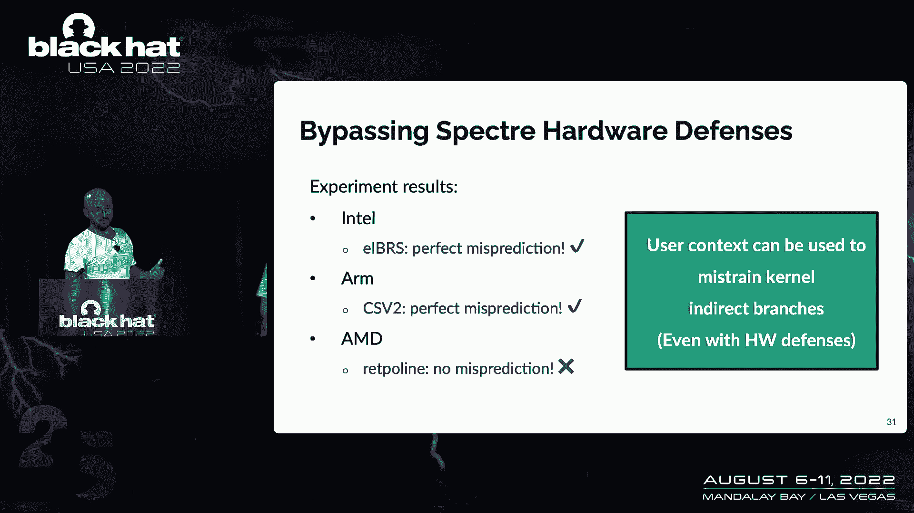

这意味着，如果这种缓解措施没有考虑到用户空间的历史记录，所有的误判都将发生。在我们的案例中，我们希望下次调用 `printf` 时，分支预测单元会觉得：“好的，这是一个 `write`，所以我需要推测一个 `write` 系统调用。”


我们用攻击者的心态测试了这个想法：我们想，我们可以只使用用户空间历史来控制分支预测吗？所以我们回到我们的系统调用例子，但在这种情况下，有两个通用循环和两个通用上下文。

以下是我们的实验步骤：

1.  在用户空间中生成一个跳转链，我们称之为“上下文A”。
2.  然后我们调用一个名为“系统调用A”的代码，这将在BTB中生成推测“系统调用A”的条目。
3.  然后我们对“上下文B”做同样的事情。
4.  最后我们也混合了历史记录：我们会有一个“上下文A”，但接下来我们用“上下文B”调用“系统调用B”。


就像你在这里看到的，历史记录是“系统调用A”，但最终你真的想执行“系统调用B”。这个实验可以告诉你我们的直觉是否正确。然后我们测试了这个：当你执行“上下文A”的历史记录，后面跟着“系统调用B”时，你观察到的是它推测了“系统调用A”。所以猜测是基于上下文。原因又是，因为分支预测单元会认为：“在这个用户历史记录中，所以我应该推测系统调用A。”

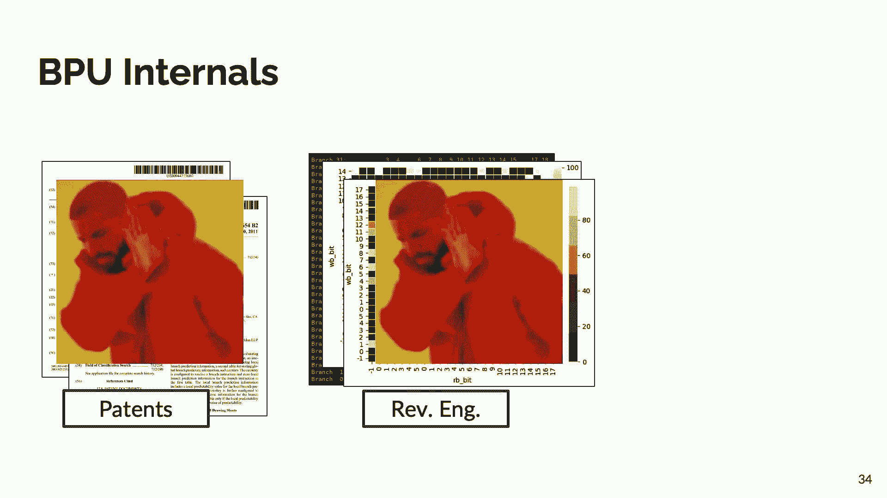

现在这显然是错误的，因为你想推测系统调用B，但这没什么大不了的，因为最终你可能会执行正确的路径。我们在大多数现代的Intel和ARM CPU上测试了这一点。在AMD上测试时，它不管用，因为他们仍然依赖像 `retpoline` 这样的软件防御来完全停止推测。但在我们测试的所有ARM CPU上，在这个实验中，我们可以观察到完美的错误预测。

那么，让我们试着理解这对这次经历意味着什么。我们基本上展示了用户上下文可以在内核分支中被利用，即使有这种新的硬件防御。这是我们的新攻击原语，我们称之为“分支历史注入”。

---

## 分支历史注入原语 💉

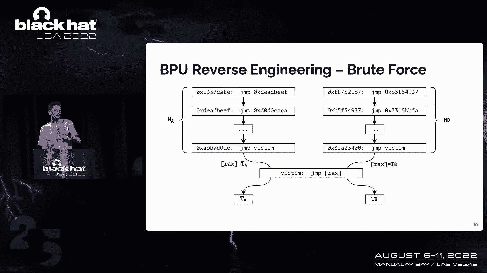

上一节我们发现了硬件防御的弱点。本节中，我们来详细看看我们提出的新攻击原语。

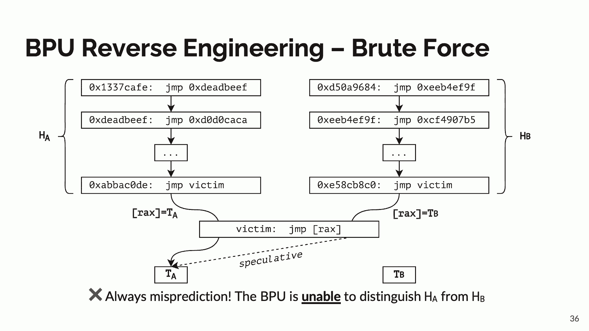

就像刚才说的，我们有一个非常简单的原语：现在我们可以通过从用户空间注入一些历史记录，来控制进入内核空间过程中的分支预测。

但你可以想象，我们离建立一个全面的漏洞利用还很远。为了达到这一点，我们需要回答两个问题：
1.  我们可以具体执行哪个目标？我的意思是，好的，我们可以在内核的那个分支中预测一个目标，但我们可以推测地执行哪个同样有效的目标？
2.  内核中有许多不同的分支，我们可以错误预测哪一个？因为要做到这一点，你必须对CPU内部的分支预测单元进行逆向工程。

通常，第一步是看看你可以在网上找到的专利。然而我们在这些方面很不走运，没有找到任何有用的东西。所以我们开始做经典的硅片逆向工程。你可以通过简单地执行一些特定的实验性指令，并观察CPU的性能（取决于你对实验的输入）来做到这一点。

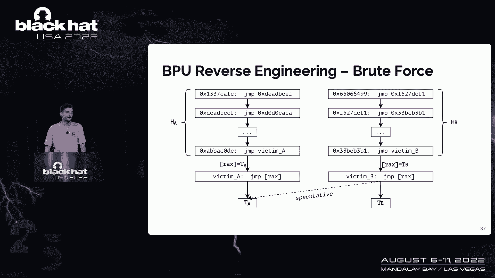

我们一开始很好地在某些模式上找到了一些很好的图案，但最终我们失败了，主要是因为架构变得如此复杂，以至于反转它们非常困难。两个月后，我们决定停止这种做法，因为很难理解分支预测单元的细节。

所以我们再次失败，只剩下我们真正的老朋友：蛮力攻击。

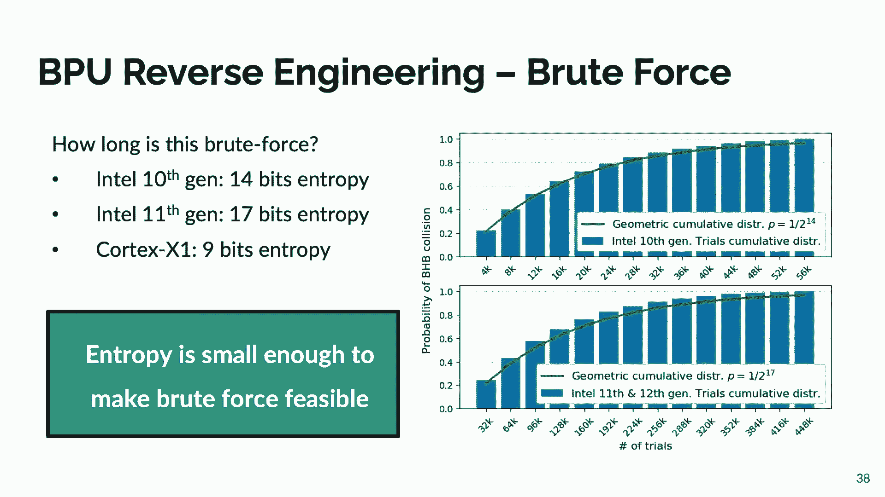

让我们后退一小步来理解为什么蛮力方法在这里有效。作为一个攻击者，我们只控制历史记录（红色高亮部分）。如果我们随机化这些比特，让我们看看会发生什么。

我们可以建立一个非常简单的实验，就像你在左边看到的：
*   我们有一个跳转链（例如从地址 `0xCAFE` 跳到 `0xBEEF`，再跳到 `0xDEAD`），这是我们生成特定历史记录的一个简单技巧。
*   在这之后，我们将执行目标分支，它总是以跳转到“目标A”结束。
*   这里的想法是将历史记录A与目标A相关联。所以每次分支预测单元看到历史记录A，它都会说：“跳到目标A是个好主意。”
*   然后我们生成一个随机的历史记录B，它总是跳转到目标B。

我们的目标是将历史记录A与目标A、历史记录B与目标B关联起来。如果我们以另一种方式执行这个调用路径，我们观察并总是得到来自分支预测单元的预测，这是意料之中的，因为我们给预测器提供了黄金场景以执行准确的预测。

但是，如果我们保持左边（历史记录A -> 目标A）不变，随机化右边（历史记录B -> 目标X）呢？最终我们观察到的是100%的误判率。


换句话说，在硅CPU中，分支预测单元不能区分历史记录A和B。所以你可以清楚地看到值是不同的，但是因为它们在一个寄存器中被哈希处理，它们会碰撞到相同的值。从CPU的角度来看，它们是一模一样的。所以这就是为什么它总是执行它的预测。对于我们作为一个攻击者来说，这是完美的，因为只要控制历史记录B，我们可以准确地进行它的预测。


让我们做最后一个小实验：让我们把两条路径完全分开。所以我们分支没有多余的库存了，我们有两个路径：路径A总是跳到目标A，路径B总是跳到目标B。这里也令人惊讶地，通过随机历史记录B，我们设法从整个B分支找到了一个针对A的猜测案例。

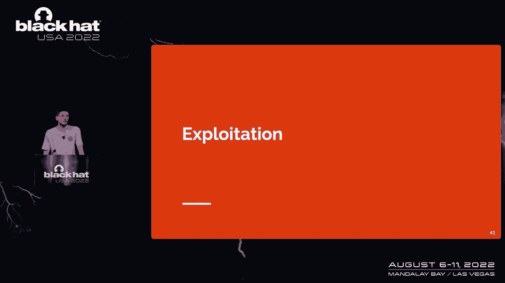

你觉得这很奇怪，因为该代码路径从不执行，从来没有跳到目标A。所以这实际上证明了分支预测单元不仅无法区分历史记录A和B，甚至无法区分不同的分支地址。作为一个攻击者，这是一个惊人的原语，因为现在你可以错误地预测任何其他分支，并随时猜测，就像完全自由地做任何你想做的事。

现在你可能会问，好的，蛮力方法容易但可能会非常慢。不是，真的对我们来说不是。我们很幸运，执行一个蛮力方法非常快。也许只是为了给你一些数字：
*   在英特尔CPU上，如果你尝试四万次，你几乎肯定会发现这种碰撞。
*   我们还在许多其他架构上进行了尝试。正如你所看到的，熵很小（最多17位），你可以在不到一分钟或几秒钟内打破。

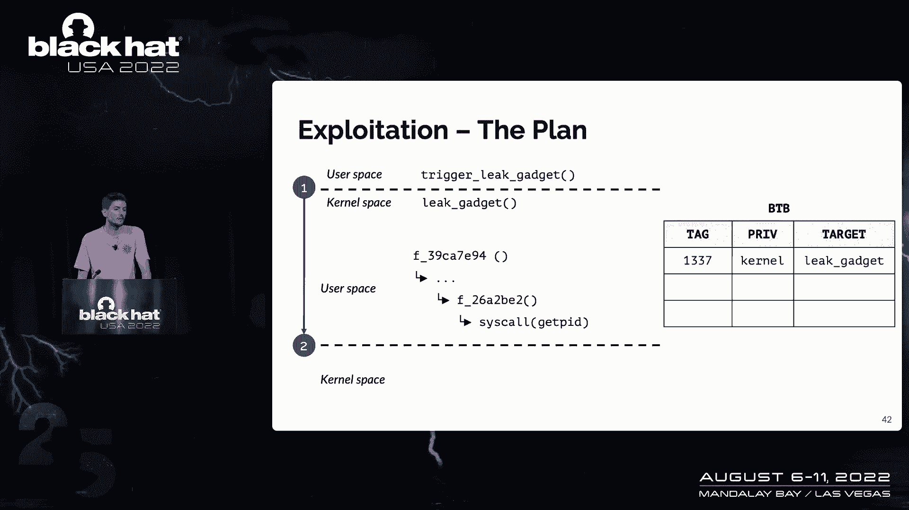

让我们做一个小的回顾来了解我们现在的原语是什么：
*   **目标**：错误预测内核中的一个间接分支。
*   **假设**：内核中的这个分支只跳转到两个有效目标：目标A和目标B。我们有硬件防御，所以我们不能再推测使用攻击者提供的函数。
*   **攻击者控制**：非常有限，只控制进入内核模式之前执行的最后几条指令（即历史记录）。
*   **我们的发现**：正如我们在英特尔和ARM CPU上演示的那样，你可以再次以非常精确的方式推测有效的目标，只要控制历史记录。但最好的是，在英特尔处理器上，你可以猜测你想要的任何目标，这相当强大，因为你真的扩大了你的攻击面。

给你一些英特尔的具体数字：历史记录的脉络是由最近被执行的67个分支组成的。作为一个攻击者，我们只需要控制其中的8个。所以我们甚至可以攻击很深、嵌套在内核中的分支。


---

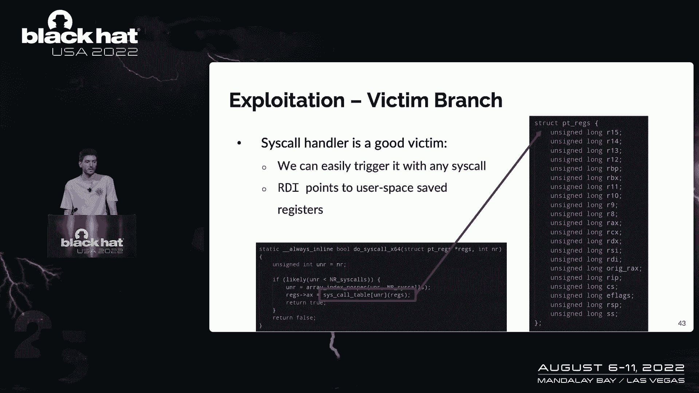

## 构建漏洞利用 ⚔️


上一节我们拥有了强大的攻击原语。本节中，我们来看看如何利用它做一些有趣的事情。

主要的攻击计划如下：

**第一步**：确保我们想执行的小工具代码存在于分支目标缓冲区中。要做到这一点，你只需要执行函数代码，并确保BTB装满了我们要推测的值。

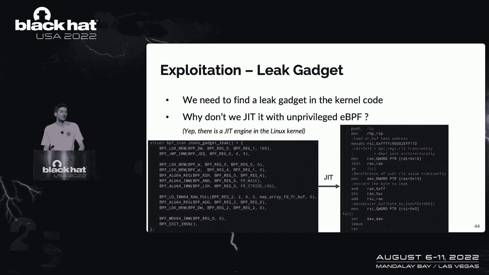

**第二步**：我们做之前看到的：简单地产生一个随机的历史记录，然后执行一个系统调用（任何系统调用都可以）。

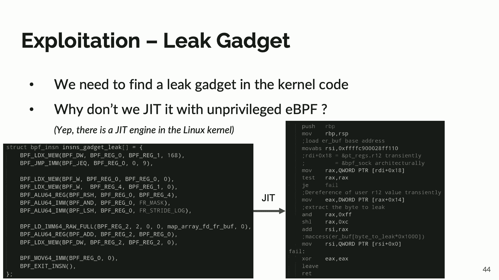

**第三步**：一旦我们进入内核空间，分支预测单元会说：“哦，我不知道它该跳到哪里，让我们来看看最近的执行历史（即来自用户空间的历史记录）。”我们生成一个标记。假设我们第一次不走运，标记不是我们想要的。没问题，我们要跳去找正确的目标。我们可以重复这个过程直到我们成功。所以我们再次确保小工具在BTB中，我们再次随机化历史记录，生成另一个标记，直到最终我们很幸运，打破了熵，生成了完全相同的BTB标记。这基本上可以让我们推测我们想要的函数。

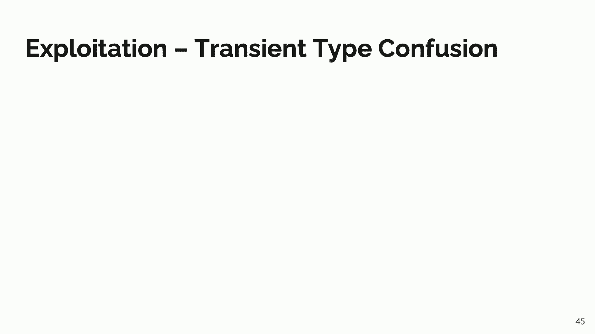

现在你可能会问，为什么我们总是在谈论这个叫做系统调用的分支？内核里有很多间接分支，为什么我们如此关注那个？主要原因是你可以很容易地在那个分支中触发它（系统调用会触发它）。但实际上最棒的部分是，作为一个攻击者，我们对内存和寄存器有很大的控制。

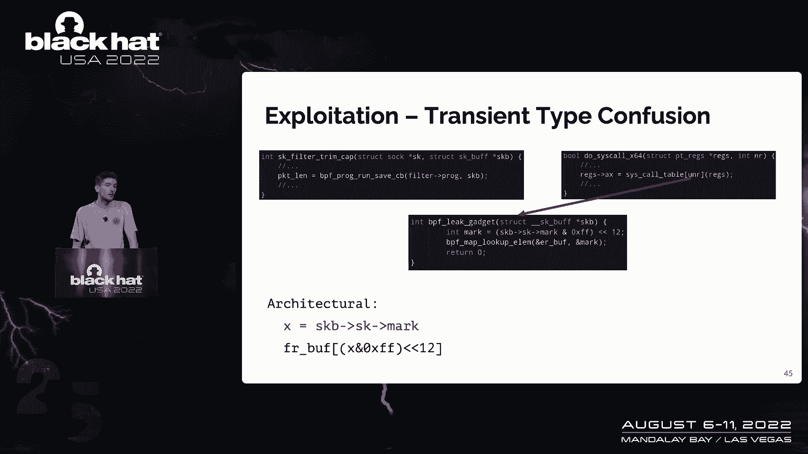

那么最大的挑战就是找到一个小工具。你可以想象内核二进制文件是巨大的，所以找到我们需要留在缓存中的那几条指令，至少你应该能找到它，这是一个非常乏味、需要很多时间的工作。既然我们用蛮力的方法，为什么我们不应该在这里也选择懒惰的方式？

在我们做这个项目的时候，eBPF（扩展伯克利包过滤器）上有一个很好的功能。简而言之，对我们来说，它是内核中的一个JIT引擎，用户可以使用它。你可以从用户空间编写eBPF程序，内核会对其调用操作码，直接在内核中生成代码。这对我们很有帮助，因为我们可以直接在内核中创建完美的小工具。


现在你可能会问：什么？内核开发人员允许你在内核中注入幽灵小工具？这听起来不安全。我是说，肯定，他们对此提出了缓解建议，这是正确的。eBPF对幽灵变体一有充分的缓解作用。但是在变体二上呢？eBPF也只是一个工具，在架构上做一些非常安全的事情，例如边界检查。即使在推测领域，这里也没有开发的可能。


多亏了幽灵变体二，我们不再从eBPF调度程序那里开始，我们是从系统调用处理程序开始的。从字面上看，有一种转换的混乱正在进行。我们没有访问受检查的数组，但我们将寄存器引用到内核中的任意其他内存，然后在缓存中留下一个痕迹，我们可以用来恢复泄露的数据。翻译的混乱，或者基本上是幽灵变体二，真的帮助你绕过针对变体一的频谱缓解。

最后一个缺失的部分是，我们需要一个精确的计时器来区分缓存命中与未命中。我们亲爱的朋友eBPF非常好心地提供给我们。所以是的，我们现在什么都可以利用。

---

## 现场演示 🎬


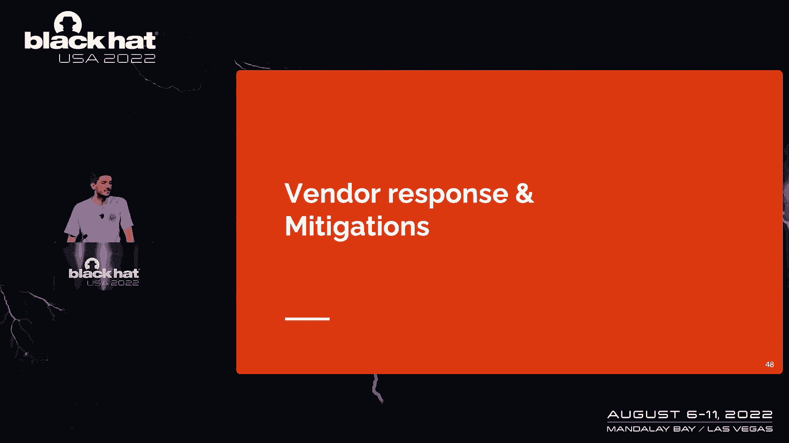

上一节我们讲解了攻击链的构建。本节中，我们通过一个现场演示来直观感受攻击过程。

在这里，我连接到一个脆弱的机器（它是一个英特尔CPU）。正如你所看到的，我们有一个更新的内核。如果我们检查缓解措施，我们可以看到它是脆弱的，因为这个系统知道这次攻击。

我们从一个建立一个驱逐集开始，以确保分支预测单元会给我们一个很大的推测窗口。完成之后，我们试图找到一个碰撞的历史记录。现在我们已经击中了目标内存。

第一步是打破内核地址空间布局随机化，因为我们需要读取内核中唯一有意义的部分。现在我们已经在线性地扫描内核内存，寻找有趣的东西。在这里我们决定寻找根用户的密码哈希。


你可以在三十秒内看到，我们找到了它，并证明实际上是正确的密码作为根。让我们把它打印出来，它匹配得非常好。


---

## 供应商响应与缓解措施更新 📢

上一节我们完成了攻击演示。本节中，我们来看看供应商的响应和后续缓解措施。


有很多细节，但总结一下：
*   **英特尔**：从某些型号开始的每一个英特尔CPU都受到影响。任何来自英特尔的新CPU都会受到影响。英特尔主要提出了一个单一的防御措施，即禁用某些预测功能（这不是一个理想的解决方案，但漏洞还在，不会很快消失）。他们也很有希望推出一些做同样事情的软件和硬件缓解措施。
*   **ARM**：情况有点复杂，但简而言之，假设CPU从两年前的分支预测单元应该会受到影响。ARM提出的缓解措施主要是在模式切换时清除分支历史缓冲区，这样在预测过程中，用户历史记录不再被使用。
*   **AMD**：正如我们从一开始就说过的，不受