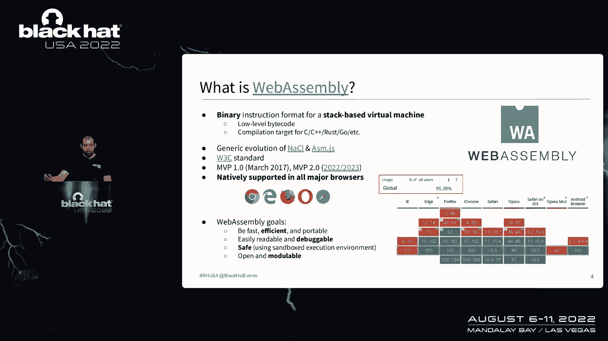
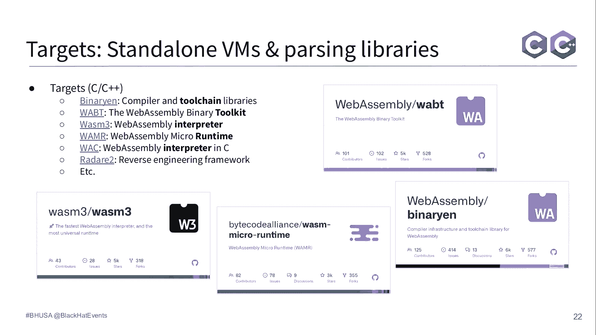

# P32：033 - A Journey Into Fuzzing WebAssembly Virtual Machines - 坤坤武特 - BV1WK41167dt

 [MUSIC PLAYING]。

 So welcome in this talk。 So as the name suggests， we're going， to discuss about fuzzing。

 So it's a journey into fuzzing where， by some level of your machine。

 So it will be mainly focused on the step， the different step。

 you need to do in order to do fuzzing when you are targeting。

 a huge and complex target that is in that case， the web as a little bit of a machine。 So of course。

 with one bugs， I will not discuss too much， about them and even less about their exploitation。

 It's really more focused on fuzzing。 And I hope you will find an interesting point。

 to apply that on other targets。 So my name is Patrick。 I'm the founder and CEO of fuzzing labs。

 So as the name suggests， we're doing fuzzing， and vulnerability research。 So mainly on， I mean。

 I will say different targets。 And the main goal for us is really， to develop fuzzer， custom fuzzer。

 and also， custom security tool。 So the main focus we are doing is。

 many errors to go and a browser fuzzing in general。 So a quick introduction to WebAssembly。

 So WebAssembly have been introduced in 2017。

 officially， with the MVP 1。0。 It's a binary instrumentation format， but it's just not。

 a binary format。 It's a binary format plus a text based representation。

 plus a stack based virtual machine。 That means a complete architecture as itself。

 So it's natively supported by all the major browsers， since quite some time now。

 And the main goal of WebAssembly is basically not， to replace JavaScript。

 It's to be in addition to JavaScript in order， to be more fast and so on。 So all WebAssembly works。

 Basically， you have two steps。 The first one is basically the compilation。

 So you have your classical piece of source code。 And you will compile that into WebAssembly。

 It will be your compilation target。 So there is some tools like LLVM that actually supports。

 WebAssembly as a target。 And script 10， Bener， VM， and some others。 So at the end。

 you have something like that， like the Fibonacci function in C， C++， or REST。

 And you get to compile that into the binary files。 That is the WebAssembly module。

 On the other part， you have the runtime and host environment。

 So your WebAssembly VM that will actually， take as an input your WebAssembly module。

 will decode and execute the module。 You have the most famous one， let's say。

 is V8 that actually contains a WebAssembly virtual machine。 And you have also， like。

 Wasmere and WasmTime， that are actually pretty famous。

 So the way it's worked when you are providing a WebAssembly， module， it will go to multiple stage。

 So the first one is the decoding and the passing。 So from this binary format， the WebAssembly VM。

 will actually create an internal module representation。 Then it will do the validation phase。

 meaning that it will decode the module， and check for particular stuff， like type checking。

 and some others。 Then you have the instantiation。 Basically， it will create a module instance。

 and it will create some additional stuff。 So you can think of memories， globals， tables。

 and some others。 So that's basically a quick overview。

 of the VM and the host interaction and different object。 So in one side， on the top。

 you have a bunch of memories， a bunch of globals and tables。 Those ones are created by the host。

 And basically， those ones will be shared to the WebAssembly， instance that is at the bottom。

 The WebAssembly instance is actually immutable， meaning that once the WebAssembly module is loaded。

 and instantiated， there is no way to modify the function， contour， the indirect function table。

 and the execution stack。 It's not a classic stack。 I mean。

 it's a stack for you just push and pop some data on it。 So it's kind of really limited in that way。

 So that's why we are telling that actually WebAssembly， is Sandboxed。

 That's typically for this kind of reason。 Finally， once the WebAssembly module is ready to go。

 you have the execution。 And in that case， the host will maybe。

 provide some argument to a specific function that， will be exported。

 And then it will run the WebAssembly module， the specific bytecode of WebAssembly， and do the job。

 So in terms of-- so that's just the WebAssembly VM。 And of course， this WebAssembly VM。

 will need a host environment。 So usually， we're speaking about browsers。

 like what I've done at the beginning。 But it's not the only host that is actually running WebAssembly。

 VM。 One other case is basically blockchains， that can use WebAssembly VM for smart contracts in general。

 And there is plenty of other ones。 For standalone VM， so that's this case。

 so you can think of a WebAssembly VM that， is running on the server。

 You can think of edge computing， IoT， blockchain， Node。js。

 That is actually running WebAssembly as well over V8 and so on。 On the browser side。

 you have a bunch of applications， that actually really leverage on WebAssembly。

 You can think of everything that is really， intensive in computation， like video， audio。

 image processing， this kind of stuff， video game， and also complex Web apps， like Google Earth。

 for example。 To give you a quick history， Google Earth before， was only available on Chrome。

 because it， was using something called native clients， that was a precursor of WebAssembly。

 But since they switched back， they， evolved into WebAssembly， it's not possible for you。

 to run Google Earth in whatever web browsers that support， WebAssembly。 So in this talk。

 we're going to mainly， focus on this part， that means providing a WebAssembly module。

 to the target that will be the virtual machine。 And our final goal will be Italy to find bugs。

 in all those different stages。 So that's what we're going to do。

 And my goal is to show you all you can basically improve。

 your freezing process over time to basically reach more， in deep cut paths into the WebAssembly VM。

 So the first thing I used was coverage guided phasing。 It's pretty easy。

 The main reason for that is since the first stage， is actually the decoding of a binary。

 coverage guided phasing， is actually switching pretty well。

 So the main goal for us will be to provide a corpora--。

 so the corpus that will contain WebAssembly module， basically。

 We're going to provide that to a phaser。 The phaser will do the mutation， meaning that it will add。

 randomness into the WebAssembly binary。 And then it will provide that to the WebAssembly VM。

 At the same time， we are monitoring the coverage。 So we monitor all deep and all interesting these sample is。

 And based on that， we will either classify that， as an interesting sample。 If we get a crash。

 we are keeping the crash on one side， and so on。 So it's basically the way it's working。

 So for the input， I mentioned it's a WebAssembly binary， format。 So it's not that complicated。

 If you take a look at the structure， you have one error that is composed of one magic number。

 plus a version。 So the magic number is a null-byed ASM。

 And then you have 11 sections that are unique and one。

 custom section that can be an unlimited amount of time。

 So the first target I first was basically a bunch of， Stondo-Rond VM and passing libraries。

 So mainly written in C and C++。 The main reason for that is I was working a lot on reversing。

 and analysis of WebAssembly module。 So I was using those tools。

 And I decided that it could be a good shot to actually， fuzz them at the same time。

 So I target basically binarem， wabi， twasm3， and some ozer， and even ruddera2。

 since I was using that for reversing as well。

 So nothing complicated。 I mean， I will not focus too much on that。

 That's the classical stuff if you are doing fuzzing。 Coverage-guided fuzzing。

 I've used AFL-ONFERS and AFL-PRISPRIS。 My favorite is actually ONFERS， but AFL-PRISPRIS is。

 definitely a good contender。 And after running a bunch of stuff and just basically。

 instrumenting the target using the custom version， the， custom GCC or claim of ONFERS or AFL。

 I was able to， basically make the stuff to run and already start to find， some crashes。

 So it was really easy， not that complicated， so that。

 the good part。 Actually， most complicated part is actually， the treaging。

 because I was triggering a lot of different， bugs。 So I report a bunch of them already。

 And as you can see， the most common bugs that we actually。

 found was out of bone summation error and you， pointed out the ref and so on。

 So that was the common bugs at this stage， that is， in， that case。

 the parsing of the web assembly module。 So the first improvement I've made in my fuzzing strategy。

 was basically to use the core rabbit in all targets。

 The main reason of that is since all those targets are， written differently， they follow the same。

 specification， but the implementation is different。 So there is a clear real value of reusing one。

 kapora to another， because what one tool will do in。

 terms of the CFG and so on and the different checks it will， do。

 will might not be the same as another one。 So it was the first step and then the second step was also。

 to add all the crashes that I found on one sample， directly into the global kapora that I was using。

 Again， the main reason is it might be a crash for one， program。

 but it could be an interesting sample for another， one。 So there is no reason I'm not doing that。

 Then I decided to do in-process fuzzing。 So in-process fuzzing is basically， let's say， optimize。

 way to do fuzzing。 The main goal is basically you will get your fuzzer that。

 will actually run your target in the same process， so it， will be way faster。 And in that case。

 you don't need to restart the process。 You can just， for every test cases， replace any memory。

 and provide that to your target and so on and so on。 So it's way faster。

 The main reason I've been doing that only on reverse and。

 Python since I was already playing with C&C，++ and finding bugs， it was not worth it at the time to。

 basically create fuzzing analysis for them。 It was already working well。 I mean。

 I was happy with the results。 So I decided that it was the good shot to actually target。

 something else and basically try some other tools。 So in that case。

 I first the standard on VM and passing， every mainly on REST。 So you can think of Wasm time。

 Wasm passer and so on。 So this kind of web assembly runtime and standard on VM。

 And I also target two other tools that I was using， like， PyWasm。

 that is a Python interpreter and WebAssembly GIS。 That is a JavaScript library for WebAssembly in general。

 So the result of that， when you are doing in-process fuzzing， on REST。

 you have a bunch of tools that are available。 The funny part is actually those tools are binding to the。

 classical C&C++ tool。 So if you are already familiar with them， it should be。

 pretty easy for you to basically ramp up into REST in， process fuzzing。

 So I was using Cargofus on fuzz REST and AFL REST。

 And the main part in that case is to write the fuzzing RNS。

 So with some good documentation it's pretty good， but even， in that case。

 I mean REST is not that complicated to read。 So you can pretty straightforward。

 And most of the time， the name of the function are， pretty clear of what it's doing。

 So I've made that for basically all the target I was， mentioning previously。

 so a bunch of fuzzing RNS。 And then I was running the stuff。 So it was not that complex。

 You just need to write the fuzzing RNS， learn a bit or to， play with the framework。

 and you are good to go。 For Python and GIS， I was using a Terrace。

 So it's a Python fuzzing framework。 It's actually based on libfuzzer and GIS。 So again。

 you just need to write the fuzzing RNS。 So you don't need to know exactly how the language。

 work and the expert in development and use language， you follow the fuzzing RNS template。

 and then you are， more or less good to go。 So the result of that was 62 bugs， mainly on REST。

 actually。 And the type of bug I actually found was panicking macros。

 in the Excel top bone on rapping， overflows and so on。 So just to mention。

 we say that REST is memory safe。 That's true， but it doesn't mean there is no， variability。

 Typically， it does one in the context of a CLI application。 It's not critical。

 But if you are using that in a library on a server and you， are able to trigger a panicking REST。

 that means you are， crushing the server。 And for blockchain software， in the same way you are。

 crushing the whole network， or at least the node。 So that's clearly critical。

 And that's really important to update in mine。 So the improvement I made at this point was basically to。

 improve my carpora。 I was reaching a point where actually a coverage was not， ever in that much。

 So I basically took a look at the official test suite of。

 WebAssembly and also at some existing fuzzing carporas that， was available on GitHub。

 And I added that to my carpus。 Again， the main goal is I maybe have one specific binary。

 that will actually contain a dedicated feature on WebAssembly， that I was not aware of。

 And it's maybe worth it to put it in place。 Then we are going to the validation phase。

 So I've been fuzzing a lot of the decoding parts， finding a， lot of bugs。

 But then I reached the point where basically my WebAssembly。

 module was correct in terms of the structure， the binary， structure。 But in terms of the content。

 there was invalid。 So the first step， of course， is to add some new fuzzing。

 analysis dedicated to fuzzing those on tri-pounds that are， the validation function。

 And then I decided to also take a look a bit more at the。

 validation mechanism to learn a bit more which kind of stuff， was actually checked at this point。

 So there is a bunch of stuff like the type， especially the。

 type and the kind of opcode and also interact with each other。 So there is a huge work on that。

 And it's really interesting to learn more from this stuff。 So for the grammar-based fuzzing。

 usually we are writing， grammar and so on。 So I've used grammar-based fuzzing in a different way。

 In that case， my goal， since we have the WebAssembly text， format available。

 that is called the what。 I decided to grab all the what files that I was able to find。

 and using some tool to basically convert this text format into， WebAssembly module。

 So that's the good part with these specifications that have。

 been designed like that in mind at the beginning。 You can go from what file the text format that is on the。

 right easily to the binary format and so on。 So we can also。

 and that's been for us for debugging and even， to write some edge cases， use this text format。

 representation。 So a quick like that。 It's not that complicated。

 You have the next S expression like to basically define the， module section and so on。

 And then you have a linear representation that will， contain the function body and the。

 rule of instruction。 So it's pretty easy to read to be honest。 I mean。

 if you want to do reversing and that， it's， definitely not that complicated if you are doing a bit of。

 reversing。 In terms of the MVP instruction set， it was not that big。

 The data type are pretty limited。 It's basically integral。 You have some control flow operator。

 That's why it's a Turing complete instruction set。

 You have some memory operators to load and store from the， memory， some local and global variable。

 some arithmetic， operators， constant， and also some conversion operators。

 That basically you switch from， let's say， float32 to， integral64。 So when I say that， actually。

 the instruction set is not， that complicated。 That's why。 For example。

 for the integral32 and the integral64， that's， basically the exact same of code。

 It's just that it's specific for one format or another。 So there is， let's say。

 already all the stuffs that are， actually pretty redundant and easy to understand。 So by doing that。

 I actually found some vulnerability， more， or less by accident， because when I was converting this。

 what file into WebAssembly module， I was at the same time， doing some phasing， because why not？

 And actually found some bugs inside。 So it was mainly assertion failure and one out of one。

 memory error。 So not that interesting， and especially even the tools are。

 not supposed to be run into a server and so on。 So even the impact was not that interesting。

 But I mean， there's still some free bugs， so why not？

 So this strategy improvement I've made in that case was。

 since I was aware of the text format and the， internal structure。

 I decided to try to write some edge cases， about that。 Typically， I mentioned there is some section。

 and the， section are unique。 So what is happening， basically， if you try to duplicate the。

 unique one and the custom one， I try to change the ordering。

 to see if some tools are actually dependent of that and， so on and so on。

 I even create a polyglot WebAssembly module that is at the。

 same time a valid HTML file and a valid WebAssembly module， just for fun。

 but actually I think I found any bugs with， that。 But it was funny。 So it was the first step。

 I got even more stuff in my corpora。 That's good， but it's still not enough。 I mean。

 when I'm phasing in that case at this moment， that's， mean I will be stuck。

 I will always go to the decoding phases and then going to， the validation phases。

 So what I decided to use is structure over phasing where， basically， I will directly。

 since I have knowledge of the， WebAssembly module structure internally， I will be able to。

 generate valid WebAssembly module directly from scratch， inside my phaser。 So it's really good。

 I will not lose time in passing。 So it will still go in the passing phase， but what I mean。

 by that is instead of sending， let's say， 100 files into the。

 process and maybe 50 of them are rejected in valid format。 In that case。

 100% of them will actually go through the， validation phases。

 So that was really efficient in that way。 So the way I've used that is basically by leveraging on。

 in-race what we call the arbitrary traits。 So you basically have already a bunch of tools that you saw。

 in Rust that actually define a WebAssembly module， structure。 So by using the arbitrary trait。

 I'm forcing basically my， phaser to try to fill this structure by random byte to get。

 something valid。 In the same way， you have Wasm Smith that is actually， even better。

 That was really a bit after I was doing that。 And typically， this WebAssembly test generator will。

 generate WebAssembly modules that are always valid at the， same time。

 So I retarget all my stuff by doing in-process phasing for， the rest libraries。 And at the end。

 I also target the other one since the， core power was actually shared between each other。

 That's also the good part。 So it was not that complicated。 Again。

 you just need to do a bunch of Rust。 In that case， arbitrary trait can be a bit challenging， but。

 that's OK。 So I found zero new bugs directly using that。 But the fact is。

 since the new stuff was generated and put， directly in the core power。

 I don't monitor exactly which， new bugs， what are the input files that actually triggered。

 these bugs after a mutation。 So I might actually--， I found some using this technique。

 but I don't know。 So at least it increased the coverage since I was。

 feeling my core power was only valid WebAssembly modules， that are interesting。 So at the end。

 we have the instantiation and the invocation。 And in that case。

 I decided to use differential phasing。 So that could look weird because differential phasing is。

 not something that is really common， to be honest。 So first of all。

 I create some new phasing analysis to， actually instantiate my module。

 And then I decide to basically implement differential， phasing using some really simple scripts。

 So the goal of differential phasing， in that case， is you。

 going to provide a WebAssembly module to your， different targets。

 And you're going to monitor the result。 It could be really simple like monitoring the return code。

 or， it could be more complex like checking the exact return， value。 So by doing that。

 my goal is really to identify for one， given WebAssembly module what are the results of all the。

 different targets I have。 And if some of them are actually rejecting the module or。

 validating the module and it's different than the other， that means something wrong is happening。

 So differential phasing is for me to really， maybe， most， efficient technique to find logic bugs。

 The downside is， of course， you need to have multiple， implementation of the same target。

 or maybe different， version of the same target。 That's usually what we have with a。

 regression testing。 That's exactly what we are doing。 And so on。

 So some famous differential phasing project， for example， cryptofers。

 And the goal is to find cryptographic vulnerability in， the different implementation。

 So it's done by Gido von Krenn。 And another one is Beacon First。 That is another project of mine。

 And it was basically phasing at around 2。0 validation， client by doing differential phasing。 Again。

 the same goal， finding logic bugs。 So logic bugs can look not so appealing to be honest。

 It's always the finding of the context and who are running， the WebAssembly module。 Typically。

 what you will have most of the time are an， implementation feature， especially on WebAssembly。

 So it will require you a lot of debugging and manual。

 analysis to determine if there is no false positive。 So that's the downside。 But on the other way。

 if we are going in the context of， blockchains， a logic bug like this one。

 meaning you are providing a WebAssembly module as a。

 smart contract and it will be executed and so on。 And the result can be different between clients。

 That's typically the sign of a constant use bug。 So it's really， really critical。 I mean。

 it's one of the most critical， vulnerability you can have in the， options of the general。

 So for the further， nothing that complicated， just a， Python script or a Bash script is enough。

 I've used Rust as well。 You can basically target all the different--， I mean。

 I was targeting all the different targets I， implemented because I mean， I already got the all。

 defacing on this， so it was really easy for that。 So it was not that complicated。 But again。

 it required a lot of manual analysis to determine， if yes or not you have some vulnerability。

 So iPhone 2 bugs in WebAssembly， that is one of the most， huge library written in C++。

 And in that case， it was incorrect validation or rejection， of WebAssembly module。

 But what are bad browsers？ Because since the beginning， I'm speaking more evenly more。

 on standalone VM。 So let's talk quickly about browsers and actually do。

 stuff that they got that is a bit more special。 So typically， WebAssembly。

 the WebAssembly VM is part of， the JavaScript engine。

 And so it's directly inside a Spider-Monkey JavaScript， call of V8 for the most famous one。

 And we have multiple stuff that actually involve the Web， Assembly。 Of course。

 you have the WebAssembly runtime。 That's exactly the same。 That's what I've shown you。

 And then you also have the JavaScript interrupt。 That means that all those WebAssembly API that allow you。

 to communicate from JavaScript to the WebAssembly VM。 So for this one， there is plenty of them。

 Actually， the MDM is really a good documentation for that。 And using this JavaScript API。

 you are able to basically， instantiate a WebAssembly module。 You can create some memories。

 some global， some tables。 So all the stuff I told you that was basically shared。

 between the host and the WebAssembly instance。 And we are doing something like that。

 So when you are dealing with JavaScript code， in that case。

 doing something like coverage-guided fuzzing is not that easy。

 And especially if you want to mutate your input file， you， will need to deal with JavaScript syntax。

 So definitely not the best。 So for that， usually， I'm using grammar-based fuzzing。

 So that's what I've done。 The only downside is you will need to write the grammar。

 So it could be time consuming。 But I mean， the WebAssembly APIs are not that huge。

 So that's what I've done with Dharma and Tomato。 And those two will basically generate some sequence of Web。

Assembly JavaScript API， like the one on the bottom。 And after that。

 I will provide this JavaScript file directly， to the GSM line。

 And it will basically create some object and target this extra。

 new part of the on-gene that we have。 That is the JavaScript and Terra and also the WebAssembly runtime。

 by effect。 I've also used a really good tool named， Fazily for Wasm。

 It's basically Fazily with some patch to add WebAssembly on it。

 So that's what you have on the top right。 It's actually generating some really good stuff。

 And it was working pretty well。 So at the end， it was long， but not that complex。

 to create those grammar。 And it actually triggers some bugs。 That， in that case。

 are not public or duplicates， on some other one。 So that's working well。 Usually。

 when I'm teaching browser fuzzing， I always invite people to actually use grammar-based fuzzing。

 for that。 It's also a really good way for you to learn more about your， target。

 because you will need basically to implement all， the spec on that。 So that's the good point。

 So that's the WebAssembly VM。 The fact is， since we are running inside a browser。

 there is what we call also the WebAssembly， "Git" and "Gines。"， So usually， the classical way is。

 let's say， for JavaScript。 You have your JavaScript。 It will be passed into AST。

 It will be converted into bytecode。 And it will be interpreted。 After some time。

 when the code will be hot， it will go through the "Git" and "Gine。"。

 And you will get optimized machine code that will be。

 executed each time you are calling the function。 So the fact is。

 they actually implement the same concept， for WebAssembly。

 So when you are providing a WebAssembly module， the first， time， it will be interpreted。

 So nothing fancy in that case。 And if it becomes hot， it will go through the "Git"。

 compilers and be optimized， generate machine code， and be executed as well。 So for Spider-Monkey。

 we have like a three-tier compilers， JavaScript as well。 And for V8， we have liftoff and Chobufan。

 that are the ones that are used。 So the main goal for me， in that case， different shelfasing。

 against the "Git" online， is basically to work， produce a。

 concept and a technique that is already used for classical， JavaScript。 That is， we have a function。

 We are calling this function with some argument。 We are getting a result。

 Then we force the optimization by the compilers， and we are， calling again the function。

 What we hope to find is basically a difference between。

 the interpretation and the compilation result。 And typically， those kind of stuff lead to incorrect。

 optimization。 So that's the good part。 The fact is， since we also have WebAssembly compilers， we。

 can perfectly apply the exact same technique for WebAssembly。 And in that case。

 I will generate a WebAssembly module， that will do some operation。

 I will load that using JavaScript。 I will call this module。 This module， by default。

 will be optimized by liftoff。 And I will force the optimization in order to make， sure， but fine。

 to optimize the WebAssembly module and this， particular function。 The main goal， again。

 let's say that you provide an， argument to a function。

 The goal is to find for the same argument two different， results on that。

 So that's a technique that actually is working well。 Actually， not that complicated to do。

 but the downside is you， need to generate valid WebAssembly module， and especially。

 valid WebAssembly module that contain interesting bytecode， inside。

 So that's what you can see on the upper right is basically the， code generated by liftoff。

 So it's pure assembly。 And then you can see on the bottom the code generated by， Chobufan。

 So the way it will go from one to the other is by doing a。

 lot of optimization on the bytecode and leveraging on a。

 bunch of profiling data that actually retrieve at runtime。 And again。

 the goal is do one is the one on the right and the。

 one at the bottom is actually doing the same stuff。 That's the goal we want to find out。

 So for the moment， no bugs found with that。 It's actually a recent stuff I've made for all the rest of。

 the research。 It was basically taking me a bunch of months and years to do。

 over all this process over the time。 And basically also add that all my two links to the。

 modification in WebAssembly。 So this one is still in progress。

 I will let you know if I'm finding any bugs on that。 The fact is I have not--。

 so there is some public research about JIT， UNJINE， Fuzzing and Vennability research in correct。

 optimization and so on。 Really a bunch of research done by Samuel from Project Zero。

 and Amy from Retu System and so on。 But on the web as I'm decided， I have not seen a lot of。

 stuff actually。 So if someone is doing something similar， please come to， see me at the end。

 I will be really happy to discuss that。 So the final result of all this journey is basically。

 something like 120 bugs， more or less。 Some of them I maybe just forget。

 The final couple of size is like 2 million WebAssembly， modules。 So as I mentioned。

 the fact that I'm storing everything， between all these different tools targeting something。

 like more than 20， 30 targets， it's just starting to be a， really huge copra。

 The good part is when you have something like that， if there。

 is a new tool that comes in the wild and that is actually， passing WebAssembly binary。

 I can just take all my copra， doing copies minimization on it and I will get something that。

 will reach a huge part of the coverage for free。 So it took me around two years， not full time。

 of course。 I will say maybe six months full time to do all of it。 Something like 84 for phasing。

 RMS is more or less。 I actually released an open source tool， WebAssembly， runtime phasing。

 I released maybe two years ago， so it might need to be， updated， but it's in progress。

 The interesting stuff we can see is that actually。

 coverage guided phasing and in process phasing that we can。

 consider are actually using similar technique， but just one， is faster than the other one。

 It's the stuff that actually find the most bugs。 So that's always showing that it should be a default stuff。

 to be done by the developer， because clearly it was clearly， not difficult to implement that。

 So there is no valid reason for you to not put any phasing， and coverage guided phasing in your CI。

 especially because， you basically are phasing from work for all the knowledge。

 that exists more or less。 So that was nice。 The challenge is it's complicated to update everything。

 I mean， all the different target evolved and I mean， I， have a full time job， and it's not that。

 So that's why。 Also， the fact that there is a different web assembly， features is an issue。

 especially for differential， phasing， as I mentioned， because one might support it and。

 not the other one。 And then you also need to adapt to multiple phasing from work。

 So that's actually the good part。 I mean， it's a nice excuse to basically try to further。

 everything and so on。 So some future and next step。

 I'm planning actually to implement and first like the。

 Go， there will be some tools。 Some web assembly I'm returning to go。

 So I'm planning to first this one as well， maybe some Java， one。

 there will be some implementation as well。 And also， since recently I announced WebAssembly MVP 2。0。

 I'm also planning to basically update my phasing and the， season， maybe find some new bugs。

 induce new features that， will be added into。 So I hope you learn a lot and that my journey into phasing。

 can help you to basically copy past this journey but just， change the target。

 And please let me know if you're doing phasing and you， want to discuss more about that。 I mean。

 you have my Twitter and I'm pretty responsive。 So thank you。 [APPLAUSE]。

 [MUSIC PLAYING]， [MUSIC PLAYING]， [MUSIC PLAYING]， [BLANK_AUDIO]。

