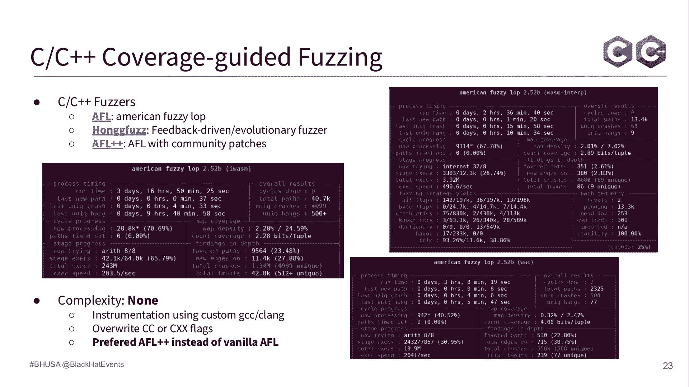

# 课程 P32：033 - WebAssembly 虚拟机模糊测试之旅 🚀

在本课程中，我们将学习如何对复杂的 WebAssembly 虚拟机进行模糊测试。我们将从基础概念开始，逐步深入到不同的测试策略，并展示如何通过改进方法发现更深层次的漏洞。

---

## WebAssembly 简介

WebAssembly 于 2017 年随 MVP 1.0 版本正式推出。它是一种二进制指令格式，但不仅仅是一个二进制格式。它包含一个基于文本的表示形式和一个基于栈的虚拟机，构成了一套完整的体系结构。

目前，所有主流浏览器都已原生支持 WebAssembly。其主要目标并非取代 JavaScript，而是作为 JavaScript 的补充，以提供更高的性能。

WebAssembly 的工作流程主要分为两个步骤。

以下是编译步骤：
1.  你有一段经典的源代码。
2.  使用支持 WebAssembly 作为目标的工具（如 LLVM、Emscripten、Binaryen）将其编译成 WebAssembly 模块（一个 `.wasm` 二进制文件）。

以下是运行时和宿主环境步骤：
1.  WebAssembly 虚拟机（如 V8、Wasmtime、Wasmer）接收 WebAssembly 模块。
2.  虚拟机对模块进行解码、验证、实例化，最终执行其中的字节码。

当一个 WebAssembly 模块被提供给虚拟机时，它会经历多个阶段。

以下是主要阶段：
*   **解码与解析**：虚拟机从二进制格式创建内部模块表示。
*   **验证**：虚拟机检查模块的合法性，例如进行类型检查。
*   **实例化**：虚拟机创建模块实例，并分配内存、全局变量、表等资源。
*   **执行**：宿主调用模块的导出函数，虚拟机执行相应的 WebAssembly 字节码。

WebAssembly 实例本身是不可变的，一旦加载和实例化，其函数、间接函数表和执行栈都无法修改。这种设计使其具有沙箱特性。

WebAssembly 虚拟机需要宿主环境。最常见的宿主是浏览器，但它并非唯一。

以下是其他宿主环境示例：
*   **独立虚拟机**：用于服务器、边缘计算、物联网、区块链（智能合约）、Node.js。
*   **浏览器**：用于计算密集型应用，如视频/音频/图像处理、视频游戏以及复杂的 Web 应用（例如 Google Earth）。

在本课程中，我们将主要关注如何向作为目标的虚拟机提供 WebAssembly 模块，并尝试在所有这些不同阶段中发现漏洞。

---

## 初始策略：覆盖率引导的模糊测试

我们的目标是找到 WebAssembly 虚拟机各个阶段的漏洞。首先，我们采用了覆盖率引导的模糊测试，这种方法非常适合从二进制解码开始的第一阶段。

以下是基本工作流程：
1.  我们准备一个包含初始 WebAssembly 模块的语料库。
2.  模糊测试器（Fuzzer）对这些模块进行变异，引入随机性。
3.  将变异后的模块提供给 WebAssembly 虚拟机执行。
4.  同时监控代码覆盖率，记录哪些路径被执行。
5.  根据覆盖率信息，判断样本是否“有趣”。如果导致崩溃，则保留崩溃样本。

输入是 WebAssembly 二进制格式。其结构并不复杂：它由一个魔数（`\0asm`）和一个版本号开头，后跟 11 个唯一的节（Section）以及数量不限的自定义节。

我最初的目标是一些用 C/C++ 编写的独立虚拟机和解析库，例如 Binaryen、WABT、Wasm3 等。我选择它们是因为我经常在逆向分析中使用这些工具。

我使用了 AFL 的衍生版本，如 AFL++ 和 honggfuzz。通过使用自定义的 GCC 或 Clang 版本对目标进行插桩，我能够开始运行测试并很快发现了一些崩溃。这个过程相对简单。

比较复杂的部分是分类，因为我触发了许多不同的漏洞。我报告了其中一部分。最常见的漏洞类型是解析阶段的数组越界和空指针解引用。

---

## 策略改进一：共享语料库与进程内模糊测试

上一节我们介绍了基础的覆盖率引导模糊测试。本节中，我们来看看如何通过共享语料库和进程内模糊测试来提升效率。

我做的第一个改进是在所有目标之间共享语料库。由于这些目标虽然遵循同一规范，但实现方式不同，因此将一个工具的语料库用于另一个工具具有明显价值。一个工具所执行的代码路径和检查可能与其他工具不同。

第二个改进是将在一个目标上发现的崩溃样本也加入到全局语料库中。一个导致某个程序崩溃的样本，可能对另一个程序来说是一个“有趣”的测试用例。

接着，我决定采用进程内模糊测试。这是一种优化的模糊测试方式，模糊测试器和目标程序运行在同一个进程内，速度更快。对于每个测试用例，无需重启进程，只需替换内存并重新执行即可。

我主要在 Rust 和 Python 编写的工具上应用了进程内模糊测试，因为针对 C/C++ 工具的测试已经运行良好。我目标包括 Wasmtime、Wasmparser 等 Rust 编写的运行时，以及 PyWasm 和 WebAssembly GIS 等工具。

对于 Rust，有 Cargofuzz、afl.rs 等工具可用。关键是要编写模糊测试驱动函数。Rust 的函数命名通常很清晰，因此编写起来相对直接。对于 Python 和 JS，我使用了 atheris（基于 libFuzzer）和 jazzer.js。

通过这种方法，我发现了 62 个漏洞，主要集中在 Rust 编写的工具中。漏洞类型包括导致程序恐慌的宏、整数溢出等。虽然 Rust 是内存安全的，但这并不意味着没有漏洞。在 CLI 应用或服务器库中触发恐慌会导致服务崩溃；在区块链中，则可能导致整个节点甚至网络崩溃，这非常关键。

在此阶段，我进一步改进了语料库。当覆盖率增长停滞时，我引入了 WebAssembly 官方的测试套件以及 GitHub 上已有的模糊测试语料库，以覆盖更多可能的特性和边缘情况。

---

## 深入验证阶段与基于语法的模糊测试

在大量测试了解码部分后，我遇到了瓶颈：生成的模块在二进制结构上是正确的，但内容可能是无效的，无法通过验证阶段。因此，我们需要将焦点转移到验证阶段。

首先，我添加了专门针对验证函数的模糊测试驱动。同时，我也更深入地研究了验证机制，了解哪些内容会被检查，例如类型系统、操作码之间的交互等，这本身也很有趣。

对于基于语法的模糊测试，我采用了一种不同的方式。WebAssembly 有一种基于文本的格式，称为 WAT。我收集了大量 WAT 文件，并使用工具（如 `wat2wasm`）将它们转换为二进制模块。这样，我可以利用人类可读的文本格式来生成或理解复杂的测试用例。

WAT 使用 S-表达式来定义模块和函数。其指令集在 MVP 版本中并不庞大，主要包括整数和浮点数类型、控制流操作符、内存加载/存储、局部/全局变量、算术运算符、常量以及类型转换操作符。理解起来并不困难。

通过这种方式，我意外地发现了一些漏洞，主要是在格式转换工具中的断言失败和内存错误。虽然这些工具通常不运行在服务器上，影响有限，但仍然是免费的漏洞。

此阶段的策略改进是：基于我对文本格式和内部结构的了解，主动编写一些边缘测试用例。例如，尝试复制唯一的节、改变节的顺序，甚至创建同时是有效 HTML 文件和有效 WebAssembly 模块的“多语种”文件，以测试解析器的健壮性。这进一步丰富了我的语料库。

---

## 结构化模糊测试与差分模糊测试

尽管语料库在不断丰富，但模糊测试仍然会卡在解码和验证阶段。为了更深入地测试实例化和调用阶段，我决定采用更高级的策略。

我首先采用了结构化模糊测试。这种方法直接利用我对 WebAssembly 模块内部结构的了解，在模糊测试器内部从头生成**有效**的 WebAssembly 模块。这样，100% 的生成样本都能通过解码，直接进入验证及后续阶段，效率显著提升。

在 Rust 中，我利用了 `Arbitrary` trait。一些库已经定义了 WebAssembly 模块的数据结构，通过让模糊测试器用随机字节填充这些结构，可以生成有效的模块。后来，还有了专门的生成器如 `wasm-smith`，它能生成始终有效的模块。

我使用进程内模糊测试重新测试了所有 Rust 库。虽然直接通过这种方法没有发现全新的漏洞，但由于语料库中充满了有效的、有趣的模块，它极大地提高了覆盖率，并为后续变异发现了更多漏洞创造了条件。

接下来，我们进入实例化和调用阶段。我在这里采用了差分模糊测试。这种方法并不常见，但对于发现逻辑错误非常有效。

我编写了新的测试驱动来实例化模块，然后使用简单的脚本实现差分测试。其原理是：将同一个 WebAssembly 模块提供给多个不同的目标（或同一目标的不同版本），并监控它们的结果（如返回码、返回值）。如果某些目标接受或拒绝模块的行为与其他目标不一致，就表明可能存在逻辑错误。

著名的差分模糊测试项目包括针对加密库的 `cryptofuzz` 和针对以太坊 2.0 客户端的 `beacon-fuzz`。逻辑错误本身可能看起来不那么吸引人，需要大量手动分析来确认是否为误报。但在区块链场景下，不同客户端对同一智能合约的执行结果不一致，可能意味着严重的共识漏洞，危害性极高。

实现差分测试并不复杂，一个 Python 或 Bash 脚本就足够了。我使用了 Rust，因为我已经有了所有目标的测试驱动。通过这种方法，我在一个大型 C++ 库中发现了 2 个漏洞，涉及对模块的不正确验证或拒绝。

---

## 针对浏览器环境的模糊测试

到目前为止，我们讨论的主要是独立虚拟机。现在让我们看看浏览器环境，它们有一些特殊之处。

在浏览器中，WebAssembly 虚拟机是 JavaScript 引擎的一部分。除了 WebAssembly 运行时本身，还有大量的 JavaScript 接口用于与 WebAssembly 交互，例如实例化模块、创建内存、全局变量和表。

当处理涉及 JavaScript 代码的测试时，使用覆盖率引导的模糊测试来变异输入文件就不太方便了，因为需要处理 JavaScript 语法。

因此，我通常使用基于语法的模糊测试。我使用 Dharma 和 Domato 等工具来生成一系列 WebAssembly JavaScript API 调用序列，然后将生成的 JavaScript 文件直接提供给 JS 引擎命令行工具执行。这样就能测试到 JavaScript 绑定层以及受影响的 WebAssembly 运行时。

我还使用了一个优秀的工具 `Fuzzilli`，它经过补丁可以支持 WebAssembly。它能生成高质量的测试用例，效果很好。

编写这些语法定义虽然耗时，但 WebAssembly API 本身并不庞大。这是一个深入了解目标的好方法。这种方法成功触发了一些漏洞。

---

## 针对即时编译器的模糊测试

在浏览器中，和 JavaScript 一样，WebAssembly 也拥有即时编译器。首次执行时，代码被解释执行。当代码变“热”时，它会经过 JIT 编译器优化，生成机器码以提高后续执行速度。

对于 SpiderMonkey，有一个三层编译器系统。对于 V8，有 Liftoff 和 TurboFan 编译器。

针对 JIT 编译器进行差分模糊测试的目标，是应用一种在 JavaScript 测试中已成熟的技术：我们有一个函数，用一些参数调用它并得到结果；然后我们强制 JIT 编译器优化该函数；再次用相同参数调用该函数。我们希望发现解释执行结果与编译优化后执行结果之间的差异，这种差异通常源于错误的优化。

我们可以将完全相同的技术应用于 WebAssembly。我会生成一个执行某些操作的 WebAssembly 模块，用 JavaScript 加载并调用它。默认情况下，它会被 Liftoff 编译器优化。我可以强制进行优化，确保特定函数被 TurboFan 等优化编译器处理。目标仍然是：对于相同的输入参数，发现两种执行路径产生不同的结果。

这项技术实施起来并不复杂，但难点在于需要生成**有效**的，并且包含**有趣字节码**的 WebAssembly 模块，以触发优化器的边缘情况。

目前，我尚未用此方法发现漏洞。这是一项近期开展的研究。公开领域已有许多关于 JavaScript JIT 引擎漏洞的研究，但针对 WebAssembly JIT 的研究相对较少。这项工作仍在进行中。

---

## 总结与未来方向

本节课中，我们一起学习了针对 WebAssembly 虚拟机进行模糊测试的完整旅程。

整个旅程的最终成果是发现了大约 120 个漏洞，积累了一个包含约 200 万个 WebAssembly 模块的庞大语料库。这个语料库可以轻松复用于新出现的工具，快速达到较高的覆盖率。

这项工作断断续续花费了约两年时间，编写了大约 80 个模糊测试驱动。我将部分工具开源为 `wasm-runtime-fuzzing`。

一个有趣的发现是，覆盖率引导模糊测试和进程内模糊测试（可视为前者的高效实现）发现了最多的漏洞。这表明开发者应该将这类测试作为 CI/CD 的标准环节，因为它能利用现有知识有效发现漏洞。

主要的挑战在于需要持续维护和更新，以跟上众多目标项目的演进以及 WebAssembly 新特性（如 MVP 2.0）的发布。同时，适应不同的模糊测试框架也是一种有益的锻炼。

未来的计划包括将模糊测试扩展到 Go、Java 等语言实现的 WebAssembly 运行时，并跟进 WebAssembly MVP 2.0 的新特性，以寻找新的漏洞。

我希望这次模糊测试之旅的分享能帮助你理解这个过程，并将其应用于其他目标。如果你也在进行模糊测试并想深入讨论，欢迎联系我。