# 课程 P33：034 - 无需人才申请：以工作为主题的APT社交工程手法与目标 🎯

在本节课中，我们将学习高级持续性威胁（APT）组织如何利用“求职”主题进行社会工程攻击。我们将通过几个具体的案例研究，分析攻击者的工具、技术和程序，帮助你识别并防范此类攻击。

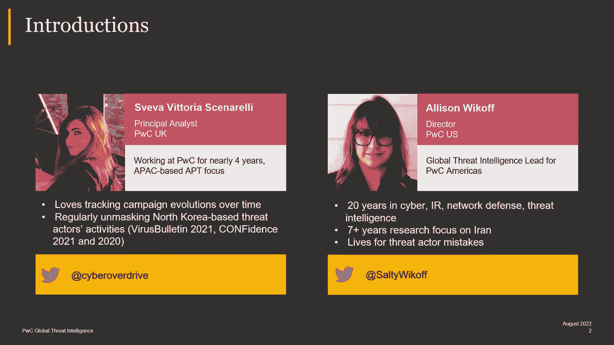

---

## 背景与动机

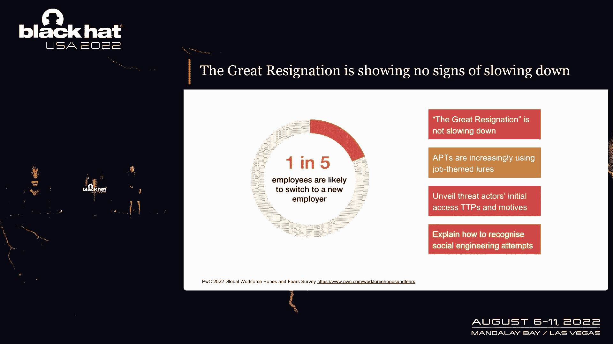

在过去的12个月里，许多人更换了工作。这种现象在疫情之后更为普遍，被称为“大辞职潮”。从网络安全的角度看，APT组织正在利用这一社会背景，越来越多地使用“工作机会”作为诱饵，并大胆地开展此类活动。

我们今天的目的是通过几个案例研究，带你了解实施此类攻击的APT组织的工具、技术和程序。这样，无论是蓝队还是红队，都能学习识别这些攻击尝试，并可能从中获得一些技巧。

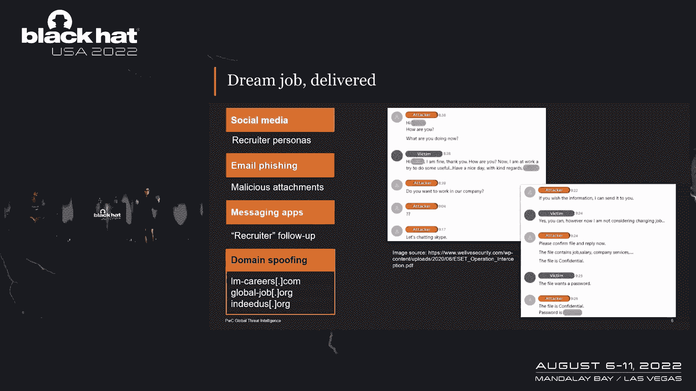

---

## 案例研究一：Black Artemis（拉撒路集团）

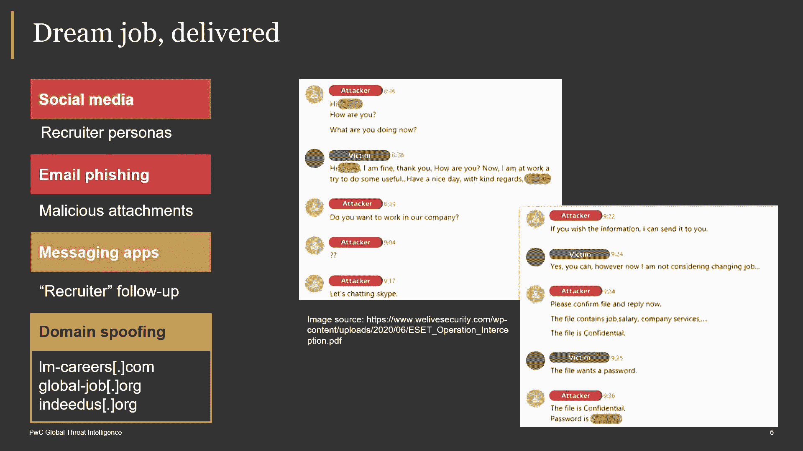

首先，我们来谈谈普华永道内部追踪的一个名为 **Black Artemis** 的APT组织。它在开源情报中也被称为 **Hidden Cobra**，美国政府则称之为 **Lazarus Group**。需要提醒的是，“拉撒路集团”是一个比较宽泛的名称，涵盖了许多活动。该组织自2007年以来一直活跃，并发生了很大变化。

本次演示中，我们将讨论Black Artemis的一个具体活动——**Operation Dream Job**。这是一场以间谍活动为动机的广泛行动，持续针对航空航天、国防工业基础、制造业和化学部门，旨在窃取从军事机密到具有战略意义的知识产权。

### 初始入侵途径

令人遗憾的是，电子邮件钓鱼并未消亡。Black Artemis 确实会继续发送带有恶意附件的钓鱼邮件。但在过去几年里，我们也观察到他们转向了社交媒体，特别是 **LinkedIn**。

攻击者会建立虚假的“招聘人员”角色，直接接触目标。例如，他们会以非常专业的方式接近受害者，询问对方是否对新的理想工作机会感兴趣。如果受害者表示正在工作不便交谈，攻击者甚至会表现得有些咄咄逼人地追问。

此外，Black Artemis 还会通过 **WhatsApp** 等即时通讯应用跟进目标，以确保受害者打开恶意文档或可执行文件。他们也会建立用于命令与控制（C2）的域名，这些域名可能被用来发送看似来自合法网站的钓鱼邮件，或者直接作为初始访问的“水坑”网站。

### 攻击链分析

攻击者会建立虚假的高知名度公司职位描述。当受害者访问这些链接时，其浏览器会在不知情的情况下被利用 **Google Chrome 的零日漏洞**（CVE-2023-2033），导致系统被植入后门。

尽管我们不断被提醒不要点击可疑链接，但用户意识在这里至关重要。仔细检查发送链接的域名是否合法，有时可以防止入侵。

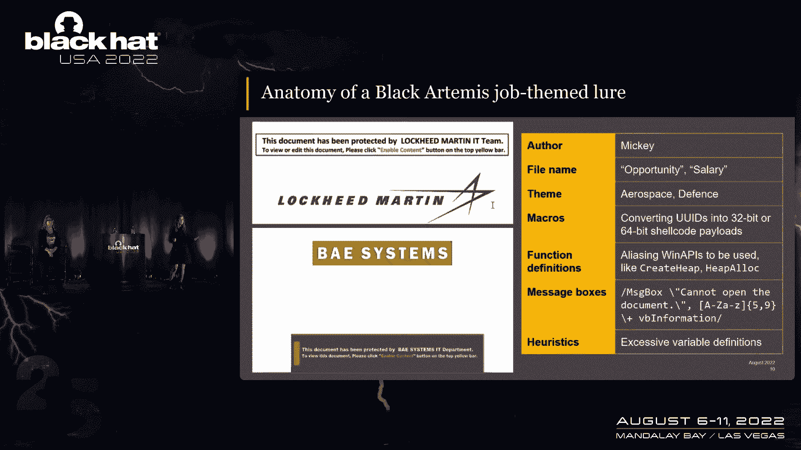

接下来，我们看看使用恶意文档的攻击链。在第一个例子中，Black Artemis 会创建一份虚假的高薪职位规范文档发送给受害者。当受害者启用宏时，会触发下一阶段。

例如，在一个观察到的案例中，宏会释放一个Base64编码的有效负载到受害者不太可能查看的文件夹（如 `C:\` 驱动器的某个路径）。然后，攻击者会确保一个名为 `serivs.exe` 的C2可执行文件被释放到同一文件夹并重命名执行。这个加载器可执行文件会连接到远程服务器，提取一个功能齐全的后门，实现文件窃取、命令执行等功能。

攻击者还会通过计划任务建立持久性，确保在机器重启后仍能保持访问。

**检测机会**：监控环境中是否有异常路径下的 `schtasks.exe` 被用于创建计划任务。这可能是恶意活动的迹象。

### 诱饵文件与元数据

这些诱饵文件通常带有“启用内容，因为此文档受保护”的提示。虽然其外观可能变化，但文档的**元数据**能为防御者提供帮助。

在许多由Black Artemis创建的文件中，我们发现了特定的作者元数据（如 `Nikki`），以及可能用于编码有效负载或调用特定Windows API的标记。这些都可以作为检测指标。

**重要提示**：与本次演讲相关的所有活动妥协指标（IOC），将在演讲结束后发布在我们的公共GitHub仓库中。

---

## 案例研究二：Black Alcanto（APT38）

现在，我们来看一个出于经济动机的APT组织案例。普华永道内部追踪为 **Black Alcanto**，它非常专注于**加密货币**领域。

该组织以加密货币交易所为目标，旨在窃取资金。就在几个月前，他们涉嫌从Axie Infinity的Ronin桥窃取了6.25亿美元。其攻击手法与我们今天讨论的TTPs一致。

### 社会工程手法

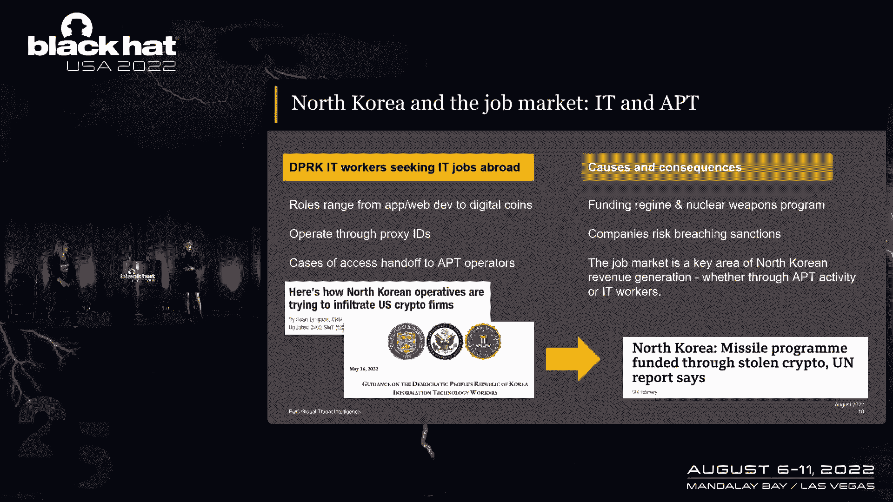

Black Alcanto 也进行电子邮件钓鱼，但更常使用带有链接或附件的压缩档案（如 `.zip`），其中可能包含受密码保护的Word文档或 `.lnk` 快捷方式文件。这符合更广泛的趋势，即攻击者越来越多地使用 `.lnk`、`.iso` 或 `.msi` 等文件类型进行初始访问。

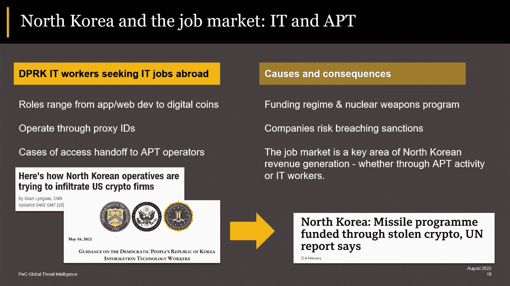

该组织还会滥用电子邮件措辞，冒充受害者的熟人，分享所谓的“稳定币分析报告”等诱饵，诱使受害者点击。

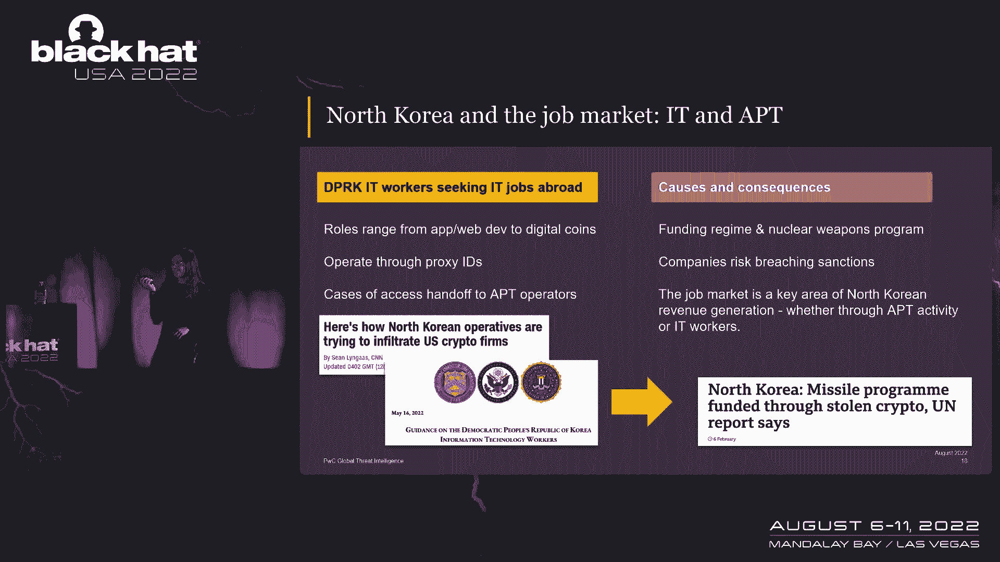

在社交媒体上，他们同样冒充招聘人员，诱使受害者询问其公司详情。Black Alcanto 也进行域名欺骗，注册与高盛（Goldman Sachs）等知名公司相似的域名。

**狩猎技巧**：该组织喜欢通过特定注册商注册域名。如果你查看这些域名解析到的服务器，会发现它们有非常特定的 Apache、PHP 和 OpenSSL 版本组合。你可以利用这些信息构建查询，发现更多基础设施。

### 入侵链分析

攻击者发送钓鱼邮件，其中包含一个 `.pdf.lnk` 或类似的链接文件。受害者点击后，会看到一个关于加密市场的诱饵文档。但在后台，`.lnk` 文件实际上会调用 `mshta.exe`，连接到远程服务器并拉取一个恶意的JavaScript脚本（我们称之为 **Cabbage Loader**）。

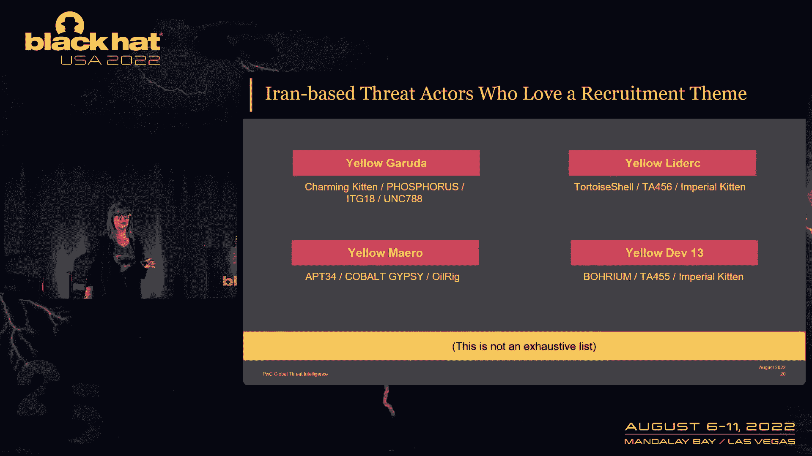

Cabbage Loader 首先会在受害者的启动文件夹中放置一个 `.lnk` 文件以确保持久性，然后拉取一系列其他JavaScript有效负载（被称为 **CoveredPiper RATs**）。这些是探查器，用于确认目标是否是真人而非沙箱。确认后，攻击者会手动部署另一个功能齐全的后门——**CabbageRC**。

**检测机会**：监控环境中是否有 `.lnk` 文件调用 `mshta.exe` 并从远程源拉取、执行文件。如果这在你的环境中不常见，就值得警惕。

### 诱饵文件与归属关联

Black Alcanto 使用的诱饵文件与之前Black Artemis使用的结构非常相似，只是将公司名称和内容替换成了区块链相关主题。这种代码或模板的重用，是进行威胁归因和关联分析的有趣线索。

---

## 案例研究三：Yellow Dev13（伊朗背景的APT）

现在，让我们将目光转向中东地区，讨论一些与“招聘”相关的威胁活动。

伊朗背景的威胁行为者非常热衷于“招聘”主题。例如，有组织针对记者提供虚假会议或工作机会；有组织建立虚假的招聘公司，专门针对美国退伍军人。

我们今天重点讨论的是一个被我们内部追踪为 **Yellow Dev13** 的组织。该组织自2019年左右开始活跃，专注于间谍活动，目标区域包括美国、英国、加拿大、中东、俄罗斯和印度，针对能源、技术、运输、半导体以及后勤和海事部门。

### 虚假基础设施与角色

Yellow Dev13 建立了大量虚假基础设施。他们创建了欺骗性的公司网站、虚假的合法招聘公司。其中两个突出的虚假招聘公司是 **Applied Talent** 和 **Career Finder**。

这些网站至今仍在活动。攻击者可能在社交媒体（如LinkedIn）上建立个人资料接触目标，并诱使对方从这些网站下载一个ZIP文件。

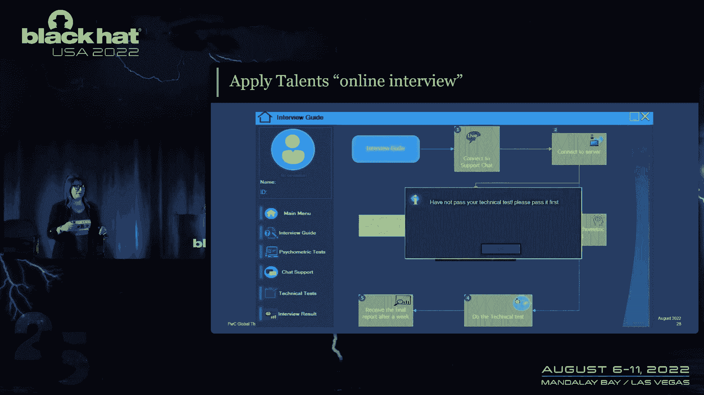

### 攻击手法分析

ZIP文件中包含一个名为 `OnlineInterview.exe` 的可执行文件。有趣的是，这个EXE本身并不是恶意软件，而是一个**凭证提示工具**。它会弹出一个界面，要求用户输入凭据。

我们认为这有两个目的：1）逃避沙箱检测（因为它是良性交互程序）；2）让攻击者（以及像我们这样的分析师）难以获得完整的入侵链。我们推测，在受害者输入凭据后，攻击者可能会手动部署有效负载以窃取数据。

`OnlineInterview.exe` 的界面看起来非常“业余”，充满了拼写错误和奇怪的UI设计，与其声称的“英国招聘公司”背景不符。

### 虚假角色与AI生成图像

Yellow Dev13 运营着多个虚假的LinkedIn角色。一个显著特点是，这些角色的个人资料图片很可能是**AI生成的**。观察这些图片的背景、眼镜、珠宝和头发细节，可以发现许多人工智能图像的典型瑕疵。

这些角色的个人资料内容也常常自相矛盾（例如，头衔是“HRIS顾问”，但描述却是“招聘人员”），但他们却拥有数百个联系人，这表明其社会工程活动可能取得了一定成功。

在Applied Talent和Career Finder的“团队介绍”页面上，也使用了这些质量参差不齐的AI生成图像，甚至两个网站使用了相同的英国电话号码。

---

## 防御建议与总结

在本节课中，我们一起学习了三个不同APT组织如何利用“求职”主题进行社会工程攻击。从Black Artemis的复杂恶意文档链，到Black Alcanto针对加密货币的经济动机攻击，再到Yellow Dev13使用AI生成角色和虚假招聘网站的间谍活动，攻击手法在不断演变。

### 关键要点

1.  **威胁行为者正在利用社会趋势**：他们紧跟“大辞职潮”、远程办公等热点，更新其诱饵内容。
2.  **社会工程仍在进化**：攻击渠道从邮件扩展到LinkedIn、WhatsApp；使用AI生成图像使虚假角色更逼真。
3.  **初始访问技术持续变化**：随着微软默认禁用互联网宏，攻击者正转向 `.lnk`、`.iso` 等文件进行投递。
4.  **防御挑战**：攻击发生在企业控制范围之外（如员工个人社交媒体）。因此，培养一种开放的安全文化至关重要，让员工在感到可疑时，愿意并能够毫无顾虑地报告。

### 行动建议

*   **提高意识**：教育员工警惕未经请求的工作机会，特别是来自陌生“招聘人员”的接触。
*   **仔细核查**：检查发件人邮箱、网站域名等细节是否存在细微差异。
*   **技术检测**：
    *   监控异常的计划任务创建（如 `schtasks.exe` 指向可疑路径）。
    *   监控 `.lnk` 文件调用 `mshta.exe` 或 `cmd.exe` 从远程下载执行代码的行为。
    *   利用文档元数据（作者、内部标记）进行聚类分析和威胁狩猎。
*   **利用威胁情报**：参考安全厂商发布的IOC和YARA规则，在自己的网络中进行搜索和检测。

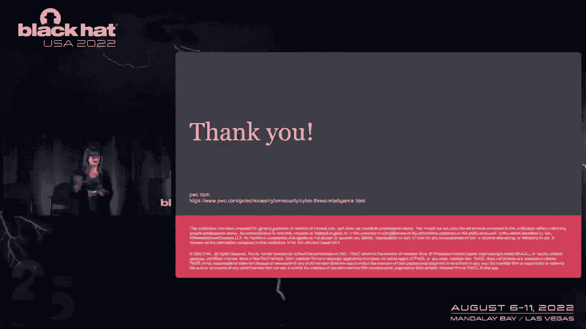

本节课中讨论的所有妥协指标（IOC）、YARA规则和相关资料，都将在演讲后发布在指定的GitHub仓库中，供大家用于提升自身网络的防御能力。