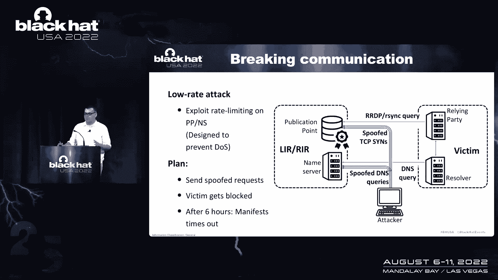
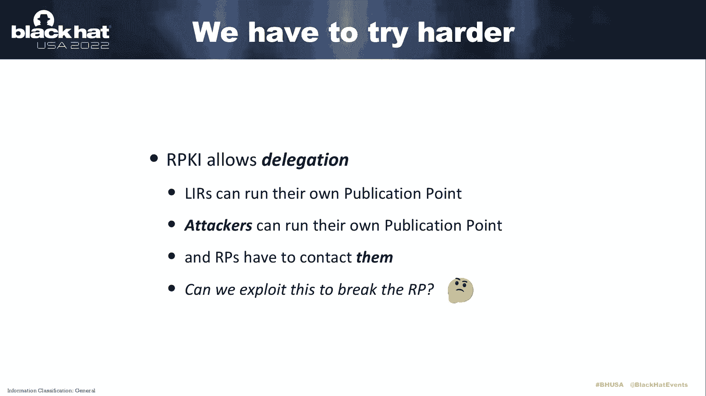
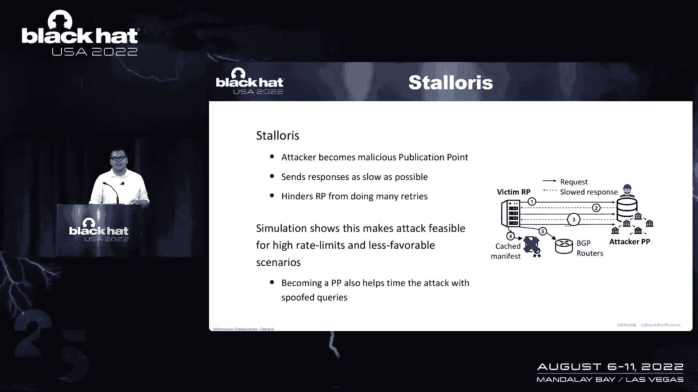
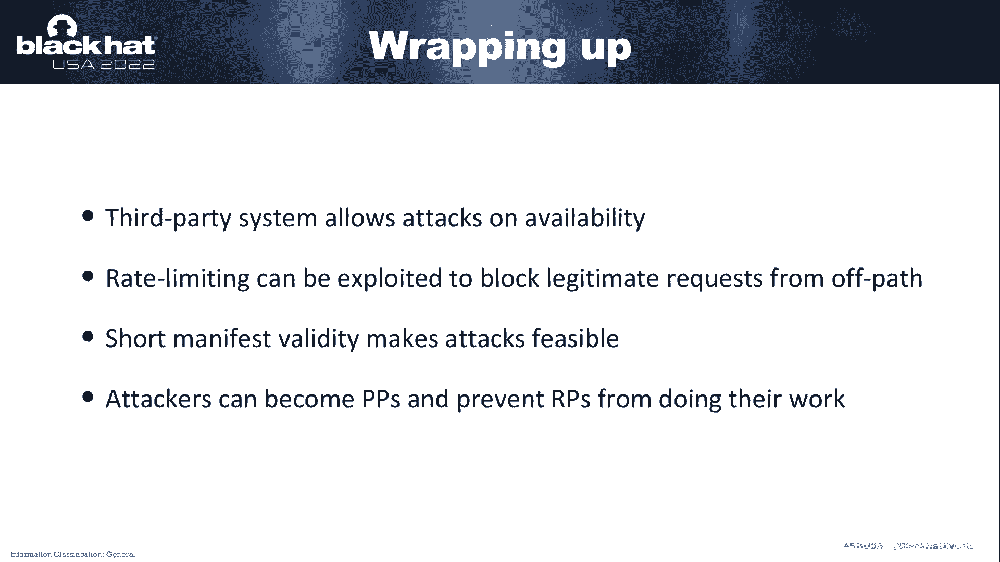

# 课程 P34：035 - RPKI 降级攻击 🛡️➡️🔓

在本课程中，我们将学习关于边界网关协议（BGP）安全性的一个重要议题——资源公钥基础设施（RPKI）的降级攻击。我们将从BGP的基础知识开始，逐步深入到RPKI的工作原理，然后重点分析一种针对RPKI可用性的攻击方法，并探讨其可行性与缓解措施。

## BGP与BGP安全性概述 🌐

上一节我们介绍了课程的整体目标，本节中我们来看看互联网路由的基础——边界网关协议（BGP）。BGP是互联网的路由系统，它将网络（称为自治系统，AS）连接在一起。

每个自治系统会向邻居宣告自己拥有的IP地址前缀。邻居再将这个宣告信息转发给其他网络。最终，所有网络都应该知道如何将流量发送到正确的目的地。

BGP的一个核心问题是其设计之初并未充分考虑安全性。从BGP的角度看，任何网络都可以宣告一个不属于自己的IP前缀，这可能导致流量被劫持。例如，历史上曾发生过针对亚马逊路由的劫持事件，攻击者通过劫持域名，将用户引导至钓鱼页面以窃取加密货币。

为了解决BGP的安全问题，引入了资源公钥基础设施（RPKI）。

## 资源公钥基础设施（RPKI）简介 🔐

上一节我们了解了BGP的安全隐患，本节中我们来认识其解决方案——RPKI。RPKI是一种为互联网路由资源（IP地址和AS号）提供认证的公钥基础设施。

其核心思想类似于TLS证书。在RPKI中，区域互联网注册中心（RIR）作为信任根，颁发一种称为“路由起源授权”（ROA）的证书。ROA证书将一个IP地址前缀映射到有权宣告该前缀的自治系统号（ASN）。公式可以简单表示为：

`ROA = (IP Prefix, ASN)`

这意味着，只有证书中指定的ASN才能合法地宣告该IP前缀。从概念上讲，如果你拥有一个地址块，你会从注册中心获得相应的证书。

然而，证书本身没有价值，除非被验证。在BGP中直接附加和验证所有证书会非常低效，因为这会显著增加路由宣告的大小和路由器的处理负担。

## RPKI的运作方式：第三方验证系统 ⚙️

上一节我们介绍了RPKI证书，本节中我们来看看它是如何被实际应用的。RPKI采用了一个第三方验证系统，主要包含两个组件：

1.  **发布点**：可以看作是一个存储所有RPKI证书（ROA）的服务器。
2.  **依赖方**：从发布点下载所有证书，进行验证，并生成一个经过验证的“有效路由列表”。然后，依赖方将这个列表推送给边界路由器。

路由器本身不需要执行复杂的密码学操作，它只需使用这个过滤列表来判断接收到的BGP宣告是否有效。当RPKI验证生效时，它可以成功阻止非法路由劫持。例如，一次针对Twitter前缀的劫持尝试就被RPKI验证成功阻止了。

## RPKI降级攻击的原理 🎯

上一节我们了解了RPKI如何保护路由安全，本节中我们来看看攻击者如何绕过这种保护。攻击RPKI主要有几种思路：

1.  **攻击完整性**：例如，创建恶意的ROA证书。但这需要破解密码学算法，非常困难。
2.  **欺骗证书颁发机构**：在RPKI中，CA（即RIR）拥有资源分配的第一手信息，很难欺骗。
3.  **攻击可用性**：由于RPKI是一个第三方系统，如果攻击使其停止工作，BGP路由器将失去安全决策的依据，从而回退到不安全的原始BGP状态。

我们的攻击聚焦于第三种方式：**降级攻击**。其核心计划是中断依赖方与发布点之间的通信。

RPKI设计考虑了渐进式部署。在实践中，如果一个BGP宣告没有对应的RPKI记录，依赖方会假设该网络尚未部署RPKI，从而接受该宣告。问题在于，依赖方无法区分“通信失败”和“该网络确实没有RPKI记录”。

攻击的关键在于RPKI使用了一种称为“清单文件”的机制来防止重放攻击，并实现证书的快速撤销。清单文件的有效期通常很短（例如1天）。而发布点软件通常会在清单文件有效期剩余约6小时时重新生成它。

因此，攻击者的目标变得明确：**只需成功阻断依赖方与目标发布点之间的通信约6小时，使得依赖方无法更新到新的清单文件。旧清单文件过期后，对应的ROA将失效，RPKI保护即被降级**。之后，攻击者便可以发起传统的BGP前缀劫持。

## 攻击实施：利用速率限制的低速率攻击 ⚡

上一节我们明确了攻击需要阻断通信6小时，本节中我们探讨一种隐蔽的实施方法。直接进行拒绝服务（DoS）攻击可能过于明显且容易被防御。

我们采用一种**低速率攻击**，具体利用了DNS服务器上常见的**速率限制**机制。速率限制旨在防止DoS攻击，例如，限制每个源IP地址在单位时间内的请求数量。

作为攻击者，我们可以通过伪造大量来自**受害者依赖方IP地址**的DNS查询（由于DNS over UDP易于伪造），去请求目标发布点。当这些伪造的请求达到发布点的速率限制阈值后，来自真正受害者（依赖方）的合法请求就会被丢弃。

我们测量了现实中的RPKI发布点，发现大约一半的公共发布点部署了此类速率限制，它们保护着约60%的IPv4 RPKI空间。这使得攻击具备了一定的可行性。

## 攻击可行性分析与增强 🧪

上一节我们介绍了低速率攻击，本节中我们通过模拟来分析其成功率，并探讨一种更强的攻击变种。

在低速率限制下，攻击成功率很高。但如果发布点的速率限制设置得较高，攻击者需要发送大量伪造请求，这会使攻击变得更像传统DoS，更容易被察觉。

为了增强攻击，攻击者可以运行自己的**恶意发布点**。因为RPKI允许网络运营自己的发布点，攻击者只需购买一个IP前缀并在RIR注册即可。这样，全球的依赖方都会主动连接攻击者的发布点以获取该前缀的RPKI信息。

利用这种直接连接，攻击者可以发起 **“树懒攻击”** 。在这种攻击中，恶意发布点以极慢的速度向连接它的依赖方发送响应数据，但同时保持连接不超时。这会导致依赖方长时间忙于处理这个无用的连接，从而无法及时更新其他关键发布点的有效数据，进一步提高了降级攻击的成功率。

## 总结与缓解措施 📝

在本课程中，我们一起学习了针对RPKI的降级攻击。我们展示了RPKI作为第三方系统的设计特性使其可用性可能受到攻击。攻击的核心是阻断依赖方与发布点的通信，利用短有效期的清单文件（约6小时窗口）使RPKI保护失效。

我们探讨了两种攻击方式：
*   利用发布点速率限制的离径低速率攻击。
*   通过运营恶意发布点发起的、效率更高的树懒攻击。

以下是针对此攻击的缓解建议：

**对于发布点运营者：**
*   避免设置过低的速率限制阈值。
*   增加清单文件的有效期（例如从1天增加到1周），并随机化其重新生成的时间点，增加攻击者的不确定性。
*   考虑采用更分布式的部署策略，避免将所有服务置于单一网络中。

**对于依赖方运营者：**
*   监控与发布点的连接故障，这可能暗示正在遭受攻击。
*   在依赖方软件实现中，限制处理单个（可能是恶意的）发布点连接的时间，避免被长期拖住。

通过理解这些攻击与防御，我们可以更好地完善RPKI系统，使其成为更健壮的互联网路由安全基石。

课程演示到此结束。