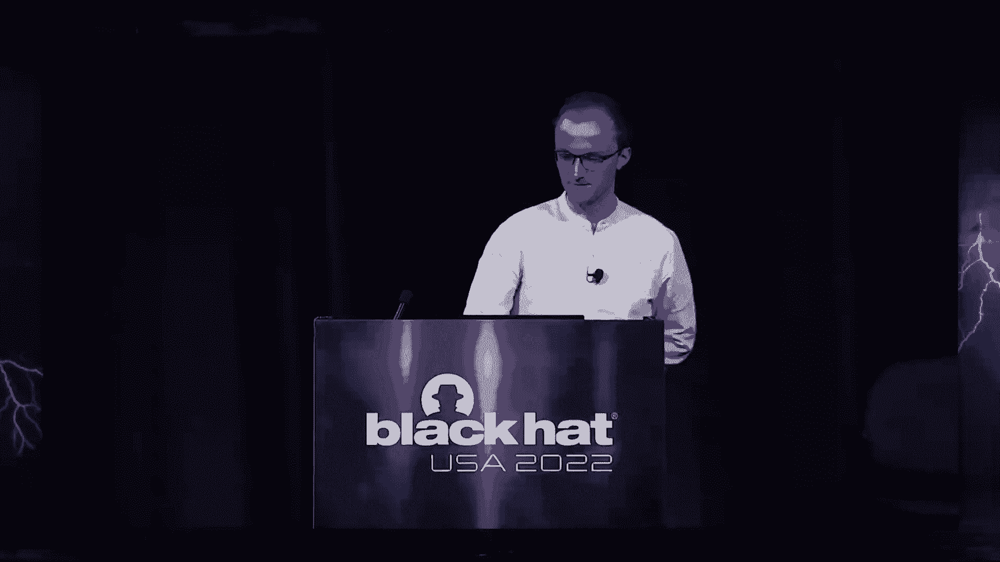
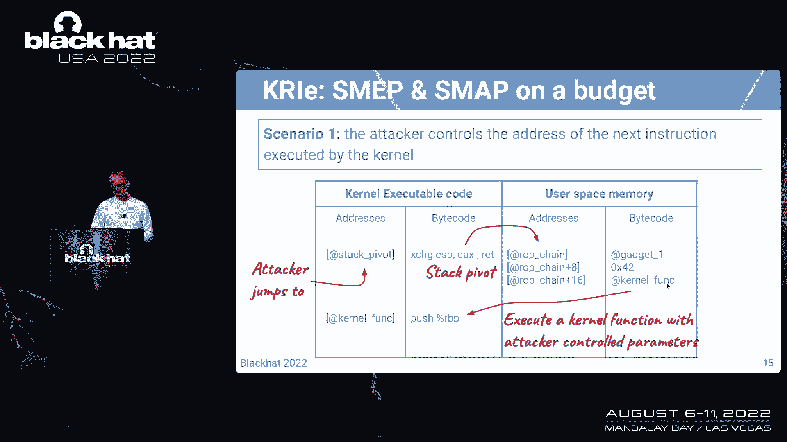
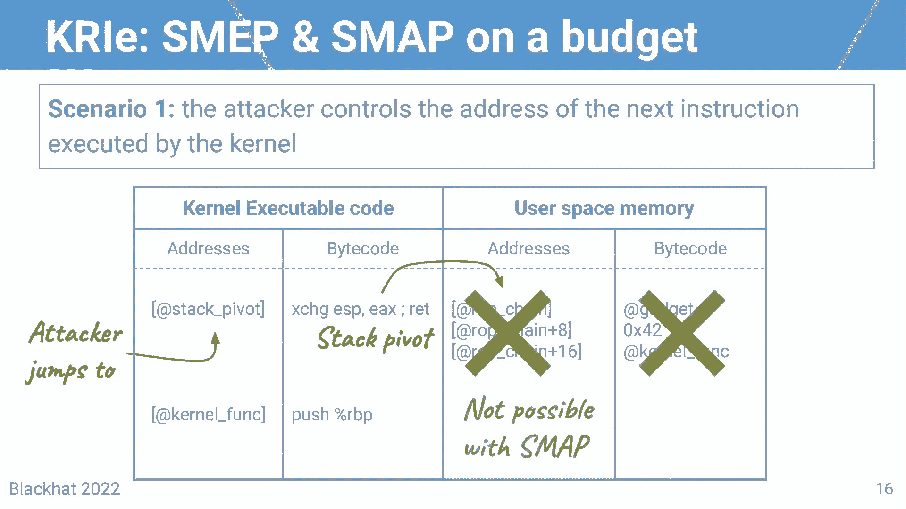
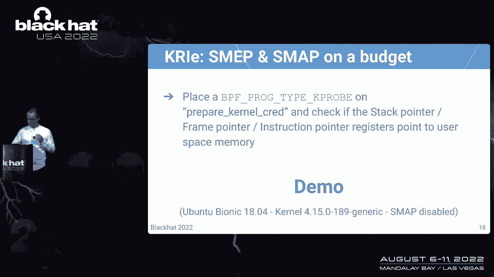
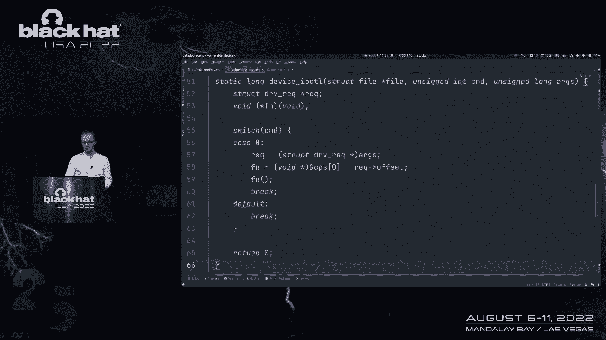
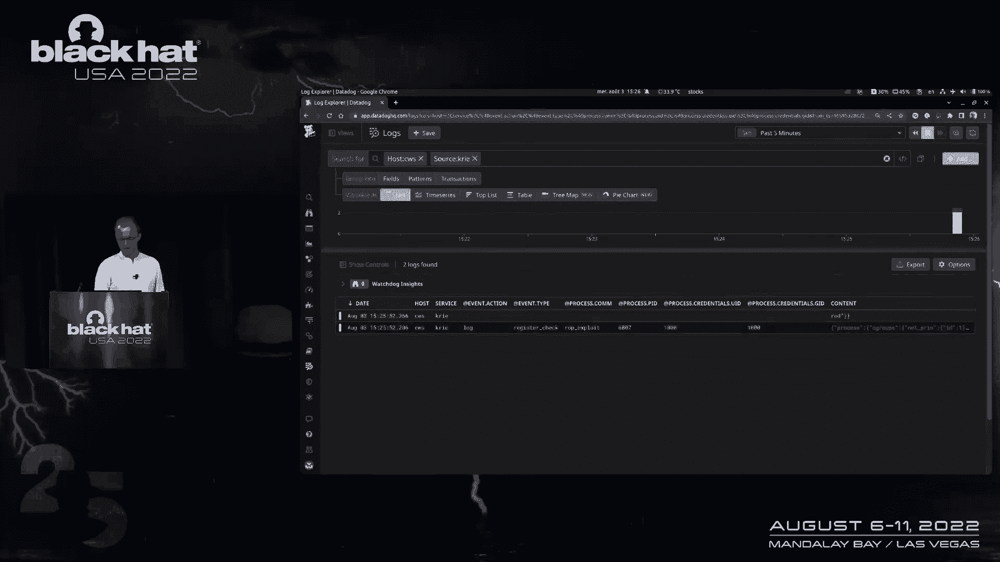
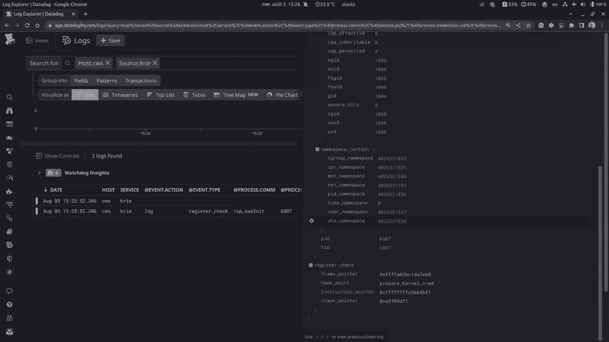
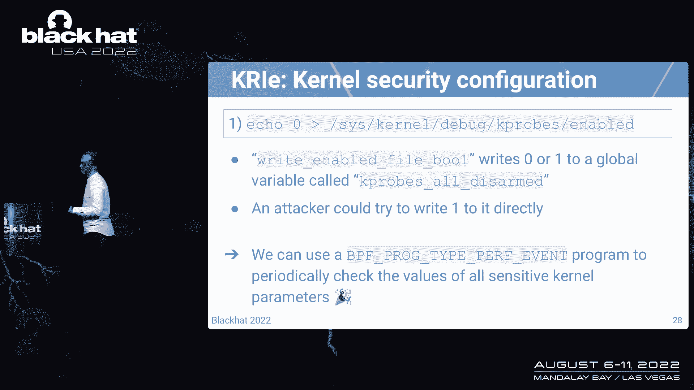
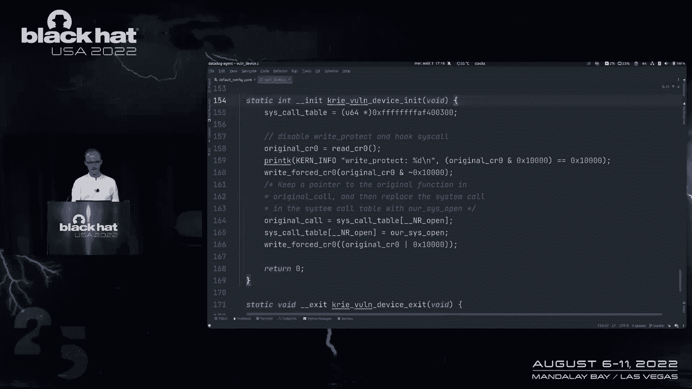
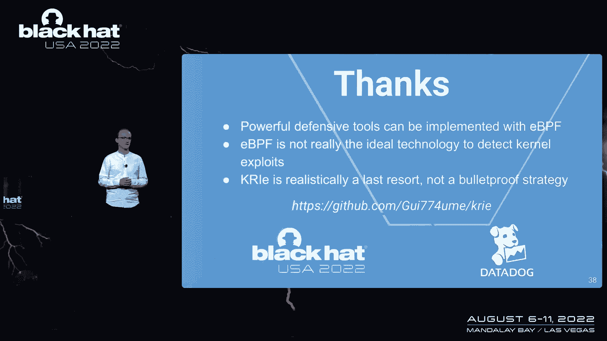

# 课程 P35：036 - 使用 eBPF 检测内核漏洞 🛡️




在本节课中，我们将学习如何利用 eBPF 技术来检测和防御 Linux 内核中的漏洞利用。我们将探讨 eBPF 的基本原理、其在此类检测中的优势与局限性，并详细介绍一个名为 “Cry” 的开源项目如何实现这些检测。

---

## 概述：内核漏洞与检测挑战

Linux 内核中会定期发现关键漏洞。在拥有成千上万用户且不断更新的软件生命周期中，这完全正常。但问题在于，安全更新和补丁的部署往往跟不上。在整个基础设施中，为内核打补丁可能需要数周甚至数月时间。在此期间，系统缺乏有效的保护措施。

因此，Cry 项目的目标就是监控和预测易受攻击的主机，直到它们能够实际部署升级。从技术上讲，有数百种方法可以利用 Linux 内核，但最终都可归结为三种核心能力：
1.  重定向内核内的执行流。
2.  利用逻辑错误，执行本不应被允许的操作。
3.  在成功利用内核后，尝试修改内核运行时以隐藏踪迹并进一步危害服务。

今天的目标是使用 eBPF 来检测和防御这些攻击。我们需要对 eBPF 能做什么有非常现实的期望。

---


## 什么是 eBPF？🤔

eBPF 是在 Linux 内核中运行沙箱程序的一种方式。你可以将其想象成一个编译成字节码的 C 程序，并使用 eBPF 加载到内核中。内核会执行一系列检查，以确保你的程序是安全的，不会导致内核崩溃或恐慌。第二步是将你的 eBPF 程序附加到钩子点。有多种程序类型和钩子点，你需要将程序附加到钩子点，程序才会被触发。


---

## 为什么选择 eBPF？✅

选择 eBPF 进行此类项目有几个原因：
1.  **广泛的内核支持**：只要不使用过于花哨的功能，eBPF 可以向后兼容到较旧的内核版本。
2.  **安全与稳定保证**：eBPF 提供了一些内核模块可能不具备的安全和稳定性保证。
3.  **丰富的功能集**：eBPF 提供了多种方式来理解内核空间正在发生什么。
4.  **访问与强制功能**：在足够新的内核上，eBPF 提供了一些正确的访问和强制功能。

然而，使用 eBPF 进行内核漏洞检测也存在挑战：
1.  **检测妥协后活动是场失败的战斗**：如果依赖于已受损的内核来触发安全事件，这些事件可能不可靠。
2.  **有多种方法可以禁用 eBPF 程序**：编写检测的同时，保护 eBPF 子系统本身并确保其正常工作同样重要。
3.  **性能影响**：eBPF 可能对内核性能产生重大影响。

尽管如此，让攻击者的生活变得更困难、使漏洞利用更难成功是有价值的。特别是在某些特定场景下，检测和阻止利用前活动是可能的。

---

## 介绍 Cry 项目 🚀

Cry 代表 “内核运行时与 BPF 的完整性”。这是一个开源项目，旨在利用 eBPF 检测内核漏洞。它至少与内核 5.15 及以上版本兼容。



接下来，我们将站在攻击者的角度，逐步分析一个典型的漏洞利用过程，并看看 Cry 如何帮助检测。



---

## 场景一：检测返回导向编程攻击



假设攻击者控制了内核执行的下一条指令地址。这是一个典型的返回导向编程攻击，通常用于提升权限。



攻击步骤如下：
1.  攻击者选择内核执行的下一条指令。
2.  攻击者可能跳转到堆栈枢轴，将内核线程的堆栈指向用户空间缓冲区，并在其中布置 ROP 链。
3.  最终，攻击者将执行一个带有受控参数的内核函数，例如 `commit_creds` 来获取 root 权限。


现代内核有 SMAP 和 SMEP 等功能来防止此类攻击。但假设这些功能被禁用，Cry 能做什么？



Cry 使用 **kprobe** 来检测此类攻击。kprobe 是一种可以将 eBPF 程序附加到导出内核符号的程序类型。这意味着，每当调用此内核符号时，附加的 eBPF 程序就会被触发。




Cry 可以在敏感函数（如 `commit_creds`）上放置 kprobe，然后检查堆栈指针、帧指针和指令指针是否指向用户空间内存。如果检测到，就会触发警报。

**示例检测逻辑（伪代码）**：
```c
SEC("kprobe/commit_creds")
int kprobe_commit_creds(struct pt_regs *ctx) {
    if (is_user_space_address(regs->sp) || is_user_space_address(regs->ip)) {
        bpf_printk("Detected potential ROP attack! SP or IP in user space.\n");
        // 触发事件日志或阻止操作
    }
    return 0;
}
```

然而，攻击者可能会尝试禁用 kprobe。主要方法有：
1.  通过 `/sys/kernel/debug/kprobes/enabled` 接口全局禁用 kprobe。
2.  通过 `ftrace_enabled` 接口禁用整个 Linux 跟踪子系统。
3.  杀死加载 eBPF 程序的用户空间进程。

为了应对这些绕过手段，Cry 采取了以下措施：
*   **多重 kprobe**：在函数内部多个位置附加 kprobe，防止攻击者跳过调用。
*   **定期检查**：使用 **perf 事件** 程序类型定期检查敏感内核参数（如 `kprobes_enabled`）的值。
*   **跟踪点**：对于较新内核（5.2+），使用 **tracepoint** 程序类型来检测 `ftrace_enabled` 等参数的更改，并可能先发制人地阻止调用。

---

## 场景二：检测内核运行时篡改

假设攻击者已成功获得 root 权限，接下来可能会尝试隐藏行踪。常见方法包括加载内核模块来挂钩系统调用表。

Cry 监控所有与内核运行时完整性相关的操作：
*   任何 eBPF 操作（加载/卸载程序，映射操作）。
*   任何内核模块的加载或卸载事件。
*   任何 kprobe 的注册或注销事件。
*   系统调用表挂钩。



Cry 使用定期检查的技巧来检测系统调用表是否被挂钩。它会检查 `sys_call_table` 中条目的地址，如果地址在内核文本段之外（例如，在模块代码内部），就会触发事件。


此外，Cry 还能检测到一个进程即将执行一个已被挂钩的系统调用。你可以配置 Cry 来记录或终止该进程。

**示例配置**：
```yaml
detections:
  syscall_hooking:
    enabled: true
    action: kill # 或 log, paranoid
```

---

## 场景三：控制流完整性

另一种检测 ROP 攻击的方法是控制流完整性。CFI 通过在运行时对调用点进行排序，来锁定内核中的执行流。然而，CFI 功能并不总是可用。




使用 eBPF，我们可以锁定控制点之间的跳转，检查钩子点和参数。基本思想是，攻击者不能首先到达一个低级功能，然后通过 Linux 安全模块等接口链接到凭据更新。

Cry 尝试捕获对敏感函数的恶意调用，以及专门针对访问权限的技术缺陷。例如，检测一个以读模式打开的文件，最终却被写入的情况。

这个过程非常繁琐，并非自动化。与常规 CFI 工具不同，eBPF 也受到钩子点限制，因为并非内核中的所有函数都被导出。

---


## 执行与性能 ⚙️

Cry 中的每个检测都可以配置为 **日志**、**阻止** 或 **偏执** 模式。
*   **日志**：仅记录事件。
*   **阻止**：尝试阻止恶意操作（需要合适的 eBPF 辅助函数）。
*   **偏执**：每当检测触发时，杀死所有相关进程（同样需要内核支持）。

关于性能，使用 Linux 内核编译进行测试表明，如果启用 Cry 的所有功能，可能会有高达 40% 的显著开销。然而，如果只禁用运行时检查系统调用是否被挂钩的检测，开销可以降至 1% 以下，这在可接受范围内，与其他 CFI 工具的开销相近。

---

## 总结 📝

本节课我们一起学习了以下内容：

1.  **eBPF 可用于编写强大的检测程序**：它提供了在内核空间进行安全、灵活监控的能力。
2.  **eBPF 可能并非检测漏洞的理想技术**：因为它依赖于内核的完整性，且存在多种绕过方法。
3.  **现实的目标是增加攻击难度**：虽然无法做到完全防护，但努力让攻击者的生活变得更困难、让漏洞利用更难成功是有价值的。
4.  **Cry 项目实践**：我们详细探讨了 Cry 如何利用 eBPF 来检测 ROP 攻击、内核运行时篡改，并尝试实现一定程度的控制流完整性。




Cry 是一个开源项目，旨在提供一套开箱即用的检测脚本套件，以增强内核运行时安全。请记住，安全是一个持续的过程，没有银弹，但每一层防御都至关重要。