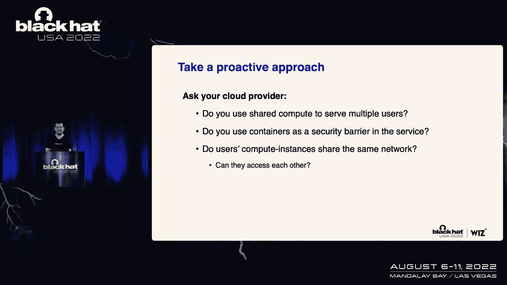

# 课程 P36：037 - 利用非传统PostgreSQL漏洞攻陷云服务商 🐘


在本课程中，我们将学习如何利用云服务商在实现托管PostgreSQL服务时引入的独特漏洞。我们将深入探讨这些漏洞的技术细节，并展示如何利用PostgreSQL中的某些修改，来获取对其他客户数据库的未授权访问和代码执行能力。课程结束后，您将对云服务的一般工作原理、开源项目如何被整合进托管服务，以及安全研究团队的工作方式有更深入的了解。

## 议程与动机 🎯

上一节我们概述了课程目标，本节中我们来看看本次分享的具体议程和最初的研究动机。

我们的故事始于去年的一次会议，当时我们展示了如何利用Azure Cosmos DB中的一系列漏洞，未授权访问其他客户的数据库实例。这促使我们思考：Cosmos DB是否只是一个孤立的案例？是否还有更多云服务可能受到类似攻击？

因此，我们开始寻找下一个目标。我们希望找到一个“数据库即服务”产品，它允许我们在共享的、由云服务商管理的多租户环境中执行代码。数据库通常是攻击者的终极目标，如果能在此类服务中发现漏洞，将产生巨大影响。

经过侦察，我们注意到许多云数据库服务都基于开源解决方案构建。PostgreSQL作为最流行的数据库引擎之一，被所有主流云提供商使用，并且它有一种通过SQL执行代码的简单方法：

```sql
CREATE TABLE cmd_exec(cmd_output text);
COPY cmd_exec FROM PROGRAM 'id';
SELECT * FROM cmd_exec;
```

这个查询会尝试执行 `id` 命令并显示结果。然而，当我们对市场上所有托管PostgreSQL服务运行此查询时，无一例外都失败了，原因是缺乏使用 `COPY FROM PROGRAM` 语句所需的超级用户权限。

这引出了核心问题：是否可能找到漏洞，将我们的权限提升至超级用户，从而获得代码执行能力，并深入探索服务的内部机制？接下来，我们将深入两个具体的漏洞案例。

## 案例一：Google Cloud SQL 的权限提升漏洞 🔑

在上一节我们提到了寻找权限提升方法，本节我们将深入第一个案例：Google Cloud SQL。

我们在Google Cloud SQL的PostgreSQL实例中创建了一个测试连接。首先，我们检查了自己的权限：我们以用户 `postgres` 身份运行，是 `cloudsqlsuperuser` 角色的成员。我们似乎没有特殊权限，也不是真正的超级用户。

但我们发现了一些异常：
1.  我们可以创建**事件触发器**，而这通常需要超级用户权限。
2.  我们可以**加载扩展**，这通常也需要超级用户权限。
3.  我们可以创建一个表，并将其**所有者更改为另一个用户**（甚至是 `cloudsqlsuperuser`），这并非默认行为。

这些迹象表明，Google修改了PostgreSQL引擎，创建了一个具有部分超级用户功能的“云超级用户”。这引出了我们的研究问题：能否利用这些独特的功能来打破安全模型并提升权限？

**所有者更改漏洞的利用**

吸引我们的是更改表所有者的能力。在标准PostgreSQL中，若要将表的所有者更改为另一个用户，你必须是该目标角色的成员。否则会报错：
`must be member of role “目标用户”`

但在Google的修改版本中，这成功了。为了理解此功能的影响，我们需要回顾PostgreSQL的两个基本概念：表和索引函数。

假设有一个 `employees` 表，并在某列上创建了一个**索引函数**。每当向表中插入或更新数据时（甚至由超级用户执行 `VACUUM` 或 `ANALYZE` 时），该索引函数都会被调用。

PostgreSQL为了安全，规定索引函数将以**表所有者**的权限执行，而非执行操作的用户。这就产生了利用思路：

如果我们能创建一个带有恶意索引函数的表，然后将表的所有者更改为高权限用户（如 `cloudsqlsuperuser`），那么当任何用户（包括超级用户）对该表执行操作时，恶意函数都将以高权限执行。

以下是攻击步骤：
1.  创建一个包含恶意索引函数的表。
2.  利用Google提供的特殊能力，将表的所有者更改为 `cloudsqlsuperuser`。
3.  等待或触发对表的操作（如 `VACUUM`），从而以高权限执行恶意代码。

我们创建了一个执行 `id` 命令的函数，并成功在Google Cloud SQL实例上获得了代码执行权限。通过进一步的侦察和漏洞利用，我们逃逸了容器，获得了底层宿主机的访问权限，并看到了管理平面组件以及同一内部网络中的其他PostgreSQL实例。

正在我们深入研究时，Google主动联系了我们，我们随后将完整报告提交给了他们。这次成功促使我们去寻找其他存在类似修改的云服务商。

## 案例二：Azure Database for PostgreSQL 的过度授权漏洞 💥

上一节我们分析了Google的漏洞，本节我们转向第二个案例：Azure Database for PostgreSQL Flexible Server。

我们首先尝试直接执行代码，但同样因权限不足而失败。检查权限后发现，我们以 `postgres` 用户运行，是 `azure_pg_admin` 角色成员。我们拥有一些特殊权限，例如创建事件触发器和检查点，这再次证实Azure也修改了PostgreSQL。

此外，我们发现我们拥有 `CREATEROLE` 权限。这是一个非常强大的权限，因为它允许创建新角色并为其授予几乎任何权限。根据文档，拥有 `CREATEROLE` 权限的角色几乎等同于超级用户。

在Azure修改后的PostgreSQL中，我们可以为新创建的角色授予一些强大的预设权限：
*   `pg_read_server_files`: 允许从文件系统读取文件。
*   `pg_write_server_files`: 允许向文件系统写入文件。
*   `pg_execute_server_program`: 允许执行服务器上的程序（即代码执行）。

**利用过程如下：**
1.  利用 `CREATEROLE` 权限创建一个新用户（例如 `james`）。
2.  为该用户授予上述所有三个强大权限。
3.  以新用户 `james` 身份连接数据库。
4.  此时，`james` 用户已拥有执行代码的权限，可以成功运行 `COPY FROM PROGRAM` 语句。

我们成功在Azure的托管实例上获得了代码执行能力。接下来的侦察显示，我们运行在一个专用的Docker容器中，该容器位于Azure的内部网络，并且我们发现了同一子网下大量其他的数据库实例。

## 利用漏洞访问其他客户数据库 🌐

在上一节我们获得了代码执行能力并进行了内部侦察，本节我们看看如何利用环境配置，实现跨客户数据库的未授权访问。

我们发现所在虚拟机属于两个内部子网。通过扫描，我们发现了网络中还存在其他212个数据库实例。我们希望证明能访问这些实例，而非我们自己的副本。

我们检查了PostgreSQL的身份验证配置文件 `pg_hba.conf` 和 `pg_ident.conf`。`pg_hba.conf` 中关于 `replication` 数据库的配置引起了我们的注意：

```
# 允许来自内部子网的复制连接，使用SSL客户端证书认证
hostssl replication all 10.0.0.0/8 cert
hostssl replication all 10.1.0.0/16 cert
```

`pg_ident.conf` 文件则通过正则表达式来映射证书中的主题名称到数据库用户：

```
# 映射规则
/cn=([^\.]+)\.database\.azure\.com$/ \1
/cn=replication-([^\.]+)\.database\.azure\.com$/ replication
```

关键点在于第一条规则 `/([^\.]+)\.database\.azure\.com$/`。它使用正则表达式捕获组，将证书主题名称（Common Name）中 `.database.azure.com` 之前的部分作为要映射的数据库用户名。例如，证书 `cn=app.victim.database.azure.com` 会映射到用户 `app`。

**这个正则表达式存在一个关键配置错误：它结尾的 `$` 锚定符前有一个点 `.`，这实际上允许主题名称在 `azure.com` 后包含任何其他内容。** 这意味着，虽然我们无法签发 `*.database.azure.com` 的证书，但我们可以签发一个类似 `cn=app.victim.database.azure.com.research.com` 的证书。这个证书的主题名称仍然匹配该正则表达式，并会将我们映射到 `app` 用户。

**攻击链如下：**
1.  我们为自己控制的域名（如 `research.com`）签发一个客户端证书，其主题名称构造为：`cn=replication-<目标实例唯一标识符>.database.azure.com.research.com`。
2.  使用 `pg_basebackup` 工具，指定此证书，连接到目标实例的 `replication` 伪数据库。
3.  由于证书主题名匹配正则表达式，我们被认证为 `replication` 用户。
4.  认证成功后，我们便能通过 `pg_basebackup` 工具**完整地复制（备份）整个目标PostgreSQL实例**，从而获取其所有数据。

我们向微软报告了此漏洞，他们在极短时间内（首次报告后4-8小时）修复了正则表达式，几天后进一步禁用了实例间的网络访问。我们因此获得了丰厚的漏洞赏金。

## 经验总结与行业思考 🤔

在上一节我们剖析了两个具体的漏洞利用链，本节我们来总结根本原因并探讨更广泛的行业问题。

我们发现的这些漏洞，根源在于 **PostgreSQL并非为多租户托管服务而设计**。它传统的“超级用户/普通用户”二元权限模型过于简单，无法满足云服务商既要赋予客户管理能力，又要保障底层基础设施安全的需求。

因此，云服务商都修改了PostgreSQL。他们通过打补丁、更改配置或维护自己的分支，引入了新的“云超级用户”角色和功能。问题在于，当引入这些新功能时，很容易引入新的漏洞。PostgreSQL是一个庞大而复杂的项目，修改者必须对其有深刻理解。

**漏洞的协同披露与修复**
在谷歌和微软修复问题后，我们意识到其他托管PostgreSQL供应商也可能受影响。我们采取了以下步骤：
1.  向谷歌和微软报告原始漏洞。
2.  主动联系了数十家潜在易受攻击的供应商，并与其中许多合作理解漏洞和缓解措施。
3.  与主要云服务商建立私人小组，共同探讨如何从根本上解决问题，而非各自增加更多的补丁和修改（这反而会增加攻击面）。

**根本解决方案的探讨**
谷歌曾倡议，将他们的安全加固代码贡献给上游的官方PostgreSQL项目，让社区共同维护这些用于云环境的“中间权限”功能。虽然目前社区接受度存疑，但这被认为是正确的方向。像CitusData（已被Microsoft收购）这样维护自己PostgreSQL分支的厂商，其做法也值得借鉴，因为安全修复可以集中进行。

**给云服务客户和行业的启示**
1.  **隔离是云安全的基石**：完美的隔离能有效阻止攻击者横向移动。我们展示的案例中，网络层面的隔离失效是导致跨客户访问的关键。
2.  **客户应主动询问隔离细节**：云服务商对其不同服务的隔离机制披露不足。作为客户，可以主动询问：
    *   您使用的特定服务是否采用**共享计算**（多个客户共享同一操作系统）？
    *   是否使用**容器**作为隔离边界？（需注意容器逃逸和内核漏洞风险）
    *   客户实例是否位于**共享网络**中并能够相互访问？
3.  **提问推动安全改进**：客户的提问能促使服务商重新评估自身架构的安全性。如果早有人询问Azure PostgreSQL Flexible Server的网络隔离情况，或许这个漏洞早已被修复。

## 课程总结 📚

在本课程中，我们一起学习了：
1.  如何通过侦察发现云托管PostgreSQL服务的非标准行为。
2.  深入分析了两个真实案例：利用Google Cloud SQL的**表所有者更改**功能和Azure PostgreSQL的**CREATEROLE过度授权**，实现权限提升和代码执行。
3.  展示了在获得内部访问权限后，如何利用配置错误（**有问题的证书正则表达式**）实现跨客户数据库的未授权访问。
4.  探讨了此类漏洞的**根本原因**在于云服务商对开源数据库的修改，并讨论了协同披露、根本解决方案以及云安全中**隔离**的重要性。

希望本课程能帮助您更好地理解云服务内部的安全挑战，并激励您以更审慎的态度评估所使用的云服务。




