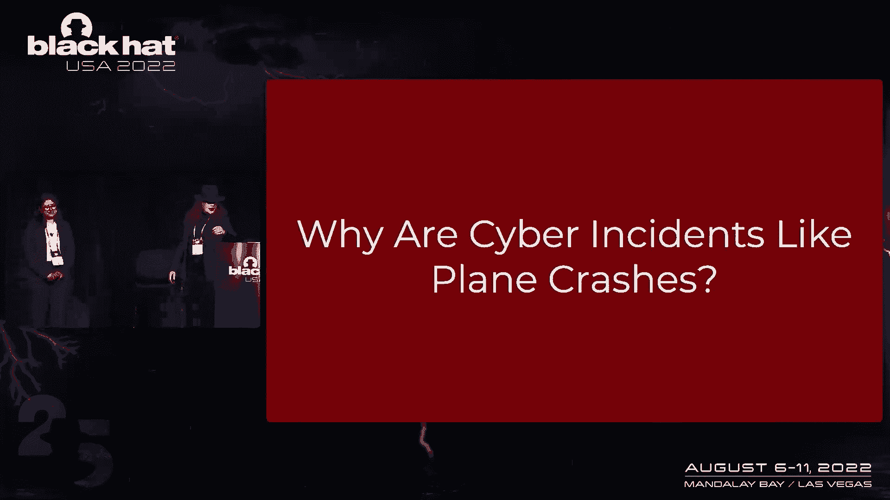
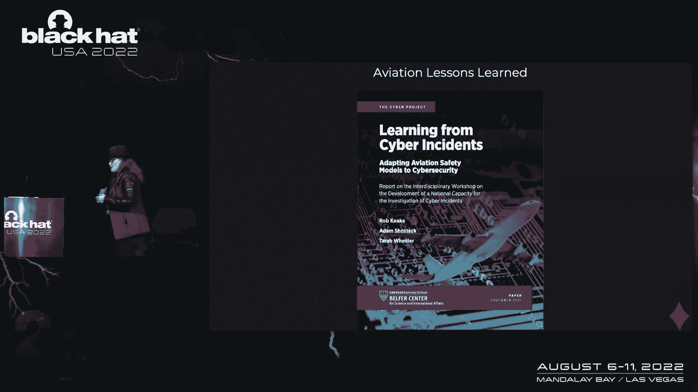
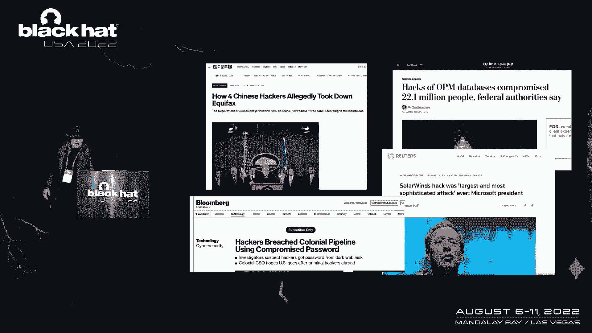
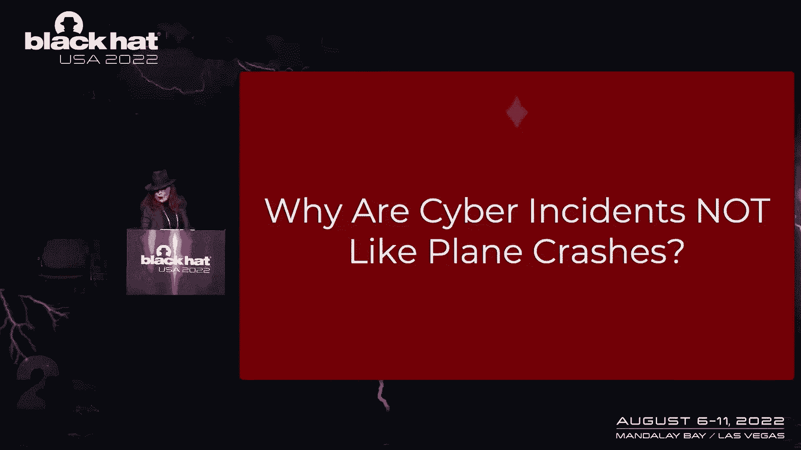
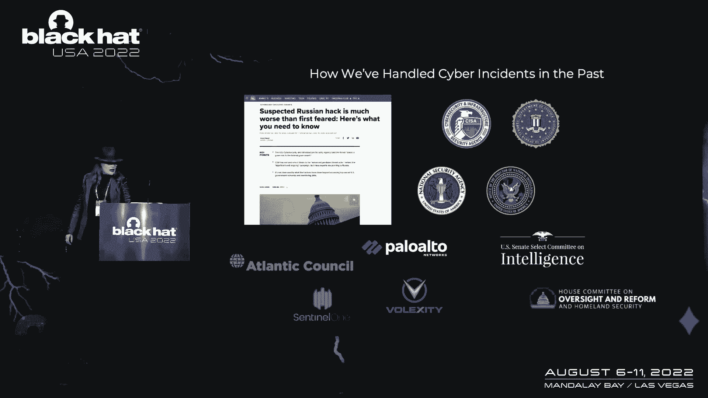
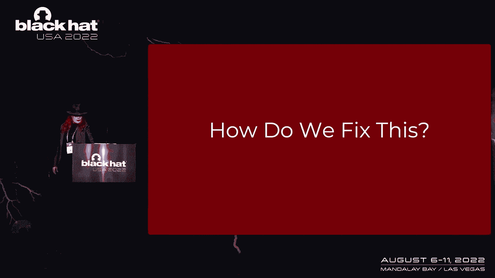
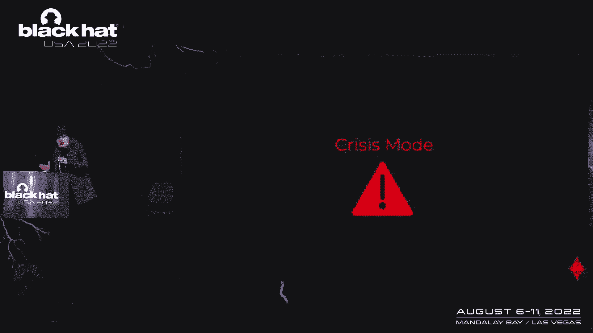
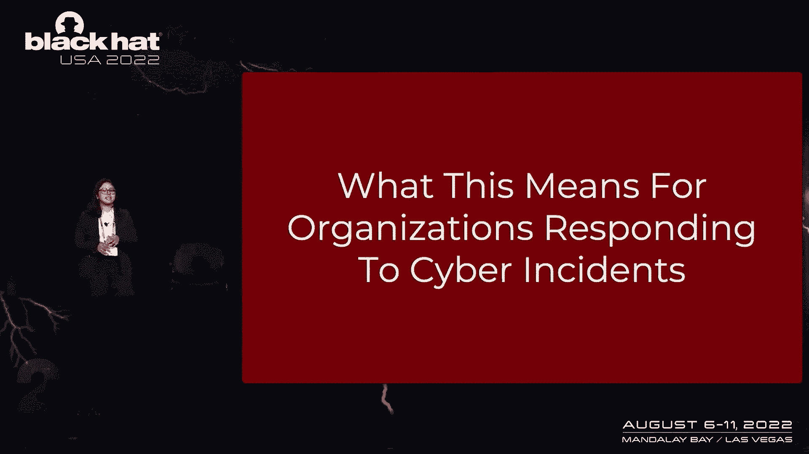
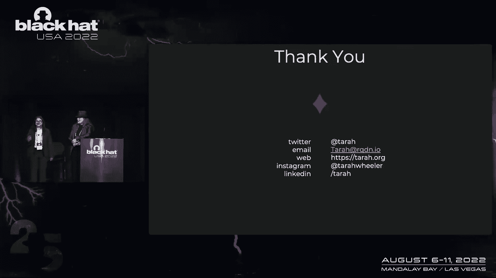

# 课程 P37：039 - 网络安全事件调查：从航空业学习经验 🛡️✈️

在本节课中，我们将学习如何借鉴航空业成熟的事故调查方法，来改进网络安全事件的调查与学习过程。我们将探讨为何网络事件调查缺乏共享的行业历史，并介绍一个为政府机构设计的、用于进行系统性网络事件调查的实用“剧本”。

---

## 演讲者介绍

在深入了解主题之前，首先需要说明，今天分享的所有内容版权归属于我和塔拉。

我是维多利亚，毕业于巴尔的摩的约翰霍普金斯大学，主修东亚研究，辅修流行病学、经济学与国际研究以及历史。毕业后，我曾计划进入外交政策领域，并花了一年时间专注于中国研究。之后，我在哈佛肯尼迪学院攻读公共政策硕士学位。第一年，我选修了布鲁斯·施奈尔的课程。第二年，我再次选修他的课程，他通过演示蓝牙设备的危险性进行教学，这个故事我稍后会详细讲述。那个夏天，我需要一份实习，于是申请了贝尔弗中心的助教奖学金，并在那里遇到了项目负责人罗布·阿奇以及可爱的塔拉。

我热爱 Dunkin‘ 甜甜圈，但在此不多赘述。我的爱好包括编织和旅行。需要说明的是，这不仅是我在 Black Hat 的首次演讲，也是我人生中的第一次公开演讲。

大家好，我是塔拉·惠勒。我是红皇后动力公司的首席执行官，这是一家专注于合规编排和安全教育的公司。我曾作为富布赖特学者，为美国和英国在网络安全领域工作，当然也包括在哈佛贝尔弗中心，正是在那里我遇到了维多利亚，并开始了“航空经验教训项目”的合作。我热爱风险管理，既是一名扑克玩家也是一名飞行员，因此如何管理组织风险的概念深深吸引了我。

---

## 核心问题：为何网络事件调查不同于空难调查？

那么，今天将我们聚集在一起的核心问题是什么？问题是：**为什么网络事件调查不能像飞机失事调查那样有效？**

接下来，我们将介绍这个项目的背景，并由维多利亚详细解释我们今天要探讨的内容。

在过去的三四十年里，我们一直用美国国家运输安全委员会（NTSB）作为类比。这是一个很好的方式，来描述调查应如何产生事件的共同历史和共同叙述。我们在网络安全领域面临的挑战之一是，我们不分享历史。我们没有全行业范围内对事件发生过程的描述，并将其用于未来的经验教训和预防。

当罗布和亚当创建这个项目时，他们采访了上百位不同领域的专家，学习航空业的经验以及 NTSB 的调查流程，并开始思考这在网络安全中会是什么样子。去年11月，我们发布了《从网络事件中学习》的报告。这份报告超过一百页，我们绝对鼓励大家阅读，以了解更多关于如何在网络安全中建立共享叙事、以及如何从一个做得非常出色的行业吸取教训的想法。

当飞机失事时，我们很快就能明白原因。随后，新规定出台，所有飞行员都必须遵守。然而在网络安全领域，我们不断面临持续的威胁和攻击，人们尚未真正弄清楚如何重复和改进预防过程。因为我们意识到，试图保密、将信息紧握在手的挑战，意味着我们永远在进行一场艰苦的战斗，难以向业界和社区传播关于事件如何发生以及未来如何预防的信息。

这不仅仅是某个承包商未能更新服务器（如 Equifax 事件），或有人没有推送补丁（如 WannaCry 事件）那么简单。因此，我们想问自己：**为什么网络事件调查不能像空难调查那样编写报告？** 我们不维护共同的历史。同时，航空业调查和了解事件、并采取措施防止未来事件发生的方式，也非常值得我们学习。

---

## 深入分析：NTSB 如何工作及其启示

我喜欢维多利亚的原因之一是她阅读了 NTSB 关于七起最大空难（包括 737 MAX 事故）的每一份调查报告。那么，NTSB 是如何创建这类报告的？我们可以从中学到什么？

以波音 737 MAX 事件为例。2018年，狮航航班首次坠入爪哇海。数据记录显示，飞行中飞机左右两侧的迎角传感器报告了不同的数值，这触发了 MCAS 系统，迫使机头向下。飞行员反复对抗系统但最终失败，导致坠机。同样的事情也发生在埃塞俄比亚的航班上。

美国联邦航空局（FAA）宣布停飞该机型。NTSB 的最终调查报告至关重要，它不仅涉及事件细节，还指出了波音公司在解释 MCAS 系统与其他驾驶舱警报交互方面的失败，以及 FAA 在安全程序监督上的疏忽。

这与我们处理网络事件的方式形成了鲜明对比。在网络安全领域，我们产生了大量报告，来自政府、私营企业和智库。例如，**`SentinelOne`** 等机构提供了宝贵信息，但缺乏关于事件原因和构成的总体协调与共识。

因此，我们需要让更多的委员会参与进来，共同认识到存在进行调查的方法。我们指的不是事件应急响应（那时大家都在忙着拔网线、恢复网络），而是在每个人都喘口气之后，有机会问：“发生了什么？我们如何防止未来再次发生？” 这是关于调查事件并理解原因的工作。

---

## 解决方案：网络事件调查“剧本”

维多利亚、亚当和我在过去六个月里所做的工作，是**创建一个“剧本”**，供城市、州和国家政府进行事件调查，设立事件调查委员会，并进行自己的调查。

你可能会问：“我们不是已经有 CISA 的网络安全审查委员会（CSRB）了吗？” 答案是，在这份报告生成的同时，CSRB 正在创建。我们提出的建议与 CSRB 的设计功能有所不同。我们的“剧本”旨在为城市、州、县、部落政府提供一条进行事件调查的路径，从而开始在行业中创造大量信息。

这个“剧本”仿照 NTSB 的《航空调查手册》制作。调查分为三个阶段：
1.  **调查启动**：事件发生时，委员会召开会议，确定首席调查员，设定调查目标，并可能邀请其他方派出技术小组成员参与。
2.  **技术调查**：由专业的技术团队进行战术性分析，他们处理日常事件响应，分析报告和硬件。
3.  **委员会审查**：委员会成员召开会议，审查技术团队的报告，决定向社区提出哪些建议，以减少未来类似事件的伤害。

那么，委员会成员由哪些人构成？我们将其分为四类：
*   **个人**：在该领域备受尊敬、拥有独立信誉的网络安全专家。
*   **公司**：来自网络安全行业的企业代表，但对调查结果有直接利益关系的公司（如事件中涉及其软件的公司）应回避。
*   **政府机构**：在网络安全社区中发挥重要作用的常设机构，他们提供重要视角，但不应该主导整个委员会。
*   **学术组织**：来自大学或研究机构的人员，能提供技术分析和学术严谨性。

技术团队则由有能力进行深度数字取证和事件分析的专业人士组成。他们需要能够将复杂的技术发现，翻译成非技术背景的委员会成员能够理解的语言。**类比**是他们可能使用的最有力的工具之一。

在撰写这个“剧本”时，我们意识到一个基本事实：作为一个行业和社区，我们知道人们往往在不得不做的时候才会行动。第一个重大网络事件调查委员会很可能是在危机中建立的。因此，我们在“剧本”中加入了 **“危机模式”**。

“危机模式”提供了快速行动指南。例如，在不知道找谁加入委员会时，一个快速的捷径是确保找到四类人：政府内部人员（可作为“个人”）、当地 ISACA 或 (ISC)² 分会推荐的专业人士、本地信誉良好的大学计算机科学系主任推荐的人员，以及来自工业界的技术公司代表。这为从未做过此事的人提供了可操作的起点。

---

## 实战推演：“剧本”应用示例

那么，这在行动中是什么样子的？

假设一家大型零售店最近成为销售点（POS）攻击的受害者。事件发生后，联系了警方，最终上报至州长。州长指派首席信息官（CIO）负责处理。CIO 启动“危机模式”，参照“剧本”。

第一步是组建委员会。他们找到一位网络安全专家作为“个人”，从一所大学找到一位学者，并邀请相关政府机构代表。然后，他们通过人脉网络，找到受人尊敬的技术专家组成技术团队。

随后，调查进入审查过程。技术团队进行分析并提交调查报告。委员会成员审查报告，聚集讨论，提出建议，并对最终报告中的调查结果进行投票。

这里需要注意的关键点是，技术团队中必须有人能够担任“非技术翻译”的角色。他们需要向州和地方官员解释，为什么屏幕变红或某个系统未打补丁，其背后的根本原因是什么。如果回答只是“某人犯了错”，而没有深入分析流程、预算、合规程序或专业知识缺乏等系统性原因，那么真正的教训就会被埋没。

因此，建议和调查结果需要用清晰易懂的语言（如英语或当地语言）撰写，确保人们理解发生了什么、为什么发生，以及最重要的是如何预防。最终报告应**公开可读**。我们理想的场景是将其托管在公共图书馆的网站上（例如波士顿公共图书馆），以确保广泛、中立和持久的访问，而不是隐藏在某个可能消失的公司网站或付费墙后面。

最终报告必须聚焦于一个核心理念：**事件的发生通常有多个原因，也有多个环节可以修复未来的流程故障**。我们需要避免将每次事件都归结为“实习生犯错”或“承包商没打补丁”这样的单一根本原因。相反，应该追问“五个为什么”，探究背后的规则、补偿控制、预算流程、合规程序以及专业知识或培训的缺失。

---

## 展望未来：构建共享的行业历史

从这个过程中，我们希望产生我们所期望的最终报告。那么，这对未来应对网络事件的组织意味着什么？

我们希望看到各州、地方政府采纳这一策略，在全国各地建立自己的网络事件调查委员会。这样，我们就能针对大大小小的事件，开发**共享的经验教训叙述**。我们接受这些教训，在此基础上改进，让它们在整个社区传播，从而减轻事件造成的损害并防止未来发生。

虽然第一个委员会很可能在“危机模式”下仓促成立，但我们更希望看到的是，当我们回顾历史性事件（例如 OPM 漏洞）时，能对发生了什么以及如何防止有共同的理解。目前，我们甚至很难让这个房间里的每个人都同意一些最著名网络攻击的基本事实。我们行业的许多共同历史存在于可能随时消失的营销材料或付费内容后面。这就是图书馆和公开存档如此重要的原因。

---

## 总结与行动号召

我们目前的工作成果不仅存在于哈佛贝尔弗中心的网站上，我们也非常乐意在接下来的时间里，在 **GitHub** 上分享这个“剧本”的 Markdown 版本。我们邀请所有人使用、提交 Pull Request 和改进建议。维多利亚将负责维护。我们希望通过社区协作，了解什么在实践中行之有效。

这一切都不会完美。总会有新的事件发生。截至去年，仍有26%的组织容易受到 WannaCry 攻击的影响。攻击正变得更加复杂，例如利用 AI 进行大规模自动化的鱼叉式网络钓鱼。如果我们重复过去的行为，就会得到过去的结果。

任何人都应该为重大网络事件调查做好准备。你的社区迟早会需要它。我们需要创造并公开分享知识体系，使其存在于图书馆网站上，而不用担心它消失在付费墙后面。因为挑战不会变得简单，但至少我们可以开始预测未来，并为此做好准备。

本节课中，我们一起学习了如何借鉴航空业调查的严谨方法，为网络安全事件构建系统性的调查与学习框架。我们介绍了调查“剧本”的结构、委员会组成、危机模式的应用，以及创建公开、共享的行业历史的重要性。通过采纳这些实践，我们有望打破重复犯错的循环，更有效地从事件中学习，从而提升整个网络生态系统的韧性。

非常感谢。我们很高兴能在这里分享，并期待在 GitHub 上看到大家的反馈和贡献。