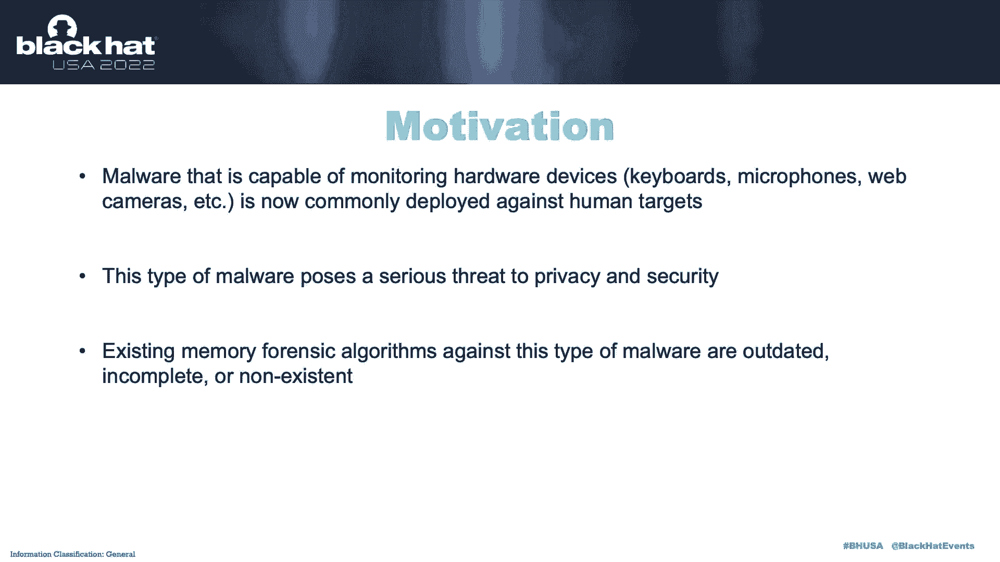
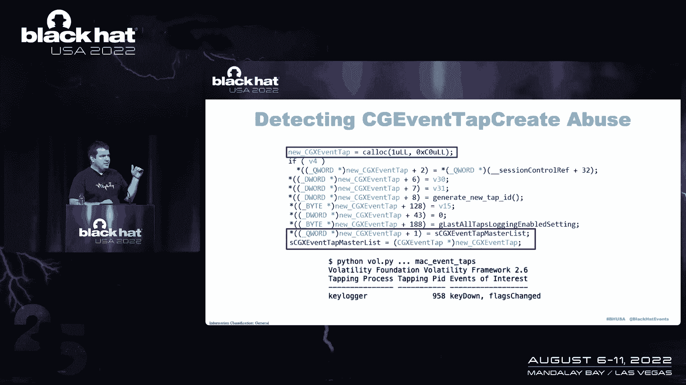
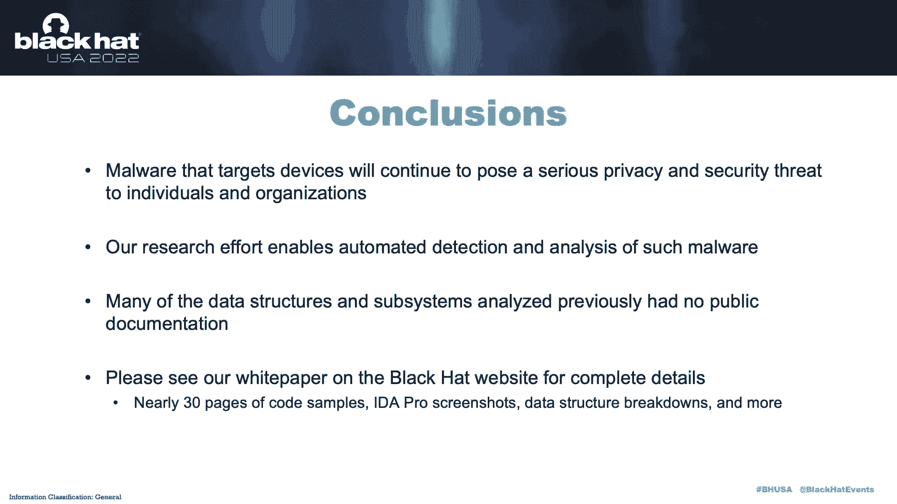

# 课程 P38-040：利用新型内存取证技术对抗设备监控恶意软件 🛡️💻



在本课程中，我们将学习如何利用新型内存取证技术，自动检测和分析那些滥用硬件设备进行监控的恶意软件。我们将深入探讨Windows、Linux和macOS系统上恶意软件常用的关键技术，并了解如何通过内存分析工具（如Volatility）来发现它们。

## 概述

设备监控恶意软件在定向攻击中极为普遍，它们能够窃取键盘输入、鼠标活动、麦克风录音和摄像头画面等高度敏感的信息。传统的磁盘取证和网络流量分析往往难以发现此类威胁，因为其核心组件仅存在于内存中，且通信通常被加密。因此，内存取证技术变得至关重要。本课程将介绍我们为应对此类威胁而开发的一系列新型内存取证算法和Volatility插件。

## Windows 系统上的监控技术


上一节我们概述了设备监控恶意软件的危害。本节中，我们来看看Windows系统上恶意软件最常滥用的两种API及其变体。

### SetWindowsHookEx API 及其变体


SetWindowsHookEx是Windows上长期被滥用的API，它允许恶意软件通过向系统注册一个回调函数（通常位于DLL中），来监控全局的键盘、鼠标等事件。操作系统会自动将该DLL注入到目标进程中，为恶意软件完成所有繁重的工作。

为了检测此类钩子，我们需要检查Windows GUI子系统内部的数据结构，特别是“原子表”和“钩子链表”。我们更新了Volatility的`messagehooks`插件，使其能正确支持Windows 10并恢复关键信息。

以下是SetWindowsHookEx的几种变体及其检测方法：

1.  **全局钩子（注入DLL）**：这是最常见的形式。恶意软件提供一个DLL路径，系统将其注入到所有相关进程中。更新后的`messagehooks`插件能够解析新版Windows 10的原子表结构，准确恢复DLL路径和钩子函数偏移量。
    *   **代码示例（恶意软件调用）**：
        ```c
        HHOOK hHook = SetWindowsHookEx(WH_KEYBOARD_LL, MyKeyboardProc, hInstDLL, 0);
        ```

2.  **全局低级键盘钩子（无DLL注入）**：这是一个鲜为人知的变体。恶意软件在调用`SetWindowsHookEx`时，将`hMod`参数设置为自身进程的模块句柄（而非DLL），并设置`WH_KEYBOARD_LL`钩子。此时，键盘事件会被直接发送到恶意软件进程，而**无需向其他进程注入任何代码**。我们通过解析每个线程数据结构中的特定标志位来检测这种“隐形”钩子。
    *   **关键概念**：此变体使得被监控的进程内存中**不存在任何恶意代码**，所有记录行为发生在独立的恶意软件进程中。

3.  **线程特定钩子**：恶意软件可以指定仅监控某个特定线程（如某个浏览器标签页的线程）。这通过`SetWindowsHookEx`的`dwThreadId`参数实现。我们通过逆向工程，发现了存储此类钩子信息的“每线程原子表”，并更新插件以支持检测。

### RegisterRawInputDevices API

为了规避安全软件对`SetWindowsHookEx`的监控，一些恶意软件转而使用`RegisterRawInputDevices` API。该API允许应用程序注册接收原始输入数据（如键盘、鼠标）。


以下是其工作原理和检测方法：


恶意软件会创建一个隐藏窗口，并在其窗口过程中调用`RegisterRawInputDevices`来请求接收原始键盘输入。之后，任何发送到该窗口的输入消息都会被恶意软件截获。

*   **代码示例（恶意软件片段）**：
    ```c
    // 在窗口创建消息中注册
    case WM_CREATE:
        RegisterRawInputDevices(&rid, 1, sizeof(rid));
        break;
    // 在窗口过程中处理输入消息
    case WM_INPUT:
        // ... 解析并窃取按键数据 ...
        break;
    ```

我们为此开发了一个全新的Volatility插件——`rawinputmonitor`。该插件扫描内存中的相关数据结构，能够列出所有使用了`RegisterRawInputDevices` API的进程、其关联的隐藏窗口名以及钩子函数地址。

## Linux 系统上的监控技术

上一节我们探讨了Windows上的监控技术。本节中，我们来看看Linux系统上恶意软件滥用系统设施的几种方式。

### 滥用调试功能：ptrace 与 strace

Linux的`ptrace`系统调用是调试器的基石，但它也被恶意软件用来监视甚至控制其他进程。`strace`工具基于`ptrace`，可以跟踪进程的所有系统调用，从而间接监控所有硬件交互。

以下是两种滥用场景的检测：

1.  **直接进程调试**：恶意软件（如GDB）直接附加到目标进程（如`cat`）进行调试。我们编写了`linux_ptrace`插件来检测这种关系。
    *   **插件输出示例**：
        ```
        Process PID 7878 (cat) is being traced by PID 7877 (gdb)
        ```

2.  **系统调用跟踪（如窃取SSH密码）**：攻击者以root身份使用`strace`附加到正在运行的`sshd`守护进程。当用户登录时，`sshd`子进程会通过`read`系统调用读取密码，该密码会被`strace`直接捕获并显示。我们更新了插件，使其能报告`strace`监控的所有进程ID列表，并特别关注带有“`C`”标志（表示从创建起就被跟踪）的进程，这对检测持续监控的恶意软件非常关键。
    *   **危害场景**：通过跳板机进行横向移动时，每一跳的登录密码都可能被此类驻留在第一台主机上的恶意软件捕获。

### 滥用输入子系统：/dev/input

Linux的`/dev/input/event*`设备文件提供了对输入设备（如键盘）的直接访问。合法程序（如登录管理器`gdm`）会使用它，但恶意软件同样可以。


我们编写了`linux_input`插件来检测哪些进程打开了这些输入设备文件。在分析时，需要过滤掉已知的合法进程（如`gdm`），剩下的可疑进程就极有可能是密钥记录器。

### 滥用终端控制：TIOCSTI

`TIOCSTI`是一个危险的`ioctl`请求，它允许一个进程向**另一个用户终端**的输入流中注入字符。攻击者可以借此实现“无痕”密钥记录：读取用户输入的字符后，立即使用`TIOCSTI`将该字符重新“键入”回终端，用户几乎无法察觉。

*   **代码示例（Python概念验证）**：
    ```python
    import fcntl, termios
    # 打开其他用户的终端设备文件
    tty_fd = open('/dev/pts/1', 'rb')
    # 设置为原始模式并读取字符
    key = tty_fd.read(1)
    # 将字符重新注入回终端
    fcntl.ioctl(tty_fd, termios.TIOCSTI, key)
    ```

我们开发了`linux_tty_handlers`插件来检测这种行为。它检查进程是否打开了其他用户会话的终端设备。在我们的测试中，该检测方法误报率极低，因为几乎没有合法理由需要监控他人的终端输入。

## macOS 系统上的监控技术

上一节我们介绍了Linux上的多种监控手段。本节中，我们来看看macOS系统上特有的`Event Tap`机制。

### CGEventTapCreate：事件窃听

macOS的`CGEventTapCreate` API允许程序在事件（如按键、鼠标点击）到达目标应用之前或之后进行拦截。这为合法的辅助功能提供了支持，但也容易被恶意软件利用。

逆向分析macOS的`Event Tap`机制极具挑战性，因为其架构遵循微内核理念，相关功能分散在用户空间的`SkyLight`框架和`WindowServer`进程，以及内核之中。


经过深入逆向，我们发现了关键的数据结构链。恶意软件进程调用`CGEventTapCreate`后，最终会在`WindowServer`进程的全局链表`gCGXEventTapMainList`中创建一个条目。

我们据此编写了`mac_event_taps`插件。该插件直接扫描`WindowServer`进程的内存，定位上述全局链表，并打印出所有已注册的事件窃听器，包括其所属进程PID和监控的事件类型。在一个干净的系统中，此列表应为空，任何输出都值得深入调查。

## 总结



在本课程中，我们一起学习了针对Windows、Linux和macOS三大操作系统的设备监控恶意软件所采用的先进技术。我们详细探讨了：

*   **Windows**：`SetWindowsHookEx` API的多种变体（包括无注入的全局钩子）和`RegisterRawInputDevices` API的滥用与检测。
*   **Linux**：滥用`ptrace`/`strace`进行调试监控、直接读取`/dev/input`设备文件、以及利用危险的`TIOCSTI` `ioctl`进行终端输入注入与窃取。
*   **macOS**：利用`CGEventTapCreate` API实现的事件窃听机制及其在内存中的检测方法。




通过开发相应的Volatility插件，我们实现了对这些隐蔽威胁的自动化内存取证分析。这些技术能帮助安全人员在事件响应中，即使面对仅存在于内存中的恶意软件，也能有效地发现并分析其设备监控行为，从而保护个人与组织的敏感信息。