# 课程 P39：041 - 逃离沙箱的Windows容器（COW）🐮

在本课程中，我们将学习Windows容器的工作原理、如何在其内部获取系统权限，并探讨攻击者如何利用容器漏洞影响甚至控制宿主机。我们将通过分析具体的系统调用和漏洞，理解容器隔离机制的局限性。

---

## Windows容器背景 🏗️

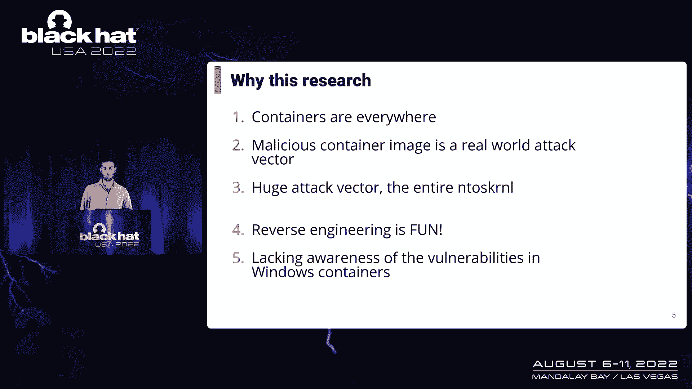

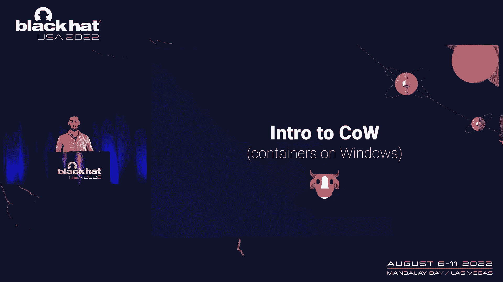

上一节我们介绍了课程概述，本节中我们来看看Windows容器的基本概念。

容器类似于虚拟机。每个容器都从一个**容器镜像**创建，该镜像包含了应用程序运行所需的所有依赖项，例如文件系统或注册表。容器镜像的配置包含了所有依赖项，因此它像虚拟机一样易于管理和部署。

在Windows中，部署容器有两种方式，它们定义了进程的隔离程度：
*   **进程隔离容器**：类似于Linux容器，整个容器在用户模式下运行，但直接与内核交互。它们通过多个层面与宿主机隔离。
*   **Hyper-V隔离容器**：与虚拟机非常相似，拥有自己的内核，通过Hyper-V与宿主机交互，因此更安全，但计算开销更大。

本课程将重点讨论**进程隔离容器**。

与Linux容器不同，Windows容器内部运行着许多与系统本身相关的进程。这是因为Windows内核的架构：其部分功能在用户模式下实现，部分在内核中实现。因此，Windows容器包含诸如 `svchost.exe` 这样的系统服务。

---

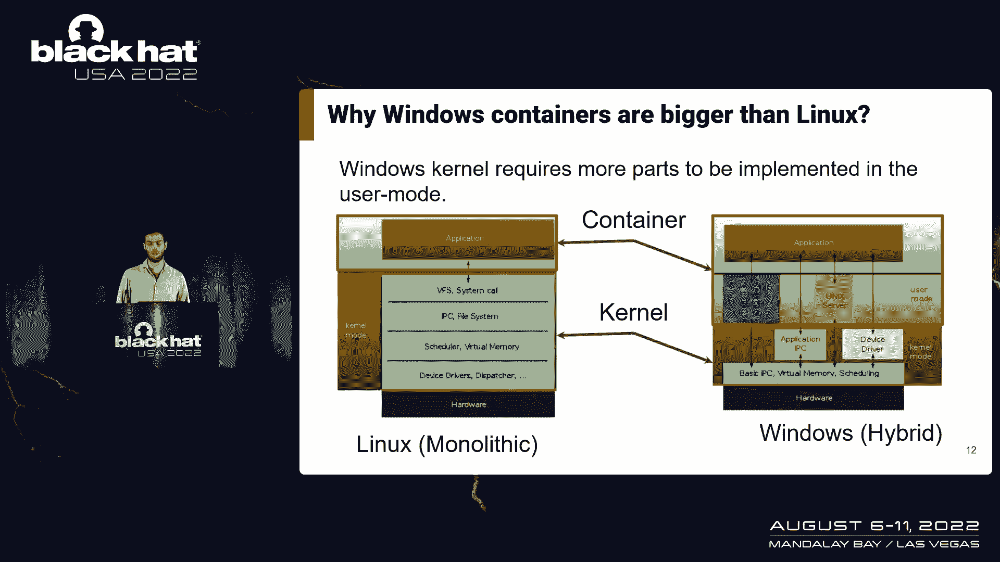

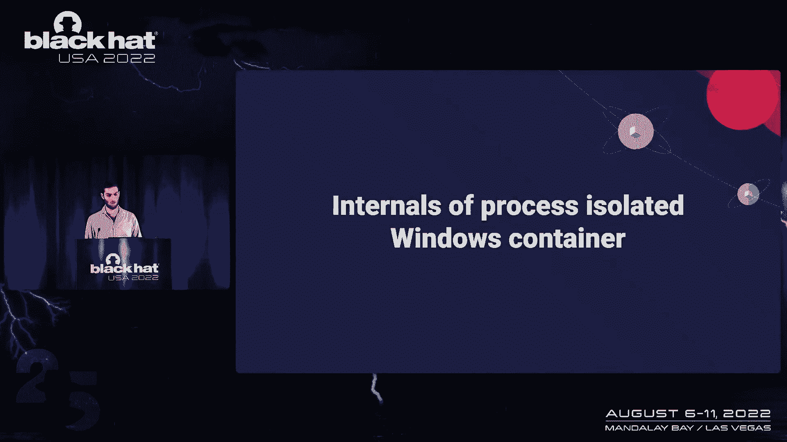

## 进程隔离容器的实现 🔧

了解了Windows容器的基本类型后，我们深入探讨进程隔离容器是如何实现的。

Windows容器由两个主要部分管理：
1.  管理所有容器的引擎（如Docker）。
2.  负责将容器与宿主机隔离的部分。

当一个新的Windows容器启动时，它会为容器创建一个包含命名空间、文件系统、作业对象等环境，并创建在容器内运行的进程。

Windows容器的隔离主要分为三部分：**作业对象**、**命名空间**和**文件系统层**。本课程将重点讨论如何绕过基于**作业对象**的内核隔离。

**作业对象**在Windows中用于将进程分组为单个单元并管理资源（如CPU时间、内存）。为了支持隔离，作业对象需要转换为**沙箱**。沙箱提供基本隔离，但对容器来说还不够。因此，沙箱必须转换为**服务器沙箱**。服务器沙箱支持资源重定向，允许容器使用来自容器镜像而非宿主机的资源（如注册表、网络）。

但这种隔离仍然不足。内核需要缓解潜在风险，例如防止从容器内加载驱动程序。因此，内核中添加了一些验证机制，检查执行系统调用的线程上下文是否在容器内，并阻止此类请求。

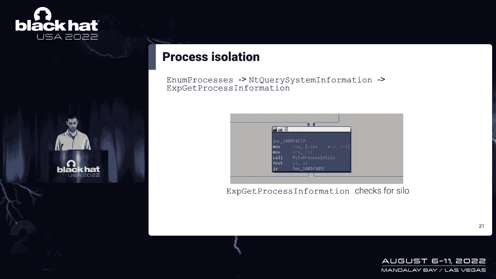

内核通过检查附加到线程或进程结构（`ETHREAD` 或 `EPROCESS`）上的作业对象来判断当前进程是否被隔离。内核需要遍历所有附加的作业对象进行验证。例如，在枚举进程列表时，内核会跳过容器外的进程，因此容器内的进程只能看到容器内的其他进程。

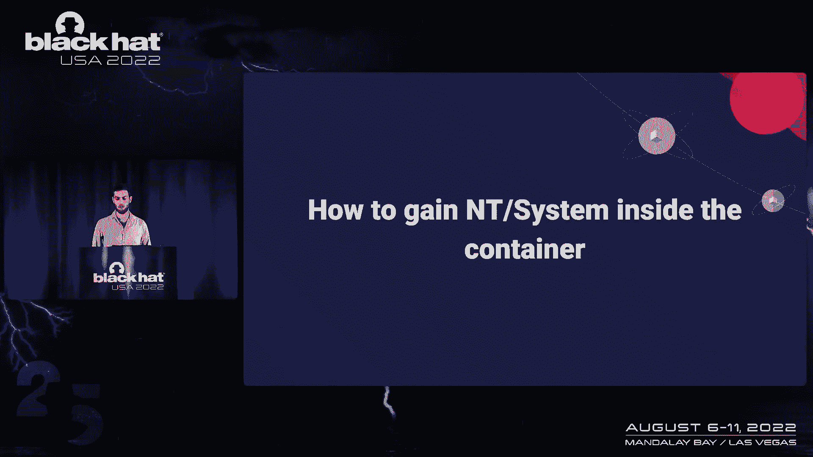

---

## 在容器内获取系统权限 ⬆️

在理解了容器的工作原理后，我们来看看如何在容器内获取系统权限。

当使用 `docker run` 命令的 `--user` 标志时，我们可以定义容器启动的用户。例如，指定一个普通用户。你可能会认为容器内所有进程都以该用户身份运行。

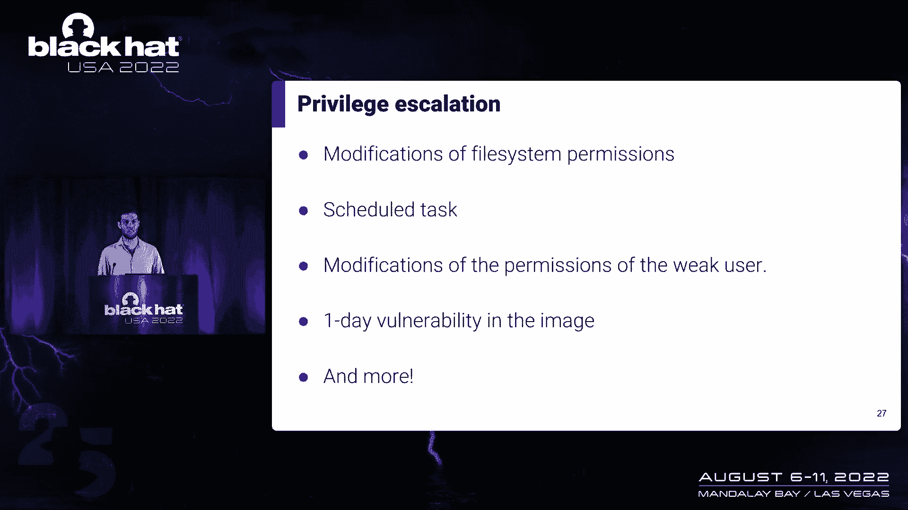

然而，在容器内，许多进程（如系统服务）是以 **SYSTEM** 权限运行的。唯一以指定用户身份运行的进程是我们启动的 `cmd.exe`。这意味着容器内的进程可以与具有SYSTEM权限的进程通信。更重要的是，这些SYSTEM进程是从容器镜像本身加载的，而**我们可以控制镜像内容**。

因此，无论 `--user` 标志指定了什么用户，我们都有可能获得SYSTEM权限。以下是创建一个能运行SYSTEM进程的容器镜像的简单步骤：

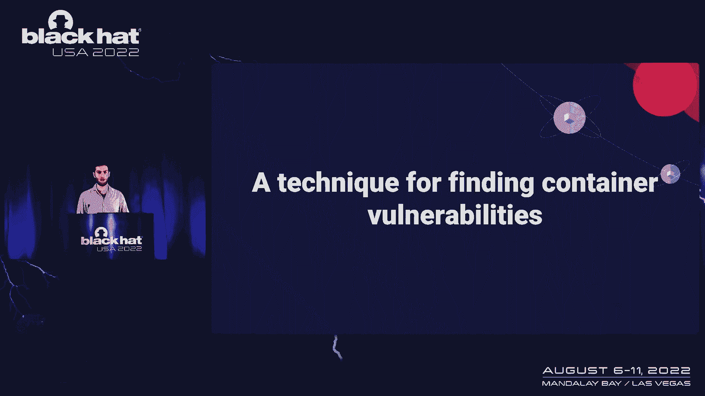

1.  在实验环境中，启动一个具有SYSTEM权限的容器。
2.  创建一个以后台服务形式运行的自定义SYSTEM进程。
3.  将该容器提交为新的容器镜像。
4.  部署这个新的恶意镜像。

获取SYSTEM权限的方法不止一种。因为我们可以控制镜像，所以可以通过多种方式实现，例如覆盖 `svchost.exe` 加载的DLL、修改Windows配置或注册表，甚至更改容器启动用户的权限。

---

## 寻找容器逃逸漏洞 🕵️♂️

我们在容器内获得了SYSTEM权限，但仍然受到隔离限制，无法直接影响宿主机。为了打破隔离，我们需要寻找漏洞。

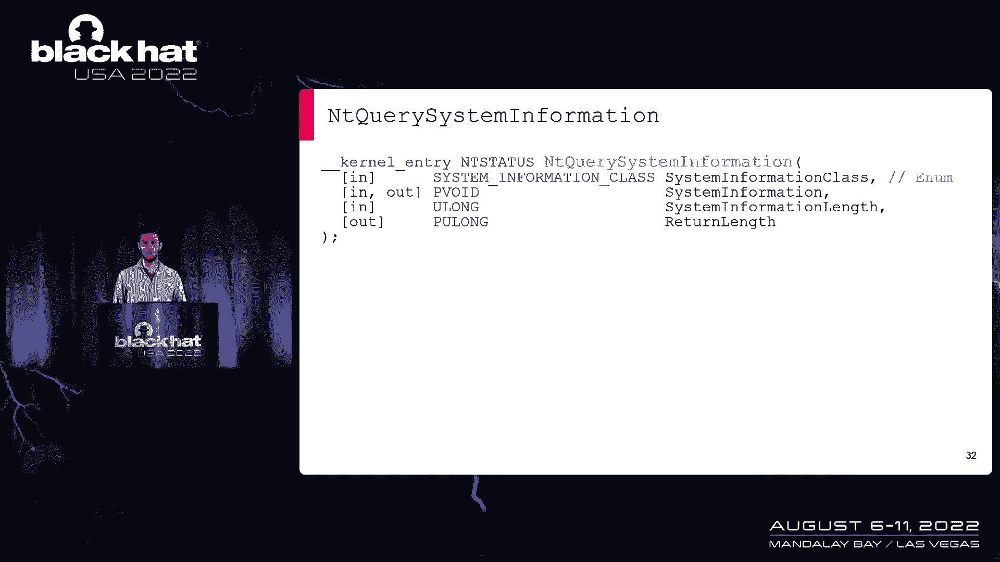

过去发现的两个容器逃逸漏洞代表了两种寻找漏洞的思路：
1.  **寻找微软忘记阻止的系统调用API**：在对象管理器中发现的漏洞允许容器内进程访问宿主机的任意硬盘驱动器。
2.  **尝试绕过微软的缓解措施**：通过创建一个新的非服务器沙箱对象来绕过内核验证。

本课程采用第一种方法：寻找微软忘记屏蔽的系统调用。Windows有超过500个系统调用，手动分析不现实。因此，我制定了以下筛选模式：
*   必须是 `Nt*` 或 `Zw*` 开头的系统调用。
*   其内部检查逻辑**没有隔离验证**（微软可能忘记添加）。
*   需要**管理权限**才能调用（影响潜力大）。

应用这个模式后，我开始寻找易受攻击的系统调用。`NtQuerySystemInformation` 函数引起了我的注意，它包含一个巨大的switch-case语句，枚举约200个选项。借助符号文件，我可以筛选出有趣的选项进行测试。

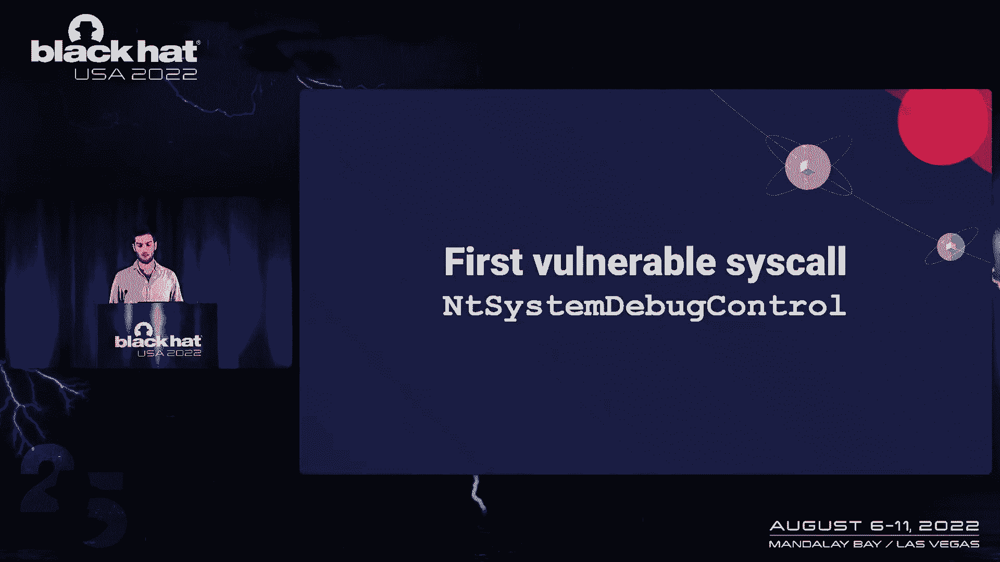

我编写了一个小程序来触发这些有趣的选项。其中一个有趣的发现是，当调用 `NtQuerySystemInformation` 并传入 `SystemHandleInformation` 枚举值时，它返回了**宿主机内核中所有对象的句柄和地址列表**，包括宿主机上运行的所有进程。这意味着我们可以“看到”宿主机和其他容器内的进程，但无法直接使用这些句柄，因为我们不能跨容器边界打开进程或复制句柄。这是一个信息泄露漏洞。

---

## 内核转储漏洞 💥

继续研究，我发现了另一个有趣的系统调用：`NtSystemDebugControl`。

`NtSystemDebugControl` 与前一个类似，也有多种选项。它调用了多个有趣的函数，例如启用内核调试器，但这些选项在干净的Windows机器上通常被阻止。只有少数选项可用，其中一个是触发**内核转储**。

为了从容器内触发内核转储，我需要填充 `BUGCHECK_ACTIVE_DUMP_CONTROL` 结构，它包含两个重要参数：导致转储的BugCheck代码，以及定义转储内容和格式的标志。通过修改网上找到的示例代码，我成功从容器内调用了内核转储。

转储标志（如 `DUMP_USER_SPACE_MEMORY` 和 `DUMP_HYPERVISOR_PAGES`）是未公开的。在启用了内核调试器的虚拟机上测试时，转储成功，包含了所有用户模式内存和Hyper-V页面。但在未启用内核调试器的干净Windows机器上，除了用户模式内存外，其他标志都有效。

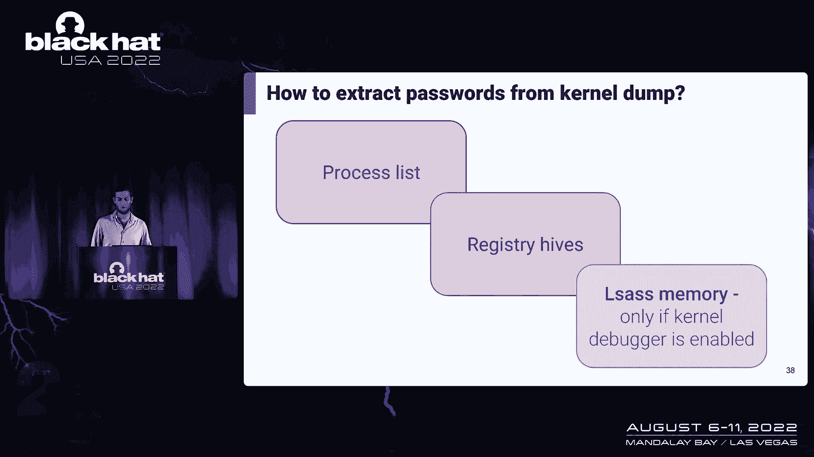

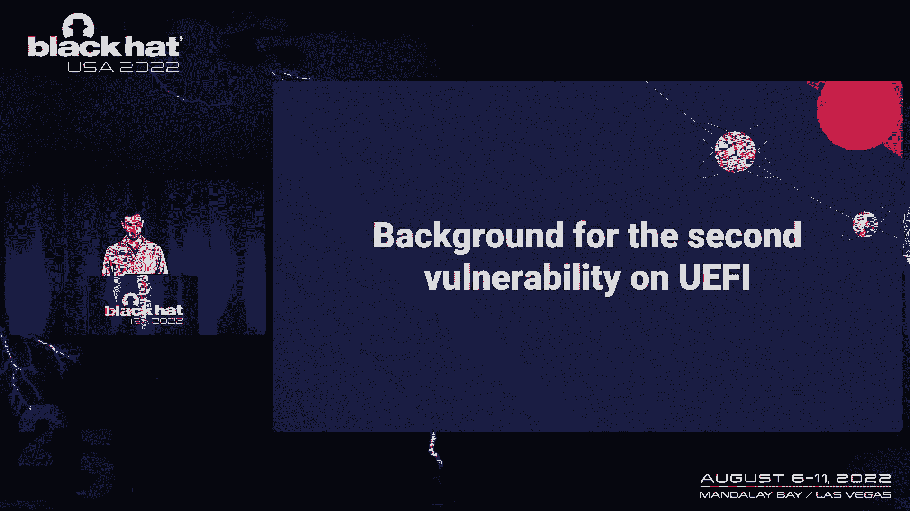

如果启用了内核调试器，我们可以获取包含所有进程内存的完整转储，其中可能包含密码。即使未启用内核调试器，通过内核转储我们也能访问：
*   进程列表及其命令行参数、环境变量（可能包含密码）。
*   宿主机上加载的注册表信息（有时密码存储于此）。
*   事件日志、内核内存等其他有趣信息。

---

## UEFI NVRAM 变量漏洞 ⚙️

除了内核转储，我还发现了与UEFI（统一可扩展固件接口）相关的漏洞。为了理解其影响，我们需要一些背景知识。

当启动一台Windows机器时，顺序如下：
1.  CPU加载UEFI固件和驱动程序。
2.  UEFI读取**NVRAM**（非易失性随机存取存储器）中的环境变量以了解如何继续引导。
3.  UEFI将控制权传递给Windows引导管理器。
4.  Windows从EFI系统分区上的BCD（引导配置数据）中提取配置并完成启动。

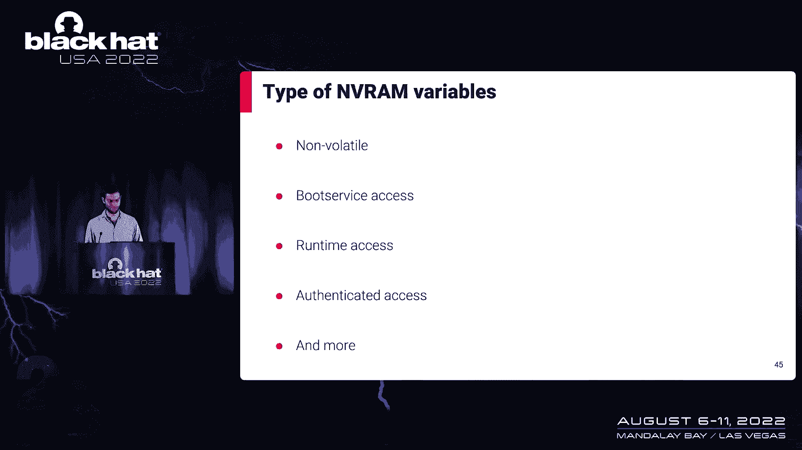

**NVRAM**存储在主板的一个芯片上，在操作系统和UEFI固件之间共享。要访问环境变量，需要知道其GUID（全局唯一标识符）和名称。例如：
*   `BootOrder`：定义引导顺序。
*   `Boot####`：定义如何从特定设备（如硬盘、网络）引导。

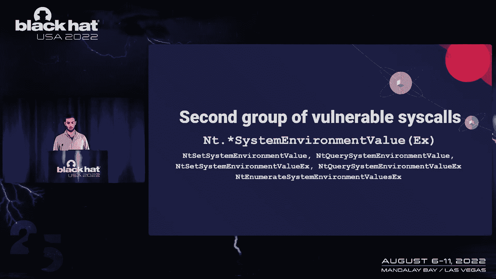

UEFI变量可以是永久的或易失的，并且可以设置访问标志（如仅引导时访问、仅操作系统访问）。

---

## 易受攻击的UEFI系统调用 📜

介绍完背景后，我们跳转到与枚举API相关的易受攻击系统调用组。

我们需要三个功能：
1.  **在宿主机上列出UEFI变量**：使用 `NtEnumerateSystemEnvironmentValuesEx`。
2.  **读取特定的UEFI变量**：使用 `NtQuerySystemEnvironmentValueEx`。
3.  **写入NVRAM变量**：使用 `NtSetSystemEnvironmentValueEx`。

微软没有阻止容器调用这些系统调用。现在，我们可以读取、写入和列出宿主机中的所有UEFI变量。

这带来了多种影响：
*   **持久化存储**：NVRAM存储是永久的，可在容器或宿主机重启后保留，用于在攻击中存储持久化数据。
*   **容器间通信**：两个隔离的容器可以通过读写共享的NVRAM变量进行通信。
*   **永久拒绝服务（DoS）**：最严重的影响。通过修改关键的UEFI变量（如 `BootOrder`），可以阻止宿主机正常引导。但UEFI通常有备份配置。

另一个发现的变量是 `HwGopDriver`。向其写入无效值将导致宿主机永久拒绝服务。但此变量仅存在于某些UEFI实现中。如果Windows容器运行在VMware Workstation等虚拟机上，那么虚拟机的UEFI是易受攻击的组件，攻击将导致**虚拟机永久拒绝服务**，而物理宿主机不受影响。

该漏洞的根本原因在于UEFI的BDS（引导设备选择）驱动程序读取了被我们覆盖的无效 `HwGopDriver` 变量值，导致其跳转到断言函数并陷入死循环，从而中断引导序列。

---

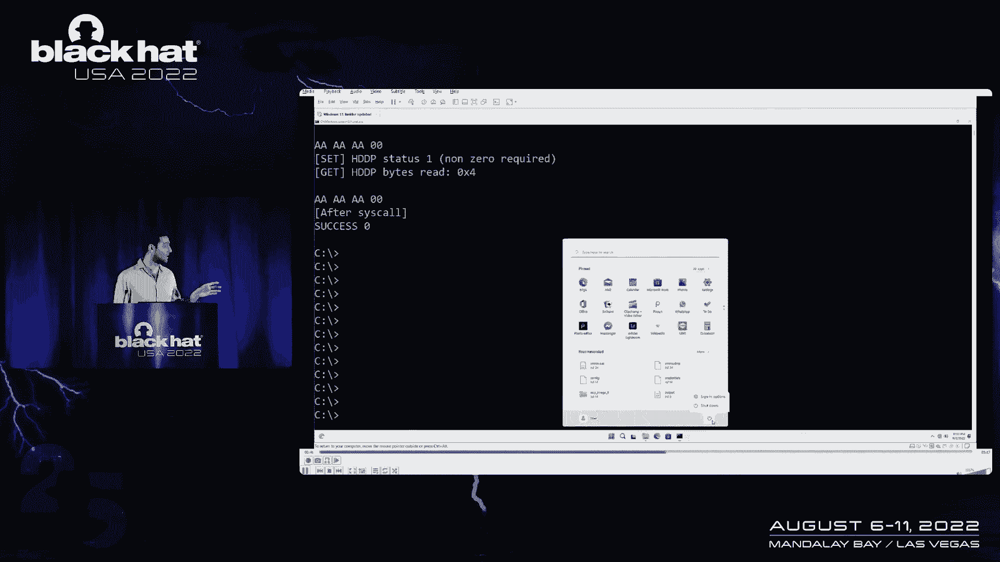

## 漏洞演示与缓解措施 🛡️

我将演示之前提到的权限升级，以及如何利用恶意Windows容器导致虚拟机永久拒绝服务。

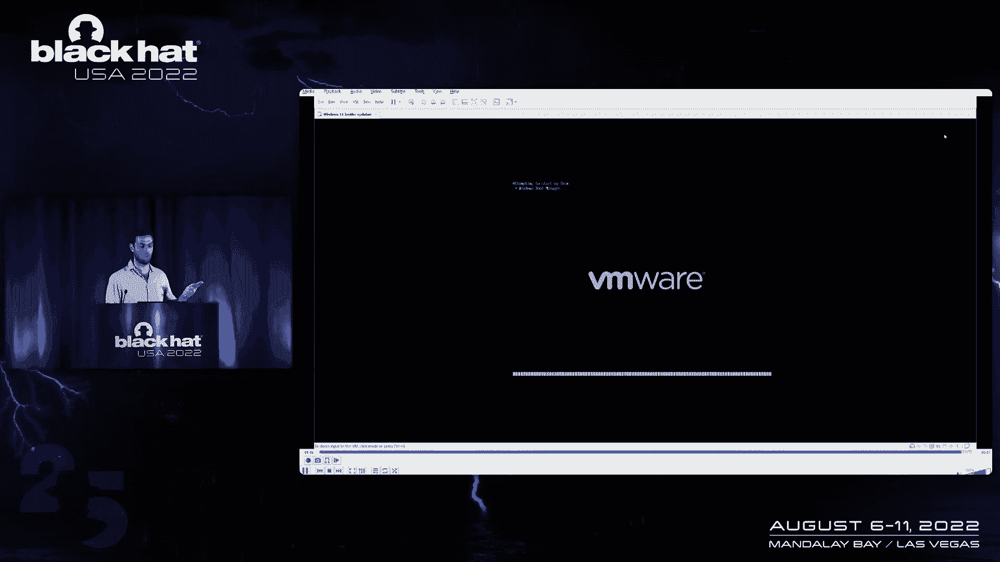

1.  启动一个Windows容器，其中包含一个以后台服务形式运行的自定义SYSTEM进程。
2.  该服务读取输入文件，并根据指令向 `HwGopDriver` UEFI变量写入无效值（例如6个‘A’）。
3.  在宿主机（虚拟机）重启之前，一切正常。
4.  当宿主机（虚拟机）尝试重启时，UEFI读取到损坏的变量，引导过程失败，导致永久拒绝服务。

**缓解这些漏洞并不容易**，因为没有官方的微软补丁（截至研究时），但可以采用一些变通方法：
*   **使用Hyper-V隔离容器**代替进程隔离容器，但这会牺牲性能。
*   **仅信任并使用经过签名的容器镜像**。
*   **安全假设**：假设Windows容器内的任何进程都具有SYSTEM权限，并在网络拓扑中对其进行相应隔离。
*   **容器镜像扫描**：扫描镜像中是否存在权限升级或恶意内容。但请注意，一些扫描产品可能不正式支持Windows容器或无法检测此类高级攻击。

微软对相关漏洞的回应：
*   **权限升级**：认为这不是漏洞，因为只有管理员才能启动容器。
*   **内核转储**：认为这不是漏洞，因为需要容器内的SYSTEM权限，但计划在未来修复。
*   **UEFI变量访问**：定义为中度拒绝服务漏洞，但不在常规安全更新范围内，计划修复。
*   **`HwGopDriver` 变量**：视为功能问题，因为它主要影响虚拟机，且需要容器内管理权限，但计划修复。

研究中使用的所有工具和代码（包括权限升级、内核转储修改和拒绝服务手册）均已公开。

---

## 总结 📝

在本课程中，我们一起学习了：
1.  Windows容器（特别是进程隔离容器）的基本架构和隔离机制（作业对象、沙箱）。
2.  如何通过控制容器镜像在容器内获取SYSTEM权限。
3.  如何通过分析系统调用模式（寻找未正确隔离的API）来发现容器逃逸漏洞。
4.  两个具体的漏洞案例：
    *   **内核信息泄露与转储漏洞**：允许容器获取宿主机进程列表甚至触发内核内存转储，可能导致敏感信息泄露。
    *   **UEFI NVRAM变量访问漏洞**：允许容器读写宿主机固件设置，可能导致永久拒绝服务攻击。
5.  缓解此类攻击的挑战和可能的应对策略。

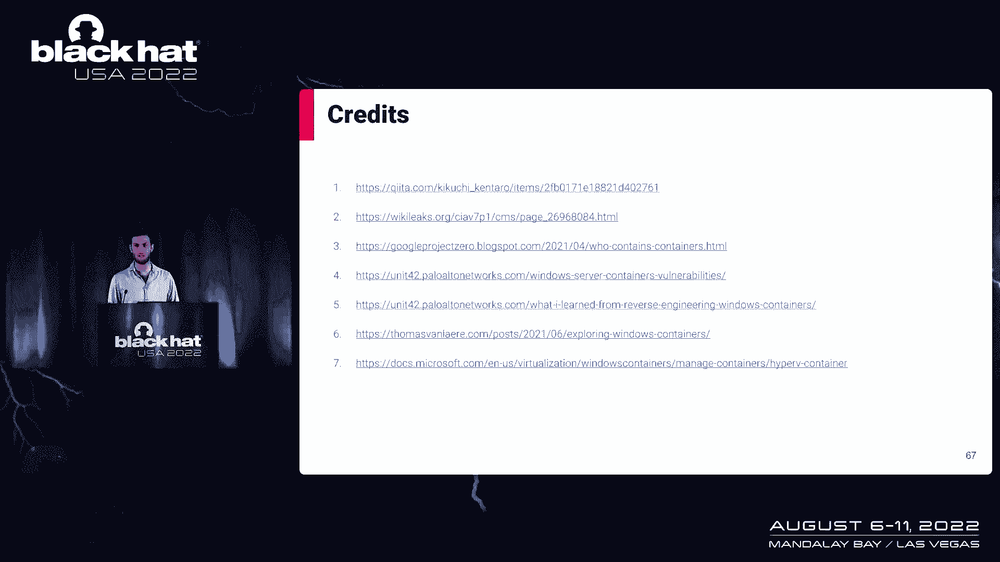

这项研究揭示了即使是在隔离的容器环境中，攻击面也可能比预期更广，强调了深度防御和安全配置的重要性。