# P4：004 - Is WebAssembly Really Safe？ -- Wasm VM Escape and RCE Vulnerabilities Have - 坤坤武特 - BV1WK41167dt

hello，everyone，i'm zao ha finally secret in studia and new graduate，it's my honor to speak here。

i hope to see you more often in the future today，the subject of my speech is web simply。

we are the gap and r c e vailabilities，i wish to have technical communication together with you。

our team is from cyberspace technology company，tyu lab。

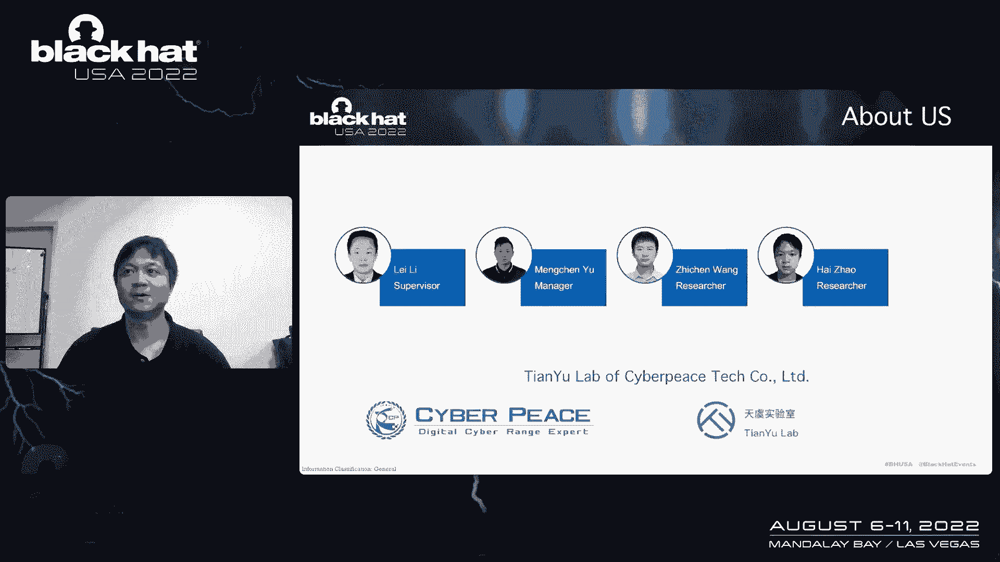

we are chinese top level cyber range company，which focuses on research on。

offensive and defensive technology and hyper，now let me introduce in members，li lei。

it's supervisor menu is a secret manager，jan wan，and i are secret researchers，thanks to the。

help of my team members，we make this research together。

now let's get to the topic in our android，first，i will briefly introduce the weather。

virtual machine and extern，what we are interested in according to focus，we designed the。

butools and vision on time and foundsong，exploited for vailabilities，we will show，variabilities。

web assembly is a technology used in the brother，banded cloud computing and other bills。

it is a bad covirtual machine，so it can run of multiply plants，bts without the compiling。

there are also many studies on，but most of them are books on the vision fire itself。

other than is long time are their potentional variabilities in the web，assembly wrong tan。

this is what we are interested in，let's get to know the teachers of vision round time standard。

he passes to pass the vision fire into the west virtual machine instance。

the rtual machine has two parts of stack the pc stack and sp stack。

pc stack serves instructions and sp stack serves dead。

there are so many imports objects functions memories。

and so on the vision is an interface of sistant interface，it also imports through the import table。

the vision machine will handle those import object。

and do some seventy trees and visit has permission rejections。

the machine will also check the stack bound when the instruction access them。

so the reason is a bit like a docker，and here is a joke from the door author。

this shows that the weather has a good，promising in the future，the vision long time。

we have found there are three places，val variabilities are most likely to occur。

the first is a fire pm，and the second is a weather eat vs。

and the third is a track of those objects for those，three situations。

we design a version fire generator，it takes input that from the center。

看见generated by the father engine，such as a fpl lor father。

because the sample is coverage guided sample，the debt read from the sample is also coverage guided。

which leads to the generated version file，being courage guardian，this is just like a generator。

it just making the debate，and to the western files。

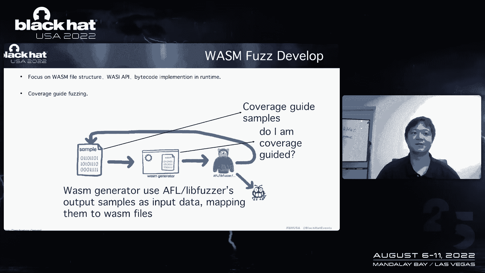

now let's learn，how how does the weather general works for the。

let's have a look at the weather fire structure，the weather file is consists of many sections。

ui for each section，had is a structure in section，some fails are fixed values for regional vues。

some fails are calculated，and sunfields can be rendere according to such rules。

we obstructed the vision fire into an object model，the object model just like this。

the the classes section for each different type of section。

we use different subclasses to deal with it，and in the generate function。

we are responsible for the generation death in the object，and in the gain cold function。

we delirise the death of objects into sections in the weather fire。

for example when we deal with a random thought of bills，we use such an eglance to generate de。

when we generate a random integer，we first read an indual dead from the father engine samples。

all those death are changed，according to the death changes in the samples。

we just make the boundary value have higher frequences，such as，now i will introduce。

how to father the structure of weapon fire，each is instruction we designed the corresponding subclasses and generate dead in the generation functions。

and then we use get bad cold functions to，civilize the death into bad cold in the western fire。

we can handle the degeneration of the character，bad code and dus constraints in the。

general functions for example when we generate the bad coc，we should avoid call the custation。

we need to reject the index of the target functions，the index can not point to the college functions。

because it will lead to infinite the requisition，therefore we serve the path of the car in the context of project。

and use tfsi a gaggrey to avoid reaccusation。

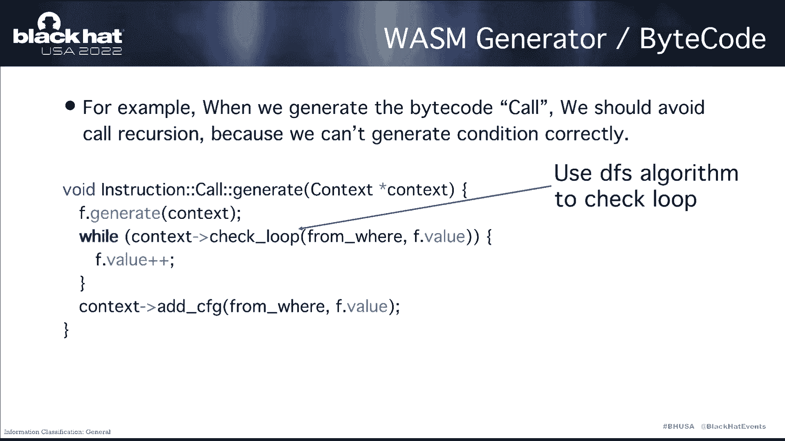

now it's time to introduce，how to buy the vision interface。

aps with an interface is import through in the import sections。

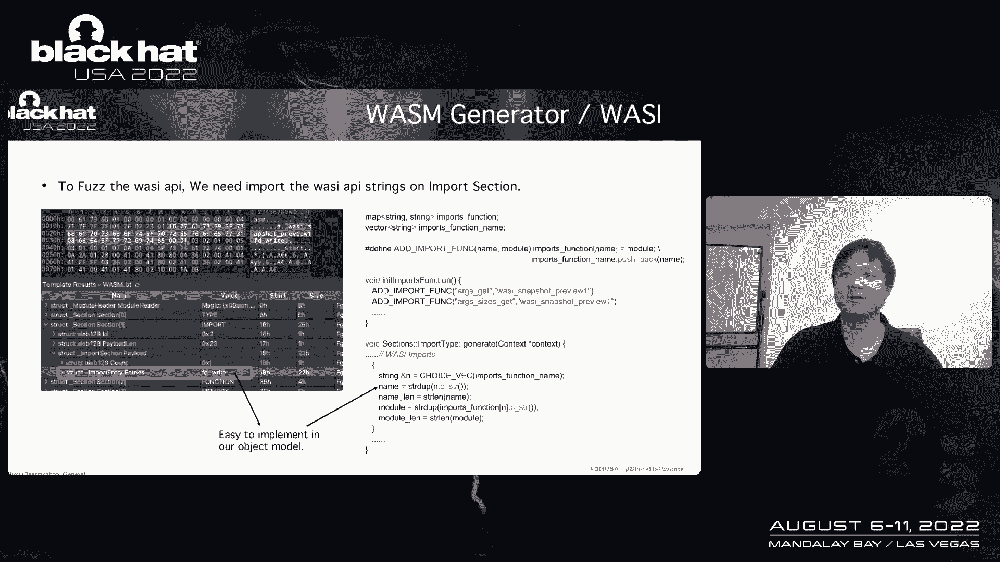

when processing the import section in the section，there are only some strings of important functions。

we just put some candidate list in the，function in nin important functions。

and then in the general functions，we just select a random candidate list，up to。

and we can bandit our vision generator into the father，engines as the immediate layer。

as you see we take the dead from the bother engines，and feed it into the weather。

fire generator to conduct a coverage，guided by buzz，next i we will introduce the vailabilities。

we bb through the tools，and show the exploitation，the first vabilities was the f d rfd revision interface。

api for one vision，three in the inflamentation of actired。

the bus and buffin verbs are converted by promises memory，but their foundvues are not checked。

the corresponding poc is as follow uh，because the weather is a stack best virtual machine。

so you can see the court like this，we sit band band verbs in the offseat zero of vision memory。

and then we pass the value zero to empty，right means the iriverbs in the offset，the oor of memory。

then we will trigger the vilabilities，and we can get an out of buffer，so how can we explode it。

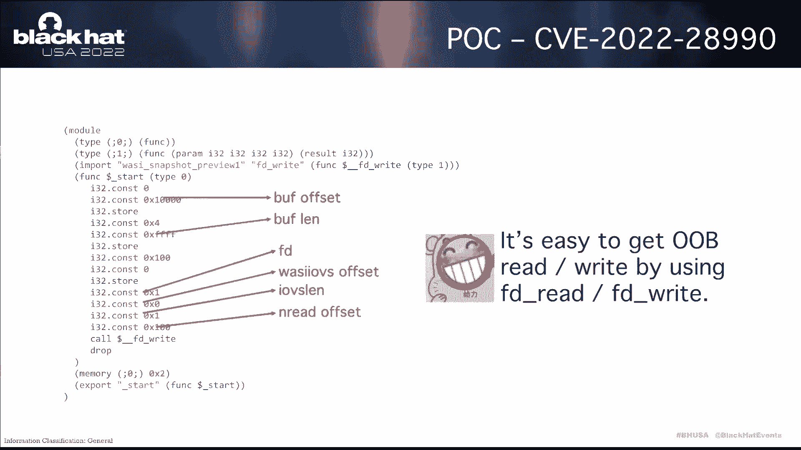

let's learn，so let's learn the vision revirtual machine，the memory activity。

each bad cod is corresponding native functions to execute，the virtual machine passes。

the bad code and the stores，the corresponding native functions and index of corresponding。

permitters in the pieces deck the sp tag only stores。

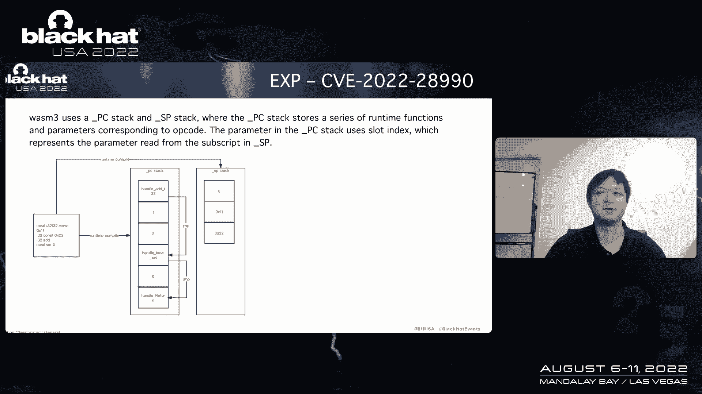

the dead，so when the space deck is cooperated is not impact on the control。

we should the overfloat with a pieces stack，so we use heap spare to make such memory，layout。

after that the overflow heavens in memory，and we can overflow it to the pc stack。

and after we control the pieces that we can get snative called。

excuses we can put the arbitrary instruction，functions and gadges in pieces st。

but it has difficult to get for cold executi，this is the set global functions。

the set global is the handle of the ocode set c set global。

it is immediate value taken from the pc sticks slot，and then texit as the edges。

and the right dead into it，so we can uh use get global and set global to get arbitrary edges read。

and wr，we just put the globe and slope in pieces，deck，and put some gadgets to get the cold excuti。

now，let's make it harder，how to explore it on android。

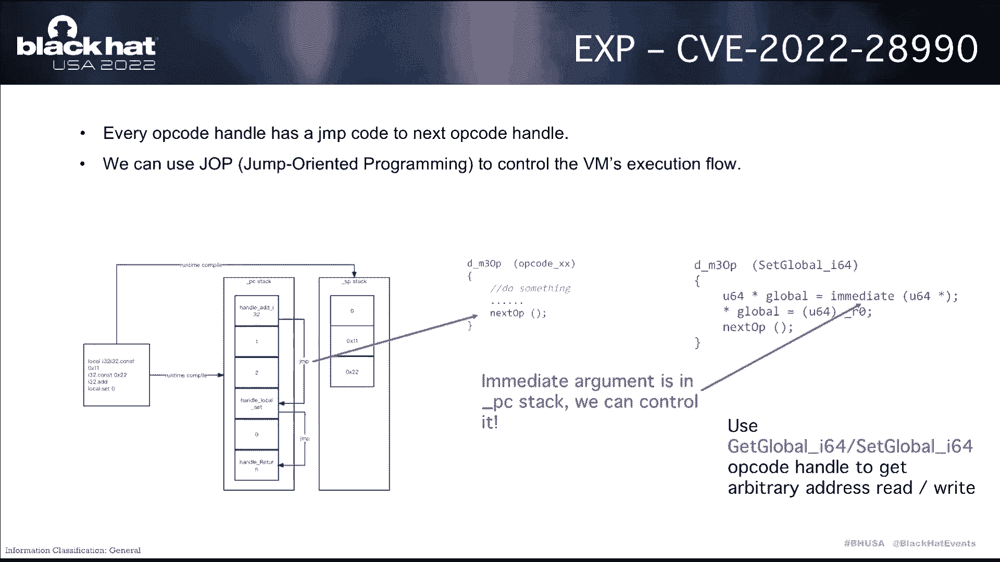

the android use secret allow cheater，and we found that pieces，stack is always in front of memory。

so we can't overflow to pieces，stack from the memory。

we should bend some way to spell the memory of pieces stack，get such layout。

luckily we found that vision，we will use more than one pieces stack in some situations。

if the initial pieces deck is filled the vision，we will allow at a new one。

which so we should find some way to，build the pieces stack after the color review。

we discover the ocbr table，can feel the pieces stack when the compare deal with in the opcode。

ber table，it will emit all target that the beat table use。

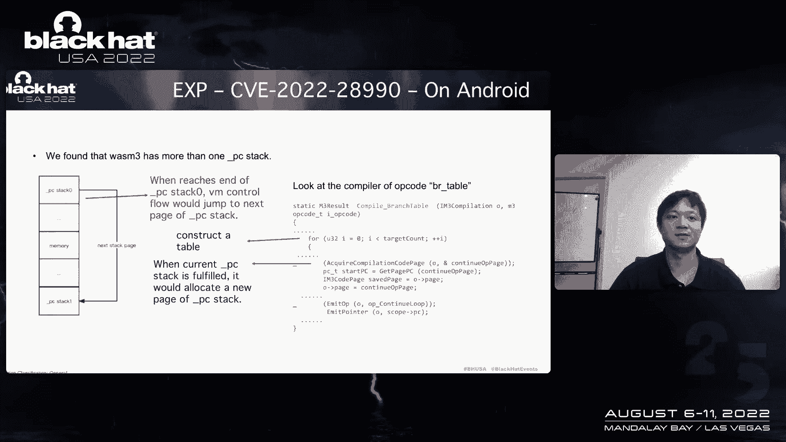

so we just put a large number of targets on br tables，permeters，as you see the opcode like this。

be a table zero，let's look at uh at the demo for for the exploitation or android。

we just after we control the pieces，deck，we back the globe，and the city globe in kids stack。

and then get average edges with ri，and then do anything，you want now。

i'm going to introduce our second vailabilities，first，let's take a look at the code of memory field。

the function of compare memory，and and copy field is an ocode handles。

the memory fmade three permeters，the first value size，it's in the regia zero。

and the others are in the sp stage，the pc stack saves index of values in sp stack。

let's have a deep research on immd sfunctions，if the character stack top value is in the regi。

it will not be mit，because the perimeter science is in the region。

it's so it will always think that characters like top value，can not be in the regi。

but he ignored a fall of floating point three，just that vision three has two registers。

the are zero for dital value and pizero for fat values，so we should use some floating。

point instructions to get to get a value in the floating，they just。

and as you see we use thirty two dot kill up code to do this，after we do this。

the second slot will not gumited into the stack，this result in smissing。

when the court gets the slot value，it will use the value，next next to the first slot。

the overflow heavens，but these variabilities is unexploitable，because we can control the next value。

it just result in segment error，because the next value is the other accord，handles edges。

and we can not control it，and we cannot control is brilli。

this is a weather with that vailabilities and exploit。

exploitation after understanding the teachers and，availabilities of leon，three，next。

i will introduce the teachers of her and，availabilities of another，the reason age。

the weather edge engine is different from vision，three whether，hpc steaks stores。

instruction structures，and the immediate value is also in pc step，when the code is past finishing。

stea the executor read the value，which key pointed，and then do call this touch。

it just use the viswitch to dispatch the ocode，then let's see the opcode b r。

the bar of code handle functions just call the brunch to table function。

so we take a look at that function，first boxed on this criminal。

ky of seed what is a piece of seat value is，let's see the track instruction functions。

the piece of seat is calculated，and the bullet is pjs of jump target，minus，edges of beyon，靠。

when we have such opcode b r zero，then after the virtual machine run to the bar code。

the value of pc of seed is when the value of a piece of seed is one，so brunch to the tape。

so brunch to the label，will add one to the value of pc，when return to the cold discu。

the departure will also add one to the value of pc。

this means that a br zero increases the value of pc by two，but in the normal logical of bia zero。

the value of pieces should only be added with one not two，therefore this is uh of by one。

vilabilities，first the control flow starts here，and after we run the code of br zero。

pc will increase by two，it just point it another memories，and if we can control its content。

we can fix some instructions to do some things，but how to control it。

we found that the constant of code，can do this，we use the integral constant of code。

and put the dead in the premier after doing this，we use the upward job to balance。

the stick to bypass，the stack track，because whether watching machine has a safety，check。

we use the job to my past that the stack track，and after we do the hip rail。

you can see the debate in the memory，as follows the instruction of br next is the instruction of end。

and next of the hand is spread that value，and we can see that we can control the opcode bul。

but the outcast parameters can be controlled freely。

the weather edges instruction structure just like this，the，the volume of jump。

and is one hundred and fifty four，and the opcode is it's one hundred，and，the opcode is twenty。

is different opcode，can get the value of jump and to the pc。

it can transform the pieces to cultural memory space。

so we should find some way to who use the jump and luckily，the feels of cold does。

and the value of bees of code，describe we just put it in the parameters of penetral，constant code。

and after we do this，we can see the pieces，deck like this。

instruction next of end is real value fails，and we use a stop called to let the pc ad。

this memory is sp stack，and we can control it，yes，we can use the one hundred。

and twenty eight beast constant called to rave the sp stack，and after you do this。

you can see the memory，layout like this，this means you can make any instructions，you want。

but how to get the cold executions，it is the same as the weather。

just break the get get global and set global instructions to get vary edges，read write。

and then you can do anything。

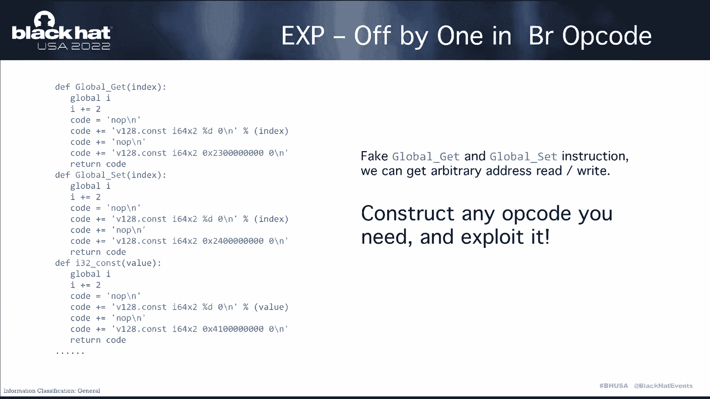

you want，now let's take a look at the vision，edge，vailabilities，exploitation demo。

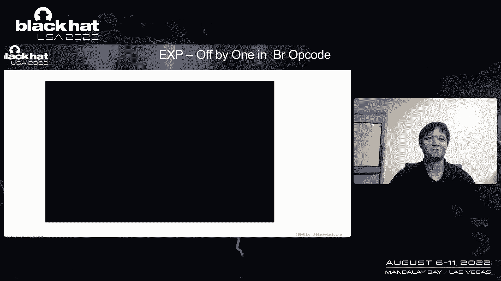

and as you see we extort successful。

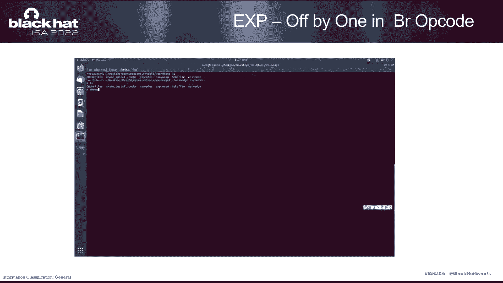

finally i would like to summarize，my topic as follow first，we use structed layer to help her。

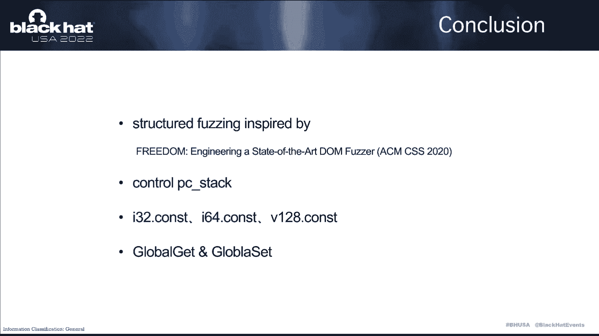

the body engines deal with some complex world vocation and context。

this is inspired by the paper state of ardon brothers after，we found some vailabilities。

we should find some way to control the pieces that，after we control the pieces deck，but not freely。

we need to do some hip po，so we use some constant instructions，like a i thirty two dot cost。

after we control the pieces，deck freeing，we use the guglow。

and set globe instructions to get rich edges red ri。

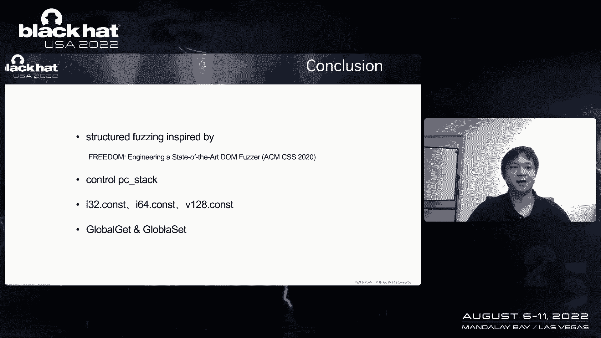