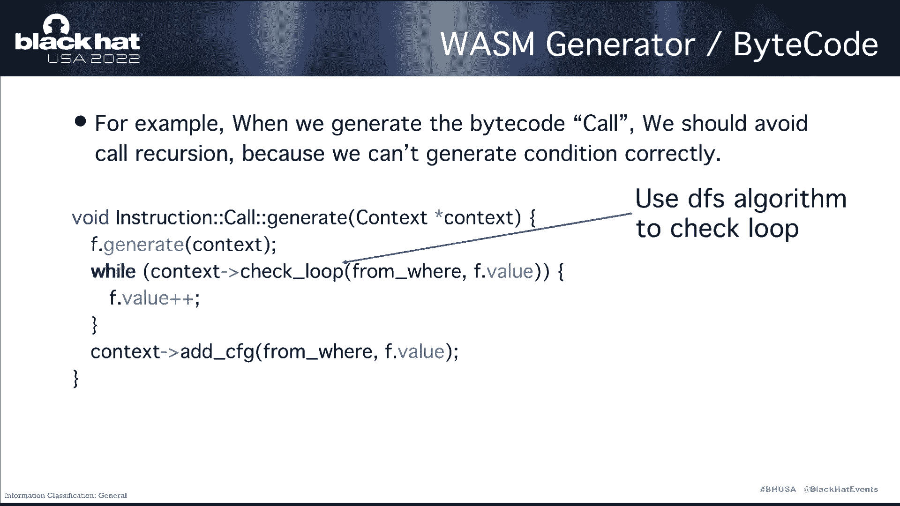
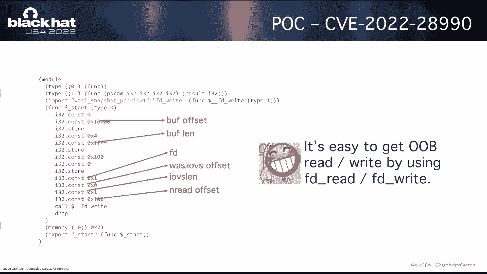
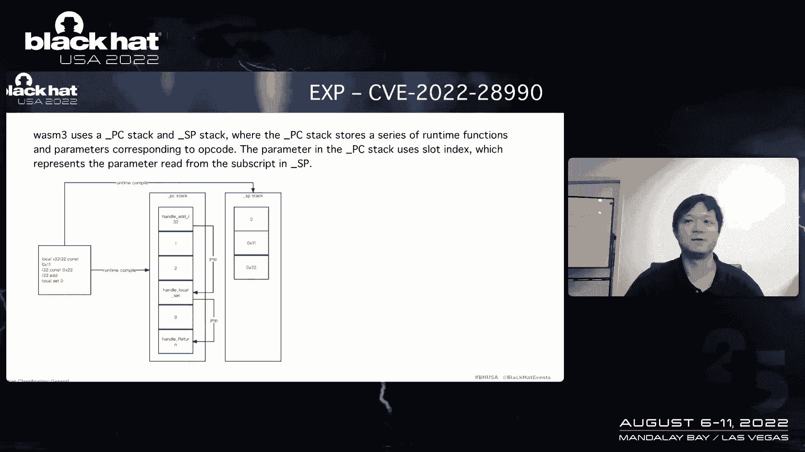
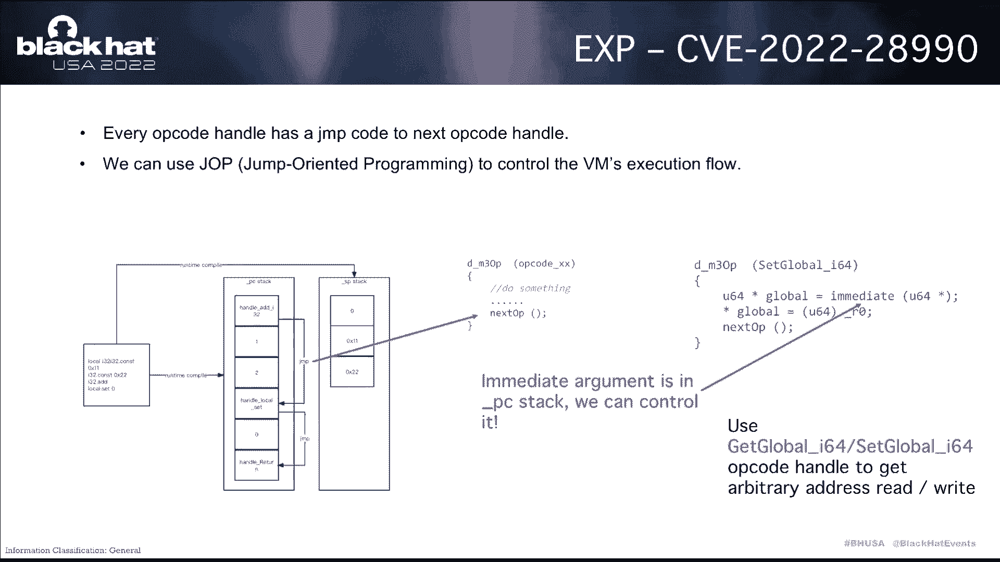
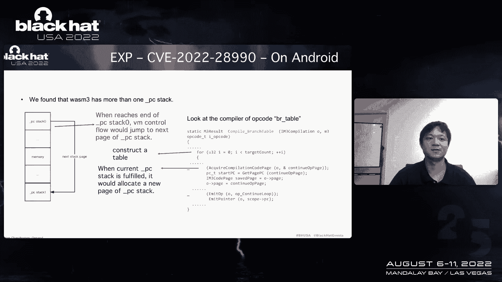
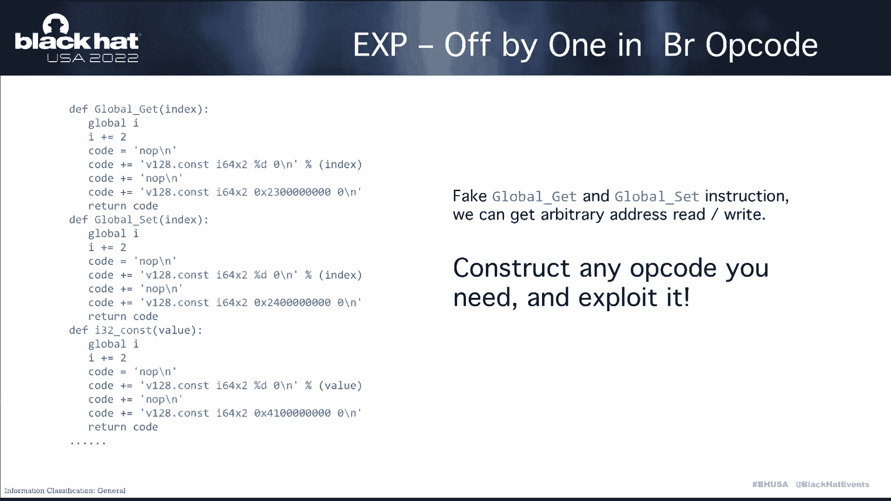
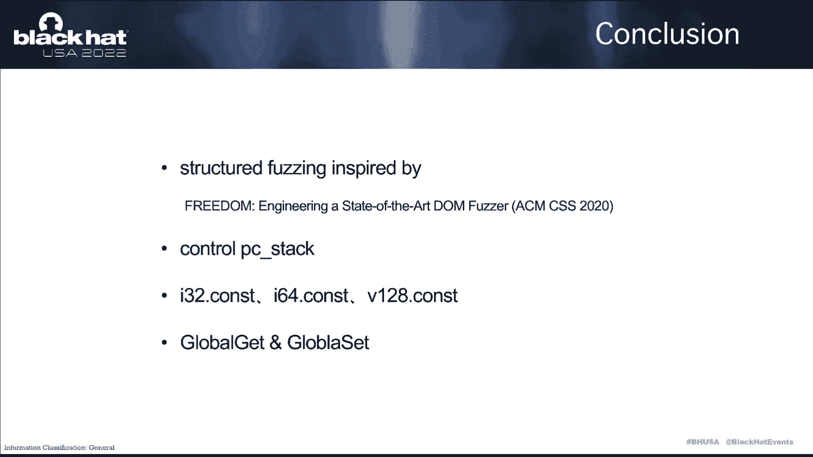
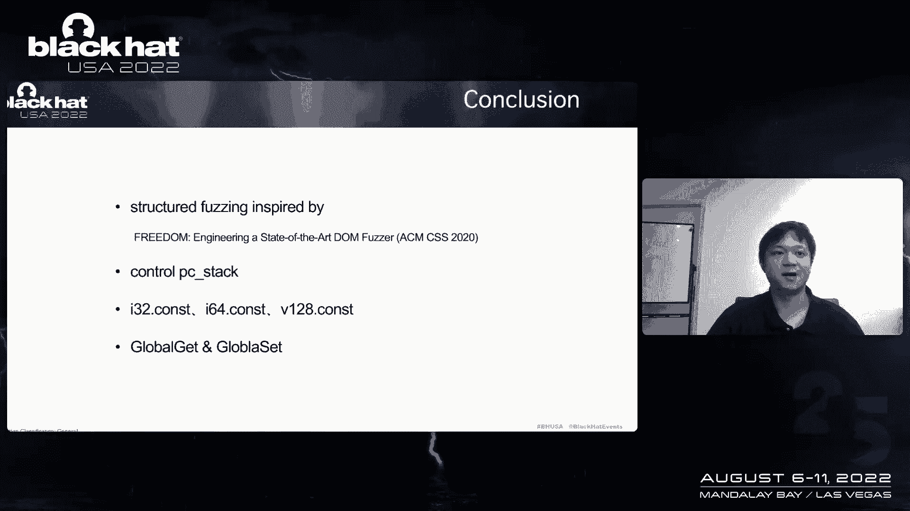

# P4课程004：WebAssembly真的安全吗？🚨 —— Wasm虚拟机逃逸与RCE漏洞分析


在本节课中，我们将要学习WebAssembly虚拟机的安全性问题，特别是虚拟机逃逸和远程代码执行漏洞。我们将从WebAssembly的基本概念入手，逐步分析其内部机制，并探讨如何利用模糊测试工具发现漏洞，以及如何构造利用链实现攻击。


---

## 概述


WebAssembly是一种广泛应用于浏览器、边缘计算和云计算等领域的技术。它是一个字节码虚拟机，可以在多种平台上运行，无需重新编译。尽管已有许多关于WebAssembly安全性的研究，但大多数集中在Wasm运行时本身。我们更感兴趣的是，在WebAssembly运行时中是否存在潜在的安全漏洞。

---

## WebAssembly虚拟机与外部接口

上一节我们介绍了WebAssembly的基本概念，本节中我们来看看WebAssembly虚拟机的内部结构及其与外部交互的方式。

WebAssembly运行时标准将Wasm字节码文件加载到Wasm虚拟机实例中。该虚拟机包含两个主要部分：PC栈和SP栈。PC栈用于存储指令，SP栈用于存储数据。

虚拟机通过导入表处理许多导入对象，如函数、内存等。Wasm运行时是宿主环境与Wasm模块之间的接口，它同样通过导入表导入外部功能。虚拟机会对这些导入对象进行安全检查，并实施权限控制。此外，当指令访问栈时，虚拟机还会检查栈边界。

因此，Wasm运行时在某种程度上类似于Docker容器。以下是Docker作者的一个玩笑，它表明WebAssembly在未来具有广阔的前景。

---

## 漏洞可能发生的位置

我们研究发现，Wasm运行时中最可能发生漏洞的地方有三个。

以下是这三个位置的简要列表：

1.  **文件解析模块**：处理Wasm文件结构的部分。
2.  **Wasm运行时引擎**：执行Wasm字节码的核心引擎。
3.  **导入对象处理**：处理外部导入函数和对象的逻辑。

针对这三种情况，我们设计了一个Wasm文件生成器。


---

## Wasm文件生成器设计

上一节我们指出了漏洞可能发生的位置，本节中我们来看看如何设计工具来发现这些漏洞。

我们的Wasm文件生成器接收来自模糊测试引擎（如AFL或LibFuzzer）生成的样本数据作为输入。由于样本是覆盖率引导的，因此从样本中读取的数据也是覆盖率引导的，这使得生成的Wasm文件同样具有覆盖率引导的特性。这个生成器的作用是将数据转换为Wasm文件。

现在让我们了解Wasm生成器的工作原理。首先，我们看一下Wasm文件的结构。

Wasm文件由多个段（Section）组成。每个段在代码中都有一个对应的结构体。有些字段是固定值，有些是计算得出的，还有一些可以根据特定规则随机生成。

我们将Wasm文件抽象为一个对象模型。对于每种不同类型的段，我们使用不同的子类来处理。在生成函数中，我们负责生成对象内的数据；在获取字节码函数中，我们将对象的数据序列化为Wasm文件中的段。

例如，当处理随机整数生成时，我们使用以下逻辑来生成数据：

```python
def generate_random_int(sample_data):
    # 从模糊测试样本中读取一个整数值
    value = read_int_from_sample(sample_data)
    # 根据样本中的数据变化调整值，使边界值有更高的出现频率
    if is_boundary_value(value):
        value = adjust_for_boundary(value)
    return value
```

接下来，我将介绍如何模糊测试Wasm文件的结构。对于每条指令，我们设计了相应的子类，并在生成函数中生成数据。然后，我们使用获取字节码函数将数据序列化为Wasm文件中的字节码。

我们可以在生成函数中处理字符、字节码和数据约束。例如，在生成字节码时，应避免调用导致无限递归的函数。我们需要拒绝指向调用函数的索引，因为它会导致无限递归。因此，我们在项目上下文中保存调用路径，并使用DFS算法来避免递归。

---



## 模糊测试Wasm接口API


上一节我们介绍了如何生成和模糊测试Wasm文件结构，本节中我们来看看如何针对Wasm接口API进行模糊测试。

Wasm接口通过导入段导入。在处理导入段时，段中只有一些导入函数的字符串。我们只需在函数和导入函数中放入一些候选列表，然后在生成函数中随机选择一个候选列表。

我们可以将Wasm生成器作为中间层集成到模糊测试引擎中。如图所示，我们从模糊测试引擎获取数据，并将其输入到Wasm文件生成器中，以进行覆盖率引导的模糊测试。

接下来，我们将介绍发现的漏洞，并展示利用过程。

---

## 漏洞一：FD RFD Wasm接口API

第一个漏洞存在于某个Wasm运行时的实现中。在实现`active`时，`bus`和`buffin`动词通过承诺内存进行转换，但它们的边界值未经过检查。



相应的概念验证代码如下。由于Wasm是基于栈的虚拟机，代码看起来像这样：

```wasm
; 在Wasm内存的偏移量0处设置边界和缓冲区动词
(i32.store (i32.const 0) ...)
; 然后传递值0给`empty_right`，意味着在内存偏移量0处使用`iriverbs`
(call $empty_right (i32.const 0))
```

这将触发漏洞，并导致缓冲区溢出。那么，我们如何利用它呢？



---

## 漏洞利用：控制PC栈

让我们深入了解Wasm运行时虚拟机的内存布局。每个字节码都对应一个本地函数来执行。虚拟机传递字节码，并将对应的本地函数及其参数的索引存储在PC栈中。SP栈仅存储数据。

因此，当SP栈被破坏时，不会影响控制流。我们应该通过溢出PC栈来控制执行流。我们使用堆喷技术来构造这样的内存布局。

之后，内存中发生溢出，我们可以溢出到PC栈。控制PC栈后，我们可以执行任意本地函数调用。我们可以将任意指令、函数和gadget放入PC栈，但获取代码执行仍然很困难。

这是`set_global`函数。`set_global`是操作码`set_global`的处理函数。它从PC栈的槽中获取立即值，将其视为地址，并向其中写入数据。因此，我们可以使用`get_global`和`set_global`来实现任意地址读写。



我们只需将全局变量和槽放入PC栈，并放置一些gadget来获取代码执行。

现在，让我们看看在Android上利用的难度。

---

## Android平台上的利用挑战



Android使用分段堆布局，我们发现PC栈始终位于内存的前面。因此，我们无法从内存溢出到PC栈。我们需要找到某种方法来分隔PC栈的内存，以构造这样的布局。

幸运的是，我们发现Wasm在某些情况下会使用多个PC栈。如果初始PC栈已满，Wasm会分配一个新的PC栈，这发生在我们调用的函数之后。我们发现了操作码`br_table`可以在处理操作码时填充PC栈。

`br_table`会发出所有目标分支。因此，我们只需在`br_table`的参数中放置大量目标分支。操作码如下所示：`br_table 0`。

让我们看看在Android上的利用演示。控制PC栈后，我们在栈中备份全局变量和`set_global`，然后通过读写获取任意地址访问权限，之后就可以执行任何操作。

---

## 漏洞二：内存填充操作码

现在，我将介绍我们发现的第二个漏洞。首先，让我们看一下内存填充的代码。

函数`compare_memory`和`copy_field`是操作码处理函数。`memory_fill`有三个参数，第一个值大小在寄存器`r0`中，其他参数在SP栈中。PC栈保存SP栈中值的索引。

让我们深入研究立即函数。如果字符栈顶值在寄存器中，它将不会被提交。因为参数大小在寄存器中，所以它总是认为字符栈顶值不可能在寄存器中。但它忽略了一个关于浮点寄存器的细节。

Wasm运行时有两个寄存器：`r0`用于整数值，`f0`用于浮点值。因此，我们应该使用一些浮点指令来获取浮点寄存器中的值。如图所示，我们使用`f32.const`操作码来实现这一点。

这样做之后，第二个槽将不会被提交到栈中，这导致了一个缺失。当代码获取槽值时，它将使用第一个槽旁边的值，从而触发溢出。

但这个漏洞无法被利用，因为我们无法控制下一个值。它只会导致段错误，因为下一个值是其他操作码处理函数的地址，我们无法控制它，也无法控制其边界。

这是一个包含该漏洞的Wasm运行时及其利用的演示。

---

## 漏洞三：Wasm边缘引擎的漏洞

在理解了某个Wasm运行时的原理和漏洞后，接下来我将介绍另一个Wasm边缘引擎的原理和漏洞。

Wasm边缘引擎与之前的Wasm运行时不同。它的PC栈存储指令结构，立即值也在PC栈中。当代码解析完成时，执行器读取键指向的值，然后调用相应的处理函数。它使用`switch`语句来分发操作码。

让我们看看操作码`br`。`br`操作码的处理函数只是调用`branch_to_table`函数。因此，我们看一下那个函数。

首先，基于这个条件：`pc_seed`的值是什么？让我们看看跟踪指令函数。`pc_seed`是计算得出的，公式是：`jump_target`的地址减去`beyond`的地址。

当我们有这样的操作码`br 0`时，在虚拟机运行到`br`操作码后，`pc_seed`的值是1。因此，分支到标签`branch_to_label`会将`pc`的值加1。当返回到代码分发器时，分发器也会将`pc`的值加1。

这意味着`br 0`将`pc`的值增加了2。但在`br 0`的正常逻辑中，`pc`的值应该只增加1，而不是2。因此，这是一个差一错误漏洞。

首先，控制流从这里开始。运行`br 0`代码后，`pc`将增加2，指向另一个内存位置。如果我们能控制其内容，我们就可以修复一些指令来执行某些操作。但如何控制它呢？

我们发现常量操作码可以实现这一点。我们使用整数常量操作码，并将数据放在参数中。这样做之后，我们使用向上跳转来平衡栈，以绕过栈跟踪，因为Wasm虚拟机有安全检查。我们使用跳转来绕过栈跟踪。

进行堆喷后，可以看到内存中的数据如下：`br`指令的下一条指令是`end`指令，`end`指令的下一条是存储的值。我们可以看到我们可以控制操作码，但操作码的参数可以自由控制。

Wasm边缘引擎的指令结构如下所示。跳转的值是154，操作码是100，操作码20是不同的操作码，可以获取跳转值到`pc`。它可以将`pc`转换到受控的内存空间。

因此，我们应该找到某种方法来使用跳转值。幸运的是，代码段和`code_base`值的字段描述允许我们将其放在整数常量操作码的参数中。

这样做之后，我们可以看到PC栈如下所示：`end`指令的下一条是实际值字段。我们使用停止操作码让`pc`指向这个内存，即SP栈，而我们可以控制它。

是的，我们可以使用128位常量操作码来读取SP栈。这样做之后，你可以看到内存布局如下所示。这意味着你可以创建任何你想要的指令。

但如何获取代码执行呢？这与之前的Wasm运行时相同，只需破坏`get_global`和`set_global`指令以实现任意地址读写，然后你就可以执行任何操作。

现在，让我们看一下Wasm边缘引擎漏洞的利用演示。

如图所示，我们成功实现了利用。

---




## 总结


本节课中我们一起学习了WebAssembly虚拟机的安全性分析。最后，我想总结如下：



首先，我们使用结构化层来帮助模糊测试引擎处理一些复杂的Wasm生成和上下文。这受到了论文《The State of Fuzzing》的启发。

发现漏洞后，我们应该找到控制PC栈的方法。控制PC栈后，但并非完全自由，我们需要进行一些堆喷。因此，我们使用一些常量指令，如`i32.const`。

完全控制PC栈后，我们使用`get_global`和`set_global`指令来实现任意地址读写。



通过本课程的学习，我们深入了解了WebAssembly虚拟机的内部机制、潜在的安全漏洞以及如何利用这些漏洞。希望这些知识能帮助您更好地理解和评估WebAssembly技术的安全性。