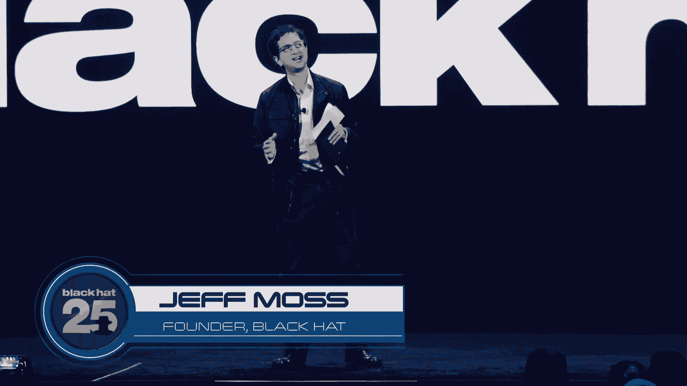
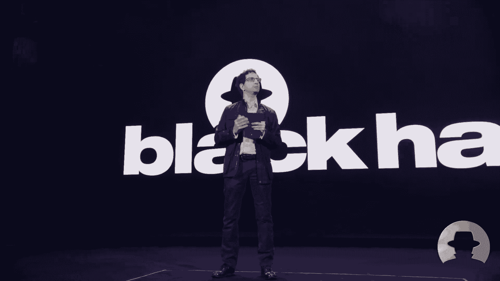
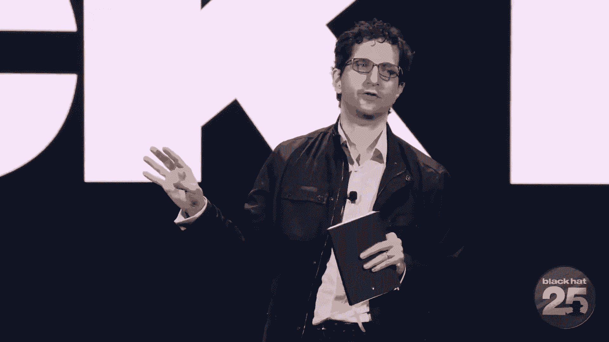

# P40：043 - Keynote： Black Hat at 25： Where Do We Go from Here？ - 坤坤武特 - BV1WK41167dt

欢迎来到舞台，黑帽创始人杰夫·莫斯，哇哦。

我们在今年的两个五周年纪念日全面恢复了效力，太神奇了，每个人都不停地来看演出，我想和你分享，我们是如何来到这里的。

但在我们开始之前，我有一些小通知。

我要谈谈黑帽的创作，我的几个想法，然后这将是我的荣幸，介绍我们今天的主讲人，克里斯·克雷布斯，所以好吧，让我们开始吧，我通常跑遍人们来的所有国家。

戴着黑色帽子参加，试图展示我们是一个多么全球化的社区。

今年有来自111个不同国家的人。

那就是我不会通过它们，这需要一段时间，我以前只去过一个人的国家。

然后你会看到三四十个国家只有一个人参加，所以现在我只是把它聚集在一起，但我要让你知道，行星在这里。

这是因为我们都渴望同样的东西，我们都在想到底是怎么回事。

我是说，就在我们认为我们拥有它的时候，发现事情变了。

如果你五年前问我，就像它会有多动态。

我很认真地说大部分的安全将在25年内被烘烤，他们想出了如何在两年内发射火箭，二十五年后登上月球，在四分之一世纪的时间里，很多事情都被解决了，我们还在想办法，你试着打开和关闭它吗，你知道的，所以说。

所以不要难过，如果你还在试图弄清楚发生了什么，努力保持社区的发展，因为我们都在变老，因为我们不会很快解决这个问题，我们如何培养下一代，更多元的视角。

因为当时只是一个网络工程师试图让计算机工作，你需要一定的工程视角，但现在当你处理错过和令人沮丧的信息时，你在处理技术的社会影响，我们需要更多的人在房间里试图解释发生了什么，这项技术的意外后果是什么。

那顶黑帽子也是如此，多年来一直为不同的社区提供奖学金，试图把他们带到我们的社区。

所以没什么不同，今年我们有一个学生奖学金项目。

发放了132份奖学金，如果你在观众席上，当我喊出这些东西的时候，你想举手和周围的人见面。

请这样做，如果你是一个获得奖学金的学生。

谢谢你。

哈哈哈哈，你根本不知道你签了什么，你有没有，黑帽老兵奖学金计划十五，行政妇女论坛，妇女的安全和隐私。

网络柔术妇女协会二十五，戴安娜倡议二五，黑人女孩砍了二十五，所以感谢大家花时间申请奖学金，并欢迎，所以我要简单地探究一下黑帽的早期，我不太谈这个，因为当你离它如此之近，你假设每个人都知道。

你意识到他们可能不会，也许在我们结婚五周年的时候你会觉得很有趣，所以在早期网上没有什么真正重要的东西。

所以你能造成的伤害真的不大，如果你黑东西，但是当这个点，com boom开始建设，每个人都想上网尝试电子商务，黑客们，我们自然而然地成为了得到工作的人，因为没有足够的人了解网络是如何。

我知道有些东西在沸腾，Defcon，三度空间，三四个，我开始收到要求做一个听起来很专业的公告，如果你知道Defcon，我是说，如果是半派对，半黑客恶作剧，就像。

我最不想做的事就是为def con做一个听起来很专业的公告。

但我做到了，我把一切都做得很专业。

你可以把它给你的老板，骗他认为，他要去参加一个真正的会议。

然后第二年又发生了，就像。

我不想一直做这些虚假的专业声明，我的朋友雷·卡普兰，甲板上最初的白胡子太监之一，他说你知道你应该做什么，他们想要。

向他们收取很多钱。

我就像，真是个好主意，但是我没有钱，所以一年后我开始了，我们开始停电，比我想的晚了一年，但我得到了贷款，它最初被称为井，听起来有多棒因为你知道，有一些关系网，有一些安全措施。

但也是在我们开始给所有东西都涂上颜色的时候，黑帽子和白帽子，所以我。

我正在和一些同事讨论这件事。

公司的市场总监来了，我在计算公司工作。

不再存在，第一只在纳斯达克上市的互联网安全股票。

市场总监走过来说。

NSC听起来很糟糕，黑帽子听起来很吓人，你应该这么做，她走开了。

我就想好吧，如果她说她是营销人员。

我相信她，它最初被称为黑帽子简报，现在我们是黑帽，但我们是黑帽简报会，因为这个想法是，我们想告诉你黑帽子在干什么。

我们要向你简要介绍黑帽子，整个概念就像一个水晶球，如果早期安全研究人员的黑客认为这些东西很有趣。

那也许你会觉得很有趣，如果他们今天担心，也许明天对你来说是个问题，这就是我们的公式，非常实用，手放在从业者身上，这不是一个总体计划，那正是我认识的人，我是说，我真的打电话给我的朋友，说嘿。

我在努力做这件事。

你想说话吗，所以社区在周围形成，你认识的人，就像布鲁斯。

施奈尔、穆奇和多米尼克，布津斯基，亚历克斯。

只是路线，弗拉克杂志的编辑。

不管是谁，你知道你把你的朋友们召集在一起，我们都不知道如何主持会议，对，没有关于它的书，没有谷歌或亚马逊关于如何主持会议的书籍。

所以我们想通了，就像安全方面的其他事情一样。

我们都看到了，还记得我们要发布报告告诉消费者如何购买产品，知情的消费者会做出更好的选择购买更安全的产品，我不知道没有用，不过没关系，我们有备用计划，我们的后备计划是保险公司，因为现在公司正在转移到网上。

一旦公司在线，他们欠保险公司的债，保险公司会强迫他们购买更安全的产品，然后当公司购买安全产品时，消费者会跟着，好的，不过没关系，我们有备用计划。

好的，所以现在我们又回到了试图教育消费者的问题上，所以我们处于这个生命周期中，我们面临着几个新的挑战，我将简短地，就说其中一个。

我们想我们知道它是如何工作的。

我过去谈到过团队法治。

尚未决定的团队，所有中间的国家都被这样或那样的方式拉着。

团队法治在信息获取方面更加开放，更透明的信息共享模式，更多的信息可能是非常危险和有害的，因此，他们需要限制和控制它，介于两者之间的人还没有决定，他们可能永远不会决定，但你让人们被拉在两者之间。

随着时间的推移，这可能会加剧，我不会感到惊讶。

如果几年后在路由方面真的有某种法治网络，介于两者之间的人有点争议，我不喜欢它来自，我可以我想要一个开放的互操作互联网。

但我现在也是一个现实主义者。

在那些相互竞争的群体之间。

我想他们一直在那里，但他们从来没有站在最前面。

当俄罗斯入侵乌克兰时，一股新的力量出现了。

我叫他们，我有了这个想法，我不记得最初的来源了，但它是超级被授权的个人或超级被授权的组织，也不是政府，也不是微软，可能是一群人或一个人，让我给你一个关于超能力个体的想法。

这里有多少人，对呀，有多少人使用，比如拖放列表或博格过滤列表。

对呀，你指望其他人来创建这些列表。

那个，然后用于限制对电子邮件或路由的访问，对呀，所以这样想吧，经营垃圾邮件屋的人，他们超级有力量。

他们可以添加一些东西，垃圾邮件列表的域名。

你会把交通放下，他们有巨大的影响力，所以俄罗斯入侵乌克兰。

人们被激怒了，战争罪。

人们想产生影响，人们很生气，他们认为政府做得还不够。

政府开始制裁。

人们擅长什么，MongoDB项目开源数据库大项目。

他们决定再也不要了，俄罗斯在MongoDB枢纽上的项目。

他们只是删除了所有俄罗斯项目繁荣消失了。

我会有点像GitHub，只是决定删除俄罗斯的一切，在。

u，k，董事会聚在一起，律师给你的，律师说对这些富有的俄罗斯人有这些制裁。

你在俄罗斯卖域名，我们担心信用卡付款，你在俄罗斯处理信用卡有很多责任，所以董事会提名人说你知道吗。

我们不会在俄罗斯处理信用卡。

在俄罗斯没有人可以更新他们的域名，你觉得有人会蹲在他们身上吗，它们过期就像，所以公司蜂拥而至，想做点什么的社区，是超级授权的，他们是球场上的新球员，在过去的日子里，我们必须学会接受这一点，保罗。

如果你在房间里。

我可能会取笑你，保罗，Vixie。

当时保罗是购买DNS程序的主要作者。

拜登，这是几年前的事了，也许十年前，十五年前，它有大约82%的市场份额，所以82%的互联网域名解析来自绑定，如果保罗想改变束缚，他本质上是保罗，一个人，对呀。

我只是在想，是啊，是啊，但是保罗，你知道吗，我是说，你得到了，如果保罗不满意。

你可能会说你知道吗，我们不会再有到俄罗斯的域名服务了。

如果Paul想改变根提示文件并添加新的根服务器，我想现在发生的是，我们必须认识到这一点，它一直都在，但我们有巨大的影响力，我们的社区有巨大的影响力，J开发人员有。

我们必须认识到这一点并拥有它。

对呀，这些超级有能力的人，所以当我和政府的人交谈时。

说，有一个倡议，稍后将有一个会谈，本周关于制裁网，制裁网背后的想法。

周围有一张打开的纸，这种想法就像你的垃圾邮件阻止列表一样，就像你的下拉列表一样，是否应该有一个列表来枚举所有的网块。

和受制裁个人的域名，受制裁的公司或政府，所以MongoDB不必删除俄罗斯的所有内容，MongoDB可以说，你知道我们在执行制裁名单吗，制裁名单上的任何人都不能连接到我们的服务。

电子邮件地址，随便啦，他们可以更具体地针对政府实体，而不是这些无辜的互联网用户的普通人群。

与入侵乌克兰无关，说是，我们不应该，我们不应该，它拉开了这场大辩论的序幕。

其他一些工程型社区的人让他们思考，也许他们的角色，他们有什么义务。

有没有，他们所做的任何道德考虑。

所以说，工程师们不得不挤在一起，我们很好，没问题，我们所做的一切都很完美。

没有必要质疑我们的任何决定，哦上帝，自我反省发生在周末，你知道我们现在都很好，所以当我和政府里的人谈论这件事时，他们说我们有点紧张，因为制裁是我们所做的，各国政府，就像耶，但我的意思是公司有权为。

他们想要的人，如果他们不想找你，他们不是冲着你来的，哦耶，我们明白这仍然让我们紧张。

就像耶，欢迎来到我们的世界，你知道我们对发生的很多事情都很紧张，所以你最好加快步伐，政府，因为我们要填补空白，如果你不在工作岗位上，所以我在想，期待着，我们从这里走向何方，我看得出来会更混乱。

我可以，我可以看到我们所做的会变得更加重要，我知道我们可能会被要求处理一些问题，我们不是传统的话题，我们处理对了，阴郁信息小姐直到2015年才真正成为一个研究领域，二十四，现在二十五。

这一切都是关于我们如何创建模型、过滤内容或识别内容。

所以我很荣幸向大家介绍。

克里斯·克雷布斯。

这是一种欺骗，因为另一个是亚历克斯·斯塔莫斯。

他也是过去的黑帽子基调。

他会给我们他的见解，看看他认为我们会从这里走向何方。

接下来会发生什么，我们熬过了前四分之一世纪，我们将来会面临什么。

因此，我很高兴地欢迎你们大家，非常感谢你能来。

现在我要把它交给克里斯·克雷布斯，哇哦，早上好，大家杰夫，谢谢你的介绍，这个演讲被评为TLP红裤子，很高兴回到这里，谢谢你今天早上的介绍，现在有点早，我们又回到拉斯维加斯了。

我不知道自从Covid之后你们回来过多少次，但回到这些大团体里有点奇怪，所以谢谢你今天早上能来，这可能会很有趣，所以当杰夫和史蒂夫向我伸出手说嘿，你知道我们希望你考虑开放黑帽，我有点被我要说的话难倒了。

你有这么多员工，你可以提前三个月要求去发展一些主动性，你可以在一个大型会议上发布，所以我没有，当你是小贩的时候，你可以推出一个新产品，我没有那个，所以我在想，我就像，哦上帝好吧，所以说，我该怎么办。

我有什么，有什么不同，我能给这带来什么，所以我真的开始思考我在中情局的时光，我为什么在那里，我在那里做了什么，我可能会补充什么，那很有趣，我真正想说的是，我是个造桥工，我是一个合作伙伴建设者。

我把人们聚集在一起解决问题，我是老二，这是一部分，对呀，你总是努力寻求妥协，识别问题，与团体一起提出解决方案，解决我们面临的一些挑战，坦率地说，这是，为什么我倾向于认为我们在中情局是成功的。

我来对地方了，在正确的时间，在美国历史上一个特别重要的时刻，我觉得我们做得很好，所以我想做的是把这种体验，这次谈话的味道，在过去的18个月里我一直在做什么，有点在荒野中徘徊，走遍全国，其他国家也是。

联邦政府，州和地方，试图理解他们试图完成什么，他们的愿望是什么，他们的希望是什么，他们关心的是什么，他们的挑战是什么，是什么让他们晚上睡不着，所以在所有这些对话的过程中，似乎我们都围绕着三个主要问题。

第一个问题是为什么现在这么糟糕，为什么我们似乎在打这场艰苦的战斗，所以当我们通过我的拍摄，他们集体接受了为什么，我们认为现在很糟糕，你知道它有点像这个支点，我是说一切都会好起来的，然后他们看到我的反应。

他们就像你什么意思，情况会变得更糟，所以我们就很好地工作了，外面的趋势线是什么，市场压力有多大，我们看到的力量和拐点是什么，在我们前面，正在影响技术，各国政府，坏演员，我们这些人。

然后每个人都瘫坐在椅子上，就像我们到底该怎么办，因为这不是没有希望的，对，我们可以在这里做一些事情，这就是我今天想和你们一起努力的，为什么现在这么糟糕，你什么意思，情况会变得更糟，和第三次。

我们该怎么办，作为一个社区，我们如何才能在这个星期在拉斯维加斯的这个房间里，我们能做些什么来帮助解决我们面前的挑战，那么为什么这么糟糕呢，有四个原因，在我看来，这不仅仅是出于，但主要原因是，这是技术。

是坏演员，是政府，是的，是的，是我们，是人，所以在技术方面，我觉得，对我来说最好的总结是什么，是几年前丹尼尔·米斯勒引用的一句话，如果你不跟着丹尼尔，就报名参加他的，每周通讯，你真的错过了。

但他的报价基本上是软件仍然脆弱，因为不安全产品的好处远远大于坏处，一旦这种情况改变，软件安全性将提高，但片刻之前，回声，布鲁斯·施奈尔十年前说过的话，专注于生产力的企业内部，减少摩擦，首次上市。

是的你想成为第一个进入市场的人甚至是第二个进入市场的人，但安全被视为摩擦，发生的事情是，随着我们将越来越多的安全产品集成到用例中，我们现在使风险管理变得更加复杂，在我看来，在云端，所以在过去的几年里。

但我们也降低了事情的透明度，你看不到云的底板上发生了什么，所以我们把它弄得更复杂了，我们也开始增加额外的产品，在基础设施之上，在平台上，我们有了软件作为服务的爆炸机会和选择，然后一路上。

我们的领导变得非常有效率，这正在发生，随着经济逆风即将到来，在组织里说，你看，如果我做不好，我会找别人做得很好，为我做这件事，我们谈论的是人力资源、工资单和企业管理服务，所以我们正在制造更多的产品。

由于市场压力而设计不安全的，然后我们让它变得越来越复杂，有好消息对吧，我们在这里，十年前的证据，回想一下有多少产品，供应商，证券产品权，我们有一个充满活力的，强健的生态系统，而且是的，供应商。

技术供应商正在解决一些潜在的漏洞，但它是否以我们希望的速度发生，但我们在这里真正谈论的是什么，通过产品的多样性、复杂性和用例，这是一个税收表面，对呀，这是坏人进来得到他们想要的东西的机会，我想。

在过去的几年里，在勒索软件上，什么是勒索软件对，是一个坏人想出了如何赚钱，漏洞或配置错误的系统，就是这样，他们提取了价值，丹尼尔·米斯勒所说的东西，并能够通过加密货币来拯救雅典，与此同时。

这分散了我们情报界的注意力，那是五年前专注于最高级别的威胁，中国小姐，SVR，g，U FSB，伊朗IRGC，现在他们不得不扩大对威胁行为者的看法，我在这里的看法是，我们有点崇拜高级持续威胁。

我们在MSS上旋转过度了，我们在SVR上旋转过度了，当网络罪犯同时吃了我们的午餐，当这是设计基础威胁时，这一直是每个组织的威胁模型，如果你在网上，你在他们的竞技场上，如果你使用电子邮件。

他们的机会主义目标要大得多，也就是说，我们不能把目光从威胁等级的顶端移开，我们看到的是顶部的线程演员，他们明白我们业务的变化是什么，他们明白我们正在让事情变得更加复杂，我们依赖更多的软件和可信的更新。

我的商业伙伴，亚历克斯在六个月前的一次会议上说了一些让我印象深刻的话，运输产品或运输目标的公司，如果您正在托管一项服务，你就是目标，目标设定就是这样发生的，对于SVR和MS，他们明白。

我们对软件服务和技术提供商的依赖关系和信任联系，他们正在往上爬，通过供应链，有一个可怕的笑话，我会告诉你的，几十年前，威利·萨顿大银行抢劫犯，他们问威利，你为什么要抢银行，他说，因为钱就在那里。

软件提供商也有同样的想法，与托管服务提供商，为什么对手瞄准软件供应链，因为那是通道，数据就在那里，在规模上工作的能力，从一个到多个，进行突破，这就是我们看到演员们这样做的，政府做得好吗？政府一直在努力。

我会用U，He’他的政府在这里，政府一直在努力平衡，结果，如果你问金融服务部门，乡亲们，他们说，你什么意思，不均匀，我们规定了星期天的六种方式，这在联邦和州一级对银行的规定上是重复的，然后它就掉下来了。

所以我们看到了政府在这里的斗争，结果我们没有得到我们想要的结果，他们不一定做对，他们做得不好，我们看到过度依赖检查表和遵从性，而不是基于业绩的结果，我想我们在这里看到了进步，自从发布以来。

最近的一些性能指导，我们需要更多的，我们也看到了，与政府合作仍然困难的情况，私营部门的组织仍然很难知道与谁合作，是联邦调查局吗，是茜莎吗，是能源部吗，是金库吗，我不知道该去哪里，与政府合作仍然太难了。

在价值支柱上并不像需要的那样清楚，你必须解决这个问题，最后一件事是政府也必须清理自己的行为，我在网络空间日光浴室看到的建议之一，部门和机构，特别是在文职部门，在那里你有101个民事机构。

他们每个人都在运行自己的电子邮件服务，所以我们必须解决这个问题，最后一个原因是我们，这是人民的权利，我们的领导人没有领导理解网络风险的首席执行官，由于商业风险很少，现在它正在改变，你知道的。

我想去年殖民地唤醒了很多人，但我们没有一个系统，我们也有劳动力挑战，两周前在白宫举行了一次峰会，大型科技公司来了，他们做出了承诺、承诺和支持，我们现在有各种各样的倡议，旁边是黑帽子，我们有戴安娜倡议。

如此如此，我们有机制，我有五个孩子在K到12系统，他们上的是一所很好的学校，但他们没有机会，我们没有以技术为导向的课程，像其他一些国家一样，我们要解决的另一件事，所以当我们离开这里，思考，嗯。

我们从这里要去哪里，我联系了一群人，比我聪明多了，我说，你看，你对这事有什么看法？现在发生了什么，三四年或五年后，事情会变得更好而不是更糟吗，所以你看跌或看涨，短期内，看涨，从长远来看，事情会变得更糟。

在他们好起来之前，是一种外卖，这真的是一个迷人的二分法，所以我想崩溃并理解，为什么我们会看到，我们现在看到的压力是什么，或缺乏，可以延续这些趋势线，是不够的，他们不是我们作为一个社区。

希望他们用技术回到顶端，会有更多的东西联系在一起，我们有一种病态的需要，把东西连接到互联网上，我会用一些修辞手法，就是让人们闭上眼睛，坐好，三思，四年后的未来，你在办公室，你在家里，你在你的车里。

你在医生的办公室，不管怎样，会有更多，你周围的事物，正在收集数据，正在生成数据，我是说答案，当然更多，在我们家里的车里，在我们身上，在我们的身体里，更多，我是说。

你们中有多少人戴着这些光环环来比较彼此的睡眠模式，这些东西产生了难以置信的数据量，排气，数字排气，又是这样，就是这个机会空间，它们变得越来越复杂，不少于，我回想起一千九百八十四。

威廉·吉布森出版《神经漫游者》一书的那一年，我想大多数人记得神经漫游者创造了网络空间这个词，但对我来说，这就是他描述网络空间的方式，太迷人了，这真的引起了我的共鸣，网络空间不可思议的复杂性。

我们现在就在那里，我问过像这样的人，你真的明白吗，云如何在各种超大规模供应商中工作，以及你如何与它互动，你有多大的能见度，答案并不总是你想听到的，所以事情变得越来越复杂，我们正在产生更多的数据。

但我再说一遍，以二十五岁戴黑帽为证，生产和生产解决问题的产品，我们有技术供应商正在努力解决基础设施中的核心问题，但它是以这样的速度发生的吗，我们希望它，我们需要它为什么，因为坏演员得到了他们的胜利。

并给他们带来成本，他们会继续勒索软件在这里，它是如此普遍，它变得专业化了，进入的门槛也降低了，现在他们有了利用的可用性或选项，就在几年前，这是民族国家的职权范围，因为钱在那里，他们在获利。

这不会让他们付出任何代价，他们感觉不到疼痛，幸运的是，这种情况在一定程度上发生了变化，我们刚刚看到一个搅拌机被批准了，前几天的龙卷风，所以我们必须做得更多，这只是非国家行为者，国家行为者呢。

所以我们通常谈论中国，俄罗斯，伊朗，对呀，但事情是这样的，我是说，地球上的每个国家都在关注数字生态系统，作为一个新的领域，第五域，他们正在发展间谍活动的能力，用于国内监测，是的，是的。

他们也在研究破坏和破坏的能力，所以我们有一个威胁演员集，那绝对是爆炸，猜猜会有什么水花，不久的将来新的和新颖的事件，回想过去的几年，我是说，让我们从乌克兰开始，俄罗斯人连续两年在乌克兰熄灯。

然后我们有一个哭泣，然后我们没有佩查，然后我们有了坏兔子，然后你进入SVR，在贝勒姆和太阳风中，它还在继续发生，而且会继续发生，在政府方面，我们在过去一年左右看到，但我认为我们将看到一些资金的放缓。

我想我们会看到，这样我们就可以有适当的市场干预，政府仍然必须弄清楚如何参与，如何管理自己的系统，然后我们有人的部分，是啊，是啊，我们的领导人一天比一天聪明，我们有人退出了劳动力市场。

我们有一个人进入劳动力市场，我们的劳动力越来越倾向于科技，这实际上可能是，那我每天都是最乐观的，我们的劳动力越来越倾向于科技，他们更精明，但杰夫暗指的是，关于迪斯小姐和虚假信息的文章。

他们是否变得更加敏锐的批判性思维技能，伴随着我们正在寻找的技术悟性，我问网络的第二个问题很好，你的短期看跌，长期看涨，帮我理解那个支点，我们将如何做出改变，影响点有哪些，拐点，瞬间，塑造未来的机会。

再次从技术端开始，有围绕一组核心主题的答案，所以技术，我们得出的结论是杰夫所说的，围绕俄罗斯入侵乌克兰组织的一些决定，企业必须有一套原则，你必须建立你的价值观，你是谁是一家公司，你在那里要完成什么。

你打算怎么做，你的红线是什么，当俄罗斯入侵乌克兰时，我们和几家不同的公司合作，他们说，你看，我们不受制裁的影响，所以我们很好，我们真的不需要担心，我们的看法不是看，我告诉你。

当战争罪行的图像开始出现在电视推特和其他地方，你会有麻烦的，如果你继续，你现在就得做决定，关于你是什么样的公司，你是如何坚持自己的，所以你必须有这些原则作为其中的一部分，我们也要明白。

如果你现在是互联网结构的核心，这是经济结构的核心，你可能不在情报界，你必须认真对待安全，你得把它当成板房，这不仅仅是大银行，大型科技公司，这是越来越中端的市场。

在过去十年中变得具有系统重要性的技术公司和软件提供商，以及访问一个组织的敏感皇冠珠宝的能力，你必须以不同的方式思考你的威胁模型，所以你必须设置，制定那些原则，第二部分是我们的产品对吧。

我们需要继续开发产品来解决我们每天遇到的挑战，但我们也需要拥有，管理，操作，发展，部署核心，是啊，是啊，我们在边缘工作，我们在边缘做得很好，但回到核心，产品和解决方案，我们必须解决持续存在的难题。

而且是的，它可能会影响您的安全服务的底线，商务，但更重要的是解决潜在的挑战，而不是边缘的创可贴，最后一件事是我们需要领导者为未来两个季度做计划，你得看三到四年，所以现在每个公司都应该进行模拟场景。

影响评估，我的供应链，我的市场，政治逆风怎么会影响我，怎么会影响我的IT操作，你必须把这些事情解决掉，因为我不知道明年明天是否会发生，三四年后，他们很有信心，如果你想降低你的运营风险，管理组织的风险。

你必须从昨天开始，如果您想对网络进行物理分割，所以我们需要组织向前思考，不仅仅是处理今天的问题，但提前计划并开始实施你想在两到三年后，然后我们有政府，政府如何塑造未来。

所以我倾向于认为政府有四个主要角色，他们如何与技术和数字生态系统互动，U，s，U，s，政府本身就是一个庞大的数百亿，只是害羞，可能有一千亿，那只是在平民方面，它的消费者，产品和服务，他们需要使用它。

他们必须把标准定得更高，最低价，技术上可以接受，不能是采购和购置模式，我们必须加快速度，否则我们就得更快地失败，我们必须继续前进，执行侧的第二块，那是规定，那是执法部门，所以在调节方面。

市场现在不起作用，我们需要更聪明的法规，这些法规是基于结果而不是清单来确定和建立的，它必须聪明地观察经济本身以及这些核心功能是什么，所以我们不一定是在谈论中小企业。

但如果你是支撑经济连续性的关键基础设施，我们必须更好地了解执法方面的安全态势，联邦调查局对对手采取更积极的行动，我们需要继续，我们需要从更长期的调查转向，在防止他们的能力，强加成本。

消除了他们从美国公司榨取价值的能力，s，在防守方，我们需要网络指挥，我们需要情报界继续推出，向前迈进，U，更好地了解TTP是什么，国家行为者的能力和恶意软件，他们把它带回来的好处是什么。

我们揭露了其中的一些活动，但我发现更重要或更有价值的是，我们还知道了他们的目标是什么，使目标变硬，你知道对手感兴趣的，我们需要更多的，最后是使能者方面，是啊，是啊，我要说出来，我是荷马。

继续投资和建设中情局，使组织更容易、更不复杂地与政府合作，并从中获得价值，而不是去五六个不同的机构，使前门清晰可见，在我看来中情局，我们还需要做更多的，我们在俄罗斯乌克兰的比赛中看到，冻结了俄国人。

这是有效的信息战，我们需要更多的，我们需要把这些信息交到捍卫者手中，所有这些都说了，我没有天真到认为，我准备提出这样的论点，在过去的两个五年里，我们周围的数字环境发生了如此巨大的变化。

而我们的政府没有跟上，步伐迟缓，斜线的轨迹不一样，我认为是时候重新思考政府与技术互动的方式了，我想我们需要好好看看，政府有组织的，这是有先例的，一千九百三十九，一千九百三十九过去了。

建立一个为人民工作的民有政府，我们现在在同一个空间里，我想我们得好好看看，我们是有组织的，让一个更聪明的，更有效率，更有组织的政府，我已经准备好带头冲锋了，在阿斯彭研究所工作，与阿斯彭数字公司的团队。

我们要看看这个，我们将看看不同的结果是什么，我们可以从很远的范围内看到的各种组织结构是什么，s，可以利用中情局元素的数字机构，NIST和NTIA的元素，国家实验室的能源部，也许是FTC和FCC的零碎。

但要建立一个专注于增强更好的数字风险管理服务的机构，我说的不仅仅是网络，谈论隐私，谈论信任和安全问题，我们不在我们需要的地方，我们落后了，美国人因此而受苦，但你知道吗，我现在也没什么信心。

可以在想象中得到更广阔的东西，是那样的努力，所以我们必须考虑不同的可能结果，光谱的另一面可能是像拉西萨这样简单的事情，离开国土安全部，作为子内阁机构，我们还得想清楚，我们优先考虑什么，我们在优化什么。

是公私伙伴关系吗，我们必须更认真地审视我们的组织方式，我也没有天真到认为技术供应商，政府会自己解决这个问题，修复任何一个，正如杰夫提到的，会落到这个房间里的人身上，他们本周在这里参加夏令营。

在这个社区里，它将把我们作为领导者，做出我们希望看到的改变，所以当我回想起我在中情局的时候，我有一个很基本的领导方法，它是基于我从微软老板那里偷来的一个框架，是五个PS。

我说如果我们在那五个PS中成功并获胜，那么随着时间的推移，我们作为一个代理机构将会成功，当我们在研究我们是如何做的时候，我突然想到我们少了一块，P是合伙人，中情局从根本上说是一个公私伙伴关系的自愿组织。

所以是的，你必须有你的人而没有你的人，你什么都没有，所以你必须拥有它，对我们来说，下一个最重要的是合作伙伴，然后是政策和方案，公共事务与政治，但结果是6个P，我喜欢5个，你知道奇数，所以我们放弃了政治。

这是有原因的，因为现在网络安全必须与政治无关，非政治性，然而，你想叫它，我们就是这样跑的，cia，在东方看到杜松子酒真是太棒了，延续这一传统，这是我的工作，这就是我们在人们下面跑的五个PWE，伙伴。

政策方案，公共事务，所以当我站起来的时候，一个咨询公司说，我如何应用相同的模型，同样的心态，领导，归根结底是原则，得知道，你所代表的，什么对你重要，以及你将如何扮演人们，当然啦，你的人，伙伴，规划。

谈到了规划篇，然后是公众参与，和公众参与文章，它是关于透明的，关于坦率，直率，与合作伙伴保持和建立信任，看看这件事，过去一年的答复来文，或者是坦率坦率的组织，对正在发生的事情透明，计划是什么。

以及他们是如何解决这个问题的，他们是那些对伴侣保持信任的人，他们的政府客户，所以公众参与是领导力的一个非常重要的部分，但回到人的部分，我们再次需要更多的他们，这对我来说有点困惑。

我们如何继续面临劳动力短缺，我们听说社区中有300万个开放的网络安全工作岗位，我只是想弄明白，为什么我们不解决差距，为什么我们不缩小差距，所以几周前，我在一个活动和博士，休·汤普森，原赛门铁克。

现在用交叉点资本，我想他在旧金山开了另一个会议什么的，他有自己的五个元素，你如何谈论我们的社区，我们在这里做什么，在这个行业的职业生涯有多有回报，第一件事是，很有趣，我不知道你们怎么想。

但过去的18个月对我来说可能是我职业生涯中最有趣的，是呀，我在Sisa玩得很开心，我们现在玩得更开心了，第二是它的利润丰厚，我们在这个行业的报酬很高，我不得不运行一大堆不同的薪酬模型和比较。

就像我们在西萨一样，去弄清楚，为什么我们不吸引我们需要的人才，当你看到这个行业的薪酬时，很有启发性，所以耶，报酬很高，第三个相关的，它很耐用，我们将应对这些挑战，在我们的余生中。

也许在人类历史的其余部分，会有数字和技术相关的风险问题，我们必须解决的问题，所以它很耐用，这也是非常有趣的东西，与技术的碰撞，风险一直是我们必须解决的迷人问题，最后一件事我已经谈过了，任务，影响。

我们正在做的事情的重要性是难以置信的重要，所以我们必须开始讨论我们在这里做什么，我认为这会吸引劳动力，我认为休斯在这个故事上有了一个很好的开始，但是这里的最后一块，不是在领导身上，不是每个员工都有责任。

这是我们个人的，所以上周我有机会上了一个播客，这叫做五因素认证，和一个叫希尔·哈珀的人在一起，他是哈佛的律师，但他也是个演员，他在里面，他得到了游戏和CSI，纽约和好医生。

但现在他做了关于这个生活的播客，健康充实的生活，他在最后问了这个问题，我还没准备好，但问题是五个因素是什么，你生活的基础--在线和离线过上有意义的生活，就像我说的，我还没准备好，它。

我花了一点时间才弄清楚，但我的第一个回答又是，原则，弄清楚你是谁，你所代表的，你将如何过你的生活，过你的生活，因此，我得知道什么对你很重要。

你所代表的，然后在必要的时候表明立场，第二件事是人，我今天谈了很多人，找到你的人，查找您的支持网络，如果是家人，我们本周要做的大部分工作，在这里是关于我们的人，我们的网络，找到你的人，他们会支持你的。

帮助他们，他们会帮你的，第三个因素是生命太短暂，不能为混蛋工作，所以不要，现在我不是说，明天辞职，因为那样太愚蠢了，但如果你不开心，如果你不被重视，如果你不被尊重，如果你没有得到你认为你应该得到的待遇。

制定计划，为你找到那个地方，和你的人一起工作，第四个因素是人生苦短，不能吃难吃的食物，我真正的意思是，找到你喜欢的东西，这给了你有意义的价值，在你的日常工作之外，对呀，我就是这么想的。

这个社区做得非常好，所以在Covid期间布赖森，bort，独角兽，厨师，我得上几次，但它把人们聚集在一起，它可以让你和你在这里看到的人联系和发展，那么莱斯利。

carhart和kimberdowsett正在做简历评审，找到给你价值的东西，让你觉得有回报，不管是在你的社区，不管是在外面，不管是什么，找到给你目标和价值的东西，最后一个因素是为了上帝的爱。

不要阅读评论，不要在网上听一些胡说八道，这告诉你，你吸的权利，这就是为什么你有你的关系网，寻求反馈，有意义的，来自员工的建设性反馈，我现在就告诉你，如果你知道你代表什么，如果你按照这些原则生活。

如果你周围有一群人，支持你的你，你支持他们，如果你在，只是你的工作，当你跌跌撞撞，你就会，我们都跌跌撞撞，你要站起来，你要继续前进，所以当你今天离开这里的时候，聪明点，注意安全，但这周做点好事。

帮助某人，我有信心我们能解决这个问题，我们可以向前迈进，获得那些安全，我们试图实现的安全结果，所以说，谢谢你今天上午抽出时间，聪明点，注意安全，做点好事，帮助某人，谢谢。好的，几个家政公告。

真的很快，下次会议10点20分开始，今晚在营业厅会有很多活动，从今晚开始还是从现在开始，我想我们有军火库的工具，营业厅演示，今天和明天，看看一些新的应用程序，工具创建者的一些演示，然后晚上在演示中。

我是说，在白天晚上举行演示的世界里，欢迎招待会从酒吧爬行开始，今晚四点到五点，下午5点，它切换到欢迎招待会，同一地点，下午五点到六点，然后在五点半的招待会上进行到一半，臭名昭著的小马奖开始了。

那是在泻湖K和L，然后明天九点回到这里为我们的一天，与金·泽特的两场主旨演讲。

所以非常感谢。