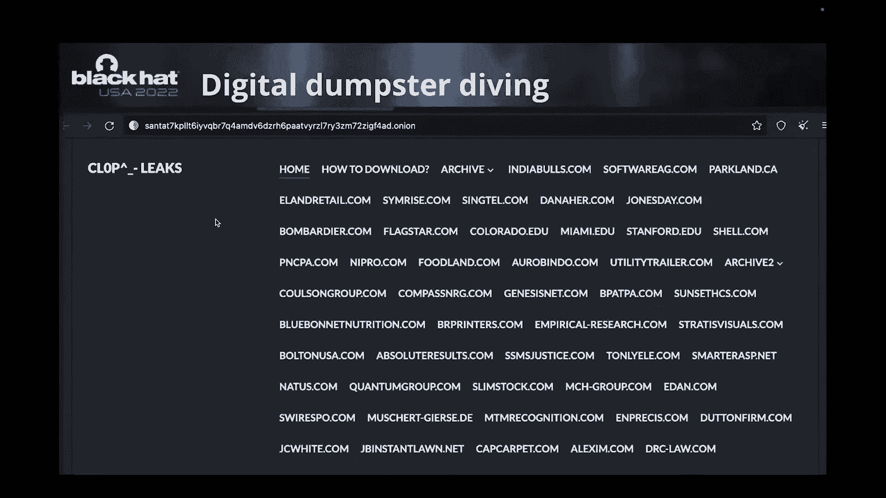
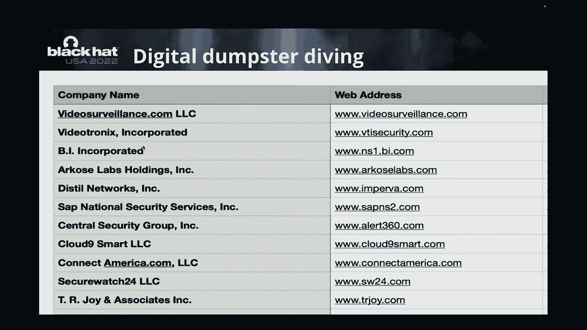
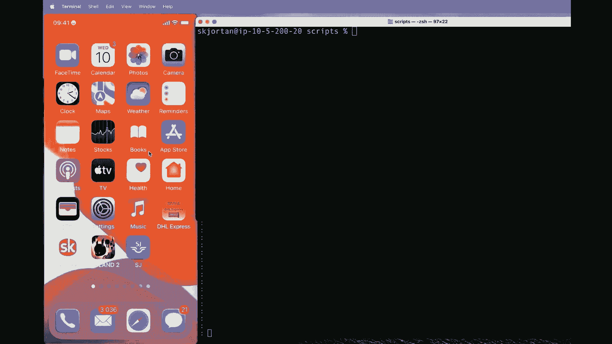
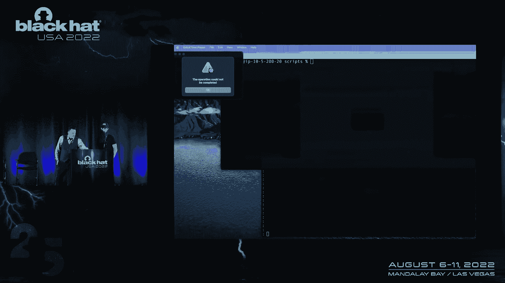
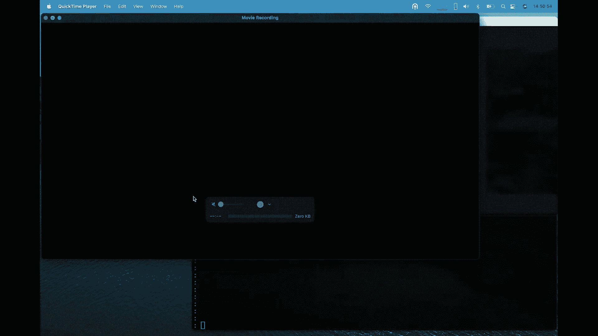
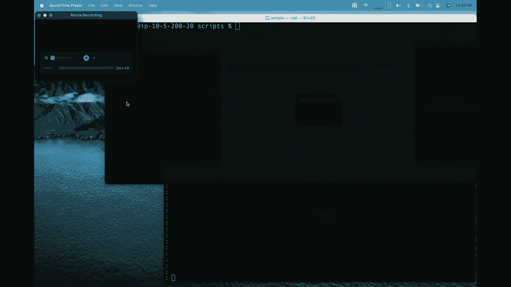
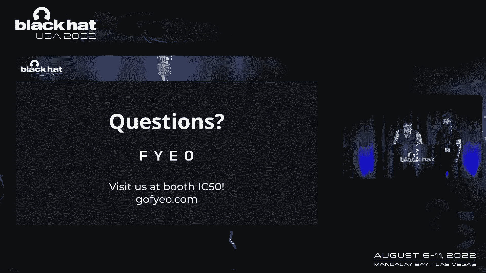

# 课程 P41：044 - 利用OSINT、钓鱼技术与一次性手机进行基于短信的双因子认证绕过 🎯


在本节课中，我们将学习一种被称为“Smishmash”的攻击技术。这种技术混合了开源情报、钓鱼手段和一次性手机，旨在绕过基于短信的双因子认证。我们将剖析其原理、攻击步骤，并探讨防御方法。

---

## 概述 📖

基于短信的双因子认证长期以来被认为存在安全缺陷。本节课将深入研究攻击者如何组合多种技术，利用泄露的凭据和电话号码，实施高效的账户接管攻击。我们将从攻击者的视角，一步步拆解整个攻击链条。

## 短信双因子认证的固有缺陷 🚨


短信自诞生之初就不是一个安全协议。它没有内置任何发送者验证机制。这意味着，从技术上讲，任何号码都可以被伪造成可信来源发送短信。



**核心概念**：短信协议缺乏身份验证。
```
短信 = 7位ASCII编码文本 + 无发送者验证 + 无完整性校验
```




## 攻击资源：泄露的凭据与电话号码数据库 📂



上一节我们介绍了短信协议本身的缺陷，本节中我们来看看攻击者如何获取攻击所需的“弹药”——用户的凭据和电话号码。


攻击者活跃于各种黑客论坛和数据泄露交易网站。这些平台公开提供或出售从各类公司泄露的海量用户数据。

以下是攻击者获取数据的常见途径：
*   **数据泄露论坛**：用户通过分享数据或付费来获取积分，以下载泄露的凭据文件。
*   **勒索软件站点**：这些站点会公布拒绝支付赎金的公司及其被盗数据。
*   **数据聚合与索引**：攻击者会购买这些泄露数据，并将其整合到可搜索的数据库中（例如使用Elasticsearch），便于关联查询。

在我们的研究中，我们索引了约48亿条唯一的邮箱-密码组合，以及接近10亿个电话号码。这意味着平均每五个邮箱地址中，就有一个可以关联到一个有效的电话号码，极大地扩大了攻击面。

## 攻击手法剖析 ⚙️

掌握了目标用户的凭据和电话号码后，攻击者会采用多种手法绕过双因子认证。

以下是几种常见的攻击方式：
1.  **账户恢复流程滥用**：攻击者利用目标邮箱和手机号，启动账户密码重置流程，并拦截发送到手机上的验证码。
2.  **短信注入**：在用户登录后发起敏感操作（如转账）时，攻击者冒充服务商发送钓鱼短信，诱导用户输入实时生成的2FA验证码。
3.  **中间人攻击结合钓鱼**：通过钓鱼链接将用户引导至攻击者控制的代理服务器。当用户在假页面输入凭据和2FA码时，攻击者能实时用这些信息登录真实网站。
4.  **SIM卡劫持**：通过社会工程学或伪造身份，说服运营商将目标的手机号码转移到攻击者控制的SIM卡上，从而直接接收所有短信验证码。








## 实战演示：钓鱼短信与凭证窃取 🎬


现在，我们通过一个简化演示来展示攻击过程。请注意，此为教育目的，请勿用于非法活动。

**攻击链**：
1.  **发送欺骗短信**：攻击者使用API服务，伪造来自“币安”等可信服务的号码，发送包含钓鱼链接的短信。
    ```python
    # 伪代码示例：通过API发送欺骗短信
    sms_api.send(from_number="Binance", to_number=target_phone, message="您的账户有异常活动，请立即验证：https://attacker-domain.com")
    ```
2.  **用户交互**：用户点击链接，进入一个与真实网站高度相似的钓鱼页面。页面可能已预填了用户的邮箱（从泄露数据中获得）。
3.  **凭证与令牌窃取**：用户输入密码和收到的2FA验证码。这些信息被发送至攻击者服务器。攻击者利用这些信息，即可登录真实账户并完成转账等操作。
4.  **浏览器自动填充的风险**：手机浏览器可能会自动填充来自真实服务的验证码，即使当前访问的是钓鱼网站，这进一步增加了欺骗性。

## 防御与缓解措施 🛡️


了解了攻击方式后，我们来看看如何防御此类“Smishmash”攻击。


以下是几种有效的防护策略：
*   **弃用短信验证码**：尽可能使用更安全的验证器应用或硬件安全密钥作为双因子认证手段。
*   **实施反机器人验证**：在登录和敏感操作环节加入ReCAPTCHA等验证机制，增加自动化攻击的难度。
*   **配置安全的CORS策略**：正确配置跨域资源共享策略，可以防止恶意网站发起跨域请求来窃取令牌。
*   **用户教育**：持续教育用户识别钓鱼短信，警惕任何索要凭证或验证码的意外消息，并养成手动检查网址栏的习惯。
*   **监控与响应**：服务提供商应监控异常登录模式，并对账户恢复等敏感流程实施更严格的验证。


## 总结 📝


本节课中我们一起学习了“Smishmash”攻击技术。我们认识到，基于短信的双因子认证因其协议固有缺陷和大量用户数据泄露而变得脆弱。攻击者通过组合OSINT、钓鱼和通信欺骗技术，能够有效地绕过这一安全措施。关键要点在于：短信不应被用作安全的第二验证因素；同时，作为用户和服务提供商，都需要采取更积极的措施来应对这种日益增长的威胁。



---
**研究数据公开**：相关的研究数据已在遵循合规要求的前提下公开，供安全社区分析使用。