# 汽车安全课程 P43：046 - RollBack：一种新型的、与时间无关的汽车无钥匙进入重放攻击 🚗🔓

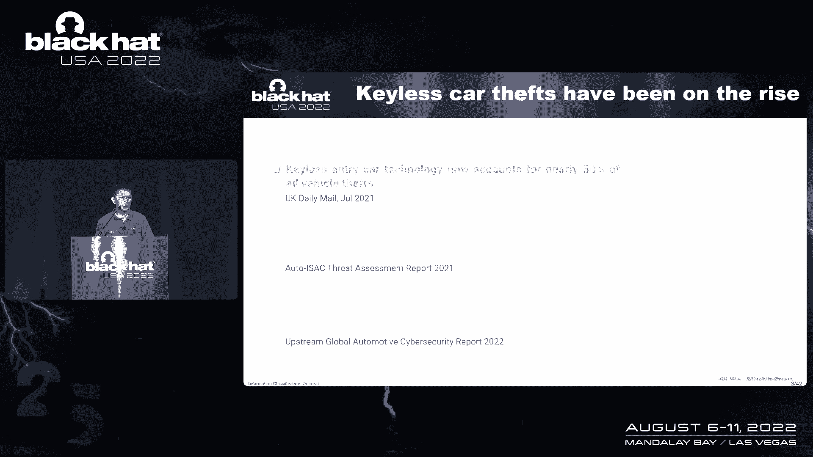

在本节课中，我们将学习一种名为“RollBack”的新型汽车无钥匙进入系统攻击。这种攻击利用了滚动码系统的设计缺陷，允许攻击者通过重放过去捕获的信号，在任何时间点解锁车辆，且无需实时信号干扰。

## 概述：日益严重的汽车盗窃问题

近年来，利用技术手段的汽车盗窃案件显著增加。例如，在加拿大奥克维尔市，仅去年上半年就发生了124起汽车盗窃案，其中超过50%涉及针对无钥匙进入系统的技术攻击。攻击者无需物理破坏车辆或接触原装钥匙，即可悄无声息地盗走汽车。

上一节我们介绍了汽车盗窃的背景，本节中我们来看看针对无钥匙进入系统的威胁类型。

## 无钥匙进入系统威胁类型

针对汽车无钥匙进入系统的威胁主要分为两类：非侵入式和侵入式。

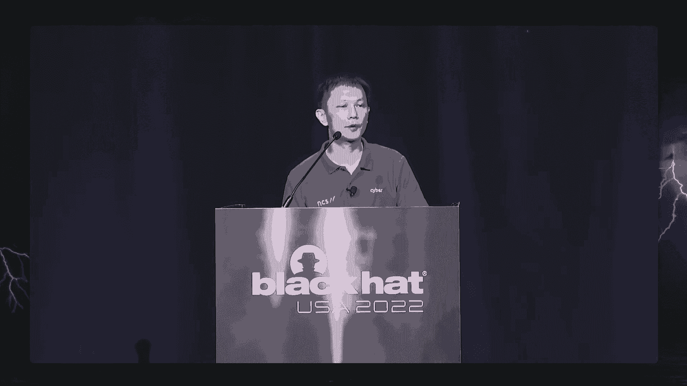

*   **非侵入式攻击**：通常涉及对无线电信号的窃听或操纵，无需接触或修改系统底层组件。例如：
    *   **信号干扰**：阻止锁车命令到达车辆。
    *   **中继攻击**：实时扩展钥匙与车辆之间的通信范围。
    *   **重放攻击**：先捕获信号，然后在未来某个时间点重放。
*   **侵入式攻击**：需要直接访问车内网络（如OBD端口或ECU），涉及对密钥管理和加密算法的攻击。这类攻击通常更复杂，需要昂贵的设备和深厚的专业知识。

本课程将重点讨论非侵入式攻击中的**重放攻击**。

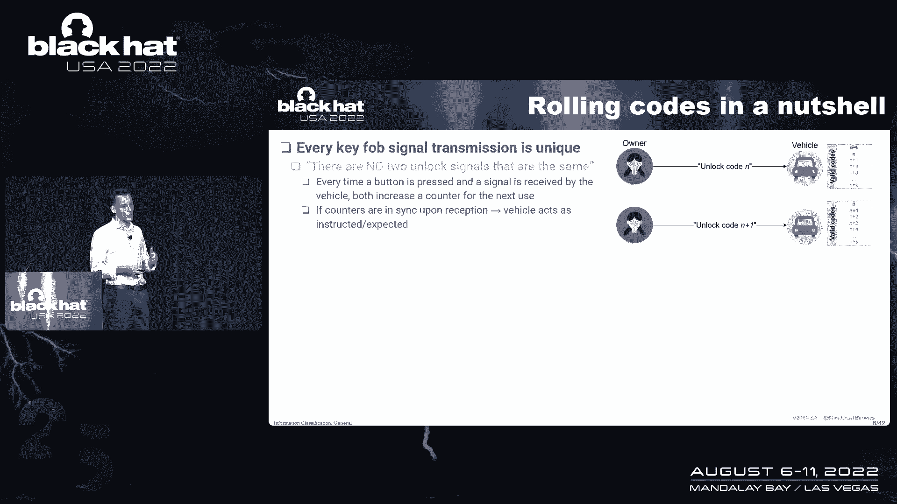

## 滚动码系统的工作原理

滚动码系统是20多年前设计的、用于防止重放攻击的普遍方案。其核心思想是确保每次按键发出的信号都是唯一的。

以下是其工作原理：
1.  钥匙和车辆内部各有一个计数器。
2.  每次按下钥匙按键，钥匙的计数器增加，并生成一个包含此计数器值的唯一信号。
3.  车辆接收到信号后，会验证其中的计数器值是否在可接受的范围内（通常略高于车辆自身存储的计数器值）。
4.  如果验证通过，车辆执行指令（如解锁），并将自身计数器更新为接收到的值。

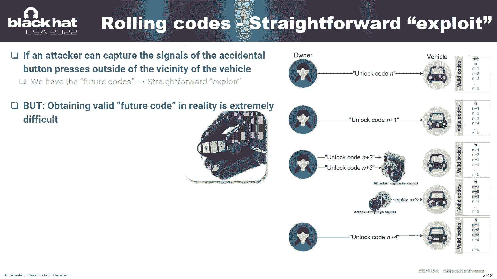

系统包含一项安全设计：允许钥匙的计数器比车辆领先一定步数。这是为了应对钥匙被意外按压（例如在口袋中）的情况，确保车主回到车辆旁时仍能正常使用。

然而，正是这项“安全设计”可能被利用。如果攻击者捕获了这些“未来”的信号，就可能用来解锁车辆。传统观点认为，获取这些信号非常困难。但七年前出现的“RollJam”攻击改变了这一看法。

## RollJam 攻击简介

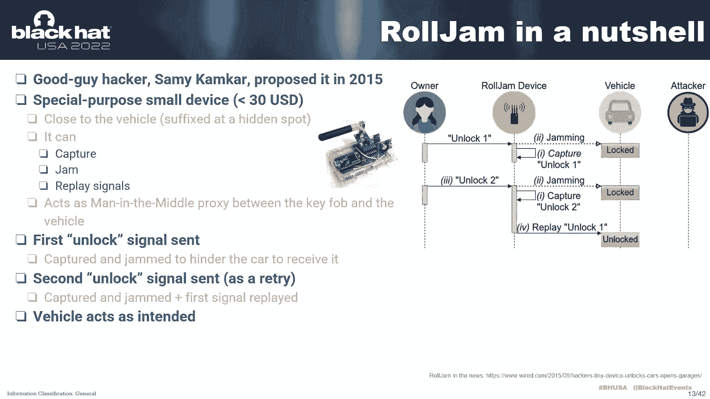

RollJam攻击通过巧妙的信号干扰、捕获和重放序列，诱使受害者自己生成可用的“未来”信号。

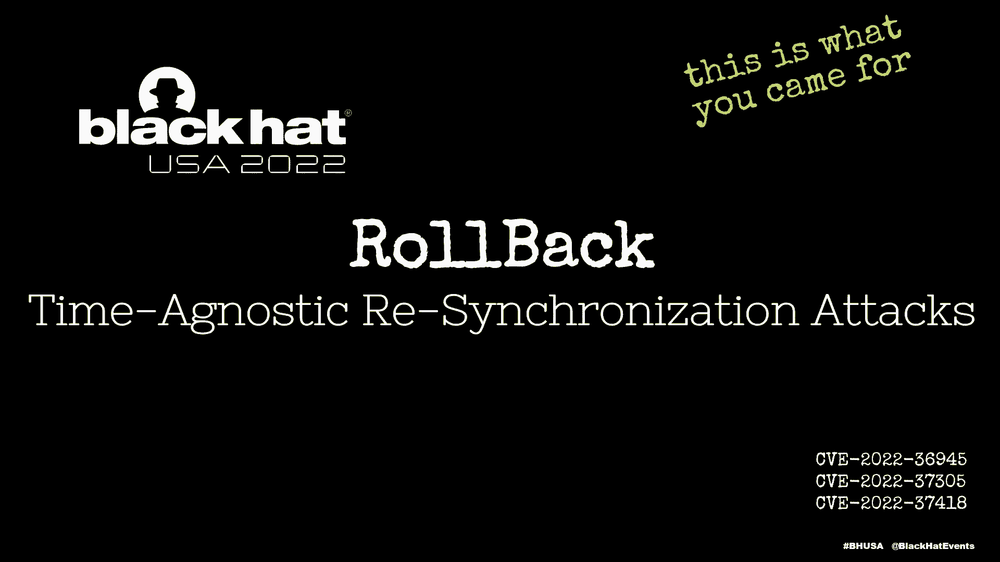

攻击步骤如下：
1.  **干扰并捕获**：当车主按下解锁键时，攻击者设备干扰信号使其无法到达车辆，同时捕获该信号。
2.  **诱导二次操作**：车辆无反应，车主通常会再次按下解锁键。
3.  **重放旧信号**：攻击者再次干扰第二次信号并捕获它，但同时重放之前捕获的第一次信号。车辆解锁，车主察觉异常但可能不以为意。
4.  **利用未来信号**：此时，攻击者手中拥有了一个有效的“未来”信号（第二次捕获的）。待车主离开后，攻击者重放此信号即可解锁车辆。

RollJam攻击的本质是将安全设计转化为攻击途径。但它要求攻击者实时跟随受害者，并在特定时间窗口内完成攻击。

上一节我们回顾了已知的RollJam攻击，本节中我们将深入探讨我们发现的、更具威胁的新型攻击——RollBack。

## RollBack 攻击详解 🕰️↩️

RollBack攻击是一种“与时间无关的重同步攻击”。它同样利用滚动码系统的重同步机制，但比RollJam更灵活、更隐蔽。

### 攻击原理对比

与RollJam相比，RollBack的关键区别在于：
1.  **首次干扰目的不同**：RollBack首次干扰并捕获信号，只是为了诱导车主连续按下两次（或多次）按键，以捕获一组连续信号。攻击者**不关心**车辆是否接收到第二次信号，也不关心车辆当时是否解锁。
2.  **攻击时机自由**：攻击者捕获一组信号后，无需实时跟随车主。他可以在**未来任意时间**（几小时、几天甚至几周后），当车辆无人看管时，重放这组捕获的信号来解锁车辆。
3.  **可重复攻击**：一旦捕获了有效信号组，攻击者可以**无限次**地对同一车辆发起攻击。

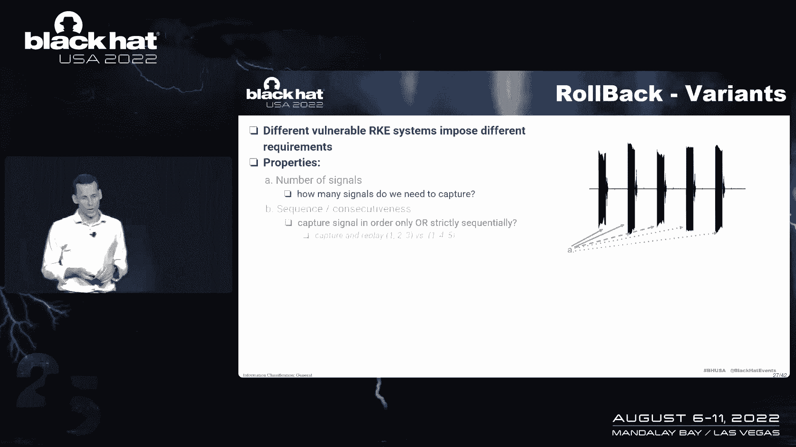

### 为何称为“RollBack”？

这个名字借鉴了数据库中的“回滚”概念。我们发现，当重放一组旧的连续信号时，车辆内部的滚动码计数器状态会被“回滚”到过去某个点。

**核心过程**：
1.  假设钥匙依次发出了信号 S1, S2, S3, S4, S5，且都被车辆成功接收。
2.  根据滚动码原理，S1-S5都已失效。
3.  如果攻击者之前捕获了 S1 和 S2 并重放，车辆的系统状态可能会被回滚到对应于 S2 的时刻。
4.  回滚发生后，原本在 S2 之后、本应失效的信号（如 S3, S4, S5）**会重新变为有效**。这就好比进行了一次“时间旅行”，将系统状态倒回了过去。

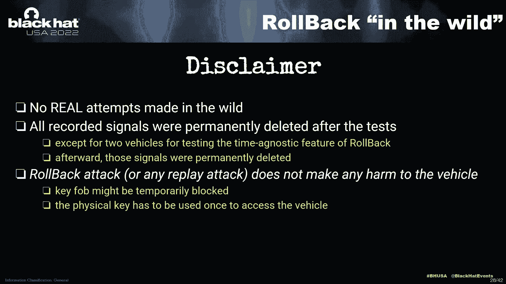

### 攻击变体与属性

我们发现RollBack攻击存在不同变体，主要取决于三个属性：

以下是已识别的几种变体：
*   **变体A（最严重）**：仅需捕获**2个**信号，且信号**无需严格连续**（例如周一和周五捕获的信号也可用）。这极大降低了攻击者被发现的概率。
*   **变体B**：需要捕获**2个**连续的信号。
*   **变体C**：需要捕获**3个**连续的信号。
*   **变体D**：需要捕获**5个**连续的信号。

所需信号越少、连续性要求越低，攻击就越容易实施。

## 研究发现与影响评估 🔬

我们的测试范围有限，主要针对了几款亚洲品牌汽车，但仍能得出一些重要观察：

*   **车辆年龄无关**：无论是10年以上的旧车还是近两年的新车，都可能受到影响。
*   **动力类型无关**：燃油车、混合动力车或电动车的无钥匙进入系统可能采用相同组件。
*   **受影响品牌**：测试中，马自达、本田、起亚的多个车型存在漏洞。丰田测试车型则未受影响。
*   **钥匙供应商关联**：漏洞与特定的无线钥匙供应商有关，但根本原因在于车辆端的接收逻辑。

**重要声明**：本研究仅在受控环境下进行，未在真实世界尝试。重放攻击本身通常不会对车辆造成物理损害，但可能导致钥匙与车辆临时失步，可通过使用物理钥匙或特定步骤重新同步。

## 攻击演示与扩展发现 🎥

通过演示视频，我们验证了RollBack攻击的有效性。攻击者使用廉价的软件无线电设备（如HackRF）即可完成信号捕获和重放。

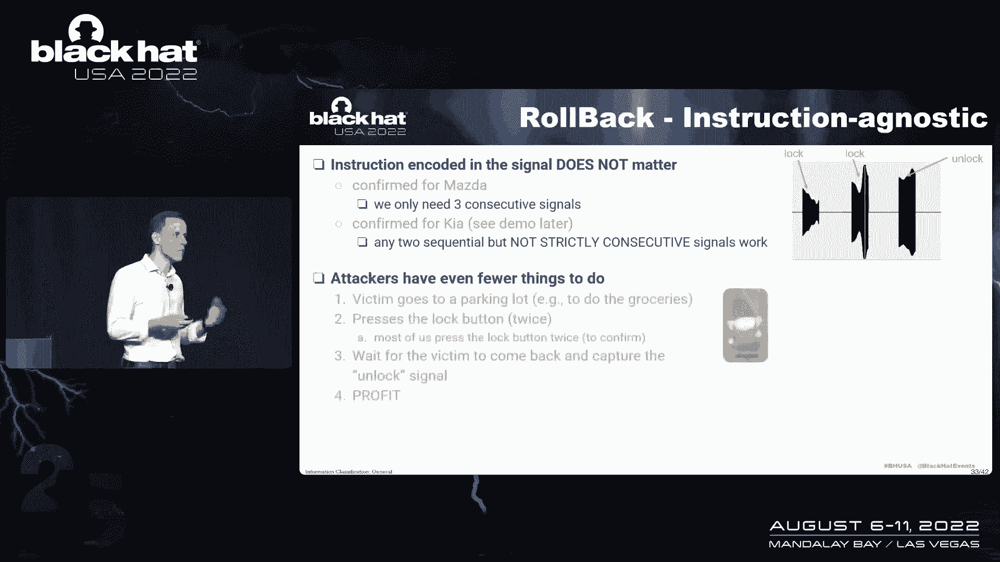

此外，在提交报告后我们还有了新发现：**RollBack攻击是“指令无关”的**。

*   **最初认知**：认为需要捕获连续的“解锁”信号。
*   **新发现**：攻击者捕获的任何连续按键信号（例如“锁车”+“解锁”，或两次“解锁”）都可能触发回滚。这更贴近用户习惯（如按两次锁车键确认），使得攻击更容易实现。

这一发现尤其对**汽车共享和租赁**场景构成严重威胁，因为攻击者可能更容易获得临时访问钥匙并进行信号捕获。

## 根本原因与缓解措施 ❓

目前，RollBack攻击的确切根本原因仍是未解之谜。相关系统细节是汽车制造商和供应商的专有信息。

一种推测是，该漏洞可能与**钥匙配对学习过程**的某些非标准实现或意外触发有关。标准的学习流程用于将新钥匙注册到车辆，其中涉及连续按下钥匙按钮。攻击可能无意中模拟或触发了这一流程的某一部分。

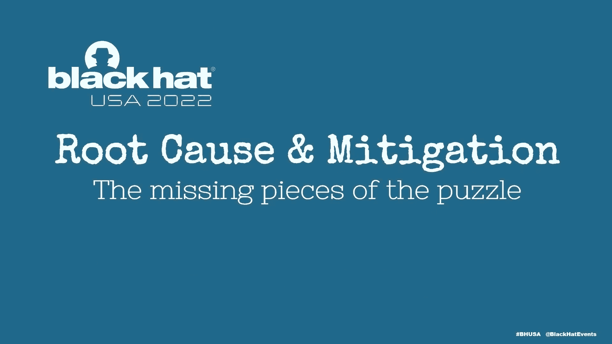

### 潜在缓解措施

由于攻击是被动捕获且时间无关，用户很难通过观察车辆反应来防范。

以下是可能的缓解方向：
*   **系统设计增强**：在滚动码基础上，引入时间戳或更复杂的交互认证。
*   **供应商修复**：需要汽车制造商及其钥匙供应商审查并修复接收器端的逻辑漏洞。
*   **用户建议**：虽然效果有限，但保持警惕（如确认车辆每次都有响应）仍是一种好习惯。对于高风险用户，可以考虑使用法拉第袋存放钥匙，或完全禁用无钥匙进入功能。

## 课程总结 📚

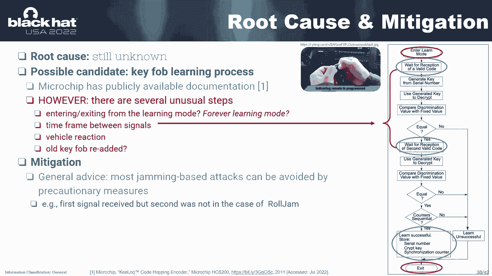

本节课我们一起学习了一种名为RollBack的新型汽车无钥匙进入攻击。

1.  **攻击本质**：通过捕获并重放一组旧的连续无线信号，攻击者可以“回滚”车辆的滚动码计数器状态，从而在任何未来时间点解锁车辆。
2.  **核心优势**：与RollJam相比，RollBack无需实时信号干扰，攻击时机灵活，且可重复无限次实施。
3.  **广泛影响**：测试表明，多个流行汽车品牌的不同车型均受影响，且攻击与信号中的具体指令（锁车/解锁）无关。
4.  **现状与未来**：攻击的根本原因尚在调查中，目前没有明确的通用缓解方案。该研究强调了汽车安全系统中，即使经过时间考验的设计（如滚动码）也可能存在未被察觉的脆弱性，需要持续的安全审计和更新。

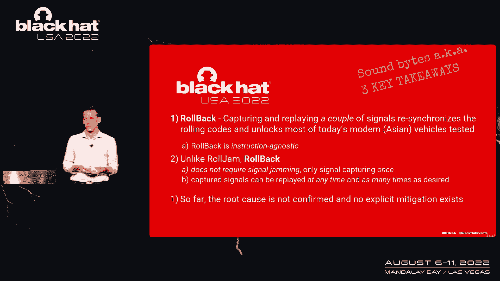

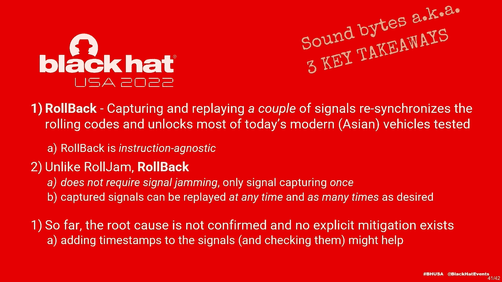

**重要提醒**：本教程内容仅用于安全研究与教育目的。请勿使用此知识进行任何非法活动。汽车安全需要研究人员、制造商和用户的共同努力。