# 课程 P44：049 - 进程注入：利用单个漏洞突破所有 macOS 安全层 🍎🔓


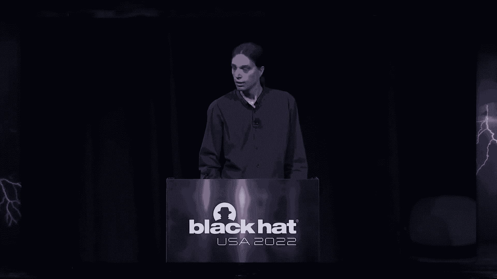

在本节课中，我们将学习 macOS 安全模型的核心概念，并深入探讨一个关键的进程注入漏洞。这个漏洞允许攻击者突破沙箱限制，并最终绕过系统完整性保护。我们将从基础的安全模型讲起，逐步分析漏洞的原理、利用方法以及苹果的修复措施。

## 概述：macOS 安全模型的演变

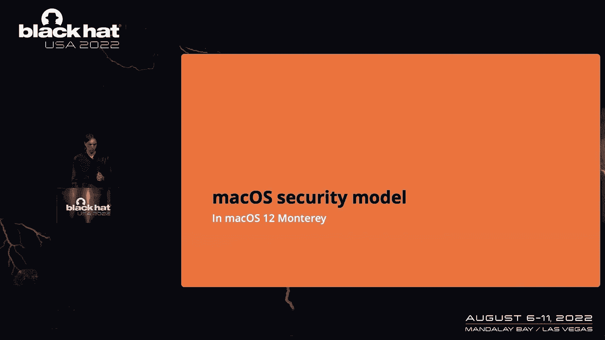

上一节我们介绍了课程的整体目标，本节中我们来看看 macOS 安全模型的历史演变。

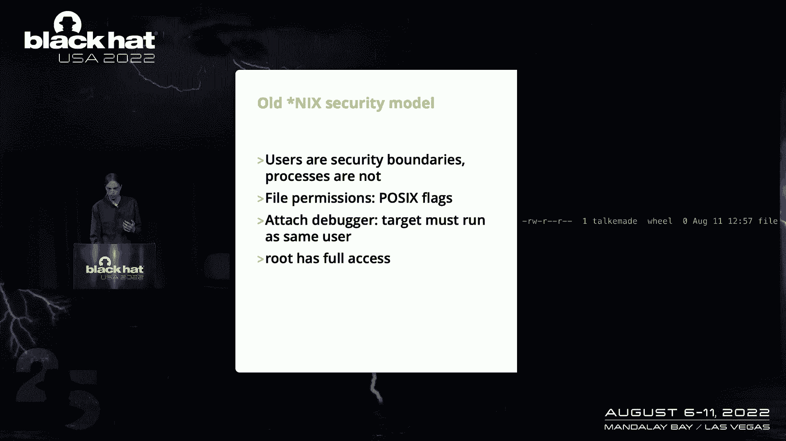

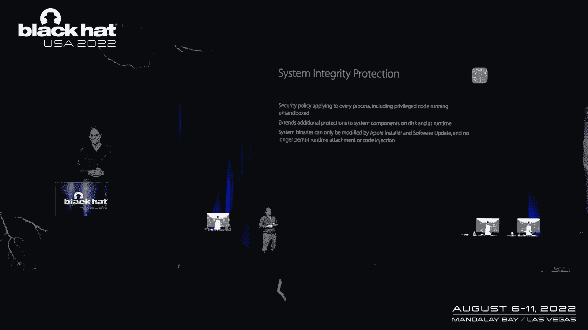

传统的 Unix/Linux 安全模型以用户为安全边界，而非进程。文件的所有者、组和其他用户通过九个标志位（如读、写、执行）来确定权限。通常，一个进程需要以相同用户身份运行才能附加到另一个进程。**根用户**（root）是一个例外，它拥有系统的完全控制权。

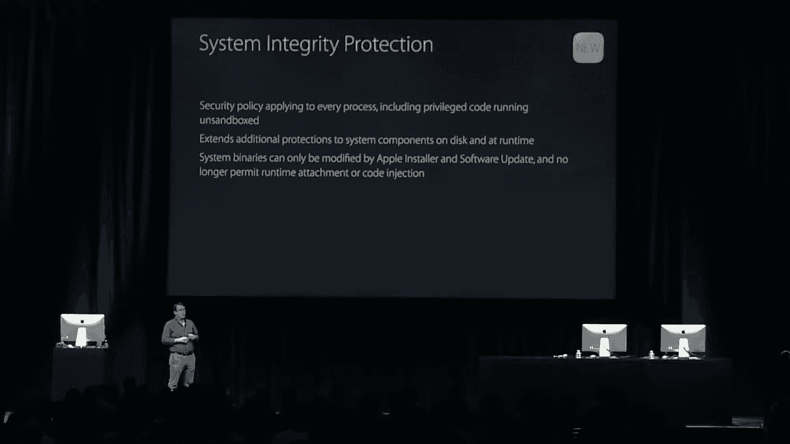

然而，自 2015 年 El Capitan 系统引入**系统完整性保护**（System Integrity Protection, SIP）后，情况发生了变化。SIP 也被称为“无根”（rootless），其核心思想是在根用户和内核之间引入一个安全层，并保护系统文件不被修改，即使是根用户也不行。这意味着仅获得 root 权限已不足以完全控制系统。

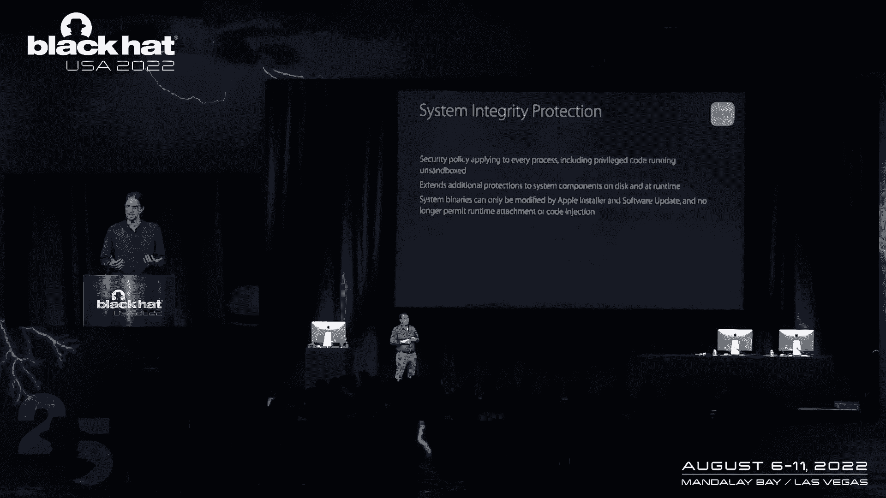

SIP 的工作方式是，应用程序在执行危险操作（如修改系统文件或调试其他进程）时，需要在代码签名中嵌入特定的**权利**（entitlement）。苹果还引入了**文件系统限制**（File System Restrictions），保护如邮件、信息数据库等敏感用户数据，即使 root 用户也无法直接访问，只有拥有相应权利的应用（如邮件应用）才能访问。

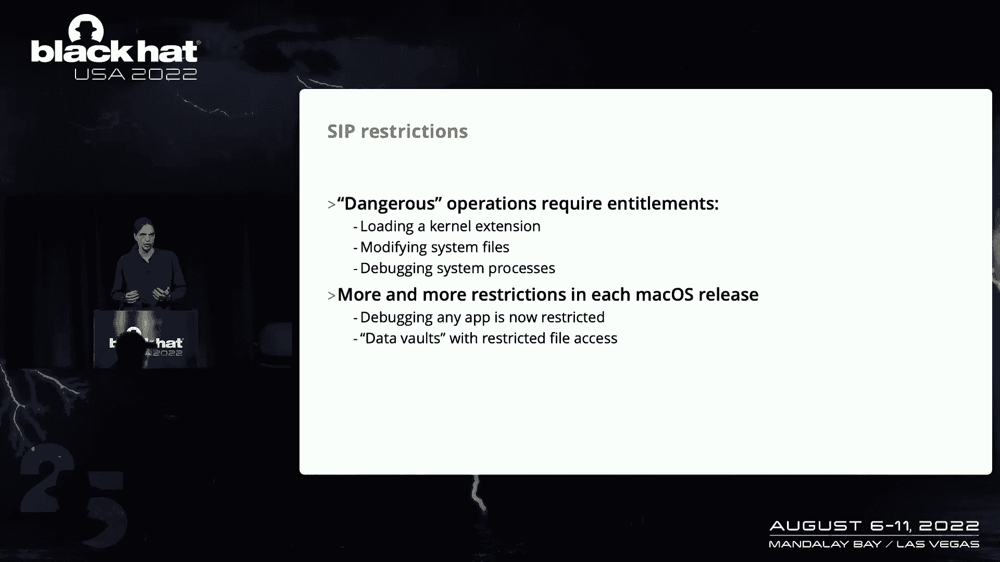

因此，**进程本身成为了新的安全边界**。这催生了一类新的漏洞——**进程注入**，即一个进程让另一个进程执行其指定代码的能力。

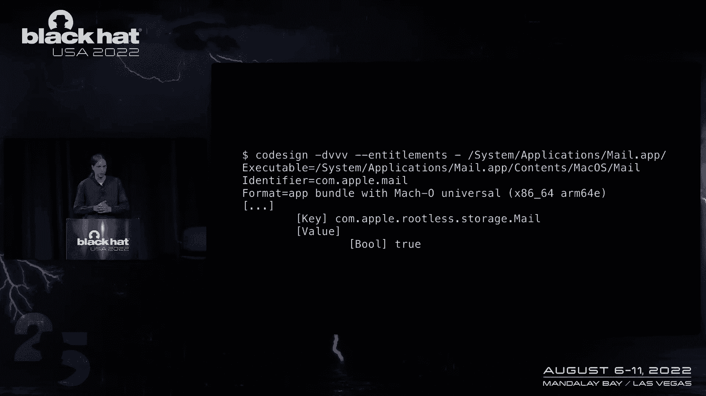


## 漏洞发现：不安全的序列化对象 🔍


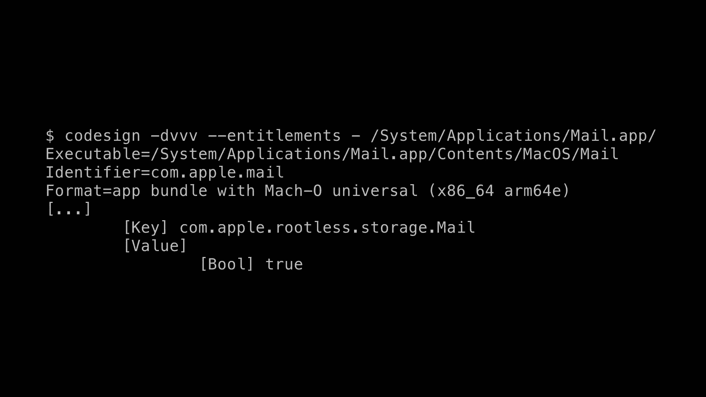

上一节我们了解了 SIP 如何建立进程边界，本节中我们来看看攻击者如何找到突破口。

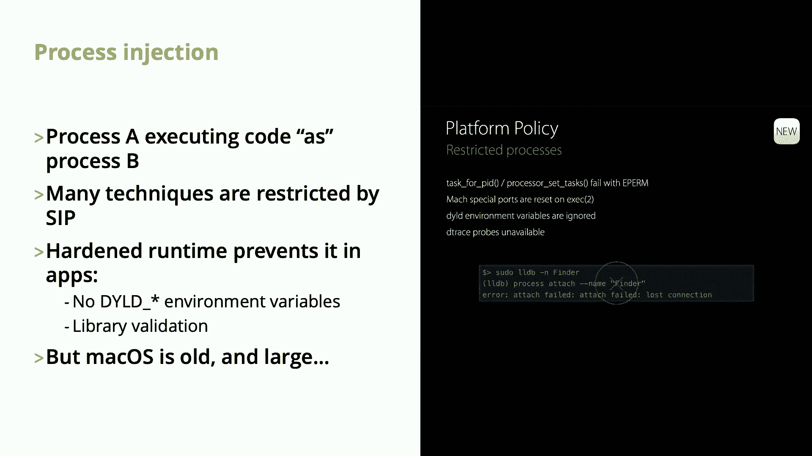

该漏洞存在于 macOS 的**安全可恢复状态**（Secure Restorable State）功能中。当用户勾选“重新打开窗口”选项或应用崩溃后恢复未保存文档时，系统会使用此功能。应用状态存储在 `~/Library/Saved Application State/` 目录下，其中包含一个加密的数据文件。

该文件使用苹果的 **NSKeyedArchiver** 序列化格式进行编码。苹果在 macOS 10.8 中引入了安全的 **NSSecureCoding** 协议来防止不安全的反序列化漏洞。然而，在安全状态恢复中，系统使用了**不安全的、非安全编码的序列化器**。

不安全的反序列化漏洞之所以危险，是因为它在检查反序列化出的对象类型**之前**，就已经创建了该对象。如果该对象的构造函数或析构函数中包含恶意代码，就会被执行。

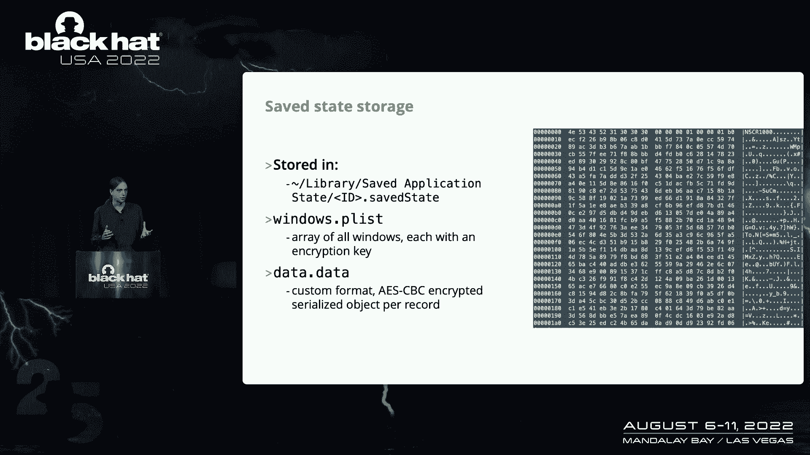

攻击者可以：
1.  为其他应用创建包含恶意序列化对象的状态文件。
2.  将该文件写入目标应用的目录。
3.  请求系统启动目标应用。
4.  目标应用在启动时会自动反序列化该恶意对象，从而执行攻击者代码。

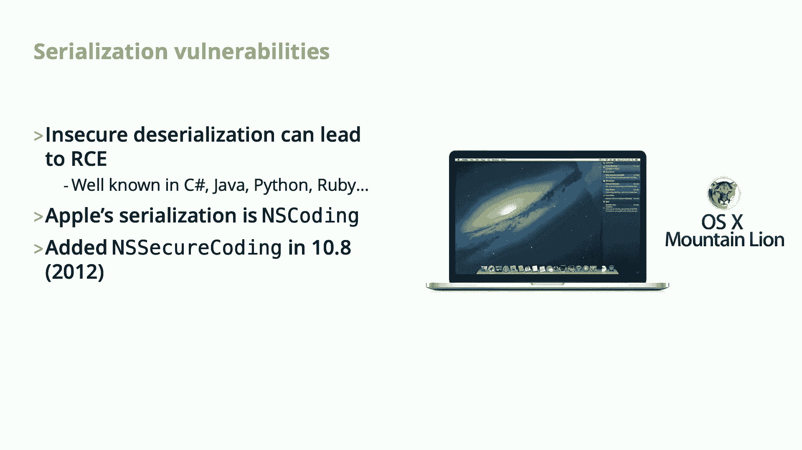

## 漏洞利用链的构建 ⛓️

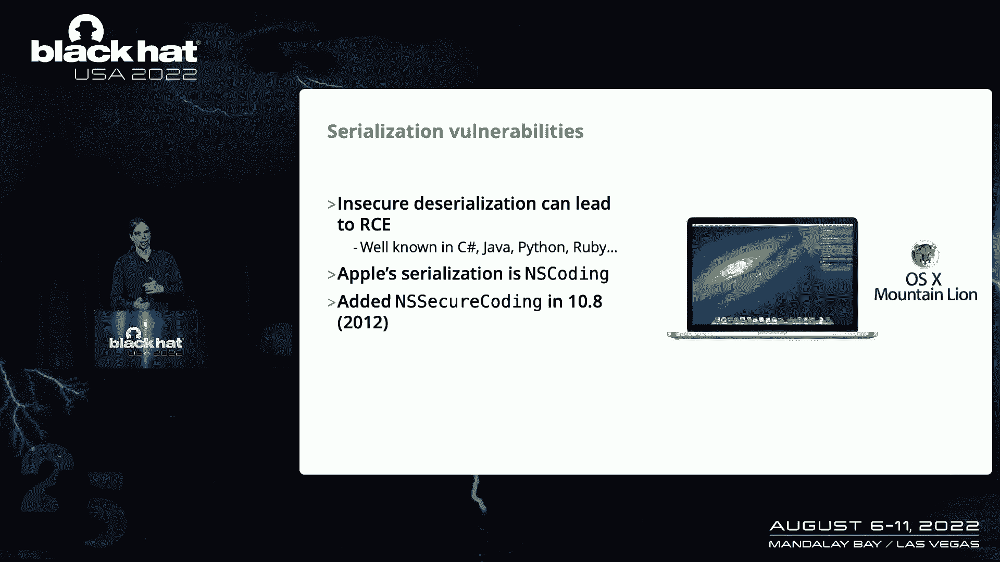

上一节我们知道了漏洞的根源，本节中我们来看看如何构造有效的攻击载荷。

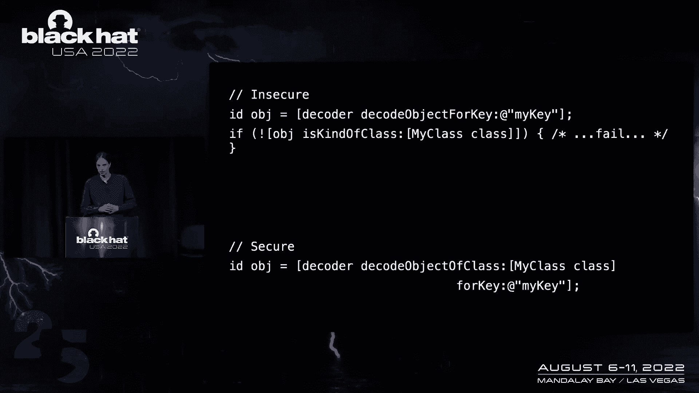

由于没有现成的针对 Objective-C NSKeyedArchiver 的利用链，需要从头构建。以下是构建过程的核心步骤：

以下是利用链中关键的几个类：

1.  **NSRuleEditor**： 该类可以从存档中获取一个对象和一个键路径（key path），并创建两者之间的绑定。键路径可以指向任何**零参数方法**，从而允许调用目标对象上的此类方法。
    *   `[targetObject performSelector: @selector(someZeroArgMethod)]`

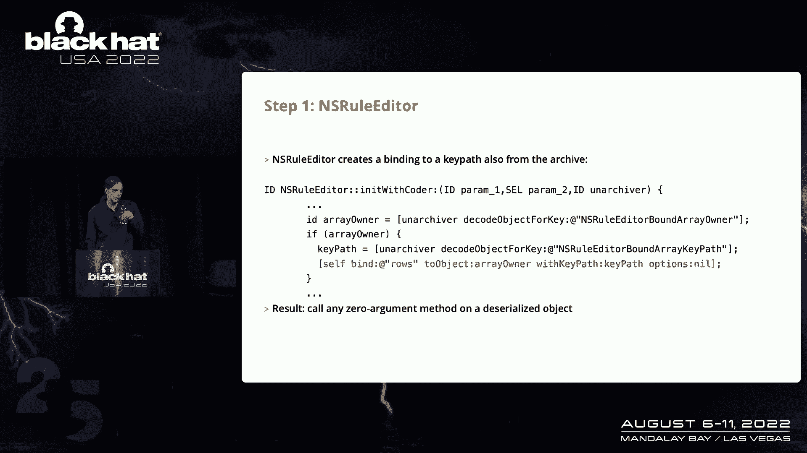

2.  **NSCustomImageRep**： 该类可以从存档中获取一个对象和一个选择器（selector，即方法指针）。当调用其 `draw` 方法时，会在存储的对象上调用该选择器。
    *   结合上一步，可以调用任意零参数方法，但无法控制参数。

3.  **桥接技巧**： 通过一系列技巧，可以调用非零参数的方法，并创建通常不可序列化的对象。这最终允许在目标进程中**执行 AppleScript**。

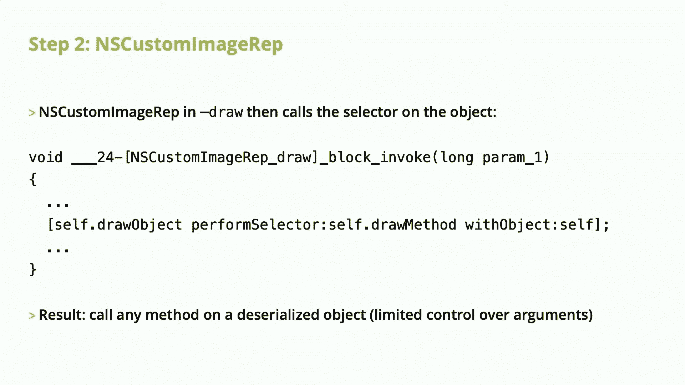

然而，对于完全的原生代码执行，还需要绕过**强化运行时**（Hardened Runtime）的限制。强化运行时禁止创建可写且可执行的内存页、加载未签名的动态库等。

解决方案是：
1.  加载苹果签名的 **Python 框架**。
2.  通过 Python 的 `ctypes` 模块调用 C 函数。
3.  但需要一种方式从 Objective-C 环境调用 Python。这里使用了 **AppleScript-Objective-C 桥接**。
4.  通过桥接，可以创建 Objective-C 对象并调用方法，进而启动 Python 的交互式环境（REPL），从而通过标准输入向其传递 Python 代码。

最终利用链总结为：**恶意序列化对象 -> 触发 NSRuleEditor 和 NSCustomImageRep -> 执行 AppleScript -> 通过桥接调用 Python -> 使用 ctypes 实现原生代码执行能力**。

## 漏洞的三种应用方式 🎯

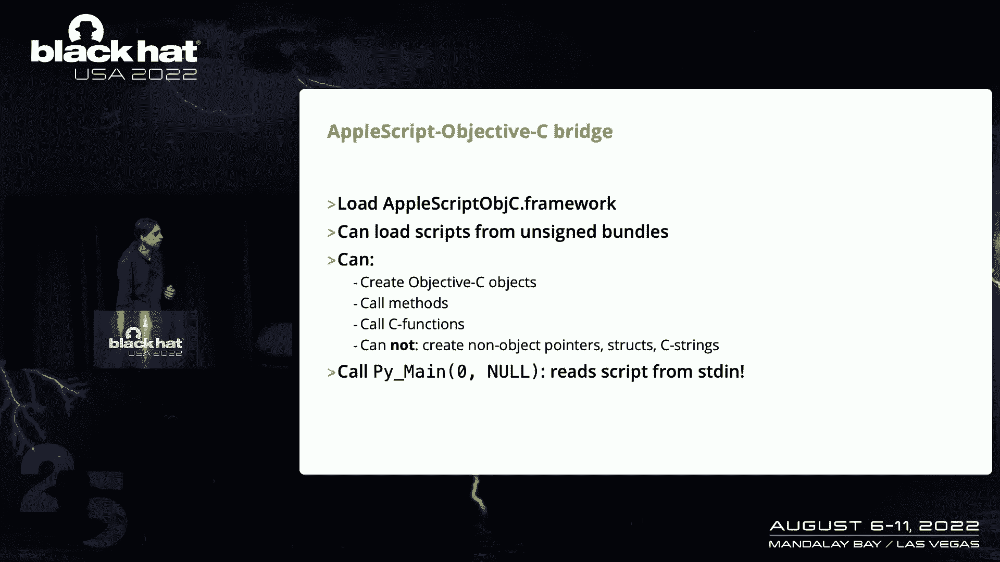

上一节我们构建了强大的利用链，本节中我们来看看这个漏洞在实际攻击中的三种应用场景。


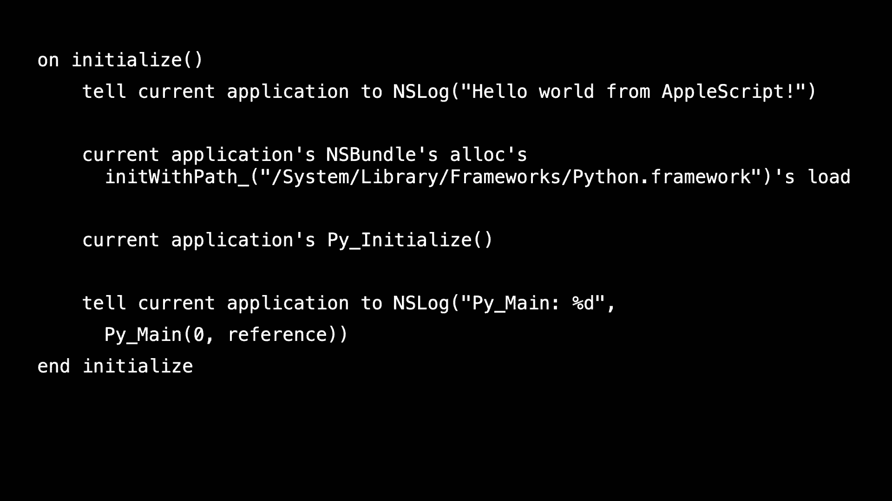


### 1. 沙箱逃逸


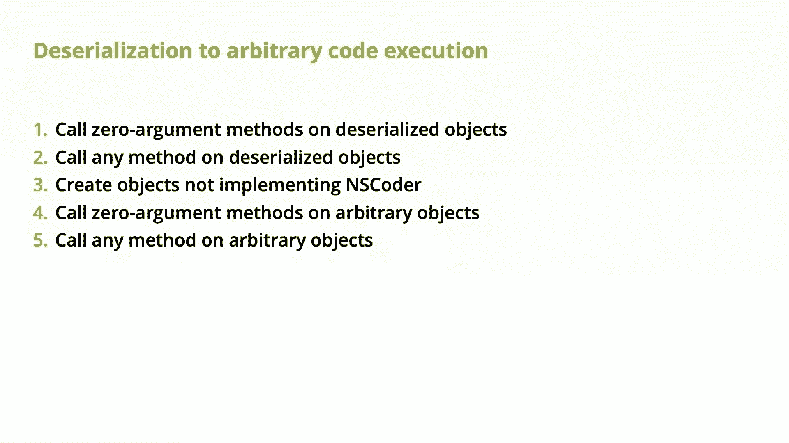

macOS 沙箱应用无法直接列出磁盘文件。当它们使用“打开”面板时，该面板实际上是一个独立的进程（`Open and Save Panel Service`），它与应用**共享相同的保存状态目录**。

攻击步骤：
*   沙箱应用将恶意状态文件写入自己的状态目录（该目录与打开面板共享）。
*   应用触发打开文件面板。
*   恶意状态文件在权限更高的面板服务进程中被反序列化并执行代码，从而**逃离沙箱**。
> **注**： 此利用方式已在 macOS 11.3 中被修复，修复方法是让打开面板不再与应用共享状态目录。

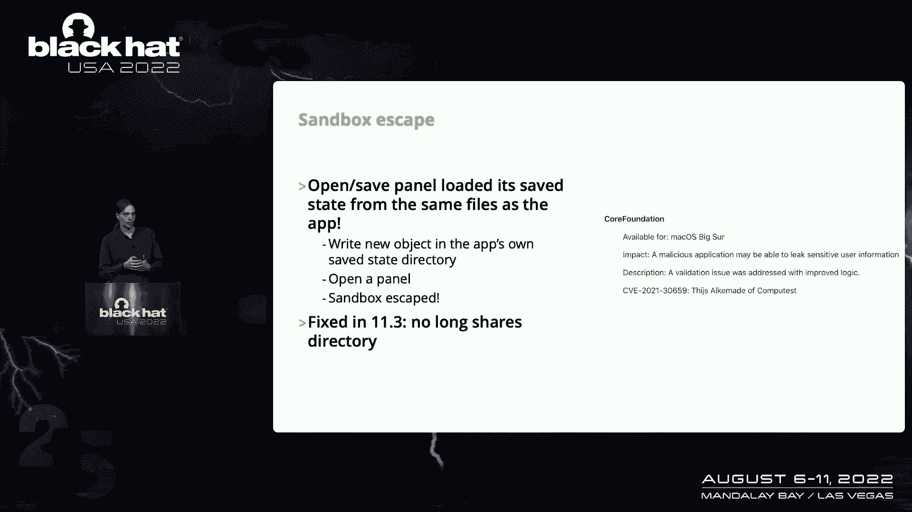

### 2. 权限提升与 SIP 文件系统限制绕过

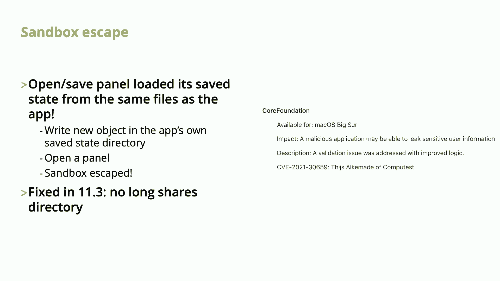

为了获得更高权限，利用了另一个技巧。`macOS Updater` 应用拥有 `com.apple.rootless.install` 权利，该权利允许访问任何受 SIP 保护的文件进行读写。

攻击步骤：
*   利用进程注入漏洞，在 `macOS Updater` 进程中执行代码。
*   借助其高权限，可以：
    *   读取受保护的邮件、信息数据库、Safari 历史记录。
    *   在无需用户同意的情况下访问摄像头或麦克风。
    *   将自身写入受保护的系统位置实现持久化。
    *   修改已批准的内核扩展列表，加载恶意内核扩展（需签名），最终获得内核级代码执行。

### 3. 演示与影响

通过一个视频演示了完整的攻击链：从沙箱应用开始，逐步实现沙箱逃逸、权限提升，最终获得 root shell 并证明可以绕过 SIP 向受保护目录（如 `/Library/SystemPolicyConfiguration/`）写入文件。

## 修复与总结 📝

上一节我们看到了漏洞的巨大威力，本节中我们来看看苹果如何修复以及我们从中学到了什么。

苹果通过引入一个新的 API 方法来修复此漏洞。第三方开发者现在可以在其应用的 `Info.plist` 中声明，其保存状态**仅支持安全编码对象**（`NSSecureCoding`）。苹果已在其所有系统应用中启用了此功能。

该漏洞在 macOS Monterey（12.0）中首次被修复，随后也向后移植到了 macOS Big Sur（11.3 修复沙箱逃逸部分）和 macOS Catalina。这显示了苹果对此漏洞严重性的重视。

**本节课总结**：
我们一起学习了 macOS 从传统 Unix 模型到 SIP 和进程边界的现代安全模型的演变。我们深入分析了一个关键的不安全反序列化漏洞（CVE-2022-26706），它位于安全状态恢复功能中。通过构建复杂的利用链，攻击者可以利用此漏洞进行进程注入，进而实现沙箱逃逸、权限提升，并最终绕过系统完整性保护的文件系统限制。这个案例突出表明，在已建立的复杂系统中分层添加安全机制是一项挑战，新旧代码之间的交互可能引入意想不到的突破口。

**核心概念与代码表示**：
*   **传统 Unix 权限**： `-rwxr-xr--` （9位标志）
*   **进程注入**： `Process_A -> [Code Execution] -> Process_B`
*   **不安全反序列化**：
    ```pseudo
    // 危险模式：先创建对象，后检查
    id obj = [unarchiver decodeObjectForKey: @"key"]; // 对象已创建，恶意代码可能已执行
    if (![obj isKindOfClass: [AllowedClass class]]) { // 检查滞后
        return nil;
    }
    ```
*   **安全反序列化**：
    ```pseudo
    // 安全模式：先检查，后创建
    if (![unarchiver containsValueForKey: @"key"]) {
        return nil;
    }
    // 使用安全解码方法，指定期望的类
    id obj = [unarchiver decodeObjectOfClass: [AllowedClass class] forKey: @"key"];
    ```

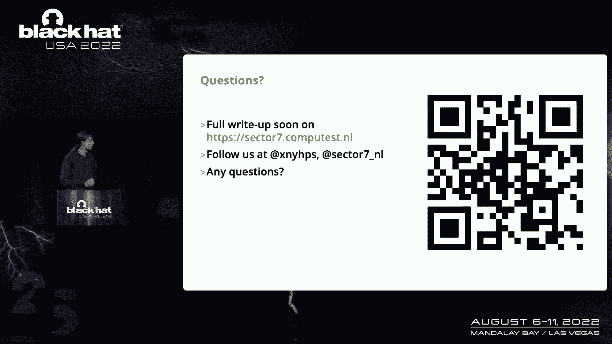

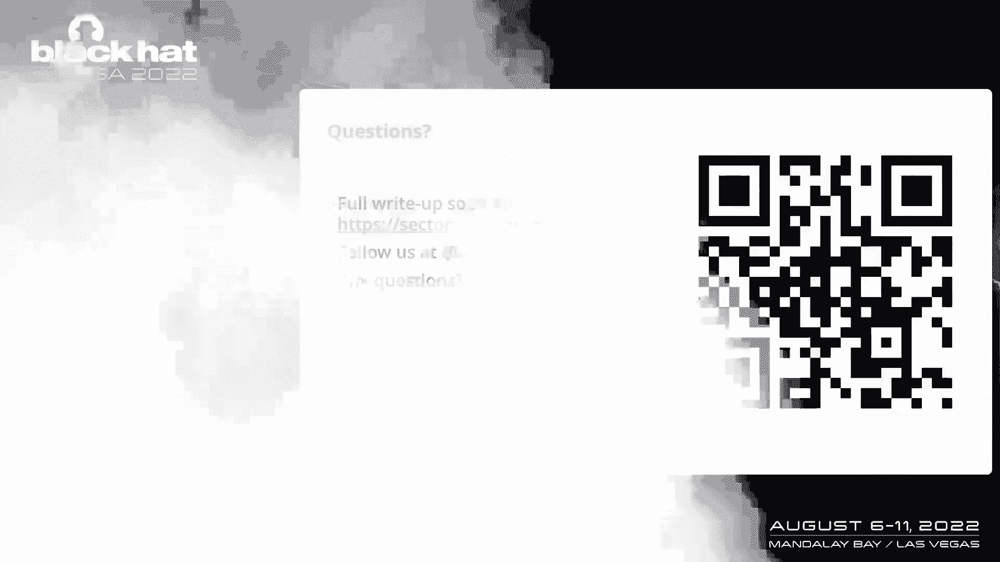

---
**参考资料**：
*   Apple Developer Documentation: Adopting NSSecureCoding
*   Apple Security Updates
*   CVE-2022-26706 详细技术报告（由演讲者所在公司发布）