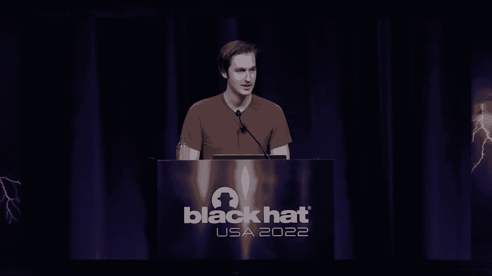
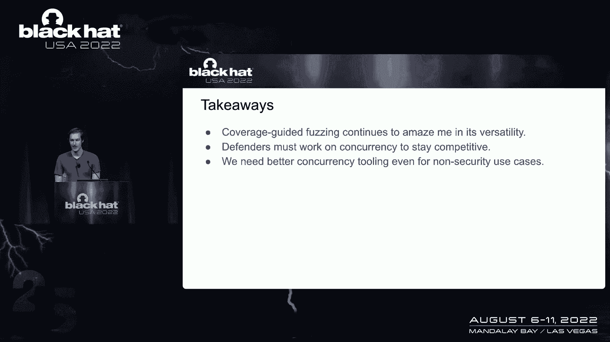

# 课程 P45-050：确定性竞态条件发现与模糊测试 🎯




在本课程中，我们将学习如何利用模糊测试技术，以确定性的方式发现操作系统内核中的竞态条件漏洞。我们将从基本概念入手，逐步理解如何将复杂的抢占式调度转化为可控的协作式调度模型，并最终构建一个能够自动发现新漏洞的模糊测试系统。

## 概述：竞态条件与模糊测试的挑战

竞态条件是软件开发中难以发现和复现的一类问题。传统上，发现这类漏洞主要依赖人工审计或静态分析，缺乏通用的自动化方法。模糊测试擅长在无需预知漏洞具体形态的情况下，通过违反程序属性来发现问题。然而，将模糊测试应用于竞态条件面临巨大挑战，核心在于操作系统调度（尤其是抢占式调度）的**非确定性和难以控制性**。

上一节我们介绍了竞态条件问题的普遍性和传统方法的局限性。本节中，我们将深入探讨调度的不同类型，这是理解后续解决方案的基础。

## 调度模型：协作式与抢占式

理解调度模型是控制并发的关键。主要有两种类型：

### 协作式调度 (Cooperative Scheduling)
在协作式调度中，线程通过显式调用 `yield()` 等方式主动让出CPU控制权。调度器只在明确的让出点决定运行哪个线程。
```
线程1: 执行 -> yield() -> (调度器) -> 线程2: 执行 -> 结束 -> (调度器) -> 线程1: 继续执行...
```
这种模型是**顺序且确定性的**，非常适合模糊测试，因为执行流完全可控。

### 抢占式调度 (Preemptive Scheduling)
在抢占式调度中，线程可能在任何时刻被操作系统中断（如计时器中断）并挂起，调度器随后决定运行哪个线程。
```
线程1: 执行 -> yield()或被中断 -> (调度器) -> 线程2: 执行 -> 被中断 -> (调度器) -> 线程1: 继续执行...
```
这种模型的**非确定性**和**搜索空间（指令级）的指数级爆炸**使得模糊测试极其困难。

上一节我们了解了两种调度模型的区别。本节中，我们将看到如何从简单的、易于模糊测试的模型出发，逐步解决复杂的问题。

## 核心思路：从协作式调度出发

我们的哲学是：从已知有效的方法（协作式调度）开始，逐步增强其能力。最初，我们通过“手动转换”的方式，将目标程序的抢占式线程模型在模糊测试时转换为协作式模型。例如，让后台线程（如垃圾回收）在模糊测试的主逻辑完成后才运行。

这种方法适用于简单场景（如早期的Android NFC模糊测试），但存在明显局限：
1.  **无法处理阻塞**：如果主线程阻塞，没有其他线程运行来“解救”它。
2.  **粒度太粗**：无法模拟真实的线程交互。

这引出了下一个想法：**创建一个确定性的用户态线程库**。

上一节我们讨论了手动转换模型的局限性。本节中，我们来看看如何构建一个更通用的确定性并发框架。

## 构建确定性并发框架

为了解决阻塞和更真实的线程交互问题，我们构建了一个名为 `concurrency` 的框架。其核心组件如下：

以下是该框架的三个核心组件：

1.  **执行器 (Executor)**：负责创建、删除和在执行上下文（线程）之间切换。
2.  **调度器 (Scheduler)**：跟踪所有可运行的上下文。当需要切换时，它**利用模糊测试器提供的随机数据来决定下一个要运行的线程**。这是实现非确定性探索的关键。
3.  **同步原语 (Mutex, CondVar等)**：这些原语与调度器交互，在线程被阻塞或唤醒时通知调度器。

该框架将所有多线程相关的操作（线程、锁）重定向到用户态的控制层，从而实现了**确定性的线程交错**。调度器通过消费模糊器生成的随机数据来做出调度决策，使得整个测试用例完全可复现。

上一节我们介绍了确定性并发框架的组成。本节中，我们将探讨如何将这个框架应用于更现实的抢占式环境。

## 关键洞察：最小化抢占点

最初的框架并未解决抢占问题。但深入思考后，我们发现：**抢占在本质上可以视为一种特殊的 `yield()`**。


如果我们能在代码中关键位置（程序员直觉上容易出问题的地方）手动插入 `yield()` 点，那么模糊测试器就可以在这些点控制线程切换，模拟抢占效果。问题在于，哪里是关键位置？

分析一个真实的Android Binder竞态条件漏洞补丁后，我们得到了核心洞察：**大多数竞态条件漏洞的触发，只需要在同步原语（如锁）的周围发生极少次数的抢占**。

例如，一个漏洞可能只需要在线程A释放锁后、线程B获取锁前发生一次上下文切换。因此，我们不需要模拟每一条指令上的抢占，而只需在锁操作（`lock`/`unlock`）等**同步点**前后插入潜在的抢占点。这极大地缩小了搜索空间。

正如一位研究者所言：“在无竞态的程序中，在同步点之间发生的抢占不会导致明显的行为差异。”这意味着，只要在同步点周围进行探索，就足以发现绝大多数竞态问题。

上一节我们得出了“最小化抢占点”的重要洞察。本节中，我们将看到如何将此洞察与iOS内核模糊测试器结合。

## 实战：iOS内核模糊测试器集成

我们将上述并发框架集成到一个名为 `sock_fuzzer` 的iOS内核用户态模糊测试器中。该测试器使用libFuzzer作为引擎，在用户空间模拟iOS内核环境（类似gVisor），通过超调用来处理系统调用。

集成后的数据流如下：
1.  Fuzzer生成一个测试用例（Protobuf格式），其中包含**系统调用序列**和**调度器所需的随机数据**。
2.  测试用例被送入目标函数。
3.  内核代码尝试执行多线程操作（创建线程、加锁）时，会被重定向到我们的并发框架。
4.  调度器根据测试用例中提供的随机数据，决定线程间的切换顺序。
5.  整个过程是确定性的，相同的输入必然产生相同的交错和执行结果。

模糊测试器现在可以在两个维度上进行探索：**系统调用及其参数** 与 **线程调度顺序**。

上一节我们描述了系统的整体架构。本节中，我们通过实际发现的漏洞来看看它的效果。

## 成果：发现的竞态条件漏洞

该系统成功发现了多个iOS内核中的未知竞态条件漏洞，以下是其中两例：

### 漏洞一：Mach IPC `mach_msg` 双重释放
Fuzzer生成了一个复杂的测试用例，涉及多个端口和消息权限的传递与移动。通过特定的线程交错，导致对同一端口引用计数的操作出现竞争，最终触发了**双重释放**。有趣的是，这个漏洞的模式与另一位研究员稍早前通过人工分析发现的漏洞惊人地相似，证明了该方法的有效性。

### 漏洞二：BSD Socket `setsockopt` 释放后使用
Fuzzer构造的测试用例在一个线程中调用 `setsockopt` 设置特定选项，同时在另一个线程中调用 `disconnectx`。两者竞争导致了**释放后使用**。这个漏洞与几年前报告的一个旧漏洞模式相同，但触发条件（设置的选项不同）是全新的。

这些漏洞的发现过程完全是自动化的，Fuzzer通过覆盖率引导，自行探索出了能够触发竞态条件的复杂线程交互和数据状态。

上一节我们看到了系统取得的实际成果。本节中，我们将探讨本工作与现有研究的联系，并总结核心贡献。


## 与现有工作的联系

我们的工作并非凭空出现，它与两个领域的研究紧密相关：

1.  **确定性记录与回放**：如Mozilla的 `rr` 调试器。这类工具记录程序运行中的所有非确定性因素（如线程调度），以便精确回放。我们的工作可以看作是其“逆过程”：不是记录非确定性，而是**主动生成和控制非确定性**以供模糊测试使用。
2.  **系统化并发测试**：如微软的 `CHESS` 工具。`CHESS` 会系统化地枚举同步点所有可能的线程交错。我们的方法与它的关键区别在于**可扩展性**。对于像整个内核这样庞大的目标，穷举所有交错是不现实的。我们依赖**覆盖率引导的模糊测试**来智能地探索有趣的交错，而不是盲目枚举。

## 总结与展望

在本课程中，我们一起学习了如何通过构建一个确定性的并发框架，将模糊测试的强大能力扩展到竞态条件发现这一难题上。我们的核心贡献在于：

1.  **提出了一个实用的、确定性的用户态线程模型**，用于模糊测试。
2.  **发现了“在同步点周围插入少量抢占点即足以发现多数竞态漏洞”的关键洞察**，极大降低了问题复杂度。
3.  **成功地将该框架集成到iOS内核模糊测试器中，并自动发现了新的、可复现的竞态条件漏洞**。

未来工作可以围绕如何让模糊测试器更“理解”线程间的关系展开，例如利用数据依赖关系来更智能地指导调度。这项研究表明，覆盖率引导的模糊测试是惊人的工具，我们需要在并发软件测试领域投入更多努力，而这并没有想象中那么困难。




**核心要点**：通过控制并发与调度，并将搜索空间巧妙限制在关键区域，我们可以利用模糊测试自动化地发现那些曾被认为只能靠人工和运气才能找到的竞态条件漏洞。