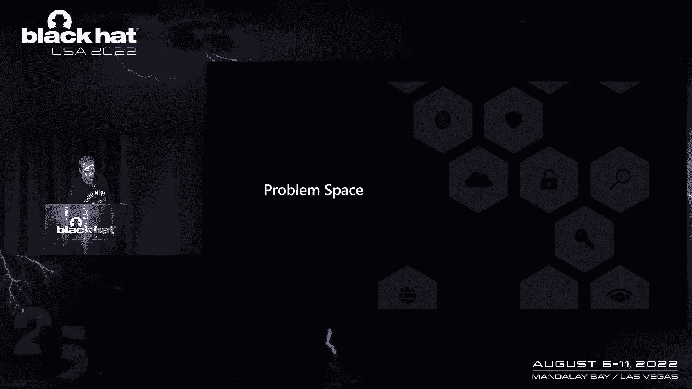

# 课程 P46：051 - CastGuard：缓解C++中的类型混淆 🛡️

在本节课中，我们将学习微软开发并正在部署的一项名为CastGuard的缓解技术。这项技术旨在解决C++中非法静态向下转型（downcast）的问题，这是一种常见且危害性大的类型混淆漏洞。

## 概述：C++内存安全漏洞与类型混淆

上一节我们介绍了课程背景，本节中我们来看看C++内存安全漏洞的主要类别。在C++代码中，内存安全漏洞主要分为四大类：
*   缓冲区溢出等空间安全问题
*   未初始化内存
*   类型混淆
*   释放后重用

其中，**类型混淆**是一个主要的漏洞类别。它之所以难以通用地解决，是因为它不涉及明显的契约违反（如使用已释放的内存），而仅仅是**对数据的错误解释**。例如，错误地进行向下转型后，你访问的仍然是有效分配且边界内的对象字段，但这些字段的含义并非你所想。

类型混淆之所以特别值得关注，是因为它为攻击者提供了强大的利用原语，并且可能绕过一些现有的缓解措施。


## 动态转型（dynamic_cast）的局限性


你可能会想，C++标准库中不是已经有`dynamic_cast`来解决向下转型的安全问题吗？确实如此，但`dynamic_cast`存在几个关键限制，使其难以大规模部署：

1.  **依赖RTTI**：要使`dynamic_cast`工作，创建对象的代码必须启用运行时类型信息（RTTI）。在像Windows这样的操作系统中，我们无法控制所有运行代码的行为。
2.  **二进制体积膨胀**：启用RTTI会导致二进制文件显著增大（例如，某些DLL会增加80%以上）。
3.  **性能开销大**：`dynamic_cast`检查本身会产生大量开销。一次成功的转型可能涉及数十次内存访问和跳转，而静态向下转型在运行时通常是零成本的。

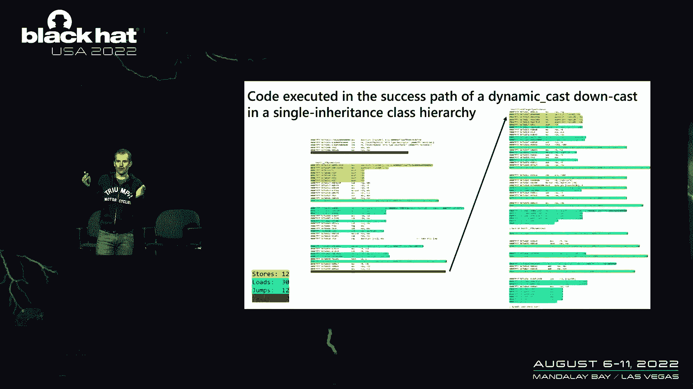

因此，我们需要一种不依赖RTTI、开销低且能大规模部署的解决方案。

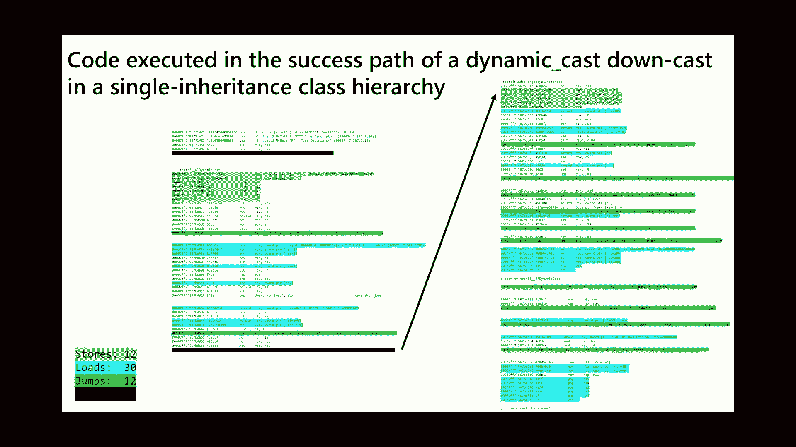


## CastGuard的核心概念

CastGuard的灵感来源于Clang的`-fsanitize=cfi-derived-cast`特性，并对其进行了深度优化。其核心思想是利用已存在于对象中的标识符——**虚函数表指针**。

对于已经拥有虚函数的对象，其虚表指针可以唯一地标识对象的类型。这样，我们就能在不改变对象布局（即不破坏ABI）的前提下，在运行时检查向下转型的合法性。

以下是CastGuard工作的基本前提：
*   代码需使用链接时代码生成（LTCG），以便编译器获得整个二进制文件的全局视图。
*   对象必须拥有虚表（即包含虚函数）。
*   CastGuard假设对象本身是有效的。如果存在其他内存破坏漏洞（如缓冲区溢出）先行破坏了对象，则CastGuard无法提供保护。


## CastGuard的工作原理：从概念到优化

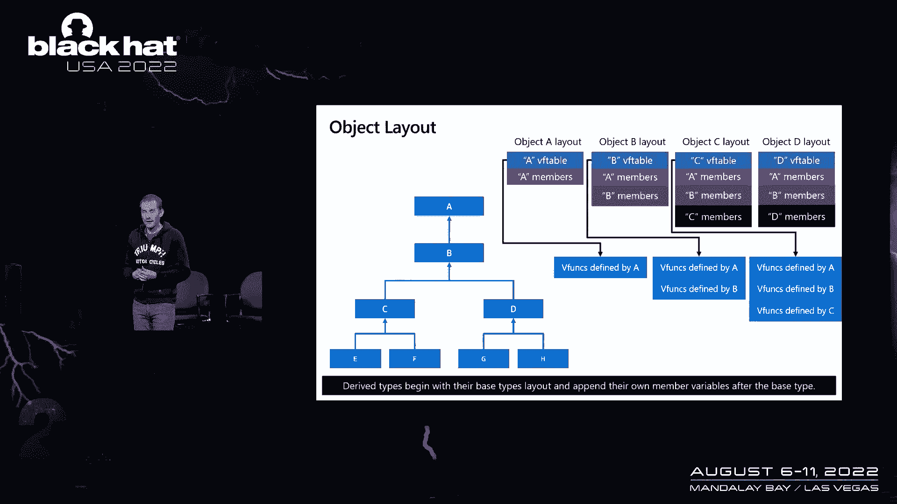

上一节我们介绍了CastGuard的基本概念，本节中我们来看看其具体实现和优化策略。

### 基础检查概念

编译器在编译时能识别静态向下转型（包括C风格转型）。它知道虚表在对象中的位置，以及各个虚表在二进制文件中的布局。

从**虚表视角**看世界是关键。编译器像跟踪类层次一样跟踪虚表层次结构。对于一个向下转型到类型`C`的操作，合法的虚表集合包括`C`的虚表及其所有派生类的虚表。

最直观的检查方法是：读取对象的虚表指针，然后判断它是否属于允许的虚表集合。但这在具有大量类的层次结构中性能极差。

### 使用位图（Bitmap）进行优化

为了优化，我们将所有可能用于检查的虚表集中布局在一个称为“CastGuard虚表区域”的内存区域中。该区域以两个全局变量`__castguard_vtable_start`和`__castguard_vtable_end`为边界。

然后，为每个可能被向下转型到的类型创建一个位图。位图的每个比特代表一个距离“基虚表”（即该类型允许的、在二进制中地址最小的虚表）的偏移量。如果某个偏移量对应的虚表是合法的，则对应比特位设为1，否则为0。

运行时检查步骤如下：
1.  计算对象虚表指针与基虚表的偏移量（delta）。
2.  根据对齐方式（例如每8字节一个比特）将偏移量转换为位图索引。
3.  检查索引是否在位图范围内。若超出，则转型非法。
4.  在位图中查找对应比特位，若为1则转型合法，为0则非法。

这种方法将检查操作优化为近似常数时间，但仍有改进空间，因为它引入了一次可能不在缓存中的内存读取。

### 深度优先布局与范围检查


更优的策略是使用**深度优先顺序**布局虚表。这样，对于任何合法的向下转型，其允许的所有虚表在内存中都是**连续排列**的。


带来的好处是：我们不再需要位图！因为所有合法虚表连续分布，所以只需进行简单的**范围检查**即可。

例如，向下转型到类型`C`，其合法虚表为`C`、`E`、`F`。如果对象虚表指针与基虚表`C`的偏移量在某个最大值（如16字节）以内，则转型合法。伪代码如下：
```cpp
vtable_ptr = *(uintptr_t*)object;
delta = vtable_ptr - &vtable_of_C;
if (delta > MAX_ALLOWED_OFFSET) {
    // 失败处理
} else {
    // 转型成功
}
```
最终的汇编指令非常精简（约7条指令），且推测执行性能良好。

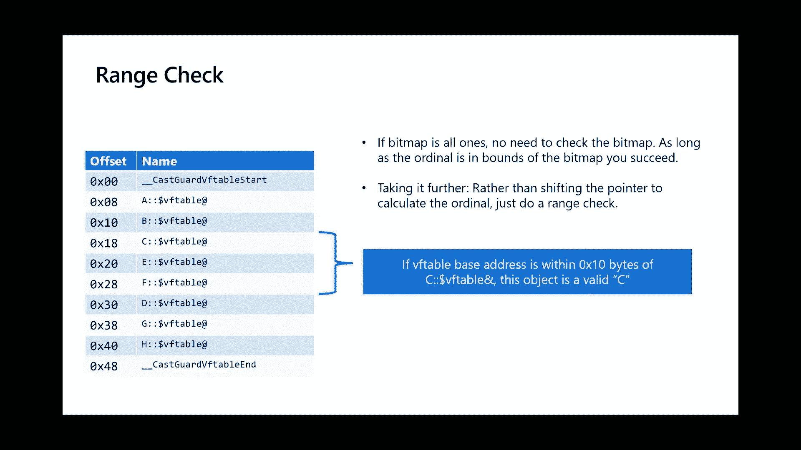

### 跨二进制兼容性检查


如果对象来自另一个二进制文件（其虚表不在当前二进制区域内），上述范围检查会失败。此时，CastGuard会进行二次检查：判断对象的虚表指针是否位于当前二进制文件的CastGuard区域内。如果不是，则假定对象来自外部，为了兼容性，**允许转型通过**（fail open）。在Windows中，大多数对象并不跨二进制边界传递，因此此兼容性检查对安全性影响很小。


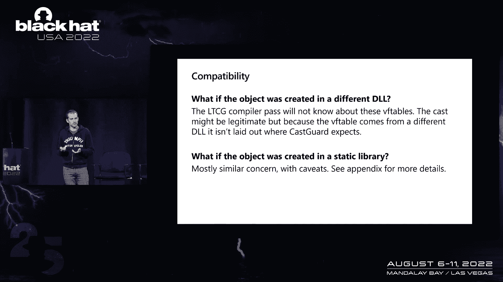

## 处理复杂继承情况

上一节我们讨论了单继承下的优化方案，本节中我们来看看多重继承等复杂情况。


### 多重继承（Multiple Inheritance）


多重继承看似复杂，但从虚表视角看，对象会包含多个独立的虚表层次结构（每个基类对应一个）。关键在于确定在转型检查中应使用哪个虚表。


*   如果转型的右侧类型是某个基类（如`A`），则对象保证有且仅有一个对应的虚表（`A`的虚表层次），使用它进行检查。
*   如果转型的右侧类型是派生类（如`B`），它可能包含多个虚表，此时选择任意一个进行检查即可（通常选择地址最小的以优化代码大小）。


因此，多重继承的处理本质上与单继承相同，仍然可以使用高效的范围检查。

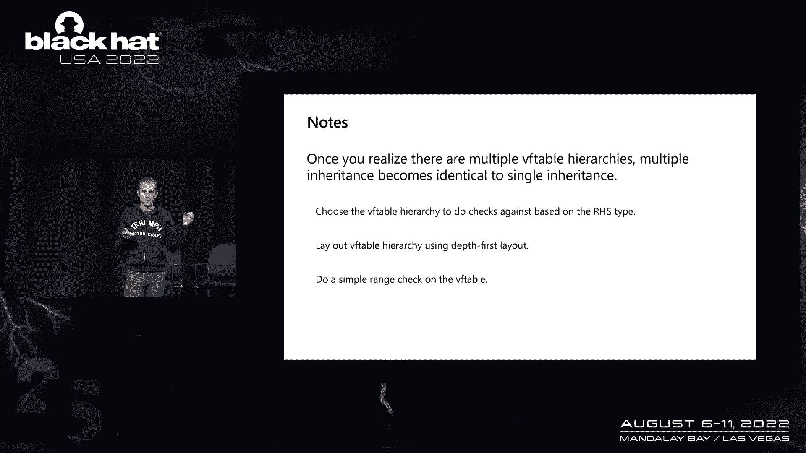

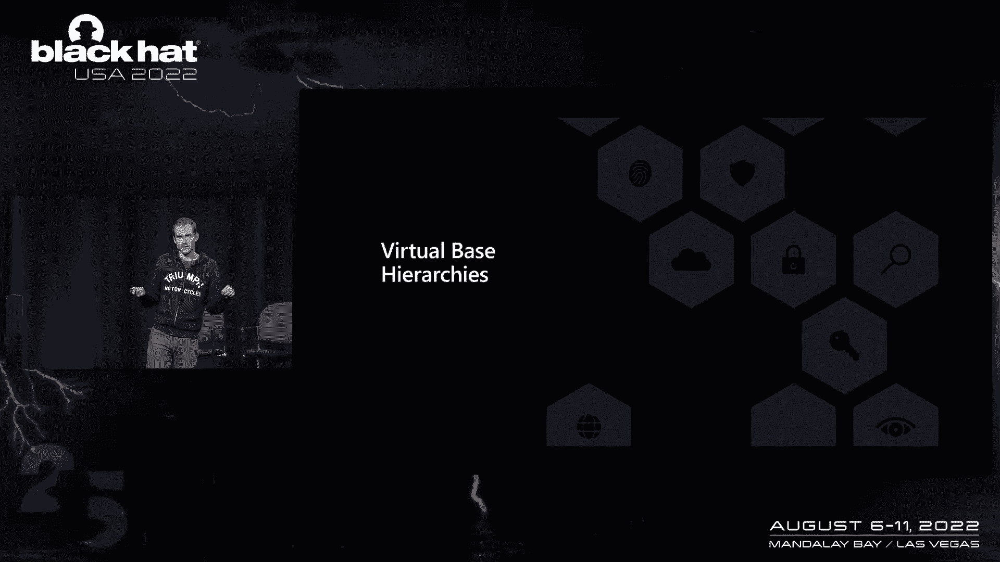

### 虚基类继承（Virtual Base Inheritance）

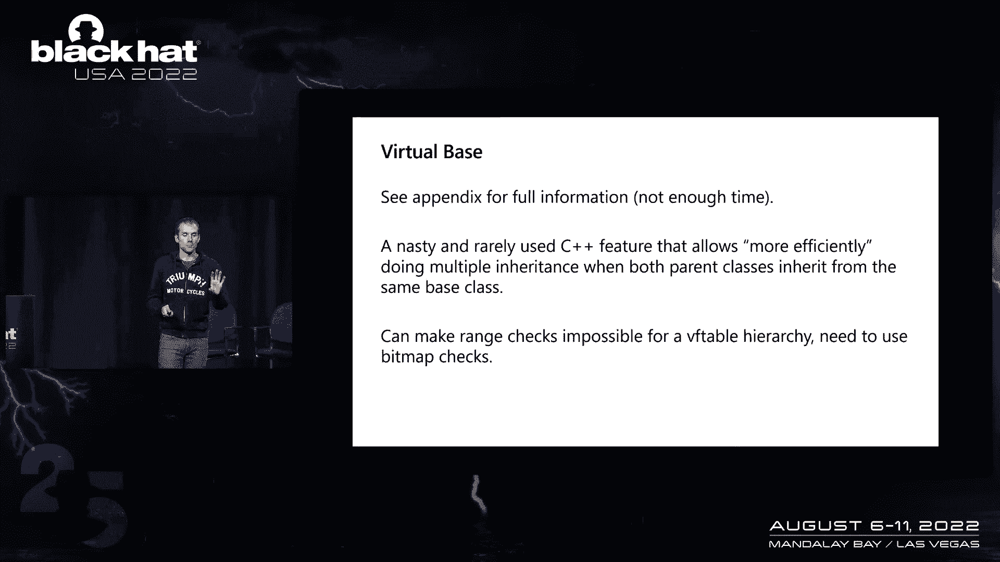

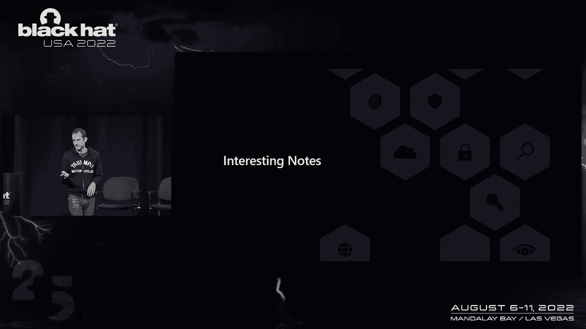


虚基类继承是C++中非常复杂的特性，也是CastGuard中唯一有时必须退回到使用**位图检查**的情况。因为虚基类的布局可能导致合法虚表不再连续排列。关于此部分的详细处理已包含在讲稿附录中。


## 实践中的挑战与优化

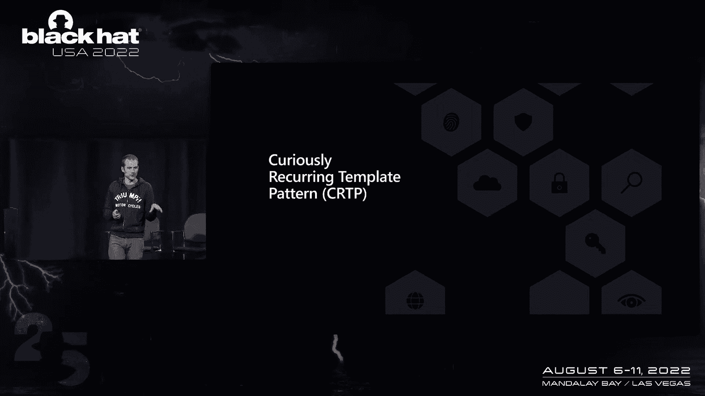


在实现和部署CastGuard的过程中，我们遇到并解决了一些有趣的挑战。

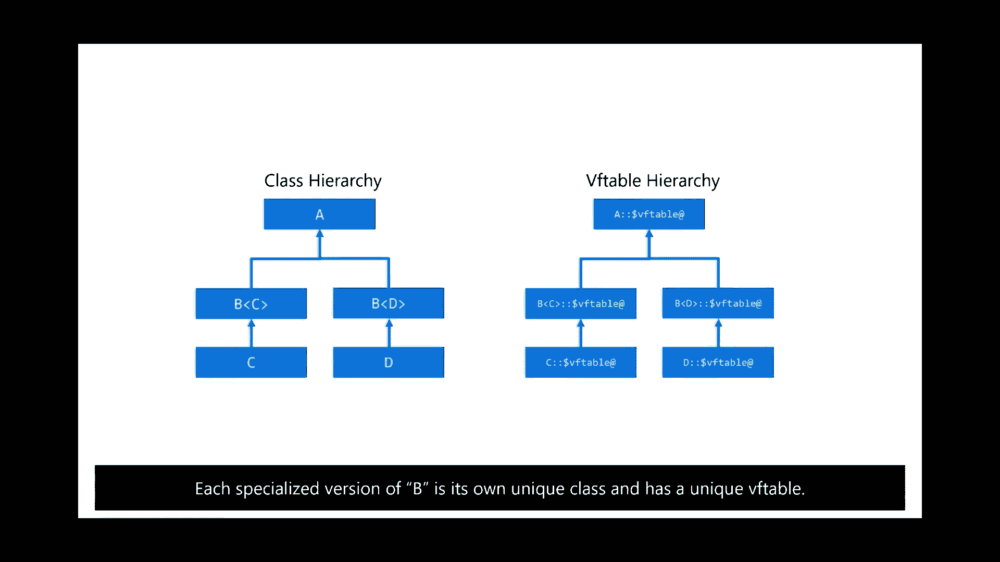


### 与链接器优化（ICF）的冲突

链接器有一项优化叫做“相同COMDAT折叠”（ICF），它会合并完全相同的只读数据（如代码段、虚表）。但CastGuard依赖虚表的唯一性来标识对象，因此我们必须对CastGuard区域内的虚表禁用ICF。

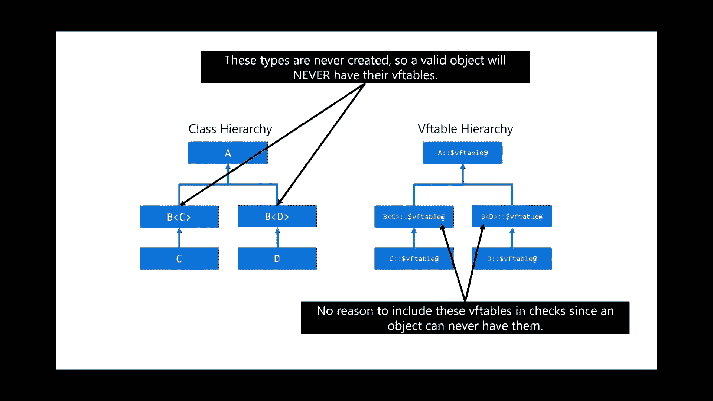

### 奇异递归模板模式（CRTP）


CRTP是一种在Windows代码中常用的模式，它导致了一个看似单一的基类在编译器看来因模板参数不同而生成多个独特的类，每个都有自己独特的虚表。

最初启用CastGuard时，这导致了显著的二进制体积膨胀（约20%）。但我们发现，这些中间模板类**从未被直接实例化**，只有最终的派生类会被创建。因此，在向下转型检查中，可以静态证明这些转型总是安全的，从而**完全消除**相关的CastGuard检查代码和虚表。最终，我们将二进制体积膨胀从20%降到了0%。

相比之下，类似的防护技术（如Clang CFI和微软的XFG）在应对CRTP模式时会产生更大的体积开销。


## 总结与展望

本节课中我们一起学习了CastGuard如何高效地缓解C++中的非法静态向下转型问题。

**总结如下：**
*   **目标**：解决`dynamic_cast`因依赖RTTI、开销大而难以部署的问题，提供一种高性能的类型混淆缓解方案。
*   **原理**：利用对象已有的虚表指针作为类型标识符，在运行时检查向下转型的合法性。
*   **核心优化**：通过深度优先布局虚表，将检查简化为高效的范围比较，生成极少的汇编指令。
*   **性能**：基准测试显示无性能回退，二进制体积影响通常小于1%，易于大规模部署。
*   **现状**：已在Windows Insider预览版的Hyper-V组件中启用（先遥测后强制），并计划推广至更多组件。

**未来可能的发展方向包括：**
*   引入严格模式，禁用跨二进制兼容性检查（即外部对象转型直接失败）。
*   探索始终使用位图检查的模式，以提升对内存破坏的抵抗力。
*   利用CastGuard加速`dynamic_cast`，在快速检查失败后再进行完整检查。


最终，CastGuard证明了在C++中实现高性能类型安全是可行的，这对于应对日益重要的类型混淆漏洞至关重要。