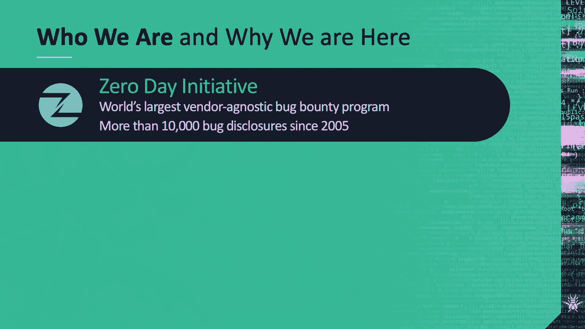
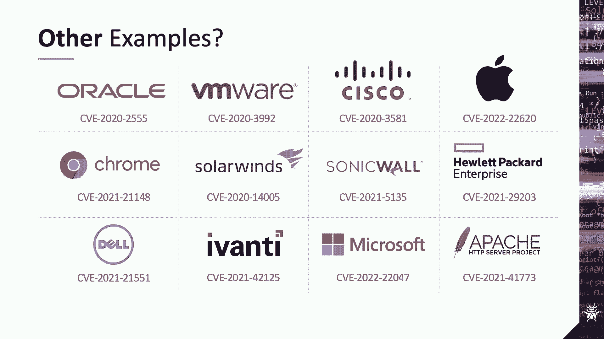
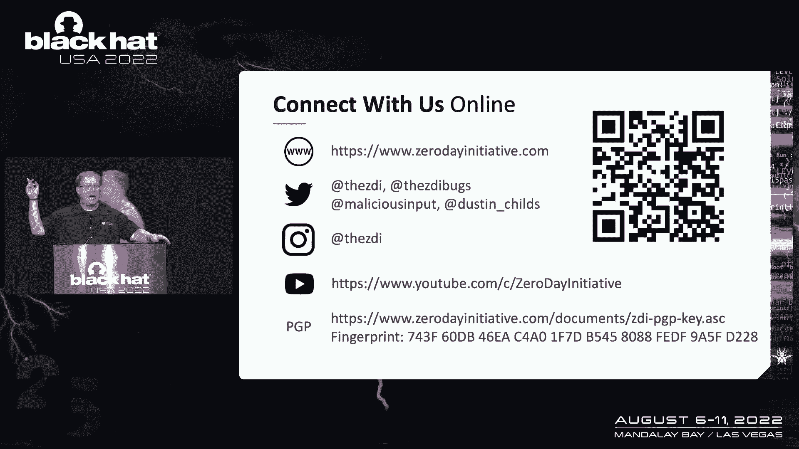

# 课程 P47：052 - 在安全建议模糊的时代计算风险 📊

在本节课中，我们将学习如何解读安全补丁公告，理解当前供应商的补丁发布实践如何可能给企业带来风险，而非降低风险。我们将探讨补丁质量下降、沟通不透明等问题，并学习如何更准确地评估和应对这些风险。

---

## 概述

大家好，我是布莱恩·戈登，趋势科技漏洞研究高级总监，同时负责运营零日倡议（ZDI）。今天与我一同演讲的是达斯汀·蔡尔兹，ZDI的高级传播经理。我们将讨论安全补丁本身的安全性，以及当前供应商的做法如何可能给企业带来风险。

达斯汀对安全补丁有深入的研究，他从2008年1月起几乎追踪了每一个“补丁星期二”的更新。研究表明，打补丁是保护企业、降低事件和违规风险的最佳方法之一。然而，近年来我们注意到一个令人不安的趋势：补丁质量下降，围绕安全更新的沟通也在减少。

---

## 企业如何计算风险？🤔

上一节我们介绍了当前补丁环境面临的挑战。本节中，我们来看看企业通常如何计算风险，以及安全补丁相关的问题如何可能导致误判。

企业通常依赖通用漏洞评分系统（CVSS）的基础得分来确定补丁优先级。但这可能导致资源被分配到不太可能被利用的漏洞上。

以下是CVSS评分机制存在的一些问题：

*   **评分者偏见**：CVSS分数由人计算，其个人偏见可能导致分数被调高或调低。
*   **忽略可利用性**：CVSS不评估漏洞在现实中被利用的可能性。研究表明，只有约0.5%的公开漏洞被实际检测到并利用。
*   **缺乏上下文**：CVSS不会告诉你漏洞存在于多少系统中，是否在公开访问的服务器上，或者是否对您的企业至关重要。
*   **漏洞合并**：供应商有时会将多个漏洞报告合并为一个CVE编号。这可能会扭曲企业对产品风险的计算，因为一个CVE背后可能隐藏着数十个漏洞。

---

## 模糊或缺失的安全建议 📄

上一节我们探讨了风险计算的误区。本节中，我们聚焦于供应商在发布安全建议时存在的信息模糊或缺失问题。

许多供应商在安全建议中提供的信息不完整或具有误导性。例如，微软曾从其安全更新指南中移除了“执行摘要”，仅依赖CVSS分数，这剥夺了管理员评估风险所需的上下文信息。

以下是安全建议中常见的信息缺失问题：

*   **关键信息模糊**：对于“安全功能绕过”类漏洞，CVSS无法说明具体绕过了什么功能以及可能性有多大。
*   **评级不一致**：微软自身的“严重性”评级有时与其给出的CVSS分数不匹配，让管理员难以抉择。
*   **信息深藏**：关于哪些漏洞正被主动利用的关键信息，现在往往深埋在冗长的公告中，而非明确标出。
*   **缺乏CVE编号**：一些供应商甚至不提供CVE编号，只是笼统地说“修复了若干安全问题”。
*   **付费墙后的建议**：部分供应商将详细的安全建议放在付费墙或支持合同之后，进一步掩盖了风险。

向补丁自动化和API驱动漏洞报告的推进，使得所有漏洞在纸面上看起来都差不多，削弱了企业判断其系统真实风险的能力。

---

## 有缺陷的补丁本身 🐛

上一节我们讨论了沟通问题。本节中，我们来看看补丁本身可能存在的缺陷，这是更直接的风险来源。

最糟糕的情况是“安慰剂补丁”，即供应商发布的补丁未进行有效的代码更改，漏洞依然存在且可被利用。

以下是几种常见的补丁缺陷类型：

*   **安慰剂补丁**：补丁发布后，漏洞仍然可被访问和利用。这不仅通知了威胁攻击者漏洞的存在，还让企业误以为自己受到了保护。
*   **单点修复**：补丁只修复了漏洞的某个特定触发点，攻击者稍作修改即可绕过。例如，Adobe Acrobat曾修复一个漏洞时，只检查了某个特定值，研究人员在一小时内就找到了绕过方法。
*   **补丁被绕过**：供应商修复漏洞后，研究人员或攻击者发现了新的方法绕过该补丁。例如，在微软SharePoint和趋势科技自身的产品中都出现过补丁被多次绕过的案例。

根据ZDI的数据，目前我们购买的漏洞中有10%到20%是错误或不完整补丁的直接结果。

---

## 补丁分析“产业”与时间线 ⏳

上一节我们看到了有缺陷补丁的具体例子。本节中，我们来探讨围绕补丁分析形成的“产业”，以及相关的时间线如何影响企业风险。

补丁的间歇性质量催生了一个分析、逆向工程甚至武器化补丁的“产业”。这个产业的存在直接影响企业的风险。

以下是该产业的主要参与者：

*   **第三方补丁管理工具**：如ManageEngine、Ivanti，帮助企业管理补丁部署，但不深入分析补丁内容。
*   **威胁情报公司**：如趋势科技、Exodus Intelligence，对补丁进行逆向工程，分析威胁。
*   **渗透测试与红队社区**：开发漏洞利用概念验证（PoC），集成到测试工具中。
*   **网络犯罪团伙**：同样关注补丁，将公开的漏洞集成到他们的攻击工具包和勒索软件中。

关键的时间线不是漏洞被修复的时间，而是**补丁在您企业中实际部署完成的时间**。您需要问自己：您的部署速度能否快于攻击者分析补丁并开发出漏洞利用的速度？在某些案例中，从补丁发布到漏洞利用出现可能只需4到8小时。

风险评估应在补丁发布后持续进行。一个最初被评估为低优先级的漏洞，一旦被集成到攻击工具包中，风险等级会急剧上升。

---

## 案例研究：从补丁到漏洞利用的极速转化 ⚡

上一节我们介绍了补丁分析产业。本节中，我们通过一个具体案例，看看漏洞利用的开发速度能有多快。

在Pwn2Own 2021黑客大赛中，一个团队利用了一个V8 JavaScript引擎的漏洞，同时攻击了Chrome和Edge浏览器。他们将漏洞报告给谷歌后，发生了以下事件：

1.  谷歌团队将修复代码提交到了开源的V8代码库。
2.  在修复代码被集成到下游浏览器（如Chrome）的官方版本**之前**，一名安全研究人员通过逆向工程开源的修复代码，成功构建并发布了漏洞利用（PoC）。
3.  谷歌于4月13日发布了Chrome的补丁，微软几天后也发布了Edge的补丁。
4.  然而，其他所有基于Chromium且尚未集成上游修复的Web应用程序（如某些PDF阅读器、智能电视、汽车信息娱乐系统等）在一段时间内仍然处于脆弱状态。

这个案例凸显了“补丁间隙”问题，以及不同供应商（敏捷发布 vs. 传统周期发布 vs. 静默OTA更新）的更新策略差异如何给最终用户带来风险。

---

## 我们能做什么？🛡️

上一节我们分析了补丁带来的复杂风险。本节中，我们来看看企业和安全社区可以采取哪些措施来应对。

首先，企业需要认识到，由于供应商的有缺陷实践，他们已无法清晰了解其网络的真实风险。有缺陷的补丁正在消耗企业真实的资源和金钱。

以下是企业和个人可以采取的行动：

*   **强化资产发现**：无情地清点您需要保护的所有资产，了解您的软件物料清单（SBOM）。
*   **用采购权发声**：在评估新供应商或续签合同时，将补丁政策和安全建议的透明度作为评估标准。
*   **持续风险管理**：将风险管理扩展到“补丁星期二”之外，持续监控威胁情报、补丁修订和公开的漏洞利用（PoC）发布。

为了激励供应商改进，ZDI决定对由不完整或有缺陷补丁导致的漏洞，采用缩短的披露时间表：

*   **30天**：针对“严重”级别、补丁发布后仍易被规避的漏洞（视为已受到主动攻击）。
*   **60天**：针对“高危”和“严重”级别、补丁提供部分防护的漏洞。
*   **90天**：针对其他情况。

我们鼓励其他漏洞披露组织也采用类似针对失败补丁的缩短时间表。

---

## 总结与最后思考 💡

在本节课中，我们一起学习了在安全建议模糊时代计算风险的复杂性。我们探讨了以下核心要点：

1.  **风险计算误区**：仅依赖CVSS分数或供应商模糊的建议会导致企业误判风险。
2.  **补丁质量危机**：“安慰剂补丁”、单点修复和易被绕过的补丁普遍存在，直接威胁企业安全。
3.  **补丁分析产业**：攻击者会快速逆向工程补丁并开发漏洞利用，使得部署窗口期非常紧张。
4.  **企业应对策略**：需要强化资产发现、利用采购权要求供应商提高透明度，并实施持续、动态的风险管理，而非仅关注补丁发布日。
5.  **社区行动**：通过缩短针对失败补丁的漏洞披露时间表等方式，激励供应商提高补丁质量和沟通透明度。

不完整和有缺陷的补丁正在被真实世界的威胁攻击者所利用。您的风险评估必须超越每月的补丁日，持续关注整个威胁态势的变化。