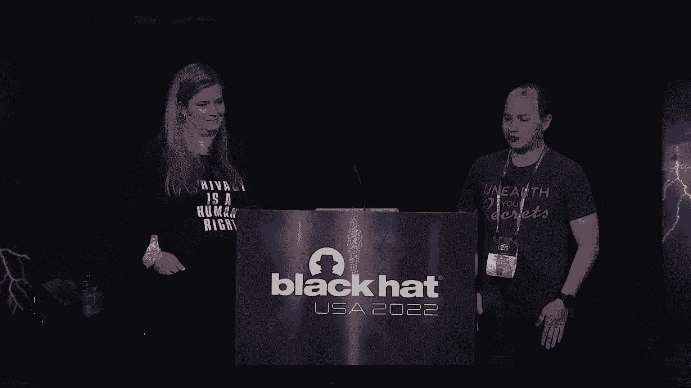
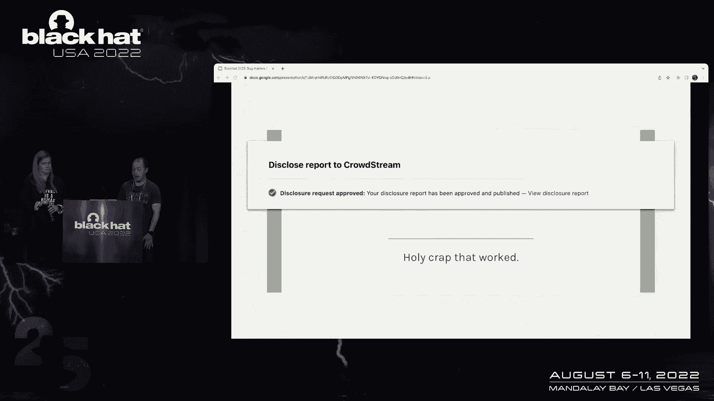
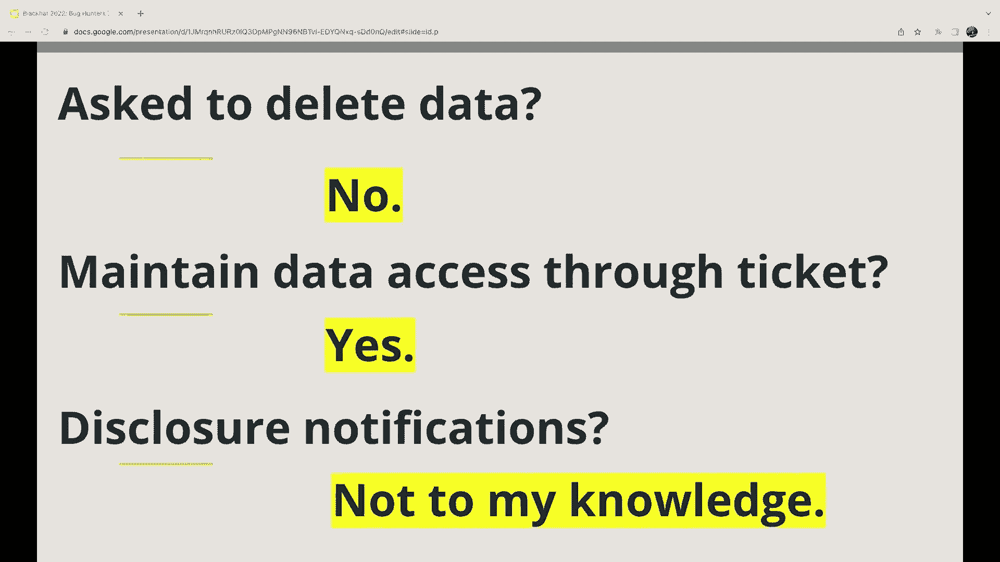
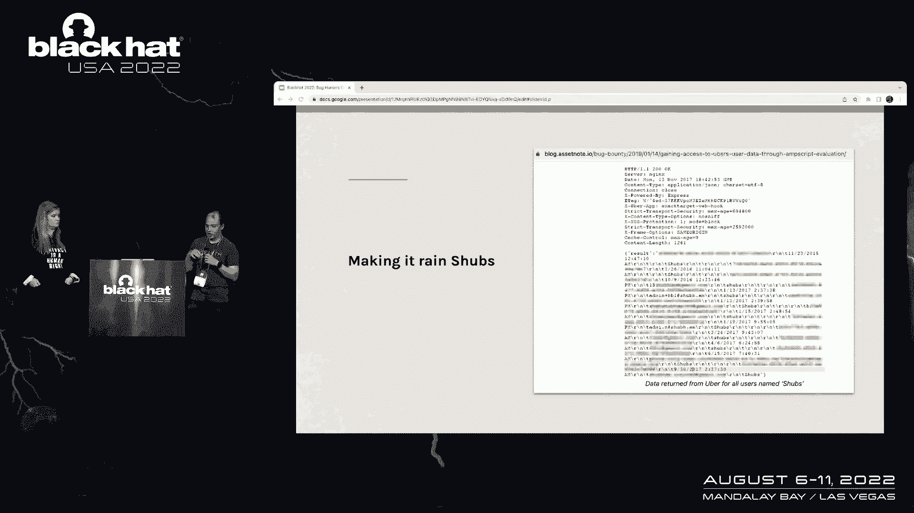
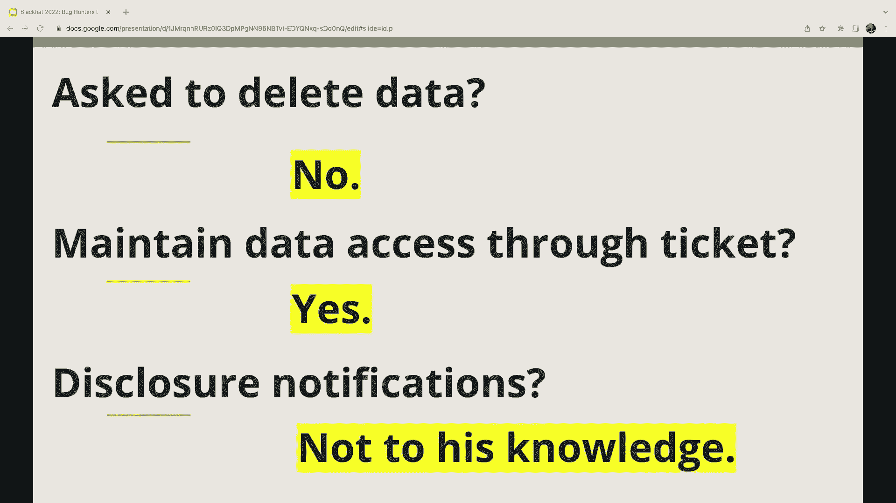
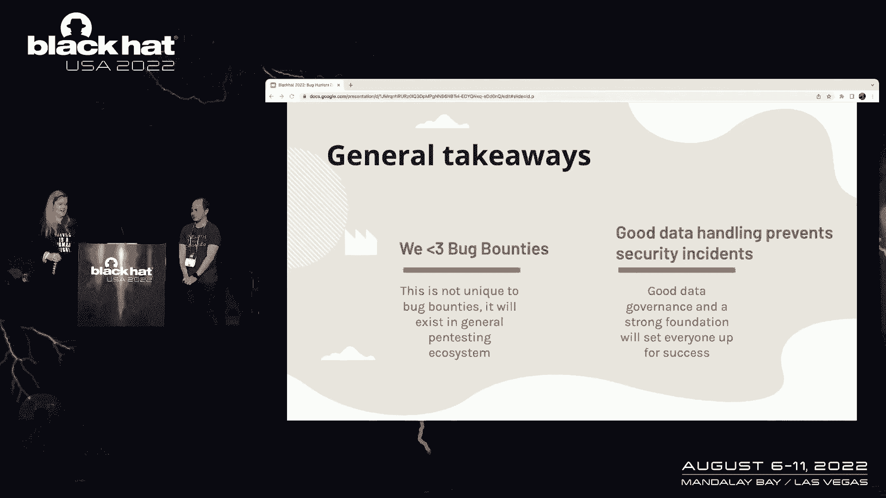

# 课程 P48：053 - 漏洞赏金猎人获取用户数据。他们能保留吗？无论如何他们都在保留 🐛🔍

在本节课中，我们将探讨漏洞赏金测试中一个常见但常被忽视的问题：研究人员在测试过程中意外获取用户数据后，这些数据的去向、保留风险以及相关的法律和道德考量。我们将通过真实案例，分析问题根源，并为研究人员和项目运营方提供实用的改进建议。

## 概述：我们是谁与问题背景 👥

在深入探讨之前，我们先介绍一下自己。我叫迪伦，是一名安全研究员，也是一名漏洞赏金猎人。我曾共同创立了一家名为松露安全的公司。另一位是惠特尼，我是一名律师，与多家公司的安全团队密切合作，曾帮助建立协调漏洞披露计划。

大多数漏洞赏金计划都明确规定：**不要触碰其他用户的数据**。他们要求测试者仅使用自己的账户，避免让其他用户参与测试。这是一个普遍的原则。

然而，本次讨论的核心正是**数据隐私与漏洞赏金**之间的冲突。我们一方面告诫黑客不要接触非其所有的数据，另一方面，在实际测试中，数据泄露却时有发生。

## 一个真实的测试事故案例 📂

上一节我们介绍了问题的普遍性，本节中我们来看看一个具体的测试事故是如何发生的。

我在测试一个程序的漏洞赏金时，意外访问了本不该访问的数据。当时我正在测试一种名为“盲跨站脚本”的漏洞。我用自己的用户名替换了一段JavaScript代码并提交到系统，之后便忘记了此事。

这段JavaScript代码的功能是，如果有人不安全地执行了它（即不安全地渲染了我的用户数据），它会截取该页面的屏幕截图并发送给我。结果，一位员工访问了一个管理页面，该页面不安全地渲染了用户数据，其中包含了系统中每个用户的列表。这个包含所有用户数据的页面被截图并发送给了我，导致我意外获得了所有人的用户数据副本。

我立即向项目方完全透明地披露了此事，附上了所有截图和步骤。然而，项目方从未要求我删除已获取的数据副本。

## 数据的多副本留存与访问问题 💾

上一节描述了一次数据泄露事故，本节中我们来看看这些泄露的数据是如何在多个系统中留存并持续可访问的。

数据泄露的链条非常复杂。员工浏览器访问了管理页面，这是数据的源头。我使用的第三方测试系统 XSS Hunter 截取了屏幕截图。XSS Hunter 运行在 AWS 上，这意味着其运营者拥有数据副本。截图随后通过电子邮件发送给我，因此我的电子邮件提供商也存有副本。我将截图下载到本地硬盘，本地备份中又产生了副本。最后，我将所有信息提交到漏洞跟踪系统，该系统中也保存了副本。

尽管漏洞报告已被关闭且漏洞得以修复，但我发现我仍然可以登录漏洞平台，访问那些包含用户数据的旧报告。这些数据并未被清除。我询问了其他一些资深漏洞赏金猎人，他们百分之百确认存在同样的问题：他们仍然可以访问多年前已关闭的报告中附带的敏感数据。

## 可公开讨论的案例分享 📰

鉴于许多公司不愿公开讨论此类隐私泄露事件，我们特别感谢那些允许我们分享案例的公司。以下是几个我们获得许可后可以公开讨论的真实例子。

**案例一：某求职平台**
*   **事件**：该平台的开发人员在本地笔记本上编写自定义HTML进行研究，不安全地渲染用户数据，触发了我的盲XSS测试载荷。
*   **结果**：我意外获取了大量用户个人数据。
*   **关键问题**：1. 未要求我删除数据；2. 我至今仍可通过报告访问数据；3. 据我所知，未向受影响用户发出通知。

**案例二：Google**
*   **事件**：与案例一类似，员工本地脚本测试导致数万条用户记录通过XSS Hunter泄露给我。
*   **结果**：我曾被要求删除数据。但直到本次演讲准备期间（距离事件约两年），Google才因本次讨论而决定改进流程，将删除报告附件中的数据。
*   **关键问题**：在长达两年的时间里，数据在报告平台中持续可访问。

**案例三：独立研究人员的公开报告**
*   研究员 `chubbs` 在测试 Uber 时，因一个模糊查询漏洞，意外获取了包含特定字符串的多条用户记录。他公开了漏洞，但原始报告中的未编辑数据仍可访问，且未被要求删除。
*   研究员 Sam Curry 发现并证明了 Starbucks 的一个漏洞可导致访问大量客户记录。他实际只访问了少数几条非本人记录。这些测试数据仍存在于已关闭的报告中，且除了他的博客文章外，没有其他公开披露。

这些案例表明，漏洞赏金中的隐私泄露并非偶发事件，而是相当普遍。对于我们能够公开分享的每一个例子，背后可能还有上百个无法公开的案例。

## 数据泄露的动机与原因 🤔

那么，为什么这类数据泄露会发生？主要有两个层面的原因。

**1. 意外泄露**
在测试如盲跨站脚本这类漏洞时，研究人员通常无法预知测试载荷会在何处、以何种方式被触发。当载荷在管理员界面或包含敏感数据的页面触发时，就会导致意外数据泄露。

**2. 主动证明影响**
有时，研究人员会主动尝试获取数据以证明漏洞的影响。这主要受两种动机驱动：
*   **奖励激励**：漏洞影响越严重，奖励通常越高。证明能访问他人数据可以展示更大的影响，从而争取更高报酬。
*   **分类压力**：漏洞赏金平台审核人员被海量提交（其中很多无效）淹没，为了快速筛选，他们可能要求研究人员“提供更多信息”或“进一步证明漏洞影响”。这无形中鼓励了研究人员去获取更多数据。

## 问题的严重性与潜在风险 ⚠️

数据看似无处不在，我们为何要关心？又能否解决？

以第三方测试服务 XSS Hunter 为例，其数据库中存在高达 **66TB** 的盲XSS截图数据。这是一个由个人维护的服务，却集中了海量的潜在敏感信息。

此外，许多研究人员的漏洞平台账户并未启用双因素认证。如果此类账户被盗，攻击者便能访问其提交历史中所有包含用户数据的报告，造成二次泄露风险。

我们必须认识到，漏洞赏金计划本身是积极的力量，运营此类计划的公司比不运营的公司处于更有利的安全位置。我们无意羞辱任何公司，尤其是那些允许我们透明讨论问题的公司。我们的目标是推动行业对话，迈向更成熟的“漏洞赏金2.0”阶段。

## 给各方的实践建议与改进方向 🛠️

我们可以采取渐进式步骤来改善现状。以下是针对不同角色的建议。

**给漏洞赏金项目运营方的建议：**
*   **制定明确政策**：在政策中明确要求研究人员在提取数据前暂停，并严格遵守。
*   **做好最坏打算**：将漏洞赏金视为数据生命周期的一部分，与隐私和法律团队合作，提前规划数据泄露的应对流程，包括可能的违规通知义务。
*   **加强内部安全**：强化内部应用程序和员工设备的安全，实施定制化的访问控制，避免过度授权。

**给安全研究人员的建议：**
*   **知晓数据流向**：了解你的测试工具（如XSS Hunter）会将数据发送至何处，并管理这些数据。
*   **避免数据扩散**：尽量不要通过电子邮件发送敏感数据；如果必须分享，使用有访问控制的云链接而非附件。避免在本地硬盘永久保存数据，测试完成后及时删除。
*   **诚实沟通**：如果公司询问数据删除情况，诚实地告知已删除的部分以及可能无法删除的副本（如某些第三方系统），不要撒谎。
*   **清理备份**：对本地备份实施数据保留策略，定期清理。

**给漏洞赏金平台的建议：**
*   **增强数据治理能力**：为项目方提供删除报告附件、设置数据自动保留期限等功能。
*   **推行强认证**：强制要求研究人员启用双因素认证。
*   **整合测试设施**：考虑运营自己的测试基础设施（如安全的XSS测试接收端），将数据流控制在平台内部，便于统一的数据治理和清理。

## 法律义务与注意事项 ⚖️

这是每个人都关心的问题：我会因此惹上法律麻烦吗？

在美国，相关的法律如《计算机欺诈和滥用法案》曾被用于起诉安全研究人员。**授权范围**是关键。漏洞赏金计划通过邀请，为研究人员提供了在一定范围内的授权。但“诚信”的界限很模糊，取决于具体情况。

**法律问题通常在人们感到未被倾听、未达成共识时爆发。** 因此，开放、诚实的沟通至关重要。

**给公司的核心建议：**
*   确保要求研究人员删除其持有的任何数据，并获取书面确认。
*   评估数据泄露是否对个人造成潜在伤害，这通常是触发违规通知义务的关键。
*   减轻任何潜在的损害。

**给研究人员的核心建议：**
*   不要扩散数据。向公司报告漏洞，而非公开泄露数据。
*   如果被要求删除数据，请切实执行。
*   诚实告知公司你无法完全删除数据的情况（如某些第三方系统）。

## 总结与展望 🌟

本节课中，我们一起探讨了漏洞赏金测试中用户数据泄露的普遍性、留存风险及其成因。

我们通过真实案例看到，数据可能在研究人员本地、第三方测试服务、电子邮件、漏洞平台等多处留存。泄露的动机包括意外触发和为了证明漏洞影响。这带来了潜在的法律与二次泄露风险。

我们为项目运营方、研究人员和平台方都提供了具体的改进建议，核心在于**加强数据生命周期管理、提高透明度和实施更严格的数据治理**。

我们热爱漏洞赏金生态，也感谢那些秉持透明精神的公司的勇气。我们的目标不是指责，而是开启下一阶段的对话，推动整个行业更好地处理测试中的数据隐私问题，在提升安全的同时，保护好每一位用户的权益。

**关键要点**：保持沟通顺畅，明确各方期望，管理好数据流向，并始终以诚信行事。尽量不要激怒任何人，但如果不幸发生了问题，诚实和透明是最好的策略。

---
**课程总结**：漏洞赏金是强大的安全工具，但伴随而来的是数据隐私的责任。通过预先规划、清晰的政策、完善的工具链和诚实的沟通，我们可以最大限度地发挥其益处，同时控制风险，构建更安全、更负责任的网络安全实践。