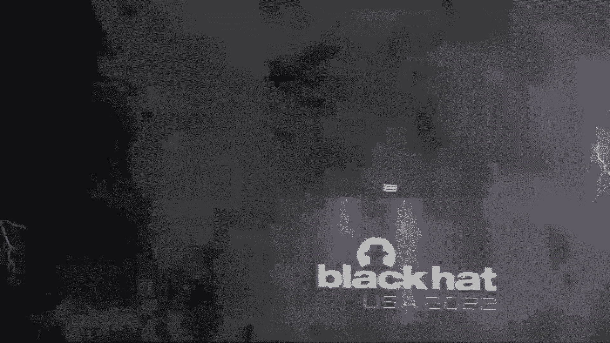
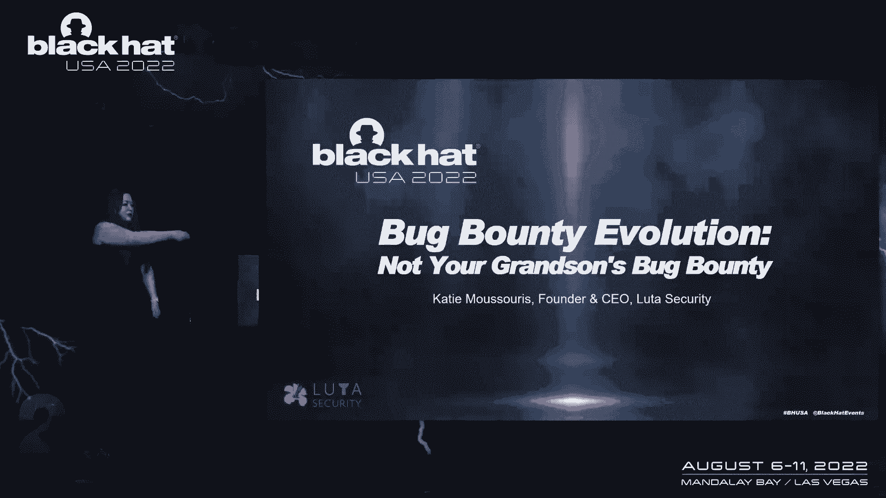

# 课程 P49：054 - 漏洞赏金的演变：这不是你孙辈的漏洞赏金 🐛💰

## 概述

在本节课中，我们将探讨现代漏洞赏金计划在过去十年中面临的核心问题。我们将回顾漏洞赏金的历史，分析当前市场双方（黑客与组织）面临的挑战，并探讨如何通过改进流程和度量标准来实现更好的安全成果。课程最后，我们将分享一个关于网络安全劳动力发展的新倡议。

---

## 漏洞赏金的承诺与现实

上一节我们概述了课程内容，本节中我们来看看漏洞赏金计划的初衷与实际效果。

漏洞赏金计划曾承载着伟大的承诺。其目标是让黑客远离法律风险，获得报酬，并最终获得稳定、宜居的收入。同时，它也旨在为网络安全行业建立未来的人才管道。

然而，现实情况是，这些承诺并未完全兑现。问题的一个关键点在于组织的成熟度。即使一个组织了解其所有的安全漏洞，如果它没有能力持续修复这些漏洞，安全事务也总会落后于其他业务优先级。

因此，我们需要围绕市场双方的成熟度演变来组织工作，并从系统动力学的角度进行思考。

---

## 漏洞赏金简史

了解了现状后，让我们回顾一下漏洞赏金是如何发展至今的。

漏洞赏金并非始于“黑掉五角大楼”计划。这个概念在许多年前就已出现。唐·克努斯在出版著作时，曾为书中的任何错误（包括编辑问题或拼写错误）支付0x16美元赏金。

1995年，Mozilla为安全漏洞提供了500美元的赏金，这是最早的安全漏洞奖励之一。此后，漏洞赏金领域沉寂了许久，直到谷歌为了加速Chrome浏览器的开发而复兴了这一想法。谷歌当时没有遗留代码库的负担，他们希望通过赏金在短时间内暴露尽可能多的漏洞。

2010年，谷歌将最高赏金提高到3000多美元。这使得“我们能否出价高于攻击市场（黑市）”的问题突然变得更具可行性。同年，我在微软参与创建了其漏洞赏金计划。我们不仅设定了当时行业供应商中最高的赏金，更重要的是，我们围绕具体的战略安全目标来设计计划。

我们调整了赏金发布时间，以引导黑客在产品测试期结束后立即报告漏洞，从而最大化我们可修复的漏洞数量。2013年微软赏金计划推出后，整个行业获得了巨大推动。随后，“黑掉五角大楼”等政府项目进一步普及了漏洞赏金。

然而，许多组织在尚未准备好内部修复流程时就仓促加入了赏金计划的行列。

---

## 当前观察到的三大常见问题

回顾了历史，现在我们聚焦于当前漏洞赏金实践中反复出现的核心问题。

基于对行业多年的观察，我开发了一个免费的“漏洞协调成熟度模型”。该模型基于五个关键能力领域，是组织在不断涌入的漏洞报告中生存所需的基本能力。

以下是我们在观察漏洞赏金计划成败时，发现的最重要的三个预测因素：

1.  **组织承诺**：组织必须致力于修复漏洞。许多组织只是在做“漏洞赏金肉毒杆菌”——他们启动一个计划（甚至是私密模式），利用平台的保密条款锁定漏洞报告，可能会支付赏金，但并未实际修复。这不仅仅是投入更多工程师的问题，还涉及流程、角色职责和内部工具。
2.  **流程与响应**：许多组织缺乏处理漏洞报告的有效流程。例如，我曾花费数周时间尝试报告一个漏洞，却找不到正确的联系人，也得不到回应。即使组织有赏金计划，其接收和处理流程也可能存在严重缺陷。
3.  **人力资源与角色**：安全不仅仅是开发人员的责任。许多组织缺乏专门的安全角色来处理漏洞的“内部消化系统”。当关键的安全流程角色缺失或人员流动率高时，整个赏金计划就会在自身重压下崩溃。

---

## 度量标准：洞察你的安全状况

识别了问题，下一步是如何衡量和改进。本节我们来看看哪些度量标准至关重要。

许多组织甚至无法回答关于其漏洞状态的基本问题。你应该考虑的度量标准包括：

*   **平均修复时间**：修复危急漏洞和低危漏洞分别需要多长时间？
*   **重复报告率**：同一个漏洞被不同研究者报告了多少次？高重复率表明该漏洞易于发现且潜在可利用性高，应提升修复优先级。
*   **案件重开频率**：这表明你可能未理解根本原因，或修复/测试不彻底。
*   **接力棒掉落点**：漏洞修复像一场接力赛。你需要知道流程在哪个环节（如分诊、分配给开发团队、修复验证）出现延迟或返工。

通过测量这些结果，你可以识别是产品团队人手不足、需要更多培训，还是安全团队提供的信息不够清晰。这些洞察能帮助你从修复大量易发现的“低垂果实”，转向应对更少、更复杂的高技能漏洞，这标志着安全实践的成熟。

---

## 未来的方向：混合模型与劳动力发展

掌握了度量方法，我们来看看如何构建更可持续、更公平的未来模式。

首先，漏洞赏金不一定需要保密协议（NDA）。赏金本质上是对漏洞披露过程的答谢。我们倡导一种“探戈”式的混合模型——这是一种基于合同的、持续的渗透测试或漏洞研究合作。研究者即使没有发现漏洞也能获得报酬，而当他们发现一种漏洞模式时，可以签订短期合同来枚举该漏洞在所有端点上的实例。

这种方式对双方都更可预测、更高效。市场双方都能带着所需的结果满意离开。

其次，我们必须关注网络安全劳动力。漏洞赏金目前存在“赢家通吃”的问题，这比零工经济中的问题更甚。如果我们不构建更公平的模式，我们的行业将面临与网约车司机类似的困境。

因此，我们很高兴地宣布，我们正在参与并推动**网络安全学徒计划**。通过与政府和企业合作，我们旨在雇佣和培训明天的网络安全劳动力，为那些需要经验但无法满足“十年专家经验”要求的人提供途径。

我们始终以深思熟虑的方式管理赏金服务，并指导客户达成其安全目标。成熟度至关重要，漏洞赏金很棒，但不能用作“肉毒杆菌”来掩盖内部的安全缺陷。你的内部流程必须健全。

---

## 总结与寓言启示

本节课中，我们一起学习了漏洞赏金的演变历程、当前挑战以及改进方向。

我们探讨了组织承诺、流程缺陷和人力资源对赏金计划成功的关键影响。我们介绍了重要的安全度量标准，并提出了“探戈”混合模型作为更公平、高效的未来方案。最后，我们宣布了参与网络安全学徒计划的倡议，致力于培养行业未来人才。

最后，让我用“长勺寓言”来结束。寓言中有两个房间，摆设完全相同：一张大桌子，中间有食物，每个人都有很长的勺子。在地狱的房间，人们试图用长勺喂自己，却因够不到而饥饿痛苦。在天堂的房间，人们用长勺互相喂食，大家都得到了滋养。

**天堂与地狱的区别，不在于工具，而在于我们如何使用它们。** 我们拥有所有的工具（长勺），我们的时间（日子）可能有限。在网络安全领域，通过协作、改进流程和培养人才，我们可以共同构建一个更安全、对所有人更有利的生态系统。

---