# P5：005 - Invisible Finger： Practical Electromagnetic Interference Attack on Touchsc - 坤坤武特 - BV1WK41167dt

现在我很荣幸地欢迎来到舞台，非常感谢雷的友好介绍。

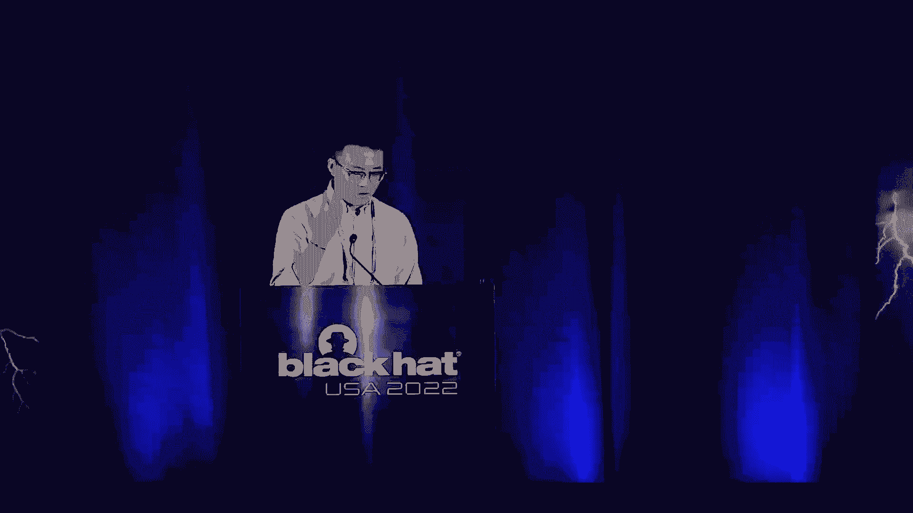

所以今天我将代表我的同事。

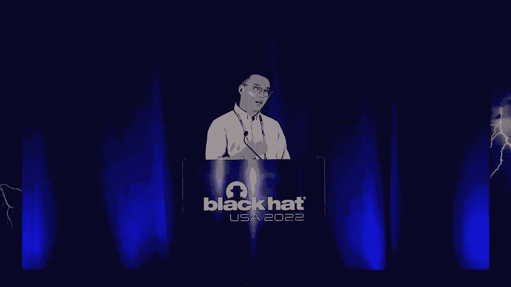

来自佛罗里达大学和新罕布什尔大学，介绍我们最近的研究工作，看不见的手指，基于触摸屏的电子设备的实用电磁干扰攻击。

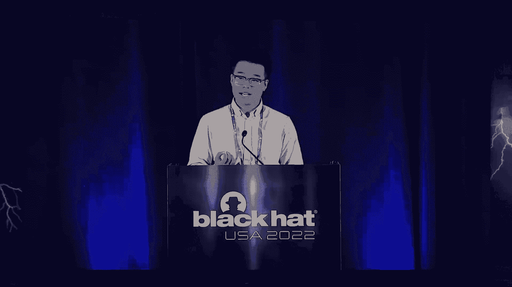

所以我叫Hotchi先生，我现在是佛罗里达大学EDTA的博士生，所以今天我们要经历很多事情，我们想给你一点议程，然后它抬头，发生了什么，将要谈论什么，好的，所以我们会谈论我们显然是谁。

我们还给出了一个简短的，你知道混凝土TD太久了，你没读，以防万一你想知道我们能做什么，我们进攻的特点是什么？只是阻止，决定这是否足够有趣或有趣，你想听，考虑到我们认为大多数观众不会真正有背景。

关于触摸屏如何工作以及我们的攻击将如何从根本上发挥作用的知识，所以我们会花很多时间来介绍触摸屏是如何工作的，我们还将提出对触摸屏设备的理论攻击，一旦我们有了这些背景知识就会介绍。

我们如何使用IAM和来自远处的信号生成精确的触摸事件，我们也会介绍，从我们如何弥合精确触摸事件生成和实际触摸事件攻击之间的差距，在演示文稿结束时，我们会有一个问答环节，你可以问关于，好的，酷。

所以我们是谁，我们实际上是一个研究团队，我们的名字是佛罗里达大学硅实验室的保安，我们专注于安全研究，所以如果你在我们最近的出版物中看到它，我们专注于架构安全和侧通道安全，IP核心安全，AI安全。

所以安全，CP安全，基本上你想涵盖的每一个安全方面，你知道，就像我们这样做，我们是一个很大的实验室，我们发表了一些关于SNP和DSS三人工智能的著作，这种顶级学术会议和一个小广告，我们的时间到了。

我们仍在积极招聘博士生，致力于网络安全研究，所以再一次，如果你有兴趣，请随时给我发消息，给我们发邮件，你知道我们会在线下讨论这个，好的，我会在幻灯片的最后留下我的电子邮件和我的顾问电子邮件。

所以如果你对，你觉得好吧，也许这是我的领域，我想在这上面花时间，请随时给我们发邮件，或者给我们发条信息，事不宜迟，我们想谈谈我们的攻击是什么，我们叫我们的，我们把我们的攻击命名为隐形手指。

但它实际上是看不见的，所以简而言之，你知道一句话，这是一个远程SE精确的触摸，对电容式触摸屏的注入攻击，使用II信号，所以如果你想，你知道，了解我们攻击的一些特点，所以超越了句子。

我刚描述了我们的攻击影响了距离。

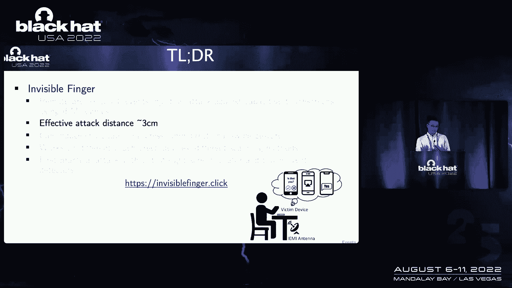

攻击距离在三四厘米左右，我们的攻击可以诱导短暂的敲击，长按，和全方位的滑动手势，到电容式触摸屏上，我们的攻击也适用于不同的触摸屏设备，无论扫描或驱动方法，正在触摸屏控制器上应用的方法，还有我们的攻击。

第一次使用屏幕外定位器和触摸事件导演的实际攻击，事件直接检测器，所以如果你想找东西，找到某种远程触摸事件注入攻击，那就是我们，这实际上是我们做的第一件事，我们还列出了我们攻击的每一个细节。

我们还在网上发表了一篇论文和视频演示，所以如果你有兴趣，你可以查看我们的网站，对狗来说是看不见的，在此演示文稿后单击联机，你会发现一切的每一个细节，因为有些东西我们今天无法恢复，好的。

所以与传统的网络安全研究权相比，比如安卓或iOS或其他类似软件类型的安全研究，那个，对于注射攻击是在触摸屏上仍然准备好仍然是新的，一种攻击，即使对像安全研究人员这样的专业人士来说仍然是一个新的领域。

所以如果你在网上搜索这种类型的攻击，所以我想你可能可以在网上找到一两篇发表的论文，或者用这种东西，这就是为什么今天，我们会花一些时间介绍触摸屏的背景，所以一旦你了解了这一点。

一旦你看完我们提供的所有细节，你应该能够重现我们现在正在做的任何事情，显然你也会发现为什么，我们认为触摸屏攻击现在还处于悬而未决的阶段，所以这意味着一旦你明白了一切，也许你能想出一个更强大的。

或者比我们更酷的攻击，好的，所以再一次，就像触摸屏，每个人都拿着手机，触摸屏基本上是一个你给，到屏幕和设备，并且要操作设备的内容，触摸屏将是你的方式，现在你可以看到触摸屏，几乎卷入了每个人不稳定的生活。

所以在我们智能设备上使用的所有触摸屏中，比如药片，或者就像笔记本电脑一样，所以电容触摸屏实际上是最流行的类型，所以报告，二十二年的报告，只是展示，大约四十个，已使用触摸屏的6%，现在是电容式触摸屏。

在你的工作中，这就是为什么我们在主目标上也选择容量屏幕，因为它一次会有更大的影响，我们意识到所有这些不同类型的攻击，对同时，让我们来看看，触摸屏和电容式触摸屏的优点是什么。

它被不同的供应商使用的原因是什么，容量触摸屏目前的研究状态或状态是什么，所以电容触摸屏，真的，它们有一定的优点，你真的不需要笔来操作，我还支持手势识别和实时反馈，还有各种各样的东西，也适用于供应商方面。

一旦制作完成，供应商只需校准触摸屏或触摸屏控制器，一次所以你，你不喜欢，成本很低，电阻只是使电容器触摸屏，现在是个正确的选择，安全研究呢，对呀，所以它是一种产品，像我们这样的安全研究人员。

所以我们肯定想找出它的问题所在，它有什么问题，所以在安全研究方面，我们实际上把它们分为两类，比如内容窃取和跟踪注入，所以内容窃取，这意味着你将使用某种传感器EM或波浪，这种类似的技术。

您尝试从远处阅读触摸屏上显示的内容，至于触摸事件注入，我想说我们有点像，这三篇论文中有一篇已经在……，你知道做这种类型的攻击，如果你想在网上搜索这个，你会发现在SNP上发布的Ghost上的一个点击。

今年还有一篇关于你们尼克的鬼触论文发表，至于触摸电容式触摸屏，主要有两大类，基于自电容和互电容SP，所以基于自电容的触摸屏，改变手指间电容器的感觉，对不起，就像手指触摸引入的电极和地面之间，相反。

对于基于相互电容的触摸屏，知识分子的上层和下层之间存在着一种相互的电容CM，所以当你的手指触摸屏幕时，互容变化增量c，我们就会产生，这就是电容测量的地方，这就是为什么触摸屏控制器会把它识别为触摸屏。

那是一个触摸事件，所以一旦我们确定这是我们现在要攻击的合适目标，让我们来看看互容触摸屏是如何从根本上工作的，就像我们刚才提到的，互电容触摸屏通常与，你知道的，多对发射和接收实数，所以你可以只充电或放电。

电极之间的距离，你也有某种激励信号发生器，QT传感器，电荷转移传感器的简称，ABC是模数转换器的简称，和一个微处理器，你应该注意到微处理器并不是真正的CPU，我们在整点用手机谈论这个。

它实际上就像一个专用的，设计用于操作和测量触摸屏的触摸，所以当人的手指出现在触摸屏上时，它实际上改变了触摸屏的当前电容，这种变化可以是积极的，也可以是消极的，这真的取决于人类阻抗的变化。

现在我们可以从根本上看到所有的东西，容量和触摸屏，它只是主要的电容，然后确定是不是手指触摸，就连手指的触摸，电容会改变，所以，但在内部，这种机制是如何工作的，如何衡量能力，所以就像我们刚才说的。

要开发一个有效的触摸屏攻击，真的更好理解，您知道在本页中是如何感知相互电容变化的，我会说得慢一点，因为你知道有很多理论上的东西，请随意打断他们我，我会给我一个信号，你觉得我说得太快了，或者如果你想的话。

你知道就像这里在这部分更清楚一点，好的，所以这一页我们展示了相互容量是如何变化的，△c本身在t时间被感测，所以开关的1和3将被关闭，所以内部电压源VI和将充满CM，CS将被完全释放。

所以CM上的电压被充电到VI，CS上的电压将为零，结果你可以看到VO的输出电压为零，如图所示，此刻，三号门是开着的，CS上的电压仍然是零，VO仍然是零，两点钟的时候，S的一个就要打开了。

Vi n与CM断开，厘米上的电压保持在VN上，以cm为单位储存的总电荷基本上相当于cm乘以v i n，三秒钟，S两人势均力敌，电荷cm乘以vn，储存在厘米将完全充电转移到CS，这就是为什么。

这就是为什么我们称之为电荷转移拓扑，结果，输出沃尔沃是由上面的方程给出的，这个方程位于这里，这就是测量电容的方法，通过将电容转化为电压，可以用一个简单的ADC右来测量，所以如果VO小于一定的阈值电压。

就像我说的，那么就不会有触摸事件发生，因为基本上这就是你测量电容的方法，对呀，如果电容A足够小，这意味着四点没有接触事件，S 2是开放的，电路为下一个传感周期做好了准备，所以如果他们是手指触摸。

你知道的，引入相互容量和更改数据c，我们可以看到储存在cm+Δc上的总电荷，它要开启模式了，时间到了，B i n所以这是，这将是最终的结果对吧，所以在输出电压VO中有一个点的VO变化。

如上式给出的图所示，如果v o加delta vo的大小高于阈值，这意味着电容变化超过阈值，我们认为是手指触摸的触摸屏控制器，因为，就像我们之前提到的，根本是如果有容量变化，会有一个敏感的。

只是容量变化会有多大。

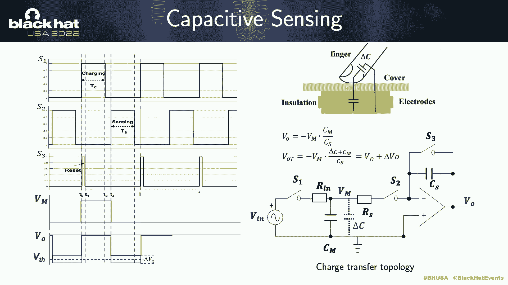

那有点太严肃了，对呀，像很多人一样，如果你没有这方面的背景知识，你可能无法理解，所以我们在这里做了一点动画，你知道，只是试图告诉它是怎么回事，如你所见紫色的代表adc的值，它将测量你可以看到的电流电容。

我们有大约一个的价值，呃，投票，一旦我们有了一旦我们改变这里的电容，这是另一个，一旦我们改变这里的容量，注意ADC现在的读数是多少，一旦我们操作了所有这些完成了所有的图案，序列现在我们将有一个不同的值。

正如你所看到的，因为电容的变化，然后电压也会改变，这实际上是大多数触摸屏工作良好的根本原因，他们可能会有一点，你知道复杂的电路到迫在眉睫的噪音。

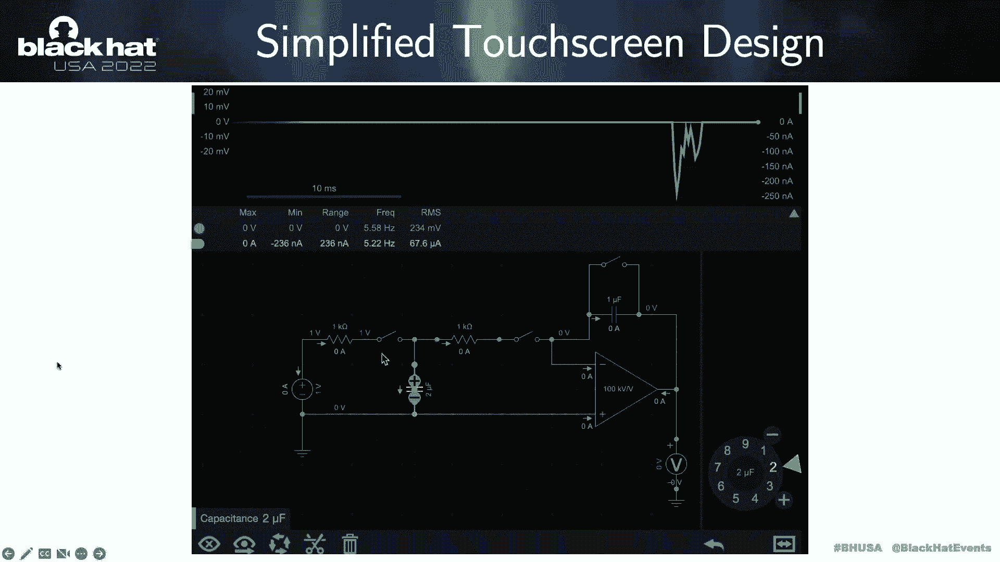

或者有花哨的算法，但从根本上说，这实际上是，会成功的，所以现在我们对触摸屏作品有了基本的了解，你知道的，试着读取电容器并将其转换为电压读数，然后如果电压率变化足够大，我觉得，或者触摸屏控制器会认为。

这将是一个敏感的事件，所以让我们来谈谈理论上我们如何引入触摸事件，在我们了解了触摸屏的工作原理后，这里可以提出一个标记机制，通过在触摸屏上施加外部E场或电场E，垂直分量将在两个电极上引入电压增量VM。

所以基于叠加理论，电压将被添加到VM的原始电压上，所以介绍了，电压等价地增加存储在厘米中的电荷，因此，输出电压有一个增量V E变化，所以说，如果它足够大，电路会识别这种外部，如果你作为一个触摸事件。

这就是我们想要的，对吧，所以我们想操作一个触摸事件，而不是实际上，你知道的，触摸触摸屏只是使用某种EM信号，所以理论上这实际上是正确的，但我们还不知道，所以这就是为什么我们想看到，如果理论真的有效。

这一页我们这张幻灯片，我们展示了如何模拟施加电场，也就是触摸屏的E字段，通过给铜板加电压，在触摸屏上方，所以用天线就能产生电场，它会像手指大小的指尖，尺寸铜板，或者只是一根简单的针，并基于模拟。

我们建立了一个实验环境，允许我们用信号发生器产生一个场，射频放大器，某种铜板，你可以看到现在用铜板，一旦我们把铜板取下来，我们可以沿着垂直水平的方向生成一堆触摸事件，没问题对吧，但正如你在这里看到的。

生成的触摸事件或多或少有点随机，我们想要，如果我们真的想在实际攻击中使用这个，我们要精确对吧，我们想完全控制触摸事件在何时何地产生，那就是我们，这就是为什么我们在这一点上需要某种理论分析。

所以为了产生一个成功的，触摸事件或成功的攻击，我们需要一定的条件，所以成功的攻击有几个条件，第一个将是最小E场强度，e，如果磁场不够强，当然，你将无法产生任何类型的敏感事件。

所以我们在这里列出由方程给出的场强m，其中d是两个电子之间的距离，或者ALF将是虚假触摸的等效区域，所以这意味着使用我们的，呃，用我们这里的方程，顺便说一句，所有的方程都是我们导出的。

所以如果你要在网上找到，他们不会是坐在那里的某种等式，但你可以，你知道的，使用你论文上的方程式列表或幻灯片来再现我们的攻击，所以如果E场不够强，你将无法生成任何东西，但最低限度是多少，如果领域是优势。

那将是整洁的，你可以简单地用我们的方程来计算它的正确值，还有什么，所以另一个条件是施加的交流电场的费用频率，所以现在我们发现关闭时间开关的时间持续时间TS，所以说，如果TS是应用的e字段的周期总数。

这意味着它不会在这一刻产生任何东西，因为总结的总和是总结，这将是零，对吧，这意味着现在我们知道如果我们想引入某种触摸事件，这将是一个你根本不想做的频率，因为不管场地的强度。

力量不会产生任何类型的触摸事件，另一方面，在其他频率上，f max一个非常小的e场强就会实现虚假触碰，所以这是我们想知道的频率，使用等式列表，在这里，我们应该能够引入一个具有列表场强度的触摸。

这意味着我们的攻击会更可行，所以我们想评估所有这些系列，想要推导出现在我们已经推导出了所有我们需要喜欢的方程，但我们需要验证这种模型或方程是否真的是真的，所以我们设计了一个Siri验证实验，你知道的。

只需使用我们之前设置的，然后使用词频的所有组合，如果你的力量，或者在什么情况下触摸屏你会识别触摸，所以在这里，你可以看到测量的e最大值和平均值实际上与我们计算的相匹配，就像某种频率，当我们无法产生像。

不管你是否加强了一定的频率，我们可以很容易地生成触摸事件，所以这有点像，证明我们以前的理论分析是真的，此外，时间的最终条件实际上是攻击的持续时间，因为触摸屏控制器还有校准功能，这意味着它会读取环境噪声。

尽量确保没有太多强烈的环境噪音，如果有，它将动态调整阈值，这意味着如果你要在你的目标上应用这种类型的II信号，真的足够长，你什么也看不见，因为门槛，或者很容易生成ATTI。

但即使没有E字段因为阈值是动态改变的，所以这一页我们展示了鬼魂触摸的测量的最小场，作为信号持续时间的函数，如果你连续攻击，会导致触摸屏进入，在这一刻进入模式，因为你知道。

这意味着即使你在外场也会发生幽灵攻击，如果你是被移除所以，这意味着如果你想有一个成功的攻击。

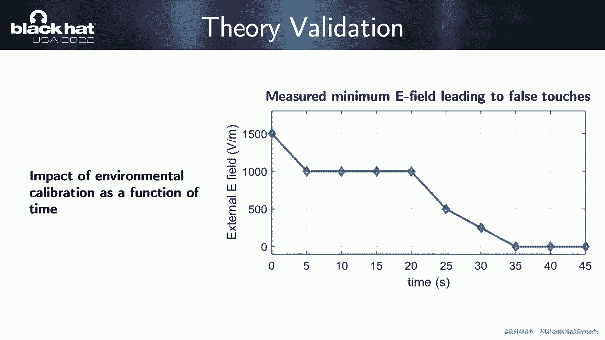

您应该避免应用这种类型的攻击，一个足够长的信号，所以现在结合所有这些类型的技术，让我们来看看我们可以用计算出的。

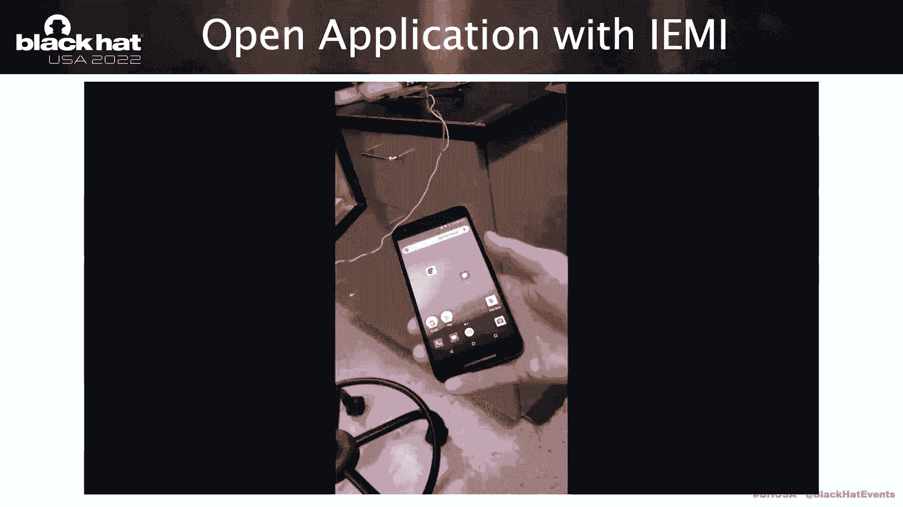

我是，信号权，所以我们想用这个打开应用程序，我们电脑上有信号指纹，在我们的手机上，然后我们把这种东西放在，E E，我们天线上的场强，然后我们试着把它和我们的目标对齐，一旦我们打开了IEA信号。

我们应该能够看到应用程序是打开的，我们也想用这个权利开一个网站，所以我们在桌面上有Chrome浏览器的快捷方式，现在我们打开了，我们现在进入佛罗里达大学网站，所以这绝对是你能做到的。

但你可能也会注意到这有一个小故障，这意味着触摸事件并不精确，没有我们想要的那么精确。

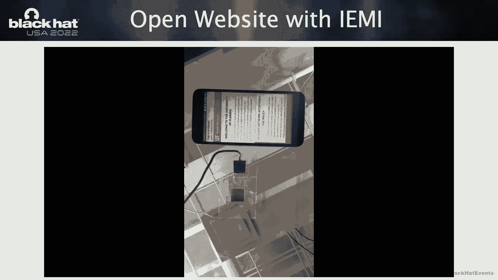

所以我们还是想做对一些事情，所以现在我们有了所有的理论分析，对呀，我们知道如何计算，频率是多少，如果你是什么，脸是什么，或者你知道的任何东西，为了在引入触摸事件时引入精确的触摸事件。

但正如您在上一个演示中所看到的，这不够精确，我们把手机放在桌子上，我们知道如何攻击哪里，所以这不是，这是不实际的，对呀，这是不可行的，我们还缺少一些东西，所以这里实际上是我们的贡献，我们的主要贡献之一。

与以前在snp上发布的方法相比，使用刻痕，所以我们的贡献之一实际上是产生了精确的触摸事件和思想实验，所以如果你想生成一个精确的触摸事件，挑战是什么，我是说如果你还不熟悉这种类型的攻击。

所以挑战实际上是挑战，来自扫描或驱动方法，来自不同的触摸屏控制器，当然啦，就像我们说的，我们之前介绍的东西，触摸屏设计的简化版本，所以在现实世界中，当然，苹果或Chrome等供应商，或者呃，对不起。

像苹果、LG或三星，他们的触摸屏控制器将有不同的设计，所以他们会用不同的方法，以确保触摸屏事件将被尽可能精确地检测到，尽可能敏感，但我们不能，我们已经可以提前知道了，所以总的来说。

对电气GRI进行扫描有两种方法，所以它要么是顺序的，要么是平行的，所以顺序扫描将是x，X或Y知识分子一个接一个，然后你要搜索，你会感觉到电极上Y和X上的每一条线，分别，那么顺序呢，对不起。

比如平行扫描呢，所以说，而并行扫描试图对激励信号进行编码，同时驱动X或Y电极，这里有电容变化的感觉，所以你可能会想为什么这很重要，我们在这里看到的所有这些幻灯片，就像iPhone上的驾驶信号一样。

我们实际上是在，呃，你知道的，来自iPhone11Pro和PixelTwo的设备，关于不同的驾驶驾驶扫描，所以在左边你可以看到平行驾驶扫描，在右边你可以看到丑闻驾驶方法，当你看到激励信号时。

看起来那看起来完全不同的权利，就像在左手边，你有一个编码，一些东西，就像一个编码的权利，但它同时发生在右侧，如果你在不同的地方测量，你可以看到屏幕上所有不同的地方，传感信号的形状和模式将是，会是一样的。

所有不同的事情都将是时机，所以这就是为什么它实际上被称为时机，所以这就是为什么这很重要，因为以前发布在，你知道吗，那些顶级的会议论文通常只在顺序上工作得很好，触摸屏顺序驱动型，因为图案真的很简单，对呀。

你可以你知道，你可以看到攻击者可以试图测量驾驶信号，并选择正确的定时注入信号，就像这样对吧，所以我测量了这个，我知道这条线已经被感觉到了，我将申请作为它的精确时刻，然后会有一点好笑的是。

你知道会被感觉到，所以我们的攻击，当然，这将在顺序上工作，但是平行呢，因为并行将被编码，对呀，所以我们的工作完全不同，我们不需要特定的驱动机制，而不是使用租户设计，在那里你可以生成人们，乡亲们。

如果你在触摸屏上的一个非常特定的区域施加干扰，所以我们应用适当的EMI信号，我们等待这个地方被感觉到，就像你的手指工作一样，这就是我们取这个名字的原因，看不见的手指其实是在模仿。

使用适当的EMI信号使手指工作的方式，合适的天线设计，我们进攻的另一个优势是，我们真的不需要分析，不同触摸屏控制器上的驾驶信号是什么样子的，做这件事的正确时机是什么，因为当你看着这个。

这实际上是从不同的设备测量的，所有的驾驶看起来完全不同，假设我想攻击一个新设备，对呀，所以如果你想做顺序的，那你就只能这么做了，你可以，这就是你所能做的，你需要一个接一个地分析这种类型的人口普查。

现在我们要去，我们希望在特定区域上生成一个字段，所以为了做到这一点，我们需要确保我们产生的磁场真的集中在一个狭窄的位置，所以一个好的网球设计真的很重要，在我们的情况下。

我们使用两种不同类型的Tena弹簧加载，铜针和铜板，他们都有不同的利弊，比如说，铜针会像一个，有很多人，如果你在上面，然后是铜板，这意味着你会有一个更强大的领域，因为它要去其中一个玩家要把它连接到源。

信号源，另一个将连接到地面，这将使E场更强一点，与铜针部分铜进入天线设计的比较，现在我们有两种类型的天线设计，对呀，它们都可以生成People e字段，但还是有一些东西影响了我们的进攻。

其中一个其实是桌子材料，所以对于普通的材料，比如说，mf，MDF，好莱坞，亚克力，大理石或铜，我们一个一个测量，我们看看桌子材料和，因为我们仍然想把这个实际的权利，所以唯一的区别是材料的介电常数会不同。

但当你真正看着桌子或这里，我们会看到，只要你的桌子材料不是金属的，你应该没事的对吧，所以亚克力或大理石，或者像实木一样，并没有改变我们的成功率桌子上的东西呢。

所以我们尝试了这种攻击从10毫米到50毫米的距离，从二十米，我们试了三十次攻击者，我们记录了我们成功地生成触摸事件的次数，在我们的情况下，只要触摸事件，只要信号类型在20毫米以下，使用我们的天线设计。

当前设计，我们应该好好的，至于真正的桌面秘密，通常，只是不到一英寸，所以我们现在应该很好，所以让我们来看看一个，桌面有两厘米厚，我们在这里能做什么，现在我们在操纵天线，我们不断地应用IAM信号。

所以基本上就像在这里，正如你所看到的，无论我们把男高音二移动到哪里，我们能够在天线下产生和触摸事件，所以它是超级精确的对吧，但我们也想看看它是否可重复，对吗，它是否稳定，所以这就是为什么我们把在这里。

然后试着让我们的iam信号每秒钟产生一次，我们跟踪一般泰事件的坐标是什么，然后这边，如果你要，你知道的，放大一点，你会看到每一个触摸事件实际上都是精确的，每时每刻我们都有一个敏感的发电机。

所以有了这些东西，我们试着做一些有点复杂的事情，对，而不是我们拿着天线四处移动，我们想做得更实际一点，所以这就是为什么我们有一个像坐着一样的十进制数组，你知道的，就像在帐篷顶上，就在目标设备的顶部。

我们现在试着用简单的点击来解锁iPad，正如你现在所看到的，它只是慢慢地打字，慢慢地输入数字，然后尝试在这一刻解锁设备，这也告诉我们，我们真的不想把我们的天线数量限制在一个，我们现在肯定可以用多个天线。

所以为了利用这种攻击，所以我们在这里做的，因为你不能移除你的天线，对呀，我们假设你没有机械臂什么的，所以这就是为什么我们设计不同的天线阵列，所以我们有稀疏的天线阵列。

我们稍后会讨论哪些是用来检测手机在哪里的，看看它，我们还有密集的A天线射线，所以只要你的呃，不同的十个之间的距离超过六毫米，我们真的没有看到不同天线之间有任何干扰，我们还有模块化天线阵列设计。

这意味着你可以设计自己的PCB并组装所有东西，并在一定距离上或从一定距离上对十进制数组进行程序控制，所以有了这些东西，我们测试我们的技术在我们的设备上是如何有效的，所以我们在苹果上尝试了这个，iPad。

一上的亲，加上谷歌上的七个专业，或者各种不同的供应商，这一切都将是，呃，这其实是我们的名单，所以我们的攻击适用于所有不同的设备，为什么这很重要，因为比较以前的方法。

我们是唯一一个在特定的百分之一或百分之二的实验，我们展示了一个设备，我们的工作是更通用和更普遍的，我们不在乎你的测试屏幕电脑是如何设计的，我们只是想喜欢你手指工作的方式，还有你想要的东西。

您可能还会注意到，我们在那里列出了一个功能，它将导致swiright，这里还有iPad Pro和眼表面Pro 7，我们能够产生一个ON，触摸屏上滑动手势的交互，这意味着这是一个部分。

就像我们以前的方法从来没有这样做过，总的来说，我们的工作，我们的工作在iOS设备上比在Android设备上更好，我们认为你知道iOS设备上使用的噪音消除算法，触摸屏控制器实际上使我们的，你知道的。

攻击Librium多一点好一点，所以让我们来看看我们的主，定向滑动或攻击作品，好的，所以现在我们有一个天线就在我们的设备上，我们可以注射一个短龙头，我们可以把这个长按压。

我们就可以把这个整块机变成拉丝模式，在这里你已经可以看到了，即使你知道，就像有一个评论家坐在中间，我们有能力，你知道只要保持天线和粪肥率，你可以随心所欲地画任何东西。

你也可以看到这种事情的持续时间真的足够长，对呀，您完全可以使用它来解锁图形上基于手势的日志，或基于图形日志的日志，所以如果你想利用这个滑动，虽然因为预算我们真的不是问题，不是我们干的。

但我们认为你绝对可以用它，有时像线性绅士英里，或者像机械臂一样进行机动，呃呃，实现这种类型的天线，呃，呃，来实现这种类型的攻击，所以现在我们有了精确的触摸事件，对呀，所以让我们稍微回顾一下。

所以使用我们的ei信号参数和我们的天线设计，现在我们可以在方向滑动上生成短标签和长按，但还是少了点什么对吧，我们所做的一切都是在我们的国家之下，我们知道电话在哪里，我们把天线调整到我们想攻击的地方。

当然，我们已经可以在现实生活中做到这一点，我们不能用实际的Iyama攻击来声称这一点，如果我们只是你知道，停在这里，实际攻击还是有差距的，比如精确的触摸事件生成和实用的触摸屏攻击。

所以我们的第三个主要贡献来了，我们给出了一个完整的实用攻击向量，所以现在我们已经建立了所有的外科背景知识，并实际上建立了正确的，所以我们还缺少一些东西，我们漏掉了一些东西攻击装置就在桌子上。

手机将被随机定位，比如受害者走进会议室把手机放在桌子上，你不知道它会放在哪里，所以我们需要某种形式的定位器来告诉我们这种类型的信息，以及对于攻击场景，一个简单的点击肯定是不够的。

因为我们要在多个地点进行多次接触，甚至有时我们需要向右滑动，但是如果多次触摸事件要发生，我们不知道之前的接触是否会成功，所以我们需要有办法告诉我们，一个触摸按钮是否成功，所以我们需要一个灵敏的探测器。

作为手机定位器，作为一部手机看，记住，我们在谈论，我们在吃，我们有一个不同的设备感知信号，这种感知信号实际上告诉我们我们喜欢什么，电话在哪儿？以及我们如何实际使用这个，所以使用这种类型的签名。

我们可以有一个快速可靠的Cancan分类器，这意味着我们知道天线阵列的位置，我们也知道，当使用nray测量从设备发出的信号时，我们可以把这两个信息结合在一起，我们有能力有一个十元的位置，屏幕位置转换。

呃矩阵，所以用这种东西你可以看到把12和10放在一起，我们就可以完全恢复，电话在哪里，或者设备位于何处，甚至不用看到，你知道，因为一切都在桌子底下，我们在不同的设备上测试了一切都可以工作。

然后错误率在一厘米以内，那么我们需要的触摸事件检测器，所以说，那是，这实际上是一个非常有趣的现象，我们正在观察，因为来自设备的扫描信号会不同，如果有一次失败或成功的Iyama I攻击，所以就在这里。

我们的Iam打开了一个信号，关掉了，正如你所看到的，如果成功的IAM攻击被识别，所以会有实际的主动扫描，从触摸屏发出的信号，所以你可以用这个来检测，所以现在我们结束了，真的，我们想把一切结合起来。

向你展示我们如何设法，你知道的，把一切都聚在一起，然后尝试在此上生成触摸事件，所以现在我们什么都有了，你知道就像鞋盒下面的地方，在这里，我们像菜单列表一样这样做，所以我们想告诉你，使用这种类型的信号。

我们可以，我们如何实际恢复设备，我们如何找到正确的天线来攻击，攻击触摸屏，一旦我们有了，我说一旦我们找到了正确的位置，我们选择最近的目标天线，我们就像我们打开那个，然后试着在那个位置产生触摸，好的。

那么攻击场景呢，所以为了完成攻击场景，我们其实有不同的，比如说，就像我们有基于点击的攻击，它将能够在Android上安装这个应用程序，我们也有，我们还可以在iOS设备上连接蓝牙，至于基于手势的攻击。

我们可以发送银行诈骗信息，我们只需按住胡椒图标就可以汇款，你可以展示你的甲骨文，然后你可以扫描一下，我们也可以解锁手机，即使手机可能受到手势的保护，我们和实验室的一名志愿者一起进行了一次攻击。

我们让他坐在桌子前面，随意地把手机放在这里和那里我想看看我们怎么能，我们能攻击得多好，至于攻击评价，我们有能力，呃，我们是一对喜欢我们工作的夫妇，我们的攻击持续了六个小时，在iPad上十次。

我们的攻击在iPhone上九次奏效，十一Pro和至于在Android设备上安装恶意应用程序与一加Pro，七亲井，不幸的是，我们的攻击只奏效了十次中的三次，因为你知道就像是和不是，但真的很亲近。

所以有时候我们只是，我们只需点击否，我们破坏了攻击的渠道，这就是攻击对吧，那么缓解呢，所以缓解侧，供应商实际上可以尝试使用压力或力检测，因为我们不会产生任何压力或力，IAS，你知道的，就像，比如说。

就像三星，我看到这里，它实际上告诉你，此刻在触摸屏上感受到的力量是什么，所以你可以用它来过滤掉我们刚刚产生的那些幽灵般的触摸，但是顾客权利呢，所以你绝对可以把它买回三分之一。

或者你知道像亚马逊一样的东西，但它也会挡住你所有的，像蜂窝、WiFi或NFC，这种让你的手机完全无法操作的事情，所以这不酷，我们实际上认为有一个更便宜更好的方法来做到这一点，所以就像真的很简单。

你只是有这种带盖子的手机壳，你可以用胶带或胶水，弗雷迪织物在里面呼啸而过，所以这种面料会成为一件事，你可以有点喜欢你，就在你封面旁边，你的手机就在触摸屏旁边，我们测试它，所以只有在像，我想只有90。

2毫米，这种厚织物，它应该能挡住我们的，你可以看到这种类型的攻击并不复杂，所以真的很简单，这就是为什么我们认为在这一点上，它仍然很少，我们仍在积极研究这种类型的领域，我们试着让这次进攻更完美一点，对呀。

所以说。

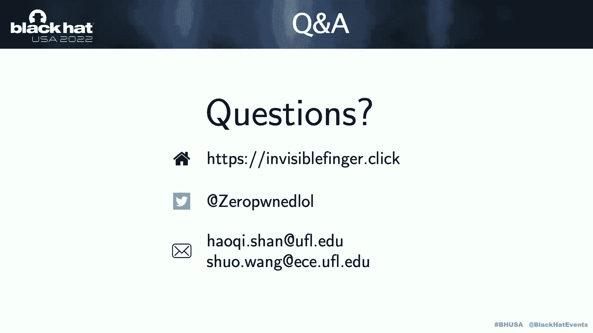

以上就是我们谈话的全部内容，谢谢你们的倾听，如果你想看看视频，你看看我们写的这篇论文，请访问我们的网站，如果你有任何问题，你知道，在推特上给我们发DM我，或者如果你寄给我一个呃，对我或我的，呃。

我的顾问电子邮件地址。

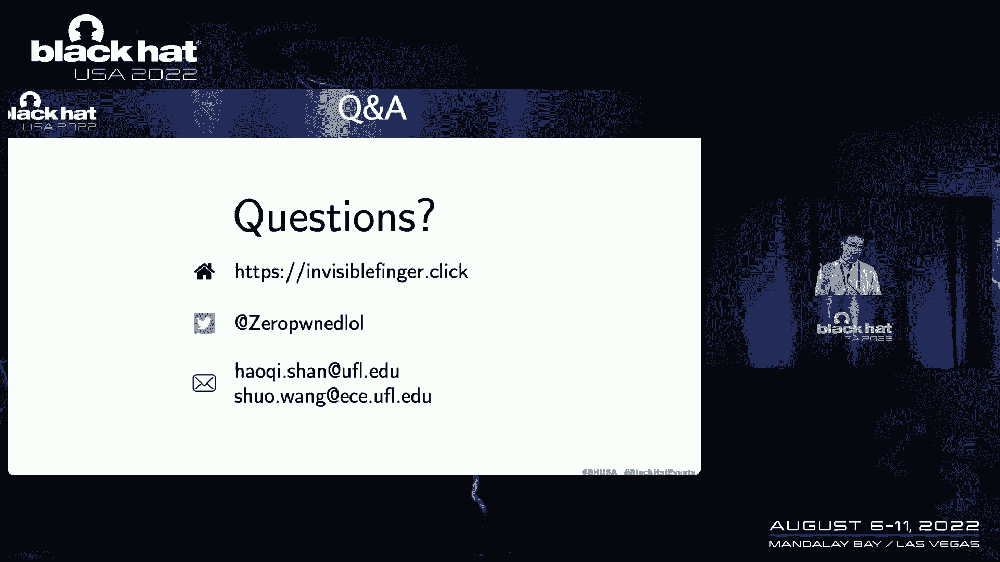

所有的权利，酷，好的。

