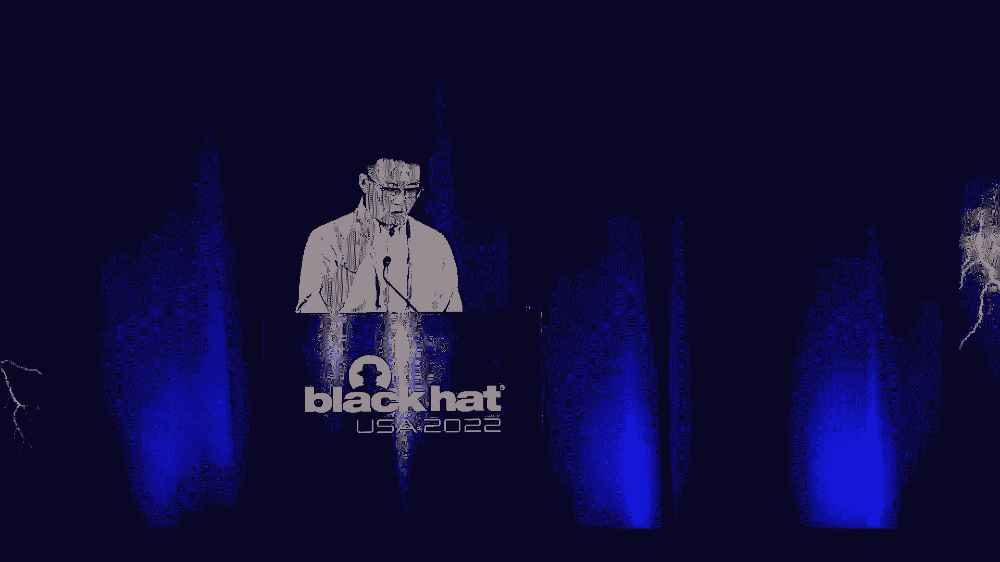
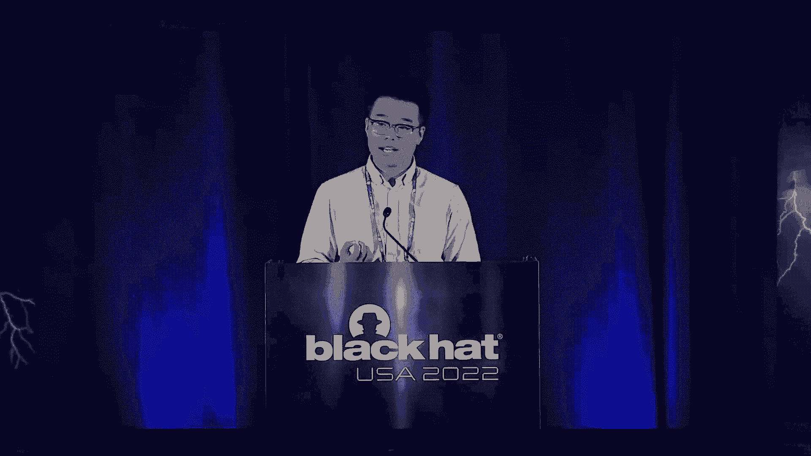
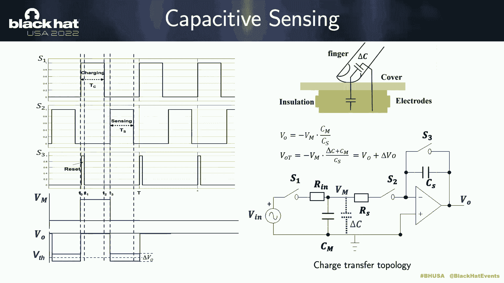
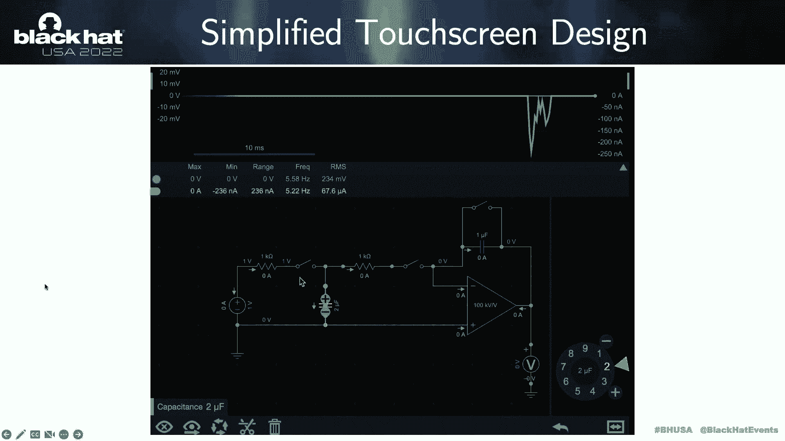
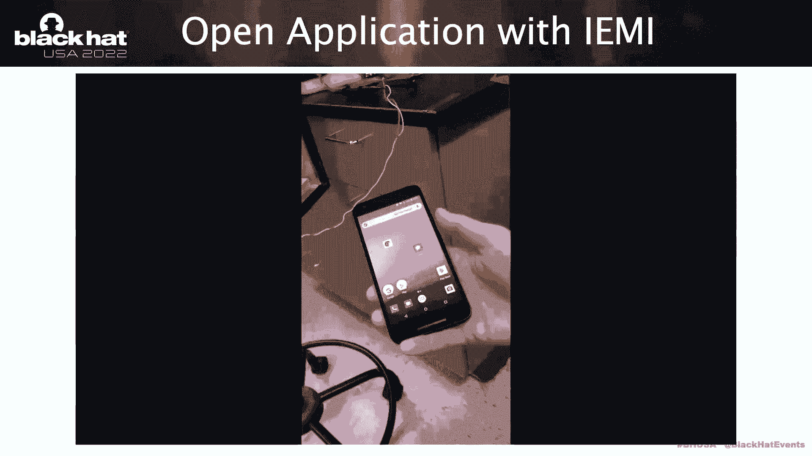
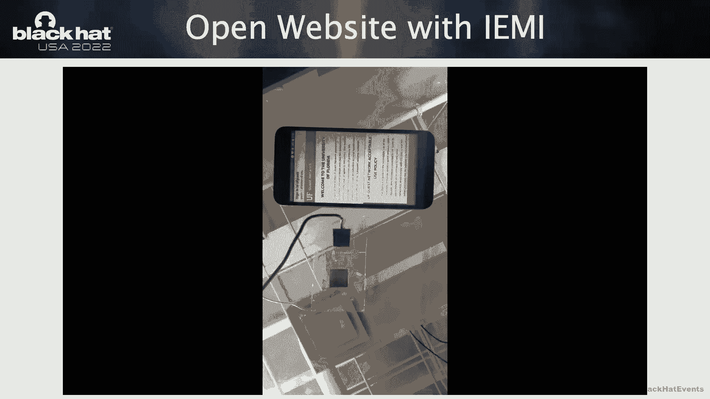
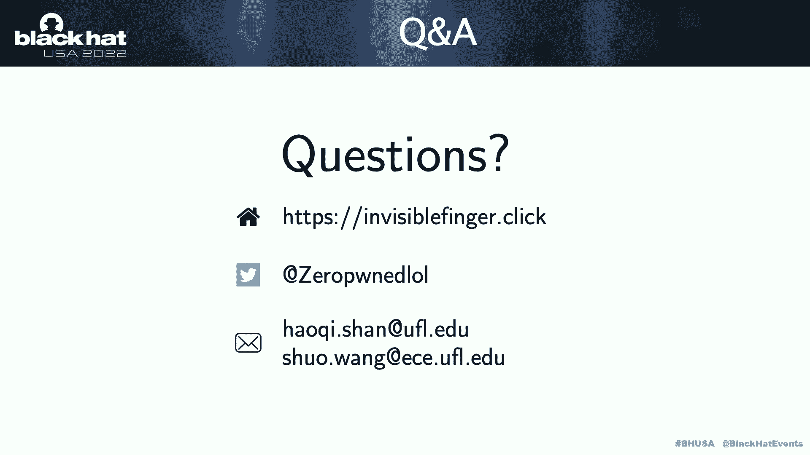

# 课程 P5-005：看不见的手指 👻 - 对触摸屏设备的实用电磁干扰攻击




在本节课中，我们将学习一项名为“看不见的手指”的研究工作。这是一种针对电容式触摸屏设备的远程、精确的触摸事件注入攻击，其核心是利用电磁干扰信号来模拟手指触摸。我们将从触摸屏的工作原理讲起，逐步深入到攻击的理论基础、实现方法以及实际演示。

---

## 概述 📋

触摸屏是现代智能设备的主要交互方式，而电容式触摸屏是其中应用最广泛的一种。本节课将详细介绍我们如何利用电磁干扰信号，在不物理接触屏幕的情况下，远程诱导出精确的触摸事件（如点击、长按、滑动）。我们将涵盖攻击的理论模型、关键技术挑战（如精确事件生成和设备定位）以及完整的攻击演示。


---

## 触摸屏工作原理 🔬

要理解攻击如何生效，首先需要了解电容式触摸屏，特别是互电容式触摸屏的基本工作原理。

互电容触摸屏通常包含多对发射和接收电极、激励信号发生器、电荷转移传感器、模数转换器和一个专用的触摸屏控制器微处理器。

当手指触摸屏幕时，会改变电极之间的互电容值。触摸屏控制器通过测量这个电容变化来检测触摸事件。其核心传感机制基于**电荷转移拓扑**。

以下是其工作周期的简化描述：

1.  **充电阶段**：开关S1和S3闭合。内部电压源 \(V_{in}\) 对互电容 \(C_M\) 充电至 \(V_{in}\)，同时传感电容 \(C_S\) 被放电至0。输出电压 \(V_O\) 为0。
    ```
    Q_{CM} = C_M * V_{in}
    V_O = 0
    ```

2.  **电荷转移阶段**：S1断开，S2闭合。储存在 \(C_M\) 中的电荷 \(Q_{CM}\) 被转移到 \(C_S\) 上。
    ```
    V_O = (C_M / C_S) * V_{in}
    ```
    此时，输出电压 \(V_O\) 与互电容 \(C_M\) 成正比，可通过ADC测量。

3.  **判断阶段**：如果测得的 \(V_O\) 值超过预设阈值，控制器则判定发生了一次触摸事件。手指触摸引入的电容变化 \(\Delta C\) 会反映在输出电压的变化 \(\Delta V_O\) 上。
    ```
    V_O‘ = ((C_M + \Delta C) / C_S) * V_{in} = V_O + \Delta V_O
    ```
    若 \(\Delta V_O\) 足够大，即被识别为触摸。

---

## 理论攻击模型 ⚡

在理解了触摸屏如何通过测量电容变化来检测触摸后，我们可以从理论上构思攻击方法。



核心思路是：**通过外部施加的电场，在触摸屏电极上引入一个电压增量，从而等效地改变传感电容，欺骗控制器**。



假设我们在触摸屏上方施加一个垂直电场 \(E\)。根据叠加原理，该电场会在电极上引入一个电压增量 \(V_M\)。这等价于在互电容 \(C_M\) 上储存的电荷增加了 \(C_M * V_M\)，从而导致输出电压产生一个增量变化 \(\Delta V_E\)。

```
\Delta V_E ∝ E
```

如果 \(\Delta V_E\) 足够大，超过了触摸检测的阈值，电路就会将此外部电场干扰误判为一个真实的触摸事件。这就是我们实现“幽灵触摸”的理论基础。

---

## 实现精确攻击的关键条件 🎯

理论上可行，但要将攻击实用化，我们需要满足几个关键条件，并解决精确控制的问题。

以下是实现成功攻击必须考虑的几个核心条件：

1.  **最小电场强度 \(E_{min}\)**：电场必须足够强才能触发触摸事件。所需的最小场强可以通过以下公式估算，其中 \(d\) 是电极间距，\(A_{eff}\) 是等效干扰面积。
    ```
    E_{min} ∝ 1 / (d * A_{eff})
    ```


2.  **激励信号频率 \(f\)**：施加的交流电场频率至关重要。触摸屏的传感是周期性的（周期为 \(T_s\)）。如果干扰信号的周期正好是 \(T_s\) 的整数倍，那么在一个完整传感周期内，电场干扰的净效应可能为零，无法触发事件。我们需要避开这些无效频率，找到那些即使场强较小也能有效触发触摸的频率 \(f_{max}\)。
    ```
    应避免：f = n / T_s, n为整数
    优选：f ≈ f_{max}
    ```



3.  **攻击信号持续时间**：触摸屏控制器具有动态校准功能，会持续监测环境噪声并调整检测阈值。如果攻击信号持续时间过长，控制器可能会将持续的干扰识别为环境噪声并提高阈值，导致攻击失效。因此，攻击应采用间歇性的短脉冲信号。



通过实验验证，上述理论模型推导出的参数与实测结果基本吻合，证实了攻击的可行性。

---

## 从理论到初步实践 🔨

基于上述理论，我们搭建了实验环境：使用信号发生器、射频放大器和一块手指大小的铜板作为天线来产生电场。

初步实验证明，我们确实可以诱导出触摸事件。然而，这些事件是随机出现的，我们无法控制其发生的**精确位置和时间**。这离实现有实用价值的攻击（例如点击特定按钮）还相差甚远。

挑战主要来自于现实世界中触摸屏控制器的复杂性。它们采用了不同的扫描驱动方法来提高精度和抗噪性：

*   **顺序扫描**：依次驱动和感知每一行或列的电极。信号模式简单，有规律可循。
*   **并行扫描**：同时对多个电极施加编码后的激励信号。信号模式复杂，难以通过简单定时来预测。

此前的研究大多只针对顺序扫描模式的触摸屏有效。而我们的目标是设计一种**与驱动方法无关**的通用攻击方案。

---

## 核心技术贡献：看不见的手指 ✨

我们的主要贡献在于实现了**精确的触摸事件生成**和**完整的实用攻击链**。

### 1. 精确触摸事件生成
我们放弃了分析复杂驱动信号的思路，转而**模拟真实手指的工作方式**。关键在于天线设计：
*   **弹簧负载铜针**：能产生非常局域化的强电场，适合精确定点。
*   **接地铜板**：能产生更强的电场，但范围稍大。
通过将电场精确聚焦在屏幕上一个极小区域（就像指尖），我们只需持续施加干扰信号，当触摸屏扫描到该区域时，自然就会检测到“触摸”。这种方法无需知晓设备具体的扫描时序，因此兼容顺序和并行扫描模式。

实验表明，在20毫米距离内，使用我们的天线能稳定、重复地在目标位置产生触摸事件。

### 2. 完整的实用攻击系统
在实际场景中，我们面临两个新问题：
*   **设备定位**：受害者手机被随意放在桌上，我们不知道其确切位置。
*   **攻击反馈**：我们需要知道一次触摸是否成功，以决定后续操作。

为此，我们构建了一个完整系统：
*   **屏幕外定位器**：我们利用触摸屏工作时发出的电磁信号作为“指纹”。通过天线阵列接收这些信号，并使用分类器，我们可以在不直视手机的情况下，以厘米级精度确定手机在桌面上的位置。
*   **触摸事件检测器**：我们发现，成功注入触摸事件时，触摸屏发出的扫描信号会发生变化。通过监测这种变化，我们可以实时判断一次攻击是否成功。

将精确定位、精确天线阵列和实时检测结合起来，我们就能实现闭环控制：先定位手机，再选择最近的天线对准目标图标，发起攻击并确认成功，然后进行下一步操作。

---

## 攻击演示与评估 🚀

利用这套系统，我们展示了多种攻击场景：
*   **基础操作**：在各类设备（iPhone, iPad, Android手机）上实现短按、长按、定向滑动。
*   **复杂攻击**：
    *   在Android设备上静默安装应用。
    *   在iOS设备上配对蓝牙设备。
    *   发送诈骗信息（如长按支付图标转账）。
    *   绕过手势密码解锁手机。

在受控的用户研究中，我们的攻击在iPad上成功率高达60%，在iPhone 11 Pro上达90%。在Android设备上成功率较低，部分原因是“确认/取消”按钮距离太近，容易误触。

---

## 缓解措施与总结 🛡️

### 可能的缓解措施
*   **供应商层面**：集成压力传感层。因为我们的电磁攻击无法产生压力信号，真手指触摸则可以。
*   **用户层面**：使用带有内衬导电织物的手机壳。实验表明，仅2毫米厚的导电织物就能有效屏蔽此类攻击。

### 课程总结
本节课中，我们一起学习了“看不见的手指”攻击。我们从电容触摸屏的传感原理出发，探讨了利用电磁干扰注入触摸事件的理论模型。接着，我们深入分析了实现精确攻击所需满足的条件和面临的挑战。然后，我们介绍了本研究的核心贡献：通过仿生思路和精巧的天线设计实现与驱动方法无关的精确事件生成，并通过构建包含定位器和检测器的完整系统，将攻击推向实用化。最后，我们观看了攻击演示并讨论了潜在的防御方案。



这项研究表明，针对硬件层面的新型安全威胁值得持续关注。希望本教程能帮助你理解这一有趣的研究领域。


---
*注：本教程内容基于公开的学术研究报告整理，仅用于学习交流。*