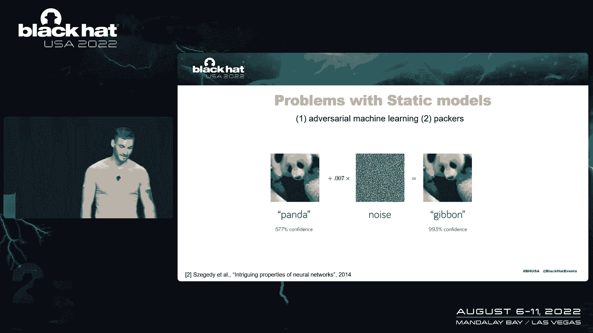
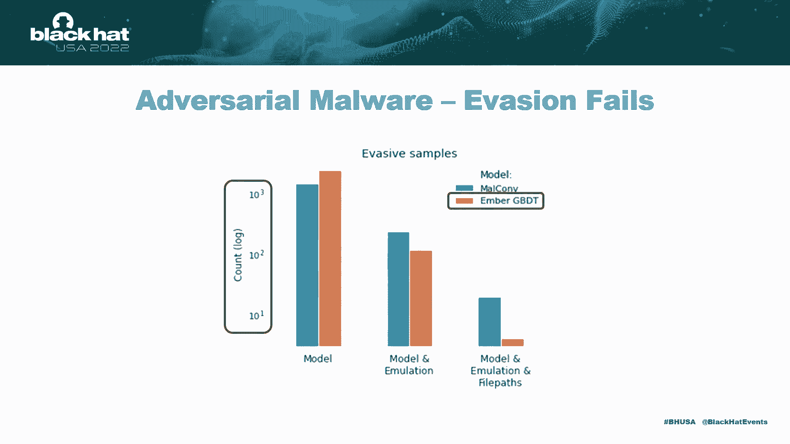
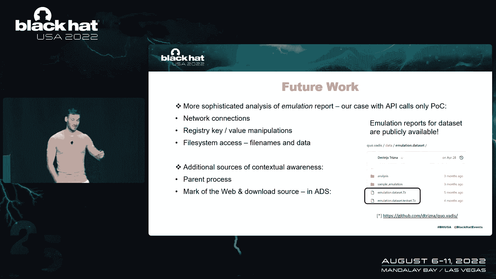
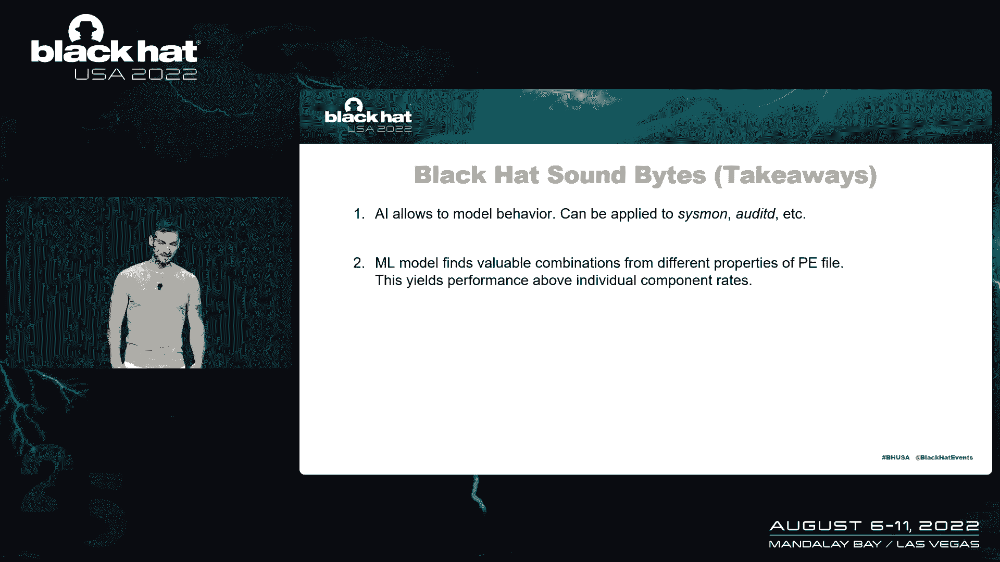
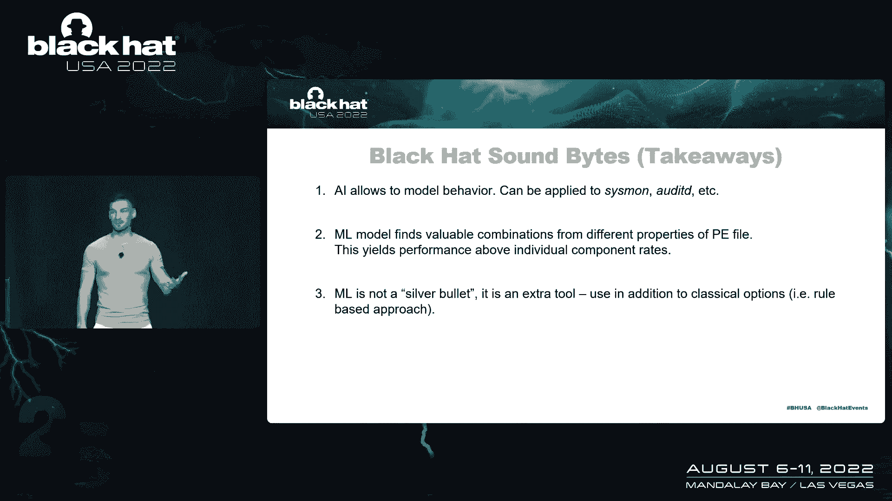
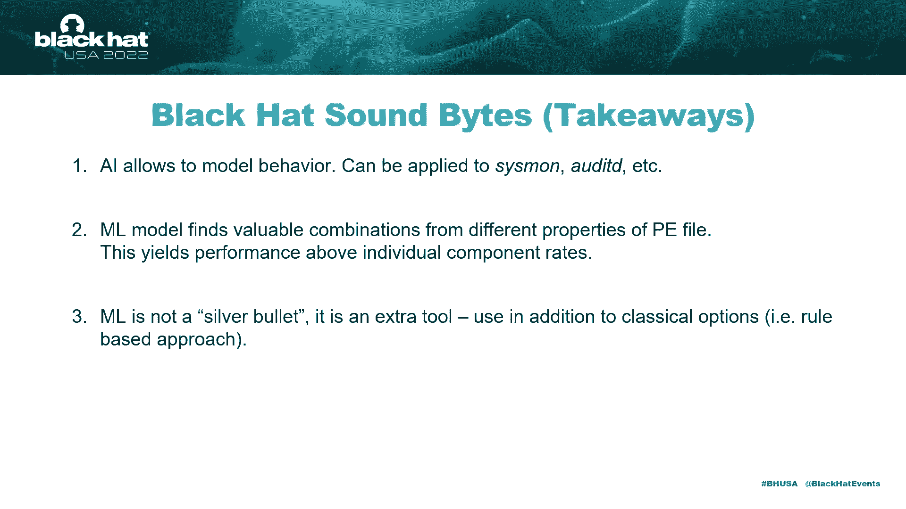
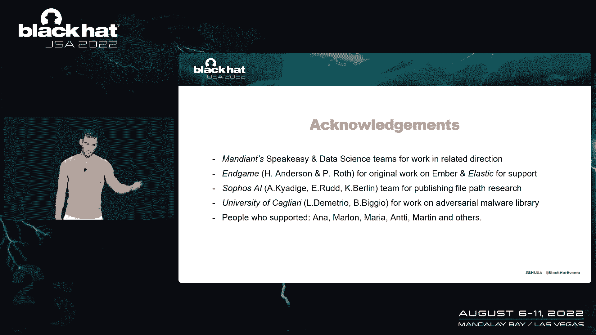

# 恶意软件分类课程 P50：055 - 利用Windows内核仿真增强机器学习分类 🚀


在本节课中，我们将学习如何利用Windows内核仿真产生的遥测数据，来增强传统的基于静态分析的恶意软件机器学习分类技术。我们将探讨现有技术的局限性，并详细介绍一种结合了静态特征、API调用序列和文件路径分析的混合方法。

## 概述：现有技术与局限性

上一节我们介绍了课程主题，本节中我们来看看公共领域中已知的恶意软件分类技术。这些技术主要基于对恶意软件文件（如PE文件）的静态分析。


一个著名的开源项目是**Amber**（最初由Endgame发布，现由Elastic维护）。它描述了一种从PE文件中提取特征的方法，将可执行文件视为字节块。该项目捕获了大约十几种特征类型，例如：
*   文件各部分的熵
*   导入的函数
*   字节直方图

这个特征提取方案非常有效，但它存在固有的局限性。如果我们将其应用于广泛的恶意软件威胁态势，存在多种方法可以绕过这种检测。



## 对抗性攻击与静态分析的局限

静态分类器面临的主要挑战之一是对抗性攻击。其基本原理是：通过巧妙的方式修改机器学习模型的输入，产生扰动，从而完全扰乱模型的行为。

例如，在计算机视觉领域，看似随机的噪声可以完全规避图像分类器的功能。这种攻击同样适用于恶意软件的机器学习世界。卡尔加里大学的一个小组就曾发表过“部分代码注入”攻击，通过向已编译的恶意软件中添加内容，成功逃避了静态分类器。

静态分类器的第二个问题是**加壳器**。许多恶意软件样本在静态分析下看起来相似，因为加壳器混淆了静态分类器所依赖的许多属性。

## 转向动态分析与仿真

在静态分析的适用性受限后，我们可以走向何方？我们知道安全厂商会以专有形式进行一些动态分析，但公共知识大多仍集中在静态分析上。

动态分析（例如在受控的沙箱环境中运行恶意软件）可以捕获进程生成、命令行参数、网络连接等行为，为恶意软件功能提供额外见解。然而，在虚拟机中引爆恶意软件成本高昂，需要纯净的环境、重启和完整的操作系统内核，既耗时又耗费计算资源。

幸运的是，我们有一个强大的模拟器——**Unicorn**（由Mandiant团队研发）。它允许用很少的代码获取动态遥测数据。其数据科学团队已在此方向进行研究，并将一些见解发表在去年的MDSec会议上。

通过Unicorn仿真，我们可以获得与沙箱类似的信息，但完全在Python环境中实现。我们可以获取：
*   文件访问及写入的数据
*   内存段内容

这不仅是机器学习自动分析的绝佳工具，也适用于手动逆向工程。

## 构建混合模型：三臂特征提取器

我们如何处理这些数据？我们构建的模型从不同角度审视PE文件。

首先，我们保留了**Amber的静态特征**，因为它们非常有效，我们不应丢弃已有的成果。

其次，我们增加了专注于**API调用序列**的模块。我们从仿真报告中提取API调用序列，这代表了恶意软件在系统上的行为。

第三，我们分析恶意软件（或任何PE文件）在执行时访问的**文件路径**。我们从真实环境中收集这些数据，将其作为上下文参数用于分析，因为可执行文件的行为模式中包含表示其运行环境的部分。

这三个“臂”都作为特征提取器工作，最终在AI模型中生成128维的数据表示（嵌入向量），并提供给后续的“元模型”进行分类。

以下是模型的核心架构流程：
1.  **静态特征臂**：处理Amber提取的原始特征。
2.  **API序列臂**：将API调用序列编码为整数向量，通过嵌入层和一维卷积层处理。
3.  **文件路径臂**：将文件路径序列进行类似处理。
4.  **元模型**：一个全连接神经网络，接收三个臂的输出表示，最终判断文件是恶意还是良性。

```python
# 概念性代码结构示意
# 输入: PE文件
# 输出: 分类结果 (恶意/良性)

静态特征 = AmberExtractor(PE文件)
API序列 = 仿真器.提取API调用(PE文件)
文件路径 = 仿真器.提取文件访问(PE文件)

特征1 = 静态特征处理网络(静态特征)
特征2 = 嵌入层(API序列) -> 一维卷积层 -> ...
特征3 = 嵌入层(文件路径) -> 一维卷积层 -> ...

融合特征 = 拼接([特征1, 特征2, 特征3])
预测结果 = 全连接神经网络(融合特征)
```

## 模型评估与结果分析

我们用于评估模型的数据集包含约10万个训练样本（超过300GB数据）。测试集是在训练集收集三个月后获取的，用于评估模型面对新威胁的表现，包含约27,500个样本。标签由专业威胁情报团队分配。

我们将此数据集通过仿真器处理。虽然仿真器不完美（仅模拟内核子集，某些API未实现），但错误率并不普遍，仍适合我们的分析。

从建模角度看，API调用和文件路径序列首先被编码为整数向量，然后传递到**嵌入层**。嵌入技术来自自然语言处理，它将离散的标记（如API调用名）映射到连续的向量空间。训练后，语义相似的标记在向量空间中的位置也相近。



接着，序列数据通过**一维卷积层**进行处理。一维卷积擅长从序列数据（如心跳信号、文本n-gram）中提取局部模式。例如，它可能学会识别像`.exe`或`C:\Windows\`这样的特定文件路径片段。

最后，**全连接神经网络**（元模型）从所有输入中学习复杂的决策边界。


以下是核心结果：
*   在极低的误报率要求下（例如十万个样本中只允许一个误报），单独的Amber静态特征提取器表现最佳，这证明了其作为行业标准工具的有效性。
*   令人惊讶的是，**仅结合文件路径和API调用序列的模型**，其检测率比单独使用两者有显著提升（从约43%提升至77%），甚至超过了单独的Amber模型约20%。这表明元模型能够从不同数据角度中自动学习到有价值的关联特征。
*   当**三个模块一起使用**时，我们获得了相当好的检测率，同时在极低的误报要求下，模型可以作为生产环境中的警报组件之一部署。


## 对抗性攻击的防御效果



关于对抗性恶意软件行为的评估显示，我们的混合模型显著提升了鲁棒性。


在测试集中，有1000多个对抗性样本能够逃避纯静态（Amber）模型。当我们加入了动态分析特征（文件路径和API序列）后，这些样本中只有约100个仍能逃避检测，**逃避率下降了90%**。我们特别测试了“切片与注入”攻击，发现当应用了文件路径分析后，该攻击基本失效。

## 未来工作方向与公开数据集



仿真部分目前仍是原型，其API调用模型的直接性能相对较差。未来可以从以下方面改进：
1.  **纳入更多动态数据**：如网络连接、注册表操作、文件内容等。
2.  **添加上下文信息**：如父进程信息、文件的Web标记和下载来源（可从NTFS交换数据流中获取）。


我们已公开发布了仿真数据集（匿名化的JSON报告），供社区研究使用。虽然由于隐私政策无法发布原始PE样本，但仿真报告本身包含了丰富的行为数据。



## 总结与要点

本节课中我们一起学习了如何利用内核仿真增强机器学习进行恶意软件分类。以下是几个关键要点：



1.  **AI赋能模型行为理解**：机器学习允许模型自动学习恶意软件的行为模式，这在公共研究和专有产品中都变得越来越重要。
2.  **动态行为建模的优势**：这种方法可以应用于更广泛的数据源（如Sysmon日志），不仅限于安全厂商，任何安全运营团队都能从中受益。
3.  **融合多角度数据**：机器学习能够自动发现不同数据视角中有价值的关联组件。我们通过结合文件路径和仿真模型看到的性能提升就是明证，且这在多次交叉验证中均稳定出现。
4.  **ML是工具，非万能药**：机器学习不会明天就取代人类安全专家。它是一种可以使用的软件工具，是**对现有基于规则方法的补充**，旨在提高工作效率。你不需要实现完整的复杂模型，有时仅采用其中一部分（如文件路径分析）就可能成为更好的检测方法。



最后，感谢为此领域研究奠定基础的所有团队，特别是维护Unicorn模拟器的Mandiant团队，以及进行相关前沿研究的其他学术团体。


---
**总结**：在本节课中，我们探讨了静态恶意软件分析的局限性，介绍了一种结合静态特征、API调用序列和文件路径动态分析的混合机器学习模型。该模型通过嵌入层和一维卷积处理序列数据，并利用全连接神经网络进行最终分类，显著提升了检测率和对对抗性攻击的鲁棒性。我们认识到，机器学习是安全分析师工具箱中的一个强大补充，而非替代品。