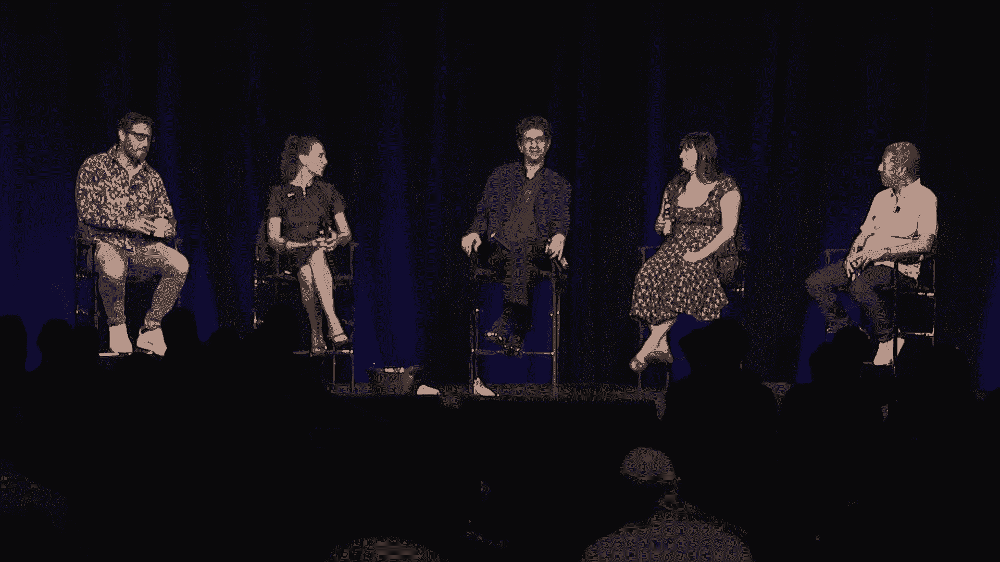

# P51：056 - Locknote： Conclusions and Key Takeaways from Black Hat USA 2022 - 坤坤武特 - BV1WK41167dt

所以你可能知道，也可能不知道，但你正坐在迄今为止最大的锁音符会话中，这么多人来看我们，给我们留下了深刻的印象，所以这里没有压力，哈哈哈哈哈，这是我们几年前在海外活动中开始的，有点像基调锁音的推论。

我们真的想创造一个很好的，一种反气候的方式来结束会议，从那些把所有时间都从个人生活中抽出的人那里得到了一些见解，实际查看并帮助选择内容，所以这是一个很好的方式说，这就是你认为会议可能会变成的结果。

或者这些是你认为重要的趋势，既然你已经做了，感觉怎么样，作为一个洞察力，你获得了什么，你知道的，你觉得怎么样，另一个想法是我们要试着把它像对话一样运行，你坐在观众席上，我们都是朋友，我们在聊天。

你在偷听，然后在会议上进一步，我们会试着把它打开，我们在中间有一个麦克风，我们会回答你的问题，有时是互动的，我们会让人们举手，如果我们想为某事争吵，一年，没有人买欺骗服务，别人说不，我想有些人。

所以我们问观众，一人购买欺骗服务，别在那上面投资，我不认为这会有很好的结果，所以我要在这里介绍我们的小组，然后我想先问几个问题，我们远走高飞，你准备好了吗，你在我右边没事吧，我们有静脉曲张的克里斯·英。

我找了很长时间，我想我们建立了正确的秩序，所以现在我们把一切都搞砸了，它们看起来有点一样，但我也很困惑，所以这只是一个测试，如果你还记得那个阶段，缩放这么久，安全领域的长期贡献者。

和美国在美国简报审查委员会，好的，然后我们有娜塔莉，来自谷歌的So Vanovich，也在美国简报审查委员会，呃，我们从医疗中心找到了贾斯汀·伯恩，她是首席信息官审查委员会的成员，和美国简报审查委员会。

然后在我右边，你左边的马特瑞典人来自磁铁法医，他是美国审查委员会的成员，还有我们的欧洲审查委员会，好的，所以我要快速地从克里斯开始，只是说一点点，也许你真正感兴趣的领域，喜欢你关注的东西。

因为你们不能都注意提交，或者有多少提交，十几万一千到一千，是啊，是啊，超过一千份意见书，你不能做到这一点，你的眼睛不流血，那么你的方法是什么，让我们从克里斯开始，Mine是应用程序安全性。

在过去的二十年里，这一直是我职业生涯中的重点，所以我有幸成为今年应用程序安全的跟踪负责人，它被称为AppSec，它被称为SDLC，过去的一些不同的事情，但太神奇了，我们在应用程序安全方面得到的惊人提交。

涵盖相当广泛范围的一切，对呀，从SDLC和CICD管道到Web 3，只是标准的网络攻击，那是一个很大的类别，所以我在这个节目中花了大部分时间，你知道这就是我想要的，我想确保我们选对了。

我想你知道我认为我们做得很好，你怎么分辨，我是说，是根据房间里有多少头，这似乎不是一个很好的指标，或者你如何得到好的反馈，一种感觉，如果你做对了，是啊，是啊，有时像标题选择很难找到。

所以你知道你可以有最惊人的技术内容，然后你没有一个伟大的头衔，房间里可能没有很多人，但你知道好的一面是，你可以以后再回去看，看看，你听到，你知道吗，我喜欢去推特看看，看看人们在喋喋不休地谈论什么，哦。

我错过了，那个看起来像是，你比抽象的更清楚，但它变成了，所以我会回去在YouTube上看，或者在剧中看，我要做一个假设，我希望事实证明我错了，但我的假设是谷歌娜塔莉，是呀，或者云或者是什么，你想要什么。

是啊，是啊，所以我离开硬件轨道，所以在黑帽子，我真的很喜欢去硬件讲座，这些将从微妙和有趣的CPU bug，到黑客攻击疯狂的野生目标，就像汽车，白天有卫星吗，我在谷歌的零号项目上。

所以我对开发也非常感兴趣，以及如何在各种目标上执行代码，所以这是一个品种，你在那里寻找一些独特的东西，对吗，不一定是某些开发链中的微观优化，你想看些新鲜刺激的东西吗？是啊，是啊。

我总是觉得我对新的bug和新的漏洞有最好的想法，从黑帽子，我喜欢看新东西，让我们和贾丝汀谈谈，告诉我们一点，是呀，我的硬件和ipsec的日子一去不复返了，当然，但今天我在政策轨道上。

所以当我看到这一点时，管理的另一个词，嗯，我一生的故事，对呀，是啊，是啊，原来如此这很棘手，虽然，随着简报的审查，因为你知道你有一个非常技术性的观众，你在看政策提交，所以你必须试着找到内容。

这与技术人员有关，但仍在谈论政策，所以我试着寻找破坏性的东西，想法嗯破坏性的，就像我有什么疯狂的东西头发着火了，因此或破坏性但现实，可食用，但也许稍微在那里，想法不点击诱饵不，我永远不会，是啊，是啊。

不不不，你永远不会逃脱惩罚的，然后是这个，但你知道有几个，例如，再次重新审视漏洞披露，但他们稍微跳出了框框，有一个关于区块链漏洞披露的演示，是呀，是呀，所以诸如此类的事情，可能会把。

你知道某种程度的创新和技术，以及一个政策理念，但除此之外，当然是Seeso峰会，考虑政策或战略要容易得多，或者你知道治理问题，因为那是观众，你觉得自己能参加简报会吗，专注于战术政策，所以更像是战略性的。

准确地说，或者会影响的政策，你知道，以一种战术的方式，更有技术含量的房间，你知道的，所以这是一个政策转变，可能会影响我作为安全分析师的角色，或者作为专家，或者作为安全研究员。

而不是可能影响公司治理变化的政策，或者你知道，条例，或者类似的东西对吧，非常好，好的，马特，我很想念ASEC的那些硬件，我再打给你，马特和这个词，磁铁取证，我想我知道你对什么感兴趣了，是啊，是啊。

我的意思是我一直参与DFI轨道，但大家都知道，我们经常碰巧是多个轨道来帮助其他人审查提交，因为我们有这么多，是啊，是啊，我是说开发开发，一个很酷，就像平台，一个挺酷的，虽然不知道。

我们不知道以后生产的东西是否会像免费安全一样，你知道你和我想谈谈网络三，我的意思是我认为我们应该我认为我们应该有一个新的在未来几年，我有什么免费的，所以我只是说你说所有这些东西都很酷，就像。

有什么不酷的吗，嘿嘿，我们能做到吗，所以我们可以做一个举手和区块链，谁想看区块链赛道，无Web安全跟踪，我更喜欢这个名字，好的，有一个问题，我想你必须定义什么是网络三，是啊，是啊，嗯，除了独角兽。

我们还会做那个，我是说那不是韩国，就像七亿美元，你知道它比中央银行还大，有很多安全咨询公司，现在用三个虫子赚了很多钱，是啊，是啊，你知道太棒了太棒了，所以我很高兴我们看到了，是啊，是啊，好的。

那就是你的监狱，只要你喜欢的技术演示，尤其是当你去参加会议的时候，您喜欢选择技术内容，如果可以是博客文章，你知道这不应该是一个演示，它通常就像我的决策树，你知道吗，应该是博客文章吗，我可以在家读。

还是真的值得参加演示，适合我，就像克里斯，你知道我喜欢看，像幻灯片和演示文稿，因为不可能看到一切，所以当你在做你的精神过滤时，听起来你的第一个障碍是，这是一篇写得很好的博客文章吗，如果有。

百分之百写博客文章，是啊，是啊，如果没有，它必须有额外的东西，是啊，是啊，我喜欢思考的一件事，我也是，你是否通过给演讲者一个舞台来提升他们，对呀，这是一个人吗，一群人，社区，你想在别人面前上台。

基本上是含蓄地支持他们，这似乎是一个更新的问题，之前只是纯粹看看技术，是啊，是啊，现在我们必须考虑更多的方面，对耶，还有谁有你这样的你一定有这么高，我试着，我试着，你知道地址偏差，对呀。

我尝试了我的方法，你知道的，显然重点是内容，我几乎不想知道是谁提交的，你知道他们在哪里工作，你知道我以前听说过他们吗，所以我试着先浏览一下内容，然后如果我问自己更多的问题，我回去问问他们可信吗，好的。

让我们读一下他们的简历，你知道的，但我们不应该，你知道的，显然阻止了那些刚开始展示正确的人的机会，所以我在def con，我们有能力匿名提交，所以如果你不想让这些被考虑，是啊，是啊。

这给了一些人一些信心，通常会提交，可能不会，是啊，是啊，是啊，是啊，但这很难，因为也有一些人有着惊人的记录，你一直在生产，他们总是生产，你知道，我们来这里看这些人在场，所以丹·卡明斯基赛道，是啊，是啊。

当Dan屈服的时候，基本上你知道你在接受，丹，我比以前更注重实用性，我是说是什么改变了这一切，我想你知道如果你回到早期，肯定有很多，你知道的，你得上头条，你必须得到这条非常酷的路径的覆盖。

这个非常酷的开发，那是在黑帽出来的，将会有一场围绕它的大媒体闪电战，在那里，你知道仍然有一些，你知道这个职业带来了一些更有纪律的东西，你知道，这是如此多方面，我觉得必须有外卖，一定有更多的东西。

就像这个人做的这个非常酷的黑客，这是伟大的，不仅仅是对铁的庆祝，准确地说，是啊，是啊，我如何将最先进的技术提前回来，你知道当我回家回到我的组织，我该怎么办，所以你知道这是由这些会谈完成的，就像你知道的。

詹姆斯·凯特尔总是在突破界限，就像这里有另一种打破http的新方式，打破了所有假设，那么每个enttester都可以回去使用，可能明天开始，它推动了最先进的技术，它让你发现你以前不知道的新事物。

任何你知道的工具，或者一种新的做法，或者一种新的思考方式，你可以收回一些东西，是啊，是啊，可能会有一个很酷的黑客，但如果有一个好的技术，然后你可以去添加到你的武器库中，我觉得必须有一些实用的外卖，是啊。

是啊，那真的是耶，在每一个，我和你在一起的每一件事，是啊，是啊，是啊，是啊，我绝对发现有了硬件轨道，绝对是酷的召唤，就像那个哇，你知道他们造了那辆车，挡风玻璃刮水器来回翻转，当然，这是硬件轨道的一部分。

我有点觉得，也许每年我们都会选择一个话题，只是因为目标太棒了，也许你不太关心技术上的东西，但还有很多其他很酷的事情，比如说，今年有很多断层注入，很多CPU bug，虽然那些也很酷，他们只是没有相同的。

和其他一些提交的几乎是特技的杂乱，你的轨迹是有点像，当过去有一个物联网轨道，会有物联网垃圾黑客，我们称之为，哦，另一个嵌入式系统运行另一个古老的，你知道这就像它不重要它运行，这是同一个系统，你知道的。

所以我们称之为垃圾黑客，同样的事情正在发生，现在，就像有人学会了一种技术，现在有三十个人接受了这项技术，所以很难剔除那些真正在做独特事情的人，是啊，是啊，那绝对是真的，比如说，越来越成熟的东西。

比如自动黑客攻击，肯定有一些人把同样的技术应用到新的目标上，然后是那些实际上有新东西的，是啊，是啊，所以最喜欢的谈话，让你疯狂的事情，你并不感到惊讶的事情，你知道吗，当我想到，它不是。

你知道CSO峰会是根据查塔姆大厦的规则运作的，所以对CSOS来说，这是一个非常安全的空间，分享他们的不安全感，提出问题，思考生存问题，你知道你的CSO，也许你和他们一起工作，可能看起来超级自信。

知道如何解决每一个问题，但相信我，当他们在塞索峰会上聚在一起的时候，有很多不安全感和质疑，我们知道我们会问自己这样的问题，比如我们在一个组织中属于哪里，你知道我们，你知道我们。

我们理解网络安全不再只是一个技术问题，所以我们这次谈到的一个很棒的概念，实际上是网络安全，属于公司的ESG倡议，公司的环境社会治理部分，而不是作为技术责任的网络安全，这是一个相当外面的概念，我不知道。

我想认为Helvar，但不是哈尔瓦，但有人做了，我想是熔毁CPU微码补丁的光谱，增加了大约1%到2%的额外CPU周期，有人计算出污染的碳负荷，这是一个非常字面化的，就像亚马逊现在生产了六万九千吨。

字面上的bug和ESG影响，好吧，所以当我听到这个，我想那可能不远了，我打赌将来当你读到关于影响的文章时，你也会看到，和99吨新的东西什么的，和蔚蓝的云彩，是啊，是啊，实际成本，很多都是关于，你知道的。

嗯，分担责任和较少的集中网络安全监督，例如，董事会里总是有关于网络安全的对话，现在证交会说，你知道公司应该在董事会里有网络安全专业知识，但我们必须认识到的有趣问题是，如果我们有这种集中的网络安全专家。

我们中的一个，我们现在坐着，我们是董事会成员，风险是董事会的其他成员，会把网络安全的责任交给那个人，不要全面分担风险，以及整个公司的领导层，事情应该是这样的，所以很多人都在谈论。

网络安全的集中所有权和管理，而不是分享一切，另外，他们可能真的很兴奋能在两年后见到对方，是啊，是啊，是啊，是啊，你知道也是这样，是啊，是啊，也是一个非常满的房间，是啊，是啊，是啊，是啊，我只是用手展示。

有多少人举手，1。我没料到会有这么多人在这里，我没有，是啊，是啊，我没有，我是说，我就知道会有人来，但我很惊讶，就像它咆哮着回来了，人们越来越多地注册会议，所以组织者很难，因为它是最后一波来的。

就像你收到你的意见书一样，在过去的几天里你收到了多少投稿，就在你以为你完蛋的时候，然后情况也是如此，是啊，是啊，否，每年都像哇，所以三十个意见书，我能处理，然后在截止日期前一个小时，就像嗯，二百五十。

是啊，是啊，最后一个小时250英镑，拿着那个，你认为她会花多少时间考虑这些问题，与两周前的人相比，谢谢。谢谢。谢谢太棒了，没关系，我要一辆IPA，谢谢。所以应该是你在观察我们随意交谈。

我们需要有胡子才能进行对话，是啊，是啊，我在这里，哦，对不起，你，是啊，是啊，是啊，是啊，好的，你去IP，好的，关于二百零一开瓶器的事情，最后的二百五十份意见书，你知道你会得到倦怠的回顾，谢谢你对吧。

你最不想做的就是审查提交的文件，当你感到精疲力竭时，所有的单词都在纸上模糊了，点击下一个是如此诱人，下一个听起来像另一个，所以你知道你必须离开，你要管理好你的时间，回来恢复精神，给每个人一个公平的机会。

所以当人们屈服的时候，他们说我在截止日期前拿到了，你打算什么时候告诉我，就像嗯，你得等几个星期了，因为它们必须消化这顿大餐，就像两周前，就像一周前你会得到更多，比如更好的质量评论，就像，我试着跟上它。

我试着，你知道，我不知道，在我开始，你知道，开始复习，你知道，可能一天讲十次，或者类似的东西，我总是努力跟上它，然后最后一天当然来了，最后一天总共有百分之五十到七十五，是的，你知道有些人可以犁过它们。

但我确实认为，你知道你这么做有点不屑一顾，所以提前进来的，就像，我在读像，我把很多注意力放在那些，因为这是我唯一要做的，我想说之前进来的那些，可能最受关注的，我是说，我就是这样操作的，比如开始复习。

我在复习，是啊，是啊，我是，我要说的是，在早期退出实际上是有优势的，他们不一定做得最好，但我们很早就做了一些会谈，所以如果它是一个非常强的，是啊，是啊，完全正确完全正确，我注意到你很早就得到反馈。

当天色已晚，我们没有时间把你的Q A拿回来，另一个显而易见的是，如果审查委员会提出问题，就像一个后续问题，你必须回应，你雄辩地知道，是的，是的，有些人真的很容易复习演示文稿，因为他们没有很好的摘要。

所以那些很容易被忽视，这就是我要做的好事，我要稍微转移一下话题，嗯，我们看到它影响了一些提交，也许围绕着虚假信息或错误信息，或者是一些网络攻击或APT，但我很好奇，更专业的更大的图景，作为一个行业。

我们是否习惯于处理某种合适的水平，和其他奇怪的，现在它真的在这里，这是我们所期望的吗，你知道，这有点像当我和参与其中的人交谈时，我想说，你认为俄罗斯使用了他们所有的技术吗，还是他们因为某种原因坐在一些。

普遍的共识似乎是我们已经看到了这一切，每次都看到一个，我想说，采取那个立场要非常小心，嗯，他们说，你为什么要等，你为什么要等六个月，但你知道，你知道我父亲在，是在俄罗斯反间谍，他现在可能会杀了我。

因为我在舞台上说了这些，是啊，是啊，但那是很久以前的事了，他会说他非常尊重这些人，考虑长远，我敢肯定，但如果你看看这次袭击，第一周除了攻击什么都没有，然后一个星期什么都没有。

他们试图弄清楚我们下一步该怎么办，对呀，然后又是一周的攻击少了一点，然后一段时间你知道，所以我很好奇，正如我们长期以来一直在宣扬或读到的那样，是实时发生的，在我们面前，它不辜负炒作吗，嗯。

我想得看情况啊，有我们看到的和我们没有看到的，是啊，是啊，如果像我们看到的，就像我们在前六个月看到的数字一样，像雨刷之类的东西，我不认为这些能力是肯定的，你知道的，是啊，是啊，就像我们可能会看到的东西。

就像几年后的克莱恩，就像所有发生的事情，哦，影子经纪人的事情发生了，是啊，是啊，所有这些功绩都被泄露了，就像我被泄露的数据一样，哦，那发生在五年前，你知道，所以我想我们最终可能会陷入这样的境地。

其他东西的长尾巴出来了，是啊，是啊，因为我们没有看到你可能看到，我不知道少于百分之十的喜欢，但它不像一个快速和愤怒，那里有一个神奇的按钮，关闭了整个城市，人工智能会，这不像电影里，你的意思是。

我们不能进入主机，把火关小，你在说什么？哦，我的天啊，我被骗了，杰夫·莫斯告诉我，黑客不像，在电影里，我的天啊，哇喔，帮我拿一下椅子，我需要从这件事中恢复过来，不像电影里那样，所以我退出了，是啊，是啊。

但在同样的音符上，你知道可能没有一个神奇的按钮，但你知道，在金·阿德尔今天的主旨演讲中，你知道的，他们周围的一些工作流程，喜欢好的，嗯，确保杀死所有这些进程，在你进去赎金之前，就像一个神奇的按钮，对呀。

这几乎就像你打开的开关，已经做了一些研究来做到这一点，所以你知道，我想这证明了它和，我们以为会有公民军介入，然后整个就像那是超能力的个人，是啊，是啊，我有点惊讶的是，微软在战斗中似乎有多咄咄逼人。

在其中一些，我有点想，也许一些大的跨国公司，有点袖手旁观，并努力为每个人提供更新服务，但我很惊讶，一些公司是如何撤出的，是啊，是啊，拔出或站起来，我有一个后续问题，防守有机会吗。

我想到的一件事是那些真正擅长的公司，从对手那里拿走工具在这种环境下可能会做得很好，因为对手可能不想行使它们，我只有一个真正的触点，是我们第一次运行def con的时候，完全在线不和，第一年。

人们开始用自定义恶意软件瞄准所有与会者，试图让他们点击视频或链接或其他什么，我不知道这是不是僵尸网络，但这是一个相当一致的努力与许多独特的恶意软件，所以我们编写了一个机器人。

刚刚把每一个附件都发送到病毒总数，攻击在五分钟内停止了，他们只是不想让他们的东西在病毒总数中，是的所以似乎防御有一些技巧可以让生活变得更悲惨，他们中的许多人我都不认识，但我很好奇。

这将是防守大放异彩的时候，对呀，我的意思是我不知道这是一个很酷的故事，这是一个很好的例子，我想起了克里斯·克雷布斯前几天说的话，那就是，你知道的，从，我想是从政府的角度来看。

但从这些长期的调查转向更具破坏性的行动，就在那种情况下，你看到了什么，你立刻对它采取了行动，那就会，你知道，制造对攻击者有害的情况，你想提高他们的成本，我们不能调查，但我想拿走你的工具，对呀。

所以这是一个很好的方法来把它们联系在一起，我认为作为后卫，我们确实有机会，我是说，我现在基本上处于守势，所以我有必要说，但我想我在看笔记的那个，从之前的所有简报中。

我一直看到的一个趋势是改变我们的威胁模型，所以喜欢改变喜欢，发展我们的精神威胁模型的必要性，就像他们以前太简单了，或者太复杂了，或者那里，我把这些都写下来了，因为克雷布斯说，你知道的，你知道的。

任何运行技术的人，这正在成为互联网的核心结构，必须意识到他们现在是国家安全机构的一部分，正确的心态改变CICD的谈话，嗯，你知道管道的想法，CICD管道控制了这么多，你可以吃这个很好。

以一种你以前做不到的方式，这是一种不同于你所知道的威胁模式，十年前你只需要担心被直接攻击，你知道，或个别，嗯，网络三人谈，哪三个是一个非常两极分化的，审查委员会的话题，它最终没有和它在一起。

没有落入陷阱，但最后至少有一次谈话，你知道我们会看到它去哪里，但你知道我们在三号网络中看到了所有相同类型的攻击，我们在传统应用程序安全中看到的，你看，看，现在我忘了钱包黑客是什么。

但这一个基本上是通过私钥和助记符泄露的，通过过于冗长的日志记录，我们看到这些东西一遍又一遍地播放，但现在是三个，威胁模型不同，因为这些攻击可以瞬间发生，你知道在公开和匿名的情况下，所以我认为作为防守者。

我们必须更快地考虑，你知道修改，我们是如何，我们如何思考我们的威胁模型和适应，而不是用什么，我们一直被利用，是啊，是啊，是啊，是啊，是啊，是啊，我想我很高兴我们在这里有辩护轨道。

因为我确实认为有一个问题，你知道，你分享了一个非常聪明的防御想法，但并不是所有的想法都超级聪明，还有很多真正的防御性所需要的东西，像代码审查这样的事情，它们是像知道什么一样的东西。

你所有的资产都在考虑硬件轨道，我们就故障注入进行了多次会谈，然后只有一个关于防止这种情况的技术的演讲，我认为这确实反映了安全人员的利益，我认为我们理解防御解决方案的价值是很重要的，因为打破东西很有趣。

但有一个概念，你知道一种冒犯就是要么使用它，要么失去它，是啊，是啊，所以你知道你有工具，你知道微软要发布一个补丁，你现在必须决定扣篮，扣篮完成，使用它或失去它，所以我一直在期待，就像随着节奏的加快。

我们会看到很多人使用它，因为到处都是失去它的谣言，但我还没有真正看到这一点，所以我现在质疑那些假设，但问题是我认为这忽视了更广泛的问题，也就是说，如果你的错误少10%或20%。

攻击者甚至不会发现自己处于那种情况，对呀，也可能不是那样，显然不会除掉你所有的虫子，但会让攻击者更难，让它变得更贵，你知道防守并不完美，我认为这将永远是一场与攻击者的斗争，但我认为我们不应该忽视。

事实上，我们可以做一些事情，让他们一开始就不太可能有玩具玩，是啊，是啊，甚至喜欢补丁的质量，我只是和其中一个演讲者交谈，然后他说了他们所看到的，其实是，补丁的质量在下降，他看到很多安慰剂，像补丁一样。

他们只是修复，比如你给出的特定用例，但不是真正的bug对吧，那是平等的，cvs，你知道，正在合并，就像他们会发送多个bug，他们只会得到一些简历和敌人对团队的影响，是啊，是啊，就像什么都不做的页面。

是啊，是啊，正是如此，我是说，就像在驱动什么，就像，也许是质量，就像软件工程师一样，即使你现在看，我在和另一个演讲者说话，我们只是说很多，他们不是来自十年前你会看到的相同的人，其中很多来自谷歌，例如。

像防守，喜欢定向，喜欢陪伴，就像整个，喜欢冒犯，脱口秀，喜欢改变，就像两个老人在做一样，就是我们看不到他们，因为我们不允许再掉一个，是不是少了，我是说，我总是很好奇，就像当开发零日变得更难的时候。

它就变得更有价值了，所以你更有可能把它货币化，那应该是，但是是的，对，我是说，在黑帽的早期有一种趋势，我已经够出名了，现在我的事业已经发展到，我再也不用发布那些东西了，现在我可以卖了。

因为一些供应商没有像研究人员那样按时付款，他们要等一两年，否，我不想透露任何名字，但对，就像有一个名字出现过几次，你知道就像这些视频，哦有趣，但那是真的，因为现在安全研究人员有了收入来源。

这不是一个激励，你知道吗，在其他地方提供这些结果，是啊，是啊，以前从未有过的，对呀，数字一直在上升，你知道的，你们有没有注意过什么时候的价值，铁会贴，我只是每次都大吃一惊，我看到那些，这就是我在想的。

我在做这件事，就像一、一、二百万美元，就像iOS，我想还是铬你，是啊，是啊，但是是的，就像这实际上是项目的一部分，你会用，你们可能会很注意，使用我们的目标，有时在其他价格风险中。

因为它是攻击者重视bug程度的一个很好的指示器，我总是很紧张，当我看到像这样的软件，我们不会再吃这些了，我们有太多了，我就像不，但我运行那个软件，那会是个问题。

但是脆弱性的价值上升必须反映努力水平的增加，不得不发现它必须，是啊，是啊，对呀，它做得好吗，那是我的意思，现在这么高，对呀，看一个，就像撇号一样，等于，分号，但如果你看看网络中的桥梁，就像。

有些赏金就像一千万，就像，iOS，虫子什么的，这很好，因为那是真的，真金白银在动，是啊，是啊，就像，如果雨燕网络说，我们会把你省下的十分之一给你，因为那是十亿美元什么的，是啊，是啊，是啊，是啊，是啊。

是啊，但很难确定，价格意味着什么，它是它的价值和攻击的难度的结合，我总是很好奇，有多少，它告诉你，攻击者想要什么，就像，这些是目标，不一定是人们正在生产的东西，是啊，是啊，当然，这是一个平衡。

直到网络三，这很有道理，这是攻击者想要的，你所知道的，也许就像，也许他们的国家想要，和努力的程度，但是但是是的，就像什么马特，刚才说，你知道的，网络三的有趣之处在于，但他们还是这么做了。

他们知道它来对了，这些公司走出去，花了很多钱，等待独立的第三方对他们的代码进行审查很长时间，如果他们做得对，对呀，有一个数字不是，但有很多是，他们这样做是为了让他们被采纳为一个平台。

就像当你看到不可思议的，因为这就像，弗里茨的踪迹宣布我们对一些技术进行了一年半的审查，那可不便宜，对耶，否，所以工业，随便你怎么称呼它，通过Web三个社区成功地建立了一个以前从未发生过的最佳实践，对呀。

人们不这么做是因为这是最好的做法，他们这么做是因为他们必须，我还有一个话题，然后我们会问一些问题，这是所有评论的复杂性，我们总是说系统变得越来越复杂，复杂的系统很难安全，他们以不可预测的方式失败。

当你回顾这些谈话时，有多少潜在的bug或新的，或者让你想选择谈话的地方，你觉得，有什么与复杂性有关的吗，就像库对代码传递来说是如此复杂，所以有这么多第三方依赖，就像很多这些都不是问题，但由于这种复杂性。

或者是，有更多的复杂性，但这有点不相关，你是在说研究人员所做的事情的复杂性吗，或者他们所看到的系统的复杂性可能是，我总是很好奇，如果复杂性总是在增加，这是否意味着它无限增加，当我们两百岁的时候。

我们在这里，这些系统看起来很简单，还是有点像自然水平，在某一点上有一个最大的复杂性级别，我们只是不在那里，然而，这使得研究人员很难理解它，或者是因为它们太复杂了，他们只能看着这片小小的叶子。

他们永远不会明白大局，如果是这样的话，这意味着我们是一个社区，失去大局，我不知道，如果那是真的，我看不出有多复杂，我是说，很难想象到达顶峰，所以这意味着这里永远有谁，看不到尽头，否，所以你自己想想。

因为我不知道我们不知道答案，那是什么意思，我不认为这意味着什么好事，除了终身就业，我们孩子的问题，是啊，是啊，是啊，是啊，我是这里的乐观主义者，我认为系统中不必要的复杂性使它们不那么安全。

随着时间的推移，人们会学会这一点，并希望将复杂性降低到必要的程度，并编程新的信任，或者是的，有这么多的事情，用托管语言编程就是其中之一，减少攻击面，并确保每个特性都是必要的，是另一个，是啊，是啊。

我是说，你知道，整个框架，你知道，对于更难犯常见错误的语言来说，那种东西，但你知道，同时，同时正在为正在开发的框架开发这些新语言，你知道你也有像全新的生态系统突然出现，所以这些东西的速度是不一致的。

对呀，我认为复杂性是这样的，当你问这个问题的时候，它让我想起了，我想这基本上是一个叫做网络安全指数的调查，Dan Geer可能在15年前就开始了，从那以后，但一开始只有少数业内人士回答了。

他们对威胁水平的感觉，和非常尖锐的问题围绕着他们的房间照片，是啊，是啊，你怎么，你对此有何感想？事情进行得怎么样？然后它会得出一个数字，无论如何，随着时间的推移，那个数字，如果你看图表，从来没有下来过。

它只是在增加，增加，增加，我想你可能会看15年以上，我想这也是其中之一，是啊，是啊，是啊，是啊，嗯，我想你不能认为你不能忽视，这些年来使用技术的人数大幅增加，仅仅是现在技术的数量，你冰箱里有WiFi。

那种事情对吧，你错过了，也喜欢，有很多人想重新发明轮子，你知道，因为要么有一些研究不一定像上帝，我们经常看到人们喜欢重新发明轮子，你知道这是一个很好的观点，这是我认为作为一个板的东西，你们可能都面临着。

我也是，就是有人提交一些东西，他们声称它是新的或新奇的，作为一个审查委员会的成员，很难核实这一说法，因为你不能只去学术参考资料，所以说，除非你一直在现场，你说不，否，FX十五年前发表了一些东西。

完全正确是的，你怎么知道，所以说，我觉得，作为一个行业，这些年来，我们在归档方面做得不太好，是啊，是啊，是啊，是啊，或者有一个可参考的，是啊，是啊，是啊，是啊，我甚至会走得更远，如果是十五年前。

有点无所谓，还是这个话题完全正确，尽管如此，还是把它带回来，你知道对，它可以像更复杂的东西，像像编程语言，你提到休息，你知道吗，一些朋友在谈论碳和铁锈，你知道，就像铁锈一样，众所周知，它有内存安全性。

但就像他们对碳的说法一样，它正走在通往内存安全的增量道路上，就像那是什么意思，你知道的，这意味着这永远不会发生，你知道所以，你会尝试用一种新的语言来取代像C这样的语言，喜欢某样不如你所知道的好的东西。

这没什么意义，我们看到很多这样的附带项目，是啊是啊，我想这也是个问题，我也有个人的看法不安全感可能就像，就像…的比例，像软件工程师可能比过去低，你有更多的人习惯于喜欢按钮和使用rag x。

现在我已经调出了这方面的数据，这是我个人的信念，但我想它也在，哦，一切听起来都那么复杂，一切只是因为没有，我们没有合适的人来总结，是人们被拉进云里，大数据还是别的什么，缺乏兴趣或不知所措。

我想不参加保安派对也很难，因为有太多的事情，所以问题总是像，你从哪里开始，所以很容易被误导，专注于错误的话题，你对此有什么看法？我们还在讨论技术含量的水平，作为一名网络安全专家，我们需要解决的问题。

我们还在讨论，网络安全不仅仅是一个技术问题，我们需要解决技能差距和技能短缺，你知道，我们应该关注来自各种背景的人，不仅仅是高技术专家，但同时在USO峰会上，我们有一个关于学校如何推出。

他们没有足够的技术知识，不幸的是，这很有帮助，我有一个，这是一个几年前的故事，但支持你的主张，我在华盛顿特区或就在外面，我支持这次会议，在会议上，许多大学和一个来自大学的人在公共场合。

在这个小组里大声说出来，为他赢得了荣誉，你知道勇气，他说我们是大学，x y z，我们想成为网络安全的领导者，我们想进入前十名，我们知道我们进不了前五名，但我们想在三年内进入前十名，你对我有什么建议。

我说那太好了，你可能想被收买，你可以教学生攻击性的信息安全，因为如果你不明白冒犯是如何运作的，你不能，好的，也许不是前十名，他只是看到我可以看到他在政治中奔跑，他必须通过他的教务长和董事会。

来解释他在教学生冒犯，他说不，哇哦，所以这就是一个缩影中的问题，看起来酒吧就像，这肯定会让你进入前五名或前十名，有一个很好的攻势，但就像我们在Seeso峰会上听到的那样，我想我们不应该说是谁在展示。

但比那更简单，是网络安全程序，本科阶段，网络安全程序甚至没有发出，有喜欢的基础知识的学生，你知道社交对吧，就像如果你不明白，就像tcpip的基础知识一样，就像网络一样，以及这些东西是如何工作的。

但你对喜欢有理解，你知道吗，也许网络政策领域正在发生什么，或者你知道他们试图放在课程中的所有东西，你走不远的，不全是技术性的，但你得有一定的技术基础，你必须能够写一些代码，可能不一定是很棒的代码。

但实际上它可能越来越多，因为安全专业人员和，你知道，你知道成为一个伟大的沟通者的标准很低，你知道的，教授安全意识培训，对呀，它是一个，但你可能需要明白当你教它时的优先级，就像这就是为什么这很重要。

或者这就是，所以我想这就是问题所在，我们应该问自己，就像，这些人需要深入到什么程度才能有效地扮演这样的角色，所以我们没时间了，所以我想给大家一个回合来结束我的想法，你想说什么吗，你想离开你。

我明年会更大，我希望如此，我是说，一般来说，我们在亚洲有很多来自中国的人，很多人没有旅行，因为他们不能，所以我不明白它怎么会变小，太神奇了，是啊，是啊，好的，所以让我们开始，我从克里斯开始，最后的想法。

你想离开顽固分子，在这里等待的铁杆们，呃，你知道我们仍然看到很多同样的问题，我们看到它以不同的方式表现出来，我认为它适用于新技术，但我们看到了很多同样的问题，所以我认为整个主题。

我们必须更快地适应我们已经知道的教训，我们已经知道伐木了，我们已经知道基本的安全编码问题，我们知道，你知道吗，我们在很大程度上知道该做什么，他们只是没有完成，工作保障也很好，这是一种更多的相同。

对那种乐观的人来说，这有点令人沮丧，是啊，是啊，我是说，我们看到口袋里的东西越来越好，我是说，我们是，你知道，坐在我在应用程序安全中坐的地方，我们看到的，你知道的。

在软件安全和将安全性集成到开发Secops方面，习惯变得更好，诸如此类的事情，但是太慢了，正确的方式太慢了，所以我们必须变得更好，是啊，是啊，我同意，我觉得克里斯已经说了很多我想说的话。

但是硬件是慢还是容易还是难，是啊，是啊，嗯，我的意思是，在硬件方面有一种复杂的挑战，因为修复事情更难，它比软件更复杂，但我想说的是每年在硬件赛道上，我对我们得到的所有谈话印象深刻。

我认为这是最有竞争力的赛道之一，是的，是的，我对我们每年看到的如此好的研究感到惊讶，我觉得有很多问题，我也很受启发，所以我认为每个人都应该坚持下去，我真的觉得有一天我们会解决这些问题。

或者至少取得很大进展，我可能会重新审视应用程序，这些想法是关于我们的安全研究社区在创新中的应用，这正在影响，我们这样做的一个很好的例子是站在人工智能轨道上，那是几年前的事了。

我们不这样做的一个不好的例子是不关注区块链之类的东西，它正在改变世界，有大量的安全问题，我想我们在杂草中，有时使用bug类，你知道，真正深入的安全研究，这是伟大的，但我们仍然应该试着映射到什么。

你知道的，影响我们社区中每个人的高水平技术趋势，试着把这些点联系起来，对这对我们周围的人有什么影响持更开放的态度，是啊，是啊，否，我同意克里斯说的，你知道的，感觉有些东西，问题总是一样的。

因为事情进展得很慢，还是因为我们失踪了，喜欢新趋势，你知道的，因为作为秘书，就像安全行业一样，我们只是太专注于我们错过的同一个问题，看的实际问题，袭击者的动机知道，比如他们为什么要做某事。

然后也许它会帮助我们理解，好的，就像，哦，你知道吗，而不是从外面看，或者像找到路，我真的很自豪我们没有使用假新闻这个词就度过了难关，或者AI，所有的权利，嗯，我们的会议到此结束。

谢谢大家的参与视频都会被编辑放到网上。

最终免费分享给你的朋友，我们希望你的反馈，我们喜欢收到你的评论，所以我们在推特上见，如果这周晚些时候你还在的话。

