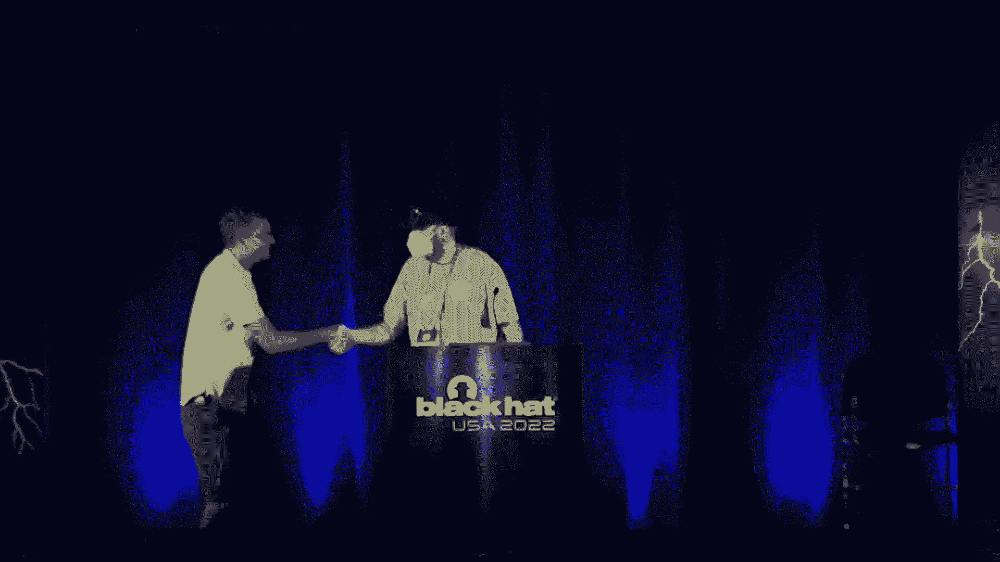


# 课程P52：057 - 模拟侧信道泄漏 🔍💻


在本节课中，我们将学习如何通过模拟来识别和定位芯片设计中的侧信道泄漏。我们将从理解基本的硬件泄漏原理开始，逐步深入到利用模拟工具进行前硅（芯片制造前）安全分析的方法，并探讨如何定位泄漏源以及测试安全对策的有效性。


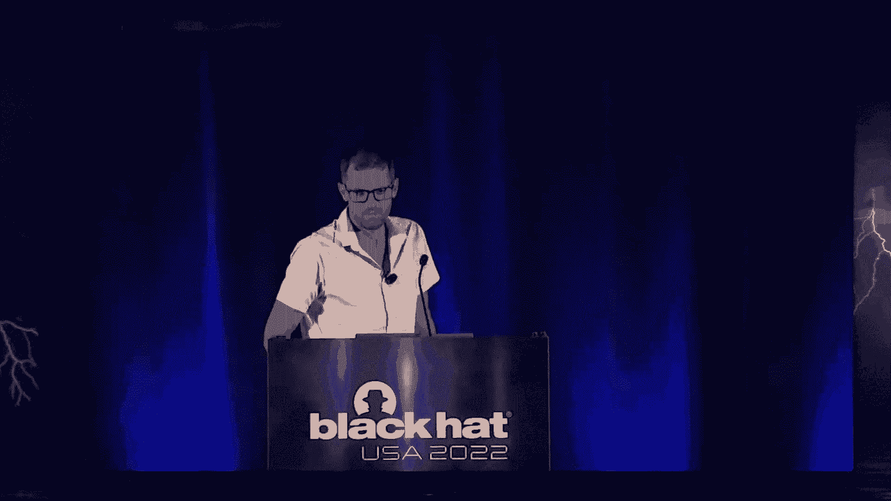

---


## 概述：什么是侧信道泄漏？ 🧠

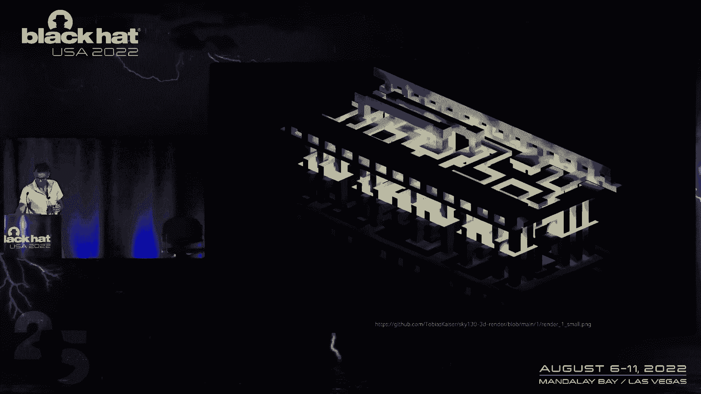

侧信道攻击是一种通过分析物理实现（如功耗、电磁辐射）而非算法逻辑本身来获取秘密信息（如加密密钥）的攻击方式。本次课程的核心是学习如何在芯片制造前，通过模拟其设计来预测和定位这类泄漏。

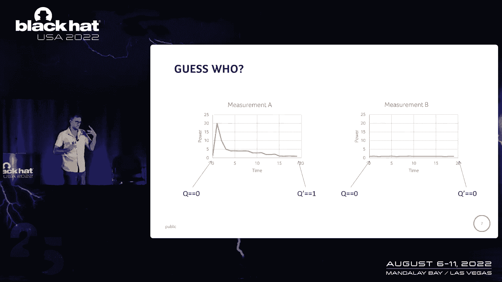

上一节我们介绍了侧信道攻击的基本概念，本节中我们来看看其硬件根源——触发器。

---

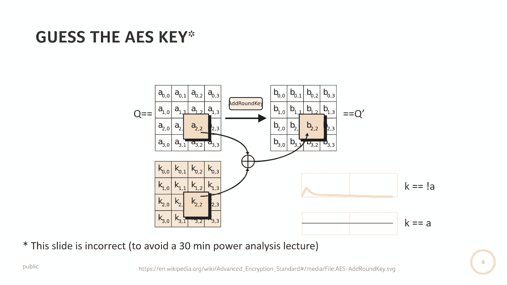


## 硬件泄漏的根源：触发器 ⚡


触发器是芯片内部存储比特状态的基本单元。它接收数据输入 `D` 和时钟信号 `CLK`，并产生输出 `Q`。其功能是：在时钟上升沿，将 `D` 的值锁存并输出到 `Q`。

**公式描述其行为：**
在 `CLK` 上升沿：`Q(t+1) = D(t)`

然而，触发器在状态切换（从0到1或从1到0）时，其功耗会出现一个尖峰。如果状态保持不变，则功耗相对平稳。这种功耗差异与处理的数据相关，因此可能泄露信息。

例如，在一个加密算法中，如果已知明文，通过观察特定触发器在操作时的功耗变化，就可能推断出部分密钥位的值。

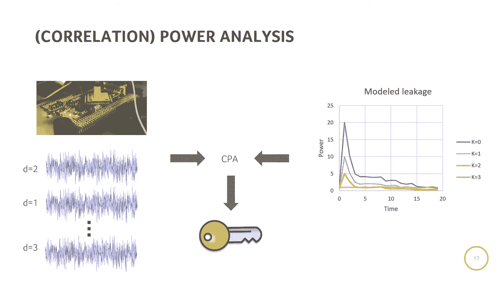

---

## 从单个触发器到整个芯片 🔬

虽然单个触发器的泄漏很小，但在实际芯片中，我们无法直接测量单个单元的功耗。芯片由数百万个门电路和触发器通过复杂的配电网络连接而成。

以下是理解芯片层级结构的关键点：
*   **网络列表**：描述芯片中所有逻辑门及其连接关系的文件。
*   **布局**：描述了这些逻辑单元在物理芯片上的位置。
*   **SoC（片上系统）**：现代芯片通常包含多个核心（如CPU）、专用硬件模块（如加密引擎）和内存等。

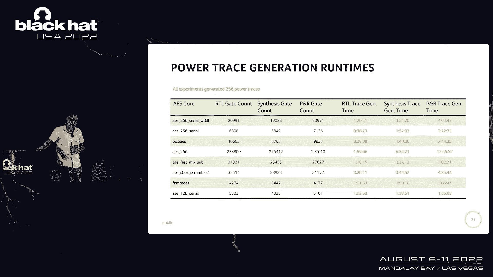

通过电磁探针或电流测量，我们可以捕获整个芯片或部分区域在运行时的功耗或电磁轨迹。利用统计学方法（如相关功耗分析），我们可以从这些宏观测量中提取出与密钥相关的信息。

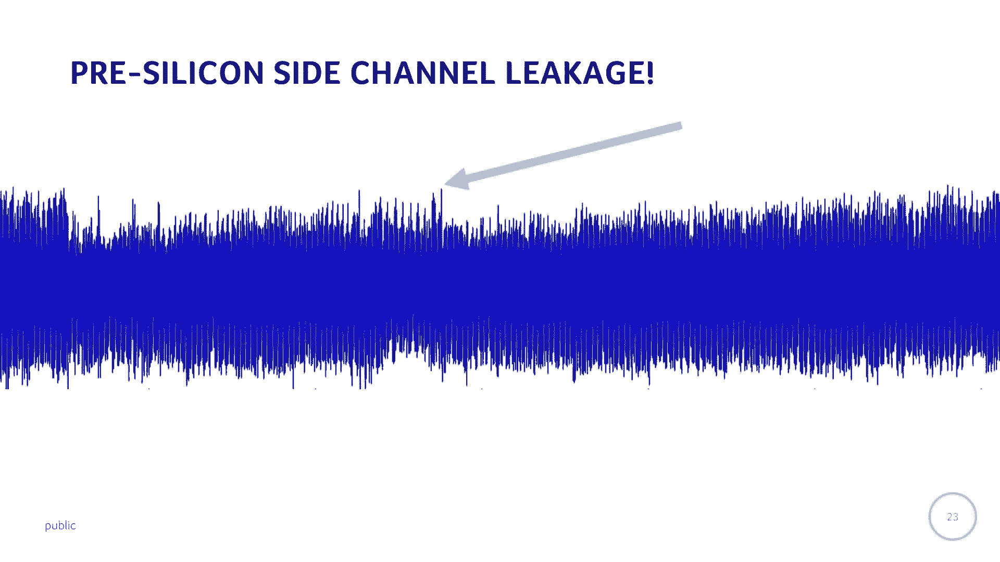

---

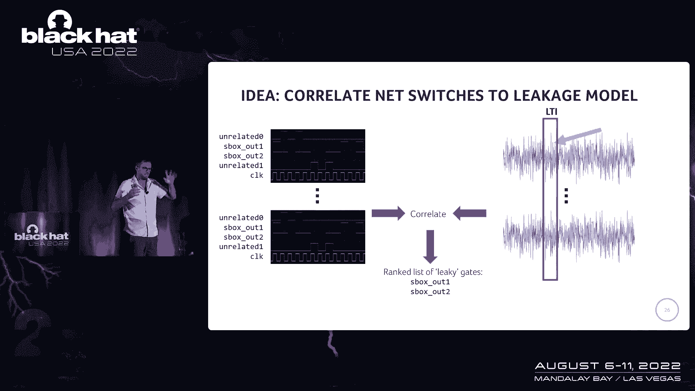

## 前硅安全分析：通过模拟预测泄漏 🛡️

在芯片流片（制造）后才发现泄漏为时已晚。我们的目标是在设计阶段（前硅）就识别并修复问题。

以下是进行前硅侧信道泄漏模拟所需的四个核心要素：
1.  **芯片设计（网表）**：门级电路连接描述。
2.  **行为仿真**：输入特定测试向量（如明文），通过仿真得到所有信号随时间变化的逻辑值（存储为VCD文件）。
3.  **功耗模型**：为每个标准单元（门、触发器等）建立模型，描述其在各种切换状态下的功耗。
4.  **分析引擎**：将仿真得到的逻辑切换活动，结合功耗模型，计算出模拟的功耗轨迹。

利用模拟出的功耗轨迹，我们可以像分析真实芯片一样，执行相关功耗分析（CPA），以判断设计是否存在可被利用的泄漏。

---

## 定位泄漏源：从统计关联到具体门电路 📍

仅仅知道“存在泄漏”还不够，我们需要知道“哪里在泄漏”，才能进行修复。

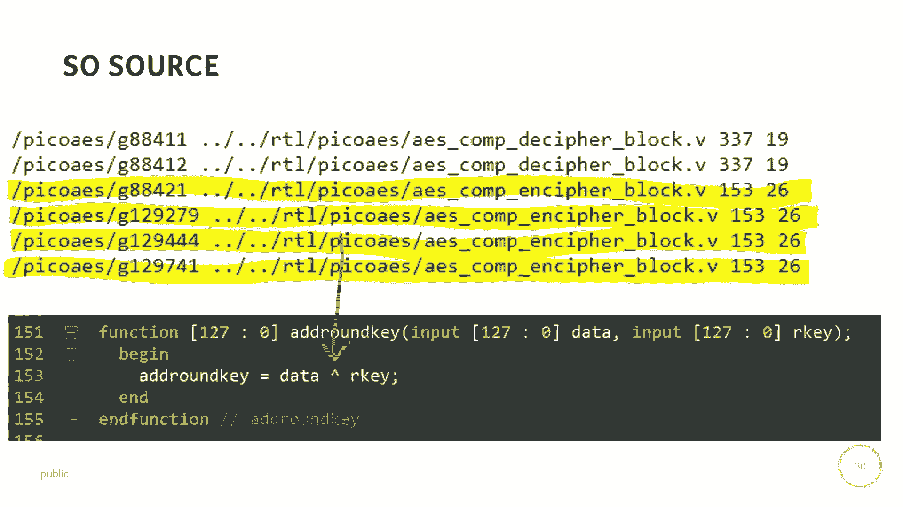

我们的研究方法（SLIC）旨在将统计上显著的泄漏时间点，与芯片内部具体的网络（net）和门电路（gate）关联起来。

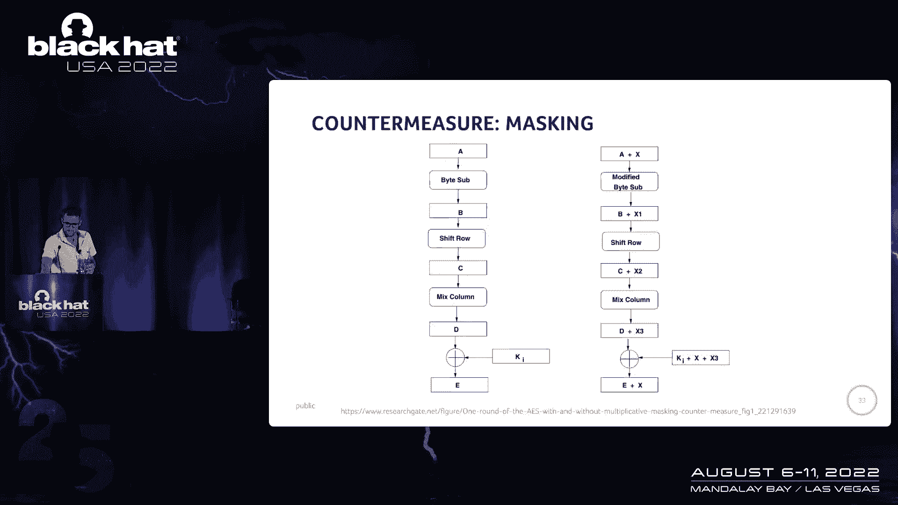

**核心方法简述：**
1.  对每个网络在每次仿真中的切换活动进行编码（例如，切换记为+1，不切换记为-1），形成一个简单的功耗模型。
2.  计算每个网络的切换活动序列与模拟整体功耗轨迹之间的**皮尔逊相关系数**。
3.  相关系数高的网络，其驱动门就被认为是潜在的泄漏源。

通过维护设计层次结构信息，我们可以将泄漏门列表映射回高级别的设计模块（如S盒、密钥寄存器）甚至源代码中的特定操作（如XOR），为开发者提供明确的修复目标。

---

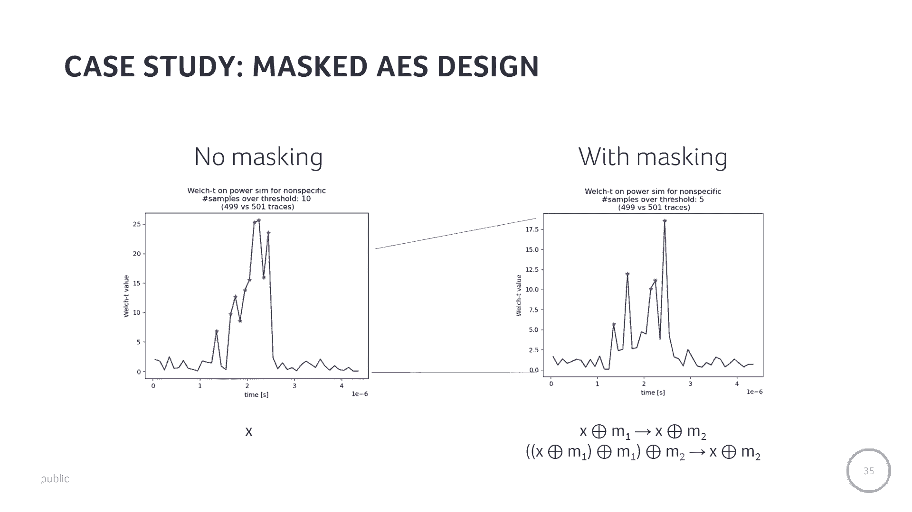

## 测试安全对策：以掩码技术为例 🎭

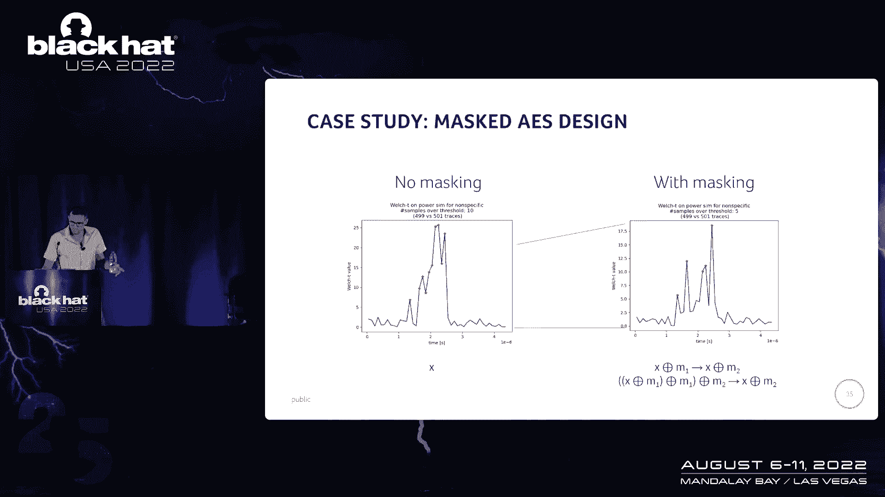

掩码是一种常见的安全对策，其核心思想是引入随机数，将中间数据与随机掩码进行混合，从而打破数据值与功耗之间的直接关联。

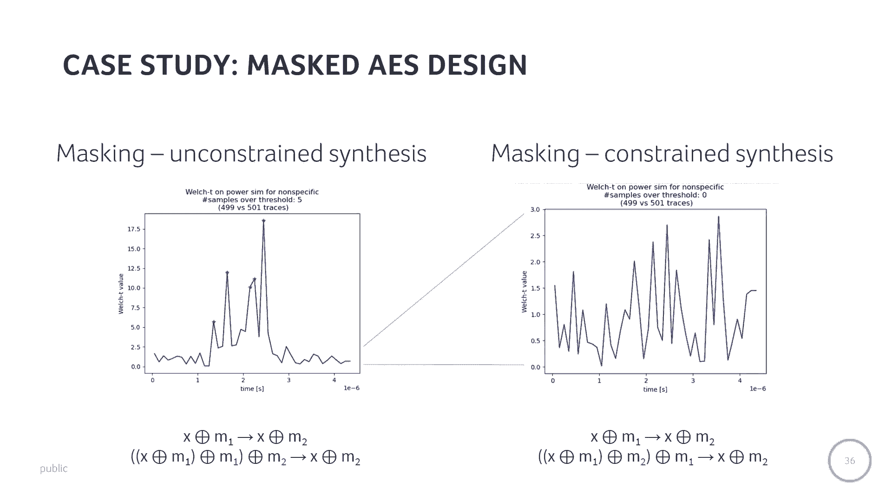


**代码描述其思想：**
```
中间值 = 数据 ⊕ 密钥 ⊕ 随机掩码
```
其中 `⊕` 代表异或操作。


我们通过模拟来测试掩码对策的有效性：
1.  首先，关闭掩码功能进行模拟和CPA分析，确认设计存在泄漏（出现显著的相关性峰值）。
2.  然后，开启掩码功能再次分析。理论上，泄漏峰值应该消失。

然而，在一次案例研究中，即使开启了掩码，模拟仍然显示泄漏。通过深入分析门级网表，我们发现综合工具为了优化性能，无意中调整了掩码操作的顺序，导致中间值在某个瞬间处于未保护状态。在指示工具禁止此类优化后，泄漏才真正消失。这凸显了在模拟中验证对策实际效果的重要性。

---

## 超越核心模块：系统级泄漏洞察 🌐

安全分析不应只局限于加密核心本身。当我们模拟一个完整的SoC运行时，可能会发现意想不到的泄漏源。

例如，在将密钥数据从CPU加载到加密引擎的总线传输过程中，虽然CPU的ALU或寄存器文件并不处理这些密钥，但由于它们连接在同一总线上，总线活动仍会引发这些模块内部晶体管的切换，从而产生与密钥相关的侧信道泄漏。

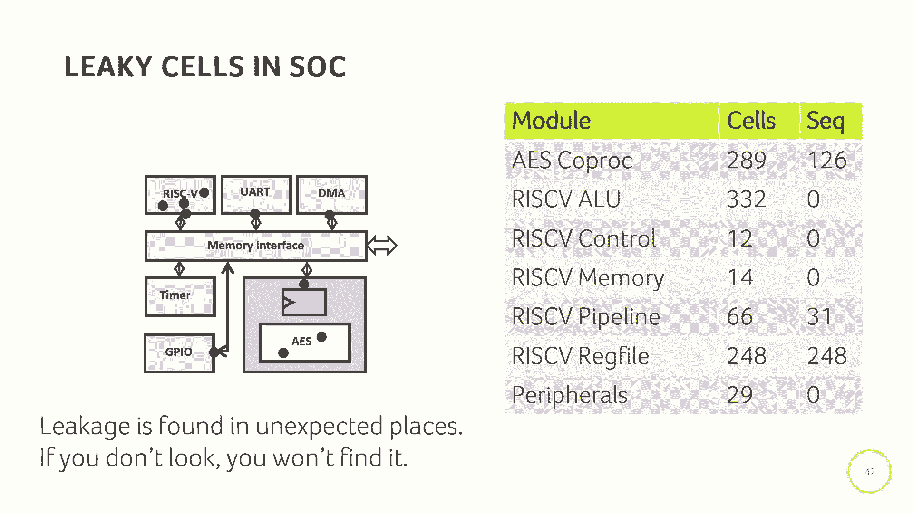


这一发现表明，**泄漏可能发生在任何处理或传输敏感数据的地方**，必须进行系统级的模拟分析才能发现。

---

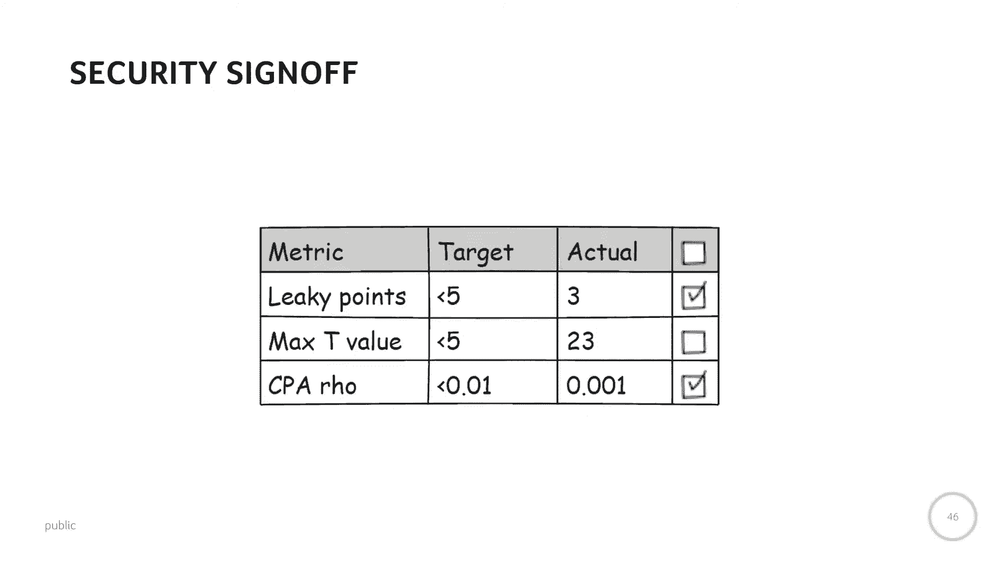

## 未来展望与总结 🚀

本节课中我们一起学习了如何利用仿真技术在前硅阶段预测、定位和分析芯片的侧信道泄漏。

**总结要点如下：**
*   **目标**：在芯片制造前发现并修复侧信道漏洞。
*   **方法**：结合网表、逻辑仿真、功耗模型和相关功耗分析进行模拟。
*   **关键步骤**：泄漏检测 -> 定位到具体门电路 -> 映射回设计层次 -> 验证安全对策。
*   **核心洞察**：泄漏可能发生在设计者意料之外的地方，系统级模拟和自动化分析工具至关重要。

未来的工作方向包括：
*   **精准对抗措施**：只对识别出的高泄漏门电路施加保护（如掩码），以降低面积和性能开销。
*   **设计空间探索**：将安全性作为与功耗、性能、面积并列的维度，供设计者进行权衡。
*   **安全签核**：建立基于侧信道分析的量化指标，用于判断设计是否“足够安全”可以投产。

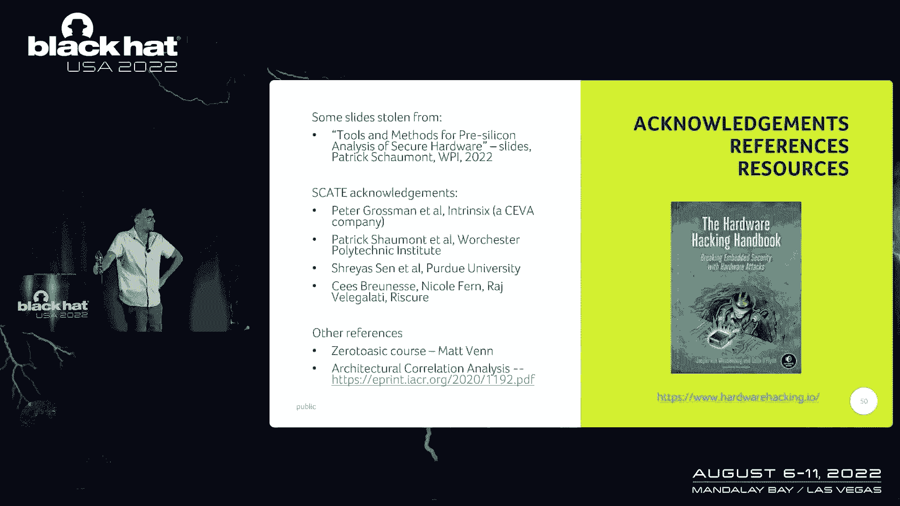

通过将侧信道分析能力集成到硬件开发流程中，可以让设计者（而非仅安全专家）在早期构建更安全的芯片。

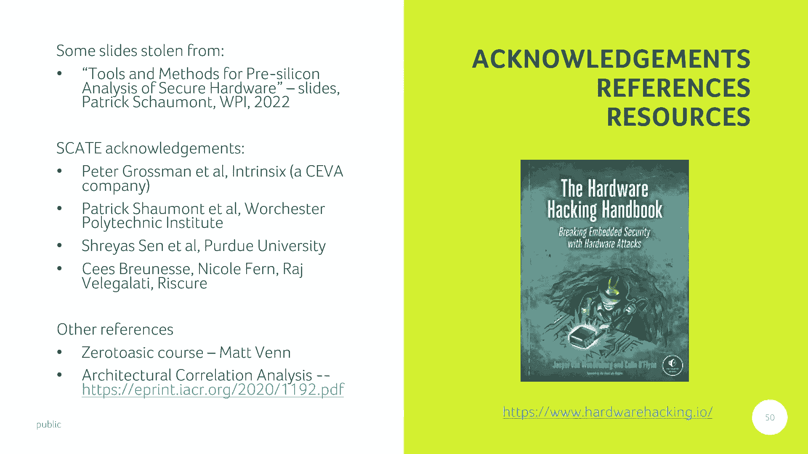


---
*参考资料：本教程内容基于相关学术研究（如架构相关性分析）及实践经验。对硬件安全感兴趣的读者可进一步阅读《硬件黑客》等书籍。*