# 课程 P53-058：超宽带实时定位系统安全漏洞分析 🎯

在本课程中，我们将学习超宽带实时定位系统的基本原理，并深入分析其通信链路中存在的安全漏洞。我们将探讨攻击者如何利用这些漏洞进行窃听和主动攻击，并通过实际演示了解其潜在危害。最后，我们将讨论可行的缓解措施。

## 概述 📡

想象一个场景：在制造工厂中，你站在一台已关闭的危险设备旁。由于设备无法感知你的存在，它可能突然重新启动，这将导致糟糕的后果。实时定位系统不仅用于寻找停放的汽车或丢失的物品，其在工业环境中的安全缺陷，可能是致命的。

我们是Naomi Networks的研究小组成员。今天我们将介绍超宽带实时定位系统，以及看似安全的无线电通信在实践中是如何失效的。这是我们首次公开这些零日漏洞。

## 什么是超宽带与实时定位系统？ 🤔

超宽带是一种用于短距离快速传输信息并能穿透固体物体的射频技术。它是实时定位系统的首选技术，主要用于存在许多障碍物的室内环境。

实时定位系统是一种利用信号对静止和移动物体进行定位的技术。

如果你查看屏幕上的图表，你会看到该技术的三个主要组成部分：
*   一个附着在人员或资产上的**标签**，用于发送位置数据。
*   **锚点**，接收标签数据并将其转发。
*   **服务器**，接收锚点数据并进行所有处理和计算，最终在界面上显示。

RTLS应用于多个行业，例如智能建筑的门禁控制、智能零售的免结账支付等。用例是无穷的，因此该技术中的任何安全缺陷都可能具有广泛的影响。

## 研究动机 🎯

2020年，FiRa联盟发布了更新标准，旨在提高UWB通信的安全性。他们增加了密码学和随机数生成，以防止威胁行为者窃听或使用其他操纵策略。

UWB看似完美无缺，但事实并非如此。根据进一步研究，我们发现位置数据的同步和交换被认为超出了标准的范围。确保这些通信安全的责任被严格留给了供应商。

这可能会令人费解，具有挑战性，甚至有些可怕。进一步审查后，我们发现关于这个特定主题的研究并不多，于是这项研究诞生了。

## 研究范围与方法 🔬

在介绍中，我们看到了UWB与RTLS如何被广泛使用，以及它如何能在多种场景下为各种用例部署。在下面的内容中，我们将从工业范围和技术范围两方面界定我们的研究。

### 工业范围

我们的研究专注于两个不同的领域：医疗保健和工业。
我们选择这些领域是因为，一方面，在过去几年中，这些部门受到的网络攻击越来越多；另一方面，出于安全考虑，这些部门会使用UWB RTLS，例如用于员工和资产跟踪、接触者追踪（如在新冠疫情后期用于警报系统）以及地理围栏。

地理围栏可以被看作是一套管理人员进入限制区域的规则。

### 技术范围

一旦定义了工业范围，我们继续分析市面上可用的UWB RTLS套件。我们考虑了可用性、交付时间、成本和特性等方面。最终，我们选择了两个具有市场代表性的套件：**Sewio** 和 **Qorvo**。

Sewio RTLS场景包含一个标签，它通过UWB信号与部署在房间特定位置的一组锚点通信。这些锚点之间通过以太网或WiFi进行通信。

迄今为止，安全研究主要集中在UWB信号本身的分析上。这是首次对锚点与服务器之间的以太网或WiFi通信进行分析的研究。

### 定位算法基础

有许多算法可以在任何环境中定位资产。为了理解攻击所需的先决条件，值得进行简单的基础分析。

由于各种原因，锚点的时钟通常不同步。因此，需要同步机制，其中最常见的是**双向测距**同步模式。

周期性地，一个参考锚点发送一个被所有其他锚点接收的UWB信号。参考锚点将发送信号的瞬间时间戳发送到RTLS服务器。服务器利用这些信息构建一个统一的时间概念。

标签发出所有锚点接收的UWB信号。这些接收时间戳被发送到服务器。

现在文献中有很多同步算法。在这项工作中，我们使用**线性插值算法**。简而言之，这是一种实现同步的简单有效方法。其思想是，RTLS服务器在每次算法迭代时，估计每个新参考锚点与原始参考锚点之间的时钟偏差。这些转换后的时间戳被称为**全局时间**。

我们不能立即从全局时间得出距离，因为我们缺少信号传输的绝对时间（标签不会将此信息发送到服务器）。我们能做的是将全局时间差与距离差联系起来。这就是为什么该算法被称为**到达时间差**。

将所有方程放在一起，就得到了最终的线性方程组，可以求解出标签的位置。

从系统中可以看出，为了获得标签的位置，我们需要三条信息：锚点的坐标、涉及同步的时间戳以及定位时间戳。

## 逆向工程与安全分析 🛠️

在研究了TDoA算法的背景和理论之后，我们继续进行逆向工程活动，以理解锚点和服务器执行的TDoA过程。为了能够解析所有流量，我们需要了解网络流量是如何处理的。我们也对这个系统进行了一些安全检查。

流量分析显示，锚点和服务器之间的通信使用自定义的私有二进制网络协议，没有通用的数据结构。因此，为了能够解析所有流量，需要进行逆向工程活动。

我们从RTLS服务器的源代码开始分析。对于Sewio和Qorvo，我们能够通过分析源代码来完全解析流量。然后，我们将所有活动形式化，相关工具可从会议简报网页或我们公司的GitHub页面下载。

关于从锚点到服务器的通信，我们主要关注两个方面：数据的**机密性**和**完整性**。

*   **数据机密性**：从分析中可以看到，所有位置时间戳和同步时间戳都以明文发送，因此无法保证机密性。
*   **数据完整性**：两个系统都使用了不安全的完整性机制，例如简单的CRC-16校验和。

## 攻击者如何获取锚点坐标？ 🎯

在上一节，我们得出结论，既没有保密性也没有完整性来保护这些数据。然而，为了得到标签的位置，我们还需要锚点的坐标。

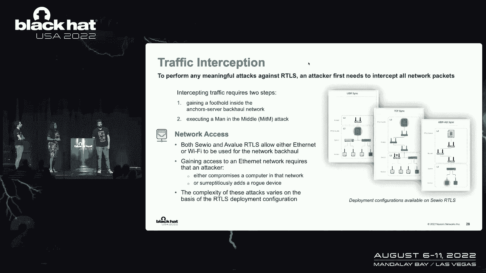

根据测试，锚点坐标是在首次安装RTLS时手动输入的。这对攻击者来说是最具挑战性的要求，它可能影响攻击者最终估计位置的能力。

如果攻击者对该区域有物理访问权限，这个问题可以用多种方法解决。如果锚点可见，则很简单。如果锚点不可见，攻击者仍能估计其位置，例如通过测量传输的无线信号强度。

根据测试，锚点坐标不需要超级精确就能获得标签的大致位置。从图表中可以看到，如果坐标误差在10%左右，标签位置的估计误差将小于20%。在一个6x4米的房间里，这大约是50厘米，对于不需要厘米级精度的攻击来说已经足够。

### 远程坐标估计技术

然而，如果攻击者是远程的怎么办？坐标信息从不通过网络传输。但远程攻击者可以应用我们设计的一种技术。

RTLS服务器会利用UWB信号的功率级别信息来过滤掉接收不良的通信。服务器计算两个不同的矩阵：**第一路径功率级别**（信号第一路径的功率）和**接收功率级别**（信号的总功率）。

我们不能立即从功率级别信息得到距离，因为它们不够精确，且过于依赖特定时刻的环境条件。然而，如果在给定时刻，来自所有锚点的功率级别信息几乎相同，那么发射标签可以被认为与所有锚点的距离完全相同。

如果这是真的，第一个等式为零。记住，根据定义，参考锚点相对于自身的时钟偏移为1，参考锚点相对于自身的飞行时间为零。

攻击者现在可以有足够的信息来估计每个已知锚点与参考锚点之间的所有飞行时间，从而得到距离。

但这仍然不够，我们需要坐标。在这方面，攻击者可以利用RTLS的安装约束。由于与定位精度相关的现象，供应商建议锚点几何形状应尽可能规则，理想情况下必须是正方形或长方形。

既然我们知道了距离，并且知道锚点地图将尽可能规则（大多数时候是矩形），通过在零点位置任意放置参考锚点，所有其他锚点的坐标都可以很容易地估计出来，因为它们将由两个最短的距离决定。

攻击者可以根据发现的通信锚点数量来调整形状。这实际上在Qorvo RTLS中进行了测试，通过监视一个移动的标签大约两个小时。

值得注意的是，如果我们将第一路径功率级别的接受阈值设置为1%，锚点坐标的误差将小于10%。结合之前的图表，这转换为标签位置的小于20%的误差（即之前提到的50厘米）。

这意味着，总的来说，一个完全远程的攻击者可以对锚点坐标进行估计，从而对标签位置进行估计，进而实施对系统的实际攻击。

## 攻击者的战术、技术与程序 ⚔️

在之前的幻灯片中，我们看到了如何从锚点发送到服务器的时间戳开始获取标签位置。在这部分，我们将看到对手的战术、技术和程序。

### 第一步：立足网络

要对RTLS执行任何有意义的攻击，攻击者首先需要在所使用的网络（即锚点与服务器之间的通信网络）上站稳脚跟。然后，如果需要，他需要执行中间人攻击以拦截所有数据包。

对于Sewio和Qorvo，UWB锚点允许通过以太网或WiFi访问网络。
*   在以太网情况下，为了访问网络，攻击者需要危害网络中的计算机，或添加一个恶意设备到网络。此类攻击的复杂性取决于网络拓扑结构。
*   对于Qorvo的WiFi，使用WPA2-PSK作为网络通信安全协议。要获得WiFi接入，攻击者需要知道WPA2-PSK密码，或利用网络设备中的漏洞（如果存在）。

关于第一点，开箱即用的解决方案提供了自定义密码和默认密码。默认密码在公开的文件中，任何人在互联网上都可以访问。如果资产所有者不更改默认密码，攻击者访问该网络是微不足道的。

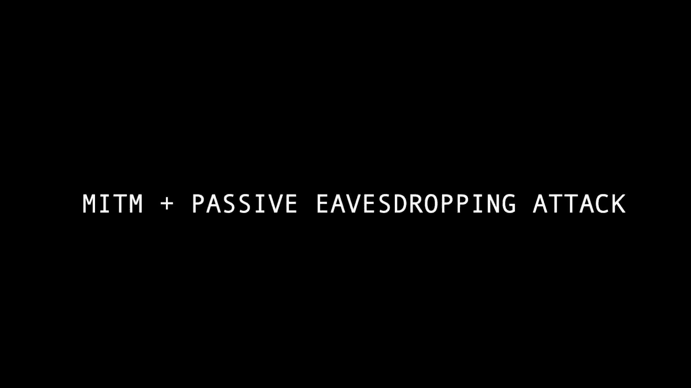

### 第二步：执行中间人攻击

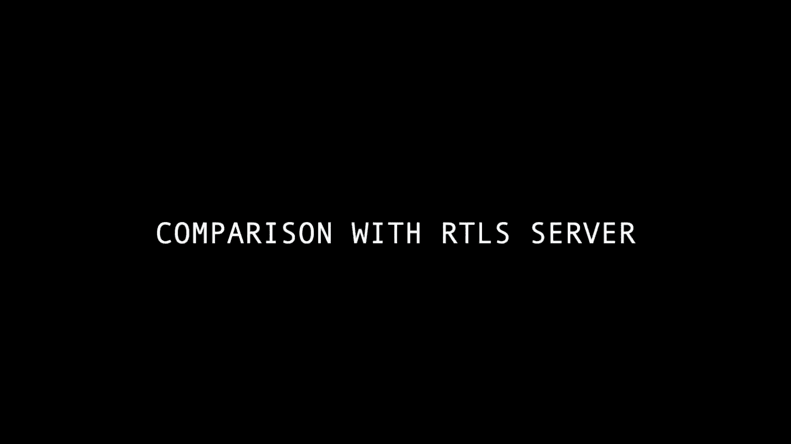

作为第二步，攻击者可能需要执行中间人攻击。我们展示了中间人攻击的输出，以及Wireshark截图，表明一旦发起中间人攻击，我们能够看到从锚点到服务器的所有网络流量，反之亦然。

重要的是要注意，对于两个套件，我们意识到执行一次标准的ARP欺骗攻击就足以执行中间人攻击。而且，值得注意的是，这些攻击完全没有被RTLS发现，没有可能提醒操作员的警告或异常行为。

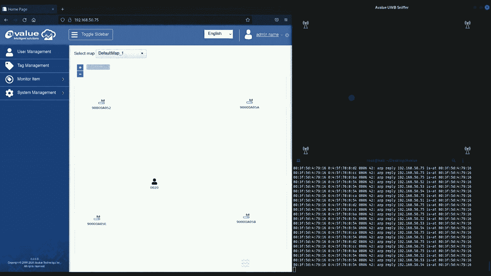

### 第三步：被动定位与主动操纵

在发起中间人攻击后，我们可以进入网络，然后开始获取标签的位置。首先拦截所有流量，然后应用标准的到达时间差算法来计算标签的位置。

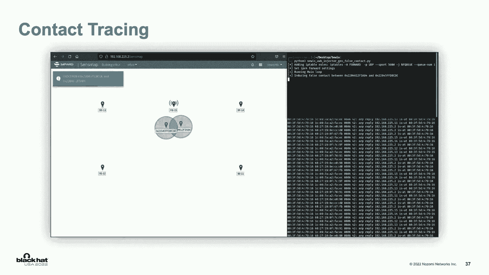

一个逻辑问题是，是否有可能执行主动流量操纵攻击？答案是肯定的。要做到这一点，攻击者需要执行一个两步过程。

**第一步：目标分析与模仿**
目的是监视标签在环境中的正常行为和移动，以便能够复制这种行为，使监控系统无法检测到异常。

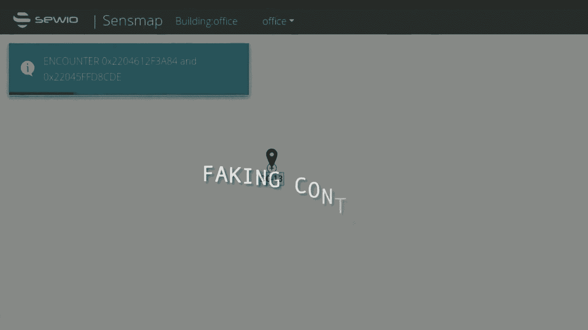

**第二步：流量篡改**
关键思想是让不感兴趣的标签流量尽可能直接到达目的地，只修改需要改变的时间戳有效载荷，然后发送到目的地。对于我们的演示，我们利用了Netfilter Queue，这是一个灵活的用户空间数据包处理框架。

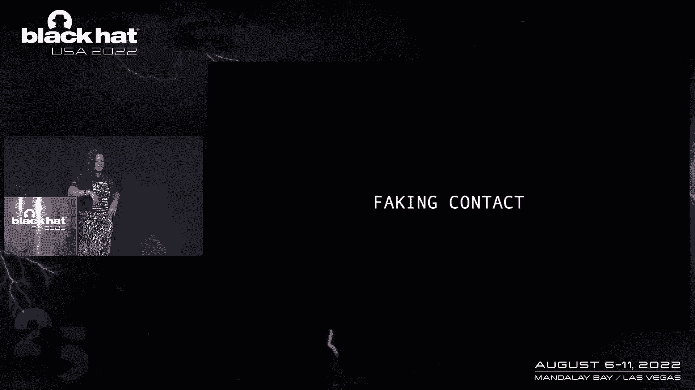

在真正能够发动攻击之前，我们需要做的最后一件事是反向计算。在这种情况下，我们从希望标签出现的位置开始，反向应用TDoA算法来计算需要的时间戳，然后篡改网络数据包中的时间戳并重新计算校验和。

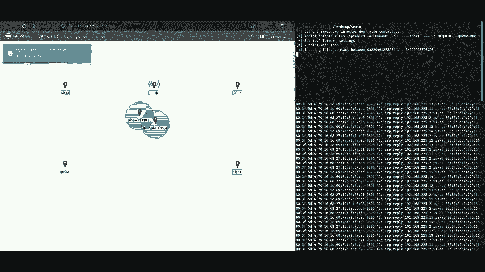

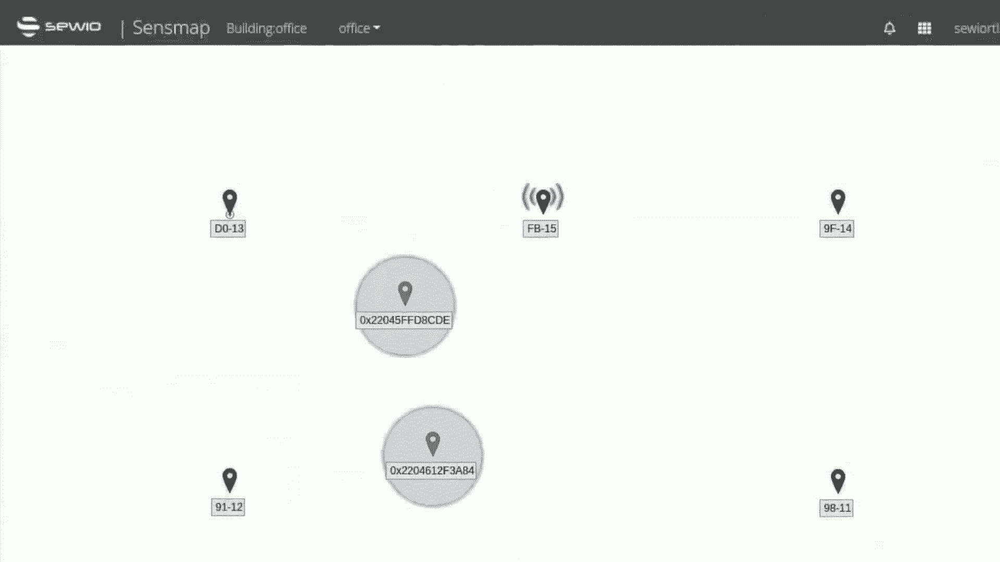

## 攻击演示 🎬

现在，我们将演示攻击者如何利用我们发现的漏洞在三种攻击场景中进行攻击。

### 场景一：定位与跟踪

我们展示了威胁行为者如何窃听网络流量，以定位和跟踪资产或个人。他们可能想跟踪某人、偷窃物品或了解环境。

**正常情况**：受害者佩戴标签在办公室内移动，RTLS服务器准确显示其移动轨迹。
**攻击情况**：攻击者发起中间人攻击前，其视图没有位置数据。攻击发起后，攻击者能够实时看到受害者的移动轨迹，且RTLS服务器没有任何被入侵的警报。

### 场景二：操纵接触者追踪

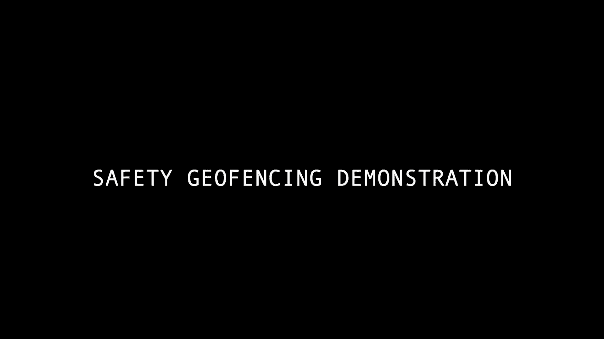

我们展示了威胁行为者如何操纵用于接触者追踪的RTLS服务器。为了演示，我们模拟有人感染了病毒。

**正常情况**：两个佩戴标签的人互相接触，系统生成接触警报。
**攻击-伪造接触**：两人并未接触，但攻击者操纵数据，使系统显示他们发生了接触并生成警报。
**攻击-隐藏接触**：两人实际发生了接触，但攻击者操纵数据，使系统显示他们没有接触，从而不生成警报。

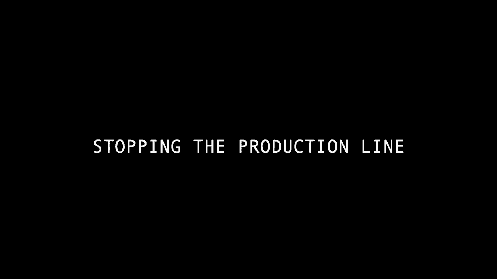

### 场景三：破坏地理围栏安全

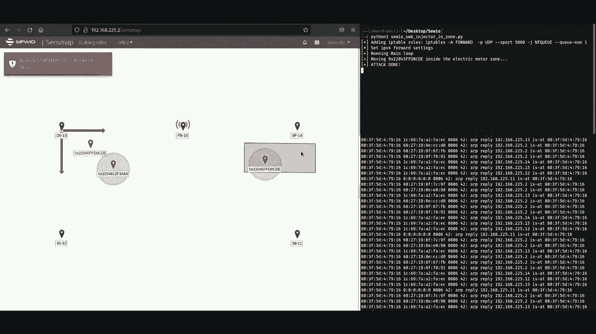

我们在实验室的生产线演示中配置了一个滑块系统，由RTLS地理围栏警报控制电机启动或停止，具体取决于工人是否在地理围栏区域内。

**正常情况**：工人靠近生产线（地理围栏区内），生产停止；工人离开后，生产恢复。
**攻击-非法停止生产**：生产线周围无人，但攻击者操纵一个虚拟标签进入地理围栏区，导致系统停止生产。
**攻击-非法启动生产**：工人实际处于危险的地理围栏区内，生产本应停止。但攻击者操纵标签数据，使其显示在安全区外，导致危险的生产被重新启动，使工人处于危险之中。

## 可能的缓解措施 🛡️

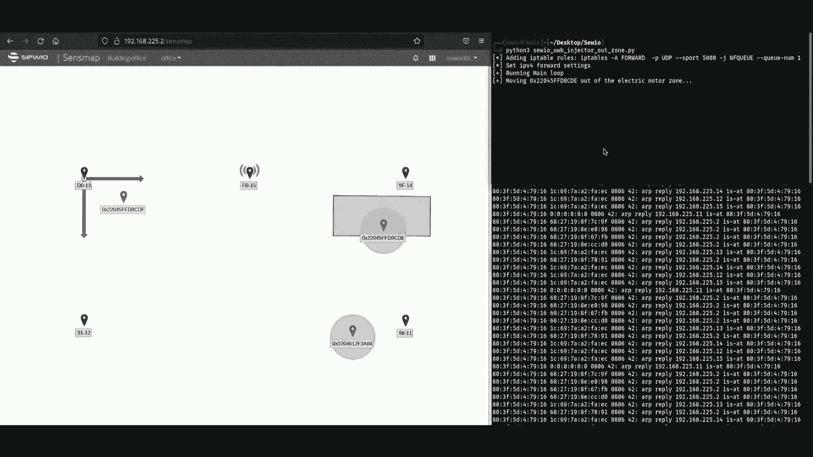

在展示了攻击者可以对系统做什么之后，值得讨论可以应用哪些可能的缓解措施。

### 1. 网络隔离

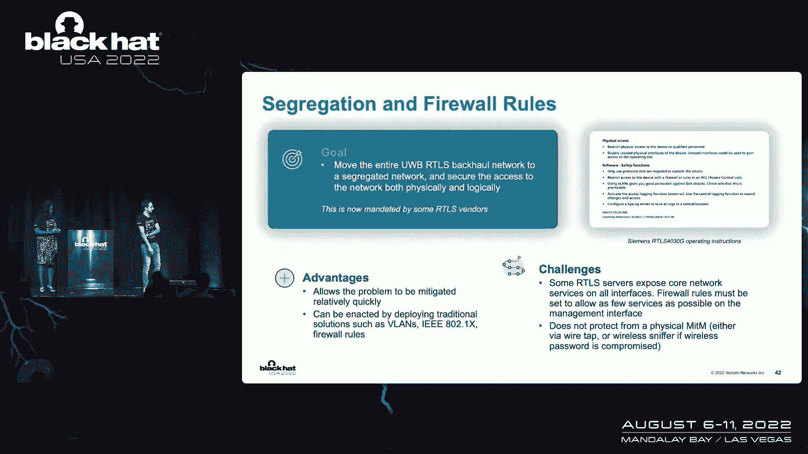

将RTLS移至隔离的网络，并确保其在物理和逻辑上的隔离。这不是一些RTLS供应商规定的。这种解决方案的优点是部署相对较快，可以使用传统的网络安全解决方案实施。

然而，有些挑战需要考虑：服务器通常有两个网络接口（连接到主干网和管理网络）。默认情况下，大多数RTLS服务倾向于在所有接口上公开其服务。如果这些服务没有从管理网络中充分过滤，攻击者可能无法实施我们展示的攻击（因为缺少信息），但仍可能阻止位置更新或进行拒绝服务攻击。此外，如果攻击者物理接触线路或危害WiFi密码，隔离措施将失效。

### 2. 入侵检测系统

在网络中添加入侵检测系统。由于攻击需要执行中间人攻击，IDS可以检测到节点之间的新链接等特征。优点是部署非常快。

然而，它天生容易受到物理中间人攻击。此外，精心制作的主动流量操纵攻击，如果精确模仿目标的自然运动，其流量将与合法流量无法区分。

### 3. 添加传输层保护

最有效的缓解措施是在现有通信之上添加加密和完整性层。作为概念验证，我们尝试在现有RTLS通信基础上添加SSH隧道。

我们成功了，能够加密所有流量，同时保留RTLS功能。然而，也需要考虑一些挑战：SSH隧道增加了锚点的负载并引入了延迟。我们通过降低同步频率来抵消这种影响，但这降低了精度，对于需要实时精确标签位置的应用可能是个问题。此外，整个缓解措施取决于能否直接访问服务器或锚点以进行配置。

## 总结与要点 📝

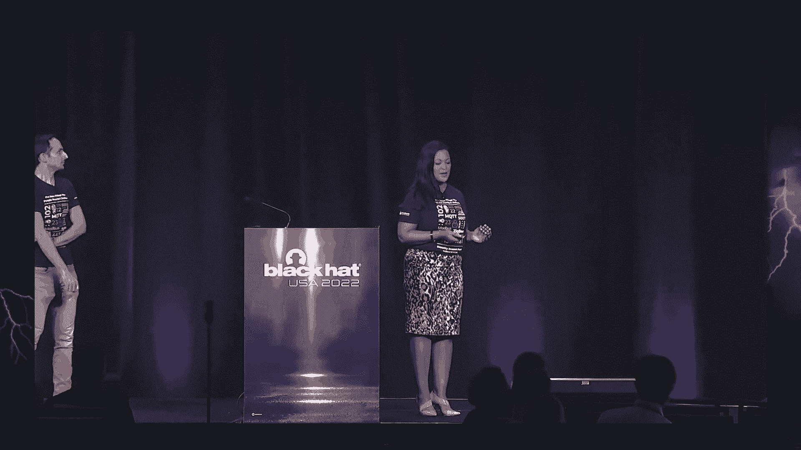

我们拆解了很多内容，让我们快速回顾一下。

安全标准并不涵盖一切。但随着RTLS的广泛应用，我们不能容忍标准和实现中的那些漏洞。我们在两个流行的UWB RTLS套件中发现了漏洞，它们被用于人员跟踪、地理围栏和接触者追踪。

我们演示了威胁行为者如何发起中间人攻击进行窃听或其他操纵策略。我们现在也提供了一些缓解措施。

如果你不记得这次演示中的其他事情，我们希望你带着这三件事离开：

1.  **关键软件中薄弱的安全需求会导致不可忽视的安全问题**。安全关键软件应该有明确定义的安全标准。
2.  **存在未被注意的攻击面，但如果被利用，后果严重**。当大家都在关注锚点和标签之间的通信时，没有人关注锚点和服务器之间的通信。重要的是审视整个攻击面，而不是只专注于一部分而忽略其他。
3.  **利用UWB RTLS中的辅助通信进行攻击可能具有挑战性，但在此次演讲之前，它被认为是可行的**。这些攻击场景曾被认为不太可能，但显然在此次演示中，我们表明，即使需要特定知识，它也是可以做到的，并且可能造成毁灭性影响。

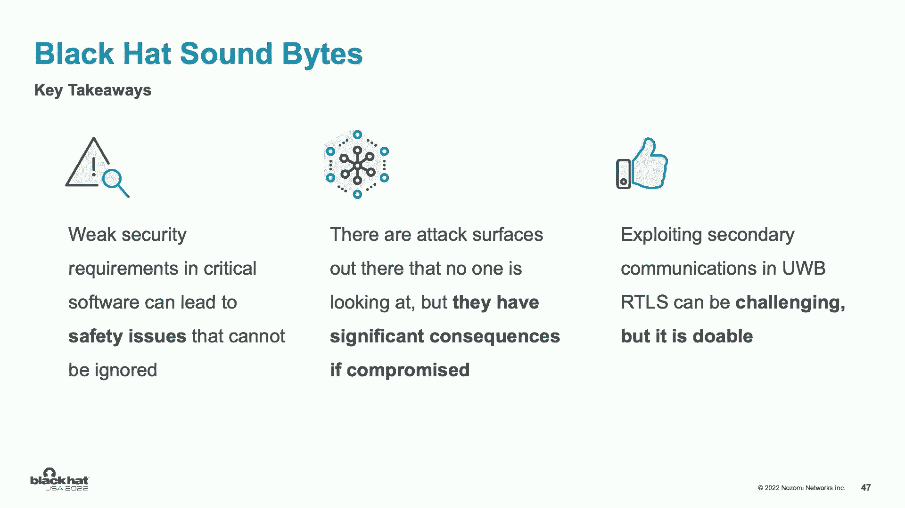

没有安全就没有保障。我们希望这次演讲不仅让你意识到安全缺陷，更能激励你作为研究人员，继续发现这些漏洞，以保护个人、商业与世界。这可能有点吓人，但这是可以做到的。

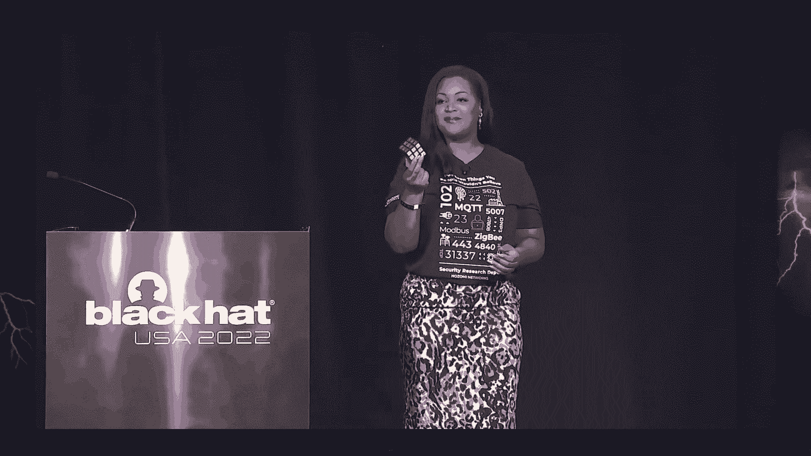

---
**本节课中，我们一起学习了超宽带实时定位系统的基本原理、其通信链路中的安全漏洞、攻击者利用这些漏洞进行窃听和主动攻击的方法，以及几种可能的防护措施。理解这些漏洞对于在工业物联网和关键基础设施中安全部署RTLS至关重要。**