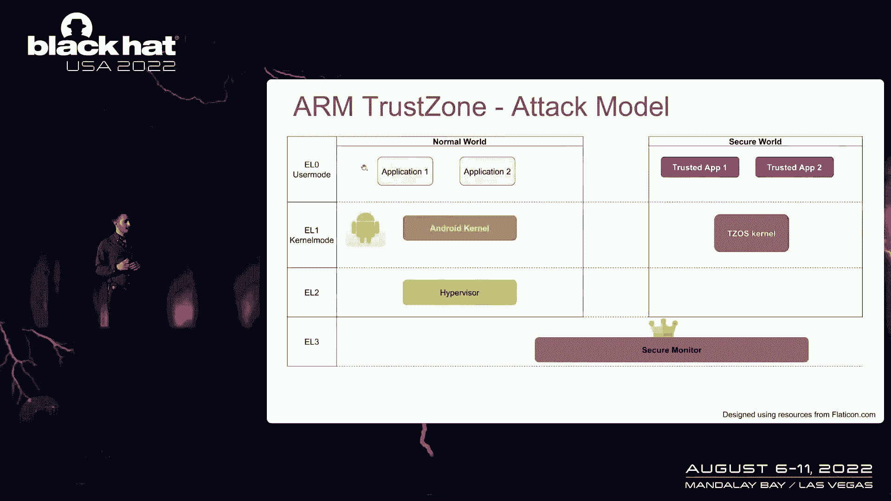
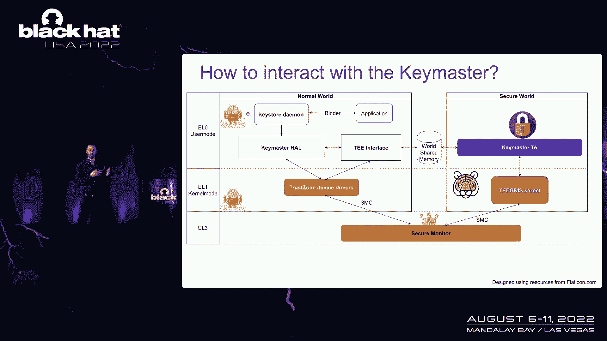
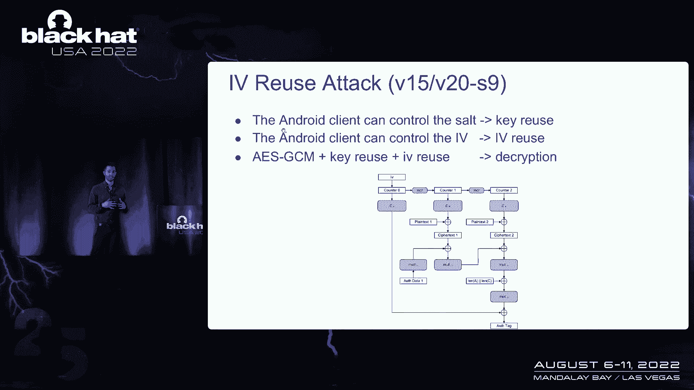
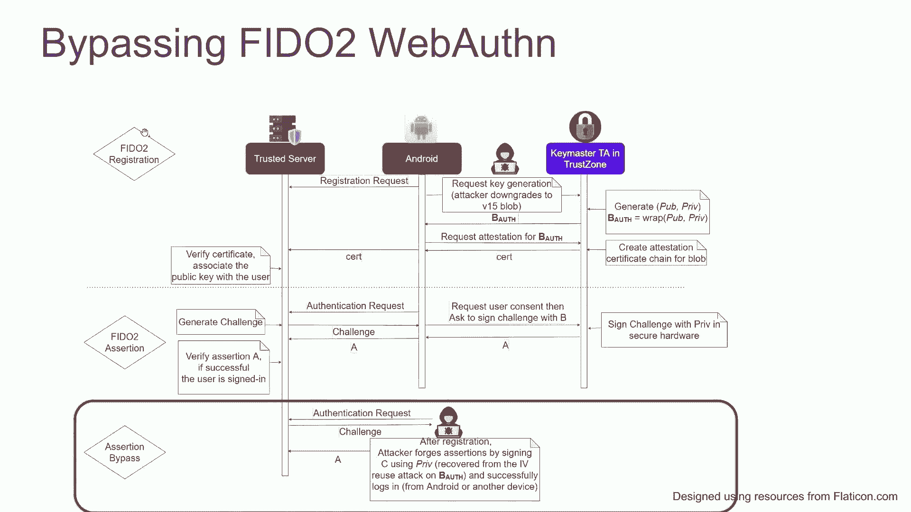
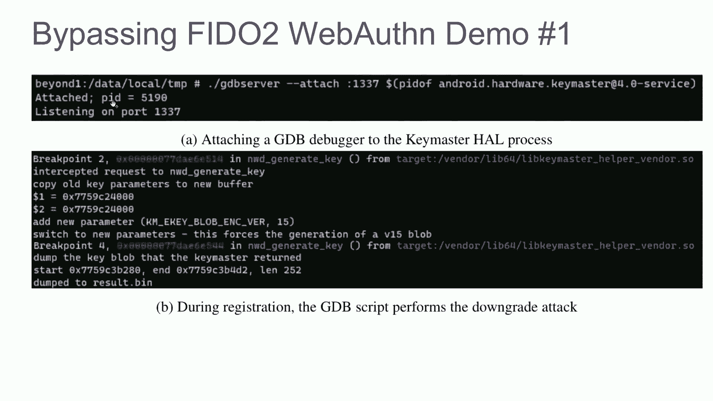
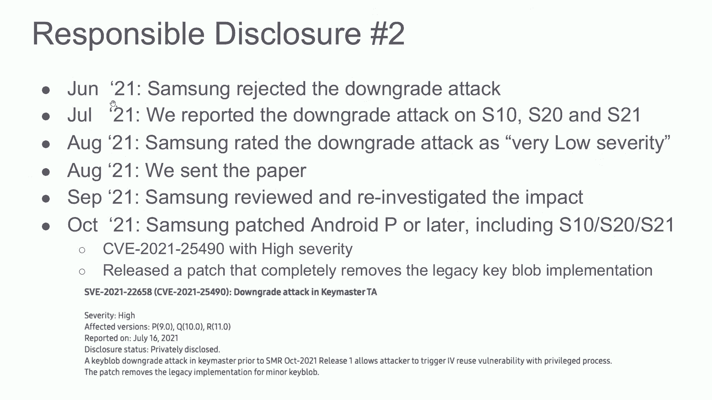
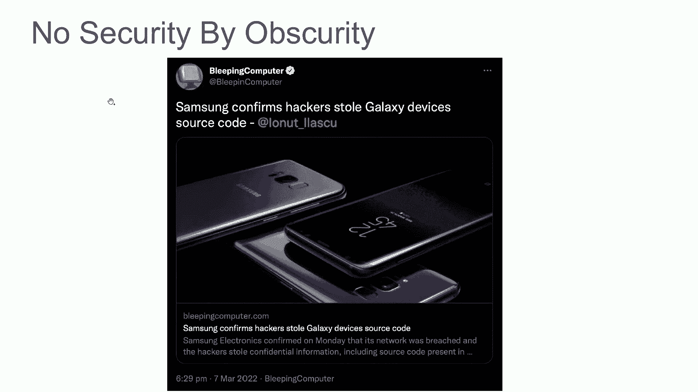
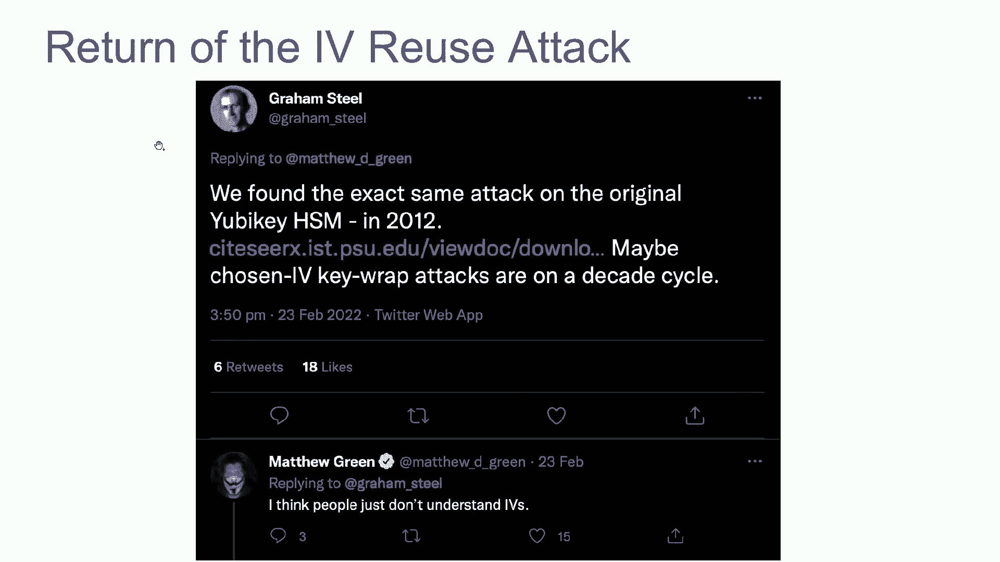
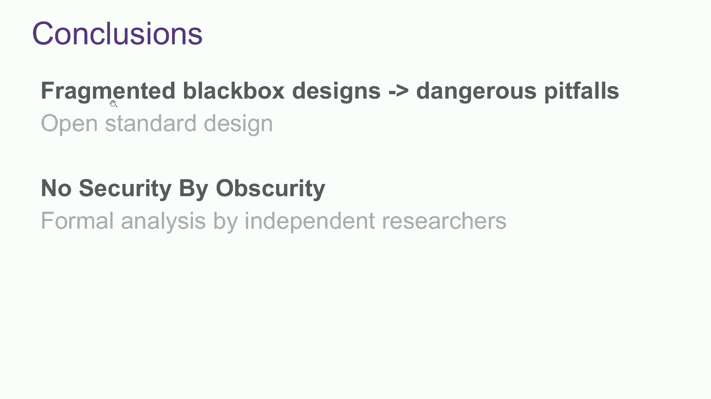
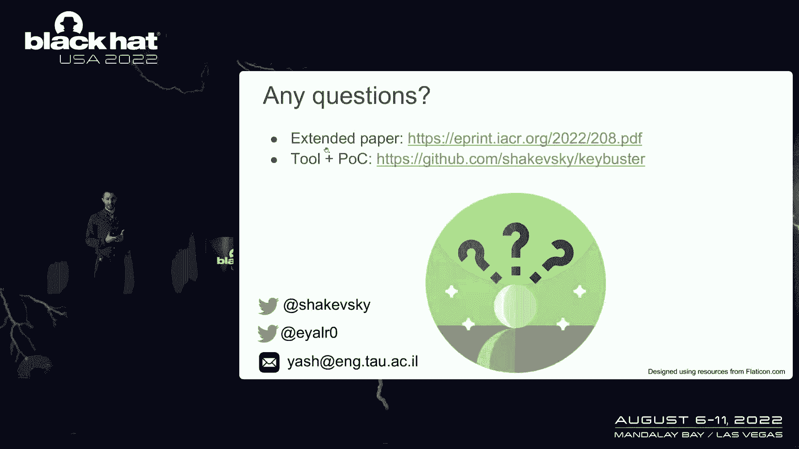

# 课程 P54：059 - 在黑暗中消亡的信任：揭示三星 TrustZone Keymaster 设计 🔓


在本节课中，我们将学习一项关于三星设备 TrustZone 安全机制中 Keymaster 组件的研究。我们将了解研究人员如何发现并利用关键设计缺陷，从而完全恢复受保护的加密密钥。课程将涵盖攻击原理、影响范围以及从中汲取的安全教训。

---

## 概述：为何要关注手机安全？ 📱

你的手机是你每天使用的设备，承载着各种安全关键任务。你用它通过 Google Pay 等服务进行支付，管理大部分数字生活。这使其成为攻击者的主要目标。近年来，我们看到了许多完全破坏操作系统的公开攻击。然而，我们仍然需要保护应用程序的加密密钥，以防止攻击者从你的银行账户转账或登录你的 PayPal 或 Twitter 账户。

因此，现代 Android 设备使用 TrustZone 安全扩展来提供可信执行环境。它运行一个与主操作系统隔离的独立执行环境。事实上，三星设备使用了三种不同的 Trusted OS：高通 QSEE、Renesas Bee 和三星自己的 TEEGRIS。这些供应商的设计是保密的，这使得验证其安全性变得更加困难。

在本研究中，我们选择三星作为测试案例。我们对 Keymaster 的密码设计进行了逆向工程，重点关注受保护加密密钥的安全性及其与高级可信协议（如 FIDO WebAuthn）的关系。

---

## TrustZone 与 Android Keystore 架构 🏗️



上一节我们介绍了手机安全的重要性，本节中我们来看看 TrustZone 如何提供隔离保护。

TrustZone 提供了两种模式下的逻辑分离：普通世界（运行 Android 系统）和安全世界（运行 Trusted OS）。我们遵循 Android 平台安全模型，该模型规定密钥材料应受到保护，能够抵御普通世界的完全入侵。但事实上，对于我们的攻击，我们只需要在 Android 用户模式下拥有一个足够强大的上下文来与 TrustZone 驱动程序通信。

最后，我们有谷歌设计的 Android Keystore，它提供加密密钥管理。应用程序可以请求密钥生成，TrustZone 中的可信应用程序 Keymaster 将在安全硬件中生成密钥，并在返回到普通世界之前使用硬件派生的密钥对其进行加密。密钥可以存储在磁盘上。Keystore 密钥还可用于证明密钥确实是在安全硬件中生成的，并用于签名等密码操作。

关键的一点是，密钥的明文材料应只能由 Keymaster 访问，绝不能离开 TrustZone。Keymaster 保护密钥材料，并且它应该是唯一拥有密钥明文访问权限的实体。但这个假设能保证吗？

在这个简单的介绍之后，让我们深入研究我们的安全分析。


---

## 安全分析入门：如何与 Keymaster 交互？ 🔍



在我们开始之前，请注意大多数细节都被简化了。更多信息，请参阅扩展的论文文件。

**你是如何开始的？从哪里开始？**
你可以下载固件并提取可信应用程序、引导加载程序和可信操作系统的内核。你可以阅读少量可用的公共文档，并使用安全认证和开源存档。但对于我们的大部分研究，我们花了很多时间对 TrustZone 进行逆向工程，制作了几十个可信操作系统的映射。

**你如何与 Keymaster 交互？**
通常，应用程序使用 Binder API 与 Keystore 服务通信，Keystore 服务使用内核 API 与 TrustZone 通信。在执行 SMC（安全监视器调用）的驱动程序上，调用会将执行切换到安全监视器。安全监视器将请求转发到 Trusted OS，最终到达 Keymaster。

我们发布了一个名为 **Keybuster** 的开源工具，允许直接与 Keymaster 通信，无需任何输入过滤或通过 Keystore API 进行验证。我们用它来重现我们的概念验证攻击。

---


## 核心漏洞：脆弱的密钥加密设计 ⚠️



上一节我们介绍了研究工具，本节中我们来看看 Keymaster 保护密钥的核心机制存在什么问题。

正如你所记得的，Keymaster 通过加密来保护密钥材料。经过广泛的逆向工程，我们看到三星选择使用带有加密密钥的 **GCM 模式**，该密钥使用密钥派生函数从硬件密钥派生。这是一个非常脆弱的架构，没有抵抗力，很容易受到 **IV 重用** 的影响。

两个关键问题是：加密密钥是如何派生的？以及 IV 是如何选择的？

我们看到，在密钥派生中使用的唯一参数是要消化的长度。在第一个变体（Galaxy S9 等）中，盐是一个常量字符串，然后是标签控制、应用程序 ID 和应用程序数据。在第二个变体（Galaxy S10）中，它们还绑定了引导状态，这对我们的讨论是不变的。只有在 Galaxy S10 和较新设备的最后一个变体中，三星才加入了 16 字节的随机数，每次都会更改派生密钥。

关于为什么存在三种不同的变体，一个可能的解释是它需要引导状态绑定。但我们看到客户端可以控制盐，这意味着我们可以重用密钥。

令我们惊讶的是，我们发现客户端还可以设置加密 IV。所以我们也有 **IV 重用**。

GCM 在内部使用计数器模式的流密码。加密时，IV 与明文进行异或运算。这将导致以下 IV 重用攻击：

**攻击公式：**
给定一个我们希望恢复的密钥 Blob A，我们可以提取其 IV。使用相同的 IV，我们可以通过 Keymaster API 导入一个已知的密钥 B，得到一个加密的 Blob。现在我们只需将 B 的密文与 A 的密文进行异或，就能得到明文的异或结果。由于我们知道 B 的明文，我们就能完全恢复 A 的明文。



这是相当令人兴奋的。一个简单的观察是，一旦我们恢复了密钥材料，我们就可以绕过任何密钥限制，如受保护确认或生物识别提示。我们可以在未经用户同意的情况下，简单地将资金转移到那个账户，而无需受信任的 UI 接管。



但这只适用于 Galaxy S9 和类似设备，而不是在最新的 S10 和更新设备上，因为盐变了，派生密钥每次都会改变。

---

## 升级攻击：强制降级加密版本 ⬇️

上一节我们看到了 IV 重用攻击，但它在较新设备上因盐值变化而失效。本节中我们来看看一个更强大的攻击，可以影响所有设备。



令我们惊讶的是，我们还发现客户端可以设置加密版本（使用隐藏的 API）。因此，攻击者可以将所有新的密钥 Blob 降级为易受攻击的加密版本，然后使用我们刚才看到的 IV 重用攻击完全恢复任何密钥 Blob B。

这会影响远程可信方采用的更高级别协议吗？例如，FIDO Web 身份验证的突出之处在于它使用公钥密码学来认证网站，而不是密码。



Web 身份验证使用称为平台身份验证器的内部安全元素来生成和使用身份验证密钥。通常这是一个外部安全密钥，如 Yubikey。但我们口袋里已经有了安全元素，所以我们可以使用基于 Android 的 Keymaster。重要的一点是，攻击者应无法恢复身份验证密钥，并且不应该能够克隆平台身份验证器。



当用户想要注册时，Web 身份验证有两个主要阶段：设备使用 Keymaster 在 TrustZone 的可信应用程序中生成密钥对，并使用 Keystore 密钥来证明密钥确实是在安全的地方生成的。如果证书有效，服务器用公钥注册用户。然后当用户要登录时，服务器发出一个独特的挑战，在获得用户同意后，设备使用安全硬件中的私钥签署挑战。如果签名有效，用户登录。

我们可以将任何密钥 Blob 降级，用 IV 重用攻击恢复它。然后我们可以克隆平台身份验证器，因为我们可以用私钥签署任何挑战。

**演示代码逻辑（简化）：**
```python
# 1. 降级目标密钥的加密版本
downgrade_key_version(target_key_blob)

# 2. 发起 IV 重用攻击，恢复私钥明文
recovered_private_key = iv_reuse_attack(target_key_blob)

# 3. 使用恢复的私钥签署任意挑战，冒充合法设备
signature = sign_challenge(recovered_private_key, server_challenge)
```



在我们的 Galaxy S10 演示中，我们使用 GDB 来实现降级攻击，然后使用 Keybuster 工具实施 IV 重用攻击。我们使用了 StrongKey 的服务器和示例应用程序，没有任何修改。注册后，我们恢复了私钥，并根据认证证书对其进行了验证。为了完成演示，我们使用了一个完全不使用 TrustZone 的不同应用程序，简单地使用恢复的密钥，成功地对 StrongKey 的远程服务器进行了身份验证。

总体而言，我们看到攻击者可以恢复加密密钥，用它们来窃取你的钱或盗用你的身份。



---

## 漏洞披露与修复历程 📜

我们在去年五月向三星报告了我们的发现。关于 IV 重用攻击的披露非常简单，八月，他们修补了 Galaxy S9 和类似设备，分配了高严重性 CVE，并从 API 中删除了设置 IV 的选项。这很好。

但生活没那么简单。六月，三星拒绝了降级攻击，说不可能创建降级的密钥 Blob。我们在 Galaxy S20 和 S21 上发现了同样的攻击，并将降级攻击作为单独问题报告。但后来三星说他们认为没有实际安全影响。这让我们有点难过，我们几乎放弃了。但在最后的尝试中，我们提交了我们的论文。这让我们感觉很棒，他们分配了高严重性 CVE，修补了所有相关设备，并完全删除了遗留的密钥 Blob 实现。也许这个故事的模式就是永不放弃。

重要的是，值得注意的是，我们的大部分研究都涉及非常耗时的逆向工程。在我们的研究发表后的两周内，Lapsus$ 小组泄露了三星的整个源代码。我们想，如果此代码是开源的，那么这些问题几年前就应该已经被发现了。希望在到达生产设备之前。如果没有，它仍然会使我们的研究更容易、更快地完成。

十多年前，我们也看到了针对现实世界系统的类似攻击。也许人们真的不了解 IV 的重要性。

---

## 经验教训与行业建议 🧠

最后让我们看看我们能从中学到什么。

这两个问题的根本原因都是 **API 的滥用**。客户端不应该能够设置加密 IV 或者加密版本。Keymaster 是一个安全关键的应用程序，应该使用抗误用身份验证加密，比如 AES-GCM-SIV。都应该使用抗误用的密码库，如 Tink。你还应始终使用最新的加密版本。

更大的问题是与更高级别协议的兼容性。在 Web 身份验证等协议中，远程可信方使用密钥证书来证明身份验证密钥确实是在安全硬件中生成的。但正如我们刚刚看到的，三星设备的安全硬件可能有缺陷，并且可以提取密码密钥。但是 FIDO 服务器没有办法知道，也没有办法设置策略来拒绝来自此类设备的证书。

事实上，只要我们在生态系统中有供应商特定的黑盒设计，要证明其正确性是不可能的。我们希望我们的工作将鼓励使用公开声明的、谷歌为 Keymaster 子系统设计的开放标准。附带说明，我们的研究发表一个月后，谷歌宣布改变他们在 Android 的密钥证明，使拒绝向受损设备提供证书成为可能。这可能是朝着正确方向迈出的一步。

我们看到了当密码设计保密时出现的危险陷阱。我们提倡使用开放启动设计，以防止此类问题。正如我们所想，我们认为 **默默无闻没有安全感**，并且不应该依赖逆向工程的难度来保护专有系统。

最后，选择 AES-GCM 作为身份验证密钥加密的设计选择，在现实世界的系统中经历了太多年的 IV 重用攻击后，值得讨论。

我想让你今天记住两件事：
1.  **在公开的情况下进行密码学设计。**
2.  确保它是 **抗误用** 的。否则你可能会遭遇灾难性的失败。


---

## 总结 📝

本节课中我们一起学习了三星 TrustZone Keymaster 的关键安全漏洞。我们了解了 IV 重用攻击和加密版本降级攻击的原理，它们如何导致加密密钥的完全恢复，并进而破坏 FIDO WebAuthn 等高级安全协议。研究揭示了 API 设计缺陷、对过时加密模式的依赖以及封闭设计带来的风险。核心教训是：安全不能依赖于 obscurity（默默无闻），必须采用公开、抗误用的密码学设计和实现。