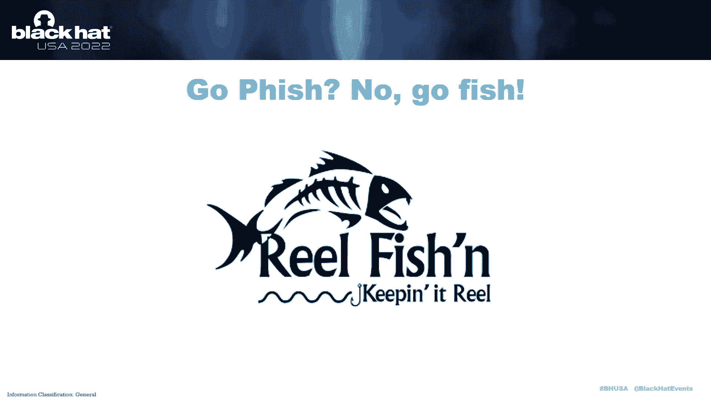

# P55：061 - The Open Threat Hunting Framework： Enabling Organizations to Build, Operat - 坤坤武特 - BV1WK41167dt

谢谢伙计们，谢谢好的，改变计划，直到我们都能就什么是威胁狩猎达成一致，我开玩笑的，我们没有那么多时间，或者对暴力的胃口，非常感谢你们今天来听我们演讲，我是约翰·尼奥，对不起，名人名字，这是骗子。

我不知道你们有没有听说过他和萨米尔，我们之间有几十年的经验，你知道的，威胁搜寻、事件应对和安全，工程和建筑技术在街区周围出现了几次，今天我们想谈谈我们建立和成熟的新方法，威胁猎杀程序。

我将从讲一个关于钓鱼的故事开始，我不是说钓鱼，你可能会听到整个星期，我是说就像真的撕开嘴唇，给我钓条马林鱼，所以我有一个朋友瑞安，莱恩喜欢钓鱼，实际上这个标志出现在他的博客上，真渔网，给他一个关注。

我和瑞安一起去钓鱼，相当多。

事实上，并不是说我特别喜欢钓鱼，还是很好玩，你知道，我所做的，爱情，我喜欢在船上喝酒，所以我让自己有空，我去过瑞安家，瑞安有一大堆渔具，好像他的房子里到处都是，我说瑞安你真的需要这么多东西才能钓到鱼吗。

他的回应是取决于鱼，好吧，我有点走进去了，所以他继续说，给我看他所有不同的诱饵诱饵和钩子，他说每一个都是为了捕捉特定类型的鱼而设计的，这些东西中的每一个都需要一种特殊的技术，然后他真的很兴奋。

他跑过了墙，他给我看了所有这些不同的棒，他就像看到所有这些棒。

取决于我在哪里钓鱼，我可能需要用另一根棍子，所以这对我来说真的很有趣，因为我学到的是环境和鱼在驱动，瑞安在工具和技术上的决定，而不是相反，瑞安最后做出了这样的评论，这真的让我难以忘怀，他就像。

有时我根本不用棍子，因为有时我喜欢用矛钓，他说这有点奇怪，因为有些人不认为真正的钓鱼，但这对他来说无关紧要，只要他玩得开心，所以我从瑞安那里学到的是瑞安的目标不是钓鱼，瑞安的目标是玩得开心。

钓鱼只是他实现目标的方式，钓鱼可以呈现出许多不同的形状，形式或功能，并使用截然不同的工具或方法，我要把这个绑在一起，忍受我，这让我想起了有一次我，我在为一群不同的安全小组做威胁简报。

我顺便提到了一些关于威胁狩猎的事情，不能，意识到我刚刚把燃烧瓶引到了这个电话会议上，它爆发了我只能形容为一场战争，关于什么是或不是威胁狩猎，人们对此感慨万千争论不休，然后突然整个电话都集中在我身上。

他们想让我拿走，他们就像嗯，你的立场是什么，你知道，因为你得到了假设，这里的人你可以免费搜索这里的人，你有，人们认为这里是智力驱动的，他们都包围了我，你们看过侏罗纪世界吗，就像他得到的那样。

他在阻止猛禽，他们都在逼近，我只是站在那里向外看，有点像稍微英俊一点的克里斯·普拉特，别嘲笑那个，这是真的，突然我站了起来，我说你没事，你看，因为为什么我们不能接近威胁狩猎，就像瑞安接近钓鱼。

为什么我们不能让他们各自狩猎队的目标驱动，威胁狩猎的定义是什么，现在这是个人的决定，然后我们就可以停止争论什么是或不是威胁狩猎，专注于真正重要的事情，它们是否有效，你可以利用他们的目标。

所以这对我来说真的很有趣，我对衡量威胁猎杀程序的有效性非常非常好奇，相对于目标和目的，所以我开始像写标题一样写下来，如果你愿意，一个威胁狩猎程序的特征，你通常知道的，哪些可能在这件事上。

这实际上成为框架中的成熟度模型，如果我看着这些东西，这里面有什么东西吗，这将使我能够预测，威胁追捕计划是否有效，所以我有我的东西，我想我需要测试一下，我需要出去，我需要和比我聪明得多的人谈谈。

在游戏中碾压它的人，找出其他威胁狩猎队在做什么，什么是真正有效的，如果我能识别出表现出色的人并识别出他们之间的共同特征，所以我做了最了解我的人对此一点也不震惊，因为我是金毛猎犬，我喜欢交朋友。

所以我花了两年时间伙计们，两年来与各种形状和规模的威胁狩猎队交谈，关于进入他们的过程，他们的人员配置，你知道的，他们如何执行狩猎，他们怎么狩猎的节奏，所有这些不同的事情，并试图识别谁是表现出色的人。

他们显然在粉碎它，根据我的规则，并衡量它们的有效性，我能做到这一点，对我来说非常非常有趣的是，因为高表现者的共同特征是什么，不是花哨的工具吗，不是有博士学位的猎人，这不是任何技术能力，真的。

因为它们变化很大，但这是所有表现出色的人，不管他们知不知道，有明确的长期愿景和使命，和一个高度关注，确保所有的人，过程和技术是为了保持这种威胁而设计的，与这一长期使命保持一致，所以这很有趣。

因为我没想到，现在我们在讨论为什么我喜欢战略管理，以及它如何影响威胁狩猎，因为我看到了其他框架会认为更低的成熟度，威胁猎杀程序，他们使用开源免费工具，但你知道，基于适用于他们的威胁，他们非常有效。

就像他们给组织带来了很多价值，所以我怎么能说他们比另一个狩猎队更低呢，我得去看看他们在哪里有所有花哨的奇幻工具，他们有猎人项目的博士学位，他们有一个巨大的数据湖。

但他们没有花时间来建立一个有效项目的基本组成部分，所以他们遇到了政治问题和获取数据的问题，和袜子做接口，所以他们从来没有真正找到他们的全部潜力，重要的是要注意这还不够，我想确保我对此很清楚。

对于一个程序来说，仅仅写下一个任务或战略是不够的，甚至是梦幻般的目标和目的，一切都是为了执行，所以在原子习惯中，有这么一句名言，它说我们没有上升到我们目标的水平，我们下降到我们系统的水平，这是真的。

即使在这种情况下，另一件对我来说非常非常有趣的事情，我想特别和房间里的高管谈谈，是在我采访猎人的时候，程序中能够充分表达什么的猎人就越多，该项目的长期目标和愿景是，他们就越有可能属于一个表现出色的群体。

所以想想看，就像更多的个人贡献者朝着同一个方向前进，那是奇迹发生的时候，我挑战你创造一些自己的魔法，比如参与你的威胁狩猎计划，开始一个威胁狩猎计划，让你最好的领导负责，无论他们的技术能力如何。

这次我看到的最好的威胁狩猎程序，它是由一个根本没有威胁狩猎经验的女人经营的，在她接手这个项目之前，但你知道她是什么，她是个出色的领导者，她很擅长建立和管理一个团队。

她在建立有效的流程和程序方面绝对是世界级的，当你看到的时候真的很棒，当它发生得很好的时候，所有来自威胁狩猎项目的伟大事情，在那个特定的例子中，通过她的工作，通过她的任务和她的计划。

该组织正在利用威胁搜索作为他们整个安全策略的驱动力，所以他们的威胁猎杀程序的输出涉及到风险和合规等方面，和治理，他们在对数据做出决定，比如什么是有价值的数据，什么是无价的数据。

所以像我们集中的每一点数据都有一美元的数量，通常以某种方式，所以他们正在做出影响预算等事情的决定，或者标识系统之间的依赖关系，比如关键的业务系统，以便输入操作。

所以他们可能会改变他们实际监控组织中最重要的事情的方式，只是为了正常运行时间，因为他们，哦，我没有意识到这个应用程序对某些东西有关键的依赖性，两步之遥很棒，所以有很多事情要做，我看到了不幸发生的事情。

当魔法没有发生，我活过我想喜欢的生活，我在男人之前就有过这样的生活，我不想看起来像，我只是做研究，我不明白现实世界是什么样子，但几年前我有过，我被要求为一个组织发起一个威胁追捕计划，对此直言不讳。

我失败了，我失败了，当时很糟糕，但我为我的失败感到无比自豪，现在我对我的失败是现在，我被赋予了学习和成长的机会，从那个例子中，我可以回头看看为什么我这么容易失败，因为如果你出去。

你看看外面所有关于威胁狩猎的资源，它与一切都有直接冲突，我们发现了大多数威胁狩猎资源在内部所做的第一件事，第一句是，他们定义了，狩猎对读者有什么威胁，我们已经确定了为什么这可能不是最好的主意。

所以当我有这个项目的时候，我发现了一个威胁狩猎的定义，我认为这真的很酷，这就是我想做的，但我没有考虑这是否符合组织的需要，或通缉，我没想过这将如何与安全部门的其他团队合作，所以我把它设置为失败。

只是在大门外面犯了一个关键的错误，因为我在拿别人的观点，并试图将其应用于一个内部组织，第二件事是大多数资源，专注于寻找邪恶的技术执行，这是伟大的，我不是说技术部分不重要，他们显然是。

但我想说的是当最基本的部分没有实现和执行时，技术部分变得极其坚硬，然而，如果你做基础的工作，高冲击，有效的威胁猎杀程序的东西，威胁，变得容易的技术部分，那是容易的部分，因为外面有这么多伟大的工作。

因为你可以利用在那个空间工作的人做得非常好，因为我们需要专注于，你知道的，本末倒置的交易，在我们开始执行之前，我们真的需要考虑构建块，最后，我注意到的另一件事是好的，看起来确实有一些资源在那里。

看起来他们是经过深思熟虑和设计的，它们通常与特定的供应商或技术相关联，或咨询服务，我的意思是，我明白了，就像我们要赚钱一样，但有什么让我烦恼的，那就是，如果我用技术领先，所以我做了一个技术性的决定。

因为我现在出去谷歌一下，我在买一个问题的解决方案，我还不完全明白，现在我投入了这个，就像我们一样，我们要努力创造一个环境，我们要付钱才能玩寻线游戏，我不喜欢那样，所以我想我能做什么，什么能。

我是来帮忙的，所以西蒙·愤世嫉俗有这个，他一直在说这个，但他在书店里说，有一整个部分专门讨论自助，但是没有关于帮助别人的部分，我们真的需要互相帮助，所以我想我能帮上什么忙。

我怎样才能确保每个人都从我的错误中吸取教训，这样就不会再发生了，所以我开始创建一个新的框架，将由社区驱动，供应商，不可知论者，我们可以尝试产生真正的巨大影响，创造一些魔法，所以在这一点上。

我想提到萨米尔，他将真正介绍开放的威胁搜索框架，并讨论模块，关于他的经历，谢谢。约翰，约翰提到的开放框架的发展和他几十年的经验，做威胁狩猎，我是新来的，他带来这里，谁能问所有愚蠢的问题。

每次他都想知道为什么，因为我没有那种经历，我做安保，我做过应用程序开发，所以威胁狩猎对我来说也是一件新鲜事，当我学习的时候，我一直在问这些问题，为什么为什么为什么所以这让人很生气，我的兴趣越来越大。

当我试图把所有这些威胁狩猎的元素联系起来的时候，为了一个他开始构建的框架，回到我的问题上，当我为一个制造组织领导一个OT安全项目时，我们有一个经典的问题，关于你有哪些数据，我不知道你需要什么。

所有这些问题总是给我带来一些瓶颈，获得自动检测，为操作技术环境而设置，并使从运营中获得购买变得更加困难，总是挣扎，我们都知道，所以当我们开始研究这个的时候，其中有几个元素非常有趣，并击中了它，命中。

它头上的钉子，我不会把这里的所有模块都看完，但我们已经讨论过一些基本模块，这是构建良好的线程搜索程序的基础，比如说，你需要有一个目标的基础部分，为您的组织工作，但把它提升到一个新的水平，你需要一个组织。

当我们谈论组织时，这不仅仅是组织结构的问题，这是关于你需要放置的技能，你需要有正确的技能，对于您将要进行的正确类型的威胁狩猎，你需要网络专业知识，您需要端点专业知识，所以你需要正确的平衡。

如果一个人是新的威胁狩猎，或者是想尝试把威胁狩猎作为职业选择的人，你需要有一些方法或指导，在那里你可以找到什么技能，我需要获得，这正是结构击出本垒打的地方，因为技能矩阵基本上给了你这个，有几件事。

我提到的几个模块，对我来说很重要，要理解并与我的经历有关，其中一个就像是准备，当我们谈论安全时，我们是在做数据业务，对呀，所以我们一直在做数据分析，我们提到了数据湖，我们谈到了数据分析。

但是如果你没有数据，良好的数据，可靠数据，您的输出将是，垃圾进垃圾出，您需要处理数据字典数据，数据湖，清洁数据湖，可靠的数据湖能够驱动一个良好的威胁狩猎程序，前进实验室环境，我们有一些脚本。

我们已经启动了一个威胁搜索框架，这将为您提供托管在Prem或云环境中的实验室，所以我们希望我们能共同改进这一点，该框架的重要部分和核心是操作模块，这是一个需要解决的又大又复杂的问题。

我们要确保我们把它分解成更小的，可管理块，它到底在识别什么，你识别出威胁，你不去开始谷歌，你到底需要找到什么，并从技术的角度开始威胁，确定你想解决什么问题，哪些威胁适用于您的环境。

哪些威胁适用于您的组织，零售和金融不会有同样的威胁适用于你，所以一定要从一千个选择中筛选出来，让它集中在十五和二十，你需要把TTPS拿出来，根据你从你确定的威胁中获得的信息，确保你优先考虑它们。

创建积压工作，我试着去做一些项目管理方面的工作，我们对此评价很高，你得有条理，你必须能够适当地安排它，你必须把你的技能分配给合适的人，在正确的时间，您需要了解组织依赖关系，相互依存关系，当金融关闭时。

你能做什么，我们从控制系统的角度，转机，一切都好，所以这是至关重要的，一旦你这样做了，一旦你确定了这些基本知识，你可以安排并完成这些技术搜索测量通信，我们已经谈过了，基本上，你需要能够衡量你的成功。

并传达你的成功，除非你那样做，你没有你的组织，相信你资助你继续追捕威胁，前进，成熟是我们试图提供矩阵的地方，我们将，如果你想有一个目标，你想提高你的成熟度，你怎么去那里，你需要添加什么重要的部分。

来自我的最后一个节点是持续改进，我们必须把这件事做好，我们必须改进，我们必须提高效率，我想强调的是我们作为一个团体，我们需要改进我们的框架，所以带我们经历社区改善的下一个阶段，以及未来的框架。

尼尔会带我们过去的，所有的权利，所以我的意思是，这是相当简单的，这只是个开始，什么时候，当我开始威胁狩猎，我大约八年前开始的，出去寻找可用的信息，你是这样开始的，这里是你应该去看看的地方。

这里有一些假设，你应该去测试，这真的很难，正如约翰前面提到的，当你找到东西的时候，它们通常像三四页的PDF文件，你知道里面的一些信息，但它是特定于此的，就是如何在这个产品中搜索那个东西。

所以这变得非常令人沮丧，就在我想的地方，我怎么才能做得更好，如果我找不到任何信息，所以当我继续，你知道，在不同的组织中狩猎和狩猎，我当时的角色是进入世界上一些最大的组织，在它们的环境中狩猎。

或者评估他们的威胁狩猎计划，我会走进去一遍又一遍地看到不同的东西，我会说，哦，那真的很酷，更多的人应该这么做，但没人写下来，把它放到网上，所以当我在寻找威胁的旅程中到达一个点时，是啊，是啊。

听起来像个嬉皮士，当我到了我威胁旅程的重点，我觉得我有足够的信息从我的狩猎经验中收集到，我开始谈论世界各地的所有这些组织，我觉得你应该这样做而不仅仅是那样，但我想当你发现这些东西时，你应该这么做。

我试着把它写下来，事项，到目前为止，他们还不是最性感的部分，但是能够分享你所拥有的对其他组织来说是非常有价值的，我们这个行业经常有一个，就像我们在任何时候，我会被发现的，他们会知道我不属于这个舞台。

他们现在就来抓我，就像这样，但现实是，有些事情你知道，这可能会阻止另一个组织经历，宣布的事件或经核实的违约行为，你所要做的就是分享，不管是以白皮书的形式，或以会议谈话的形式，或，你知道吗。

把这个框架放在一起，对呀，当约翰走近我时，他说嘿，我开始做这件事，我想拉你们几个进来，我们将以编程的方式写下所有这些东西，我们如何推进威胁追捕计划，从你如何配备它，你应该列出哪些工作描述。

如果你在找员工，你知道的，甚至只雇佣一个威胁猎人，对呀，那个人应该具备哪些技能，如果你在你的袜子或证书团队中寻找，那些有技能的人在哪里，技术在您的组织范围内，你在哪里错过了能见度，没有那些东西。

你知道吗，你再次变得难以置信的沮丧，所以是时候把我们的钱，我们的嘴在哪里，把东西写下来，所以当我们在这里做完的时候，就像好的一样，当我们做完，我去看下一张幻灯片，您将看到GitHub的链接。

威胁搜索框架和其中的信息清楚地驻留在那里，我们不只是给你看屏幕上的文本图片，因为那很荒谬，哦，等一下等一下，屏幕上有文字，但威利·旺奇也在那里，但它大约有一百页，我们收集到的建议。

在我们共同拥有的20年的威胁狩猎经验中，只是说这对我们来说是有效的，这就是我们摔倒的地方，这是你应该去的地方，如果你想，你知道吗，改进你的程序，我们需要你的帮助，对呀，这应该是而且是社区驱动的。

它不是卖主的东西，发布一份四页的PDF，这样他们就可以在世博会上出售一些产品，可能就在我们下面，对呀，就是现在，是啊，是啊，现在正在发生，人们在外面说，就像，哦，让你的威胁，匈奴人，不对，像这样。

你知道的，比如找到帮助您找到更多可操作数据的技术，这样你的狩猎就更成功了，那些技术是什么，我不知道，好吧，好吧，让我们把它写下来，并与告诉我们你成功的人分享，与我们分享你的成功。

所以我们可以建立这个框架，把它做得更大，让它对每个人都更好，是的，这应该是，也将是一个持续的进化，对呀，我们要，这份文件将是一个活生生的东西，就像人们说的，是的，但这对我更有效，这对我更有效，还有哦。

在你们开发的技能矩阵中，你缺少了几项技能，你为什么不把这些东西也扔进去，只会越来越好，接下来你知道，后面说的组织或人，我不知道如何启动威胁追捕程序，或者我不知道如何向管理层展示价值。

这样我就可以雇佣合适的人，或者把适当的时间放在后面，所以所以请帮帮我们，这是供应商不可知论的，这背后又没有特定的供应商，这是一件让我们走错了路的事情，所以他说每样东西都有一些产品。

为什么人们不只是分享建议，而不是试图把什么塞进你的喉咙里，话虽如此，如果你有一种适合你的技术，你就像它是这样工作的，或者对于这些用例，我发现这个特殊的平台在这方面更好或更成功，比其他这些。

让我们把它也放进去，然后当然告诉我们我们错过了什么，我们绝不是，的，你知道的，最后都是威胁狩猎，我们有很多经验，我们加入了世界上一些最大的组织，一些你知道的最著名的组织和政府，你知道，看了看。

评估了他们的项目，我们只是想分享我们学到的东西，但请与我们分享，我们想向你学习，现在我们希望至少给你一个开始的地方，在哪里，也许以前你喜欢，是啊，是啊，我有一些事情要分享，但我不知道该把它放在哪里。

我也不会去建什么网站或者再写一份白皮书，或者做什么，如果你有三段你认为你可以分享，或者你知道一百二十个字符，比如，与我们分享，对呀，所以所以请分享你的经验，分享对你有效的东西，分享不起作用的东西。

因为有时候那更有价值，有了它，你就可以得到它了，希望我想我救了它，我想这是公开的，但如果不给我五分钟，我就去做，但我很确定我做得很好，把这个包起来，嗯，所以非常感谢你们，我是说，我真的很感激。

我希望这是有意义的，我希望我们能得到每个人的帮助，你知道，让这个更好，因为你知道人类的魔力，所以让我们开始一起工作，谢谢谢谢。

