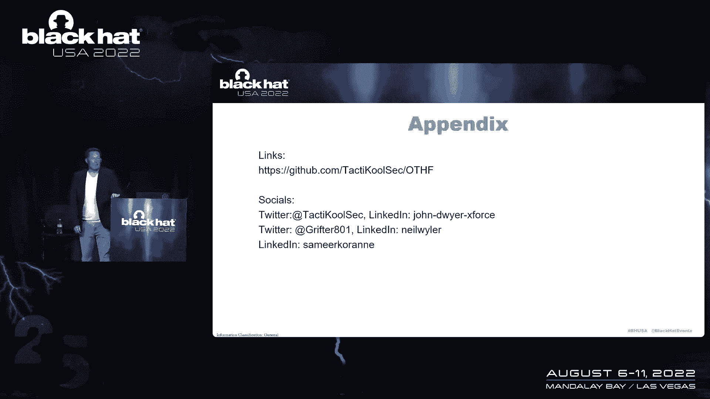

# 课程 P55：061 - 开放威胁狩猎框架：赋能组织构建与运营 🎯

在本节课中，我们将学习一种全新的、以目标为导向的威胁狩猎方法。我们将探讨如何构建一个有效的威胁狩猎项目，其核心不在于使用何种工具或技术，而在于项目是否拥有清晰的长期愿景，以及所有资源是否都服务于这一使命。我们将介绍一个由社区驱动的、供应商中立的“开放威胁狩猎框架”，它旨在帮助组织避免常见陷阱，建立真正高效且能持续创造价值的狩猎能力。

---

## 从钓鱼故事到威胁狩猎的启示 🎣

上一节我们提到了一个有趣的类比。让我们从一个关于钓鱼的故事开始。

我和朋友瑞安一起去钓鱼。瑞安拥有大量的渔具，包括各种鱼饵、鱼钩和鱼竿。

他向我解释，每一种工具都是为了捕捉特定类型的鱼而设计的，并且需要特定的技术。他甚至提到，有时他根本不用鱼竿，而是用鱼叉捕鱼，并认为只要过程有趣，这就是钓鱼。

我从瑞安身上学到的是：**他的目标不是“钓鱼”本身，而是“获得乐趣”**。钓鱼只是他实现目标的方式，它可以呈现出多种形态，并使用截然不同的工具或方法。

这让我联想到一次为安全团队做威胁简报的经历。当我提到“威胁狩猎”时，引发了一场关于“什么才是真正的威胁狩猎”的激烈争论。

我突然想到：**为什么我们不能像瑞安对待钓鱼一样对待威胁狩猎？** 为什么不能让每个狩猎团队的目标来驱动“威胁狩猎”的定义？这样，我们就可以停止争论定义，转而专注于真正重要的事情：**项目是否有效**，以及它们是否实现了既定目标。

---

## 高效威胁狩猎项目的共同特征 ✨

上一节我们提出了以目标定义狩猎的观点。本节中，我们来看看如何衡量一个威胁狩猎项目的有效性。

我对衡量威胁狩猎项目相对于其目标的有效性非常好奇。因此，我开始尝试总结一个高效威胁狩猎项目的特征，这后来成为了框架中的成熟度模型。

为了验证这些想法，我花费了两年时间，与各种规模和形态的威胁狩猎团队交流，了解他们的流程、人员配置、执行方式和节奏，试图识别出那些表现出色的团队。

一个非常有趣的发现是：**所有高绩效团队的共同特征，并非 fancy 的工具、拥有博士学位的猎人，或任何特定的技术能力**。这些因素差异很大。

真正的共同点是：**无论他们是否意识到，所有高绩效团队都拥有明确的长期愿景和使命，并且高度专注于确保所有人员、流程和技术都旨在维护这一长期使命**。

这很有趣，因为我最初并未预料到这一点。这引出了战略管理及其对威胁狩猎的影响。

我看到一些使用开源免费工具的团队，基于适用于他们的威胁模型，表现得非常有效，为组织带来了巨大价值。我无法说他们比另一个拥有 fancy 工具、博士团队和庞大数据湖，却因政治、数据访问或跨团队协作问题而从未发挥全部潜力的团队“更低级”。

**仅仅写下使命或战略，甚至制定出色的目标，都是不够的。一切都关乎执行。**

在《原子习惯》一书中有一句名言：“我们没有达到我们目标的水平，而是落到了我们系统的水平。” 这在威胁狩猎项目中同样适用。

另一个有趣的发现是：在我采访的猎人当中，**能够充分阐述项目长期目标和愿景的猎人越多，他们所属的团队就越可能是一个高绩效群体**。更多的个人贡献者朝着同一方向努力，奇迹就会发生。

我挑战各位创造自己的魔法：参与或启动一个威胁狩猎项目，并让你最好的领导者来负责——无论他们的技术能力如何。我见过最好的威胁狩猎项目是由一位在接手前毫无威胁狩猎经验的女性领导的。她是一位出色的领导者，擅长建立和管理团队，在建立有效的流程和程序方面是世界级的。

当一切运转良好时，威胁狩猎项目的输出可以驱动整个安全策略。其输出可以影响风险与合规、治理、数据价值评估、预算决策，以及识别关键业务系统间的依赖关系以改进运维监控。

---

## 失败教训与框架的诞生 🧱

上一节我们看到了成功项目的特征。本节中，我们来看看一个失败的案例，以及它如何催生了新的框架。

不幸的是，我也经历过魔法没有发生的时刻。几年前，我曾被要求为一个组织启动一个威胁狩猎项目。坦率地说，我失败了。

但我为这次失败感到自豪，因为它给了我学习和成长的机会。回顾过去，我很容易看出失败的原因。

如果你查看外部大多数关于威胁狩猎的资源，你会发现一个根本冲突：**这些资源做的第一件事，就是为读者定义“什么是威胁狩猎”**。我们已经讨论过，这可能不是最好的方法。

当我启动那个项目时，我找到了一个自认为很酷的威胁狩猎定义，并想据此实施。但我没有考虑这是否符合组织的需求，也没有思考它将如何与安全部门其他团队协作。这导致我在起点就犯了关键错误。

其次，大多数资源**专注于寻找“邪恶”的技术执行**。这固然重要，但如果最基本的部分（如目标、流程、协作）没有到位和执行，技术部分会变得极其困难。然而，如果你做好了基础工作，高影响力、有效的威胁狩猎的技术部分反而会变得容易，因为外界已有大量优秀的工作可供借鉴。

最后，我注意到，确实存在一些经过深思熟虑的资源，但它们通常与特定的供应商、技术或咨询服务相关联。这带来一个问题：**如果以技术为先导，就意味着我在购买一个自己尚未完全理解的问题的解决方案**。这可能导致我们投入资源只是为了“玩这个狩猎游戏”，而不是解决实际问题。

我想提供帮助。正如西蒙·斯涅克所说，书店里有整个“自助”专区，却没有“帮助他人”的专区。我们需要互相帮助。

因此，我开始思考如何确保每个人都能从我的错误中吸取教训。这促使我开始创建一个**由社区驱动、供应商中立的新框架**，以期产生真正巨大的影响，创造一些“魔法”。

---

## 开放威胁狩猎框架介绍 🗺️

上一节我们了解了创建新框架的动机。现在，让我们正式介绍这个“开放威胁狩猎框架”。

该框架的发展源于数十年的威胁狩猎经验，以及一个“新手”不断提出的“为什么”的问题。正是这些关于如何将所有威胁狩猎元素联系起来的根本性问题，推动了框架的构建。

当我们为一个制造组织领导OT安全项目时，遇到了经典问题：“你有什么数据？”、“我不知道你需要什么？”。这总是导致在获取数据、设置自动检测以及获得运营团队支持方面遇到瓶颈。

该框架中的几个核心元素直接击中了这些痛点的要害。以下是构建良好威胁狩猎项目的基础模块：

*   **目标与组织**：你需要有适合组织的目标基础，并将其提升到新高度。这不仅仅是组织结构，更是关于配备正确的技能组合（如网络专业知识、端点专业知识）。框架中的技能矩阵为此提供了指导。
*   **数据准备**：安全是数据业务。没有良好、可靠的数据，就是“垃圾进，垃圾出”。你需要处理数据字典、构建清洁可靠的数据湖来驱动良好的威胁狩猎程序。框架也提供了实验室环境脚本。
*   **运营模块**：这是需要解决的一个又大又复杂的问题。框架将其分解为更小、可管理的部分：
    *   **威胁识别**：确定需要解决什么问题，哪些威胁适用于你的环境（例如，零售和金融面临的威胁不同）。从上千个选择中筛选出15-20个重点。
    *   **TTPs与优先级**：根据识别的威胁提取TTPs，确定优先级，创建任务清单。
    *   **项目管理**：有条理地安排任务，在正确的时间将任务分配给具备合适技能的人。
    *   **组织依赖**：理解组织内外的相互依赖关系（例如，财务系统关闭时的影响）。
*   **测量与沟通**：你需要能够衡量成功并传达成功。否则，组织不会相信你、资助你并支持你继续前进。
*   **成熟度**：框架提供矩阵，帮助你了解如果希望提升成熟度，需要添加哪些关键部分。
*   **持续改进**：我们必须做好这件事，必须不断改进和提高效率。

**框架的核心精神是社区共同改进**。我们需要每个人的帮助来完善它。

---

## 社区驱动与持续进化 🤝

上一节我们介绍了框架的模块。本节中，我们强调该框架的社区属性和进化本质。

当我八年前开始威胁狩猎时，寻找可用信息非常困难。找到的资源通常是三四页的PDF，内容特定于某个产品或场景，这令人沮丧。

在我进入全球各大组织进行狩猎或评估其项目的经历中，我一次又一次地看到很酷的做法，但没有人把它们写下来分享到网上。

我们这个行业经常有一种“冒名顶替综合征”，害怕分享。但现实是，**你所知道的一些事情，可能会阻止另一个组织经历严重的安全事件**。你所要做的就是分享——无论是通过白皮书、会议演讲，还是贡献到这个框架中。

当约翰找到我，提议以编程方式写下所有这些关于如何推进威胁狩猎项目的经验时，我非常赞同。这包括如何配备人员、编写职位描述、识别组织内已有的技能，以及发现可见性缺口。

**是时候“把钱花在刀刃上”，把东西写下来了。**

这个框架的信息清晰地存放在GitHub上。它不仅仅是屏幕上的文字图片，而是我们基于20年共同经验收集的、约一百页的建议。它告诉你：“这对我们有效”、“这是我们跌倒的地方”、“如果你想改进你的程序，你应该去这里”。

**这个框架应该是且将是社区驱动的。它不是供应商用来推销产品的四页PDF。** 它是供应商中立的。

如果某种技术对你有效，或者对于特定用例，你发现某个平台比其他更好，请把它也放进去。当然，也请告诉我们我们错过了什么。

我们绝不是威胁狩猎的终极权威。我们拥有很多经验，评估过许多著名组织和政府的项目，我们只是想分享所学。**但我们更想向你学习。**

我们希望你至少有一个起点。如果你有三段话、一百二十个字符的经验可以分享，请与我们分享。分享对你有效的东西，分享无效的东西（有时这更有价值）。

这份文件将是一个“活”的文档，随着社区的贡献而不断进化。希望下一个不知道如何启动威胁狩猎项目、或如何向管理层展示价值以获取资源的人，能够从这里找到答案。

**所以，请帮助我们，分享你的经验。让我们开始一起工作，创造人类的魔力。**

---

## 总结 📝

在本节课中，我们一起学习了一种以目标为核心的全新威胁狩猎理念。我们认识到，高效威胁狩猎项目的关键不在于工具或技术的先进性，而在于拥有清晰的长期愿景，并使所有元素与之对齐。

我们回顾了从失败中汲取的教训，并由此引出了**开放威胁狩猎框架**。该框架涵盖了从目标设定、组织与技能、数据准备、运营执行到测量沟通、成熟度提升和持续改进的全流程。

最重要的是，这是一个**由社区驱动、供应商中立、持续进化**的框架。它的成功依赖于每一位安全从业者的分享与贡献。只有通过集体的智慧与协作，我们才能帮助更多组织建立真正有效、能持续创造价值的威胁狩猎能力，从而提升整个行业的安全水位。

**让我们停止争论定义，开始专注创造价值，并彼此分享，共同成长。**