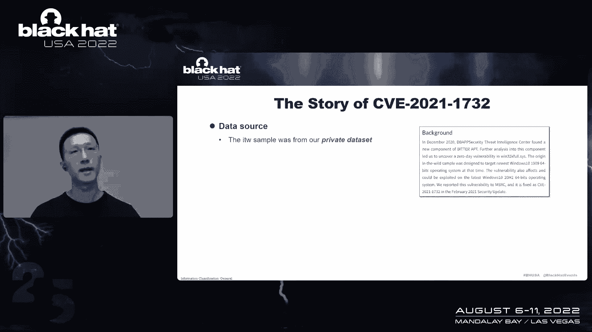

# P56：062 - The Journey of Hunting In-the-Wild Windows LPE 0day - 坤坤武特 - BV1WK41167dt

现在我很高兴欢迎在线Kujin，大家好，今天很荣幸能在黑帽美国22周年大会上发言，我会在狂野之窗分享一些经验和见解。

白天打猎，我先自我介绍一下，我叫关静，你也可以叫我卢卡斯，目前和劳埃德在DP安全，我的兴趣是脆弱性研究，在野外真正的日间狩猎之前，我在蓝调头，上海二十九和B二十一明白，让我们进入正题，1。

这是我今天的主要议程，让我先解释一下为什么我们决定在野外的窗户里打猎lp 0日，为什么我们认为这是可能的，你可以在图片中看到从2017年到2021年，微软在狂野的Windows LP中披露了总共28个。

有几天，大部分是Windows内核，当CLI，这些漏洞经常被顶级组使用，并可能对安全供应商造成巨大伤害抓住这样一个零日是非常具有挑战性的，从2020年开始，我们开始考虑在野外的窗户里抓到一个，LP零日。

有可能在野窗LP零日流行起来吗，为了回答这个问题，我们应该考虑另外两个问题，第一，如何获得有价值的数据集，这些数据集可能会有他们的日子，第二，如何为第一个问题开发有效的检测方法，我们有一些私人数据集。

此外，历史案例显示病毒总等公共平台可能有零日，因此，使用私人和公共数据集，我们可以解决第一个问题，第二个问题，有两种方法可以从数以百万计的样本中捕捉到零日，动态检测是指在沙箱或真实环境中执行。

通过异常行为捡到样本，比如防病毒和沙箱，静态检测是指将样品与静态性质相匹配，比如雅拉和第一男高音，有优点也有缺点，我们在力所能及的范围内尝试了这两个庄园，根据结果，我们认为状态检测最适合我们。

我们稍后会详细说明这个过程，我来解释一下为什么我们要花很多时间在野外研究历史，几天的lps，那么我们为什么要向他学习呢，有三个原因，第一名，有些战术随着时间的推移是一致的，第二。

从攻击者的角度同步可以让我们更好地防御，社区仔细研究了第三个历史案例，为了从他的故事中吸取教训，我们已经研究了50多张光盘，几乎都在狂野的窗户里，LP，有几天，有一天，从2014年到2021年。

我们使用组织类型仔细统计了发现的供应商，周期，初次披露，文章，公共分析块，公众爆炸，原来的样品是有的，和这里的一些其他信息，我想集中谈几个要点，第一部分是使用场景。

样品是作为独立组件还是作为链条的一部分使用，以及爆炸是否以无火形式使用，或者只是被困在火灾中，这些信息将直接影响我们选择不同的检测方法，下一点是针对许多窗口的系统，LP样品将在使用前检查我们的版本。

并且只能在某个特定的版本中触发或爆炸，此信息在制作沙箱或复制环境时很有用，接下来是漏洞模型，通过计算历史样本的脆弱性模型，我们可以得出哪个组件是最有针对性的，哪个攻击面最受攻击者青睐，你一个特定的时间。

这些信息在，我们在预测最有可能的弱点，比如说漏洞类型，通过计算历史脆弱性的类型，我们可以推断，哪种类型的漏洞是攻击者最喜欢的，这些信息可以帮助我们配置复制环境，比如说，是否需要配置驱动程序验证。

这些信息还可以显示不同漏洞类型的流行程度，接下来是技术，我认为这是最重要的信息，我们不能探索技术，或者在狂野的窗户里，lp零天，从20点40分到21点21分，根据统计数据，2。

我们得出了一些有价值的结论，比如说，B服务器端窗口时钟Manser从2015年到2016年很受欢迎，以及利用以前的模式实现任意地址的方法，自二十八年以来，读和写变得越来越流行。

我们还发现使用Edge和验证句柄读取的方法，内核信息在过去五年中很流行，下一点是公共分析块和爆炸，公共封锁和爆炸，可以把整个社区的研究成果，吸收这些现有的知识就像站在肩膀上，其中对我们很有帮助。

最后原样高，我们也非常注意收集每个历史窗口的原始样本，LP零日，这些原始样本的爆炸是第一手信息，如果我们能探测到它们，我们以后也可以捕捉到类似的样本，除了从他的故事中学习。

我们还应该从最新的漏洞中吸取教训，探索技术，原因如下，第一名，新披露的漏洞可能有第二个差异，一种新的有针对性的模式将被整个社区快速订购，第三名，Talker在使用中或等待使用时可能有一些类似的漏洞。

第四名，一种新的爆炸技术往往被目标人物使用，我将描述我们如何比较不同的检测方法，并从，据我们所知，有三种可选的方法我们可以在狂野的窗口中抓住，lp杀毒软件之类的，沙箱之类的，Yara或类似的东西。

防病毒是最强大的工具，那些家伙在野外造成了一些，谁知道过去几年用杀毒软件的LP零天，抗病毒药物的优势在于它被部署在大规模的现实世界环境中，它还可以实时检测街道，并有机会提取加密权限升级组件，然而。

不是每个供应商和变量都能像那家伙一样好，防病毒也可能被绕过或检测到，这增加了，开发一种基于抗病毒的狩猎方法的困难，沙箱是另一种野外狩猎工具，零日，2。我有过一些成功的经验，你在沙箱的帮助下狩猎的一天。

有趣的听众可以参考我以前在上海关于蓝色的演讲，不像防病毒，沙箱环境高度可控，可自由配置，此外，基于沙箱行为的检测使其具有准确性，你好啊，我想沙箱不适合用那些LP打猎，有几天，不像所有的东西。

许多LP爆炸总是进行版本检查，以避免意外的BO D，这使得它们更难沙箱，你可能认为我们可以通过制造更多的环境来解决这个问题，但每天新的PE样本数量巨大。

每个样本被交付到一个新的环境意味着巨大的资源重叠开销，不是每个供应商都有足够的资金来支持这一点，此外，基于沙箱的检测方法还有Windows LP样本的其他缺点，有些样品需要金字塔。

但是沙箱默认情况下不能提供有效的付款，二号，有些样品与BO D有关，没有后续行为，很难察觉，第三名，在沙箱开发和部署之间有一个循环，几乎没有丢失，最新爆炸的最佳探测周期。

Yara是另一种在野生窗口LP旋转中狩猎的方法，它被广泛用于恶意软件狩猎Yarra几乎没有技术壁垒，不怕各种检查，在开发和部署方面具有灵活性，当一种新的爆炸技术出现时，我们可以快速地将其转换成文字。

并将其输入检测系统，最后，它比防病毒和沙箱的成本更低，但它也应该有一些缺点，例如它很容易导致假阳性和假阴性，因此，如果我们用A在野外的窗户里狩猎，LP零日，我们需要非常熟悉历史案例，我们以前也这样做过。

在上面，我们比较了三种狩猎方法，我们最终选择了雅拉作为我们的男人猎人，因为它更容易，Windows更灵活、更便宜，LP零日狩猎，我们选择Yara的另一个原因是在写了一些Yara字后。

我们回测了一些历史窗户LP样本，令我们惊讶的是，Yara的表现好于预期，我将描述如何将学习经验传递给年轻人，基本上我们有三个原则，第一个原则是根据开发的每个阶段的签名写文字，通常。

Windows内核LP爆炸有以下阶段，控制流劫持，特权升级，我们的任务是根据每个州的共同特征制定规则，下面是内核信息泄漏的两个示例，这个想法是与普通窗口匹配，内核信息叶技术，包括，但不限于此。

对于任意地址，读写原语，这个想法是针对以下几点进行匹配，需要注意的是，上面的想法，以上只是一些可能的想法，不是所有的想法都适合你的话，有些想法会导致很多假阳性，第二原理写诗最新爆炸技术，这里。

我举了两个例子，在2020年7月，保罗·菲尔创造了NEA新溢出技术的BA，在STIC 220研究论文会议上，我们意识到任意地址读取的方法，借助页杆中的管道贡品是通用的，将来可能会用到。

所以我们花一些时间为这种技术写一些错误词，后来发现这些词叫做一些高价值的样本，在221年6月28日，第一个人写了一个博客，在文章中提到的那天，在野窗LP中披露了这一点。

又名2021年7月和8月的一个W F，NCC集团的亚历克斯·布莱克发表了两个街区，破坏CV221的爆炸技术，三个，一个，九，五六并解释使用WMF构造任意地址的方法，读写Prives，同时，是的。

还写了一个博客，浅谈利用脆弱性的方法，在WF研究这些块的帮助下，我们意识到答案是普遍的，我们再次花了一些时间在这个技术上写了一些YARA规则，正如预期的那样，我们确实捕到了一些高价值的样本。

第三个原则是对的，最有可能的漏洞的规则，我在这里也举了一个例子，呃2021年4月13日，第一个家伙是一个博客，并透露，简历披露cve 21 21 2 8 3 1 0。

这是在桌面窗口管理器的狂野零日中获得的，不到一个月后，戴发表了另一篇博客，披露另一个漏洞，简历二十一二六九零零，这也是桌面Windows管理器中的一个漏洞，这让我们意识到。

这种类型的漏洞将来可能会再次出现，所以我们在我们的，几周后，正确的规则是在宽窗户里抓住一个的第一步，LP零日，我们需要建立一个完整的系统，但这里有一些问题，第一个问题是当x加载与动词匹配时。

如何及时通知我们，如果我们的年轻女孩在各种总数上奔跑，您可以使用病毒总搜索页面上的通知机制，当匹配新样本时，我们可以配置通过电子邮件通知的项目，我们的电子邮件将立即收到一个假期，为我们运行自己的产品。

我们建立了一个类似于会议的界面，第二个问题是当我们得到一个漏洞，如何快速复制和分类，我们计算了每个历史样本的目标美国版本，通过研究历史案例，此信息可在此使用，此外，考虑到我们狩猎的可能有一天。

一天或零天，我们需要把这三种类型的环境，我们需要随着时间的推移更新这些环境，为了最大限度地减少繁殖时间，我们制作了一个新版本的Windows，第三个问题是我们应该掌握哪些技能来调试不同的nolp爆炸。

让我在这里给那些分析过Windows内核溢出的人举一个例子，脆弱性，Windows内核调试和驱动程序验证是两个基本技能，除了那些分析过EW和脆弱性的人，使用Windows调试是必要的，远程调试。

因为直接附加DWM进程，将导致系统UI无响应，我们的经验越多，我们就会越好地回答这个问题，没有任何方法可以使我们的系统更精确，我们进行了以下测试和改进，第一，使用收集的历史窗口LP零的寺庙来测试规则。

第二个利用公园和爆炸来测试规则，第三，在一些情况下，公共公园和爆炸无法收集，尝试编写公园和爆炸并测试，第四名，将规则应用于大量样本进行压力测试，第五名继续将最新的爆炸技术转化为文字并测试规则。

系统部署一年后，我们造成了很多Windows LP漏洞，在下一部分我们将分享一些，我们将分享三个被我们的系统伤害的案例，在Windows 1 32卡洛斯子系统中的野外LP零日，在野外，呃。

在Windows桌面窗口管理器中的野生LP零日，在野生LP中有一天在Windows公共日志文件系统中，让我们看看，让我们来看看2020年12月的第一个漏洞，在十二月二十日，我们在狂野之窗抓住了第一个。

零日微软签署CD。

内心世界样本来自我们的私人数据集，我们注意到它是因为它使用edge和validate句柄来读取内核信息，这是Windows内核LP EXPO的一个强烈签名，进一步的分析表明，样品爆炸了一种类型混乱。

一三二核模型中的零天，值得一提的是，单词中的样本被用作独立的组件，使用样品时，您需要提供一个pip作为参数，这个皮指，需要激活的过程，目标进程将首先终止，然后我们从系统特权开始，如果直接运行此示例。

它也会升级为某些特权，但它将在没有任何可见行为的情况下存在，这里有一些亮点，在单词样本一中，它瞄准了当时最新版本的Windows10操作系统，它完全使用该菜单栏来构建任意地址，在当时是新奇的。

在爆炸Web示例之前，检测到特定的抗病毒药物并执行系统版本，检查关于这一天的其余细节，可以参考我们的博客，或者整个社区写的许多其他块，现在，让我们在22年5月切换到第二个漏洞，二十一。

我们在狂野的窗户里抓住了第二个，LP微软签署CB 21的那一天，正如我在构建中提到的，右边的部分，我们会定期预测最有可能的漏洞，和5月20日左右的正确规则，我们为DWAND漏洞写了一些规则。

但我们可以去约会，我们在5月22日捕捉到了一个不熟悉的DWM样本，法泽尔分析显示有一天爆炸，在另一个瘟疫的零日，当我们第一次遇到阻尼器，我们不知道它像往常一样是用发布IO代码编译的。

我们将在一个完整的补丁环境中生产它，再现的结果清楚地表明这个中心有一个零日，这是一个UAF在DW和调用，然后我们在GitHub上跟踪了这个相关的源代码，这是一个CV 21228的爆炸。

单词样本中的六八刚刚替换了Sharecall部分，那时我们有点困惑，一天的样本怎么会包含零天，仔细确认后，我们得出结论，奥斯特不小心引入了一种新的虫子，在为cb 21226编写x节点时，八，六八。

如果是这样，作者就使用它，这个零日不能归类为野外的零日，所以我们试着告诉MSI这不是严格意义上的野外日，这是MSC最终发布的低状态，所以这真的是一个有趣的案例，让我来谈谈这个漏洞模式。

此漏洞是由引用计数不平衡引起的，在WM CO中的中断跟踪器绑定管理器对象上，触发此漏洞的步骤是第一位的，通过管理器Marresults二号使用状态交互跟踪器，创建状态交互跟踪器，大理石资源三号。

绑定步骤一创建的资源是步骤二创建的资源的两倍，正如你在图片中看到的，并且不要在正常情况下手动发布此结果，状态中断跟踪管理器，管理器绑定管理器将两次调用进程状态trbinding模式来添加。

将引用计数相加2，然后代码将调用删除跟踪器绑定两次到子引用来两次，并正常释放状态中断跟踪器带管理器，情景研究，c的引用计数，交互跟踪器绑定管理器的趋势将不同于正常情况，但是对您的调用进程来说。

跟踪器绑定模式，他们想把反向计数加2，但是，代码仍然会调用删除跟踪器绑定两次，子数2，在第一次删除跟踪器绑定调用中，交互跟踪器绑定管理器上的引用计数将减少到零。

那么说交互跟踪器绑定管理器将在内部发布功能中免费，在第二个删除跟踪器绑定代码中，当它试图从释放的对象获取一些数据时，接下来就会造成无人机，让我们在2021年10月看到第三个漏洞，有一天。

我们在宽窗户里发现了一个新的常见的原木消防系统，样本来自各种总数，正如我在构建中提到的，右边的部分，我们会定期为最新的开发技术写单词，在2010年10月15日，我们为pipe属性编写的规则，它采样器。

样品被用作独立组件，进一步的测试显示，该示例利用了一个漏洞，影响所有支持的Windows版本，这是常见日志文件系统模型中的类型混淆漏洞，由于缺乏一些信息，我们无法确定此漏洞的相同数量，这可能是其中之一。

也可能不是根本原因，有一天是CFS模型，就像客户端上下文中的一些曲目，攻击者可以利用这一点，在Word sample中提供一个无效的客户端上下文，利用这个，创建set的第一个客户端上下文。

指向在BF I中设置的第二个容器上下文，然后它使用闪存心理数据中的一个位翻转来改变第二个容器，和文本偏移量一一三a零到一b，一个零翻转3到B使容器上下文偏移，指向一个假的stlfs容器对象。

借助假CS和CFS容器对象，爆炸劫持虚拟方法，停留LFS容器，释放和CS容器删除并在此基础上构建一个实际地址红色原语，cfs容器的普通虚函数表如下所示，正如您所看到的释放和删除功能。

被劫持的虚拟函数表如下，除了这个，在手表样本中建立了一个实际地址读取原语，使用scoop windows tempo中描述的pipe属性方法，为了获取管道属性的地址，使用另一种公共方法爆炸。

IT查询系统大信息，它查询系统信息，将管道属性对象的地址与内核任意地址链接，读写原语，爆炸成功扫过当前进程的令牌，使用系统令牌，并使用系统特权共享，让我们来看看微软是如何修复这个漏洞的。

他们只跟踪客户端上下文的价值，以确保它不能少于一三，如果我们构建一个大于此值的客户端上下文呢，并将该点的正确上下文直接创建到cs cfs容器对象，在记忆中，我们得到了一个新的bo d。

这是有一天这个补丁的变体，我们在2021年12月向SRC报告了这个变体，微软在2022年4月修复了这个案子，并分配cb22，二四四八零到它，好的，这就是漏洞，是下一节中的共享部分，我们将结合我们的实践。

分享一些关于Windows的检测建议，LP漏洞，并对未来的趋势提出一些见解，以下是Windows LP漏洞的一些检测建议，第一，在你的能力范围内选择最合适的方法，第二，仔细研究历史案例总是一件好事。

第三，留意新的变种，在野外的脆弱性中，最后是对狂野窗口LP未来趋势的一些见解，我们的零日，第一名，公共日志文件系统中的更多漏洞可能会在未来出现，管道属性方法将在未来再次使用，在野外爆炸。

它使用以下技术可能会在未来出现，最后，多亏了这些家伙。

