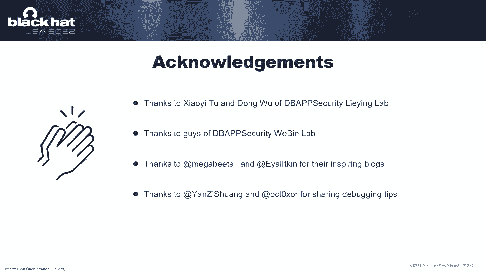

# 课程P56：062 - 野外Windows本地权限提升0day狩猎之旅 🎯

在本课程中，我们将跟随坤坤武特在黑帽美国22周年大会上的分享，系统性地学习如何在野外环境中狩猎Windows本地权限提升（LPE）0day漏洞。我们将从动机、方法论、技术分析到实战案例，全面解析这一极具挑战性的安全研究领域。

## 概述：为何以及如何狩猎Windows LPE 0day

现在，我很荣幸能在黑帽美国22周年大会上发言，分享一些在野外Windows环境中狩猎0day的经验和见解。

首先，让我自我介绍一下。我叫关静，你也可以叫我卢卡斯。目前我和劳埃德在DP安全工作。我的兴趣是脆弱性研究。在开始真正的野外日间狩猎之前，我在蓝调头、上海二十九和B二十一有过相关经验。

让我们进入正题。这是我今天的主要议程。让我先解释一下为什么我们决定在野外的Windows环境中狩猎LPE 0day，以及为什么我们认为这是可能的。

从图片中可以看到，从2017年到2021年，微软在野外披露了总共28个Windows LPE 0day。这些漏洞大部分位于Windows内核和Win32k组件中。这些漏洞经常被顶级攻击组织使用，并可能对安全供应商造成巨大伤害。抓住这样一个0day是非常具有挑战性的。

从2020年开始，我们开始考虑在野外捕获一个Windows LPE 0day。那么，在野外捕获Windows LPE 0day是否可能流行起来呢？为了回答这个问题，我们应该考虑另外两个问题：
第一，如何获得有价值的数据集，这些数据集中可能包含0day。
第二，如何为第一个问题开发有效的检测方法。

我们有一些私人数据集。此外，历史案例显示，VirusTotal等公共平台也可能存在0day。因此，结合使用私人和公共数据集，我们可以解决第一个问题。

对于第二个问题，有两种主要方法可以从数以百万计的样本中捕捉到0day：
*   **动态检测**：指在沙箱或真实环境中执行样本，通过异常行为（如防病毒和沙箱的告警）来发现样本。
*   **静态检测**：指将样本与静态特征进行匹配，例如使用Yara规则和IOC（入侵指标）。

两种方法各有优缺点。我们在力所能及的范围内尝试了这两种方法。根据结果，我们认为静态检测最适合我们。我们稍后会详细说明这个过程。

## 从历史中学习：研究过往的LPE 0day

上一节我们介绍了狩猎0day的动机和基本思路，本节中我们来看看为何以及如何从历史漏洞中汲取经验。

我来解释一下为什么我们要花很多时间研究历史上在野外出现的LPE 0day。我们为什么要向历史学习呢？有三个原因：
第一，有些攻击战术随着时间的推移是保持一致的。
第二，从攻击者的角度思考可以让我们更好地进行防御。
第三，社区已经仔细研究了历史案例，为了从他的故事中吸取教训。

我们已经研究了50多个在野外出现的Windows LPE 0day，时间跨度从2014年到2021年。我们使用组织类型、发现周期、初次披露时间、分析文章、公开的PoC（概念验证代码）、原始样本是否存在等信息进行了仔细统计。

我想集中谈几个从历史分析中得出的要点：

**第一部分是使用场景。** 样本是作为独立组件使用，还是作为攻击链的一部分使用？漏洞是利用（Exploit）形式，还是仅仅作为漏洞（Bug）存在？这些信息将直接影响我们选择不同的检测方法。

**下一点是目标Windows系统版本。** 许多Windows LPE样本在使用前会检查系统版本，并且只能在某个特定的版本中触发或利用。此信息在制作沙箱或复现环境时很有用。

**接下来是漏洞模型。** 通过计算历史样本的漏洞模型，我们可以得出哪个组件是最常被攻击的，以及哪个攻击面最受攻击者青睐。这些信息有助于我们预测最有可能出现漏洞的地方。

**比如说漏洞类型。** 通过计算历史漏洞的类型，我们可以推断哪种类型的漏洞是攻击者最喜欢的。这些信息可以帮助我们配置复现环境，例如，是否需要配置驱动程序验证器。这些信息还可以显示不同漏洞类型的流行程度。

**接下来是漏洞利用技术。** 我认为这是最重要的信息。我们不能在不探索技术的情况下，就在野外的Windows中狩猎LPE 0day。

根据2020年到2021年的统计数据，我们得出了一些有价值的结论。例如，`BitBlt` 和 `SetWindowLongPtr` 从2015年到2016年很流行，以及利用先前模式实现任意地址读写的方法自2018年以来变得越来越流行。我们还发现，使用 `NtQuerySystemInformation` 和验证句柄来读取内核信息的方法在过去五年中很流行。

**下一点是公共分析文章和PoC。** 公共的分析文章和PoC汇聚了整个社区的研究成果。吸收这些现有的知识就像站在巨人的肩膀上，这对我们很有帮助。

**最后是原始样本。** 我们也非常注意收集每个历史Windows LPE 0day的原始样本。这些原始样本的利用是第一手信息。如果我们能探测到它们，我们以后也可以捕捉到类似的样本。

## 探索最新漏洞与检测方法对比

除了从历史故事中学习，我们还应该从最新披露的漏洞中吸取教训，探索技术。原因如下：
第一，新披露的漏洞可能有变种。
第二，一种新的攻击模式会被整个社区快速跟进。
第三，攻击者在使用中或等待使用时可能有一些类似的漏洞。
第四，一种新的利用技术往往被目标人物使用。

我将描述我们如何比较不同的检测方法。据我们所知，有三种可选的方法可以在野外的Windows中捕获LPE 0day：类似杀毒软件的方法、类似沙箱的方法、以及类似Yara的静态方法。

**杀毒软件**是最强大的工具之一。过去几年在野外造成危害的一些LPE 0day就是用杀毒软件发现的。杀毒软件的优势在于它被部署在大规模的现实世界环境中。它还可以实时检测威胁，并有机会提取加密的权限提升组件。然而，不是每个供应商和变种都能表现得那么好。杀毒软件也可能被绕过或检测到，这增加了开发一种基于杀毒软件的狩猎方法的困难。

**沙箱**是另一种野外狩猎0day的工具。我有过一些成功的经验，在沙箱的帮助下狩猎0day。感兴趣的听众可以参考我以前在上海关于蓝队的演讲。不像杀毒软件，沙箱环境高度可控，可自由配置。此外，基于沙箱行为的检测使其具有准确性。但是，我认为沙箱不适合用于狩猎那些LPE 0day。不像其他恶意软件，许多LPE利用总会进行版本检查，以避免意外的崩溃（BSOD），这使得它们更难在沙箱中触发。你可能认为我们可以通过制造更多的环境来解决这个问题，但每天新的PE样本数量巨大。每个样本被交付到一个新的环境意味着巨大的资源开销，不是每个供应商都有足够的资金来支持这一点。此外，基于沙箱的检测方法对于Windows LPE样本还有其他缺点：
1.  有些样本需要用户交互，但是沙箱默认情况下不能提供有效的交互。
2.  有些样本与崩溃（BSOD）有关，没有后续恶意行为，很难察觉。
3.  在沙箱开发和部署之间有一个周期，可能会错过检测最新利用的最佳窗口期。

**Yara**是另一种在野外Windows LPE狩猎中使用的方法。它被广泛用于恶意软件狩猎。Yara几乎没有技术壁垒，不怕各种检查，在开发和部署方面具有灵活性。当一种新的利用技术出现时，我们可以快速地将其转换成Yara规则，并将其输入检测系统。最后，它比杀毒软件和沙箱的成本更低。但它也应该有一些缺点，例如它很容易导致假阳性和假阴性。因此，如果我们用Yara在野外的Windows中狩猎LPE 0day，我们需要非常熟悉历史案例，我们以前也这样做过。

在上面，我们比较了三种狩猎方法。我们最终选择了Yara作为我们的主要狩猎工具，因为它更简单、更灵活、成本更低，适合Windows LPE 0day狩猎。我们选择Yara的另一个原因是，在写了一些Yara规则后，我们回测了一些历史Windows LPE样本。令我们惊讶的是，Yara的表现好于预期。

## 将经验转化为Yara规则：三大原则

上一节我们确定了以Yara作为主要狩猎工具，本节中我们来看看如何将学习到的经验有效地转化为检测规则。

我将描述如何将学习经验传递给Yara规则。基本上我们有三个原则：

**第一个原则是根据漏洞利用的每个阶段来编写规则。** 通常，Windows内核LPE利用有以下阶段：信息泄露、控制流劫持、特权升级。我们的任务是根据每个阶段的共同特征制定规则。

以下是针对不同阶段的规则思路示例：
*   **对于内核信息泄露**：这个想法是匹配常见的Windows内核信息泄露技术，包括但不限于 `NtQuerySystemInformation`、验证句柄泄露等。
*   **对于任意地址读写原语**：这个想法是针对特定的内存操作模式进行匹配，例如通过管道属性（Pipe Attribute）或特定对象类型混淆来实现的读写。

需要注意的是，上面的想法只是一些可能的思路，不是所有的想法都适合写成规则。有些想法会导致很多假阳性。

**第二个原则是为最新的利用技术编写规则。** 这里我举了两个例子：
*   在2020年7月，Paolo Stagno在SSTIC 2020研究论文会议上创造了“新溢出技术”的讨论。我们意识到借助页堆中的管道属性实现任意地址读取的方法是通用的，将来可能会被用到。所以我们花了一些时间为这种技术写了一些Yara规则。后来发现这些规则捕获了一些高价值的样本。
*   在2021年6月28日，Kaspersky写了一篇博客，在文章中提到了在野外Windows LPE中披露的一个0day（又名CVE-2021-31955 / CVE-2021-33771）。同时，NCC集团的Alex Ionescu发表了两篇分析文章，解释了CVE-2021-31955的利用技术，并阐述了使用WNF（Windows通知设施）构造任意地址读写原语的方法。在研究这些文章的帮助下，我们意识到这项技术是通用的。我们再次花了一些时间在这个技术上写了一些Yara规则。正如预期的那样，我们确实捕获到了一些高价值的样本。

**第三个原则是针对最有可能出现漏洞的组件编写规则。** 我在这里也举了一个例子。2021年4月13日，Kaspersky发布了一篇博客，披露了CVE-2021-28310，这是在桌面窗口管理器（DWM）中捕获的野外0day。不到一个月后，他们发表了另一篇博客，披露了另一个漏洞CVE-2021-26900，这也是桌面窗口管理器中的一个漏洞。这让我们意识到，这种类型的漏洞将来可能会再次出现。所以我们在我们的规则集中加强了针对DWM组件的检测。几周后，我们确实捕获到了一个相关的样本。

## 构建完整的狩猎系统

有了正确的规则是在野外捕获Windows LPE 0day的第一步，但我们需要建立一个完整的系统。这里有一些问题需要解决：

**第一个问题是当Yara规则匹配到样本时，如何及时通知我们？** 如果我们的Yara规则在VirusTotal上运行，您可以使用VirusTotal搜索页面上的通知机制。当匹配到新样本时，我们可以配置通过电子邮件通知的项目，我们的电子邮件将立即收到告警。为了运行我们自己的平台，我们建立了一个类似于VirusTotal的界面。

**第二个问题是当我们得到一个漏洞样本，如何快速复现和分类？** 我们计算了每个历史样本的目标Windows版本。通过研究历史案例，此信息可以在此使用。此外，考虑到我们狩猎的可能是1day、Nday或0day，我们需要准备这三种类型的环境。我们需要随着时间的推移更新这些环境。为了最大限度地减少复现时间，我们制作了新版本的Windows镜像。

**第三个问题是我们应该掌握哪些技能来调试不同的LPE利用？** 让我在这里给那些分析过Windows内核漏洞的人举一个例子。Windows内核调试和驱动程序验证器是两个基本技能。除了那些，分析过EW（漏洞利用）和漏洞的人，使用Windows调试器是必要的。对于像DWM这样的进程，远程调试是必要的，因为直接附加到DWM进程将导致系统UI无响应。我们的经验越多，我们就会越好地回答这个问题。

没有任何方法可以使我们的系统一开始就完美。我们进行了以下测试和改进：
1.  使用收集的历史Windows LPE 0day样本来测试规则。
2.  利用公开的PoC和利用代码来测试规则。
3.  在一些情况下，公开的PoC和利用代码无法收集，尝试自己编写PoC并测试。
4.  将规则应用于大量样本进行压力测试。
5.  持续将最新的利用技术转化为规则并测试。

## 实战案例分享

系统部署一年后，我们捕获了很多Windows LPE漏洞。在下一部分我们将分享三个被我们的系统捕获的案例：
1.  在Windows Win32k子系统中的野外LPE 0day。
2.  在Windows桌面窗口管理器中的野外LPE 0day。
3.  在Windows公共日志文件系统中的野外LPE 0day。

让我们来看看2020年12月的第一个漏洞。在12月20日，我们在野外抓住了第一个0day，一个微软签名的驱动样本来自我们的私人数据集。我们注意到它是因为它使用 `NtQuerySystemInformation` 和验证句柄来读取内核信息，这是Windows内核LPE利用的一个强烈特征。进一步的分析表明，样本利用了一个类型混淆漏洞，是Win32k内核模块中的0day。

值得一提的是，捕获的样本被用作独立的组件。使用样本时，您需要提供一个PID作为参数。这个PID指向需要提权的进程。目标进程将首先被终止，然后我们从系统特权重新启动它。如果直接运行此样本，它也会升级为系统特权，但它将在没有任何可见行为的情况下退出。

这里有一些亮点：
*   在捕获的样本中，它瞄准了当时最新版本的Windows 10操作系统。
*   它完全使用菜单栏来构建任意地址读写原语，在当时是新奇的。
*   在利用之前，样本检测了特定的防病毒软件并执行了系统版本检查。

关于这一天的其余细节，可以参考我们的博客，或者整个社区写的许多其他分析文章。

现在，让我们切换到2021年5月的第二个漏洞。我们在野外的Windows中抓住了第二个LPE 0day，一个微软签名的CAB文件。正如我在构建系统部分提到的，我们会定期预测最有可能的漏洞并编写相应的规则。在5月20日左右，我们为DWM漏洞写了一些规则。不久之后，我们在5月22日捕捉到了一个不熟悉的DWM样本。初步分析显示它利用了一个0day，是另一个补丁的0day变种。

当我们第一次遇到这个样本，我们不知道它像往常一样是用发布模式代码编译的。我们将在打了完整补丁的环境中复现它。复现的结果清楚地表明这个样本中有一个0day。这是一个DWM调用中的UAF（释放后使用）漏洞。然后我们在GitHub上跟踪了这个相关的源代码。这是一个CVE-2021-26900的利用。捕获的样本中的代码刚刚替换了 `SharedCall` 部分。

那时我们有点困惑，一个1day的样本怎么会包含0day？仔细确认后，我们得出结论，微软在修复CVE-2021-26900时，不小心引入了一种新的漏洞。如果是这样，作者就使用了它。这个0day不能严格归类为野外的0day，所以我们试着告诉MSRC这不是严格意义上的野外0day。这是MSRC最终发布的低优先级案例。所以这真的是一个有趣的案例。

让我来谈谈这个漏洞模式。此漏洞是由引用计数不平衡引起的，在DWM中的 `CInteractionTrackerBindingManager` 对象上。触发此漏洞的步骤是：
1.  通过 `CreateInteractionTracker` 创建 `CInteractionTracker`。
2.  使用 `CInteractionTracker::Bind` 绑定步骤1创建的资源到 `CInteractionTrackerBindingManager`。
3.  绑定步骤1创建的资源是步骤2创建的资源的两倍，正如你在图片中看到的，并且不要在正常情况下手动释放此结果。

`CInteractionTrackerBindingManager` 将两次调用 `AddRef` 将引用计数加2。然后代码将调用 `Release` 两次来减2，并正常释放 `CInteractionTrackerBindingManager`。在漏洞场景下，`CInteractionTracker` 的引用计数趋势将不同于正常情况。但是对 `CInteractionTracker` 的调用想把引用计数加2，然而，代码仍然会调用 `Release` 两次减2。在第一次 `Release` 调用中，`CInteractionTrackerBindingManager` 上的引用计数将减少到零，那么 `CInteractionTrackerBindingManager` 将在内部释放函数中被释放。在第二个 `Release` 调用中，当它试图从已释放的对象获取一些数据时，接下来就会造成崩溃。

让我们看看2021年10月的第三个漏洞。有一天，我们在野外发现了一个新的公共日志文件系统（CLFS）样本。样本来自VirusTotal。正如我在构建系统部分提到的，我们会定期为最新的利用技术写规则。在2021年10月15日，我们为管道属性（Pipe Attribute）技术编写的规则匹配到了这个样本。

样本被用作独立组件。进一步的测试显示，该样本利用了一个影响所有支持的Windows版本的漏洞。这是公共日志文件系统驱动中的类型混淆漏洞。由于缺乏一些信息，我们无法确定此漏洞的CVE编号，这可能是CVE-2022-24521，也可能不是。根本原因是CLFS驱动在处理客户端上下文时的一些错误。攻击者可以利用这一点，在样本中提供一个无效的客户端上下文。利用这个，创建的第一个客户端上下文指向在缓冲区中设置的第二个容器上下文。然后它使用位翻转来改变第二个容器上下文的偏移量（例如，从 `0x113a0` 翻转到 `0x11ba0`），使容器上下文偏移指向一个假的 `CLFS_CONTAINER` 对象。借助假的 `CLFS_CONTAINER` 对象，利用劫持了 `CLFS_CONTAINER` 的虚函数表（vtable）中的 `Release` 和 `Delete` 函数，并在此基础上构建了一个任意地址读取原语。

`CLFS_CONTAINER` 的普通虚函数表如下所示，正如您所看到的 `Release` 和 `Delete` 功能。被劫持的虚拟函数表如下，除了这个，在样本中建立了一个任意地址读取原语，使用Scoop Windows中描述的管道属性方法。为了获取管道属性对象的地址，使用另一种公共方法 `NtQuerySystemInformation`。它查询系统信息，将管道属性对象的地址与内核任意地址读写原语链接起来。利用成功窃取了当前进程的令牌，使用系统令牌，并使用系统特权启动新进程。

让我们来看看微软是如何修复这个漏洞的。他们只检查客户端上下文的值，以确保它不能小于 `0x13`。如果我们构建一个大于此值的客户端上下文呢？并将该点的正确上下文直接创建到 `CLFS_CONTAINER` 对象在内存中，我们得到了一个新的崩溃。这是原始0day补丁的变体。我们在2021年12月向MSRC报告了这个变体。微软在2022年4月修复了这个案例，并分配CVE-2022-24480给它。

## 检测建议与未来趋势

好的，这就是漏洞案例的分享部分。在下一节中，我们将结合我们的实践，分享一些关于Windows LPE漏洞的检测