# 课程 P57：064 - 浏览器驱动的异步攻击：HTTP请求走私的新前沿 🚀

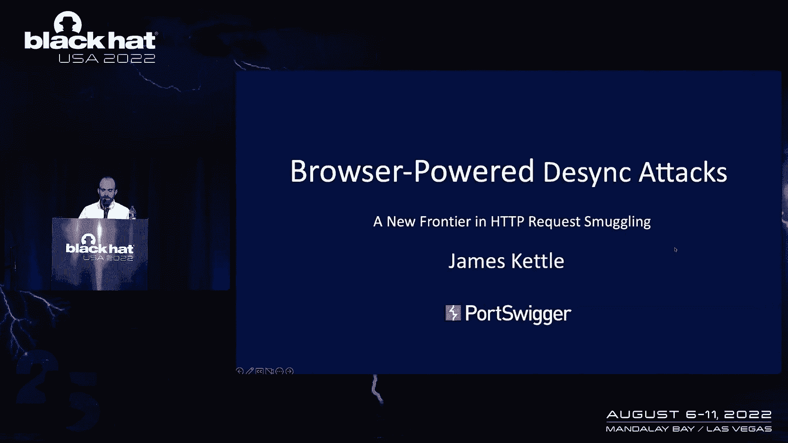

在本节课中，我们将学习一种新型的HTTP请求走私攻击——浏览器驱动的异步攻击。我们将探讨其原理、发现过程、利用方法，并通过多个案例研究来深入理解。课程内容从基础概念开始，逐步深入到复杂的攻击场景，最后讨论防御措施。

---

## 概述 📖

HTTP请求走私是一种利用前端服务器和后端服务器对HTTP请求解析不一致而发起的攻击。传统的攻击需要攻击者控制一个专用工具。然而，本节课将揭示一种全新的攻击前沿：**浏览器驱动的异步攻击**。这种攻击允许攻击者利用受害者的Web浏览器作为攻击平台，针对那些甚至没有传统前后端架构的网站。

我们首先会回顾导致这一发现的一系列深奥漏洞，然后详细介绍客户端异步攻击的方法论，包括如何识别、确认和利用漏洞。接着，我们会探讨基于暂停的异步攻击，并进行现场演示。最后，我们将总结关键的防御要点。

---

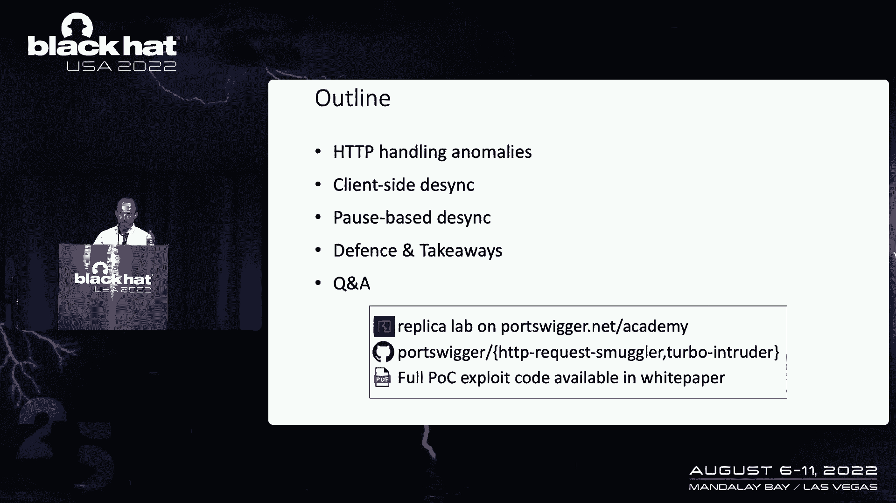

## 请求是谎言 🎭

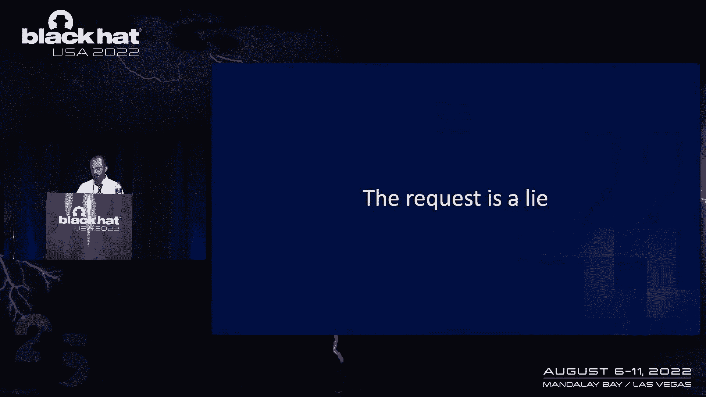

HTTP请求是一个非常有用的抽象概念。但在HTTP/1.1中，这种抽象非常脆弱。你越努力坚持“请求”这个概念，这些技术就越没有意义。请记住，我们真正在做的是向服务器发送字节流。服务器如何解释这些字节，完全取决于它自己。

大部分时间，HTTP连接都在被使用，因为HTTP本应是无状态的。但有时，“状态”总会想办法溜进来。

---

## 第一请求路由 🔄

上一节我们提到了HTTP连接的“状态性”。本节中，我们来看看一个具体的例子：“第一请求路由”。

在某些配置中，反向代理（前端）会根据连接上第一个请求的`Host`头来决定将请求路由到哪个后端。然后，同一连接上的所有后续请求都会被直接转发到同一个后端，而不再验证`Host`头。

这种行为本身可能不是一个直接的漏洞，但它可以被用来攻击任何后端。例如，攻击者可以先发送一个带有合法`Host`头的请求，建立连接，然后发送第二个请求，其中包含恶意的`Host`头或针对后端漏洞的载荷，从而绕过前端的路由限制。

**核心概念示例：**
```
请求1: GET / HTTP/1.1
Host: legitimate-site.com


请求2: POST /reset-password HTTP/1.1
Host: internal-backend.com
X-Forwarded-Host: evil.com
...
```

这个例子展示了如何利用“第一请求路由”将有毒的密码重置电子邮件头发送到内部后端。

---

## 不依赖混淆的请求走私 🤔

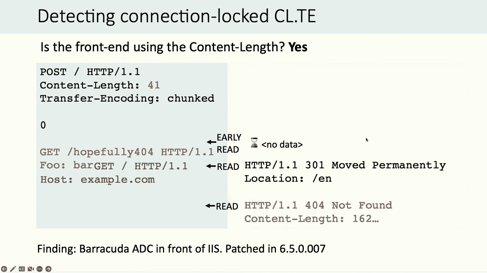

传统的请求走私需要混淆`Content-Length`或`Transfer-Encoding`头，使前端和后端对请求边界产生分歧。但有时，攻击并不需要这种混淆。

例如，研究发现，在某些使用AWS应用负载均衡器的网站上，发送一个完全符合规范的HTTP/2请求，会触发可疑行为。调查发现，ALB在将HTTP/2降级到HTTP/1.1时，会错误地添加一个`Transfer-Encoding: chunked`头，而原始请求可能带有`Content-Length`头。这种不一致导致了请求走私漏洞。

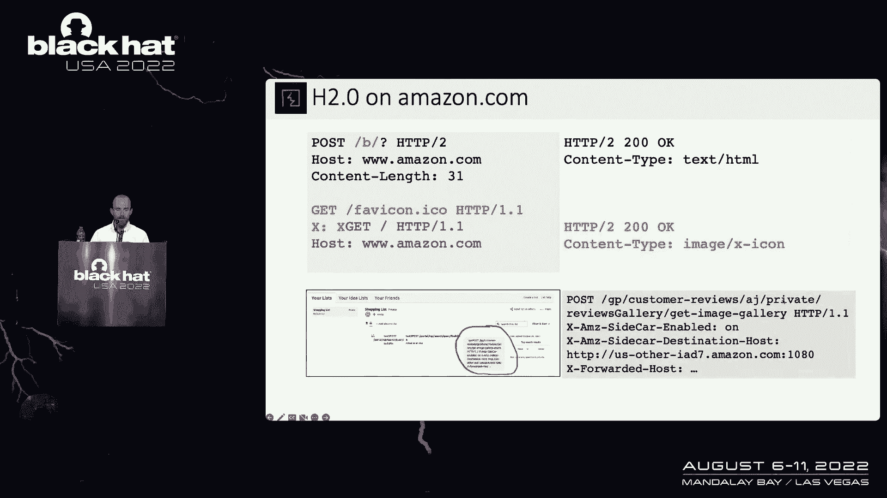

**关键要点：** 对于请求走私，你并不总是需要头部混淆或歧义。你只需要一个行为出乎意料的服务器。

---

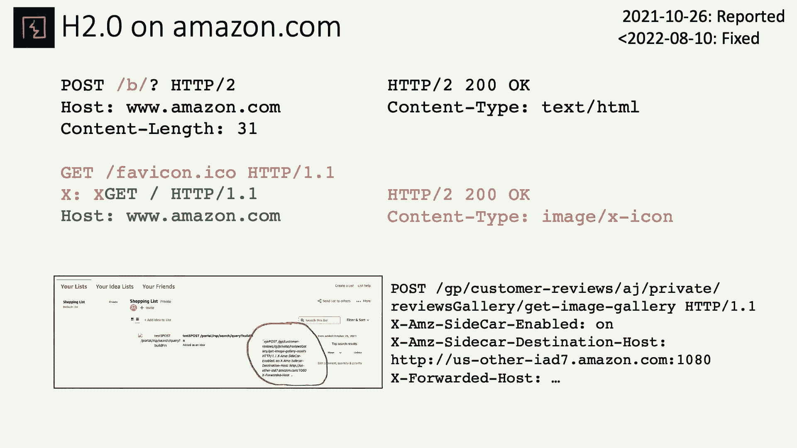

## 连接锁定与异步检测 ⏱️

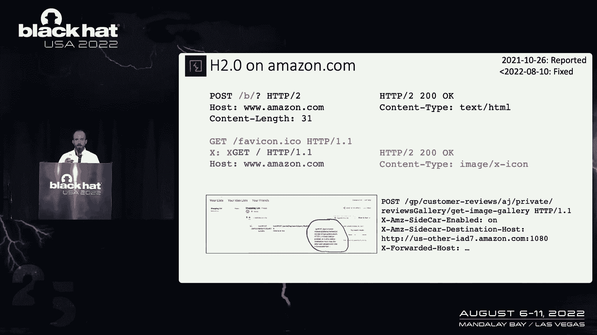

在检测请求走私时，通常需要发送两个请求，并观察第一个请求的正文是否影响第二个请求的响应。但这要求两个请求通过**不同的连接**发送。如果通过**同一个连接**发送，前端可能已经“锁定”了连接，使得检测变得困难。

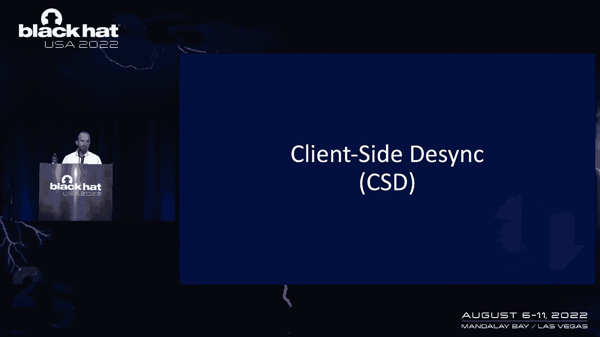

解决“连接锁定”问题的方法是引入**时间维度**的检测。

**检测方法：**
如果前端认为第一个请求使用了分块编码（`Transfer-Encoding: chunked`），它会在收到完整的块结束符（`0\r\n\r\n`）之前就开始生成响应。因此，攻击者可以在发送恶意前缀（橙色载荷）之前，先暂停并在套接字上读取数据。
*   **如果服务器立即回复**：说明前端将此消息视为分块的，这是一个假阳性。
*   **如果读取挂起**：说明服务器在等待更多数据（即使用了`Content-Length`），那么后续的攻击就可能成功。

这种方法自动化后，成功发现了多个漏洞，包括一个因供应商未将其标记为安全更新而未被广泛修复的漏洞。

---

## CL.0 异步攻击 🔓

在深入研究过程中，发现了一种特殊的异步漏洞：**CL.0 异步**。

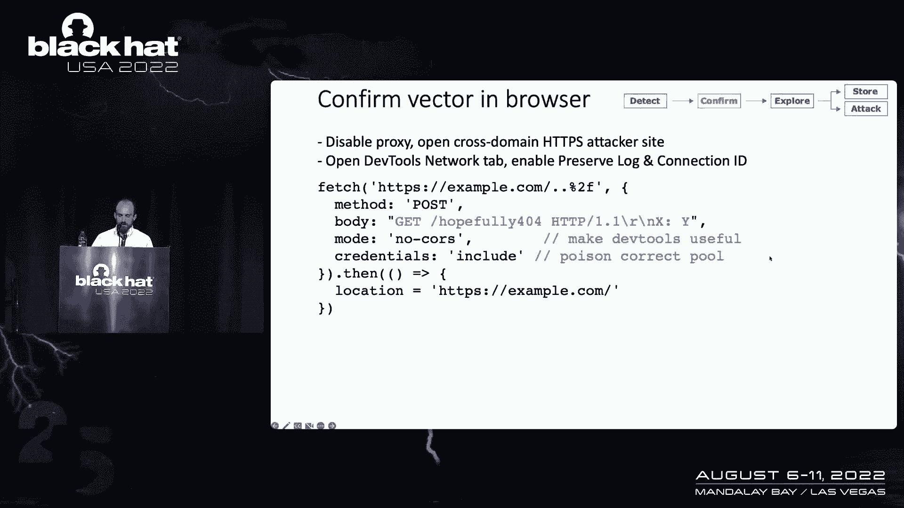

在这种攻击中，后端服务器完全**忽略**了请求的`Content-Length`头。这意味着，即使攻击者发送的`Content-Length`值大于实际正文长度，后端也会立即处理请求，而前端则根据`Content-Length`值等待更多数据。这种差异导致了异步。

**公式描述：**
```
攻击者发送: POST /path HTTP/1.1
Content-Length: 100
（实际正文只有50字节）

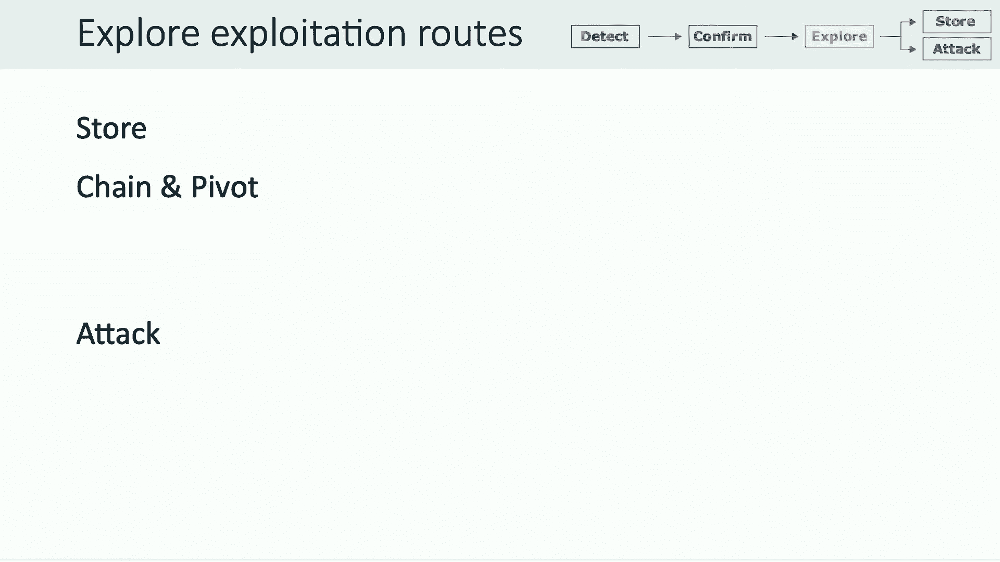

前端： 等待接收剩余的50字节。
后端： 忽略Content-Length，处理已收到的50字节并回复。
```
当下一个请求（受害者请求）到达时，其开头部分会被前端当作上一个请求剩余的50字节，从而导致请求走私。

这种漏洞之所以存在，通常是因为服务器对某些端点（如静态文件路径）的POST请求处理不当，或者触发了某种错误处理流程，从而忽略了`Content-Length`。

---

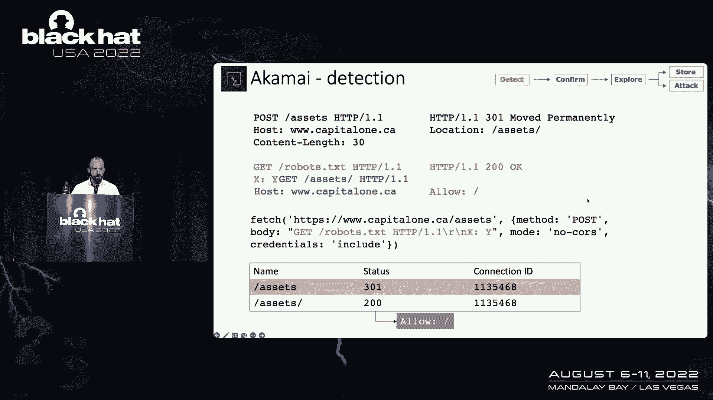

## 客户端异步攻击 🌐

CL.0异步的发现引出了一个革命性的想法：如果攻击不需要混淆，且请求可以由浏览器发送，那么是否可以让**浏览器本身**成为异步攻击的发起者？

这就是**客户端异步攻击**。与传统攻击毒害前端-后端连接不同，客户端异步攻击毒害的是**浏览器自己的连接池**。这使得攻击可以针对单层架构的网站（例如，直接面向互联网的Apache服务器）。

**攻击流程：**
1.  受害者访问攻击者控制的网站。
2.  攻击者页面触发受害者浏览器向目标网站发送两个请求。
3.  第一个请求（异步向量）毒害了浏览器到目标服务器的连接。
4.  第二个请求（受害者本应发送的请求）的部分内容被服务器解释为第一个请求的剩余正文，导致返回有害响应（如执行攻击者JavaScript）。

**客户端异步向量的三个关键属性：**
1.  服务器必须忽略`Content-Length`（通常是CL.0场景）。
2.  请求必须能在跨域的Web浏览器中触发（不能有不寻常的头部或方法限制）。
3.  服务器必须保持连接开放。

---

### 确认客户端异步向量

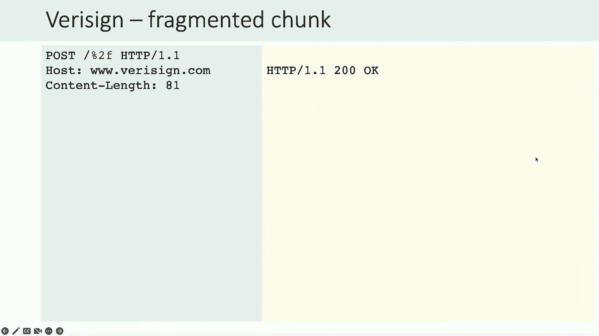

以下是确认漏洞在真实浏览器中工作的JavaScript代码示例：

```javascript
// 发送第一个请求（毒害连接）
fetch(‘https://target.com/vulnerable-endpoint‘, {
    method: ‘POST‘,
    body: ‘GET /hopefully-404 HTTP/1.1\r\nX-Ignore: x‘, // 恶意前缀
    mode: ‘no-cors‘, // 有助于在DevTools中观察
    credentials: ‘include‘
});

// 立即发送第二个请求
setTimeout(() => {
    fetch(‘https://target.com/‘, {
        mode: ‘no-cors‘,
        credentials: ‘include‘
    }).then(r => r.text()).then(t => console.log(t));
}, 100);
```
在浏览器开发者工具中，如果攻击成功，你会看到两个请求共享同一个连接ID，并且第二个请求的响应受到了第一个请求中恶意前缀的影响。

---

## 案例研究 📊

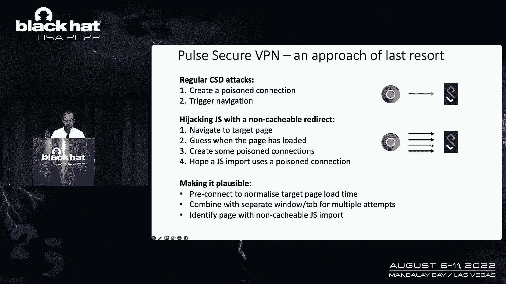

以下是利用客户端异步攻击的几个案例：

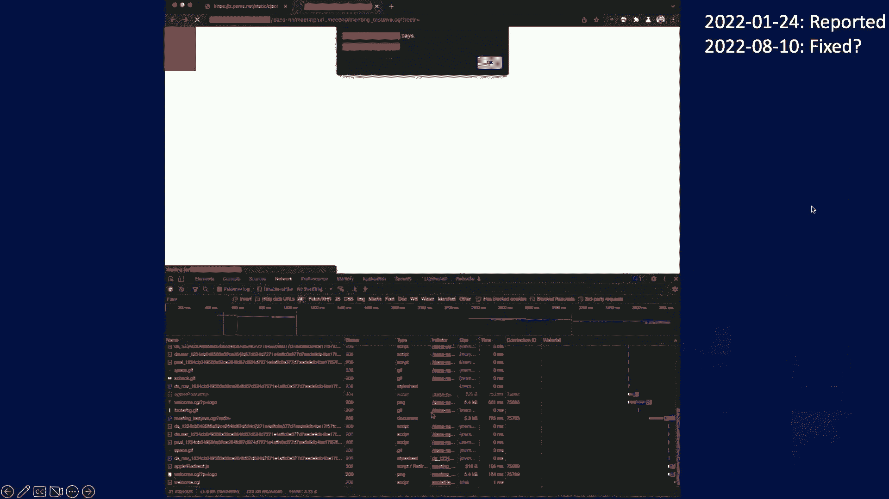

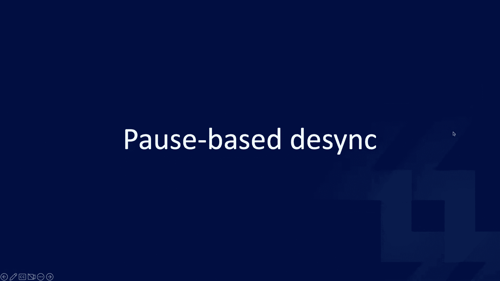

### 案例一：Akamai CDN
**漏洞点**：向某些路径发送POST请求会触发前端重定向，后端忽略`Content-Length`。
**利用**：构造恶意前缀，使浏览器在跟随重定向时，请求被劫持，返回攻击者控制的内容（如`robots.txt`）。需要解决浏览器立即跟随重定向和Chrome的“响应堆叠”问题（通过添加缓存破坏参数和`mode: ‘cors‘`引发异常来规避）。

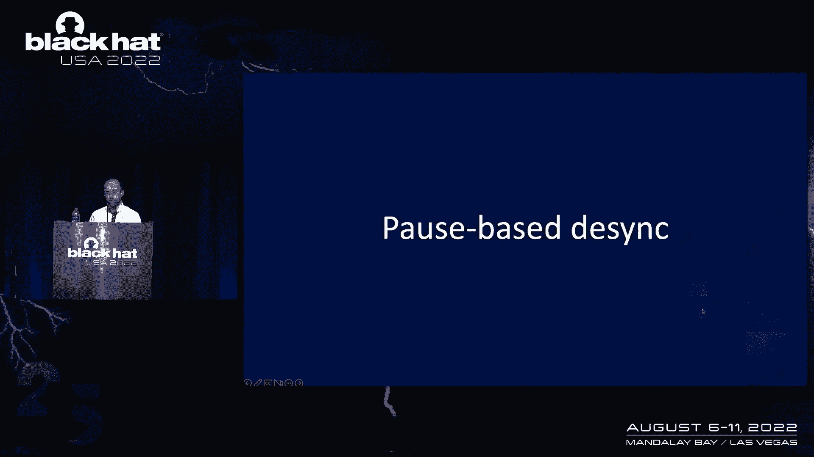

### 案例二：Varnish
**漏洞点**：在主页进行POST请求可触发异步。
**利用**：目标是劫持JavaScript资源加载。利用重定向响应**可缓存**的特性，先毒害连接并诱导浏览器缓存中毒的重定向。当用户后续访问页面加载JS时，会从缓存中读取中毒的重定向，从而加载攻击者控制的脚本。

### 案例三：Pulse Secure
**漏洞点**：对`/robots.txt`的POST请求可触发异步。
**挑战**：重定向不可缓存，攻击时机要求苛刻。
**解决方案**：
1.  预连接：提前建立浏览器与目标的连接，减少网络抖动。
2.  多尝试：在独立标签页中运行攻击，避免主页面被污染。
3.  目标选择：攻击一个返回404的、永不缓存的JavaScript文件路径，避免缓存污染问题。

---

## 基于暂停的异步攻击 ⏸️

之前提到，暂停读取可以用于检测异步。进一步研究发现，**暂停本身可以创造全新的异步漏洞**。

**原理**：如果服务器在收到请求头后，承诺会有一个请求体（通过`Content-Length`），但攻击者迟迟不发送完正文。一段时间后，服务器可能因超时而发送一个响应。此时，攻击者再发送的剩余数据以及后续请求，会被服务器解释为新的、独立的请求。

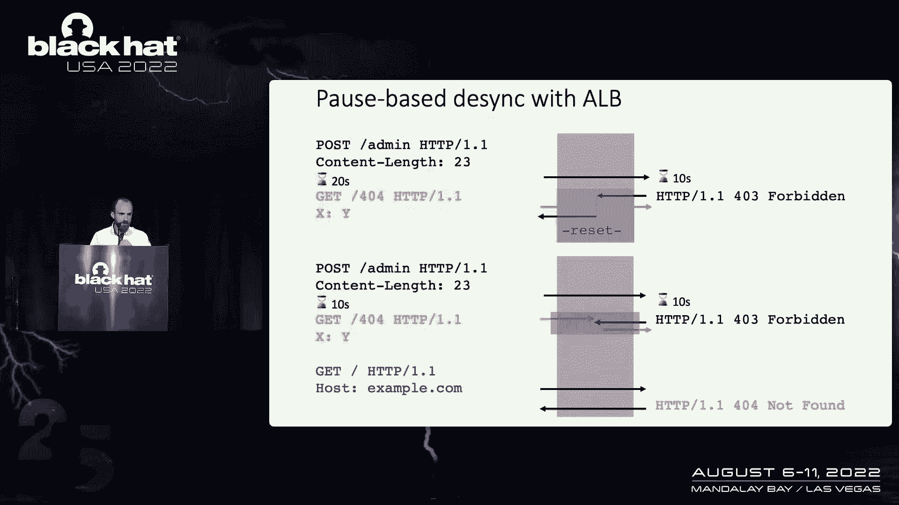

### 服务器端基于暂停的异步
**条件**：需要后端（如Apache）易受暂停攻击，且前端（如某些流式转发请求的代理）不等待请求体完整到达就转发头部。
**方法**：
1.  发送请求头，承诺一个较长的正文。
2.  暂停，等待后端超时。
3.  在预计后端已超时但前端尚未察觉时，快速发送剩余的正文和下一个恶意请求。
4.  前端将恶意请求的一部分当作上一个请求的剩余正文转发给已超时的后端，导致异步。

**工具更新**：Turbo Intruder等工具已加入支持，允许在请求的特定位置插入延迟。


### 客户端基于暂停的异步（理论）
虽然浏览器不能主动暂停请求，但网络中间人（如恶意Wi-Fi、ISP）可以延迟特定的TCP数据包。
**攻击设想**：
1.  诱使浏览器发送一个很大的POST请求（会被分成多个数据包）。
2.  中间人延迟携带请求头结束符`\r\n\r\n`之后、但属于同一“请求”的某个数据包。
3.  服务器可能先处理已收到的头部并响应，而浏览器后续发送的数据被当作新请求处理。
4.  这可能导致浏览器端的连接状态不同步，结合其他技术可能实现利用。

**演示**：通过中间人延迟特定大小的数据包，在默认Apache配置上实现了客户端异步，并执行了任意JavaScript。虽然可靠性取决于浏览器分包策略，但证明了其可行性。

---

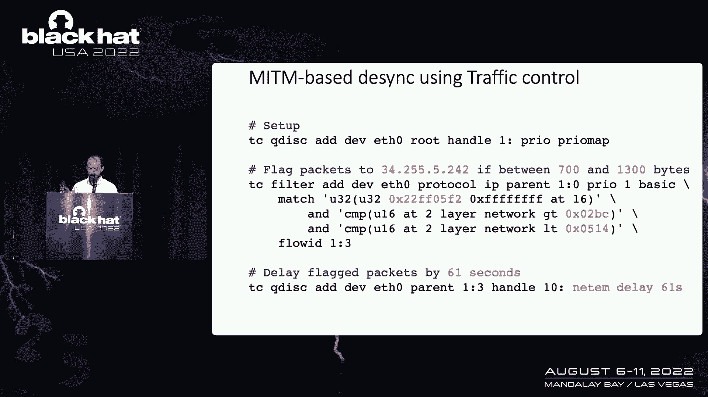

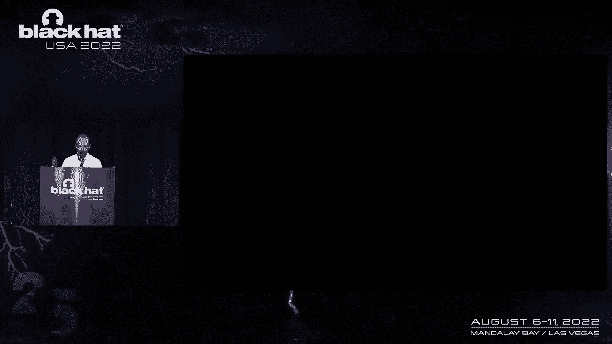

## 防御要点 🛡️

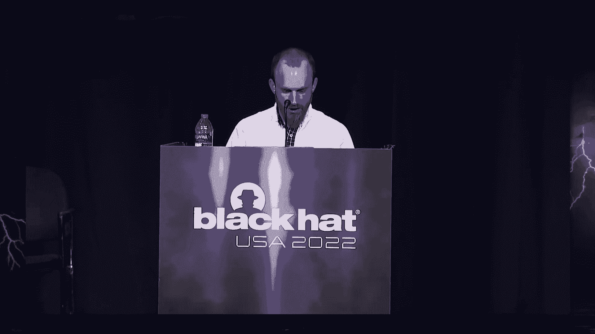

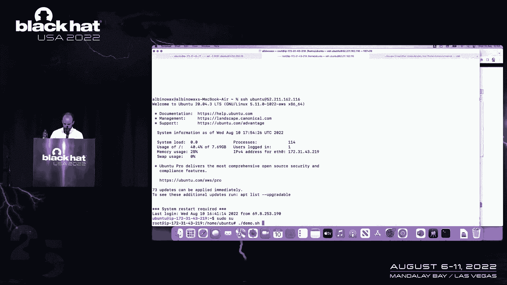

1.  **优先使用HTTP/2**：这些攻击主要针对HTTP/1.1。确保服务器支持并优先使用HTTP/2。避免将HTTP/2降级到HTTP/1.1，这可能引入新的风险。
2.  **避免自研HTTP/1.1服务器**：编写一个安全的HTTP/1.1服务器非常困难。建议使用经过严格测试的成熟产品。
3.  **服务器加固**：
    *   严格验证`Content-Length`。
    *  为所有端点配置适当的请求超时和请求体大小限制。
    *  确保错误处理流程不会意外忽略`Content-Length`。
    *  考虑在反向代理层禁用连接复用（但可能影响性能）。

---

## 总结 🎯

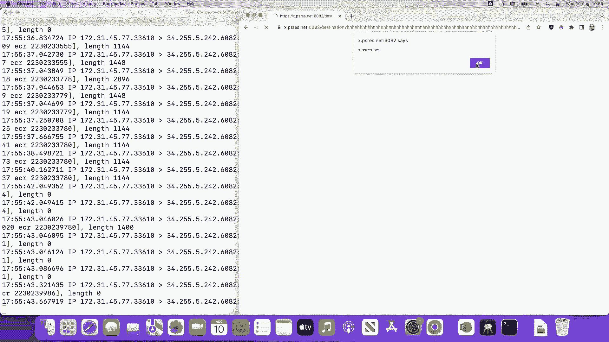


本节课我们一起探索了HTTP请求 smuggling 的新领域——浏览器驱动的异步攻击。

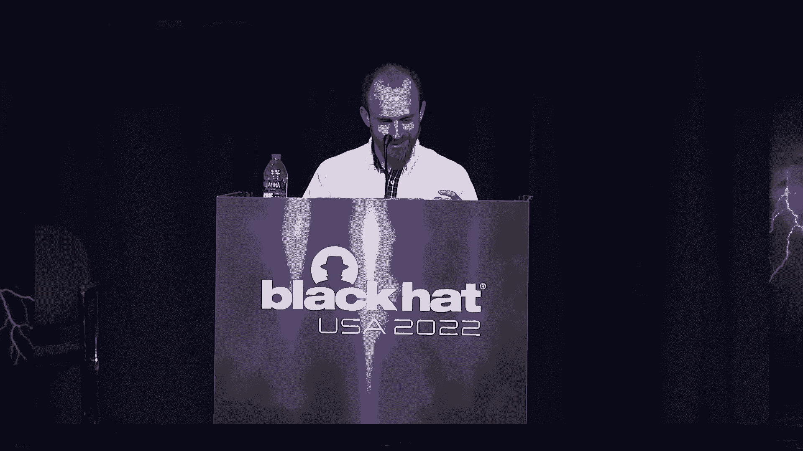

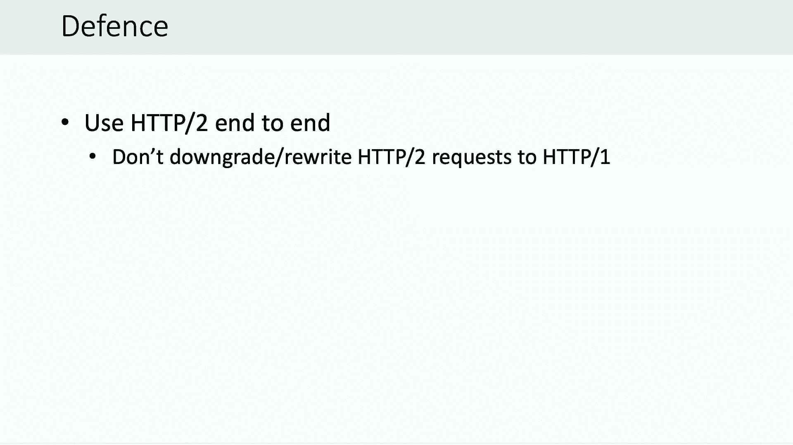

我们首先理解了“请求”抽象下的真实数据流。然后，我们回顾了第一请求路由、无需混淆的走私等概念，并深入探讨了**CL.0异步**这一关键漏洞类型。正是它引出了**客户端异步攻击**的核心思想：利用浏览器作为攻击媒介，毒害其自身的连接池。

我们学习了如何识别和确认客户端异步向量，并通过Akamai、Varnish和Pulse Secure的案例研究了实际的利用链构建，挑战包括处理重定向、缓存和时机问题。

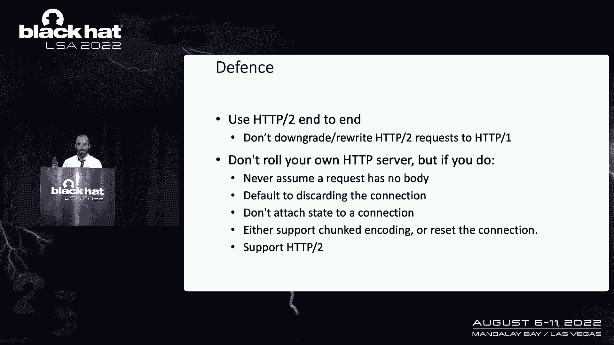

接着，我们介绍了**基于暂停的异步攻击**，展示了如何利用服务器超时机制创造走私条件，甚至在理论上探讨了由网络中间人发起的客户端暂停攻击。

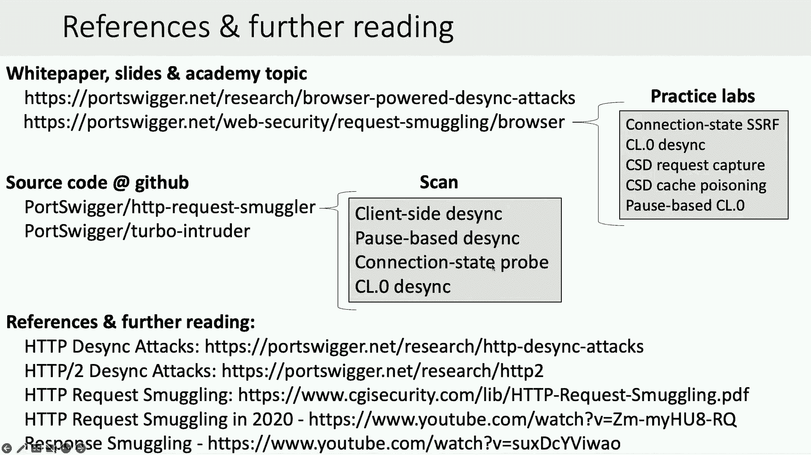

最后，我们讨论了防御策略，强调使用HTTP/2、避免自研不安全协议栈以及进行服务器加固的重要性。

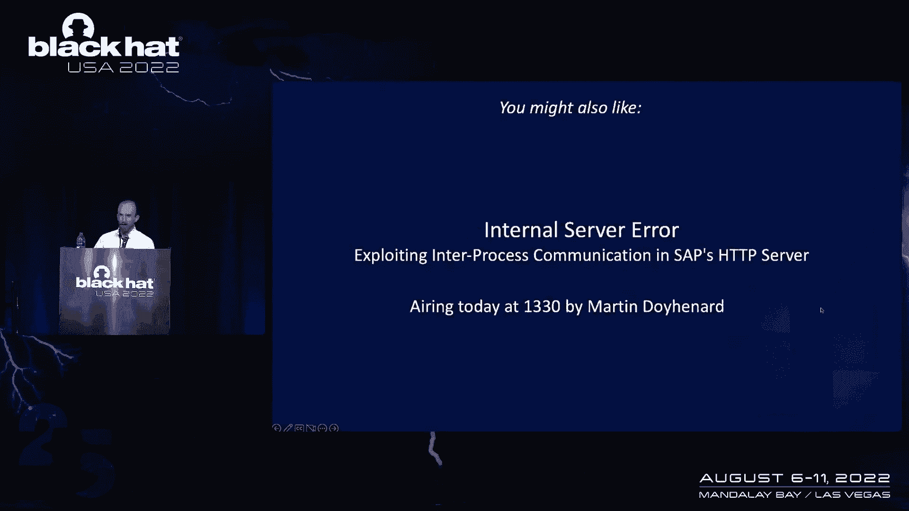

关键要点重申：
*   **请求是谎言**：关注底层的字节流。
*   **连接复用是有害的**：它引入了状态，可能被利用。
*   **你只需要一个行为出乎意料的服务器**：漏洞可能源于非预期的服务器行为，而非复杂的混淆。


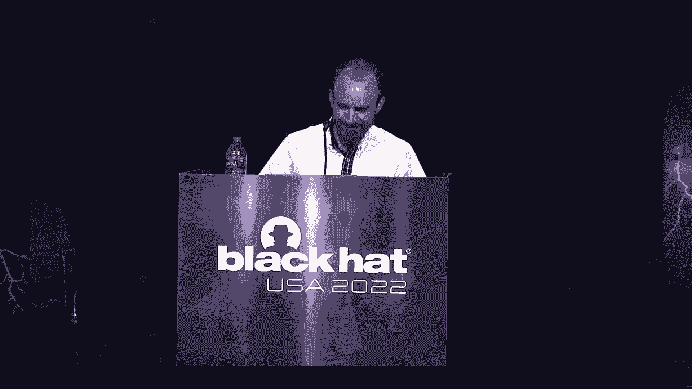

希望本教程能帮助你理解这一前沿攻击技术，并更好地评估和防御相关风险。