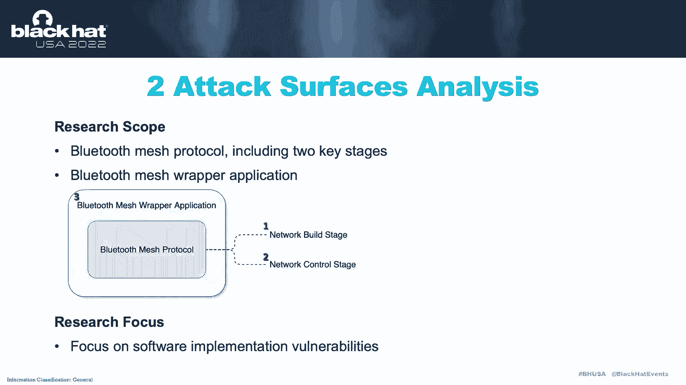
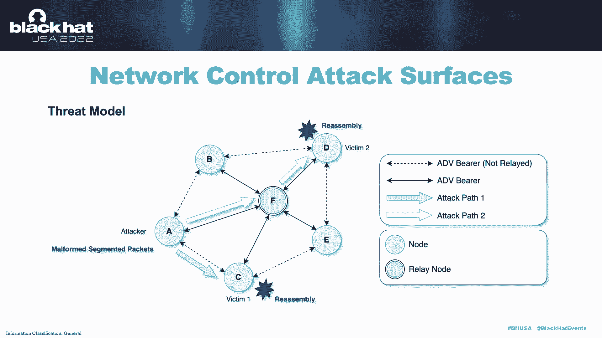
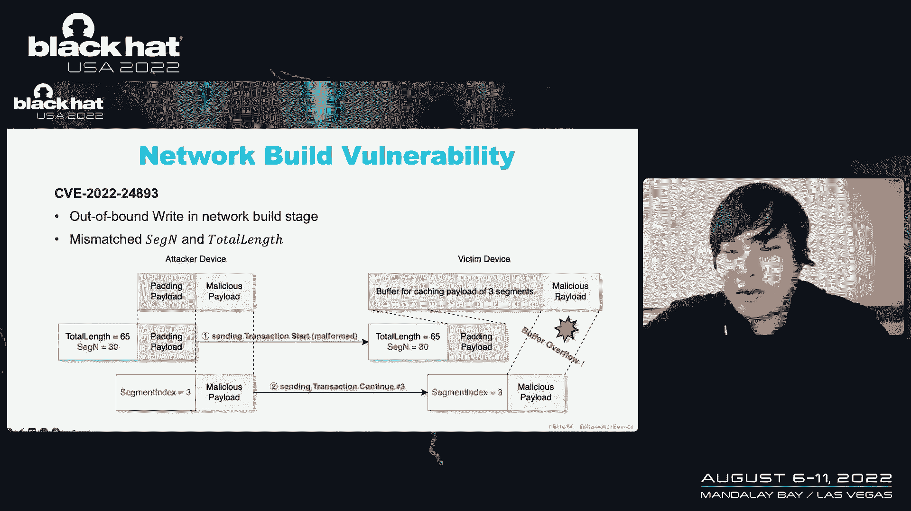
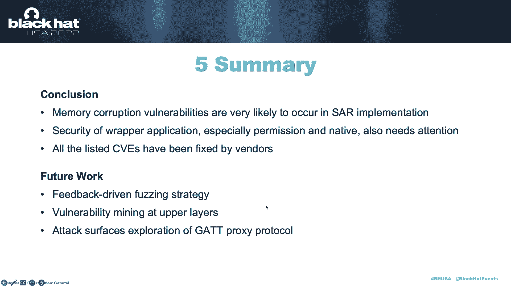
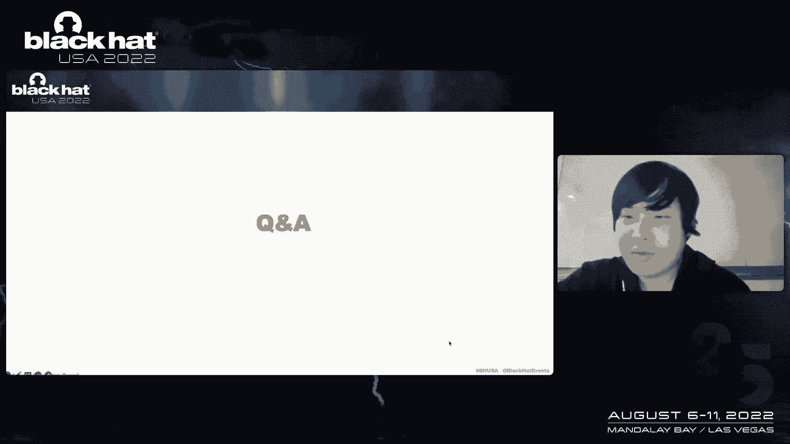

# P58：065 - BrokenMesh： New Attack Surfaces of Bluetooth Mesh - 坤坤武特 - BV1WK41167dt

hi everyone，i am hyan，welcome to our hog，broken mesh，new attack surfaces of brut mash in this talk。

we will discuss some common attack surfaces and，vulnerabilities of blue tooth，mesh technology。

first let me introduce our team，we belong to the百度，alt security team。

we now focus on the security of android and linux patform，and our duty is to discover，zero day。

vulnerability and explore possible defense，solutions，in this talk。

we will first introduce some basic concepts of bluetooth mesh technology，where to attack。

when to attack，and how to attack，and next we will introduce b r e mesh。

father an automated faztwo for bluetooth mesh。

well，let's start with the blue slash technology，bluetooth mesh is not also known as bluetooth。

l e mesh or b l e mesh，it is a wireless mesh，not working technology。

based on b l e ptsmash was made public by sk，in two thousand and seventeen。

and now is widely used in smart home and industrial lt，and other things。

we're hearing the blue to smash，may be one of the most confusing question is。

what is the difference between brutal smash，and brutus classic or brutus l e。

we think the main difference is that boos classic，nb r e a wireless communication technology。

they are just like wifi，while the blue to smash is a networking technology is just like the tcp ip。

and this figure shows their ptical stack，as we can see blue to smash has a network layer。

but the other total do not，since brutal smash is a networking technology。

communication in brutal smash is no longer，just point to point a large number of device。

forms a network and communicate with each other，formerly device in the machine work is called note。

and you could see there are many types of nodes，but we only need to focus on the best balde。

and the releo here，ok，let's see，how the message flows in this network。

assuming that the note a wants to send a message to dioe，you can just pass the message to the。

lion q and q will enforward the message to e in this process，node a actually advertisers。

the message to all，the nearby news，include the nob note cure and note p和swat。

only the really not cue will do the forward job，and we out such communication maism as managing flooding。

we have figured out，how message flows，but how to represent the source and destination of a message in fact。

just like tcp ip，each node in my network，have a nightwork address。

there are basically four types of dress，but we can focus on two of them，the first is unicaddress。

it is an address for each individual note，and second is the group address。

it is an address for a group of noise，and in this，example，nb has a unicordress，well，noc。

and nod has the same group dress，so noa can send message to note b。

just by its uniccafes and node a can send message to c，let's further understand the blue smash。

communication from a higher level，brutal smash，adopt message，orange communication。

which is also known as publish and subscribe here，republish means suding message to a specific address。

a node can publish message to uncast address and google address。

while subscribe means start to receive message with specific，destination address。

node can subscribe to a group projess，we also see the example。

these lights has have subscribed to the google juication，while this switch can publish an own。

message to the group of trication to turn on those swi，so in summary。

bluetoos smash is a networking technology based on p l e。

and nose can communicate with each other in the network。

ok in the second part，smash，origin scope，include two aspect，the first is protocol。

and the second is rapper application，uh which is proposed by sick。

and rapper application in software rework for providing bluetoosmash。

capabilities to ulayer applications and further，we divide protocol into two key stages，uh。

the first is network bill stage，and the second is network control stage on the other hand。

uh in this research，we folk songs of our implementation，waterabilities of glue to snatch。

such as memory corruption。

but let's start with the network，beam potao network，build is a process in。

which new devices joined the mesh network with the，help of a mesh gateway，formerly。

the network dud is called provisation，and the mesh gateway is called provisional。

and the new device is called unprovision device，network build protocol contains five procedures。

but we just need to know，well，that's ok，uh an uprovised device，first，send a specific。

beacon to the provisor to announce that that，i want to join the mesh network and provisional than。

build a link with the improvided device，and then both of them。

provides some necessary information to each other，and here is a critical point。

the proviser and improvision device，will calculate a shared key，using in the dh or algorithm。

and use the shared key to increase something for authentication，uh。

we should notice that the authentication is often based on some windows，specifica parameters。

which means that a device of window，a may not be able to join the match。

network through a provisor of window be，i finally the provisioning time and provising device will send the link。

close to the provisier to endy link，and also noticed that if provisioning fails。

next we need to take for the，look at the provisily massive。

mat in fact all the message used uh improvisioning，follows this promise啊。

we can see the whole packet is just a bluetooth，low energy advertising packet，which means that uh。

the bluetooth smash is actually built on top of the。

bluetooth law energy and the data related to provisioning，are all here uh in the generic provisation。

pdu and especially in this to啊in the transaction，star pdu and traction continue pu。

how the mesh phototo implementation，pass the generic provisioning。

pdu is the key point of vulnerability，money，ok let us see the attack surfaces of the network build stage。

first，we need to decide when to attack，we think the attack should be carried out before the authentication。

because in this procedures，no extra information is required。

sold attack is applicable to any windows specific device，and next we need to decide，we found that uh。

the seventation and resembly magnism is a perfect target。

the segmentation and assembly are designed for transmeeting，extremely long data。

it is realized through this to the transaction，the traction star pu is the first segment and transaction continue pu。

are the remaining we consider the uh semented，and real assembly as perfect target。

because it is a general mechanism，so that supported by all the mesh divis，i mean。

while receiving and casegmented the packet involve，memory operation。

we are all very likely to cause memory crush，uh we can attack the segmentation and resembly。

if i take less related fields of transaction，the fields are s g n total lights and segment index。

and we will show an automated fine too for this purpose later。

ok uh in summary the thread model of a network，build attack surface are shown here。

the attacker can be either a provisor，or or an unprovision device for by the provisor。

it can smile from segmented packets to，victim and provide device，after building link。

and the waterability will be triggered on waiting，during is resembling。

and similarly a bite and provision device，can send malformed the semented packto。

the victim provisor after receiving the provisioning white here，ok next。

let's see the network control，不套口，network control is a process that one device and message to other devices for。

example，a switch，can send some message to the lights to turn on those lights uh。

we call it network control and metal control poro，follows a layered architecture。

and they are totally eight years here，we can just focus on the network layer，and the transport layer。

here in network layer，they are network address，including the songs of dress r c and destination address d s t。

and in transport layer，or more specifically in the lower transport layer，uh。

they are fields designed for the segmentation and real sa，uh，well，yes。

the network control also supports a seventation and with assembly mechanism，double to smash。

natively supports security features，and one of the main security features is the message of application。

and encryption in blue to smash，there are two kids for the increation。

and there are known as night key and a p p key，the night key is used to obfuscate。

and increased fields of network layer here，and app key is used to encrypt。

the fields of upper transformer here，and in consequence，if we have no，i see here。

because they are啊enroll uh，but if we have the night key，then we can pass the whole。

mework layer and home lower transport player，and if we have niky and app key。

we can pass the home message，okay，next，let's see the attack surfaces of natural control stage。

uh similar to the network use stage，we found that segmentation，and the real assembly mechanism。

is an ideal uh attacks target in the network control stage，in，addition to the。

reason that it is a general mechanism and involves memory operation。

it is also because that the segmentation and resembly，occurred in the lower transport layer。

so that only makey is required not app key，but why is this an advantage，we need to know that ball。

the device within the network have the same night key，but different device。

may have different a p p key as long as the attacker，john in the matchmad work。

the night key can be obtained it，means that the attacker can send message，malware。

message to any other device，and resembly，i'm taking the last related fields。

uh such as this control s g o i s g，and signment i m here，well the threat model of network control。

attack surface is shown like this from this，right model，we can see in blue to smash。

the attack vector is no longer limitted to the adjacent，the attacker device。

a can send the malawa segmented package to nearby，victim the devc，help of the lion ef。

so water bilities will be triggered on victim，during the resemble。

smart protoco，and finally，let us find out attack surfaces of brutus，masharp and application first。

we need to define，what is a rapper application，the mesh capability are rubbed as a i d l service。

provided by this process，counter android，bluetooth，other，android app can utilize disabilities。

through the ai da ba for example，i android app wants to send my message。

it can just call the corresponding interface，provided by the match service。

and my service will then forward discuto，the gala year and glier will then for a discount to the。

hot air uh，finally to delete match io uh，well，the live mesh dos，o uh。

will send the stone to blue to chip to actually send mesh message out。

assume that the attacker is malware，android app，and the attactor is the malicious call then from this architecture。

we can see there are two main attack surfaces，the first uh。

we can attack the permission restriction of the dial service，we can try to call the match service。

without rtos permission，and second we can attack the memory operation in ji and holler啊。

these two layers are often implemented by using c or cpp，uh，which are very likely to wow。

memory corruption one of duti，so we can try to call the match series with malphone parameters to see。

permission。

restriction and memory operation are too，many tk surfaces in rap application。

and we will show more details in the case，in the part，we will introduce your image，father。

a father too，we designed to find the vnerabilities in。

and the oracle is too fast boost network build and network control stations。

so that the file e mash father is composed of two corresponding subsystems。

here is an overview of the network，build father for fuzing process。

there are several necessary things to，do we need to generate test cases。

and we need to send them to the target device，and monitor the response from the target device to detect crush。

so bie match，father also follow this for framework for the test case，generation。

we define a series of sigmented package as a single test case，uh like this。

and we generate them at once in each fuzzing loop then。

our sender will first follow the normal provisioning，procedure to build link with the target device。

and when is father's turn to send message，or a sender will send each packet of test case to the target device。

meanwhile we monitor the response from the，target device to detect crush。

if father do not receive the link clothes from the target device。

and we will consider it as the crush happen by the way，monitoring log from serial。

port is also a way to crush，but different developer board may have different output，uh to the uh。

the contrast the link clothes based rush detection，method is more general。

and these two second diagrams show，how the network build father works，the first stone shows。

the case that a trick werty at first，the father will generate a test case。

which is composed of several lemented packets，then the father followed the normal uh。

provides in procedure build link with the target device。

and when link is established the fathers start to send，segmented package，as well。

as wait for the link，clothes assuming that this transfer continue po trip vability。

causing the target device to crush then，the target device will lost all the information for this provides session。

something that will never send link close to our father。

and we return to the fatherside the second timer has time out。

and father does not receive any improves，so the father will consider it as crush happy。

then save the crush log and clear timer，well，the second diagram shows，the case that not trigger。

one vision assuming that uh，this segmented packet is determined as invalid by the target as。

and cause of check fm and target device，send the link close to the father due to the check file。

then the father knows that this fast loop has failed，so just reset timer and start denzing loop。

now we have established a fuzzy for work，so the last work to do is to define。

how to generate the test case，ua test case is composed of one transaction。

when when generating the test case，we first randomized the pages，count one plus n。

and then we random the s g n total lines，delies of the transaction dpu。

and we randomize the s h o delies of the transition，continuing to form a test case。

and this is an example，the father has generated parameters，such as has been。

and this test case finally caused to target device to crush，ok let's move to the network control法则。

natural control，father is also composed of three mamodels。

the test is generation sa receiver and crush detection uh。

a test case is also defined as a series of segmented packets。

and our father will send disemented package to the toy device，one by one，and notice that。

the center will also send some problem packets to the target device。

the problem package are valid segmented packets，and they are used to detect the crush。

enormous target device，will send is the case to the problem packets，按a c k packets。

ucontain response to medical problems，uh，this is called the block is the key and in father find that some is。

the case to the problems are missing then，the crush is considered to happen by the way uh。

why we need the props，rather than just monitoring the k to test case to detect crush。

this is because that missing is ak to test case，may be cobiocrush，but it may also be uh。

caused by the invalid packet not deasa，it is just a hard to tell these two situation uh。

but for the problem missing is the key for prom，must means crush，and these two seconds stagrams show。

how the network built for other works，the first strim shows，the case that trigger waterability。

uh at first father also generate the test case，which is composed of several depended packet。

don't fight the father，send the first package to the target device，as well as the problem。

and we can see that the target device，response is the key to both mented。

and the probe descri and next the father send second sevented packet。

but this packet is not accepted by the target device，so no ek to this packet will be set。

but we do not care that's okay，and uh the father received a c k to the power。

so we know that uh the target device works fine，and then the father son the，third。

sigmt package and trigger crash on the turkey device，the next father than pro to the target device。

and now is the critical point，if the mesh service on the target device is permanent da。

the father will find that the a c k to the problem is missing，so that not the crush has occurred。

this is the simplest case，but even if the mesh service is not permanent。

dawe can still detect a crush，because we mesh cross uh。

all the information about this sementation and resembling session has been lost。

so this is c k will only response to the last problem，but missing the response to the first。

and the second prom，so if we found the missing，we know that the mesh the service on the target device has rushed。

well for the case that not trigger on the ability of father，will receive all the instance to prom。

and know that nothing happens。

uh the task is generation is similar to the network build，we force decide。

how many semented package are included in a single test case。

and then we randomize the s h n s u delies and control uh，these feels are related to the lights。

and here is an example，the father has january，several uh concerned parameters。

and finally triggered target device to crush，ok this is the last part of our father。

we implement our system based on the nordic n r f model，and this module pose。

since the blue to smash is built on top of blue tooth，low energy。

so we need to find out too that can send row b r e package，first。

and here we utilize the swing to driver for this purpose，swing tooth is a great。

open source to blows as customized dr wiping，and sounds for their great work，and next。

we implement the mesh protocol based on the mesh spike。

and this is a cold snap that show the details of network layer。

and finally we implement our system based on our self，implemented protocol。

the first part is about a real world，wannabe money of blue smash and up to july，twenty four。

we have found a total of seventeen issues，covered avion windows and obtain certain ciris。

and now all the listed is have been fixed by wind in this part。

we will discuss the wannabes in network，build stage，network control stage and wrapped application。

the first case is an outer brivulnerability in network，bill stage here。

we need to know to fuse the s g n uh and total la，and i s g n means number of segments。

it is a zero base value for example，the s h n equals。

three means that the home sage is divided into four，segmented packets。

while the total length means the uh，total number of spice in the，whole message。

in a valid case s h n and total length，should be matched for example，正得s e g n数b two。

which means that sixty five bs are divided into three，segmented packets，ok uh。

this is a vulnerability that uh demesh sdk，allows mismashed sg and total lights in the netrobustage。

and in this case，the attacker first sa transaction。

started you to the victim with the total lance sixty five，but with the s gm thirty and victim。

first picks up the total lights，okay，is thirty five victim will alloca。

sixty five guys buffer to catch all the segmented packet。

but next the victim will pick up the segment uh，the s g n uh its thirty。

and it will consider that they are totally thirty，one paces to receive in fact that is incorrect。

so the attacker can just need to send a male，from the sevented packet，who segmented index is three。

and here since the seventh index，three is smaller than the s g n，so this packet will be catched。

and will be considered as valle，but the segmented index three means that this is the fourth packet。

this packet will be catching here，and final list to the other one。

right，uh here is the pork，uh，we first blink with the victim and dance and malphone。

segmentation package，and this finally leads to the crush of my service，okay。

the second case is an auto bound，right water，wikin network control stage again。

we need to know these two fields，the s h n and i s g o segen is also the number of segments。

and s h o is similar to segment index in network build protoco，it is the offset number indicates。

which sigmund the current packet is，and invalid case for certain sigm，teaching and resembly session。

the s g n uh in all the sigmt packets should be the same，but in this bad case。

match sdk allows the sagn to be inconsistent here，the attacker。

first ssemitive package to the victim with the s g n y，and the s g o zero uh，that's ok。

it means that there are two segmented the packet in total。

and this is the first one and the victim will pick up the decision。

while since there are totally two packs to receive，it's just a loca buffer for these two package。

but next the attacker will send a malfpackage with sage，and thirty one and s h o two victim。

just do a check that the sage here is smaller than the segen here，and catch it into buffer，然again，uh。

since the s joo is to dipackage is considered as，deserve package。

so this packet will be catched out of bounds，and finally caused a out of bright，five minutes。

mr han five minutes，this is the park just changed the s g n of different package。

and the first is one，and the other are circub uh，this finally leads to crush in win device and from love。

we can see we can hijacpc and r zero，so that discrush can lead to remove cute，cos cution，r c e。

and now we are clear about the volunteabilities in mesh，protocol，next lessing。

the first vulnerability is a permission，leak in mesh uh service，it is discovered on android platform。

although the services have some permission check，but it rains all the foreground application as permitted color。

so that every application can call this service interface。

even they do not have any permission related to protos。

and here's the park an untrusted app with only without any provision。

can successfully called the meisteries，of course this wondervity is an entry and more water vities。

can be triggered by，calling the service interface with mille from parameters，and here is an example。

this is a stack overflow on the vilities in proto mesh，ji an input to my service。

there is an interface that receive an araway from the color。

that way is part from jilier from java to jilier and copying to stack。

the watervy is that the memory copy doesn't check the last of early。

so if you surpasses are overlanarray to the interface，it will cost the stack overflow。

in the end with some rice work as follows uh from the start。

if we know memory crush，vorbits are very likely to occur in the sementation and。

resembly incrementation and security of rapper application，especially the permission and native。

also in tention and order listed cv，have been fixed by windows for the framework。

we plan to enhance our fazing system and feedback driven，fusing strategy，and all starting now。

is concentrate on the network layer，and low transport layer in the future。

we will do one more beauty mining at uli，and also blue to smash has a lot of interesting features uh。

such as gtt proxy，we could exprove the attack surfaces of g tt proxy，protoco in the end。

we hope our work can help to improve the security of brutal smash，thank you for listening uh。

any question，please tell me。

