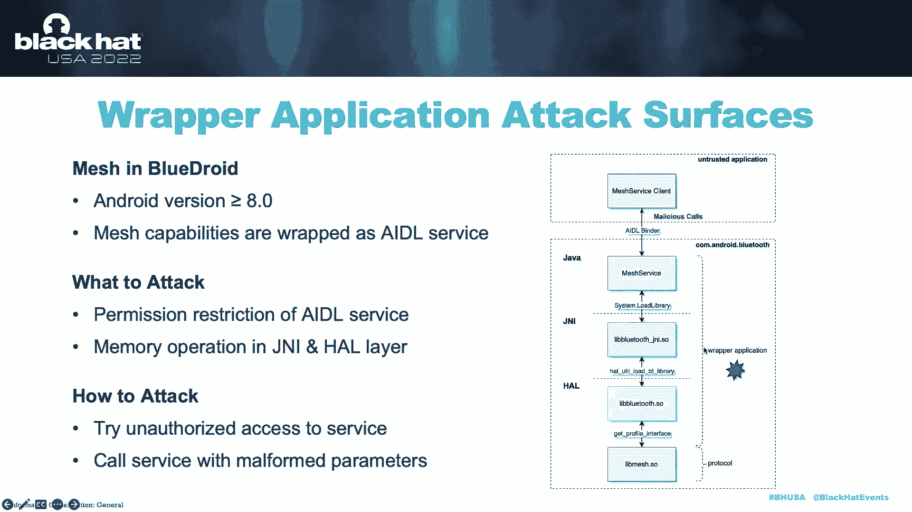

# 课程P58：065 - 蓝牙Mesh网络的新攻击面 🔓

在本节课中，我们将学习蓝牙Mesh网络技术的基本概念，并探讨其协议栈、网络构建与控制阶段以及封装应用中的常见攻击面。我们将了解攻击者可能利用的漏洞，并介绍一个名为BREmesh Fuzzer的自动化模糊测试工具。

---

## 第一部分：蓝牙Mesh技术基础 📡

上一节我们介绍了课程概述，本节中我们来看看蓝牙Mesh技术的基础知识。

蓝牙Mesh，也称为Bluetooth LE Mesh或BLE Mesh，是一种基于蓝牙低功耗（BLE）的无线Mesh网络技术。它由蓝牙技术联盟于2017年公开，现已广泛应用于智能家居、工业物联网等领域。

理解蓝牙Mesh时，一个关键问题是它与经典蓝牙或蓝牙低功耗的区别。主要区别在于，经典蓝牙和BLE是无线通信技术，类似于Wi-Fi；而蓝牙Mesh是一种组网技术，类似于TCP/IP协议栈。

下图展示了它们的协议栈对比。可以看到，蓝牙Mesh拥有一个网络层，而其他两者没有。正因为蓝牙Mesh是一种组网技术，其通信不再是简单的点对点，而是大量设备组成网络并相互通信。

网络中的设备被称为节点。节点有多种类型，但我们需要重点关注的是中继节点。假设节点A想发送消息给节点E，它可以将消息传递给中继节点Q，Q再将消息转发给E。在这个过程中，节点A实际上是将消息广播给附近的所有节点，但只有中继节点Q会执行转发工作。这种通信机制被称为“管理泛洪”。

我们了解了消息如何流动，但如何表示消息的源和目的地呢？事实上，就像TCP/IP一样，网络中的每个节点都有一个网络地址。地址主要有四种类型，我们重点关注其中两种：
*   **单播地址**：分配给网络中每个独立的节点。
*   **组播地址**：分配给一组节点。

从更高层次理解蓝牙Mesh通信，它采用基于消息的发布/订阅模型。发布意味着向特定地址发送消息，节点可以向单播地址或组播地址发布消息。订阅意味着开始接收发往特定目标地址的消息，节点可以订阅一个组播地址。

**总结**：蓝牙Mesh是一种基于BLE的组网技术，节点可以在网络中相互通信。

---

## 第二部分：攻击面范围 🎯

上一节我们介绍了蓝牙Mesh的基础，本节中我们来看看其攻击面的范围。

蓝牙Mesh的攻击面范围包括两个方面：协议本身和封装应用。协议由蓝牙技术联盟定义，而封装应用则是为上层应用提供蓝牙Mesh能力的软件框架。

我们将协议进一步划分为两个关键阶段：网络构建阶段和网络控制阶段。在本研究中，我们重点关注蓝牙Mesh实现中的漏洞，例如内存破坏漏洞。

---

### 网络构建协议攻击面

首先，让我们从网络构建协议开始。网络构建是新设备在Mesh网关的帮助下加入Mesh网络的过程。正式地，网络构建过程称为“配置”，Mesh网关称为“配置者”，新设备称为“未配置设备”。

网络构建协议包含五个步骤，但我们只需了解，未配置设备首先向配置者发送一个特定的信标，宣告其希望加入网络。随后，配置者与未配置设备建立链路，双方交换必要信息。这里有一个关键点：配置者和未配置设备会使用DH算法计算一个共享密钥，并利用该密钥进行基于某些厂商特定参数的认证。这意味着，厂商A的设备可能无法通过厂商B的配置者加入Mesh网络。最后，配置完成，设备发送链路关闭消息。

所有用于配置的消息都遵循特定的格式。整个数据包就是一个蓝牙低功耗广播数据包，这意味着蓝牙Mesh实际上是构建在蓝牙低功耗之上的。与配置相关的数据都封装在“通用配置PDU”中，特别是在“事务开始PDU”和“事务继续PDU”中。Mesh协议实现如何处理这些通用配置PDU是漏洞挖掘的关键点。

以下是网络构建阶段的攻击面分析：

首先，我们需要决定攻击时机。我们认为攻击应在认证之前进行，因为在此过程中不需要额外的厂商特定信息，因此攻击适用于任何厂商的设备。

其次，我们需要寻找攻击目标。我们发现分段与重组机制是一个完美的目标。该机制设计用于传输超长数据，通过“事务开始PDU”（第一段）和“事务继续PDU”（剩余段）实现。我们将其视为理想目标，因为它是所有Mesh设备都支持的通用机制，并且在接收和处理分段数据包时涉及内存操作，很可能导致内存破坏。

我们可以通过篡改与长度相关的字段来攻击分段与重组机制，这些字段包括 `segN`（总段数）和 `segIndex`（段索引）。我们稍后将展示针对此目的的自动化模糊测试工具。

**总结**：网络构建攻击面的威胁模型如下所示。攻击者可以是配置者，也可以是未配置设备。配置者可以在建立链路后，向受害的未配置设备发送畸形的分段数据包，漏洞将在受害设备重组数据时触发。类似地，恶意的未配置设备也可以在收到配置信标后，向受害的配置者发送畸形的分段数据包。

---

### 网络控制协议攻击面

接下来，我们看看网络控制协议。网络控制是一个设备向其他设备发送消息的过程，例如，开关发送消息来打开灯。我们称之为网络控制。

Mesh控制协议遵循分层架构，共有八层。我们只需关注网络层和传输层（更具体地说是低传输层）。在网络层，有网络地址字段，包括源地址 `SRC` 和目的地址 `DST`。在低传输层，有专为分段与重组设计的字段。

蓝牙Mesh原生支持安全特性，主要安全特性之一是消息混淆和加密。在蓝牙Mesh中，有两种用于加密的密钥：网络密钥 `NetKey` 和应用密钥 `AppKey`。`NetKey` 用于混淆和加密网络层字段，`AppKey` 用于加密上层传输层字段。因此，如果我们没有 `NetKey`，这些字段是加密的。但如果我们有 `NetKey`，就可以解析整个网络层和低传输层。如果我们同时拥有 `NetKey` 和 `AppKey`，就可以解析整个消息。

以下是网络控制阶段的攻击面分析：

与网络构建阶段类似，我们发现分段与重组机制是网络控制阶段的理想攻击目标。除了因为它是通用机制且涉及内存操作外，还因为分段与重组发生在低传输层，因此只需要 `NetKey`，而不需要 `AppKey`。为什么这是一个优势？我们需要知道，网络内的所有设备都拥有相同的 `NetKey`，但不同设备可能拥有不同的 `AppKey`。只要攻击者加入了Mesh网络，就可以获得 `NetKey`。这意味着攻击者可以向任何其他设备发送畸形的分段消息，并在重组时触发漏洞。攻击者可以篡改与长度相关的字段，例如控制位 `SegO`、段数 `SegN` 和段偏移 `SegO`。

**总结**：网络控制攻击面的威胁模型如下所示。从这个模型中可以看到，在蓝牙Mesh中，攻击向量不再局限于相邻设备。攻击者设备A可以借助中继节点E和F，向附近的受害设备B发送畸形的分段数据包，从而在受害设备重组数据时触发漏洞。

---

### 封装应用攻击面

最后，让我们找出蓝牙Mesh封装应用的攻击面。首先，我们需要定义什么是封装应用。Mesh能力被封装为Android蓝牙进程提供的AIDL服务。其他Android应用可以通过AIDL绑定来利用这些能力。例如，一个Android应用想要发送Mesh消息，它可以调用Mesh服务提供的相应接口，然后Mesh服务将消息转发给JNI层和HAL层，最终由蓝牙芯片实际发送出去。

假设攻击者是一个恶意的Android应用。从这个架构中，我们可以看到两个主要的攻击面：
1.  我们可以攻击AIDL服务的权限限制，尝试在没有适当权限的情况下调用Mesh服务。
2.  我们可以攻击JNI和HAL层中的内存操作。这两层通常使用C/C++实现，很可能导致内存破坏漏洞。因此，我们可以尝试使用畸形参数调用Mesh服务接口。

权限限制和内存操作是封装应用中的两大攻击面，我们将在案例部分展示更多细节。

---

## 第三部分：BREmesh Fuzzer 🛠️

上一节我们探讨了各个攻击面，本节中我们来看看BREmesh Fuzzer，这是我们设计的一个用于发现蓝牙Mesh网络构建和网络控制阶段漏洞的模糊测试工具。

因此，BREmesh Fuzzer由两个相应的子系统组成。

---

### 网络构建模糊测试子系统

这是网络构建模糊测试子系统的概述。模糊测试有几个必要步骤：我们需要生成测试用例，将其发送到目标设备，并监控目标设备的响应以检测崩溃。因此，BREmesh Fuzzer也遵循这个框架。

对于测试用例生成，我们将一系列分段数据包定义为一个单一的测试用例，并在每个模糊测试循环中一次性生成它们。然后，我们的发送器首先遵循正常的配置流程与目标设备建立链路。当轮到模糊测试器发送消息时，发送器会将测试用例中的每个数据包发送给目标设备。同时，我们监控目标设备的响应以检测崩溃。如果模糊测试器没有从目标设备收到链路关闭消息，我们就认为发生了崩溃。此外，监控串口日志也是一种检测崩溃的方式，但不同的开发板可能有不同的输出。相比之下，基于链路关闭的崩溃检测方法更为通用。

这两个序列图展示了网络构建模糊测试器的工作原理。第一个图展示了触发漏洞的情况。首先，模糊测试器生成一个由几个分段数据包组成的测试用例。然后，模糊测试器遵循正常的配置流程与目标设备建立链路。链路建立后，模糊测试器开始发送分段数据包，并等待链路关闭消息。假设这个“事务继续PDU”触发了目标设备的漏洞，导致目标设备崩溃，那么目标设备将丢失此配置会话的所有信息，因此永远不会向我们的模糊测试器发送链路关闭消息。回到模糊测试器端，第二个定时器超时，模糊测试器没有收到任何响应，因此会认为发生了崩溃，保存崩溃日志并清除定时器。

第二个图展示了未触发漏洞的情况。假设这个分段数据包被目标设备判定为无效并导致检查失败，目标设备会因检查失败而向模糊测试器发送链路关闭消息。然后模糊测试器知道这个测试循环失败了，只需重置定时器并开始下一个模糊测试循环。

现在我们已经建立了模糊测试框架，最后要做的就是定义如何生成测试用例。一个测试用例由一个事务组成。生成测试用例时，我们首先随机化页数 `1 + N`，然后随机化“事务开始PDU”的 `segN`（总长度）字段，并随机化“事务继续PDU”的 `segO` 字段，从而形成一个测试用例。

这是一个例子，模糊测试器生成了诸如 `segN` 等参数，这个测试用例最终导致了目标设备崩溃。

---

### 网络控制模糊测试子系统

网络控制模糊测试器也由三个主要模块组成：测试用例生成器、发送器和崩溃检测器。一个测试用例同样被定义为一组分段数据包。我们的模糊测试器会逐个将这些分段数据包发送给目标设备。请注意，发送器也会向目标设备发送一些探测数据包。探测数据包是有效的分段数据包，用于检测崩溃。通常，目标设备会响应探测数据包，发送确认（ACK）数据包。如果模糊测试器发现某些探测数据包的ACK缺失，则认为发生了崩溃。

为什么我们需要探测数据包，而不是仅仅监控测试用例的ACK来检测崩溃？这是因为测试用例ACK的缺失可能是由崩溃引起的，但也可能是由于无效数据包未被确认造成的，很难区分这两种情况。但对于探测数据包，ACK缺失就意味着崩溃。

这两个序列图展示了网络控制模糊测试器的工作原理。第一个图展示了触发漏洞的情况。首先，模糊测试器也生成一个由几个分段数据包组成的测试用例。然后，模糊测试器向目标设备发送第一个数据包以及一个探测包。我们可以看到，目标设备响应了分段数据包和探测包的ACK。接下来，模糊测试器发送第二个分段数据包，但这个数据包未被目标设备接受，因此不会有ACK，不过我们并不关心。模糊测试器收到了探测包的ACK，因此知道目标设备工作正常。然后，模糊测试器发送第三个分段数据包，并在目标设备上触发崩溃。接下来，模糊测试器再次探测目标设备，现在是关键点：如果目标设备上的Mesh服务永久崩溃，模糊测试器会发现探测包的ACK缺失，从而知道发生了崩溃。这是最简单的情况。但即使Mesh服务没有永久崩溃，我们仍然可以检测到崩溃，因为一旦崩溃，所有关于此分段和重组会话的信息都会丢失，因此ACK只会响应最后一个探测包，而缺失对前两个探测包的响应。如果我们发现ACK缺失，就知道目标设备上的Mesh服务已经崩溃。

对于未触发漏洞的情况，模糊测试器将收到所有探测包的ACK，从而知道没有发生任何情况。

测试用例生成与网络构建模糊测试类似。我们首先决定一个测试用例中包含多少个分段数据包，然后随机化 `segN`、`segO` 和控制字段，这些字段与长度相关。

这是一个例子，模糊测试器生成了几个相关参数，最终触发了目标设备的崩溃。

---

### 实现细节

我们在Nordic nRF模块上实现了我们的系统。由于蓝牙Mesh构建在蓝牙低功耗之上，我们需要找到能够发送原始BLE数据包的工具。为此，我们利用了Socket Driver。Socket Driver是一个优秀的开源蓝牙定制驱动，感谢他们的出色工作。接下来，我们基于Mesh规范实现了Mesh协议。这是一个展示网络层细节的代码片段。最后，我们在自行实现的协议基础上构建了我们的系统。

---

## 第四部分：真实世界漏洞案例 💥

上一节我们介绍了模糊测试工具，本节中我们来看看一些真实的漏洞案例。

截至2024年7月，我们共发现了17个问题，涵盖了多个厂商并获得了某些CVE编号。现在，所有列出的问题都已被厂商修复。在这一部分，我们将讨论网络构建阶段、网络控制阶段和封装应用中的漏洞。

第一个案例是网络构建阶段的一个越界写入漏洞。这里我们需要了解 `segN` 和 `total length` 字段。`segN` 表示段数，它是一个从0开始计数的值。例如，`segN` 等于3意味着整个消息被分成4个分段数据包。而 `total length` 表示整个消息的总字节数。在有效情况下，`segN` 和 `total length` 应该匹配。例如，`total length` 为65，`segN` 为2，意味着65个字节被分成3个分段数据包。

这个漏洞在于某Mesh SDK在网络构建阶段允许 `segN` 和 `total length` 不匹配。在这种情况下，攻击者首先向受害者发送一个 `total length` 为65但 `segN` 为30的“事务开始PDU”。受害者首先获取 `total length`，是65，受害者将分配65字节的缓冲区来接收所有分段数据包。但接下来，受害者会获取 `segN`，是30，它会认为总共有31个分段需要接收，这实际上是不正确的。因此，攻击者只需要发送一个段索引为3的畸形分段数据包。由于段索引3小于 `segN`，这个数据包将被接收并被视为有效。但段索引3意味着这是第四个数据包，这个数据包将被写入此处，最终导致越界写入。

这是攻击过程：我们首先与受害者建立链路，然后发送畸形的分段数据包，最终导致Mesh服务崩溃。

第二个案例是网络控制阶段的一个越界读取漏洞。同样，我们需要了解这两个字段：`segN` 和 `segO`。`segN` 也是段数，`segO` 类似于网络构建协议中的段索引，它表示当前数据包是第几个分段。在有效情况下，对于某个分段和重组会话，所有分段数据包中的 `segN` 应该相同。但在这个漏洞案例中，Mesh SDK允许 `segN` 不一致。攻击者首先向受害者发送一个 `segN` 为1、`segO` 为0的分段数据包，这没问题，意味着总共有2个分段数据包，这是第一个。受害者将获取 `segN`，由于总共有2个数据包要接收，它只为这两个数据包分配缓冲区。但接下来，攻击者会发送一个 `segN` 为31、`segO` 为2的畸形数据包。受害者只检查这里的 `segO` 是否小于这里的 `segN`，并将其存入缓冲区。同样，由于 `segO` 是2，这个数据包被视为第三个数据包，因此这个数据包将被越界读取，最终导致越界读取内存破坏。

这是攻击过程：只需改变不同数据包的 `segN`，第一个是1，其他是31，最终导致某厂商设备崩溃。从日志中我们可以看到，我们可以劫持PC和R0，因此这种崩溃可能导致远程代码执行（RCE）。

现在我们清楚了Mesh协议中的漏洞，接下来看看封装应用中的漏洞。第一个漏洞是Mesh服务中的权限泄露，这是在Android平台上发现的。尽管该服务进行了一些权限检查，但它将所有前台应用程序都视为被允许的调用者，因此任何应用程序都可以调用此服务接口，即使它们没有任何与蓝牙相关的权限。

这是攻击过程：一个没有任何权限的不可信应用可以成功调用Mesh服务。当然，这个漏洞只是一个入口，更多的漏洞可以通过使用畸形参数调用服务接口来触发。这是一个例子，这是某厂商Mesh JNI中的一个栈溢出漏洞。Mesh服务有一个接口接收来自调用者的数组，该数组从Java层传递到JNI层并复制到栈上。漏洞在于内存复制不检查数组长度，因此如果向该接口传递一个超长数组，将导致栈溢出。

---

## 总结 📝

本节课中，我们一起学习了蓝牙Mesh网络技术的基础、其协议栈的分层结构，并深入探讨了网络构建、网络控制以及封装应用三大核心环节中的安全攻击面。

我们了解到，分段与重组机制由于其通用性和涉及内存操作，在协议层是一个主要的脆弱点。同时，封装应用中的权限校验和本地代码实现也是需要重点关注的安全风险。

我们介绍了一个自动化模糊测试工具BREmesh Fuzzer的设计与工作原理，它能够有效地在网络构建和网络控制阶段发现漏洞。通过实际案例，我们看到了如何利用这些攻击面实现越界读写、权限绕过甚至远程代码执行。

目前，所有已发现的漏洞均已得到相关厂商的修复。对于未来的研究方向，我们计划增强模糊测试系统，采用反馈驱动的模糊测试策略。当前工作主要集中在网络层和低传输层，未来我们将对上层进行更深入的漏洞挖掘。此外，蓝牙Mesh还有许多有趣的功能，如GATT代理，我们可以探索GATT代理协议的攻击面。

我们希望我们的工作有助于提高蓝牙Mesh网络的安全性。