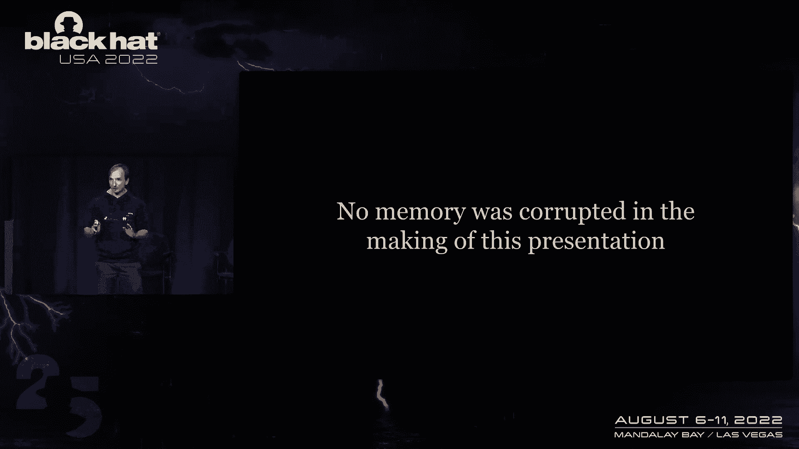
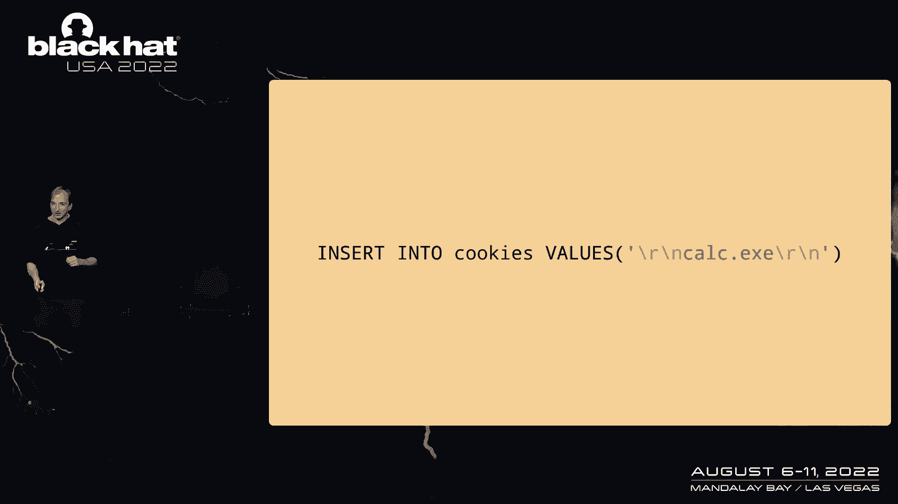
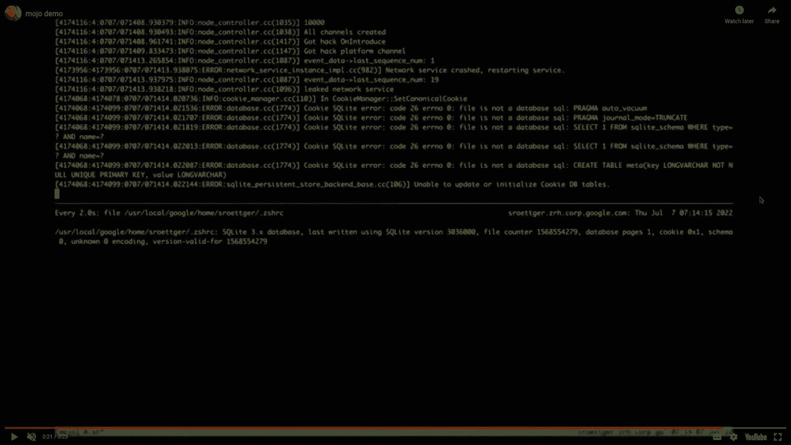
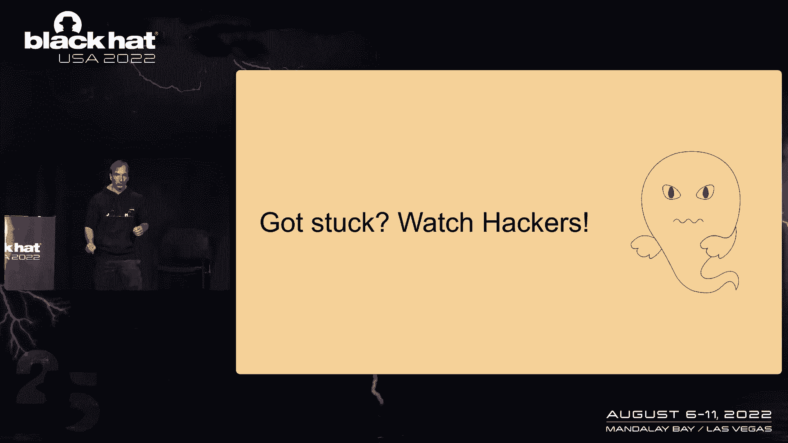

# P59：066 - Breaking the Chrome Sandbox with Mojo - 坤坤武特 - BV1WK41167dt

在我们开始之前，让我快速地向你们展示这次演讲的内容，所以我在玩铬，现在我的终端发生了奇怪的事情，打印这个计算器，每次我打开它，你可以从这次演讲的标题中猜到。

这是一个铬沙箱逃脱，尤其是在魔力方面，我们一会儿就会讲到，特别是，这是一个逻辑错误，在这次演讲的过程中，大厅里没有记忆，这意味着如果你希望一些新的精英喷洒技术，现在是你最后一次换房间的机会。

我其实有三块钱给你，三个逻辑美元，第一个就像一个很好的介绍，魔力是如何运作的，希望我们能解释内部工作原理，然后我们会得到一个非常痛苦的树皮，这真的很难利用，但在我们开始之前，我需要，我需要回顾一下背景。

我保证我会尽快的，嗯，这就是Chrome的样子，您有此浏览器进程，你有一堆其他的过程，大部分都是红色的，渲染器，渲染器是那些接触所有不受信任数据的人。

所以每当你接触一些html或运行一些javascript，这一切都将发生在这些渲染器进程中的一个中，这也意味着如果您有一个很酷的JavaScript引擎bug，并获得本机代码执行。

这是你最有可能结束的地方，这是实现这一目标的先决条件之一，为了这次演讲，因为我们说的是沙箱逃逸，只要假设技术已经在其中一个渲染器中执行了本地代码，然后你显然在沙箱里，否则我们就不必冲出沙箱了，对呀。

有趣的是渲染器本身是相互隔离的，所以即使你在邪恶的网站上运行你的漏洞，你有你的专家从邪恶到com，你不能只是从谷歌网站或其他地方阅读cookies，嗯，因为过程隔离仍然会保证一些。

一些Web安全基础知识，因为在沙箱里你不能和这样的东西说话，你不能做原始的网络连接，但是作为一个渲染器，您需要获取一些URL，因此，还有其他过程，它们被称为效用过程，比如说，你看这里，网络和GPU进程。

网络过程是你所想的，它应该从网络上获取东西，因此，作为渲染器，您可以询问网络进程，请拿食物或JS作为子资源什么的，所以当我说你在和另一个过程说话时，你需要一些沟通的方法，这被称为IPC机制。

Chrome中的IPC机制被称为Mojo，从软的标题，这就是我们要讨论的，这就是我们将试图利用的，你最终不会只是和另一个过程交谈，在上一个示例中的情况下，我们想取一个JavaScript，我们谈谈。

我们想加载URL，所以我们可以和一些URL加载器服务交谈，或者在左边你看到像东西，就像渲染者的房子是渲染者应该做的，但您也会看到一些渲染器不应该与之交谈的东西，GPU房子很明显只是为了让GPU容纳。

和这个说话，从名字上看不出来，所以一定有办法防止你说得像，允许你和他们中的一些人交谈，但不是全部，这些接口由一个叫做端口的东西支持，端口就像进程中的一些数据结构，港口有个名字。

名称是这个随机生成的两个8位的秘密值，嗯，两个进程总是与单个消息管道连接，取决于Linux上的S，比如说，这将是一个插座对，然后当您想与特定端口对话时，例如空气装载机的端口。

您将通过这个单套接字对发送消息，在它说一些的地方说，在里面的某个地方，哦，我想和X谈谈，其中x是Earlo的名字，Moja中的过程称为节点，所以从现在开始我可能会互换使用这些词，电线格式大致如下所示。

有两层信息，外层称为通道消息，这是节点到节点的通信，所以你，它是，就像一个网络协议，几乎在你有一些元数据可以交换的地方，例如，您可以看到广播事件，你可以让它广播，然后在用于端口到端口通信的消息层中。

你看这里，有效载荷为蓝色的事件消息，用户消息，例如，具有实际有效载荷的，所以当你真的要求嘿，请拿食物或JS，它将是K个用户消息类型，然后还有一些其他元数据的东西，你可以在这里看到，它们都有一个端口名称。

因为这是他们需要始终指定的端口通信的一部分，他们去哪个港口，你可能想知道，等等，不要，浏览器有时有信息，泄漏漏洞，您可以泄露这些端口名称，能有多糟，嗯，我两年前就这么做了。

其中一些实际上可以让你冲出沙箱，所以也许我们可以试着在这里做类似的事情，所以总结一下，这就是我们需要的背景，我想最重要的是如果你泄露了这些港口名称，那很糟糕，尽量不要这样做或尝试这样做。

取决于你试图实现的目标，所以让我们跳到第一个，第一个漏洞，所以你又有了，三个三个节点或三个过程，渲染器，浏览器、网络和渲染器现在想要获取食物或JS，但正如你在这里看到的，他们之间没有直接的联系。

但他们没有，他们没有插座对，然而，他们分享了这一点，他们需要有一种机制来建立新的联系，对，在魔力中，总有一个特殊的节点，网络中的第一个节点，这被称为代理节点，尤其是在铬中，这个经纪人，浏览器进程。

这样我们就可以，这个代理与网络中的每个其他节点都有直接连接，像这样是一切工作的先决条件，所以我们现在可以请经纪人或这里的浏览器向我们介绍网络，网络节点，那是怎么工作的，如你所料。

我们发送一条频道信息要求介绍，代理创建一个新的套接字对，然后它发送它拿一端，并向两个方向发送它，并发送一条名为Introduction的消息，因此它将渲染器引入网络节点，它向渲染器介绍网络。

他们接受这些，他们有一个黑暗的联系，现在渲染器可以取食物，cha，这里面有一个bug，所以假设我们有第二个渲染器，第二个渲染器有JavaScript bug，我们在那里有本机代码执行。

我们不知何故想打乱这个协议，对呀，我们能做好什么，问题是，当代理向对方介绍注释时，这引入了消息，缺少一个检查，即引入的消息只允许来自代理，因为如果你不，如果你不检查这个。

那么我们的这个鬼魂可以做这样的事情，在那里它创建自己的套接字对，它将一边发送到渲染器，到另一个渲染器，就像它可能是谷歌com渲染器说，就像另一边的网络进程，但它保持了连接的另一端。

我们在两个方向上都这样做，突然间我们成了中间的幽灵，在那里我们可以拦截渲染器和网络进程之间的所有通信量，你可以想象这不是很好，因为现在如果渲染器想取食物或JS，我们可以把我们自己的XSS有效载荷放进去。

并在另一个渲染器中获得JavaScript执行，我为此写了一个漏洞，至少UX是这样的，他们有可能用这个做得更多，但我觉得这很有趣，但在现实世界中，你实际上会这样结束，如果在这个呈现器中执行代码。

您危及渲染器，另一个END可能已经连接到网络节点，因为它可能在某个时候必须使用网络，那是不是意味着我们的进攻不会成功，因为当我们现在试图将另一个渲染器引入网络时，它已经有连接了，所以它会忽略消息。

但马克从零开始，有一个想法，他就像，你就不能破坏网络进程，因为浏览器太好了，它只会产生一个新的网络进程，如果你把旧的撞坏了，它就会注意到，然后就产生了一个新的过程。

我花了一个小时左右才找到一个没有指针的引用，这不是内存损坏，我只是撞坏了它，所以您在网络进程中使用一个旧的指针引用，它就会消失，浏览器注意到，产生了一个新的，你在另一个之前很快就连接到它。

然后你又回到了以前的情况，现在你可以把他们介绍给对方，并获得你的成功，所以这个是用这个修好的，介绍了这个补丁，当收到此引入的消息时，我们现在检查from node是否需要是代理名称，或者在本例中。

如果from node不是断开的名称，我们放弃连接，这正是你想做的，但它以后会超级有用，我们实际上会，我们以后还需要这个，所以请记住，但我也再给你看一次，让我们进入下一部分，所以这是第一个错误，但第二。

发生了什么，如果你有魔力，你想产生一个新的过程，你不是代理节点，你想产生一个新的过程，这个新的过程也应该被引入网络，我们以前看到的需求，代理需要与网络中的每个其他节点有直接连接。

所以需要有一种方法告诉经纪人，这很简单，协议只是起作用了，正如你所期望的那样，我们只要告诉经纪人，嘿嘿，这里有一个新的是一个，你知道，它被称为经纪人客户，我认为消息类型，经纪人现在需要创建一对足球组合。

这次它将保持一端，将另一个发送回渲染器，渲染器需要转发它，然后一旦它接受了这个，所以现在他们有了直接的联系，这个交换中的bug可能在哪里，听起来与以前的非常相似，到以前的设置，对呀。

所以也许我们可以在这里找到以前buk的变体，我们又回到了妥协的渲染器中，现在这个bug实际上非常相似，只不过恰恰相反，你还记得以前少了一张支票吗，它们应该是碎纸条上的，这张支票不见了。

那实际上是碎纸条上的，在这种情况下，检查是缺失的检查是相反的，也就是通常发送到断开节点的消息，我们可以把它发送到其他节点，所以另一个节点没有检查，如果他们是经纪人，当他们收到这条消息时。

这是我们刚刚看到的经纪人客户，所以说，如果我们在这个场景中告诉渲染器，嘿，我们刚刚在网络中添加了一个新节点，它被称为网络节点，渲染器实际上正在处理此消息的网络，创建了一个套接字对，留一个，送一个在后面。

我想这对你来说很熟悉，我们在两个方向上建造了这个，我们又是中间的鬼魂，我们有你的成功，到目前为止，一切都很好，对呀，就像，我觉得，这应该会给你一个关于我们可以用模块做的事情的快速概述。

以及协议是如何工作的，但现在有第三个虫子，第三个bug并不那么容易利用，第三个bug是，我认为最困难的开发，我一生中写过这么多，我们需要利用我们到目前为止所学到的一切，还有更多的东西可以利用。

所以它从这个思想实验开始，就像，好的，我们可以在网络中添加新的节点，这样我们就可以告诉经纪人，有一个新的节点，我们可以使用现有的节点名，比如说，我们可以告诉经纪人，嘿嘿，这是网络笔记。

经纪人会注意到的是在这种情况下，当然啦，就像我已经连接到网络节点一样，因此此消息无效，我们会忽略它，但正如我们以前看到的，我们还可以使网络进程崩溃，所以我们把它撞坏了，它就会消失。

我们发了这条消息告诉经纪人嘿，我们有一个新的过程，它被称为网络节点，这次经纪人会接受的，否则浏览器进程将接受，一开始好像不是很有用，除了事实证明这样做是一件非常酷的事情。

我们可以重用以前存在的节点的名称，在他们离开后，看看为什么这是有用的，让我们快速了解一下浏览器进程实际上在做什么，当网络进程崩溃时，这个插座就会关闭，浏览器看到这个，然后它会在一些哈希图中查找。

就像对等节点，它会删除码头节点，它会看到，哦，在不同的地图中，所有的港口都指向这个码头，它也会删除所有这些端口，然后这一切都发生在浏览器进程的线程上，然后它会处理我们的信息，上面写着，哦。

我们现在是网络进程，并允许我们重用这个名字，但所有的端口都没了，所以看起来有点没用，除了Chrome不仅仅是一个多进程浏览，它也是高度多线程的，那么同时会发生什么，第二个线程试图向端口发送消息。

网络上的一个端口网络进程，会发生什么就像从这个哈希映射中提取这个端口结构，它就会把它锁住，然后读出节点名称，然后浏览器进程，i o线程继续，允许我们重用节点名称，如果我们现在回到第二个线程和第二个线程。

现在尝试将消息发送到被读取的节点，它就会走错节点，它将流向我们，而不是现在不存在的节点，这意味着我们可以泄露消息，发送以这种方式发送的任何消息的任何节点的内容，这有点蹩脚，然后嗯，2。

这场赛跑看起来很不可能赢，所以让我们更好地尝试，现在这就是以前的补丁发挥作用的地方，就像你记得的那样，也不是经纪人送的，我们断开了连接，那么我们能做什么呢，那么如果我们作为这个妥协渲染器会发生什么。

我们要求网络进程向我们介绍经纪人，像这样没有意义，但又来了，少了一张支票，说明这条消息只能在破碎的纸条上处理，嗯，所以网络进程实际上会尝试这样做，所以它创建了一个插座对，然后发送介绍一个和给我们一个。

和到浏览器进程，我们有本机代码执行，我们可以修补代码，我们可以忽略之前的这个补丁，所以我们忽略这个信息，但是浏览器进程现在会触发这个代码，这个补丁中的代码，删除连接，就像它不会扼杀这个过程一样。

它就会断开连接，现在我们可以重用节点名，那么和以前有什么不同呢，过程仍然存在，我们可以盗取这个名字，我们可以重用仍然存在的进程的节点的节点名，这意味着如果我们能找到泄露端口名称的方法。

现在网络进程上的端口名称，然后我们就可以开始向它发送消息，并向这个端口发送消息，我们只需要想办法泄露一个端口名称，正如我们以前看到的，所以这个会很酷，如果我们能做到这一点，看看这是否真的有效。

我们需要再看看引擎盖下发生了什么，所以和以前一样，一旦插座靠近，浏览器进程将两个进程实际上将删除对等结构中的码头节点，他们会关闭这一切的，它们将在端口的错误处理程序上运行，它们是自定义的。

这取决于那里的接口类型，其中一个接口称为子进程主机，所以你看，就像子进程在客户端有服务器端一样，浏览器进程上的服务器端将在运行时杀死子进程，也就是说它会，它将杀死网络进程中的网络进程将退出。

如果子进程主机运行ON错误处理程序，然后在这种情况发生之后，我们可以重用左边的节点名，这意味着这不是很好，因为一旦网络进程消失，我们又回到了前一个案子，在那里我们不再有一个很酷的开发。

我们只是得到了这个蹩脚的原始，可能泄露了一些消息内容，大约在这个时候，我在听这个播客，这引起了我的共鸣，就是我放不下虫子，如果我发现一个我认为可能被利用的bug，我花了太多时间才让它真正起作用。

这是其中一个例子，看了足够长的时间，我真的顿悟了，顿悟很好，这些关于错误处理程序，他们在这一点上没有运行，就像我给你看的那样，这有点误导幻灯片，这些实际上是i o线程上的任务，所以他们作为任务排队。

这意味着他们实际上不必跑到这里来，但他们可以在我们使用noname后运行，如果我们足够快，我们可以，我们可以发送自己的消息来重用noname，在这些错误处理程序运行之前足够快，这意味着我们现在有机会了。

我们可以提高右边来重用节点名，就在ON空气处理器运行之前，在左边，我们也将这个节点名称或使用将发生在荣誉之前，而且跑得足够快，但更好的是，另一件很酷的事情是，当这些错误处理程序运行时。

他们做的一件事就是关闭港口，然后他们发出一个端口关闭事件，这个端口关闭事件现在交给我们，因为我们能够重用，如果我们足够快，我们可以重用音符名称，这个端口关闭事件将发送给我们，端口关闭事件的一部分需要。

当然是关闭的端口名称，也就是说这是我们的，这是我们想要的泄密，关于网络进程，浏览器进程告诉我们，嘿，我们刚刚我刚刚关闭了这个港口，它偶然告诉我们，然后在某个时候有一个支持。

子进程之家的on错误处理程序将杀死子进程，所以我们有，我们其实有时间，我们还有时间，从第一个端口关闭事件，这可能是完美的K端口K，它可以，也就是子过程屋，在这一点上，游戏结束了。

所以我们有一个非常紧的比赛窗口我们离开一个港口可以使用它，这是伟大的，除了总端口的数量大约是20个，这意味着我们有大约十个错误处理程序的时间窗口，大致为这个，但似乎有可能，至少。

但这两个这两个大问题对吧，就像这里有一场激烈的比赛，然后还有网络进程试图退出的激烈竞争，我们需要，我们需要两个都赢才能成功，这一点我差点放弃，因为我就像，好的，这似乎是可利用的。

但我可能永远不会让它成为一个可靠的，利用，这一切，所以嗯，也许只是报告它是可开发的，然后想象其余的对吗，然后我休息了一下，看了我最喜欢的电影，也就是所谓的黑客，如果你，如果你没有看过黑客，你应该。

这是最好的，我将跟随你的故事，虽然，所以在诘问者中，有个邪恶的家伙偷了很多钱，然后他写了一些勒索软件，那会使一艘油轮沉没，他还把这归咎于这群黑客，这群黑客试图证明他们的清白，他们需要黑进这个公司网络。

因为在其中一台机器上，有一份文件有一些他所做的事情的证据，现在的问题是这个公司网络有一个叫做吉布森的超级强大的机器，吉布森像傻瓜一样跑，这只会杀死所有的反向细胞。

就像他们在公司网络中有所有这些零天来执行代码一样，但这个吉布森会很快杀死相反的细胞，这一点我就像等一下，这是我的问题，这是我的故事，就像我也我有这个漏洞，我可以用它来得到一些法典执行。

但像这样这个经纪人会扼杀这个过程太快了，所以让我们来看看他们在电影中是如何解决的。

所以有两个媒体图标有一个像这些黑客一样的，在一个名为《射线与刀片》的电视节目中，见鬼的是他们去问他们，嘿嘿，你能帮我们吗，他们向世界发出求救信号，并要求世界上所有的黑客团结起来帮助他们。

就像每个人都把他们的零日扔在它得到共同的决定在同一时间，然后吉布森就会超载，不能，不能足够快地把他们都杀了，它为他们赢得了足够的时间来喜欢，泄露文件拯救世界，我就像，好的，嘿嘿，我们可以这样做。

如果你还记得第二个，我不能让世界上所有的黑客帮忙，但是，我们可以假扮成你，就像你记得的第二只雄鹿，有一种机制可以向网络中添加新的节点，我们可以在电机网络中添加新的进程，这意味着这些不一定是真的。

我们可以创建自己的假黑客大军，并将它们连接到网络进程，现在在电影中，他们发送病毒来争取时间，但在我们的情况下，病毒被称为广播请求，所以如果我们现在想象一下会发生什么，所以有另一个。

这个过程现在有一万个连接，就像我在用一万张假纸条一样，总是用一对插座把它们和我们连接起来，现在我们发出广播请求，所以现在网络进程需要制作一万个广播请求的副本，并将其发送到它拥有的每一个文件描述符上。

比我们花的时间长得多，只是发送这个请求，很完美，这很管用，它解决了一个问题，所以现在网络进程永远不会退出，就像完全被挡住了一样，关节炎完全阻断了，但联盟和猎杀之间的竞争仍然很激烈，所以吉布森。

我们还有吉布森的问题，吉布森还在找我们禁食，就是这个权利，从端口1到端口10，我们手头只有十个，所以，但解决方案也很简单，我们为什么不把这个数字做得很大呢，而不是有十个，我们靠一根头发和广播赚了一百万。

我们可以这样做，我们就可以，我们可以把端口发给他们，并告诉他们他们指向网络进程，浏览器进程将接受它们，你需要做一个小技巧，永远不要处理它们，但这并不重要，就像你可以，你可以把这些。

就像我用了一百万个端口一样，把它们送过来，切断连接，现在它需要在错误处理程序上花费一百万，它给了我们足够的时间来使用我们的泄漏端口名称，然后根据网络进程发送，这意味着我们做得对，我们解决了我们的问题。

现在我们泄露了一些信息来接受，如何向，i，o，网络进程的线程，如果我们现在也给网络过程下药，我们能不能把门关上再打开，也许像这样的东西，剂量在哪里运行，我们赶紧阻止它，一旦我们阻止了它。

它就会发现插座是关着的，它会摧毁所有的港口，它会让所有的空中处理人员排队，记住他们在阅读中的任务，2。我们从头再来，而这些在底部的任务上永远不会运行，因为DOS又在运行了，这意味着在这一点上。

我们实际上有时间注入这个信息的证明，只是处理消息也是一个两步过程，它首先需要读取消息，然后引导任务实际处理消息，我们想发送的这个信息可能正在阅读，这意味着我们需要让它读一条证明信息，在这里的某个地方。

在拒绝服务期间，事实证明这是可能的，我们只需要再增加一个技巧，嗯，在底部，你有妥协的渲染器，在顶部，您有网络进程，它们之间的所有这些线就像插座对，所以我们有大约一万个套接字对将我们连接到网络进程。

所以最初的想法只是把这些广播请求，只是一堆，i o线程将永远忙碌，但这不管用，因为那样我们就不能传递信息，所以我们需要一个更好的策略来真正解决L读，然后我有了一个想法如果我们用这个做点什么。

我们不是发送这些广播请求，我们查询了许多小信息，这些信息做了任何正确的事情，好像他们不做任何有趣的事情，他们在引擎盖下做什么并不重要，现在发生了什么，有一些选择调用所有这些文件描述符，它就会注意到。

哦等等，所有这些文件描述符都是可读的，让我在cutasks读他们的权利，所以现在有大约一万个任务要从这些文件描述符中读取，现在我们在这些得到处理之前，在那些运行之前。

我们只在第一个文件描述符上添加单个广播请求，所以现在当要从文件描述符读取的任务运行时，它会同时读取两条消息，然后它会先处理小消息，把它扔掉，现在到了一个广播请求。

广播请求的一部分意味着它实际上会给我们发回1万条信息，这样我们就可以跟踪这个广播请求的处理进度，当它在中间的某个地方，我们只需在下一个文件描述符上的集合上添加第二个广播请求，已经标记为阅读的。

并且已经有了一个任务，接下来将从中读取，所以现在发生的是它从下一个文件描述符读取，然后首先处理一条小消息并读取，还有我们的广播请求，所以我们可以让这个广播请求继续下去，这个拒绝服务动态地进行和进行。

并在处理这些请求时继续添加额外的广播请求，所以过了一段时间，这件事泄露了我们，我们感兴趣的这个端口名称，所以也许现在我们得到了这个港口名称，所以现在我们可以代替排队广播请求，我们只是不安全的恶搞信息。

同样的事情也会发生，在那里它将一起阅读这两条消息，把我们的感谢，使用我们的泄漏端口，现在我们所要做的就是停止拒绝服务，这意味着我们不会再暗示任何事情了，等到所有的信息都消失了。

它现在会处理我们的恶搞消息，现在我们又开始总务了，就是把一堆广播请求，在空中操纵器永远不会运行，但我们的信息会被处理，我们成功了对吧，就像这样现在我们可以有办法泄露端口名称，发送这条消息吧，唯一缺少的。

就像现在我们需要选择一个端口，我们有二十个港口，或者这样我们就可以从中选择，我们可以发送消息到，我们只需要选择合适的部分，或者喜欢港口后面的正确服务，然后我开始寻找，我穿过港口，我把所有的，他们是什么。

其中之一是子进程，子进程接口，这个看起来很有趣，因为它允许您产生新的服务，所以你可以让它，在流程中生成新服务，网络进程内部，一群在i o线程上创建的人，我们不想要那些，因为i o线程在我们的服务下。

所以我们实际上不能使用它们，但也有一堆服务将开始，主线程，所以我们可以用这些中的任何一个，我们可以启动这些中的任何一个，还有几个这样的，有一个故事服务视频捕捉，但第一个叫我的眼睛，第一个有点酷。

拍卖工作量服务，一开始听起来不像是会给你一些钱，除非你注意到这实际上是什么，它是一个JavaScript引擎，这个拍卖工作负载服务意味着它将产生另一个V8实例。

就像网络进程中的JavaScript引擎一样，所以它可以在没有沙箱的情况下运行，正如你所记得的，我们的先决条件是我们有一个妥协的渲染器，所以我们的渲染妥协可能是JavaScript BU已经正确了。

所以如果我们首先使用JavaScript条来使用代码，然后我们可以再次使用这个JavaScript bug，现在在网络进程中获得代码执行，我们结束了，除了这不起作用。

因为这个子进程接口总是在子进程主机之后被删除，子进程房子是杀死网络进程的房子，所以百分之百不可能在，当网络进程仍处于活动状态时，所以这不起作用，然后世嘉，格拉索夫和莫伦从零点给我指了这个。

它是http austatic para，在网络进程中调用网络服务，如果你和网络服务通话，您可以创建一个新的网络上下文，使用网络上下文，您可以创建一个新的URL加载器工厂，它允许您创建加载器。

然后将HP请求作为网络上下文配置选项的一部分，你可以说你有这些HP Austatic能力，有一个GSS API库名称，如果你看了评论，它说了一些关于相机的事情，所以每当你提出HP请求时。

它试图启动一些相机的东西来获得这个马力，或者谈判头什么的，它将从磁盘加载此库，执行右里面的任何东西，所以如果我们创建自己的网络上下文，将其指向我们在用户磁盘上控制的文件，例如在甜甜圈文件夹中。

然后发出用这个hp回复的http请求，也有一个，它将加载这个库，我们得到代码执行，除了这也不管用，就像我写的这个漏洞，我可以创建这个网络上下文，我可以创建一年的lofactory，我可以创建耳塞器。

我让它加载，向我的Web服务器发送HP请求，我的Web服务器回复，但是响应永远不会被处理，永远不会得到这个代码，我想这是因为，这一部分发生在线程上，因为我们在抛细线，游戏也结束了，里面可能有什么诡计。

但我想不通，但还有另一个配置选项，创建网络上下文时，就是存放饼干的地方，您可以将cookie存储在磁盘上，也就是文件部分，说像，哦，把饼干放在临时食物里什么的，它将在您的磁盘上创建升级3数据库文件。

如果你把cookie插入进去，它会把它添加到EQ中就像三个数据库文件一样，这意味着您插入的字符串，会在文件中间的某个地方结束，所以如果我们能找到一个翻译，从磁盘读取文件，忽略一堆垃圾。

从中间执行一些东西，那我们就没事了，那这就足够了，因为这是我们的原始，我们可以创建一个内容在中间的任意文件，控制中间的内容，我们只需要找到能执行它的东西，有什么东西。

至少在Linux和你可以使用的Windows上，尤其是在Linux上。

您可以使用您的shell RC，比如说，在我的情况下，我用我的Z C，你可能从演讲开始就记得这一点，所以在上面我运行这个。

需要喷射端口并可能创建这些假便笺名称的漏洞，在底部，我正在看我的z shell rc文件，上面说现在是ASCII文本，你应该写什么，但一旦出口完成，只需要几秒钟，你会看到它实际上变成了升级三个数据库。

然后我的Z壳，如果它看到这个文件，它会从中间执行一些东西，你可以在这里看到，一开始，就会像这个命令是什么，所有这些空字节太长了，它就会跳过它继续，然后它看到了一条新的线，打印计算器并。

那是，就像我从这次旅程中得到的个人收获。

因为这花了相当长的时间，我需要告诉自己这么做是值得的，这个目标有多重要，具体知识可以，无论是防守还是进攻，从防守的角度来看，真正理解这一点，这个协议是如何工作的，让我找到了盒子。

你用Fuzzer找不到的，就像你一样，您不能在模糊器中对此错误条件进行编码，我是说你可以，但你不知道你必须这么做，但另一方面，这些是反面的，它也超级有用，这些非常特定于目标的原语，可以超级有用。

就像我会，就不可能利用，这第三部分，我会放弃的，如果我不知道我们现在的情况，可以创造出这个假鼻子，这样我就可以发送端口等等，但我认为真正的收获是，如果你被卡住了，如果你被卡住了，休息一下。

观看黑客和井黑客，黑客可能会给你答案，谢谢。我们还有几分钟时间提问。

请走到麦克风前，如果你，如果你有问题，你也可以在推特上联系我，或者之后在溢出室联系我。

