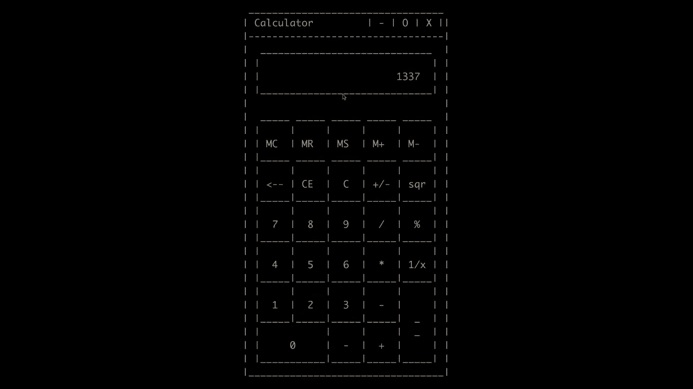
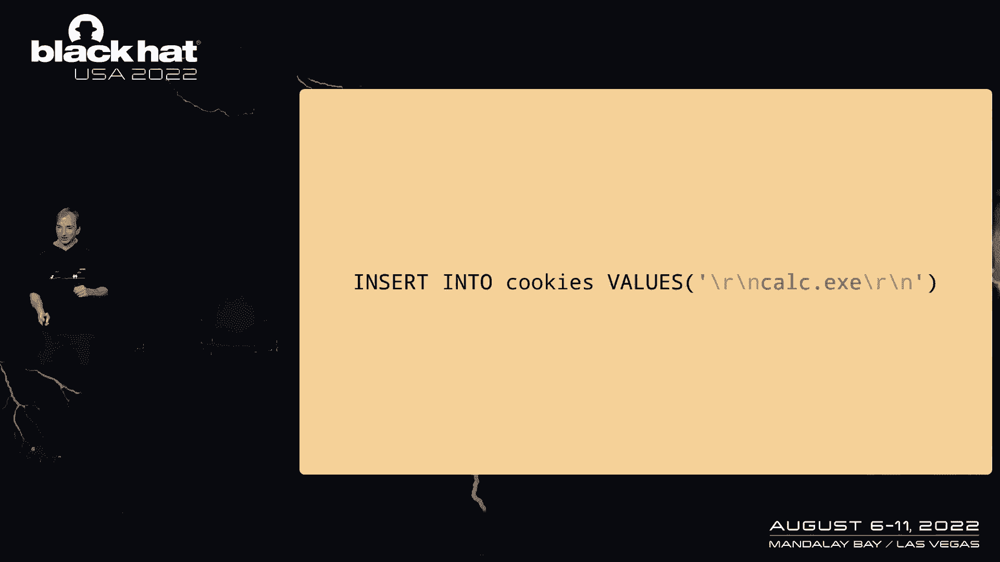
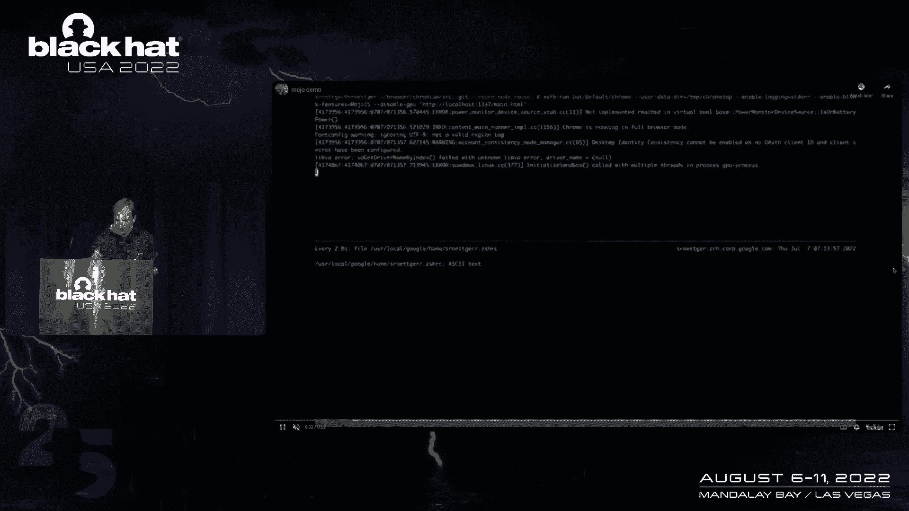
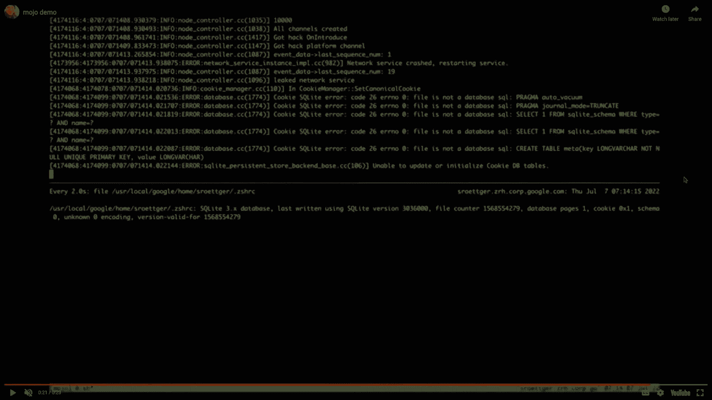
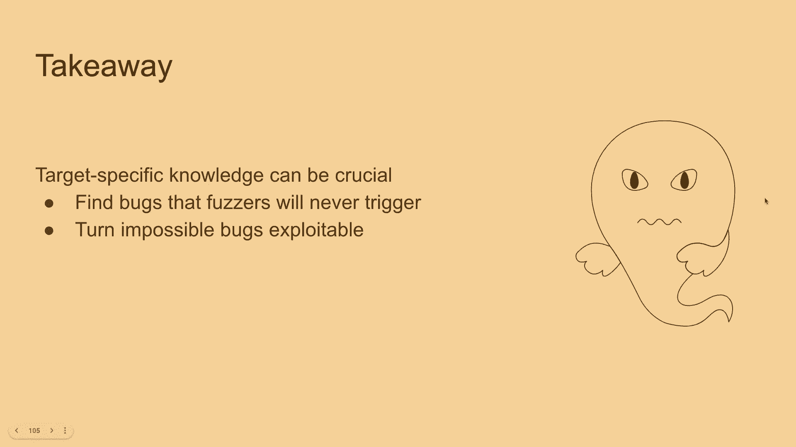
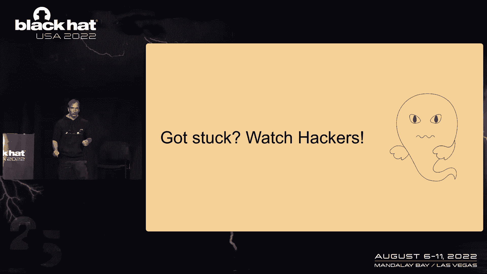

# 课程 P59：066 - 利用 Mojo 突破 Chrome 沙箱 🛡️➡️💥

在本课程中，我们将学习如何利用 Chrome 浏览器中名为 Mojo 的进程间通信（IPC）机制的逻辑漏洞，实现沙箱逃逸。我们将从基础概念开始，逐步分析三个具体的漏洞，并最终演示如何组合利用这些漏洞，从受限制的渲染器进程中获得系统级代码执行能力。

## 概述

Chrome 浏览器使用多进程架构和沙箱技术来隔离不受信任的代码（如 JavaScript），以增强安全性。渲染器进程负责处理网页内容，并被限制在沙箱中。进程间通过 Mojo 进行通信。本节课将深入探讨 Mojo 的工作原理，并展示如何通过逻辑漏洞绕过这些安全限制。

## 背景知识：Chrome 架构与 Mojo

在深入漏洞细节之前，我们需要了解一些背景知识。

Chrome 浏览器有一个主浏览器进程和多个其他进程，其中大部分是红色的渲染器进程。渲染器进程处理所有不受信任的数据，例如 HTML 和 JavaScript。这意味着，即使你通过 JavaScript 引擎漏洞获得了本地代码执行权限，也通常只限于在某个渲染器进程内。

渲染器进程之间相互隔离。即使你在恶意网站上执行了漏洞利用代码，也无法直接读取其他网站（如 Google）的 Cookie，因为进程隔离提供了基础的安全保障。

在沙箱中，渲染器进程无法直接进行原始网络连接。因此，Chrome 提供了其他进程，如网络进程和 GPU 进程（统称为“工具进程”）。例如，当渲染器需要加载一个 URL 时，它会请求网络进程去获取资源。

进程之间需要通信机制，在 Chrome 中这就是 Mojo。Mojo 是 Chrome 的 IPC 系统。从本次演讲的标题可以看出，我们将重点讨论 Mojo。

进程（在 Mojo 中称为“节点”）通过“端口”进行通信。端口由两个 8 字节的随机秘密值命名。两个进程通过单个消息管道（在 Linux 上是一个套接字对）连接。当你想与特定端口（例如 URL 加载器端口）通信时，你需要通过这个套接字对发送消息，并在消息中指定目标端口名称。

消息格式大致分为两层：外层是“通道消息”，用于节点到节点的通信；内层是“事件消息”，用于端口到端口的通信，其中包含实际的用户消息有效载荷。

一个关键点是：如果你能泄露这些端口名称，可能会导致严重的安全问题。事实上，过去就曾有过通过泄露端口名称实现沙箱逃逸的案例。

## 漏洞一：中间人攻击（MITM）🔑

上一节我们介绍了 Mojo 的基本通信模型。本节中，我们来看看第一个漏洞，它允许一个被攻陷的渲染器进程在其他进程之间充当中间人。

假设我们有三个节点：渲染器、浏览器（代理）和网络进程。渲染器想从网络获取资源，但它与网络进程之间没有直接连接。网络中总有一个特殊的“代理”节点（在 Chrome 中是浏览器进程），它与所有其他节点都有直接连接。

渲染器可以请求代理将其“介绍”给网络节点。代理会创建一个新的套接字对，将一端发送给渲染器，另一端发送给网络进程，从而建立直接连接。

这个协议中存在一个漏洞：当代理发送“介绍”消息时，缺少一个检查，即该消息只允许来自代理节点。如果一个被攻陷的渲染器伪造了这样的“介绍”消息，它就可以创建一个套接字对，将一端发送给另一个渲染器（例如访问 google.com 的渲染器），并声称另一端是网络进程，而实际上它自己保留了连接的另一端。

通过双向进行此操作，被攻陷的渲染器就能成为中间人，拦截所有渲染器和网络进程之间的流量。例如，当渲染器请求加载 food.js 时，攻击者可以注入自己的 XSS 载荷，从而在另一个渲染器中执行 JavaScript。

**利用挑战与解决**：在实际场景中，目标渲染器可能已经连接到网络进程。但攻击者可以故意使网络进程崩溃（例如，通过触发一个无指针引用的逻辑错误）。浏览器会发现网络进程崩溃，并生成一个新的网络进程。攻击者可以快速连接到这个新进程，然后执行中间人攻击。

**修复**：补丁在接收“介绍”消息时，添加了检查，要求发送方节点必须是代理节点。这个修复在后面会变得很重要。

## 漏洞二：伪造新节点加入 🌐

上一节我们看到了如何滥用“介绍”协议。本节中，我们来看一个与之对称的漏洞，涉及节点加入网络的协议。

如果一个节点（非代理）想要生成一个新进程并将其引入网络，它需要告诉代理。代理会创建一个套接字对，保留一端，将另一端发送回请求的节点，由该节点转发给新进程。

这个交换中的漏洞与第一个漏洞相似但相反。之前是缺少检查“介绍”消息的发送方。而这里缺少的检查是：通常发送给代理节点的“BrokerClient”消息，可以被发送到其他节点，而其他节点没有检查自己是否是代理。

因此，被攻陷的渲染器可以告诉网络进程：“嘿，网络中添加了一个新节点（其实就是我自己）”。网络进程会处理此消息，创建一个套接字对，保留一端，将另一端“发回”给攻击者。这样，攻击者再次成为中间人。

这两个漏洞展示了 Mojo 协议中可能存在的逻辑缺陷，并为理解更复杂的利用奠定了基础。

## 漏洞三：端口名称泄露与复杂利用链 ⛓️

前两个漏洞相对直接。本节我们将探讨第三个也是最难利用的漏洞，它需要组合运用之前学到的知识。

这个漏洞始于一个思想实验：我们可以告诉代理有一个“新”节点加入，并使用一个已存在节点的名称（如网络进程）。通常，代理会拒绝，因为它已经连接到该节点。但是，如果我们先使该节点崩溃，代理就会接受这个“新”节点，并允许我们重用其名称。

这有什么用？当网络进程崩溃时，浏览器进程会清理相关的端口数据结构。如果我们能在清理完成前快速重用该节点名称，那么其他线程尝试向旧端口发送的消息就可能错误地流向我们，从而可能泄露消息内容。

但这存在一个激烈的竞争条件，并且泄露的消息可能没什么价值。此时，之前漏洞的修复发挥了作用：修复后，非代理发送的“介绍”消息会被拒绝并断开连接。我们可以利用这一点：让网络进程尝试向代理介绍我们，触发代理断开与网络进程的连接，但网络进程本身仍然存在。这样，我们就有机会“窃取”这个仍然存活的进程的节点名称。

**关键突破**：我们需要泄露网络进程上的一个端口名称。我们发现，当连接断开时，浏览器进程会排队运行端口的错误处理程序（作为任务）。如果我们能足够快地重用节点名，在这些错误处理程序运行之前，我们就能收到一个“端口关闭”事件，而这个事件正好包含了我们想要的端口名称！

**解决竞争条件**：我们面临两个激烈的竞争：1) 在错误处理程序运行前重用节点名；2) 网络进程可能很快退出。为了解决网络进程过早退出的问题，我们借鉴了电影《黑客》中的思路：用大量虚假连接淹没目标。我们可以利用第二个漏洞，向网络进程“介绍”成千上万个我们控制的虚假节点。然后，我们向网络进程发送“广播请求”，这会迫使它向所有连接发送消息，从而严重拖慢其处理速度，为我们赢得时间。

**解决端口数量限制**：我们最初可能只有约20个端口需要处理。我们可以通过发送大量虚假端口指向网络进程，使浏览器进程需要处理海量的错误处理程序任务，从而极大地延长我们的时间窗口。

**最终利用步骤**：
1.  **建立拒绝服务（DoS）**：用大量虚假节点和精心安排的广播请求淹没网络进程的 I/O 线程，使其忙于处理消息，延迟错误处理程序的执行。
2.  **泄露端口名称**：在 DoS 期间，触发断开连接和端口关闭事件，从而泄露网络进程上的一个端口名称。
3.  **发送恶意消息**：使用泄露的端口名称，向该端口发送我们精心构造的恶意消息。在 DoS 期间，这些消息会被读取但暂不处理。
4.  **停止 DoS，执行载荷**：停止发送干扰消息，让网络进程处理我们之前发送的恶意消息。
5.  **实现代码执行**：我们需要选择一个能导致代码执行的服务端口。经过分析，我们发现可以通过“网络服务”接口创建一个新的网络上下文，并设置其将 Cookie 存储到磁盘的指定文件（一个 SQLite 数据库文件）。我们可以控制写入该文件的内容。在 Linux 系统上，我们可以让文件内容是 shell 的配置文件（如 `.zshrc`），并在文件中间插入恶意命令。当 shell 读取这个“损坏”的配置文件时，会跳过无法解析的部分，最终执行我们插入的命令，从而实现沙箱逃逸。

## 总结

在本节课中，我们一起学习了：
1.  Chrome 的沙箱架构和 Mojo IPC 机制的基本原理。
2.  三个 Mojo 协议中的逻辑漏洞：未经检查的节点介绍、伪造新节点加入、以及通过竞争条件重用节点名并泄露端口信息。
3.  如何将多个漏洞和技巧（如使进程崩溃、制造拒绝服务条件、利用文件格式特性）组合成一条复杂的利用链，最终从受限制的渲染器沙箱中逃逸，并在更高权限的进程（网络进程）中执行任意代码。

这次研究展示了深入理解目标系统内部工作原理的重要性，无论是对于防御者发现深层漏洞，还是对于攻击者构造复杂利用都至关重要。同时，它也提醒我们，在面对棘手问题时，有时跳出固有思维、从其他领域（甚至电影）寻找灵感可能会带来意想不到的解决方案。