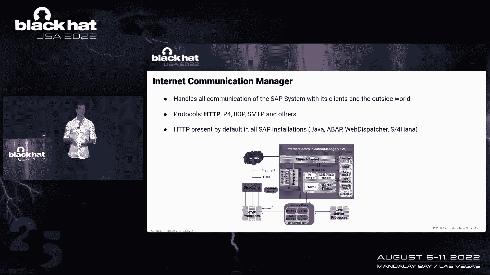
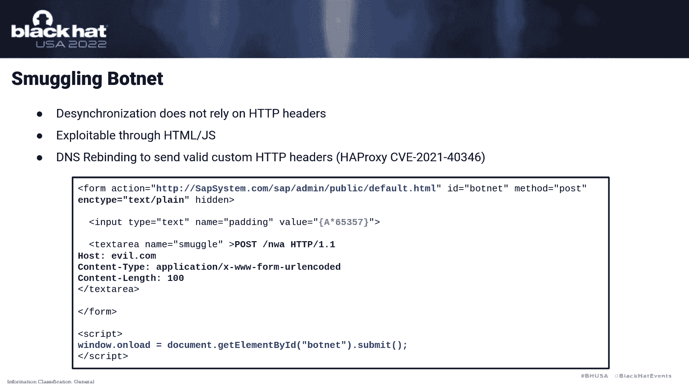
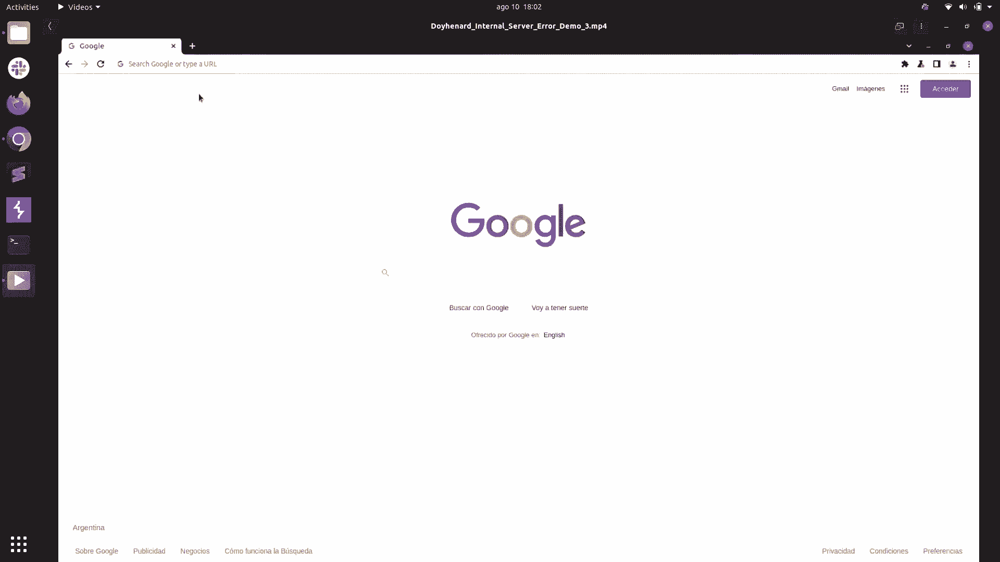

# 课程 P6-006：SAP ICM 内部服务器错误与进程间通信漏洞利用 🚨

在本课程中，我们将深入探讨SAP系统中一个关键组件——Internet Communication Manager（ICM）的安全漏洞。我们将学习ICM如何处理HTTP请求，以及攻击者如何利用其进程间通信（IPC）机制中的缺陷，实现请求走私、会话劫持甚至缓存投毒等攻击。这些漏洞影响深远，因为ICM默认存在于所有SAP系统中。

## 概述：SAP ICM 架构与工作原理 🏗️

SAP开发的企业软件被众多公司用于管理其核心业务流程。这些软件大多基于可通过HTTP访问的Web服务。处理SAP系统与外部世界（如客户、员工或其他SAP系统）所有通信的核心组件，就是Internet Communication Manager（ICM）。

ICM存在于所有SAP系统中，是SAP内核的一部分。它能够处理多种协议，但其主要目的是处理HTTP和HTTPS流量。由于我们没有ICM的源代码，因此需要通过逆向工程来理解其工作原理，这也是发现漏洞的关键。

### ICM 的抽象工作流程

为了理解ICM的工作方式，我们将其架构简化为几个核心部分。ICM可以被看作是一个接收客户端请求并返回响应的系统。

1.  当客户端建立TCP连接时，ICM会创建一个**工作线程**来处理该连接的所有请求和响应。
2.  工作线程使用HTTP解析器和一系列**内部处理程序**来解析请求并生成响应。
3.  如果请求无法在ICM内部处理（例如，需要业务逻辑），工作线程会将请求通过**内存管道**转发给一个辅助进程（如Java进程）。
4.  辅助进程处理请求后，将响应通过内存管道送回ICM，再由ICM发送给客户端。

### 内存管道（MPI）机制

内存管道（MPI）是ICM与辅助进程（如Java工作进程）之间用于高效交换数据的框架。它实际上使用**共享内存**来传递数据指针。

*   **MPI缓冲区**：这是共享内存中一个固定大小为65KB的缓冲区。
*   **指针传递**：工作线程和辅助进程通过发送指向MPI缓冲区的指针（称为MPI指针）来交换请求和响应数据。
*   **缓冲区管理**：缓冲区由工作线程和辅助进程通过MPI处理程序进行保留和释放。

让我们看一个具体的工作示例：

1.  请求到达工作线程的输入句柄（TCP套接字）。
2.  工作线程准备处理时，会通过MPI处理程序在共享内存中**保留一个MPI缓冲区**，并将请求存储其中。
3.  工作线程尝试使用内部处理程序解析请求。如果无法解析，则通过发送**MPI指针**将请求转发给辅助进程。
4.  辅助进程收到指针后，在共享内存的对应位置读取请求，生成响应。
5.  辅助进程**保留另一个MPI缓冲区**存放响应，并将指向该缓冲区的指针发送回工作线程。
6.  工作线程将响应转发给客户端。
7.  最后，MPI缓冲区被释放，指针丢失。

## ICM 的内部请求处理程序 🔧

上一节我们介绍了ICM的基本流程，本节中我们来看看ICM如何具体解析一个请求。当请求到达时，解析器会根据URL决定调用哪些**内部处理程序**。每个处理程序都有特定功能。

以下是ICM中一些主要的内部处理程序：

*   **缓存处理程序**：这是第一个被调用的处理程序。它会在缓存中查找请求URL对应的存储对象。如果找到，则直接返回响应；如果失败，则继续下一个处理程序。
*   **管理处理程序**与**身份验证处理程序**：默认存在，但只有当URL匹配特定模式（例如，以 `/sap/admin` 开头）时才会被列入处理列表。
*   **ABAP、文件服务、直接处理程序**：这些默认不存在，需要在SAP系统启动前于配置文件中特别设置。
*   **Java处理程序**：这是最后一个处理程序，用于将请求转发给Java辅助进程。它总是被包含在处理列表中。

处理流程的关键在于：**一旦某个处理程序成功解析了请求并生成了响应，循环就会终止，响应会被发回客户端，请求-响应周期完成。**

### 标准请求处理示例

假设一个GET请求到达URL `/sap/admin`。

1.  工作线程保留MPI缓冲区并存储请求。
2.  解析器选择处理程序列表：缓存处理程序、管理处理程序（因为URL前缀匹配）、Java处理程序。
3.  首先调用**缓存处理程序**，假设失败。
4.  接着调用**管理处理程序**，假设它成功解析请求并生成响应。
5.  此时，**Java处理程序**将从列表中移除，不会被调用。
6.  管理处理程序生成的响应被直接发回客户端。
7.  MPI缓冲区被释放，周期结束。

## 漏洞一：HTTP请求走私与同步丢失 🔓

现在，我们来看第一个关键漏洞。ICM的设计有一个潜在问题：它没有预料到**内部处理程序能够解析带有请求体的长请求**。

### 长请求的处理异常

MPI缓冲区大小固定为65KB。如果一个请求的**体（Body）超过65KB**，ICM会进行特殊处理：

1.  工作线程保留一个MPI缓冲区，只存储请求的**前65KB**（通常包含头部，ICM认为这足以让内部处理程序解析）。
2.  如果内部处理程序无法解析，需要转发给Java进程时，ICM才会保留额外的MPI缓冲区来存储请求体的剩余部分。

**漏洞在于**：如果发送一个**长请求**，但其URL恰好能被某个**内部处理程序**（如管理处理程序）解析，会发生什么？

1.  工作线程存储前65KB数据。
2.  内部处理程序成功解析请求并生成响应。
3.  响应被发回客户端，MPI缓冲区被释放，请求周期看似结束。
4.  **但是**，请求体中超过65KB的剩余数据还留在TCP连接缓冲区中。
5.  工作线程会读取这些剩余数据，并将其**视为一个新的、独立的请求**。

这就导致了 **HTTP请求走私** 攻击。攻击者可以构造一个特殊的请求，在代理服务器看来是一个完整的请求，但被ICM拆分成两个请求。这破坏了代理与后端ICM之间的请求同步。

### 利用请求走私劫持用户会话

这个漏洞本身似乎不严重，但结合SAP的其他功能，就能造成巨大危害。例如，利用SAP NetWeaver（NW）的一个端点，该端点存在**开放重定向**和**参数反射**的特性。

攻击者可以构造一个攻击链：

1.  **攻击者**发送一个走私请求，其“第二部分”是一个对NW端点的POST请求，其中`Host`头指向攻击者控制的域名。
2.  ICM处理完第一部分后，将第二部分留在缓冲区，等待更多数据（因为`Content-Length`声明了需要更多字节）。
3.  **受害者**向代理发送一个正常请求（包含其会话Cookie）。
4.  代理将这个受害者请求与ICM缓冲区中等待的“第二部分”拼接，形成一个完整的POST请求发给ICM。
5.  ICM处理这个拼接的请求，NW端点生成一个**重定向响应**，指向攻击者的域名，并在重定向URL的查询字符串中**反射了受害者请求的部分内容（包括Cookie）**。
6.  **受害者的浏览器**收到重定向，自动向攻击者的域名发起请求，从而将包含会话Cookie的查询参数发送给攻击者。

这样，攻击者就成功劫持了受害者的会话。更可怕的是，这种攻击可以通过一个包含恶意JavaScript或HTML表单的网页来持续进行，形成一个“僵尸网络”，只要受害者访问该页面，就会不断成为攻击者。

## 漏洞二：内存管道竞争条件与缓存投毒 💉

在研究了第一个漏洞后，我们进一步探索了ICM的管道请求处理机制，发现了另一个更底层的漏洞。

### 管道请求与缓冲区释放竞争

ICM支持HTTP管道，即允许在同一个TCP连接中发送多个请求。当处理管道请求时，ICM会为每个请求分配独立的MPI缓冲区。

**漏洞场景**：发送一个**长请求**，并在其末尾附加一个**管道请求**。

1.  工作线程为长请求的前65KB分配缓冲区A，为剩余部分分配缓冲区B。
2.  HTTP解析器发现管道请求，为其分配缓冲区C。
3.  长请求被处理，响应返回。
4.  此时，ICM会释放**与该工作线程关联的所有MPI缓冲区**（A、B、C），而不是逐个释放。
5.  缓冲区C被释放，但工作线程即将用它来处理管道请求，这导致了**释放后使用（Use-After-Free）** 的竞争条件。

### 利用竞争条件篡改请求与响应

攻击者可以利用这个竞争条件：

1.  **劫持缓冲区**：攻击者发送上述构造的请求，导致一个MPI缓冲区（如缓冲区C）被释放但指针仍被引用。
2.  **受害者介入**：如果此时另一个客户端（受害者）发起请求，工作线程可能会**重新分配并使用刚刚被释放的缓冲区C**来存储这个新请求。
3.  **攻击者篡改**：在受害者请求被放入缓冲区C后、被处理前，攻击者通过发送不完整的请求数据，可以**向同一个缓冲区C的特定偏移量写入数据**，从而篡改受害者的请求内容。
4.  **恶意响应**：被篡改的请求被发送到Java进程处理，生成的恶意响应返回给受害者。例如，可以将响应篡改为一个指向攻击者域名的重定向，再次实现会话劫持。

### 升级攻击：缓存投毒与任意响应写入

更危险的是，MPI缓冲区是通用的，既用于存放请求，也用于存放响应。攻击者可以尝试篡改**响应缓冲区**。

1.  在竞争条件下，攻击者可能劫持一个即将用于存放Java进程响应的MPI缓冲区。
2.  当Java进程将响应写入这个被劫持的缓冲区后，攻击者可以立即向其中写入恶意数据（例如，一个恶意JavaScript脚本）。
3.  关键一步：在篡改的数据中，包含一个特殊的SAP内部头部：**`SAP-Cache-Control: public, max-age=31536000`**。
4.  当工作线程将这个被污染的响应发回给客户端时，**缓存处理程序**会看到`SAP-Cache-Control`头部，认为此响应应该被缓存。
5.  于是，缓存处理程序将**这个被篡改的、包含恶意脚本的响应**与请求的URL关联起来，存入磁盘缓存。
6.  此后，**任何其他用户**访问同一个URL，都会从缓存中收到这个恶意响应，从而实现持久的、影响所有用户的**缓存投毒**攻击。

通过自动化脚本反复尝试，攻击者可以成功污染关键页面（如登录首页），危害极大。

## 总结与影响 📝

本节课中我们一起学习了SAP ICM组件中两个严重的漏洞链：

1.  **HTTP请求走私（CVE-2020-6287）**：利用ICM对长请求处理的逻辑缺陷，破坏请求同步，结合其他功能实现会话劫持和僵尸网络攻击。
2.  **内存管道竞争条件（CVE-2020-6286）**：利用ICM处理管道请求时的缓冲区释放竞争，实现请求/响应篡改，并进一步升级为持久的缓存投毒攻击，可向任意页面注入恶意内容。

这些漏洞之所以关键，是因为：
*   **影响范围极广**：ICM默认存在于所有SAP系统（包括SAP NetWeaver, ABAP, HANA, 甚至云环境和负载均衡器SAP Web Dispatcher）中，并且通常直接暴露在网络上。
*   **利用门槛降低**：攻击不依赖于注入特殊的、可能被代理过滤的HTTP头部，使得利用更加容易和隐蔽。
*   **危害性极高**：从窃取单用户会话到污染全局缓存，攻击者可以完全控制应用程序行为。

SAP官方将这些漏洞评级为“高危”并发布了安全补丁。同时，也提醒我们，对于企业核心基础设施中广泛使用的、符合标准协议（如HTTP）的组件，进行深入的逆向工程和安全测试至关重要，因为其攻击面巨大，且利用技术可以不断演进。