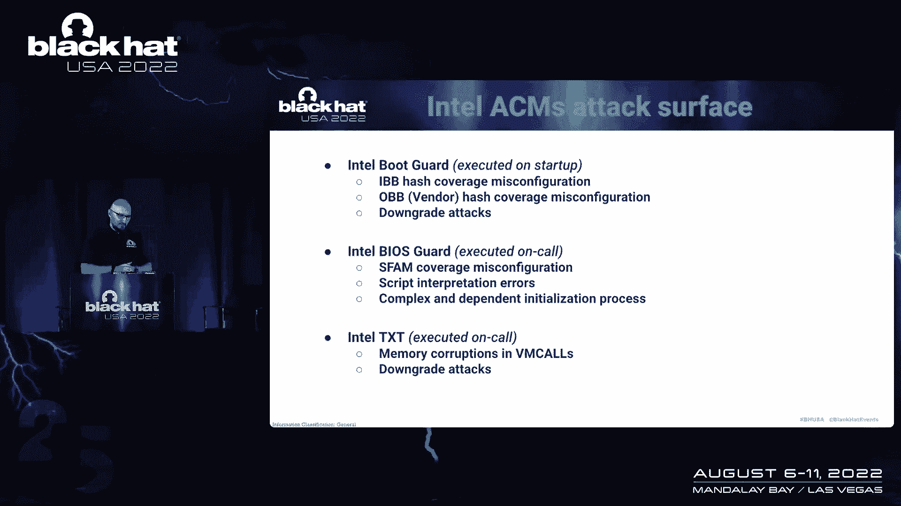

# 课程 P60：067 - 从 Pre-EFI 破坏固件信任：利用早期引导阶段 🔓

在本节课中，我们将学习如何通过攻击计算机启动过程中最早期的阶段（Pre-EFI/Pre-UEFI）来破坏固件信任。我们将探讨这些早期引导阶段的漏洞，了解它们为何危险，以及攻击者如何利用它们绕过高级安全防护措施。

## 概述

本次课程内容基于 Alex Matrosov 及其团队的研究。我们将深入探讨 Pre-EFI 阶段的攻击面，分析多个具体漏洞案例，并理解它们如何影响整个平台的安全边界，包括绕过诸如 Intel Boot Guard、PPM 等安全缓解措施。

---

## 研究背景与重要性

上一节我们介绍了课程主题，本节中我们来看看这项研究是如何开始的。

这项研究始于对 Intel Boot Guard 以及如何修改控制引导过程数据的讨论。这反映了跨越不同安全边界时，对安全特性的影响会发生变化。研究团队之前已经深入探讨过 Pre-EFI 中的一些漏洞。

一个关键的发现是，固件漏洞空间的研究被忽视了。系统管理模式下的内存损坏漏洞自21世纪初就已为人所知，但至今仍然存在。当使用C语言编写固件时，就为内存损坏创造了条件。

**核心概念：系统管理模式**
系统管理模式是 x86 系统中最强大的模式之一。负责此模式的平台固件模块复杂度极高，这不可避免地会引入一些可被绕过的缺陷。

在我们深入研究 PI（平台初始化）驱动阶段的漏洞之前，让我们先谈谈 ACM。

---

## 认证代码模块

ACM 是一个经过身份验证的代码模块。可以将其视为一个独立的二进制文件，与固件分开执行。它被直接加载并锁定在 CPU 的缓存中。

有趣的是，ACM 的复杂性也在增长。研究团队之前已经展示过，在 BIOS 保护启动之前，TCB 中就存在漏洞。ACM 的模块大小增长了约五倍，从约 52KB 增长到了 256KB。当代码库增长时，攻击面也随之扩大。

从攻击面的角度来看，仅今年就在 ACM 中发现了约十个漏洞，这表明它是一个重要的攻击目标。

---

## Pre-EFI 攻击面与威胁模型

上一节我们介绍了 ACM，本节中我们来看看 Pre-EFI 的攻击载体和潜在影响。

Pre-EFI 阶段之所以危险，是因为它在 PI 引导阶段（即平台初始化阶段）之前就开始了。此时需要初始化许多安全特性，但很多内存保护尚未启用。

与操作系统运行时相比，Pre-EFI 空间为攻击者提供的代码执行能力可能有限，但它可以用来绕过许多尚未启用的安全功能。所有基于操作系统的历史缓解措施，如 DMA 保护，都可以被绕过，因为它们是 UEFI 标准固件的一部分。

从规范或标准的角度重新审视不同的引导阶段如何影响新的安全特性非常重要。复杂性永远是安全的敌人，这一点从发现的漏洞数量上可以得到印证。

以下是本次讨论中涉及的12个漏洞的摘要：
*   所有漏洞建议均已上传至 Binarly 网站，部分 PoC 公开可用。
*   这些漏洞不仅影响单个设备供应商，还波及整个生态系统，因为不同设备产品线使用了类似的代码。

感谢所有 PSIRT 团队的努力，帮助我们及时处理了这些漏洞。

---

## 具体漏洞案例分析

上一节我们概述了攻击面，本节中我们将深入分析几个具体的漏洞案例。

### 案例一：PI 阶段漏洞与供应链问题

这个漏洞非常有趣，因为它也揭示了供应链问题。该漏洞最初存在于一个公共参考代码中，当代码被分叉和修改时，漏洞被引入了。

**核心概念：漏洞原理**
该漏洞涉及一个 `GetVariable` 函数。攻击者可以访问 ACPI 表中的 `FPDT` 变量，并将其指针替换为一个指向攻击者控制缓冲区的指针。虽然运行时无法直接访问该环境变量，但攻击者可以控制其内存中的指针。

开发人员最初认为这不可利用，但在成功演示后，他们被说服了。

**演示概要：**
攻击者需要修改指针并触发 S3 睡眠模式。当系统进入睡眠模式时，就会执行攻击者控制的代码。该漏洞仅提供约 2 字节的可控值，但巧妙利用这 2 字节有时足以绕过所有缓解措施。

### 案例二：平台固件中的预内存初始化漏洞

此漏洞可以从系统管理模式中绕过所有受保护的 UEFI 变量。如果在 SMM 下执行代码，就可以读取和修改那些本应经过身份验证的变量。

这是一个物理攻击载体，当攻击者能够对持久存储中的这些变量进行重新编程时，就可以获得持久的、跨重启的代码执行。

### 案例三：遥测功能中的漏洞

此漏洞存在于一个为提供额外遥测和调试数据而开发的功能中。该功能通过钩子从固件层连接到操作系统层。

**核心概念：漏洞函数**
`ApiFunc1` 等函数可以被触发，其附加功能中的缓冲区溢出导致了典型的内存损坏。攻击者拥有可控的缓冲区，这提供了利用的机会。

此漏洞与团队去年发现的另一个漏洞非常相似，并且已经存在于参考代码中。这很有趣，因为它再次表明，为收集数据而增加的功能有时会成为可利用的攻击载体。

### 案例四：遗留功能模块漏洞

此漏洞与一个名为 `OverclockingSmiHandler` 的模块相关，这是一个隐藏在游戏 CPU 中的遗留功能。该功能多年前已从许多平台移除，但不幸地又出现在新的英特尔平台上。

这清楚地表明了供应链问题：有人忘记了更新构建脚本，导致未打补丁的旧模块被包含在新的固件中。这也让人联想到 USB RT 漏洞，其中一些旧漏洞在新硬件上依然存在。

一个有趣的提醒是，行业应该创建并清理运行时永不使用的废弃模块列表。

**利用此漏洞需要保留 DBS 签名以绕过安全检查，然后在 RBX 寄存器中使用可控的指针，并最终在 PCD 值上实现利用。**

### 案例五：S3 睡眠模式漏洞的广泛影响

此漏洞通过更改 SMM 中的 `SMM_S3_RESUME_STATE` 变量来利用。一些供应商认为此类漏洞只能在客户端系统上利用，因为服务器通常不使用休眠模式。但事实并非如此。

睡眠模式可以在软件和操作系统中完全实现。在 Linux 上可以使用 `/sys/power/state`，在 Windows 服务器上也可以通过其他功能实现。调用进入睡眠模式的函数可以使漏洞利用成功。因此，声称其在服务器上不可开发是不准确的。

---

## 自动化漏洞发现

上一节我们分析了多个具体漏洞，本节中我们来看看如何自动化地发现这类问题。

为什么这是一个可重复的故障？因为该空间存在大量漏洞，需要系统性的修复方法。研究团队几年前就提出并开发了一套方法，使用静态分析和约束下的符号执行来发现此类问题。

仅使用静态分析而不进行部分仿真或符号执行，有时会导致误报。但如何改进呢？

**当前方法的局限性：**
首先是误报数量多，大多数工具基于简单的模式匹配。研究团队的方法是利用语义属性和轻量级上下文模式，开发检测器来更精确地发现问题。

**改进方法：**
这是一个分析管道，其核心是中间表示，用于符号执行和语义注释。通过增强 IR 的语义，并添加静态检查器规则，可以结合代码流、数据流依赖和属性，更有效地检测漏洞。

符号执行对于寻找此类漏洞非常有效。例如，一个导致任意代码执行的 `GetVariable` 漏洞，以及另一个在 SMM 中检测到的缓冲区溢出漏洞，都是通过符号执行框架发现的。

---

## 绕过 Intel PPM

上一节我们介绍了自动化发现，本节中我们重点关注如何绕过一项关键的安全缓解措施——Intel PPM。

PPM 是系统管理模式上最先进的缓解措施之一。它类似于 ARM 的 TrustZone，旨在隔离不同的 SMM 应用程序。

PPM 的工作分为三个阶段：
1.  启用 PPM 并验证平台属性。
2.  初始化监视器。
3.  加载模块和策略。

**攻击思路：**
如果在 PPM 初始化之前，能够通过 Pre-EFI 漏洞将单个字节写入 `SMM_SYSRAM` 内存空间，改变某些存储的数据，就可能在初始化阶段破坏 PPM，使其被禁用。

保存在配置表中的 PPM 清单，很容易被运行时的操作系统组件获取。此外，SMI 处理程序的所有访问策略（如 I/O 端口、MSR 寄存器）都可以被配置和绕过。

### PPM 旁路实践：以 HP 平台为例

研究团队以基于 Tiger Lake CPU 的 HP 最新平台之一为目标。攻击链总结如下：
1.  利用 Pre-EFI 漏洞影响 `HobData` 等数据存储。
2.  这绕过了整个 PPM 配置加载过程。

**关键发现：**
PPM 清单应该被签名和验证。然而，研究发现，跨多个供应商和平台的 PPM 根证书都已过期。证书被嵌入到来自硅供应商的参考实现中，然后交付给设备制造商，但根证书从未更新。

这意味着，如果固件更新或代码发生更改，PPM 功能将加载失败。这是一种无需复杂利用即可绕过 PPM 的有趣方式，再次凸显了供应链问题。

---

## 总结与结论

在本节课中，我们一起学习了如何通过攻击 Pre-EFI 早期引导阶段来破坏固件信任。我们探讨了多个具体漏洞案例，了解了它们如何绕过 Intel Boot Guard、PPM 等高级安全措施。

**核心要点总结：**
*   **攻击面广泛**：Pre-EFI 阶段连接了多个安全边界，漏洞影响深远。
*   **供应链是关键**：许多漏洞源于公共参考代码的分叉、遗留模块的复用以及过期的安全证书。
*   **自动化至关重要**：鉴于漏洞数量庞大，需要利用静态分析、符号执行等自动化工具进行大规模检测。
*   **安全特性需正确配置**：像 PPM 这样的高级安全功能，必须由供应商正确配置并保持更新才能生效。

复杂性是安全的敌人。固件空间需要持续的安全审查，行业应使用自动化工具大规模检测和修复此类漏洞，以应对不断演变的威胁。

所有相关建议和研究成果均已公开，鼓励社区进一步研究和应用这些发现以提升平台安全。