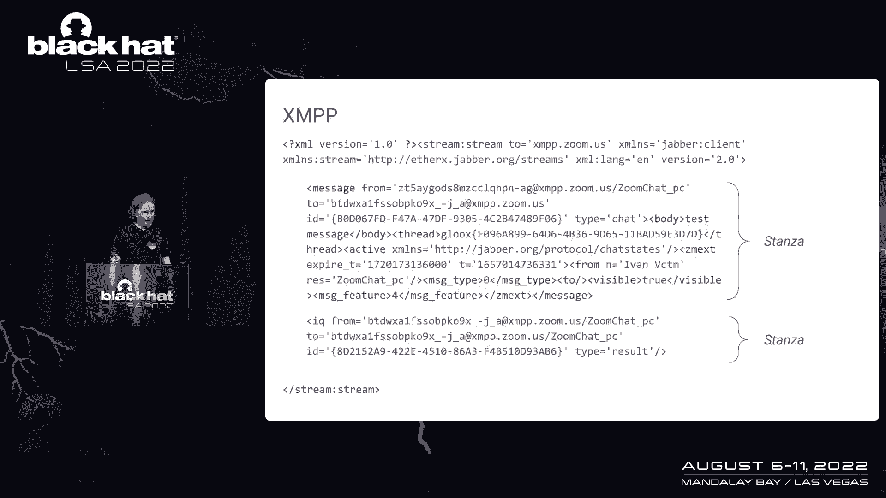
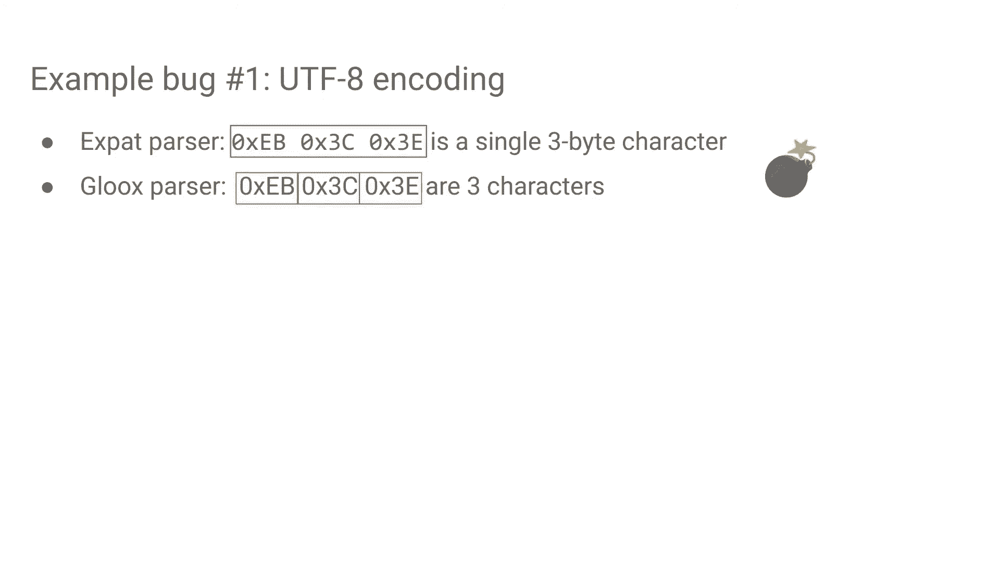
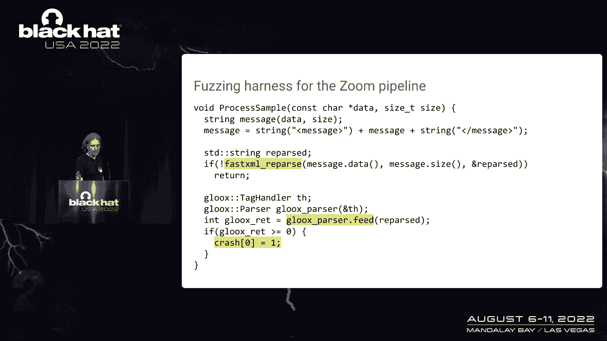
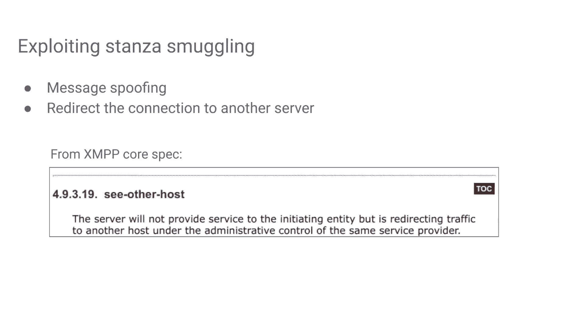
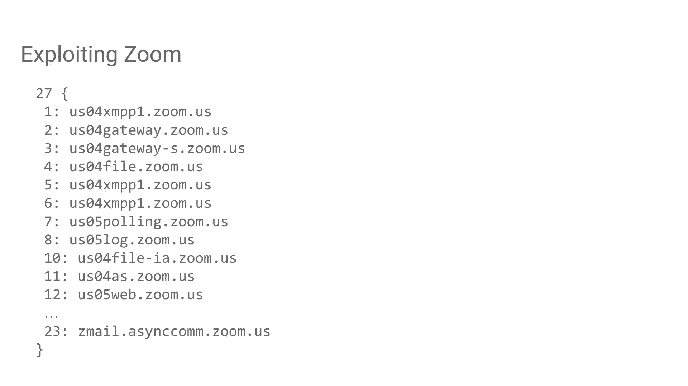
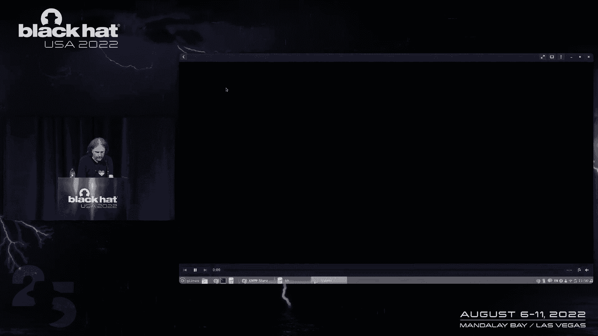
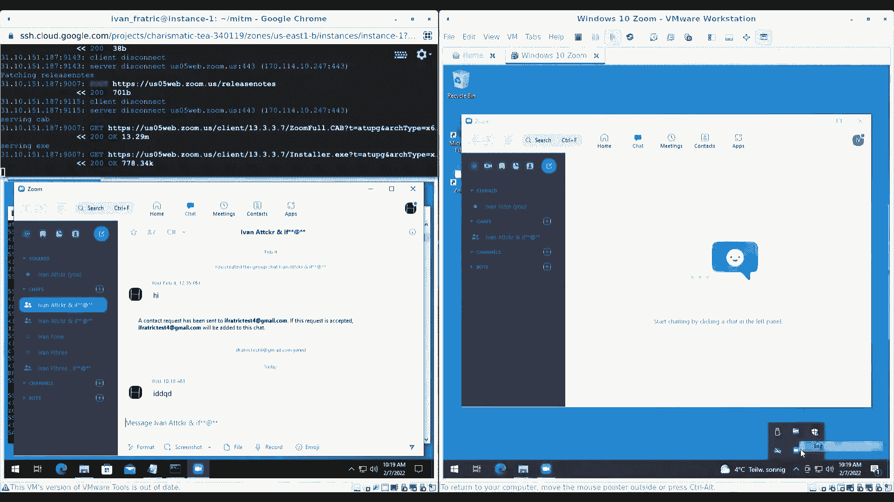

# 课程 P61：XMPP Stanza 走私攻击与 Zoom 漏洞分析 🔍


在本课程中，我们将学习一种名为 **XMPP Stanza 走私** 的攻击技术，并了解攻击者如何利用该技术成功入侵 Zoom 等即时通讯应用。我们将从 XMPP 协议的基础讲起，逐步分析其安全漏洞的成因、发现方法以及实际利用过程。

---

## XMPP 协议简介 📡



上一节我们介绍了课程的整体目标，本节中我们来看看攻击所依赖的核心协议——XMPP。

XMPP 代表 **可扩展消息传递和存在协议**。它是一个基于 XML 的即时消息协议。当一个协议建立在超过 20 年的技术之上时，它通常会成为安全研究的一个绝佳目标。

XMPP 被广泛应用于各种场景：
*   一些即时通讯软件。
*   具备消息传递功能的应用程序，例如 Zoom。
*   网络游戏和工业应用。

虽然本次课程以 Zoom 为例，但其中涉及的大多数原理同样适用于其他使用 XMPP 的目标。

XMPP 的工作方式基于 XML 流。一个简化的 XMPP 流示例如下：
```xml
<stream>
  <message to=‘user@example.com‘>Hello!</message>
  <iq type=‘get‘ id=‘1‘/>
</stream>
```
它以打开一个流标签开始，然后传输称为 **Stanza** 的基本单元。常见的 Stanza 类型包括 `message`（用于用户间发送消息）和 `iq`（用于客户端与服务器间的控制信息交换）。

---

## Stanza 走私攻击原理 🚢

上一节我们了解了 XMPP 协议的基本结构，本节中我们来看看攻击的核心原理——Stanza 走私。


当安全研究人员看到控制消息与用户数据通过同一个基于文本的连接发送时，可能会想到注入攻击。但本次攻击的切入点略有不同。

观察一个 `message` Stanza 的发送与接收过程，可以发现一个关键现象：发送者可以在 Stanza 中嵌入自定义的 XML 标签，而这些标签能够通过服务器完整地传递到接收者客户端。这为攻击提供了可能性。

**注意**：以这种方式放置的任何自定义 XML，在服务器看来必须是有效的。如果服务器解析时遇到错误，连接将被终止。

---

## XMPP 基础设施与攻击面 🏗️

上一节我们看到了走私自定义 XML 的可能性，本节中我们来看看典型的 XMPP 基础设施，以理解攻击可能发生的位置。

一个简化的 XMPP 数据处理流程如下：
1.  客户端向服务器发送一个 XML 格式的 Stanza。
2.  服务器解析该 Stanza。
3.  服务器根据 Stanza 类型进行必要的处理。
4.  若需转发给其他客户端，服务器将其序列化（从对象转换回文本）。
5.  服务器通过流连接将其发送到目标客户端。
6.  目标客户端再次解析该 Stanza。

在这个流程中，问题可能出现在哪里？我们已经知道可以发送自定义 XML。如果将其与 **XML 解析器存在各种差异和怪癖** 这一事实结合，就可能产生攻击。

理论上，**XMPP Stanza 走私攻击** 是指：攻击者客户端发送一个嵌入了特殊构造的 XML 的 Stanza，服务器解析后认为它是一个正常的 Stanza 并转发，但接收者客户端解析时，却从中解析出了**多个** Stanza。这样，攻击者就通过服务器将一个（或多个）Stanza “走私”给了受害者客户端。


这不是一个单一的漏洞，而是一类漏洞的统称。支持这种攻击的漏洞类型可能包括：
*   客户端与服务器上 XML 解析器之间的差异。
*   仅存在于服务器端的漏洞（通常由于解析器与序列化器之间的交互问题）。
*   仅存在于客户端的漏洞。

以 Zoom 为例，其客户端使用名为 `Gloox` 的开源库及其内置的 XML 解析器。服务器端则基于 Erlang 编写的 `ejabberd` XMPP 服务器，并使用 `fast_xml` 库（其底层是 `expat` 解析器）处理 XML。

---

## 漏洞实例分析 🔬



上一节我们概述了攻击面，本节中我们通过两个具体的漏洞实例，来看看 Stanza 走私是如何实现的。

### 实例一：UTF-8 编码差异漏洞


这个漏洞源于客户端 (`Gloox`) 和服务器 (`expat`) 解析器对无效 UTF-8 序列的处理差异。

以下是需要了解的 UTF-8 编码基本知识（摘自维基百科）：

| 代码范围（十六进制） | 标量值（二进制） | UTF-8 字节序列（二进制） |
| :--- | :--- | :--- |
| 000000–00007F | `0xxxxxxx` | `0xxxxxxx` |
| 000080–0007FF | `110xxxxx 10xxxxxx` | `110xxxxx 10xxxxxx` |
| 000800–00FFFF | `1110xxxx 10xxxxxx 10xxxxxx` | `1110xxxx 10xxxxxx 10xxxxxx` |
| 010000–10FFFF | `11110xxx 10xxxxxx 10xxxxxx 10xxxxxx` | `11110xxx 10xxxxxx 10xxxxxx 10xxxxxx` |


关键在于，UTF-8 中字符的编码字节数不同。某些字节序列可能是无效的。例如，字节 `0xEB` 可能是一个三字节序列的开始，但如果后两个字节的最高位未正确设置，整个序列就是无效的。

不同解析器对此的处理方式不同：
*   `expat` 解析器会将其视为一个有效的三字节字符。
*   `Gloox` 解析器会将其视为三个独立的单字节字符。
*   实际上，两者都错了，这应该引发一个解析错误。

利用这种差异，可以构造一个字符串，当被 `expat` 解析时，它被视作一个 XML 标签；而被 `Gloox` 解析时，则被视作两个标签。这为走私多个 Stanza 奠定了基础。

此漏洞不仅影响了 Zoom，也影响了使用相同解析器组合的 Cisco Jabber。

### 实例二：服务器端分隔符混淆漏洞

这个漏洞是 `expat` 解析器特有的。要理解它，需要了解 `expat` 如何向调用者（如 `fast_xml`）返回标签名。

在初始化代码中，一个关键参数是分隔符，其值为 `|`。`expat` 在返回标签名时使用此分隔符连接命名空间、标签名和前缀。



例如：
*   带命名空间的标签 `<ns:tag>` 返回为 `ns|tag`。
*   带前缀的标签返回为 `ns|tag|prefix`。

在安全领域，当使用分隔符连接字符串时，必须确保被连接的字符串中不包含该分隔符。然而，`expat` 在此处存在缺陷。如果攻击者通过数字编码（如 `&#x7c;`）在命名空间属性中插入分隔符 `|`，`expat` 会错误地解析，导致调用者将命名空间属性的一部分误认为是标签名。

这使得攻击者可以在“标签名”中插入本不允许的字符（如空格、`>`），从而构造出能够走私额外 Stanza 的畸形 XML。此漏洞影响所有使用 `ejabberd` 的服务器，危害范围更广。


---

## 如何发现此类漏洞 🕵️♂️

上一节我们分析了两个具体的漏洞，本节中我们来看看安全研究人员如何主动发现这类问题。

发现此类漏洞的两种明显方法是黑盒测试和代码审计。然而，上述两个漏洞实际上都是通过 **模糊测试** 发现的。虽然模糊测试常用于发现内存损坏漏洞，但同样适用于寻找此类逻辑错误。


我们再次回到 XMPP 数据处理流程。进行模糊测试时，无需进行低效的网络模糊，而是将相关的解析库提取出来，在独立的二进制中进行测试。



定义“漏洞”的判定条件为：在流程的最后阶段，即**客户端的 XML 解析器**中发生解析错误。模糊测试框架的工作流程如下：
1.  将测试样本输入服务器解析器和序列化器。
2.  如果此步骤出错（服务器捕获错误），则忽略此样本。
3.  如果服务器成功处理并序列化，则将序列化后的输出输入客户端解析器。
4.  如果客户端解析器在此步骤出错或崩溃，则表明发现了一个潜在的漏洞——服务器认为有效的数据，在客户端却引发了异常。

通过这种方式发现的漏洞，虽然不一定都能用于 Stanza 走私，但可能性很高。本课程中使用的模糊测试工具是 **Jackalope**，它具备**覆盖率反馈**功能，能智能地生成和优化测试用例，从而高效地探索复杂的 XML 解析逻辑。


---

## Stanza 走私的攻击利用 ⚔️


上一节我们介绍了如何发现漏洞，本节中我们来看看攻击者利用 Stanza 走私能做些什么。

发现漏洞后，利用它们进行攻击的路径可能并不直观。以下是几种可能的利用方式：

**1. 消息欺骗**
攻击者可以向受害者客户端发送一个走私的 `message` Stanza，并完全控制其所有属性（如发送者ID）。这使得受害者认为消息来自某个并未真正发送它的人。


**2. 连接重定向**
XMPP 规范本身提供了一种通过 `see-other-host` 错误 Stanza 将客户端连接重定向到另一台服务器的方法。虽然许多实现未严格按规范实现此功能，但它们通常以自定义方式支持类似的重定向机制。攻击者可以利用走私的 Stanza 触发此机制，将受害者的所有通信重定向到攻击者控制的服务器，从而实施中间人攻击，拦截所有通信。



**3. 利用自定义扩展**
许多大型应用（如 Zoom）会定义大量自定义的 XMPP 扩展。攻击者可以研究这些扩展，寻找可利用的配置或数据注入点。

**4. 触发内存破坏漏洞**
某些内存破坏漏洞的触发需要客户端向另一个客户端发送特定的、通常不被允许的 Stanza。如果攻击者掌握了 Stanza 走私能力，就可以绕过限制，自由构造并发送此类恶意负载，从而可能利用这些漏洞。

---

## 攻击 Zoom 的完整链条 🎯

上一节我们探讨了通用的攻击利用方式，本节中我们将所有知识串联起来，复盘攻击者如何利用这些技术成功入侵 Zoom。




攻击者在对 Zoom 的研究中，发现其对 `Gloox` 库进行了自定义修改，特别是在处理错误 Stanza 时，增加了一个名为 `revoke-token` 的标签，该标签支持一个 `web-domain` 属性。

攻击链由此开始：
1.  **触发漏洞**：攻击者首先利用 **Stanza 走私漏洞**，向受害者发送一个包含伪造的 `revoke-token` 标签的错误 Stanza，并在 `web-domain` 属性中填入攻击者控制的域名。
2.  **触发请求**：受害者客户端收到此 Stanza 后，会立即向该属性指定的域名发起一个 HTTP POST 请求，访问 `/cluster_switch` 端点。
3.  **拦截与篡改**：攻击者代理此请求，并观察来自 Zoom 服务器的响应。响应是一个巨大的 Protobuf 配置，其中包含 Zoom 客户端用于连接各种服务（Web、XMPP 等）的域名列表。
4.  **域名劫持**：攻击者在代理响应时，将这些域名全部替换为攻击者控制的服务器地址。从此，受害者客户端的通信将被重定向。
5.  **利用自动更新**：攻击者的目标是实现“零点击”远程代码执行。他们选择劫持 Zoom 的自动更新机制。当受害者客户端检查更新时，请求会被重定向到攻击者服务器。
6.  **提供恶意更新**：Zoom 自动更新会下载两个文件：`installer.exe` 和 `zoom.msi`。攻击者替换这两个文件。虽然 Zoom 客户端有签名和哈希校验，但攻击者通过研究发现，**版本 4 的 `installer.exe` 仍由 Zoom 有效签名，但其内部的完整性检查逻辑存在缺陷，会直接执行提供的 `msi` 文件**。
7.  **完成攻击**：攻击者利用此缺陷，提供一个降级的、带有合法签名的安装程序和一个恶意的 `msi` 包。当受害者客户端重启并触发自动更新时，将执行攻击者的代码，实现远程控制。

**演示总结**：在实际演示中，攻击者在虚拟机中启动 Zoom 客户端，利用工具拦截并修改 XMPP 流量，发送恶意 Stanza。受害者客户端随后请求被劫持的更新服务器，下载并执行了恶意安装包，最终弹出了计算器（作为代码执行的证明）。

---

## 总结与启示 💡

本节课我们一起学习了 XMPP Stanza 走私攻击的全过程。



我们了解到，XMPP 协议由于其基于 XML 的设计和复杂的解析器生态，存在一个未被充分探索的攻击面。**Stanza 走私** 作为一种攻击模式，可以因客户端与服务器解析器差异、服务器端解析-序列化不一致等多种类型的漏洞而引发。

其影响可以从相对温和的**消息欺骗**，升级到严重的**通信拦截**，甚至如案例所示，实现完全的**零点击远程代码执行**。Zoom 安全团队在收到报告后，进行了全面且认真的修复。

本次研究也给我们带来重要启示：
1.  对老旧协议和复杂数据格式（如 XML）的解析过程应保持安全警惕。
2.  **模糊测试** 不仅是发现内存漏洞的利器，同样是挖掘深层逻辑错误的强大工具。
3.  在安全设计中，确保数据在整个处理链条（解析、处理、序列化、再解析）中的一致性至关重要。


希望本课程能帮助你理解这类攻击的原理与危害，并在未来的安全研究和防御中有所借鉴。