# 课程P62：震网病毒前后：一切已变，一切未变 🔄

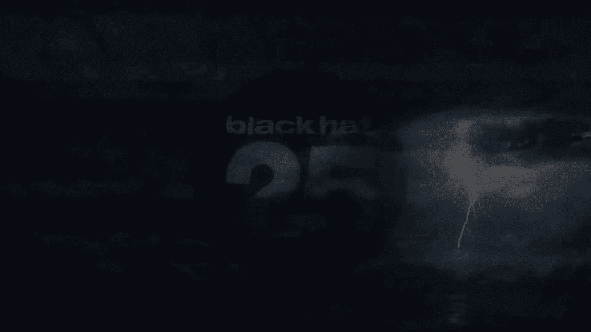

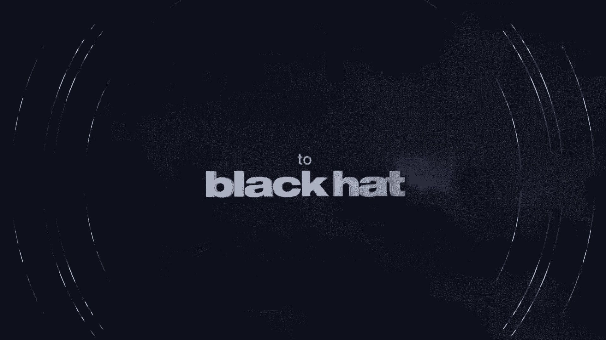

在本节课中，我们将跟随资深安全记者金·泽特（Kim Zetter）的视角，回顾网络安全领域在过去十几年间的演变。我们将聚焦于2010年震网病毒（Stuxnet）这一分水岭事件，探讨它如何改变了网络安全的格局，以及为何许多核心问题至今仍未解决。课程将涵盖国家行为体、关键基础设施安全、选举安全以及网络空间的新规范，旨在帮助初学者理解网络安全威胁的延续性与变化性。

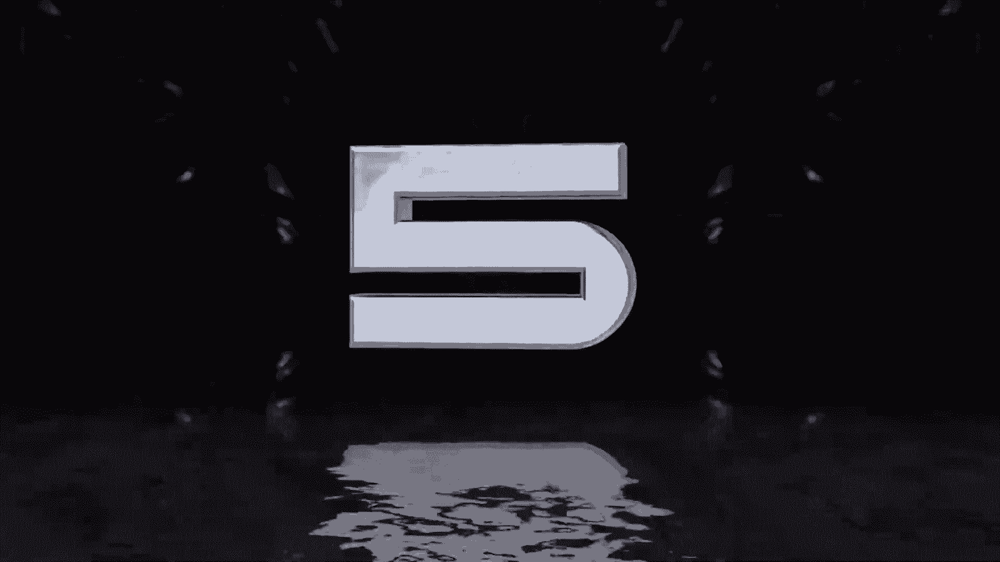

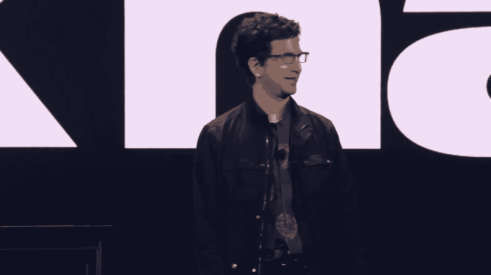

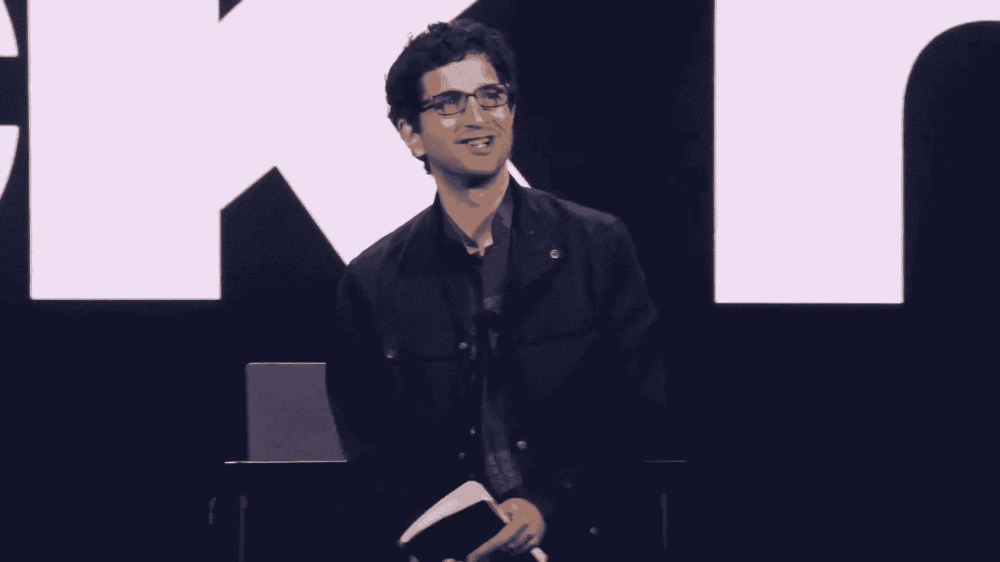

## 引言：一个没有“戏剧性故事”的时代 🎭

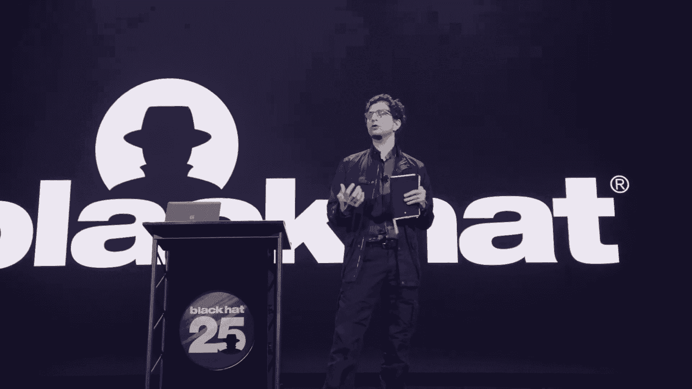

我们询问商业客户他们最戏剧性的安全故事，他们现在没有了。

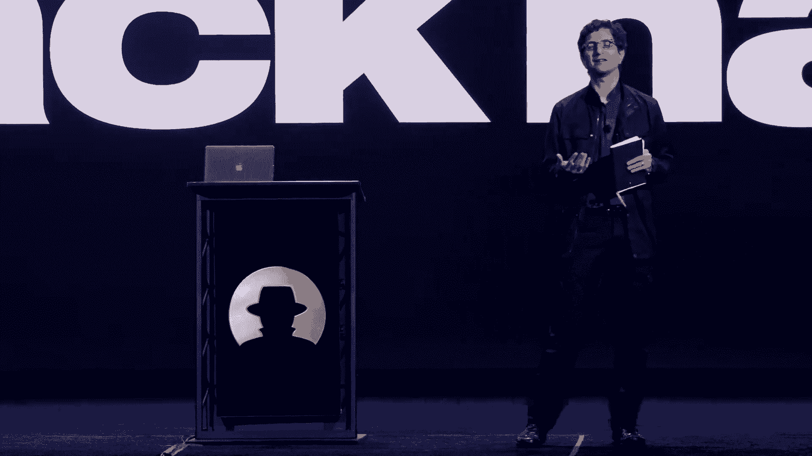

当谈论一个好故事时，并不是指最好的故事。例如，“记得有一次整个网络都瘫痪了，因为我们被勒索了”。实际上，我们使用恶意软件防护已经八年或更长时间了，所以我们没有任何恐怖刺激的故事。这里没有戏剧性事件。

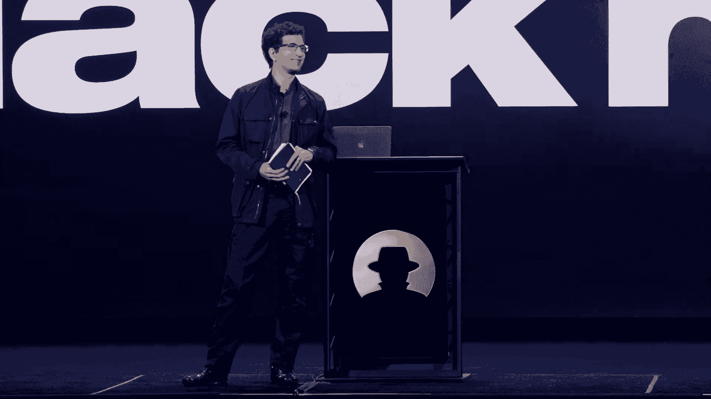

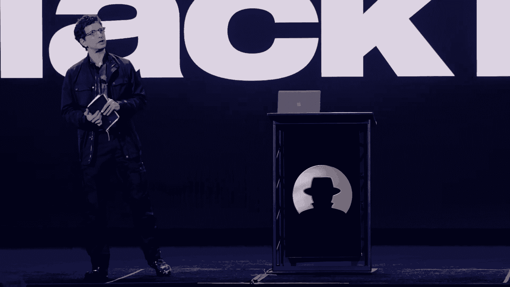

在我们的防护下，AI提供的网络保护是有效的，因此你可以免受恶意软件的侵害。

## 与媒体的爱恨交织关系 📰

上一节我们提到了安全环境的现状，本节中我们来看看安全社区与外部世界，特别是与媒体的复杂互动。

如果你在安全领域待过一段时间，就会知道与媒体有一种爱恨交织的关系。

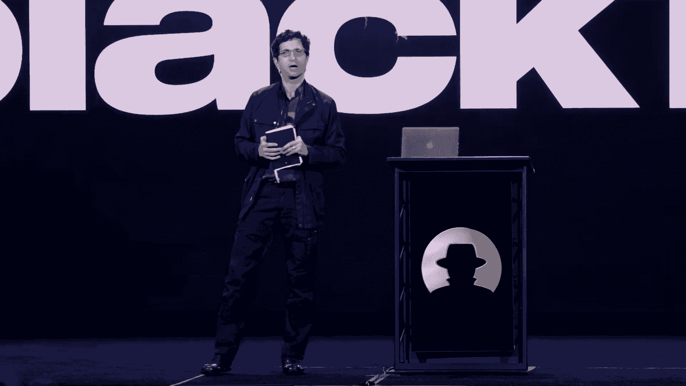

如果你与媒体或你的公司有良好的互动，它可能会对你的职业生涯和你正在做的事情产生很大的影响。但如果你在媒体上有不好的经历，尤其是在推特和社交媒体的今天，它真的会让你崩溃。

因此，弄清楚媒体上的人是谁，以及你可以信任哪些记者，可能是一件大事。几十年前，看到记者甚至关心黑客在做什么，真是令人着迷。这是一种很大的自我提升：“哇，有人在乎，他们想写我们。”

然而，我们开始阅读他们的报道时，发现他们似乎专注于我们头发的颜色、喝了什么能量饮料，或者周围的所有噱头，而对技术实质缺乏关注。

因此，当我们互相分享笔记时，比如“你和谁谈过”，我们开始意识到报道的覆盖面是如何的。有很多人想报道黑客和技术，但只有一些人真正能做到。我们分享那些真正懂行的记者名单，实际上有一些邮件列表和自然减员组织维护着“好记者”（你可以与之交谈）和“坏记者”（你会远离）的列表。

这些年来我们有一些冒险经历。我们最终禁止了整个拉斯维加斯当地电视台报道我们的任何活动，因为他们总是将镜头对准染着蓝头发的人、锁具和黑客工具，并配上“这个周末拉斯维加斯的网络罪犯你需要知道的”这类耸人听闻的标题。你只能让这种情况发生这么多次，然后就会说：“不，谢谢电视。”

所以我们把注意力集中在印刷记者身上。印刷记者是你的朋友，他们习惯于查看多个来源，他们的截稿期限和电视人不太一样。这些是我们想花时间介绍给朋友的人。

我们并非唯一一次遭遇恶意媒体。有一个“抓住捕食者”节目的场景，他们派了一名卧底记者带着隐藏摄像头去Def Con，试图让未成年人承认从事电脑犯罪。他们没有获得媒体通行证，我们提前得知了此事，并拦截了任何人，在她试图诱导他们之前。然后我在舞台上揭露了她。这是一个冒险的举动，但我试图给她一个机会来纠正错误并表明自己是媒体。她坐在前排，用隐藏的相机直指我，但没有站出来。

这是一个很长的引子，说明双方历史积怨很深，有点像黑客与政府之间爱恨交织的关系。因此，当我们在思考希望由谁来讲述这个故事时，我们希望找一个在该领域有着悠久历史、理解双方细微差别、并且一直在场的人。金·泽特的名字名列前茅。

## 演讲者介绍：金·泽特 👩‍💻

上一节我们了解了与媒体打交道的复杂性，本节中我们隆重介绍本次核心内容的讲述者——金·泽特。

如果你不知道金，她在《连线》杂志工作了十三年，拥有丰富的从政和报道经验，也为《纽约时报》、《华盛顿邮报》、主板（Motherboard）、Vice等媒体撰稿。她长期报道安全、选举和基础设施等议题。

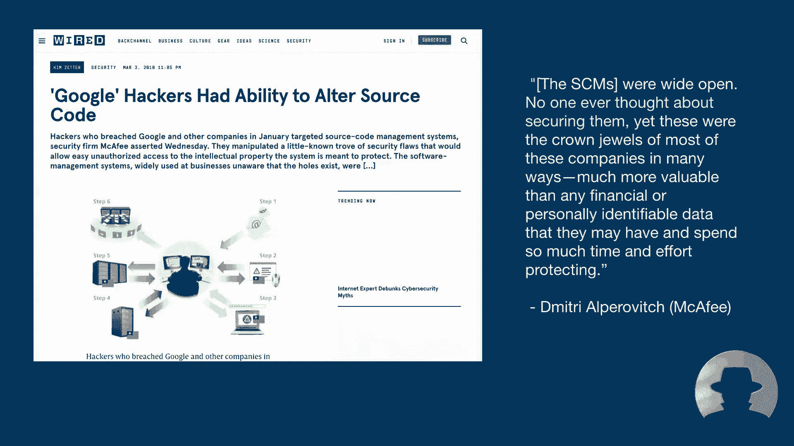

我被她采访过几次。可以告诉你的是，这从来都不是百分之百舒适的感觉。她知识渊博，有洞察力，为人正直，不会回避棘手的问题。不是没有“垒球”式轻松问题，但感觉很真实。就像你完成了金的采访，会觉得“我活下来了，我能做到”。正因为如此，我认为她的报道很有见地。

我真的很想知道她对最近十年的看法，围绕斯诺登事件，我们学到了什么，没学到什么，什么变了，什么没变。尤其是她的长期视角，回顾与展望，契合了“我们从哪里来，但我们要去哪里”的年度主题。所以我很高兴向大家介绍金·泽特。

## 一个永恒的故事：犯罪地下世界的延续 🕵️‍♂️

大家好，很高兴在分开两年后见到大家。我想感谢黑帽大会，尤其是杰夫的精彩介绍。但我想感谢黑帽今天早上邀请我来演讲。我觉得这是他们第一次请记者来做主题演讲。他们告诉我有两个主题演讲，第一个通常由工业界和政府的人完成，第二个由社区里的一名记者完成。我当然要努力保持独立和公正，但我确实认为自己是这个社区的一员，因为我认识你们中的许多人已经很久了。

今天早上，我想先给你们讲一个关于一个接近我的线人的故事。这是前阵子的事，回到2006年，当我为《连线》撰稿时。他来找我说了一个似乎难以置信的故事。这是在发生一系列大规模银行卡号码泄露事件之后。

消息人士告诉我，他有一个前排座位来观看所有的行动。他知道所有玩家的真名，他就在事情的最深处。他声称他为联邦调查局卧底工作了18个月，经营地下犯罪论坛，这样他就可以看到网络罪犯是如何策划他们的阴谋、出售对黑客系统的访问权、贩卖黑客工具、被盗的身份和银行卡号码，甚至写客户评论（就像在Yelp上），对他们犯罪同伙的货物和客户服务进行分级（在这种情况下是“电子黄金”，比特币在2009年推出之前的前身）。

消息来源声称他一直……他被联邦调查局策反了。他讲的是一个伟大的故事，但有一个问题：他是个职业骗子。他开始了写空头支票的职业生涯，然后最终变成了一头“骡子”，为俄罗斯和乌克兰黑客服务，然后销赃，再把钱汇到乌克兰、白俄罗斯或者俄罗斯，使用电子黄金。

所以消息来源声称，在他被捕后的一天，他在做他的骡子操作时，被联邦调查局策反了，在那里经营这个地下论坛。现在，联邦调查局不可能证实这个故事，他们不可能确认消息来源为他们卧底。但消息来源有“收据”，就像他们说的。他给了我目击监狱采访的公设辩护人的名字（联邦调查局在那里策反了他），他有数百个他运行的论坛的私人聊天日志，显示黑客计划他们的犯罪活动，为拙劣的交易和欺骗伙伴而争吵，笑着说没有人会抓住他们，因为中国的执法部门太无知、太缺乏技能、技术上太困难，无法理解发生了什么。

所以在接下来的六个月里，我不得不努力确认他告诉我的一切。我追踪了聊天记录中描述的犯罪计划的受害者，我找到了目击监狱面谈的公设辩护人，他不情愿地承认联邦调查局确实策反了他。我找到了西雅图公寓楼的前经理，他告诉我联邦调查局确实付了公寓的租金，并给了他一个电话号码，万一消息来源出格了。

我告诉你这个故事，因为这很可能是去年甚至上个月的故事，而不是2006年。今天，黑客如何经营他们的犯罪企业没有什么实质性的不同。他们仍然组织地下论坛，他们仍然在等级结构中作为企业经营，他们还在赚很多钱。主要的区别是，他们有十多年的时间来完善他们的运营，变得更加专业。现在他们为工人提供有薪工作，甚至带薪休假。但他们还在争吵，他们仍然互相欺骗，他们仍然认为执法部门不会抓住他们。有时他们是对的。

所以太阳底下很少有新的东西，就像他们说的。细节可能会有所不同，但20年前发生的同样的事情直到今天仍然发生。

## 似曾相识：勒索软件的演进与不变 💰

这里有一个2008年的勒索软件故事，包含了与今天勒索软件攻击相同的元素：数字货币收取赎金、一名猝不及防的受害者、不愿意与美国当局合作的俄罗斯政府。

今天有什么新鲜事？当然是赎金的规模。500美元在当时是很大的，今天他们会达到500万美元或更多。以及以关键基础设施为目标：医院、食品制造厂和管道，而不是针对个人。

大案之一，当然是勒索软件，是去年殖民管道黑客攻击，达到了国家安全的程度，并促使政府最终解决管道安全问题——在十多年的大部分时间里。这是一个分水岭时刻，就像他们说的。但如果有人对这次袭击感到惊讶，他们不应该。因为当震网病毒在2010年被发现时，这是完全可以预测的。

## 震网病毒：一切已变的分水岭 ⚡

震网病毒揭示了关键基础设施中以前很少有人注意到的漏洞。直到那时和现在，安全社区主要关注IT网络，他们以前忽视了所谓的运营技术网络——那些管理管道、铁路、电网、水处理厂、制造业和许多其他关键行业的工业控制系统。

Stuxnet提供了明显的证据，证明只使用代码就对关键基础设施造成物理破坏是可能的。但没有人应该感到惊讶。关于使用数字武器扰乱或摧毁关键基础设施的警告，在震网病毒十年前就出现了。

在Stuxnet被发现的同一年，“极光行动”被曝光。你们中的许多人可能还记得，这是中国广泛的间谍活动，打击了34家公司，目标是谷歌、Adobe和瞻博网络的源代码存储库，并包括了第一批重要的供应链攻击之一——瞄准RSA的SecurID种子库（多因素认证系统的引擎）。

极光行动向公众介绍了APT和民族国家黑客日益增长的能力。安全界在那之前主要集中在网络罪犯身上，开始更多地关注民族国家行为体，这使得网络罪犯的行为感觉有点“古怪”。黑客行动变得更加激进和重要：OPM黑客、DNC黑客、NotPetya、SolarWinds……但这一切都不应该令人惊讶。

极光行动背后的黑客，正如我提到的，通过源代码管理系统的源代码存储库（跟踪源代码更改和更新的系统）进行攻击，原来这些系统存在安全漏洞。以下是德米特里·阿尔佩罗维奇（Dmitri Alperovitch）在2010年说过的话：

> “源代码管理系统是开放的，从来没有人想过保护他们。然而，这些是大多数这些公司的皇冠上的宝石，在很多方面，比任何财务或个人身份数据都有价值得多。他们可能有……他们可能有……花这么多时间和精力保护……”

这是去年有人告诉我的，在黑客在构建过程中向SolarWinds软件注入后门后：

> “软件制造商有所有这些安全机制来检测源代码存储库中的更改，但没有保护构建环境，因为以前从来没有人在软件构建过程中注入恶意软件。”

你发现规律了吗？**缺乏想象力，或者对黑客的下一步行动缺乏预期，这里经常是这样。**

所以我把这个叫做“前震网，后震网：一切已变，什么都没变”。因为Stuxnet在那一年（2010年）经常被视为一个界限，区分它之前和之后的安全时代。在安全方面有了很多真正的进步，自从黑帽大会二十五年前成立以来，还有很多进步自从stuxnet在2010年被发现以来。但尽管有数十亿美元的安全产业和前所未有的政府对威胁的关注，当威胁行为者转向新的、但往往完全可预测的方向时，每个人似乎仍然感到惊讶。

有几件事真正蒙蔽了我们，然而其余的早在信号发生之前就发出了信号。去年殖民管道发生的事情是可以预见的，越来越多的勒索软件攻击也是如此，以及投票机的安全问题造成的问题（这些年来我报道了很多）。俄罗斯人在2016年针对选举基础设施，我们真的应该问问他们怎么花了这么长时间才对此并不感到惊讶。

我们有一个习惯：在威胁发生后对威胁做出反应，而不是为它们做准备，或者忽视警告即将到来的问题的理性声音，只是在它们发生时争先恐后地采取行动。那是惊慌失措的司机在东海岸加油站排队，试图把装满汽油罐的后备箱装满的时候。或者当选举官员变得无赖并破坏公众对投票的信任时。

## 个人背景与行业演变 📚

所以我今天想谈谈安全环境在震网病毒之前和之后的变化，以及我们忽略的事情（直到为时已晚）。但首先，对那些可能不知道我工作的人来说，我知道杰夫说了一些，但我只给你一个简短的背景。

我在PC World的第一份报道工作开始报道安全问题。我在那里工作了几年，然后搬到了《连线》杂志，就像杰夫说的那样，我在那里工作了十三年，直到2016年离开。我早年开始参加黑帽和Def Con大会，当时Def Con还在亚历克西斯公园酒店举行，从长条上。那时大约有一千名与会者参加了Def Con，而不是三万。拉斯维加斯总是有很多东西分散人们对会议的注意力，但在八月下午三点的炎热中，可能没有比亚历克西斯公园泳池大会更好的地方了，我们称之为“泳池大会”。你可以在三个游泳池里涉水，迷失在深入的技术或哲学对话中，在技术配乐的背景下，结交终身朋友。

在那些日子里，没有“安全记者”这样的东西，至少不是在技术媒体之外。主流媒体的新闻记者空降报道安全，只有当重大病毒或数据泄露影响主流受众时。这往往会在媒体中产生不信任，一种记者并不真正关心安全的感觉，除了传播炒作和关注黑帽黑客的滑稽动作。但在斯诺登事件和DNC黑客攻击之后，许多媒体意识到他们需要有全职记者在安全领域巡逻，他们了解这些问题，并能真正将这些技术和复杂的问题转化为主流受众。所以今天我们有一群非常棒的记者来报道这个领域。

当我刚开始参加黑帽和Def Con的时候，我有一个巨大的学习曲线。我没有技术背景，我是英国文学专业的，我在研究乔伊斯和乔叟，不是Java和C++。但如果你致力于把事情做好并有真正的好奇心，人们很开放，愿意交谈。从最初的日子起，我有一群经验丰富的黑客和安全专家帮我整理所有的技术细节，避免和回避炒作。

所以在那些日子里，我报道了维基解密和朱利安·阿桑奇，在他们成为家喻户晓的名字之前。我报道了他们第一次泄密的早期，我向一个同事透露了切尔西·曼宁因泄露政府文件被捕的消息。我在密苏里州的一个“T房间”揭露了一个秘密，这是在斯诺登揭露其广泛的监视计划之前的几年。我写了很多关于地下黑市的故事，以及关于选举安全，试图引起人们对当时很少有人想关注的事情的注意。

终于在2010年随着震网病毒的发现，事情发生了变化。当震网和极光行动发生时，我的大部分报道重点转向了民族国家黑客、数字基础设施，当然，这就引出了我现在想说的。

## 震网病毒带来的四大变化 🧩

上一节我们回顾了行业背景，本节中我们具体剖析震网病毒究竟带来了哪些根本性的改变。

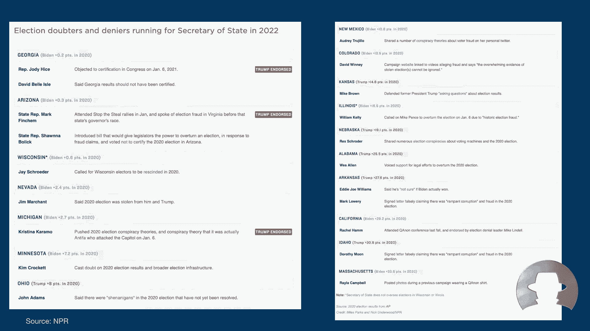

震网病毒在安全性上带来了四大变化。

**第一个是技术和工具的“涓滴效应”。** 在震网病毒创新之前，计算机攻击主要是由地下罪犯驱动的。民族国家黑客从黑客和研究人员那里学习新技术。但是在震网之后，情况反了过来：地下组织开始向政府学习。你们中的许多人可能还记得“杜库”（Duqu），这是一个间谍工具，由创建震网的同一个团队的一些人在2011年创建，攻击同一字体的漏洞。渲染杜库攻击的漏洞，被添加到地下犯罪组织出售的工具包中，不到一年前，它是用于安装银行木马和其他恶意软件的最常见的目标漏洞。臭名昭著的“永恒之蓝”（EternalBlue）漏洞也发生了同样的事情，震网在2010年使用的漏洞，在2016年，在Stuxnet利用它六年后，永恒之蓝漏洞占了使用的所有漏洞的20.5%。微软早在2010年就修补了这个漏洞，但在2015年，研究人员发现这个补丁无效，黑客还在利用它。

**第二个重大变化是国家间的军备竞赛，这预示着网络空间的军事化。** 震网病毒之后，突然间每个人都想参与其中。只有少数几个国家有攻击性黑客程序，但是在震网之后，许多国家启动了自己的网络司令部进行间谍活动和破坏性攻击，包括伊朗（震网病毒的目标）。

**第三，震网病毒带来了安全的政治化。** 震网病毒进行了三年的秘密破坏，从2007年到2010年才被抓到，直到白俄罗斯一家防病毒公司的工人发现了它。赛门铁克的研究人员和世界各地的其他人对数字武器进行了逆向工程，以确定它的设计目的。震网背后的开发人员可能认为伊朗人不会发现或破译恶意代码，但他们没有指望全球网络安全界帮助他们。震网建立了一个新的世界秩序，安全研究人员在不知情的情况下成为新“民兵组织”的应征者——一个被招募来拆除各国相互投掷的数字武器的人。这给研究人员带来了新的伦理困境，夹在客户的需求和情报机构的利益之间。如果震网宣布网络空间军事化，它也标志着安全研究的政治化。数字捍卫者可能会被要求从另一个角度看，以避免破坏他们政府的秘密行动。以下是埃里克·秦（Eric Chien）从赛门铁克说的一句话：
> “有一个新的好人和坏人。这个问题可能会让我们陷入非常困难的境地。”

这是埃里克·秦在2012年告诉我的，在他们破译完Stuxnet之后。他们的研究没有受到政治影响的影响，没有人试图阻止赛门铁克研究人员挖掘震网，没有人阻止他们公布他们的发现。但秦知道情况可能并不总是这样。如果他的团队被迫在客户和政府利益之间做出选择，他说：“这将是一个很难回答的问题。”

**震网做的最后一件事是，向安全界介绍一个充满漏洞的关键基础设施世界。** 正如我前面提到的，震网让人们意识到了运行管道、水处理厂等系统中的漏洞。一旦安全研究人员将目光转向工业控制系统，他们在软件中发现了许多安全漏洞。但不仅仅是这样，还有一些基本的架构问题，这些问题永远无法用补丁来解决。有这么多系统直接连接到互联网。网络安全突然与国家安全联系在一起。但又一次，这不应该让任何人感到惊讶。

## 被忽视的警告：关键基础设施的长期脆弱性 🚨

上一节我们总结了震网带来的变化，本节中我们来看看那些早已发出却被长期忽视的警告信号。

让我们来看看如果我们注意了，我们会看到什么。

在1997年，在蒂莫西·麦克维炸毁俄克拉荷马州的一栋联邦大楼后，“沼泽委员会”（总统关键基础设施保护委员会）的任务是研究其他关键基础设施可能容易受到攻击的方式，无论是物理攻击还是通过数字攻击。在他们提出的最后报告中，委员们对连接石油、煤气和电力关键控制系统到互联网的日益增长的趋势提出了警告。他们写道：
> “造成伤害的能力正在以惊人的速度增长，我们对它几乎没有防御。”

这是二十五年前的事了。
> “发送到发电厂控制计算机的命令，可能就像一个装满炸药的背包一样具有破坏性。在我们面临危机之前，我们应该注意我们的关键基础设施，不是以后。等待灾难将被证明是昂贵的，也是不负责任的。”

同年，白宫国家安全电信咨询委员会发布了第二份报告，完全呼应了他们所说的话，写着：
> “电子入侵者可以拨号到不受保护的端口，并将断路器复位到比设备在断路器的保护下可以承受更高的公差水平，有可能在变电站内实际摧毁给定的设备。”

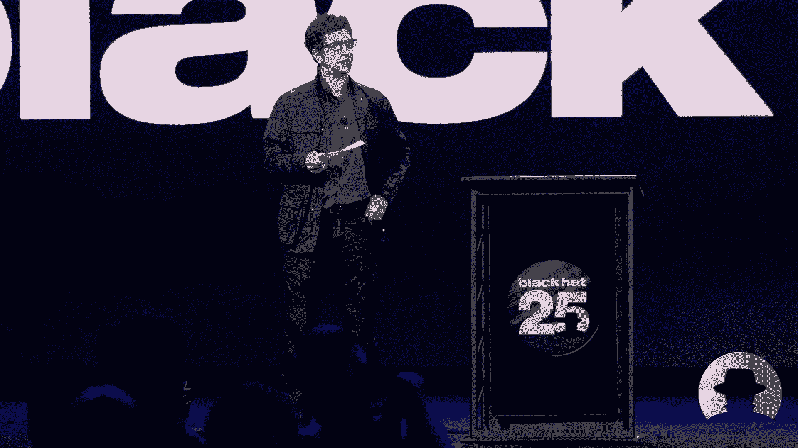

电力行业确实注意到了警告，随着时间的推移，最终变得更加安全。但许多其他关键基础设施变得更加互联和不安全。

当殖民管道去年被黑客攻击时，许多人对公司支付赎金的速度感到惊讶——当然，一个对美国