# 课程 P63：071 - DirectX：Hyper-V 的新攻击面 🎯

在本课程中，我们将学习 Hyper-V 中一个名为 **Hyper-V DirectX 组件** 的新攻击面。我们将从架构概述开始，了解如何启用它，然后深入探讨其攻击面，并分析几个具体的漏洞案例。最后，我们将讨论使用模糊测试（Fuzzing）来发现此类漏洞的必要性。

---

## 1. Hyper-V DirectX 组件架构概述 🏗️

上一节我们介绍了课程目标，本节中我们来看看 Hyper-V DirectX 组件的架构。

在 2020 年，微软引入了基于 GPU 虚拟化技术的新功能。这项技术被集成到 Windows 显示驱动模型（WDDM）中。WDDM 2.0 及以上版本的驱动程序原生支持 GPU 虚拟化。然而，新功能意味着新的攻击面。

下图展示了 WDDM 的架构图。应用程序（如 3D 游戏）通过调用用户模式下的 Direct3D 运行时组件，与 DirectX 图形内核子系统通信。图中的用户模式显示驱动是 GPU 制造商的私有驱动数据，它将与 GPU 内核模式驱动交互。

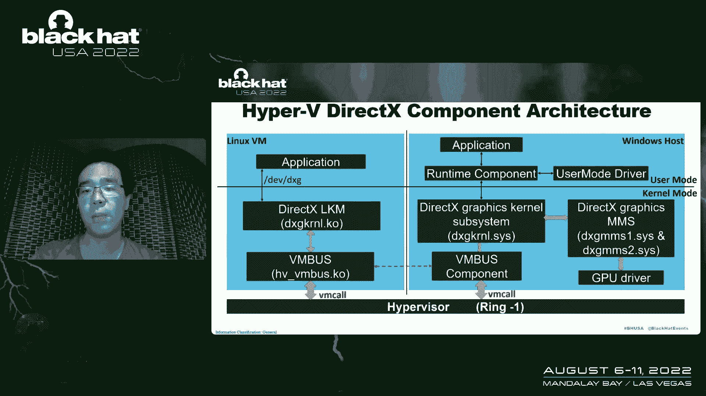

下图展示了 Hyper-V DirectX 组件的架构。图的右侧是简化的 WDDM 架构。图的左侧代表运行客户虚拟机的子分区。Linux 虚拟机中的 `dxgkrnl` 内核模块通过 `VMBus` 组件与宿主机中的 DirectX 图形内核子系统传输数据。

WDDM 的数据流如图所示。应用程序是起点，应用程序将调用运行时组件，可能会使用用户模式驱动中的私有数据，然后数据到达 DirectX 图形内核子系统，最后数据将到达 GPU 驱动。

Hyper-V DirectX 组件的数据流也从应用程序开始。应用程序将数据发送到 Linux 内核模块 `dxgkrnl`。Linux `dxgkrnl` 驱动模块通过 `VMBus` 组件与宿主机中的 DirectX 图形内核子系统通信，后续流程与 WDDM 相同。

---

## 2. 在 Hyper-V 虚拟机中启用 DirectX 组件 ⚙️

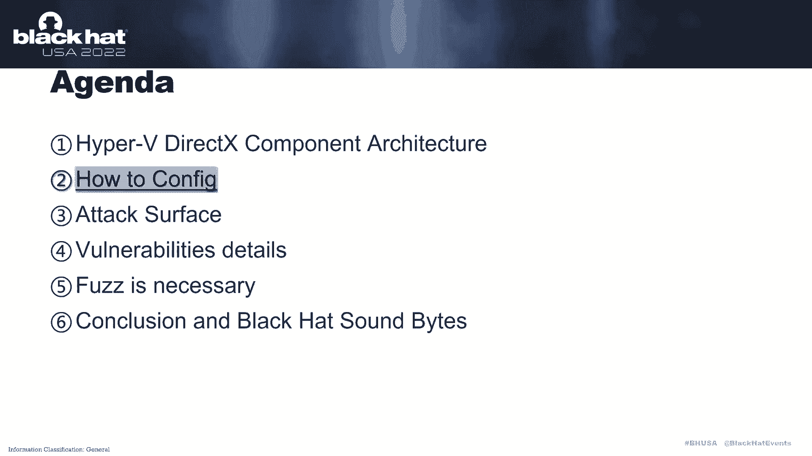

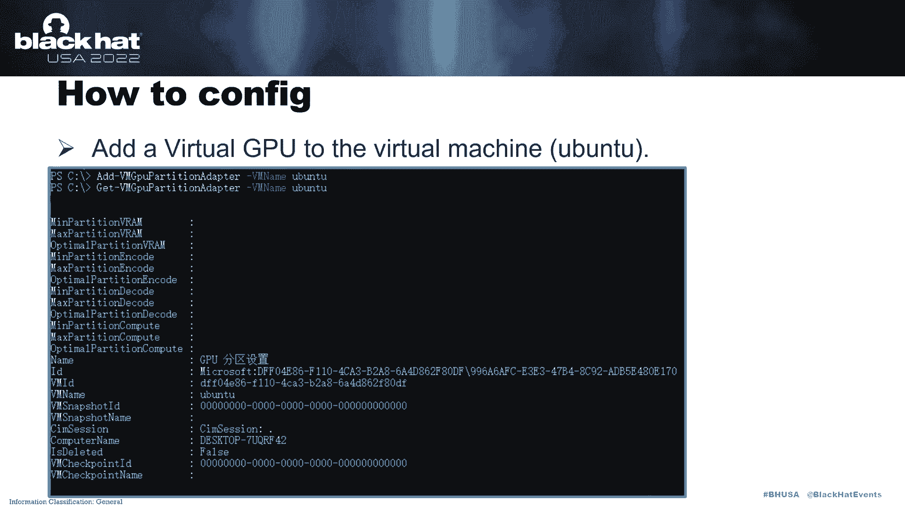

上一节我们了解了架构，本节中我们来看看如何在 Hyper-V 虚拟机中启用此组件。

你可以使用 `Add-VMGpuPartitionAdapter` 命令，然后结合 `Get-VMGpuPartitionAdapter` 命令来检查虚拟 GPU 信息。

完成虚拟机配置后，我们可以通过检查 Linux 虚拟机中的内核日志来确定此组件是否已启用。例如，我的 Linux 虚拟机内核版本是 4.15。在内核日志中，有两个新的 GUID：`Virtual GPU Dxgk Channel GUID` 和 `Global Dxgk Channel GUID`。

如果虚拟机是 Linux，只有 WSL2 Linux 内核源代码树能原生支持 DirectX 设备作为虚拟设备。但好消息是，用于 Linux 的 `dxgkrnl` 驱动易于编译和定制。该驱动设备文件暴露了一组 `ioctl`，紧密模仿了 Windows 上的原生 WDDM 用户模式层。

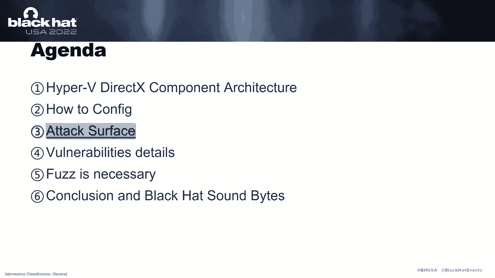

---

## 3. Hyper-V DirectX 组件的攻击面 🎯

上一节我们介绍了如何启用组件，本节中我们来看看其攻击面。

首先，介绍 DirectX 组件在 Linux 虚拟机中是如何初始化的。`dxgvmb_channel_init` 函数调用 `vmbus_open` 函数来初始化一个 Dxgk 通道。这里有两个函数会调用 `dxgvmb_channel_init` 函数，它们是 `dxgglobal_init`（全局通道）和 `dxgadapter_vmbus`。这两个函数分别初始化一个全局 Dxgk 通道和虚拟 GPU Dxgk 通道。

Linux 内核模块 `dxgkrnl` 使用 `dxgvmb_send_sync_msg` 和 `dxgvmb_send_async_msg` 来向宿主机发送 Dxgk 内核命令。`dxgvmb_channel_receive` 函数用于接收来自宿主机的消息和命令。

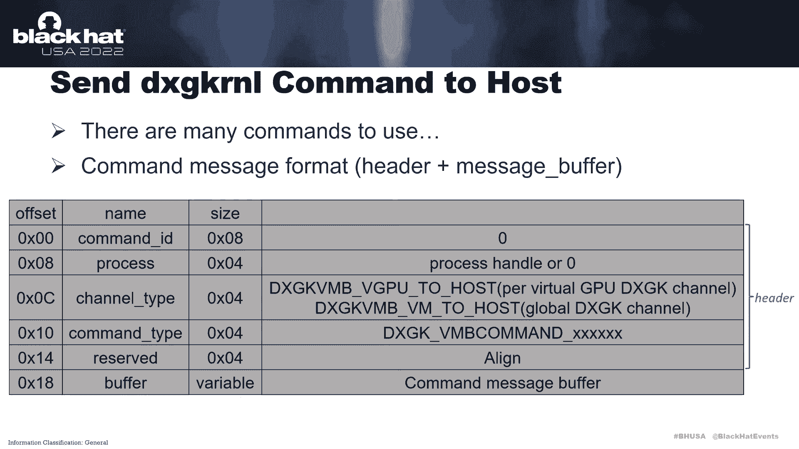

通过阅读 WSL2 Linux 内核源代码，可以看到这里有许多可用的命令。一个命令消息的大小是 0x18，消息缓冲区头由四个成员组成。通道类型决定它是虚拟 GPU 通道还是全局通道，命令类型决定发送哪个命令。

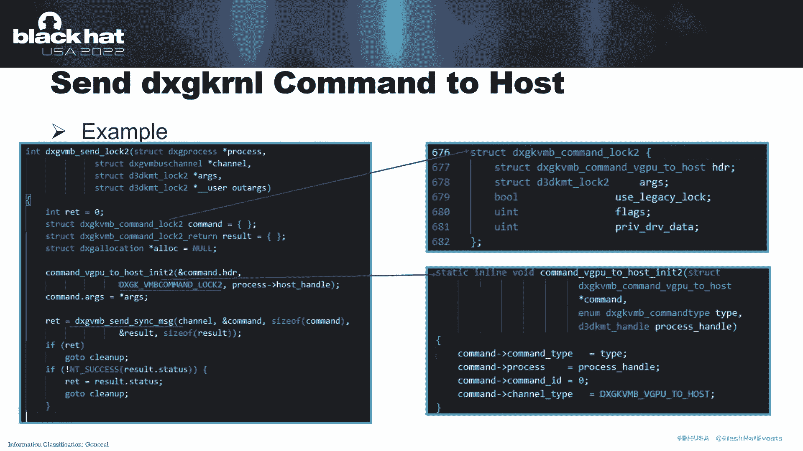

例如，`dxgvmb_send_log_to_host` 函数向宿主机发送 `DXGK_VMB_COMMAND_LOG_TO_HOST` 命令。在 `vmbus_to_host_need_to` 函数中，可以看到 `DXGK_VMB_COMMAND_LOG_TO_HOST` 命令是一个虚拟 GPU 通道命令。`DXGK_VMB_COMMAND_LOG_TO_HOST` 结构定义了该命令消息的格式。

关于宿主机中的数据接收，如果客户机发送 `DXGK_VMB_COMMAND` 数据到宿主机，`VMBus` 组件将根据具体通道调用 `dxghost_virtual_gpu_vmbus_channel_process_packet` 或 `dxghost_global_vmbus_channel_process_packet` 函数。然后，`vmbus_process_packet` 函数决定是否在 `dxghost_global_vmbus_command_table_vm_to_host` 表或 `dxghost_virtual_gpu_vmbus_command_table_vgpu_to_host` 表中查找与命令类型对应的处理函数，最后进入具体的处理函数并继续流程。

`cast_to_vmbus_command` 函数用于从客户机检索数据。例如，图中偏移 0x90 处的 `word` 值，我们处理客户机数据的长度，偏移 0x88 处的关键字将处理 `DXGK_COMMAND` 消息数据的指针。

`vmbus_complete` 函数用于向客户机发送数据。该函数的第二个参数是 `debug`，第三个参数是数据缓冲区。在此图中，`vmbus_complete_packet` 将把状态值设置给客户机。

关于攻击面，攻击面位于三个驱动文件中：`dxgkrnl.sys`、`dxgmms1.sys`、`dxgmms2.sys`。总共有 87 个函数对应命令，每个命令也有对应的消息结构。这是一个巨大的攻击面。

现在，我将使用 Hyper-V DirectX 组件的以下四个漏洞能力来进一步解释其攻击面。

---

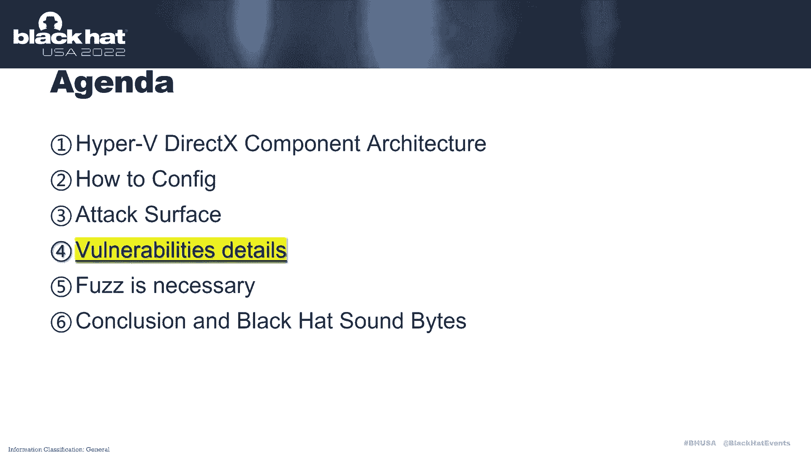

## 4. 漏洞案例分析 🔍

上一节我们概述了攻击面，本节中我们通过具体案例来深入理解。

以下是四个具体的漏洞案例：

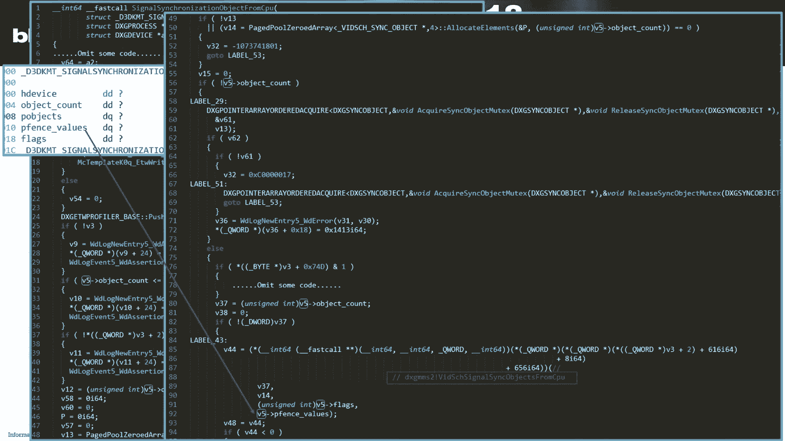

### 案例一：CVE-2022-21918（空指针解引用）

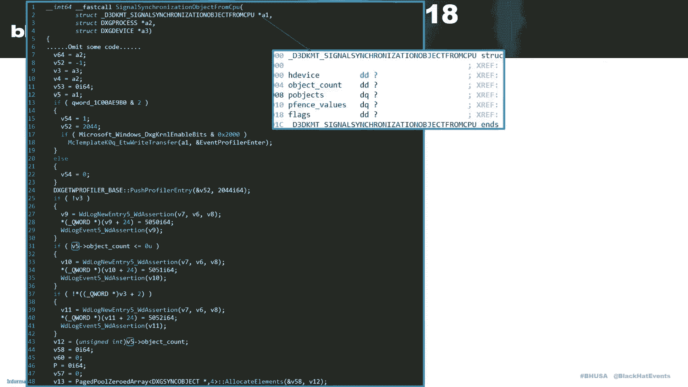

此漏洞问题出现在 `DXGK_VMB_COMMAND` 命令中。漏洞的根本原因是 `vidsch` 函数的第五个参数引用了一个空指针。

下图是堆栈回溯。触发此漏洞的函数如图所示。第五个参数将值赋给 `retval`，然后 `retval` 被引用，导致空指针解引用。`vidsch` 函数的第五个参数由调用它的函数的第四个参数赋值。该值是 `fence_values` 数组的 `v5` 值。

在 `signal_synchronization_object_from_cpu` 函数中，`v5` 由 `a1` 赋值。该结构的内存布局如图所示。

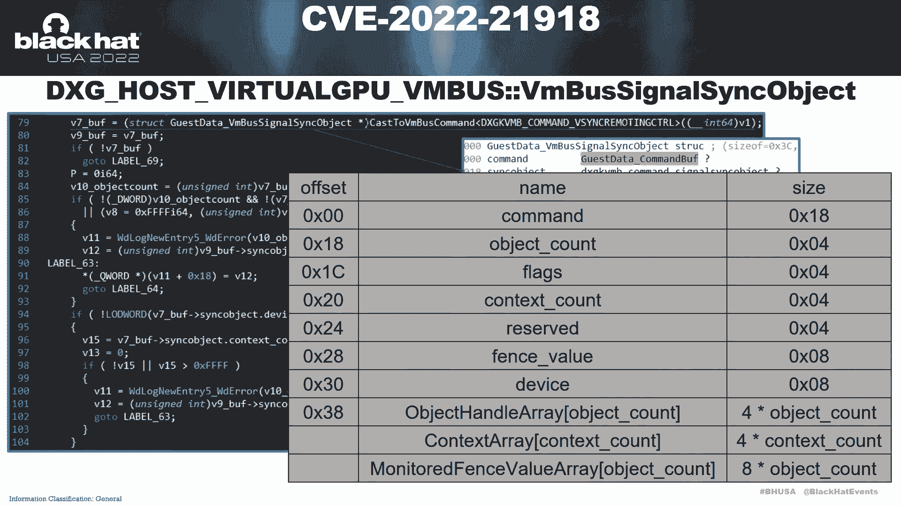

在 `dxghost_virtual_gpu_vmbus_channel` 函数中，第一个参数的 `fence_values` 成员被赋值为 `v24`。可以看到 `v24` 是 `v22` 的 `+0x50` 偏移。我们设置 `v22` 为 `this`。

现在我们需要理解 `DXGK_VMB_COMMAND` 命令消息的内存布局，如图所示。`sync_object` 成员是 `DXGK_VMB_COMMAND` 的消息体。在图中，`object_handle_array`、`context_array` 和 `monitor_fence_value` 是可变长度数组，它们的大小和偏移由 `object_count` 和 `context_count` 控制。

因此，如果 `return_object_count` 是 1，`context_count` 是 0，并且 `buffer_size` 是 0x3C，那么 `monitor_fence_value` 数组的第 17 个 `word` 偏移将是 8，`monitor_fence_value` 数组的第 18 个 `word` 偏移将是 0xC。然后，在图中 `v22` 等于 `buffer_size` 减去 `v18`，`v22` 等于 0，`v17` 等于 8。这意味着条件 `v22 < v17` 成立，`v24` 将被赋值为 0，这将在后续流程中导致空指针解引用。

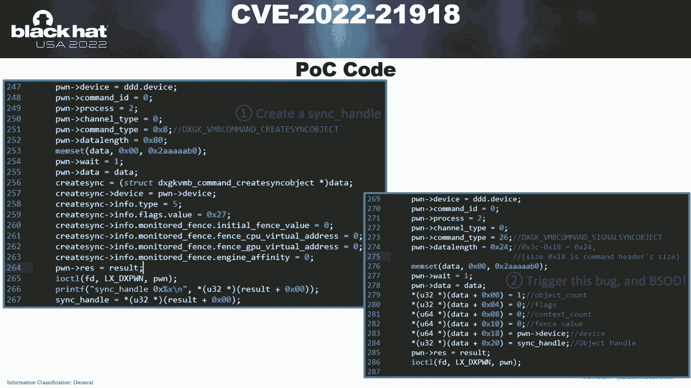

PoC 代码分为两部分。第一部分用于创建一个同步句柄，第二部分使用它发送 `DXGK_VMB_COMMAND` 命令消息。

### 案例二：CVE-2021-24019（空指针解引用）

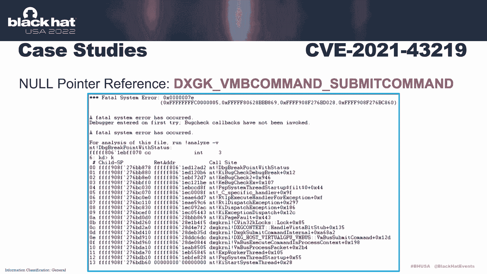

此漏洞问题出现在 `DXGK_VMB_COMMAND_SUBMIT_COMMAND` 命令中。下图是堆栈回溯。

在 `dxgk_submit_command_internal` 函数中，`dxgcontext_handle_submit_command` 函数的第二个参数是 `present_history_token`，而 `present_history_token` 的值可以由客户机控制。

在 `dxgcontext_handle_submit_command` 函数中，如果 `present_history_token` 小于等于零，控制流将进入此分支并调用 `SeLockSubjectContext` 函数。`SeLockSubjectContext` 函数的第一个参数是一个 `SE_SUBJECT_CONTEXT` 结构指针。当此漏洞被触发时，`SE_SUBJECT_CONTEXT` 结构的一些成员是非法的，最终导致蓝屏死机（BSOD）。

图中展示了 PoC 代码。第一部分是创建上下文句柄，第二部分发送提交命令消息。如图所示设置 `submit_cmd` 结构中的成员将触发此漏洞。在 PoC 代码中，`present_history_token` 被设置为 `this`。

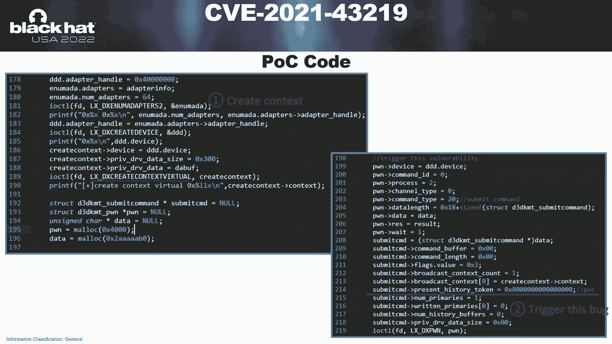

以下是调试过程。首先在 `dxgk_submit_command_internal` 的 0xAA69 处设置断点。调试器命中断点后，检查第二个参数 `present_history_token`，它小于 0x1。单步跟踪，直到调用 `SeLockSubjectContext`，并显示第一个参数指向的内存。可以看到 `SE_SUBJECT_CONTEXT` 结构中的许多成员未初始化。因此，在 `SeLockSubjectContext` 函数中引用了这些未初始化的值并导致崩溃。

### 案例三：CVE-2022-21912（任意地址读）

此漏洞问题出现在 `DXGK_VMB_COMMAND_WAIT_FOR_SYNCHRONIZATION_OBJECT_FROM_GPU` 命令中。下图是堆栈回溯。

`DXGK_VMB_COMMAND_WAIT_FOR_SYNCHRONIZATION_OBJECT_FROM_GPU` 命令消息的内存布局如图所示。

在 `dxghost_virtual_gpu_vmbus_channel_wait_for_synchronization_object_from_gpu` 函数中，如果 `flags` 的 `OBJECT` 位是 1，`sync_gpu_fence_value` 将被赋值给 `dst_fence_value`，并且 `v23` 将被赋值为 0。`dxgk_wait_for_synchronization_object_from_gpu_internal` 函数的第四个参数是 0（红色标记处），因为 `v5` 等于 0，`src_fence_value` 将被赋值给 `v5`，而 `src_fence_value` 可以由客户机控制。

在后续控制流中，`v5` 将被用作 `wait_for_synchronization_object_from_gpu` 函数的第三个参数。在 `wait_for_synchronization_object_from_gpu` 函数中，`v3` 等于 `a3`（红色标记处）。

PoC 代码分为三部分。第一部分是创建上下文句柄，第二部分是创建同步句柄，第三部分发送等待同步对象命令消息。如图所示设置成员将触发此漏洞，并从地址 `0x41414141` 读取数据。

以下是调试过程。在 `wait_for_synchronization_object_from_gpu` 的 0x1945 处设置断点。调试器命中断点后，检查 `rcx` 寄存器，其值是 `0x41414141`。我们可以从客户机控制这个寄存器。

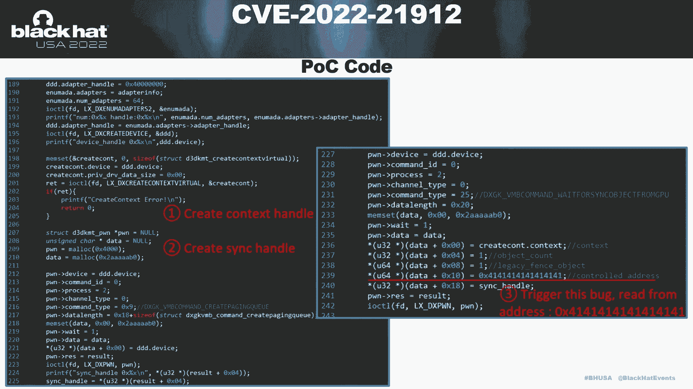

### 案例四：CVE-2022-23255（任意地址写）

此漏洞问题出现在 `DXGK_VMB_COMMAND_SUBMIT_WITH_PRESENT_HISTORY_TOKEN` 命令中。下图是堆栈回溯。

`DXGK_VMB_COMMAND_SUBMIT_WITH_PRESENT_HISTORY_TOKEN` 命令消息的内存布局如图所示。

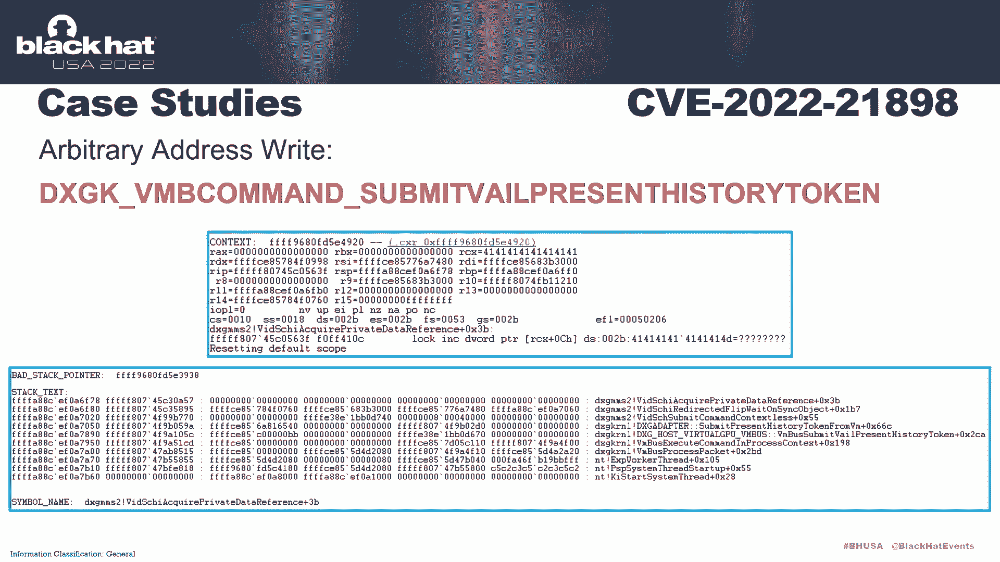

在 `dxghost_virtual_gpu_vmbus_channel_submit_with_present_history_token` 函数中，`present_unknown4` 被用作 `dxgadapter_submit_with_present_history_token_from_vmb` 函数的第七个参数。

在 `dxgadapter_submit_with_present_history_token_from_vmb` 函数中，`a7` 和 `unknown4` 被写入 `v29` 偏移 `0x300` 的地址。然后 `vidshi_submit_command_context` 函数将被调用。`v29` 是该函数的第一个参数，如图所示。

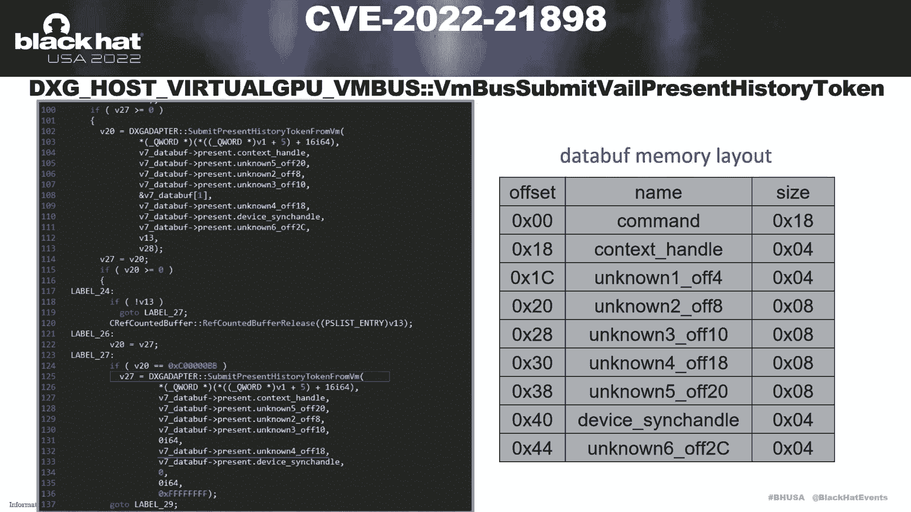

`vidshi_redirected_flip_with_unsync_object_command_context` 函数的第二个参数如图所示。在 `vidshi_acquire_private_data_reference` 函数中，当 `v2` 为 0 时，`a2` 偏移 `0xC8` 地址处的关键字值将被写入 `v6`。

`v2` 的值在 `vidshi_redirected_flip_with_unsync_object` 函数的 `0x238` 处是 `0x36`。`0x238` 处的 `0xC8` 等于 `0x300`。因此，`a2` 偏移 `0xC8` 地址处的关键字值就是 `dxgadapter_submit_with_present_history_token_from_vmb` 函数中的 `unknown4`。

以下是控制流：`0xC` 处的任意地址写，`v4` 等于 `unknown4`。

PoC 代码的第一部分是创建同步句柄，第二部分发送 `DXGK_VMB_COMMAND_SUBMIT_WITH_PRESENT_HISTORY_TOKEN` 命令消息。如图所示设置成员将触发此漏洞。

以下是调试过程，如图所示。当此漏洞被触发时，最终将导致任意地址写。

---

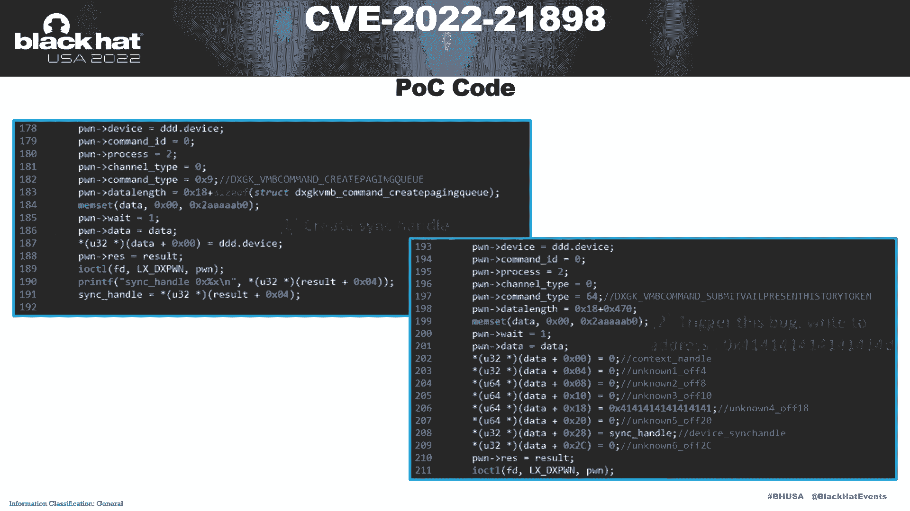

## 5. 模糊测试（Fuzzing）的必要性 🤖

上一节我们分析了具体漏洞，本节中我们讨论为什么模糊测试是必要的。

首先，Hyper-V DirectX 组件有大量的代码。其次，有 87 个命令，并且有对应的结构。许多命令依赖于句柄，例如，某些命令依赖于设备句柄、分配句柄。分配句柄的属性也会影响引用它的命令。在这种情况下，使用模糊测试更高效。上述漏洞都是通过模糊测试发现的。

一个简单的模糊测试架构如图所示。模糊器部署在客户机中。模糊器驱动部分的主要功能是代理层，用于将从用户模式程序获取的 Dxgk 内核命令数据发送到宿主机的 DirectX 组件，并接收来自宿主机 DirectX 组件的数据，然后将数据返回给用户模式程序。

模糊器用户态部分的主要功能是变异 Dxgk 内核命令数据，并接收从内核模块返回的数据，例如创建分配命令的返回数据。用户态模糊器包含两个核心模块：数据发送/接收模块用于与驱动通信，变异模块用于生成测试用例（例如，通过变异上述空指针解引用漏洞中提到的成员）。该漏洞就是被发现的。

---

## 6. 总结与展望 📚

在本课程中，我们一起学习了 Hyper-V DirectX 组件这一新的攻击面。

以下是我的一些观点。关于 Hyper-V DirectX 攻击面的安全研究，这个攻击面仍然值得研究，因为 Hyper-V DirectX 组件拥有巨大的攻击面，并且仍在更新中。

到目前为止，关于应用场景，Hyper-V DirectX 组件的应用场景包括 WDG、Windows Sandbox 和 HoloLens 模拟器。未来，支持 DirectX Online 的 3D 游戏可能成为可能。

但不幸的是，Hyper-V DirectX 不在 Hyper-V 漏洞赏金计划的范围内。不过，也要感谢 MSRC 耐心的沟通。

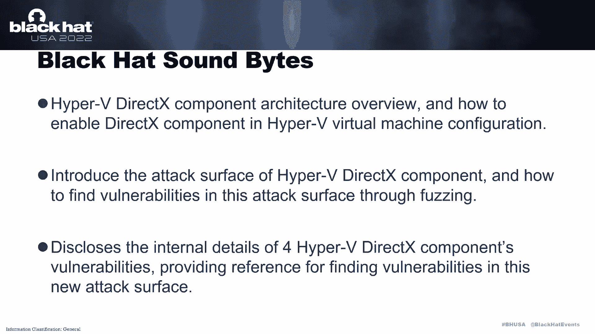

本演示中包含的三个要点如下：
1.  我介绍了 Hyper-V DirectX 组件的架构概述，以及如何在 Hyper-V 虚拟机配置中启用它。
2.  介绍了 Hyper-V DirectX 组件的攻击面，以及如何通过模糊测试在此攻击面中发现漏洞。
3.  披露了四个 Hyper-V DirectX 组件漏洞的内部细节，为在此新攻击面中发现漏洞提供了参考。