# 课程 P64：超级计算机规模神经网络模型在防御性网络安全中的应用 🛡️💻

在本节课中，我们将学习如何将GPT-3这类超大规模神经网络模型应用于防御性网络安全问题。我们将探讨其核心原理，并通过两个具体的概念验证实验，展示其在恶意命令行解析和垃圾邮件检测中的强大能力。

## 概述：大规模模型与网络安全的新机遇

近年来，神经网络模型的规模呈现爆炸式增长。研究界发现，仅仅扩大神经网络的参数规模，而不改变其基础架构，就能显著提升模型在各类任务上的表现。与此同时，一种名为“自监督学习”的训练方法使得我们能够利用海量未标记的Web规模数据进行训练。

在网络安全领域，我们日常部署的检测模型规模相对较小。本节课旨在探索，当我们将网络安全模型扩展到GPT-3这种超级计算机规模时，会产生哪些新的可能性。我们认为，这些新能力对提升网络安全防御至关重要。

## 模型规模与能力的跃升 📈

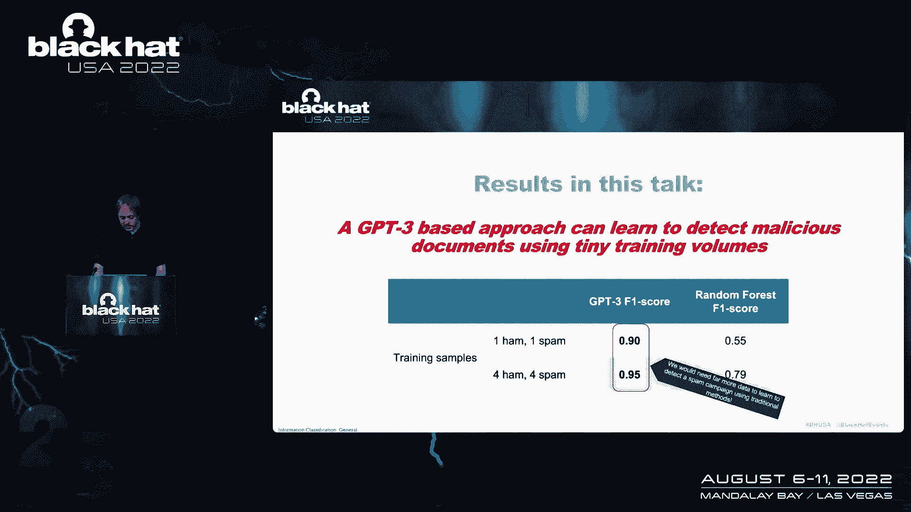

上一节我们介绍了模型规模增长的趋势，本节中我们来看看这种增长如何带来质变。

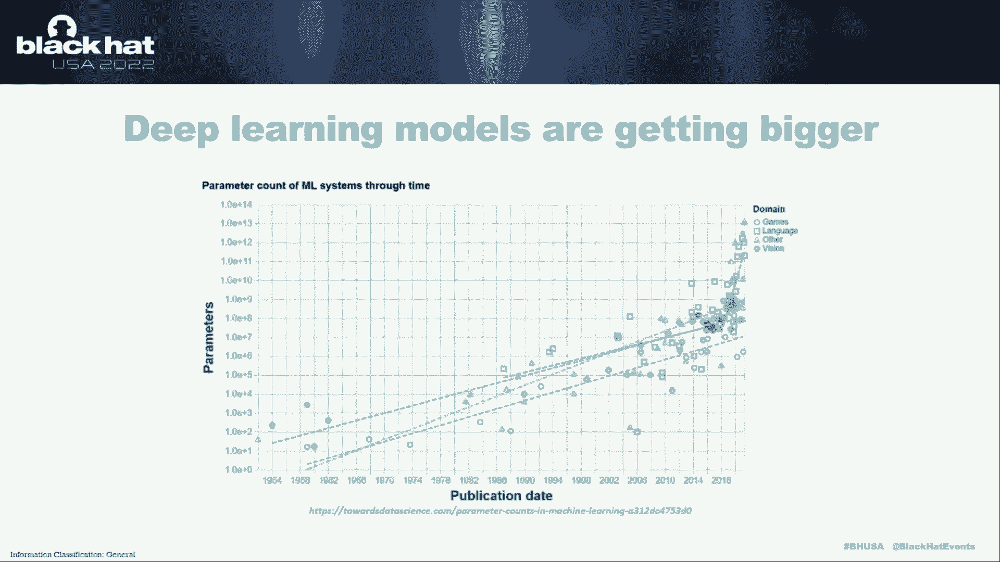

神经网络的能力与其参数数量密切相关。参数可理解为人工神经元之间的连接权重。过去五年，一个关键发现是：**单纯增加神经网络的宽度或深度（即参数数量），模型性能就会遵循可预测的规律提升**。

这种关系可以用一个对数线性图来清晰展示。从早期的千参数模型，到如今拥有数千亿参数的模型，规模的扩大直接带来了更低的错误率和全新的能力。

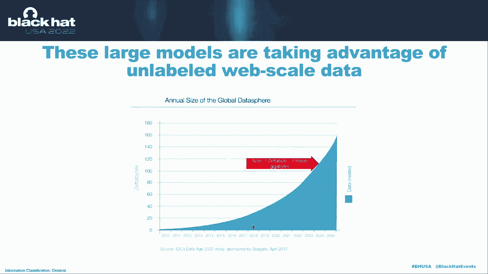

## 自监督学习：利用未标记数据的钥匙 🔑

仅有大规模模型还不够，我们还需要海量数据来训练它们。然而，网络安全等领域通常缺乏高质量的标记数据。这就是自监督学习发挥作用的地方。

自监督学习的核心思想是，**让模型从数据本身构造学习任务**，而无需人工标注。以下是几个关键示例：

*   **图像补全**：从图像中随机移除一块像素，让模型预测被移除部分的内容。为了完成这个任务，模型必须理解图像中的物体、结构和上下文。
*   **文本预测（如GPT-3）**：给定一段文本，让模型预测接下来的几个词或字符。为了准确预测，模型需要深入理解语言、逻辑甚至常识。

通过这种方式，我们可以利用整个互联网规模的文本、图像等未标记数据来预训练一个强大的基础模型。之后，我们只需要相对少量的标记数据对这个基础模型进行“微调”，就能使其适应特定的任务（如恶意软件检测）。

## GPT-3：一个文本领域的超级模型 🤖

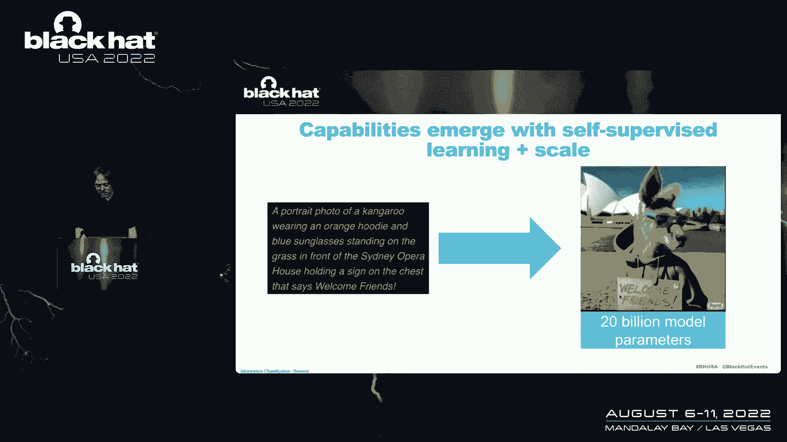

现在，让我们聚焦于本节课的核心工具——GPT-3。GPT-3正是通过上述“预测下一个词”的自监督方式，在超大规模文本数据上训练而成的。

由于其庞大的规模（1750亿参数）和广泛的训练数据，GPT-3展现出令人惊叹的“泛化”和“上下文学习”能力。例如：
*   给定提示“用Python写一个计算平均值的函数”，它能生成语法正确、功能可用的代码。
*   仅提供几个“好域名”和“坏域名”的例子，它就能对新域名进行准确分类。

**公式/代码描述其核心**：GPT-3本质上是一个概率模型，其目标是最大化序列数据的似然概率。
`P(output | input, context)`
在给定输入和上下文的情况下，计算最可能的输出序列。

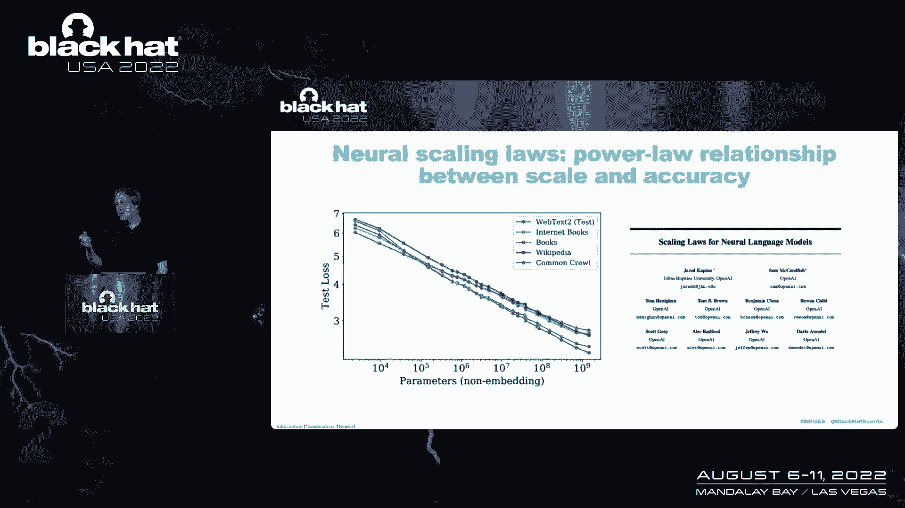

## 概念验证一：恶意命令行的自然语言解析 🖥️➡️📝

在网络安全分析中，分析师经常需要解析冗长且晦涩的系统命令行，这是一个高认知负荷的任务。我们的第一个实验是：**能否用GPT-3将复杂的恶意命令行翻译成易于理解的自然语言描述？**

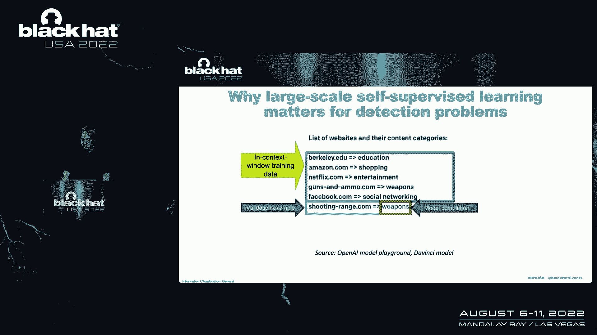

以下是我们的方法步骤：

1.  **设计提示（Prompt）**：我们为GPT-3设计了一个包含“命令行”和“对应描述”的示例模板。
2.  **结合安全上下文**：为了提高描述准确性，我们将安全检测规则（如Sigma规则）的信息也加入提示中，为模型提供额外的威胁背景知识。
3.  **反向翻译验证**：为了评估生成描述的质量，我们让模型根据描述“反向生成”命令行，并与原始命令进行比较。相似度越高，说明原描述越准确。

**实验结果**：GPT-3成功地将诸如 `cmd /c copy /b \system32\calc.exe \temp\evil.exe & \temp\evil.exe` 的命令行，翻译为“该命令会将calc.exe二进制文件复制到临时目录并重命名为evil.exe执行，这是一种攻击者用于持久化恶意软件的技术”。这极大地降低了分析人员的认知负担。

## 概念验证二：小样本垃圾邮件检测 📧🚫

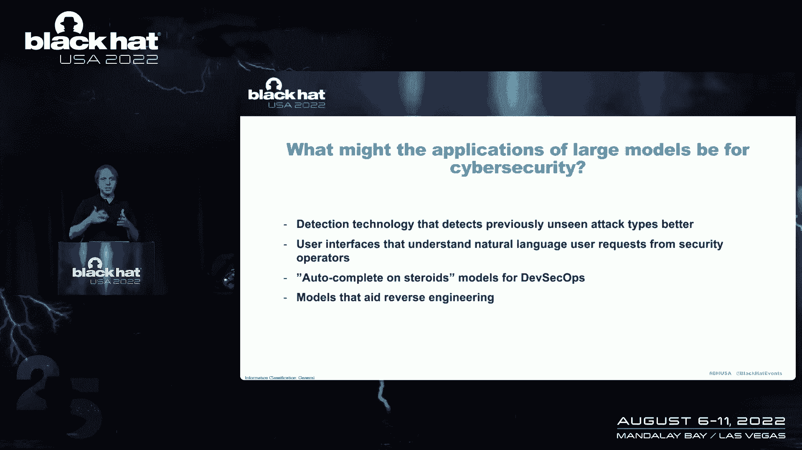

传统的机器学习模型需要大量标记数据才能达到可用的精度。我们的第二个实验是：**GPT-3能否仅用极少的例子（小样本学习），就建立一个有效的垃圾邮件检测器？**

以下是实验设置与对比：

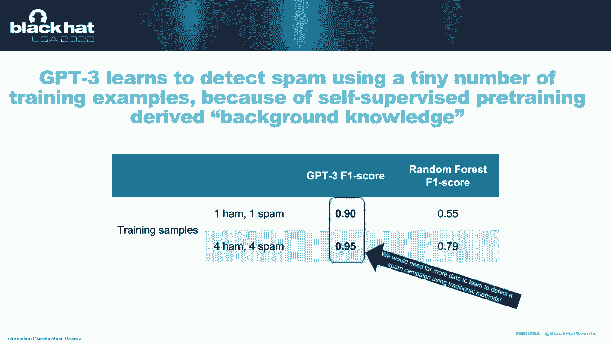

*   **GPT-3方法**：我们仅使用**5个垃圾邮件和5个正常邮件**的样本作为提示，让GPT-3学习分类模式，然后对新的邮件进行分类。
*   **传统模型对比**：我们使用相同的10个样本训练一个传统的随机森林模型。

**结果对比**：
*   GPT-3的检测准确率超过了**90%**。
*   传统随机森林模型的准确率仅略高于50%（接近随机猜测）。

这个结果证明，**超大规模预训练模型能够将其在广泛数据中学到的知识，快速迁移到特定的网络安全任务上**，即使在标记数据极其稀缺的情况下也能表现优异。

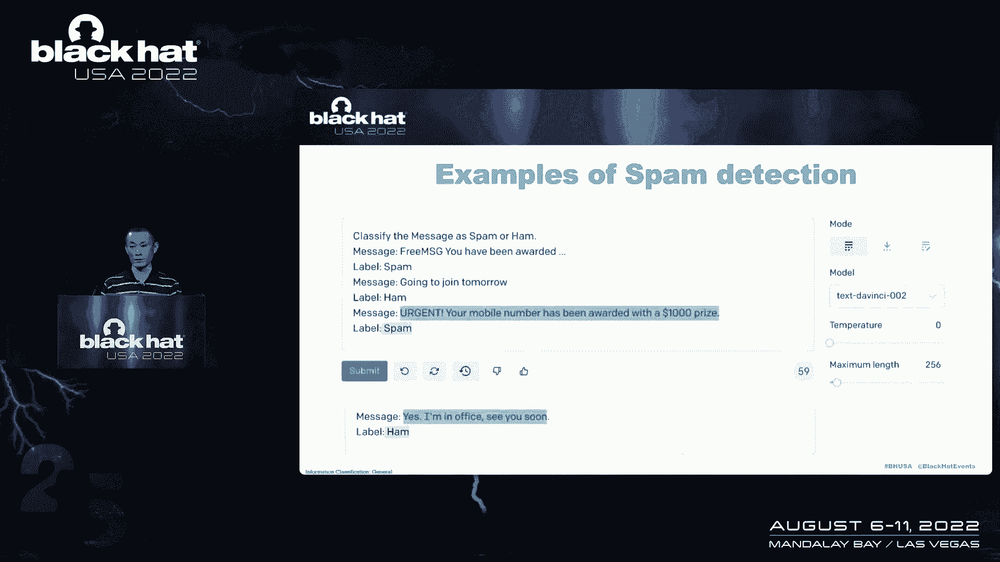

## 总结与展望 🚀

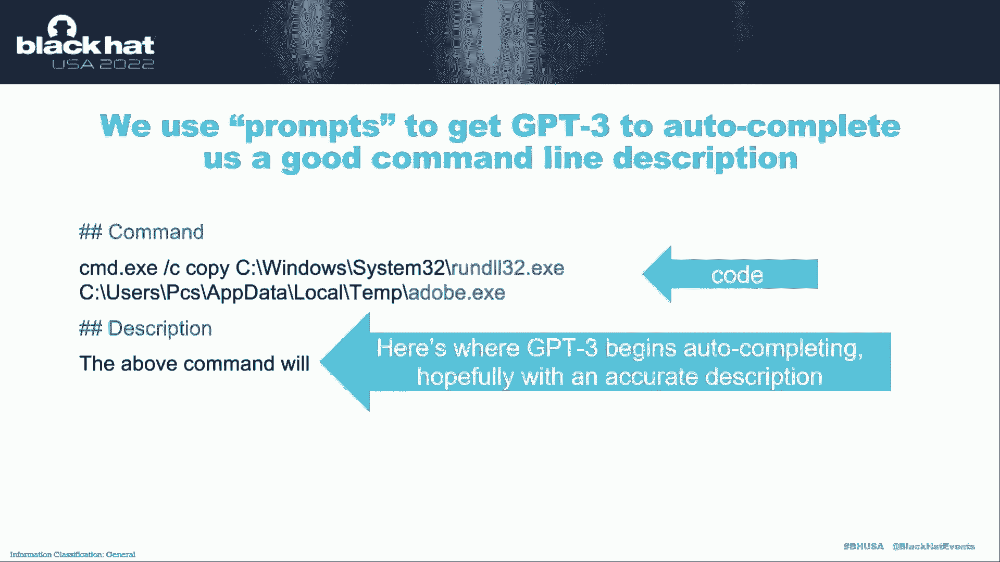

本节课中我们一起学习了：

1.  **模型规模的重要性**：超大规模的神经网络模型（如GPT-3）因其参数量的巨幅增长，获得了前所未有的泛化和上下文学习能力。
2.  **自监督学习的关键作用**：它允许我们利用海量未标记的Web数据训练基础模型，为后续的微调奠定坚实基础。
3.  **在网络安全中的防御性应用**：
    *   **恶意命令行解析**：GPT-3可以将晦涩的命令行转化为清晰的自然语言描述，提升安全分析效率。
    *   **小样本威胁检测**：GPT-3仅需极少样本就能达到高精度检测，为快速应对新型威胁提供了可能。

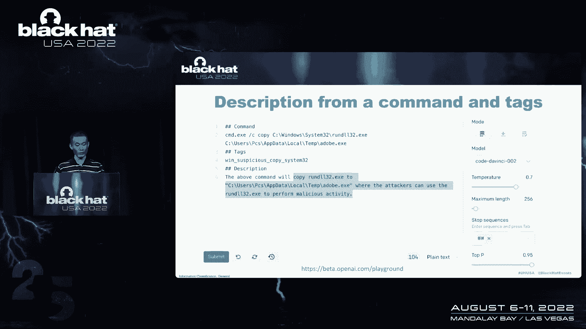

这些概念验证实验仅仅是开始。我们希望安全研究社区能够在此基础上，继续探索大规模模型在威胁狩猎、安全日志分析、漏洞代码识别等更多防御性场景中的应用。未来，结合领域专业知识与大模型能力，必将开创网络安全智能防御的新局面。

---

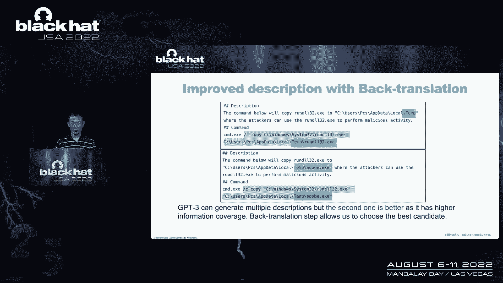

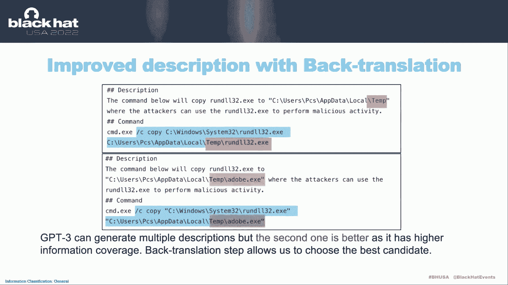

**核心公式/概念回顾**：
*   **模型缩放定律**：`性能 ∝ log(模型参数)`
*   **自监督学习目标**：`L = -Σ log P(x_t | x_<t)`, 其中 `x` 是数据序列。
*   **GPT-3提示学习**：`输出 = GPT3(任务描述 + 少量示例 + 新输入)`

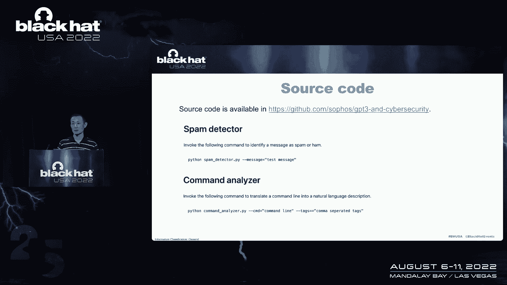

感谢收听。